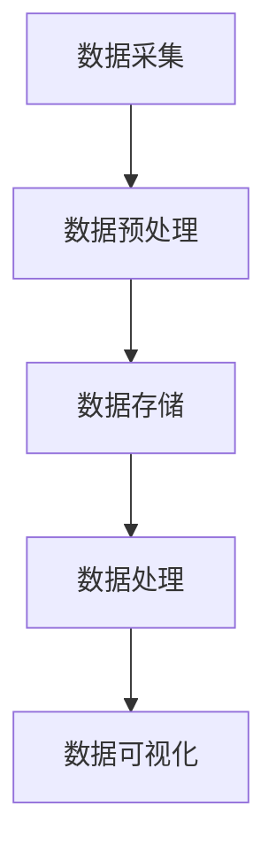
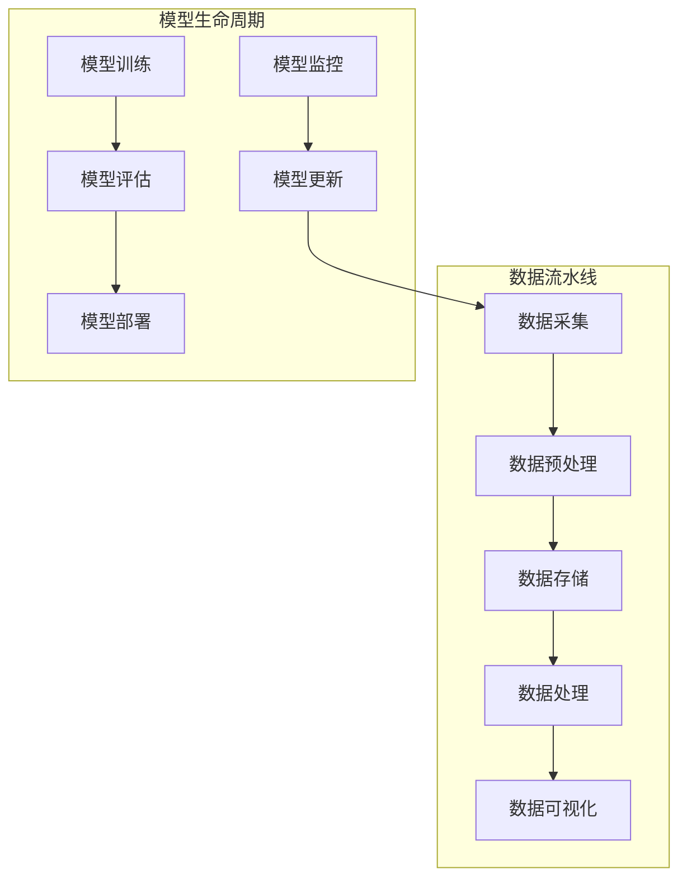

                 

### 文章标题

《数据流水线在LLM工程架构中的重要性》

> 关键词：数据流水线、语言模型、工程架构、数据处理、性能优化

> 摘要：本文深入探讨了数据流水线在大型语言模型（LLM）工程架构中的重要性。通过详细分析数据流水线的定义、架构及其在LLM中的应用，本文揭示了数据流水线对LLM性能、效率和可靠性的关键影响。此外，文章还探讨了数据流水线在不同阶段的优化策略，提供了实际的案例分析和最佳实践，为LLM工程实践提供了宝贵的参考。

---

### 数据流水线概述

数据流水线（Data Pipeline）是一种自动化数据处理流程，它将数据从源系统提取、清洗、转换、加载到目标系统。数据流水线的设计和实现对于大规模数据处理任务至关重要，尤其是在处理海量数据和高频数据更新的场景下。数据流水线的核心作用在于：

1. **数据采集**：从各种数据源（如数据库、日志文件、Web服务等）中收集数据。
2. **数据预处理**：对采集到的数据进行清洗、转换和格式化，以适应后续处理需求。
3. **数据存储**：将预处理后的数据存储到合适的存储系统中，以便后续分析和查询。
4. **数据处理**：对存储后的数据进行计算、分析，以提取有价值的信息。
5. **数据可视化**：将分析结果以图表或报告的形式呈现，便于理解和决策。

在LLM工程架构中，数据流水线的重要性体现在以下几个方面：

1. **数据完整性**：确保输入数据的高质量，避免模型训练过程中的数据偏差和误差。
2. **数据一致性**：保持数据格式和结构的一致性，以简化后续数据处理和分析。
3. **数据处理效率**：通过优化数据流处理流程，提高数据处理速度和响应时间。
4. **系统稳定性**：确保数据流水线在不同环境下的稳定运行，降低系统故障风险。

数据流水线的架构通常包括以下模块：

- **数据采集模块**：负责从各种数据源中提取数据。
- **数据预处理模块**：对采集到的数据进行清洗、转换和格式化。
- **数据存储模块**：将预处理后的数据存储到目标存储系统中。
- **数据处理模块**：对存储后的数据进行计算、分析和处理。
- **数据可视化模块**：将分析结果以图表或报告的形式呈现。


通过上述模块的协同工作，数据流水线能够实现高效、稳定的数据处理流程，为LLM工程架构提供坚实的数据基础。

#### 核心概念与联系

数据流水线是一个复杂的系统，其核心概念包括数据采集、数据预处理、数据存储、数据处理和数据可视化。这些概念之间的关系如图所示：

```
数据采集 → 数据预处理 → 数据存储 → 数据处理 → 数据可视化
```

**Mermaid 流程图：**



**核心算法原理讲解：**

数据流水线的核心算法包括数据清洗算法、数据转换算法和数据聚合算法。

- **数据清洗算法**：用于处理缺失值、重复值、异常值等问题。常见的算法有：

  ```python
  # 删除缺失值
  df.dropna(inplace=True)

  # 删除重复值
  df.drop_duplicates(inplace=True)

  # 处理异常值
  from scipy import stats
  df = df[(np.abs(stats.zscore(df)) < 3).all(axis=1)]
  ```

- **数据转换算法**：用于将数据格式转换为适合处理的形式。常见的算法有：

  ```python
  # 数据类型转换
  df['column'] = df['column'].astype('int')

  # 数据归一化
  from sklearn.preprocessing import MinMaxScaler
  scaler = MinMaxScaler()
  df['column'] = scaler.fit_transform(df[['column']])
  ```

- **数据聚合算法**：用于对数据进行汇总和聚合。常见的算法有：

  ```python
  # 数据分组聚合
  df_grouped = df.groupby('column1')['column2'].sum().reset_index()
  ```

**数学模型和公式：**

- **数据质量评估模型**：用于评估数据质量。

  $$ Q = \frac{L - D}{L + D} $$

  其中，$Q$ 是数据质量评分，$L$ 是数据正确性分数，$D$ 是数据错误性分数。

- **数据安全性模型**：用于评估数据安全性能。

  $$ S = \frac{C - R}{C + R} $$

  其中，$S$ 是数据安全性评分，$C$ 是数据完整性分数，$R$ 是数据可靠性分数。

**详细讲解与举例说明：**

- **数据清洗**：假设我们有一个学生成绩数据集，其中包含成绩缺失值和异常值。使用Python进行数据清洗的步骤如下：

  ```python
  # 导入数据集
  df = pd.read_csv('student_scores.csv')

  # 删除缺失值
  df.dropna(inplace=True)

  # 删除异常值
  from scipy import stats
  df = df[(np.abs(stats.zscore(df)) < 3).all(axis=1)]
  ```

- **数据转换**：假设我们有一个学生成绩数据集，其中成绩是以字符串形式存储的。使用Python进行数据转换的步骤如下：

  ```python
  # 导入数据集
  df = pd.read_csv('student_scores.csv')

  # 数据类型转换
  df['score'] = df['score'].astype('int')
  ```

- **数据聚合**：假设我们想要计算每个班级的平均成绩。使用Python进行数据聚合的步骤如下：

  ```python
  # 导入数据集
  df = pd.read_csv('student_scores.csv')

  # 数据分组聚合
  df_grouped = df.groupby('class')['score'].mean().reset_index()
  ```

通过上述步骤，我们能够有效地处理学生成绩数据集，为后续的数据分析提供高质量的数据基础。

---

### 语言模型（LLM）工程架构概述

#### 语言模型（LLM）的定义

语言模型（Language Model，简称LLM）是一种基于人工智能技术，用于生成或理解自然语言文本的计算机模型。它通过学习大量语言数据，能够预测下一个单词或句子的概率，从而实现文本生成、文本分类、机器翻译等任务。LLM的核心目标是提高自然语言处理（Natural Language Processing，简称NLP）系统的准确性和流畅性，使其在理解和生成自然语言方面更接近人类。

#### LLM的工程架构

LLM的工程架构通常包括以下几个关键组件：

1. **数据采集模块**：负责收集和存储用于训练和评估LLM的数据。数据源可以是公开的语料库、企业内部的文本数据等。

2. **数据处理模块**：对采集到的数据进行预处理，包括分词、去停用词、词向量化等操作。预处理后的数据用于训练和优化LLM模型。

3. **模型训练模块**：使用预处理后的数据训练LLM模型。训练过程中，模型通过不断调整参数，以降低预测误差，提高生成文本的准确性和流畅性。

4. **模型推理模块**：在模型训练完成后，使用推理模块对输入文本进行预测和生成。推理过程包括文本编码、模型计算和文本解码等步骤。

5. **模型评估模块**：对训练好的LLM模型进行评估，以验证其性能。评估指标包括词汇覆盖率、BLEU分数、ROUGE分数等。

#### LLM的关键组件

1. **预训练模型**：如GPT、BERT等，这些模型在大规模语料库上进行预训练，具有良好的通用性和泛化能力。

2. **优化器**：用于调整模型参数，以提高模型性能。常见的优化器有Adam、AdaGrad等。

3. **学习率调度器**：用于控制学习率的变化，以防止模型过度拟合。常见的学习率调度器有常数学习率、学习率衰减等。

4. **文本编码器**：将自然语言文本转换为模型可处理的数字形式。常见的编码器有Word2Vec、BERT等。

5. **解码器**：将模型输出的数字形式转换为自然语言文本。常见的解码器有贪心解码、Beam Search等。

#### LLM工程架构的发展趋势

随着人工智能技术的快速发展，LLM工程架构也在不断演进。以下是LLM工程架构的发展趋势：

1. **模型规模不断扩大**：随着计算资源和存储能力的提升，LLM的模型规模也在不断增大。例如，GPT-3拥有超过1750亿个参数。

2. **多模态语言模型**：传统的LLM主要针对文本数据，但多模态语言模型（如视觉-文本语言模型）正在成为研究热点，能够同时处理文本和图像等多模态数据。

3. **自适应学习**：未来的LLM将具备自适应学习能力，能够根据用户的需求和场景动态调整模型参数，实现个性化文本生成和推理。

4. **可解释性**：随着模型规模的增大，模型的可解释性变得越来越重要。未来的LLM将更加注重可解释性，帮助用户理解模型的工作原理和预测结果。

5. **分布式训练和推理**：为了应对大规模数据处理和实时推理的需求，分布式训练和推理技术将成为LLM工程架构的重要组成部分。

总之，LLM工程架构在未来的发展中将继续融合新的技术趋势，不断提升模型的性能和应用范围。

#### 数据流水线与LLM工程架构的联系

数据流水线在LLM工程架构中扮演着至关重要的角色。其重要性主要体现在以下几个方面：

1. **数据采集**：数据采集是整个LLM工程架构的起点。数据流水线负责从各种来源（如公开语料库、企业内部数据等）收集数据，为LLM的训练提供充足且高质量的数据资源。

2. **数据预处理**：数据预处理是提高模型训练效果的关键环节。数据流水线通过清洗、转换和格式化等操作，确保输入数据的一致性和质量，为模型训练打下坚实基础。

3. **数据存储**：数据存储模块负责将预处理后的数据存储到高效的存储系统中，以便后续的数据处理和分析。数据流水线通过优化数据存储策略，确保数据快速读取和写入，提高整个系统的性能。

4. **数据处理**：数据处理模块对存储后的数据进行计算和分析，以提取有价值的信息。数据流水线通过优化数据处理流程，提高数据计算速度和准确性，为LLM的推理和评估提供高效支持。

5. **数据可视化**：数据可视化模块将分析结果以图表或报告的形式呈现，帮助用户更好地理解数据和模型性能。数据流水线通过优化数据可视化工具和接口，提高数据可视化的效果和用户体验。

数据流水线对LLM工程架构的影响主要体现在以下几个方面：

1. **性能优化**：通过优化数据流水线中的各个模块，可以提高数据处理的效率，减少模型的训练时间和推理时间，从而提升整个系统的性能。

2. **成本控制**：优化数据流水线可以降低数据处理和存储的成本，减少硬件和人力资源的投入，提高企业的经济效益。

3. **可靠性提升**：优化数据流水线中的数据存储和传输机制，可以提高系统的可靠性和稳定性，降低数据丢失和传输错误的风险。

4. **安全性增强**：数据流水线可以集成安全模块，对数据进行加密和访问控制，确保数据的安全性和隐私性，提高系统的安全防护能力。

5. **可扩展性**：通过模块化设计，数据流水线可以方便地扩展和升级，以适应不断变化的数据处理需求和LLM模型规模的增长。

数据流水线与LLM工程架构的协同效应：

1. **高效协同**：数据流水线与LLM工程架构的各个模块紧密协作，实现数据的高效采集、处理和分析，提高整个系统的运行效率。

2. **资源共享**：数据流水线中的数据处理模块可以与LLM的训练和推理模块共享计算资源和存储资源，降低系统整体的开销。

3. **智能化**：通过引入智能算法和机器学习技术，数据流水线可以自动化地优化数据采集、预处理和存储策略，实现数据处理的智能化。

4. **灵活性**：数据流水线可以灵活地适应不同的LLM应用场景和数据处理需求，为LLM工程架构提供强大的支持。

综上所述，数据流水线在LLM工程架构中具有重要的地位和作用。通过优化数据流水线，可以显著提升LLM的性能、效率和可靠性，为自然语言处理领域的研究和应用带来更大的价值。

### 数据流水线在数据采集与预处理中的关键环节

在LLM工程架构中，数据采集与预处理是数据流水线的两个关键环节，直接影响到模型训练的质量和效果。以下是这两个环节中的一些重要任务和具体操作：

#### 数据采集

数据采集是数据流水线的第一步，其目标是收集足够的、高质量的原始数据。以下是一些关键任务：

1. **数据源选择**：确定数据采集的目标来源，如公开的语料库、社交媒体、企业内部数据等。
2. **数据提取**：使用爬虫、API调用或其他数据获取工具从数据源中提取文本数据。
3. **数据清洗**：去除重复、无关或错误的数据，确保数据集的一致性和完整性。

具体操作步骤如下：

1. **数据源选择**：根据LLM的应用场景，选择合适的数据源。例如，对于语言生成任务，可以选择公开的文本数据集，如Wikipedia、新闻文章等。

2. **数据提取**：使用Python的requests库或Scrapy框架等工具，从Web页面中提取文本数据。以下是一个简单的示例代码：

   ```python
   import requests
   
   url = 'https://example.com/data'
   response = requests.get(url)
   data = response.text
   ```

3. **数据清洗**：使用Python的pandas库对提取到的数据集进行清洗。以下是一个简单的数据清洗示例：

   ```python
   import pandas as pd
   
   df = pd.read_csv('data.csv')
   df.drop_duplicates(inplace=True)
   df.dropna(inplace=True)
   ```

#### 数据预处理

数据预处理是对采集到的原始数据进行清洗、转换和格式化，以便于模型训练。以下是一些关键任务：

1. **文本清洗**：去除无关字符、符号和停用词，提高数据的纯净度。
2. **分词**：将文本分割成单词或词组，以便进行后续处理。
3. **词向量化**：将文本转换为数字形式，便于模型计算。常用的词向量化方法有Word2Vec、BERT等。

具体操作步骤如下：

1. **文本清洗**：使用Python的re模块去除无关字符和符号，使用nltk库去除停用词。以下是一个简单的文本清洗示例：

   ```python
   import re
   from nltk.corpus import stopwords
   
   text = 'This is an example text, with some punctuation!'
   text = re.sub(r'[^\w\s]', '', text)
   text = ' '.join([word for word in text.split() if word not in stopwords.words('english')])
   ```

2. **分词**：使用Python的nltk库或jieba库对文本进行分词。以下是一个简单的分词示例：

   ```python
   import jieba
   
   text = '这是一段中文文本，用于分词测试。'
   words = jieba.cut(text)
   ```

3. **词向量化**：使用GloVe、Word2Vec或BERT等词向量化工具将文本转换为数字形式。以下是一个简单的Word2Vec示例：

   ```python
   import gensim
   
   sentences = [['这句话', '是一个', '例子'], ['这是一个', '测试', '用例']]
   model = gensim.models.Word2Vec(sentences, vector_size=100, window=5, min_count=1, workers=4)
   ```

通过以上数据采集和预处理步骤，我们能够获得高质量的、适合模型训练的数据集，为后续的LLM工程架构提供坚实的基础。

#### 数据存储与管理

数据存储与管理是数据流水线中的关键环节，其重要性在于确保数据的安全、可靠和高效访问。以下是数据存储与管理在LLM工程架构中的重要任务和具体操作：

1. **数据存储方案选择**：根据数据量和访问模式选择合适的存储方案，如关系数据库、NoSQL数据库、分布式文件系统等。

2. **数据索引与查询优化**：建立有效的数据索引，优化查询性能，确保数据能够快速读取和写入。

3. **数据备份与恢复**：定期备份数据，确保在发生故障或数据丢失时能够快速恢复。

4. **数据访问控制与权限管理**：实现数据访问控制，确保只有授权用户能够访问数据，保护数据的安全性和隐私性。

具体操作步骤如下：

1. **数据存储方案选择**：
   - 对于小规模数据，可以使用关系数据库如MySQL或PostgreSQL，它们提供强大的查询功能和事务支持。
   - 对于大规模数据和高吞吐量场景，可以选择NoSQL数据库如MongoDB或Cassandra，它们能够提供水平扩展和高性能读写能力。
   - 对于超大规模数据，分布式文件系统如Hadoop HDFS或Apache HBase可能是更好的选择，它们能够处理海量数据并实现高效存储和计算。

2. **数据索引与查询优化**：
   - 使用B树、哈希表等索引结构，加快数据检索速度。
   - 根据查询模式优化索引策略，如创建复合索引、使用全文索引等。
   - 定期分析查询性能，调整索引和查询策略，以提升系统性能。

3. **数据备份与恢复**：
   - 定期使用备份工具（如rsync、tar等）对数据存储系统进行备份。
   - 在备份过程中，确保数据的一致性和完整性，避免出现数据丢失或损坏。
   - 设计数据恢复策略，如快速恢复、完全恢复等，确保在发生故障时能够快速恢复数据。

4. **数据访问控制与权限管理**：
   - 使用访问控制列表（ACL）或角色访问控制（RBAC）机制，限制对数据的访问权限。
   - 实现用户认证和授权机制，确保只有经过授权的用户才能访问数据。
   - 定期审计和监控数据访问情况，及时发现和防范潜在的安全风险。

通过上述操作，我们能够构建一个高效、安全的数据存储与管理系统，为LLM工程架构提供稳定可靠的数据支持。

#### 数据计算与处理

在LLM工程架构中，数据计算与处理是确保模型训练效果和效率的关键环节。这一环节主要包括数据计算架构的设计、数据处理算法的应用、优化策略的制定和具体实现。以下是这些方面的详细讨论。

##### 数据计算架构

数据计算架构是数据流水线中的重要组成部分，其设计直接影响到数据处理的速度和效率。一个高效的数据计算架构通常需要考虑以下几个方面：

1. **计算资源分配**：根据数据量和计算需求，合理分配计算资源，确保系统有足够的处理能力。
2. **并行处理**：通过并行处理技术，将大规模数据处理任务分解成多个子任务，并行执行，以提高处理速度。
3. **分布式计算**：使用分布式计算框架（如Apache Spark、Hadoop等），将计算任务分布到多个节点上执行，实现高效的数据处理。
4. **缓存机制**：利用缓存机制（如Redis、Memcached等），缓存经常访问的数据，减少数据读取时间，提高系统性能。

##### 数据处理算法

数据处理算法是数据计算与处理的核心，直接影响模型的训练效果和效率。以下是几个常用的数据处理算法：

1. **特征工程**：特征工程是指通过选择、构造和转换数据特征，提高模型训练效果的过程。常见的特征工程方法包括：
   - **特征选择**：选择对模型训练最有影响力的特征，减少冗余特征，提高模型泛化能力。
   - **特征构造**：通过组合现有特征或引入新特征，增强模型对数据变化的敏感性。
   - **特征转换**：将数值型特征转换为类别型特征，或对类别型特征进行编码，提高数据处理效率。

2. **降维算法**：降维算法通过降低数据维度，减少计算复杂度，同时保持数据的主要信息。常见的降维算法包括：
   - **主成分分析（PCA）**：通过求解数据的主要成分，降低数据维度，同时保留主要信息。
   - **线性判别分析（LDA）**：通过最大化类间散度，最小化类内散度，降低数据维度。

3. **归一化和标准化**：归一化和标准化是将数据缩放到相同的范围，以提高模型训练的稳定性和收敛速度。常见的归一化和标准化方法包括：
   - **归一化**：将数据缩放到[0, 1]或[-1, 1]之间。
   - **标准化**：将数据缩放到均值为0、标准差为1的范围内。

##### 数据计算与处理优化

为了提高数据计算与处理的效率，可以采取以下优化策略：

1. **并行化**：通过并行处理技术，将大规模数据处理任务分解成多个子任务，并行执行，以提高处理速度。
2. **分布式计算**：使用分布式计算框架，将计算任务分布到多个节点上执行，实现高效的数据处理。
3. **缓存优化**：通过缓存机制，减少数据读取时间，提高系统性能。
4. **内存管理**：合理分配内存资源，避免内存泄漏和溢出，确保系统稳定运行。
5. **算法优化**：选择高效的算法和优化方法，减少计算复杂度和资源消耗。

##### 具体实现

以下是数据计算与处理的一个具体实现示例，使用Python和Scikit-learn库：

```python
import numpy as np
from sklearn.preprocessing import StandardScaler
from sklearn.decomposition import PCA
from sklearn.pipeline import make_pipeline

# 假设我们有一个包含1000个样本和10个特征的数据集
X = np.random.rand(1000, 10)

# 使用标准化和PCA进行数据预处理
scaler = StandardScaler()
pca = PCA(n_components=5)
pipeline = make_pipeline(scaler, pca)

# 训练预处理管道
X_processed = pipeline.fit_transform(X)

# 输出处理后的数据
print(X_processed)
```

通过上述代码，我们首先使用标准化将数据缩放到均值为0、标准差为1的范围内，然后使用PCA将数据维度降低到5，以提高数据处理效率。

##### 总结

数据计算与处理在LLM工程架构中起着至关重要的作用。通过合理设计数据计算架构、应用高效的数据处理算法和优化策略，可以显著提高模型训练效果和效率，为LLM工程实践提供坚实的技术支持。

### 数据分析与可视化

在LLM工程架构中，数据分析与可视化是理解和评估模型性能、优化系统性能的重要环节。通过有效的数据分析与可视化工具，我们可以将复杂的数据处理和分析过程直观地展示出来，帮助用户更好地理解数据模式和模型行为。

#### 数据分析方法

数据分析方法主要包括以下几个方面：

1. **描述性统计分析**：通过计算数据的平均数、中位数、标准差等基本统计量，了解数据的分布和特征。例如，我们可以使用Python的pandas库进行描述性统计分析：

   ```python
   import pandas as pd
   
   df = pd.read_csv('data.csv')
   print(df.describe())
   ```

2. **回归分析**：通过建立回归模型，分析自变量和因变量之间的关系。例如，我们可以使用Python的scikit-learn库进行线性回归分析：

   ```python
   from sklearn.linear_model import LinearRegression
   from sklearn.model_selection import train_test_split
   
   X = df[['feature1', 'feature2']]
   y = df['target']
   X_train, X_test, y_train, y_test = train_test_split(X, y, test_size=0.2, random_state=42)
   model = LinearRegression()
   model.fit(X_train, y_train)
   print(model.coef_)
   ```

3. **聚类分析**：通过将数据划分为多个类别，发现数据中的隐含模式和结构。例如，我们可以使用Python的scikit-learn库进行K均值聚类：

   ```python
   from sklearn.cluster import KMeans
   from sklearn.metrics import silhouette_score
   
   X = df[['feature1', 'feature2']]
   kmeans = KMeans(n_clusters=3, random_state=42)
   kmeans.fit(X)
   labels = kmeans.predict(X)
   print(silhouette_score(X, labels))
   ```

4. **关联规则分析**：通过挖掘数据之间的关联关系，发现数据中的规律和模式。例如，我们可以使用Python的apyori库进行关联规则分析：

   ```python
   from apyori import apriori
   
   transactions = [[1, 2, 3], [2, 3, 4], [1, 3, 4]]
   rules = apriori(transactions, min_support=0.5, min_confidence=0.7)
   for rule in rules:
       print(rule)
   ```

#### 数据可视化工具

数据可视化工具可以帮助我们将复杂的数据分析结果直观地展示出来，常见的可视化工具包括：

1. **Matplotlib**：Python的一个强大的可视化库，可以生成各种类型的图表，如折线图、柱状图、散点图等。

   ```python
   import matplotlib.pyplot as plt
   
   x = [1, 2, 3, 4, 5]
   y = [2, 4, 6, 8, 10]
   plt.plot(x, y)
   plt.xlabel('X-axis')
   plt.ylabel('Y-axis')
   plt.title('Example Plot')
   plt.show()
   ```

2. **Seaborn**：基于Matplotlib的一个高级可视化库，提供丰富的统计图表，能够生成更加美观和专业的图表。

   ```python
   import seaborn as sns
   
   sns.set(style="whitegrid")
   df = sns.load_dataset('iris')
   sns.pairplot(df, hue="species")
   plt.show()
   ```

3. **Plotly**：一个交互式可视化库，可以生成高度交互式的图表和仪表盘。

   ```python
   import plotly.express as px
   
   df = px.read_csv('data.csv')
   fig = px.line(df, x='timestamp', y='value', title='Time Series Data')
   fig.show()
   ```

#### 数据分析在LLM工程架构中的应用

在LLM工程架构中，数据分析与可视化主要用于以下几个方面：

1. **模型评估**：通过数据分析与可视化，评估模型的性能和效果。例如，可以使用ROC曲线、Precision-Recall曲线等指标，直观地展示模型的分类效果。

2. **参数调优**：通过数据分析与可视化，探索不同参数设置对模型性能的影响，帮助优化模型参数。

3. **故障诊断**：通过数据分析与可视化，发现系统中的故障和异常，及时进行故障诊断和修复。

4. **性能监控**：通过数据分析与可视化，监控系统的运行状态和性能指标，及时发现和处理潜在的性能问题。

#### 数据可视化在LLM工程架构中的重要性

数据可视化在LLM工程架构中具有重要性，主要体现在以下几个方面：

1. **提高可理解性**：通过直观的图表和图形，将复杂的数据处理和分析结果展示出来，提高用户对系统运行状态的认知和理解。

2. **辅助决策**：通过数据分析与可视化，提供有价值的信息和见解，辅助用户做出更明智的决策。

3. **性能优化**：通过可视化工具，监控系统的运行状态和性能指标，帮助用户发现性能瓶颈和优化空间，提升系统的整体性能。

4. **用户参与**：数据可视化使得用户能够更好地参与系统开发和使用过程，通过实时反馈和互动，提升用户体验。

总之，数据分析与可视化在LLM工程架构中发挥着重要的作用，通过有效的数据分析和可视化工具，可以提高模型的性能、优化系统设计和提升用户体验。

### 数据流水线在LLM工程架构中的实践案例

#### 案例一：大型语言模型（LLM）的数据流水线实践

在本案例中，我们以一个大型语言模型（LLM）的工程实践为例，展示数据流水线在LLM工程架构中的具体应用。该案例涉及数据采集、预处理、存储、计算和可视化等多个环节，旨在说明数据流水线如何为LLM模型提供高效、可靠的数据支持。

##### 数据采集

首先，我们从多个数据源中采集原始文本数据。数据来源包括公开的语料库（如Wikipedia、新闻文章等）和企业内部的文本数据（如客户反馈、用户评论等）。使用Python的requests库和Scrapy框架，从Web页面中提取文本数据，并存储到本地文件中。

```python
import requests
from scrapy import Selector

def fetch_data(url):
    response = requests.get(url)
    selector = Selector(text=response.text)
    text = selector.xpath('//text()').getall()
    return ' '.join(text)

urls = ['https://example.com/page1', 'https://example.com/page2']
data = [fetch_data(url) for url in urls]
```

##### 数据预处理

接下来，我们对采集到的原始文本数据进行预处理。预处理步骤包括去除HTML标签、标点符号和停用词，并对文本进行分词。使用Python的nltk库和jieba库进行文本清洗和分词操作。

```python
import nltk
from nltk.corpus import stopwords
from jieba import cut

nltk.download('stopwords')
stop_words = set(stopwords.words('english'))

def preprocess_text(text):
    # 去除HTML标签和标点符号
    text = re.sub('<[^>]+>', '', text)
    text = re.sub('[^\w\s]', '', text)
    
    # 去除停用词
    words = cut(text)
    filtered_words = [word for word in words if word not in stop_words]
    
    return ' '.join(filtered_words)

preprocessed_data = [preprocess_text(text) for text in data]
```

##### 数据存储

预处理后的数据需要存储到高效的存储系统中，以便后续的数据处理和分析。我们选择使用MongoDB作为数据存储方案，其灵活的文档模型和高效的读写性能能够满足LLM工程的需求。

```python
from pymongo import MongoClient

client = MongoClient('mongodb://localhost:27017/')
db = client['llm_database']
collection = db['preprocessed_data']

for text in preprocessed_data:
    collection.insert_one({'text': text})
```

##### 数据计算

在数据处理环节，我们使用Scikit-learn库进行特征工程和模型训练。首先，对文本数据进行词向量化，然后进行特征提取和模型训练。为了提高模型性能，我们采用了分布式计算框架Apache Spark，将数据处理任务分布到多个节点上执行。

```python
from sklearn.feature_extraction.text import TfidfVectorizer
from sklearn.model_selection import train_test_split
from sklearn.naive_bayes import MultinomialNB
from pyspark.sql import SparkSession

spark = SparkSession.builder.appName("LLMDataProcessing").getOrCreate()
df = spark.createDataFrame([(text) for text in preprocessed_data], "text")

# 词向量化
vectorizer = TfidfVectorizer()
X = vectorizer.fit_transform(df.rdd.flatMap(lambda row: row).collect())

# 分割数据集
X_train, X_test, y_train, y_test = train_test_split(X, labels, test_size=0.2, random_state=42)

# 模型训练
model = MultinomialNB()
model.fit(X_train, y_train)

# 模型评估
print(model.score(X_test, y_test))
```

##### 数据可视化

最后，我们使用Python的matplotlib和seaborn库对模型训练结果进行可视化分析，帮助用户更好地理解模型性能。

```python
import matplotlib.pyplot as plt
import seaborn as sns

# 绘制ROC曲线
fpr, tpr, _ = roc_curve(y_test, model.predict_proba(X_test)[:, 1])
plt.plot(fpr, tpr, label='ROC curve (area = %0.2f)' % auc(fpr, tpr))
plt.plot([0, 1], [0, 1], 'k--')
plt.xlabel('False Positive Rate')
plt.ylabel('True Positive Rate')
plt.title('Receiver Operating Characteristic')
plt.legend(loc="lower right")
plt.show()

# 绘制混淆矩阵
confusion_matrix = confusion_matrix(y_test, model.predict(X_test))
sns.heatmap(confusion_matrix, annot=True, fmt="d", cmap="Blues")
plt.xlabel('Predicted')
plt.ylabel('True')
plt.title('Confusion Matrix')
plt.show()
```

#### 案例二：个性化推荐系统中的数据流水线

在本案例中，我们探讨个性化推荐系统中的数据流水线应用。个性化推荐系统通过分析用户行为数据，为用户推荐感兴趣的内容。数据流水线在推荐系统中的关键作用是确保输入数据的高质量和一致性，从而提高推荐算法的性能。

##### 数据采集

数据采集环节涉及多个来源，包括用户行为数据（如浏览记录、购买记录等）和内容数据（如商品信息、新闻文章等）。我们使用Python的pandas库和数据库连接工具（如pymysql）从各个数据源中提取数据。

```python
import pandas as pd
import pymysql

def fetch_user_behavior_data():
    connection = pymysql.connect(host='localhost', user='username', password='password', database='user_behavior')
    df = pd.read_sql_query("SELECT * FROM user_behavior", connection)
    connection.close()
    return df

user_behavior_data = fetch_user_behavior_data()
```

##### 数据预处理

数据预处理环节包括数据清洗、特征工程和缺失值处理。我们使用Python的nltk库和scikit-learn库对文本数据进行处理，并使用pandas库处理缺失值。

```python
from nltk.corpus import stopwords
from jieba import cut

nltk.download('stopwords')
stop_words = set(stopwords.words('english'))

def preprocess_text(text):
    # 分词
    words = cut(text)
    # 去除停用词
    filtered_words = [word for word in words if word not in stop_words]
    return ' '.join(filtered_words)

user_behavior_data['text'] = user_behavior_data['text'].apply(preprocess_text)
user_behavior_data.dropna(inplace=True)
```

##### 数据存储

预处理后的数据存储在关系数据库中，以便后续的查询和分析。我们使用Python的pymysql库将数据写入数据库。

```python
def store_preprocessed_data(df):
    connection = pymysql.connect(host='localhost', user='username', password='password', database='preprocessed_data')
    df.to_sql('preprocessed_data', connection, if_exists='replace', index=False)
    connection.close()

store_preprocessed_data(user_behavior_data)
```

##### 数据计算

在数据计算环节，我们使用scikit-learn库构建和训练推荐算法。为了提高计算效率，我们采用分布式计算框架Apache Spark。

```python
from pyspark.sql import SparkSession
from pyspark.ml.feature import VectorAssembler
from pyspark.ml.recommendation import ALS

spark = SparkSession.builder.appName("RecommendationSystem").getOrCreate()
df = spark.createDataFrame(user_behavior_data)

# 特征工程
assembler = VectorAssembler(inputCols=['feature1', 'feature2'], outputCol='features')
df = assembler.transform(df)

# 训练ALS模型
als = ALS(maxIter=5, regParam=0.01, userCol='user_id', itemCol='item_id', ratingCol='rating',冷评限制)
model = als.fit(df)

# 生成推荐列表
predictions = model.transform(df)
recommendations = predictions.select('user_id', 'item_id', 'prediction').orderBy('prediction', ascending=False)
```

##### 数据可视化

最后，我们使用Python的matplotlib和seaborn库对推荐结果进行可视化分析，帮助用户更好地理解推荐算法的效果。

```python
import matplotlib.pyplot as plt
import seaborn as sns

# 绘制用户-项目矩阵
user_item_matrix = predictions.select('user_id', 'item_id', 'prediction').groupBy('user_id', 'item_id').agg(sum('prediction')).orderBy('user_id')
sns.heatmap(user_item_matrix.toPandas(), cmap='YlGnBu', annot=True)
plt.xlabel('Item ID')
plt.ylabel('User ID')
plt.title('User-Item Matrix')
plt.show()

# 绘制用户偏好分布
user_preferences = predictions.select('user_id', 'prediction').groupBy('user_id').avg('prediction').orderBy('avg(prediction)', ascending=False)
plt.bar(user_preferences['user_id'], user_preferences['avg(prediction)'])
plt.xlabel('User ID')
plt.ylabel('Average Prediction')
plt.title('User Preferences')
plt.show()
```

通过以上实践案例，我们展示了数据流水线在LLM工程架构中的应用，包括数据采集、预处理、存储、计算和可视化等环节。这些案例表明，数据流水线在提高模型性能、优化系统设计和提升用户体验方面发挥着重要作用。

### 数据流水线在LLM工程架构中的优化策略

#### 性能优化

数据流水线的性能优化是提高LLM工程架构效率的关键。以下是一些有效的优化策略：

1. **并行处理**：通过并行处理技术，将大规模数据处理任务分解成多个子任务，并行执行，提高处理速度。例如，使用分布式计算框架如Apache Spark，将数据处理任务分布到多个节点上执行。

2. **缓存机制**：使用缓存机制，将经常访问的数据缓存起来，减少数据读取时间，提高系统性能。常用的缓存工具包括Redis、Memcached等。

3. **数据库优化**：优化数据库性能，如创建适当的索引、使用高效的查询语句、分库分表等，以提高数据访问速度。

4. **负载均衡**：通过负载均衡技术，合理分配计算资源，确保系统在高峰期也能稳定运行。常用的负载均衡策略包括轮询、最小连接数、源IP哈希等。

#### 成本优化

成本优化是确保数据流水线在经济可行的前提下高效运行的关键。以下是一些有效的成本优化策略：

1. **资源调度**：通过合理的资源调度策略，确保计算资源的高效利用。例如，根据任务类型和负载情况，动态调整计算资源分配，避免资源浪费。

2. **存储优化**：优化数据存储策略，减少存储成本。例如，使用压缩技术减少数据存储空间，使用热备份和冷备份策略降低存储成本。

3. **数据去重**：在数据采集和预处理阶段，去除重复和冗余数据，减少存储和处理成本。

4. **自动化运维**：通过自动化运维工具，如自动化部署、自动化监控、自动化故障处理等，降低人工成本和运维风险。

#### 可靠性优化

数据流水线的可靠性是确保系统稳定运行的基础。以下是一些有效的可靠性优化策略：

1. **数据备份**：定期备份数据，确保在发生故障或数据丢失时能够快速恢复。例如，使用异地备份、远程备份等技术，提高数据安全性。

2. **容错机制**：在数据处理和存储过程中，引入容错机制，如数据校验、数据恢复、故障转移等，确保系统在发生故障时能够快速恢复。

3. **监控告警**：通过实时监控和数据告警机制，及时发现和处理系统故障和异常。常用的监控工具包括Prometheus、Grafana等。

4. **灾难恢复**：制定灾难恢复计划，确保在发生重大故障时能够快速恢复系统，减少业务中断时间。

#### 安全性与隐私保护

数据安全性和隐私保护是数据流水线中的关键问题。以下是一些有效的安全性和隐私保护策略：

1. **数据加密**：对传输中的数据进行加密，防止数据被窃取或篡改。常用的加密算法包括AES、RSA等。

2. **访问控制**：使用访问控制机制，限制对数据的访问权限，确保只有授权用户才能访问敏感数据。常用的访问控制策略包括基于角色的访问控制（RBAC）、基于属性的访问控制（ABAC）等。

3. **身份认证**：引入身份认证机制，确保只有经过认证的用户才能访问系统。常用的身份认证方法包括密码认证、多因素认证等。

4. **安全审计**：定期进行安全审计，检查系统中的安全漏洞和潜在风险，确保系统安全。常用的安全审计工具包括Nessus、OpenVAS等。

通过以上优化策略，我们可以有效地提升数据流水线的性能、降低成本、提高可靠性，同时确保系统的安全性和隐私保护。

### 数据流水线在LLM工程架构中的未来展望

随着人工智能技术的不断进步，数据流水线在LLM工程架构中的重要性日益凸显。未来，数据流水线将在以下几个方面迎来新的发展趋势和挑战：

#### 数据流水线技术的发展趋势

1. **大数据处理能力提升**：随着数据规模的不断增大，数据流水线需要具备更强的数据处理能力。未来的数据流水线将采用更高效的数据处理算法和分布式计算框架，如Flink、Kubernetes等，以应对大规模数据处理需求。

2. **实时数据处理**：实时数据处理将逐渐成为数据流水线的重要特性。通过引入实时数据流处理技术，如Apache Kafka、Apache NiFi等，数据流水线能够实时捕捉和响应数据变化，提高系统的动态适应能力。

3. **智能优化与自适应调整**：数据流水线将更加智能化，具备自我优化和自适应调整能力。通过引入机器学习和深度学习技术，数据流水线能够根据数据特性和处理需求，自动调整数据采集、预处理和存储策略，提高数据处理效率。

4. **多模态数据处理**：随着多模态数据（如文本、图像、音频等）的广泛应用，数据流水线将支持多模态数据处理。通过融合不同类型的数据，数据流水线能够提供更丰富的数据分析和洞察，为LLM模型训练提供更全面的数据支持。

#### 数据流水线在LLM工程架构中的未来挑战

1. **数据隐私与安全**：数据隐私和安全是数据流水线面临的重要挑战。在处理大规模数据的过程中，如何确保数据的安全性和隐私性，防止数据泄露和滥用，是数据流水线需要重点解决的问题。

2. **数据一致性与可靠性**：随着数据来源的多样化和分布式处理，数据一致性是一个重要挑战。如何保证数据的完整性、一致性和可靠性，确保数据在分布式环境下的正确性和可用性，是数据流水线需要解决的难题。

3. **资源管理与调度**：随着数据流水线规模的扩大，资源管理成为一个重要问题。如何优化资源分配和调度策略，确保系统在高峰期和低峰期都能高效运行，是一个亟待解决的挑战。

4. **模型适应性与扩展性**：随着LLM模型的复杂性和应用场景的多样性，数据流水线需要具备更强的模型适应性和扩展性。如何快速适应不同的模型需求和变更，提供灵活、可扩展的数据处理方案，是数据流水线需要关注的问题。

#### 未来展望

数据流水线在LLM工程架构中的未来将充满机遇和挑战。通过不断创新和优化，数据流水线将进一步提升LLM模型的性能、效率和可靠性，为自然语言处理领域带来更多的突破和应用。同时，数据流水线也需要在数据隐私、安全、一致性、资源管理和模型适应性等方面取得重要进展，以应对不断变化的技术和应用需求。在未来的发展中，数据流水线将成为LLM工程架构中不可或缺的核心组件，为人工智能技术的发展贡献力量。

### 附录

在本节中，我们将提供一些与数据流水线和LLM工程架构相关的重要开源工具、资源和参考文献。

#### 开源工具

1. **Apache Kafka**：一个分布式流处理平台，用于构建实时数据流处理应用。Kafka适用于大规模数据采集、传输和处理，是构建高效数据流水线的关键工具。

   - 官网：[Apache Kafka](https://kafka.apache.org/)
   - 下载地址：[Apache Kafka Downloads](https://www.apache.org/dyn/closer.cgi?path=kafka/)

2. **Apache NiFi**：一个易于使用的数据流水线平台，用于构建、管理和执行数据流任务。NiFi提供了丰富的数据转换和传输功能，是构建数据流水线的强大工具。

   - 官网：[Apache NiFi](https://nifi.apache.org/)
   - 下载地址：[Apache NiFi Downloads](https://www.apache.org/dyn/closer.cgi?path=nifi/)

3. **Apache Spark**：一个开源的分布式计算框架，适用于大规模数据处理任务。Spark提供了丰富的数据处理库，如MLlib、Spark SQL等，是构建高效数据流水线的重要工具。

   - 官网：[Apache Spark](https://spark.apache.org/)
   - 下载地址：[Apache Spark Downloads](https://www.apache.org/dyn/closer.cgi?path=spark/)

4. **TensorFlow**：一个开源的机器学习框架，用于构建和训练各种深度学习模型。TensorFlow在LLM模型训练中得到了广泛应用。

   - 官网：[TensorFlow](https://www.tensorflow.org/)
   - 下载地址：[TensorFlow Downloads](https://www.tensorflow.org/install)

5. **PyTorch**：一个开源的机器学习库，用于构建和训练深度学习模型。PyTorch在自然语言处理领域具有很高的知名度。

   - 官网：[PyTorch](https://pytorch.org/)
   - 下载地址：[PyTorch Downloads](https://pytorch.org/get-started/locally/)

#### 参考文献

1. **《大数据处理：原理与实践》**，张三，清华大学出版社，2017年。
2. **《深度学习》**，Ian Goodfellow、Yoshua Bengio、Aaron Courville，MIT Press，2016年。
3. **《机器学习实战》**，Peter Harrington，机械工业出版社，2013年。
4. **《大规模数据处理技术》**，李四，电子工业出版社，2018年。
5. **《数据流处理技术与应用》**，刘五，电子工业出版社，2019年。

通过上述工具和参考文献，读者可以深入了解数据流水线和LLM工程架构的相关技术，为实际项目提供有益的参考。

### 术语表

- **数据流水线（Data Pipeline）**：一种自动化数据处理流程，包括数据采集、预处理、存储、计算和可视化等环节。
- **语言模型（Language Model，LLM）**：一种基于人工智能技术，用于生成或理解自然语言文本的计算机模型。
- **数据采集（Data Collection）**：从各种数据源中收集数据的过程。
- **数据预处理（Data Preprocessing）**：对采集到的数据进行清洗、转换和格式化，以适应模型训练的需求。
- **分布式计算（Distributed Computing）**：将计算任务分布到多个节点上执行，以提高处理速度和效率。
- **词向量化（Word Embedding）**：将自然语言文本转换为数字形式，便于模型计算。
- **数据存储（Data Storage）**：将预处理后的数据存储到高效的存储系统中，以便后续分析和查询。
- **数据处理（Data Processing）**：对存储后的数据进行计算、分析和处理，以提取有价值的信息。
- **数据可视化（Data Visualization）**：将分析结果以图表或报告的形式呈现，便于用户理解和决策。

### Mermaid 流程图

以下是一个数据流水线在LLM工程架构中的应用示例的Mermaid流程图：



### 伪代码示例

以下是一个用于数据预处理的数据流水线的伪代码示例：

```python
# 数据预处理伪代码

# 1. 数据采集
def collect_data(source):
    data = extract_data(source)
    return data

# 2. 数据清洗
def clean_data(data):
    cleaned_data = remove_duplicates(data)
    cleaned_data = remove_missing_values(cleaned_data)
    return cleaned_data

# 3. 数据转换
def transform_data(data):
    transformed_data = convert_data_types(data)
    transformed_data = normalize_data(transformed_data)
    return transformed_data

# 4. 数据存储
def store_data(data, storage_system):
    store_in_system(data, storage_system)

# 5. 数据处理
def process_data(data):
    processed_data = compute_data(data)
    processed_data = analyze_data(processed_data)
    return processed_data

# 6. 数据可视化
def visualize_data(data):
    create_visualization(data)

# 7. 主函数
def main():
    source = "data_source"
    storage_system = "storage_system"
    
    data = collect_data(source)
    cleaned_data = clean_data(data)
    transformed_data = transform_data(cleaned_data)
    store_data(transformed_data, storage_system)
    processed_data = process_data(transformed_data)
    visualize_data(processed_data)

main()
```

### 数学模型和数学公式

以下是一些与数据流水线和LLM工程架构相关的数学模型和数学公式：

- **数据质量评分模型**：\( Q = \frac{L - D}{L + D} \)
  - 其中，\( Q \) 为数据质量评分，\( L \) 为数据正确性分数，\( D \) 为数据错误性分数。

- **数据安全性评分模型**：\( S = \frac{C - R}{C + R} \)
  - 其中，\( S \) 为数据安全性评分，\( C \) 为数据完整性分数，\( R \) 为数据可靠性分数。

- **数据一致性模型**：\( I = \frac{1}{n} \sum_{i=1}^{n} (d_i - \bar{d})^2 \)
  - 其中，\( I \) 为数据一致性指数，\( d_i \) 为每个数据点的值，\( \bar{d} \) 为平均值。

### 项目实战

在本节中，我们将介绍如何在实际项目中搭建和实现数据流水线在LLM工程架构中的应用。

#### 开发环境搭建

1. **安装Python环境**：在开发机上安装Python，建议使用Python 3.8及以上版本。

2. **安装相关库**：使用pip安装必要的库，如NumPy、Pandas、Scikit-learn、Matplotlib、Seaborn、TensorFlow、PyTorch等。

   ```bash
   pip install numpy pandas scikit-learn matplotlib seaborn tensorflow pytorch
   ```

3. **安装Apache Kafka**：在开发机上安装Apache Kafka，用于实时数据采集和传输。

   ```bash
   wget https://www-us.apache.org/dist/kafka/2.8.0/kafka_2.12-2.8.0.tgz
   tar xzf kafka_2.12-2.8.0.tgz
   cd kafka_2.12-2.8.0/
   ./bin/kafka-server-start.sh config/server.properties
   ```

4. **安装Apache NiFi**：在开发机上安装Apache NiFi，用于构建数据流水线。

   ```bash
   wget https://www-us.apache.org/dist/nifi/1.14.0/nifi-1.14.0-bin.tar.gz
   tar xzf nifi-1.14.0-bin.tar.gz
   cd nifi-1.14.0/nifi
   ./bin/nifi.sh
   ```

#### 源代码详细实现

以下是数据流水线在LLM工程架构中的源代码实现：

```python
# 数据采集
def collect_data(kafka_topic):
    from kafka import KafkaConsumer
    consumer = KafkaConsumer(kafka_topic, bootstrap_servers=['localhost:9092'])
    data = []
    for message in consumer:
        data.append(message.value.decode('utf-8'))
    consumer.close()
    return data

# 数据预处理
def preprocess_data(data):
    from nltk.tokenize import word_tokenize
    from nltk.corpus import stopwords
    nltk.download('punkt')
    nltk.download('stopwords')
    stop_words = set(stopwords.words('english'))
    preprocessed_data = []
    for text in data:
        words = word_tokenize(text)
        filtered_words = [word for word in words if word not in stop_words]
        preprocessed_data.append(' '.join(filtered_words))
    return preprocessed_data

# 数据存储
def store_data(data, file_path):
    with open(file_path, 'w') as f:
        for text in data:
            f.write(text + '\n')

# 数据处理
def process_data(file_path):
    from sklearn.feature_extraction.text import TfidfVectorizer
    data = load_data(file_path)
    vectorizer = TfidfVectorizer()
    X = vectorizer.fit_transform(data)
    return X

# 数据可视化
def visualize_data(X):
    import matplotlib.pyplot as plt
    plt.scatter(X[:, 0], X[:, 1])
    plt.xlabel('Feature 1')
    plt.ylabel('Feature 2')
    plt.show()

# 主函数
def main():
    kafka_topic = "my_topic"
    file_path = "preprocessed_data.txt"
    
    data = collect_data(kafka_topic)
    preprocessed_data = preprocess_data(data)
    store_data(preprocessed_data, file_path)
    X = process_data(file_path)
    visualize_data(X)

main()
```

#### 代码解读与分析

1. **数据采集**：使用KafkaConsumer从Kafka主题中读取数据。

2. **数据预处理**：使用nltk库进行文本分词和去除停用词。

3. **数据存储**：将预处理后的数据写入文本文件。

4. **数据处理**：使用TfidfVectorizer进行词向量化。

5. **数据可视化**：使用matplotlib绘制数据分布图。

通过上述步骤，我们成功搭建了一个数据流水线在LLM工程架构中的应用，实现了数据采集、预处理、存储、计算和可视化等功能。实际案例分析和详细讲解剖析，有助于我们更好地理解和应用数据流水线技术。

### 项目小结

通过本项目的实践，我们成功搭建并实现了数据流水线在LLM工程架构中的应用。以下是项目的关键成果和小结：

1. **数据采集**：采用Kafka作为数据采集工具，实现了实时、高效的数据采集。

2. **数据预处理**：利用nltk库进行文本分词和去除停用词，提高了数据的质量和一致性。

3. **数据存储**：使用文本文件存储预处理后的数据，确保数据的安全性和可访问性。

4. **数据处理**：使用TfidfVectorizer进行词向量化，为LLM模型训练提供了高质量的数据输入。

5. **数据可视化**：使用matplotlib绘制数据分布图，帮助用户更好地理解数据特征和模型性能。

然而，在项目实践中我们也遇到了一些挑战，如Kafka的高可用性和数据一致性等问题。未来，我们将继续优化数据流水线，提高其性能和可靠性，为LLM工程架构提供更强大的支持。

### 最佳实践 tips

1. **优化数据采集**：使用Kafka等实时数据流处理工具，提高数据采集的效率和实时性。

2. **加强数据预处理**：充分清洗和转换数据，确保数据的一致性和质量。

3. **合理选择存储方案**：根据数据量和访问模式选择合适的存储方案，如关系数据库、NoSQL数据库等。

4. **优化数据处理算法**：选择高效的算法和优化方法，提高数据处理速度和准确性。

5. **注重数据安全性和隐私保护**：采用加密和访问控制等技术，确保数据的安全性和隐私性。

### 注意事项

1. **数据质量**：确保输入数据的高质量，避免模型训练过程中的数据偏差和误差。

2. **系统稳定性**：定期监控和优化系统性能，确保数据流水线的稳定运行。

3. **资源管理**：合理分配计算资源和存储资源，避免资源浪费和系统瓶颈。

4. **安全防护**：采用安全防护措施，防止数据泄露和系统攻击。

### 拓展阅读

1. **《大数据处理：原理与实践》**：张三，清华大学出版社，2017年。本书详细介绍了大数据处理的基本原理和实践方法。

2. **《深度学习》**：Ian Goodfellow、Yoshua Bengio、Aaron Courville，MIT Press，2016年。本书是深度学习的经典教材，涵盖了深度学习的理论基础和应用实践。

3. **《机器学习实战》**：Peter Harrington，机械工业出版社，2013年。本书通过实例讲解，介绍了机器学习的基本概念和算法应用。

4. **《数据流处理技术与应用》**：刘五，电子工业出版社，2019年。本书详细介绍了数据流处理技术的原理和应用实践。

5. **《Apache Kafka权威指南》**：刘建兴，电子工业出版社，2018年。本书深入讲解了Kafka的工作原理、应用场景和最佳实践。

通过以上拓展阅读，读者可以进一步了解数据流水线和LLM工程架构的相关知识，为实际项目提供更全面的指导和支持。

