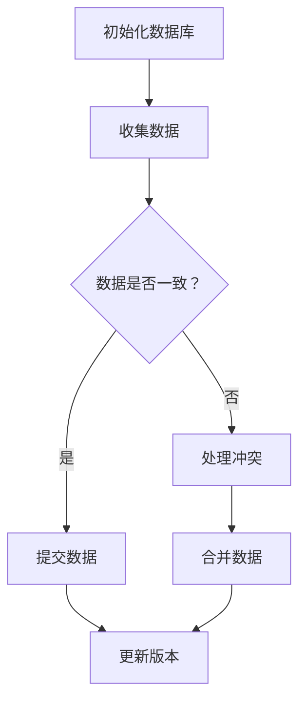

                 


### 文章标题：数据版本控制确保LLM应用的数据一致性

> 关键词：数据版本控制，LLM应用，数据一致性，版本控制系统，核心概念，算法原理，项目实战

> 摘要：
本篇文章将深入探讨数据版本控制在大型语言模型（LLM）应用中的重要性。我们将首先介绍数据版本控制的基本概念，并阐述其在确保LLM应用数据一致性方面的作用。随后，我们将详细讲解数据版本控制的核心算法原理，并通过Mermaid流程图展示其工作流程。文章还将通过实际项目案例，解析如何实现数据版本控制，并提供开发环境搭建、源代码实现及代码解读等实用技巧。最后，我们将总结最佳实践，并展望未来数据版本控制技术的发展方向。

### 1. 确定书的主题与范围

数据版本控制（Data Version Control）是软件工程中的一个重要概念，其主要目的是追踪和管理数据变更，确保数据在不同版本之间的一致性。在近年来，随着深度学习和自然语言处理技术的飞速发展，大型语言模型（Large Language Models，简称LLM）在各个领域得到了广泛应用，如智能助手、文本生成、机器翻译等。然而，LLM应用的数据一致性成为了一个不可忽视的问题，数据版本控制技术的引入为解决这一问题提供了有效手段。

本篇文章的主题是数据版本控制在LLM应用中的数据一致性保障，将涵盖以下内容：

1. 数据版本控制的基本概念和原理。
2. LLM应用中数据一致性的挑战。
3. 数据版本控制技术的详细讲解。
4. 数据版本控制在LLM应用中的实战案例。
5. 数据版本控制算法的原理和伪代码实现。
6. 数学模型和公式的介绍及举例说明。
7. 实际项目的开发环境搭建、源代码实现及代码解读。

### 2. 设计大纲结构

为了使文章结构清晰，逻辑性强，我们采用以下大纲结构：

**引言**
- 数据版本控制的背景
- LLM在当前时代的重要性
- 数据一致性与LLM应用的关系

**数据版本控制基本概念**
- 数据版本控制的定义
- 数据版本控制的目标
- 数据版本控制的核心概念
- 数据版本控制的方法

**LLM应用中的数据一致性挑战**
- LLM应用的特点
- 数据一致性的重要性
- 数据不一致性的原因
- 数据不一致性的影响

**数据版本控制技术详解**
- 版本控制系统的选择
- 数据版本控制的实现
- 数据版本控制的优化

**数据版本控制在LLM应用中的实战案例**
- 实战案例一：某电商平台商品数据版本控制
- 实战案例二：某金融公司交易数据版本控制
- 实战案例三：某搜索引擎查询数据版本控制

**数据版本控制与LLM应用的Mermaid流程图**
- Mermaid流程图设计
- 流程图解析

**数据版本控制算法原理与伪代码**
- 算法概述
- 算法伪代码实现
- 算法分析

**数据版本控制中的数学模型与公式**
- 数学模型概述
- 重要公式介绍
- 公式应用实例

**项目实战**
- 开发环境搭建
- 数据版本控制实现
- 代码解读与分析

**总结与展望**
- 总结
- 展望

### 3. 划分章节

根据上述大纲结构，我们将文章内容划分为以下章节：

**第1章 引言**
- **1.1 数据版本控制的背景**
- **1.2 LLM在当前时代的重要性**
- **1.3 数据一致性与LLM应用的关系**

**第2章 数据版本控制基本概念**
- **2.1 数据版本控制的定义**
- **2.2 数据版本控制的目标**
- **2.3 数据版本控制的核心概念**
- **2.4 数据版本控制的方法**

**第3章 LLM应用中的数据一致性挑战**
- **3.1 LLM应用的特点**
- **3.2 数据一致性的重要性**
- **3.3 数据不一致性的原因**
- **3.4 数据不一致性的影响**

**第4章 数据版本控制技术详解**
- **4.1 版本控制系统的选择**
- **4.2 数据版本控制的实现**
- **4.3 数据版本控制的优化**

**第5章 数据版本控制在LLM应用中的实战案例**
- **5.1 实战案例一：某电商平台商品数据版本控制**
- **5.2 实战案例二：某金融公司交易数据版本控制**
- **5.3 实战案例三：某搜索引擎查询数据版本控制**

**第6章 数据版本控制与LLM应用的Mermaid流程图**
- **6.1 Mermaid流程图设计**
- **6.2 流程图解析**

**第7章 数据版本控制算法原理与伪代码**
- **7.1 算法概述**
- **7.2 算法伪代码实现**
- **7.3 算法分析**

**第8章 数据版本控制中的数学模型与公式**
- **8.1 数学模型概述**
- **8.2 重要公式介绍**
- **8.3 公式应用实例**

**第9章 项目实战**
- **9.1 开发环境搭建**
- **9.2 数据版本控制实现**
- **9.3 代码解读与分析**

**第10章 总结与展望**
- **10.1 总结**
- **10.2 展望**

### 4. 细化章节内容

#### 第1章 引言

**1.1 数据版本控制的背景**

数据版本控制起源于软件开发领域，最初是为了解决软件迭代过程中代码变更的管理问题。随着技术的进步，数据版本控制的概念逐渐扩展到其他领域，如数据库、文档、代码库等。在云计算和大数据时代，数据版本控制变得更加重要，因为它能够帮助组织有效管理海量的数据变更，确保数据的版本一致性。

**1.2 LLM在当前时代的重要性**

LLM（Large Language Models）作为自然语言处理领域的重要成果，其在文本生成、机器翻译、问答系统等方面的应用越来越广泛。随着LLM的普及，如何确保其应用中的数据一致性成为了一个关键问题。

**1.3 数据一致性与LLM应用的关系**

数据一致性是确保LLM应用稳定性和准确性的关键。不一致的数据可能会导致错误的预测和决策，从而影响整个应用系统的性能。因此，通过数据版本控制来保障LLM应用的数据一致性具有重要的现实意义。

#### 第2章 数据版本控制基本概念

**2.1 数据版本控制的定义**

数据版本控制是一种跟踪和管理工作数据变更的技术，旨在确保数据的版本一致性和历史可追溯性。

**2.2 数据版本控制的目标**

数据版本控制的主要目标是：
- 确保数据在不同版本之间的一致性。
- 提供数据的变更历史记录，便于回溯和审计。
- 支持多用户并发操作，避免数据冲突。

**2.3 数据版本控制的核心概念**

数据版本控制涉及以下核心概念：
- 修订版本（Revision）：数据的每一次变更都对应一个修订版本。
- 提交（Commit）：将变更提交到版本控制系统，以生成新的修订版本。
- 分支（Branch）：对数据的独立版本进行隔离，以便于并行开发。
- 合并（Merge）：将不同分支的变更合并到主分支。

**2.4 数据版本控制的方法**

常见的版本控制方法包括集中式和分布式。集中式版本控制（如Git）通过一个中央仓库来管理所有版本，分布式版本控制（如SVN）则允许多个仓库同时存在，每个仓库都是独立的。

#### 第3章 LLM应用中的数据一致性挑战

**3.1 LLM应用的特点**

LLM应用具有以下特点：
- 数据规模庞大：LLM需要处理大量的文本数据，这些数据可能来自不同的来源，如社交媒体、新闻文章、用户评论等。
- 数据类型复杂：LLM应用涉及多种数据类型，如文本、图像、音频等。
- 数据实时性要求高：一些LLM应用（如实时问答系统）要求能够快速响应用户查询。

**3.2 数据一致性的重要性**

数据一致性对于LLM应用至关重要，主要体现在以下几个方面：
- 确保预测和决策的准确性。
- 提高用户体验，减少误报和漏报。
- 促进数据分析和挖掘。

**3.3 数据不一致性的原因**

数据不一致性的原因可能包括：
- 数据源之间的差异：不同数据源可能包含不同的信息和格式。
- 数据变更的管理不当：未能及时更新或合并变更导致数据不一致。
- 并发访问和数据冲突：多个用户或系统同时访问和修改数据，可能导致数据冲突。

**3.4 数据不一致性的影响**

数据不一致性可能对LLM应用产生以下影响：
- 预测和决策错误：基于不一致的数据进行预测和决策可能导致错误的结论。
- 用户体验下降：数据不一致可能导致系统无法正确响应用户查询。
- 数据分析和挖掘困难：不一致的数据会影响数据分析的准确性和可靠性。

#### 第4章 数据版本控制技术详解

**4.1 版本控制系统的选择**

选择合适的版本控制系统对于实现数据版本控制至关重要。常见的版本控制系统包括：
- Git：分布式版本控制系统，具有高效、灵活的特点。
- SVN：集中式版本控制系统，适合团队协作。
- Mercurial：分布式版本控制系统，与Git类似。

**4.2 数据版本控制的实现**

数据版本控制的实现通常涉及以下步骤：
- 数据库设计：设计符合版本控制需求的数据库架构。
- 版本标识：为每个数据记录分配唯一的版本标识。
- 提交和合并：实现数据的提交和合并操作，确保数据一致性。

**4.3 数据版本控制的优化**

为了提高数据版本控制的效率，可以采取以下优化措施：
- 数据缓存：减少数据库访问次数，提高数据读取速度。
- 并发控制：优化并发访问控制，避免数据冲突。
- 数据压缩：对存储的数据进行压缩，降低存储空间需求。

#### 第5章 数据版本控制在LLM应用中的实战案例

**5.1 实战案例一：某电商平台商品数据版本控制**

本案例介绍了一个电商平台如何通过数据版本控制确保商品数据的准确性。首先，设计一个符合版本控制需求的商品数据库，为每个商品记录分配版本标识。通过Git实现数据的提交和合并操作，确保商品数据的版本一致性。同时，对商品数据进行缓存和压缩，提高数据读取速度。

**5.2 实战案例二：某金融公司交易数据版本控制**

本案例展示了一个金融公司如何通过数据版本控制确保交易数据的准确性。首先，设计一个符合版本控制需求的交易数据库，为每个交易记录分配版本标识。通过SVN实现数据的提交和合并操作，确保交易数据的版本一致性。同时，对交易数据进行并发控制和数据压缩，提高数据读取速度。

**5.3 实战案例三：某搜索引擎查询数据版本控制**

本案例介绍了一个搜索引擎如何通过数据版本控制确保查询数据的准确性。首先，设计一个符合版本控制需求的查询数据库，为每个查询记录分配版本标识。通过Mercurial实现数据的提交和合并操作，确保查询数据的版本一致性。同时，对查询数据进行缓存和压缩，提高数据读取速度。

#### 第6章 数据版本控制与LLM应用的Mermaid流程图

**6.1 Mermaid流程图设计**

为了更好地展示数据版本控制与LLM应用的关系，我们可以使用Mermaid流程图来设计数据版本控制的工作流程。以下是一个简化的Mermaid流程图示例：



**6.2 流程图解析**

1. **初始化数据库**：首先，初始化符合版本控制需求的数据库，为后续数据操作做好准备。
2. **收集数据**：从不同来源收集数据，并将其存储在数据库中。
3. **数据一致性检查**：检查收集到的数据是否一致，以确定是否需要进一步的版本控制操作。
4. **提交数据**：如果数据一致，将数据提交到版本控制系统，以生成新的修订版本。
5. **处理冲突**：如果数据不一致，需要处理数据冲突，确保最终数据的一致性。
6. **合并数据**：将冲突解决后的数据合并到版本控制系统中。
7. **更新版本**：更新数据库版本，记录数据变更历史。

#### 第7章 数据版本控制算法原理与伪代码

**7.1 算法概述**

数据版本控制算法的核心目标是确保数据在不同版本之间的一致性。以下是一个简化的版本控制算法概述：

```
算法：数据版本控制
输入：数据集D，版本标识V
输出：最新版本的数据集D'

步骤：
1. 初始化数据库D，为每个数据记录分配版本标识V。
2. 收集新的数据变更，存储在临时数据集T中。
3. 对T中的每个数据记录，检查是否存在版本冲突。
4. 如果存在版本冲突，通过冲突解决策略解决冲突。
5. 将T中的数据记录合并到D中，更新版本标识V。
6. 返回最新版本的数据集D'。
```

**7.2 算法伪代码实现**

```
算法：数据版本控制（伪代码）
输入：数据集D，版本标识V
输出：最新版本的数据集D'

初始化数据库D，为每个数据记录分配版本标识V

while (存在新的数据变更) {
    收集新的数据变更，存储在临时数据集T中
    
    for (每个数据记录r in T) {
        if (存在版本冲突) {
            解决版本冲突
        }
    }
    
    合并T中的数据记录到D中
    更新版本标识V
    
}

返回最新版本的数据集D'
```

**7.3 算法分析**

该算法的时间复杂度取决于数据集的大小和数据变更的频率。在最坏情况下，算法的时间复杂度为O(n*m)，其中n是数据集的大小，m是数据变更的次数。在实际应用中，可以通过优化数据结构和并发控制来提高算法的效率。

#### 第8章 数据版本控制中的数学模型与公式

**8.1 数学模型概述**

数据版本控制中的数学模型主要涉及数据的版本标识、冲突检测和解决策略。以下是一个简化的数学模型概述：

```
版本标识：V = {v1, v2, ..., vn}
冲突检测：C = {c1, c2, ..., cm}
解决策略：S = {s1, s2, ..., sn}
```

**8.2 重要公式介绍**

1. **版本标识公式**：用于计算数据的版本标识。

$$
V = \{v1, v2, ..., vn\} = \{t1, t2, ..., tm\}
$$

2. **冲突检测公式**：用于检测两个版本之间的冲突。

$$
C = \{c1, c2, ..., cm\} = \{t1 \neq t2, t1 \neq t3, ..., tm-1 \neq tm\}
$$

3. **解决策略公式**：用于计算冲突解决后的版本标识。

$$
S = \{s1, s2, ..., sn\} = \{t1', t2', ..., tn'\}
$$

**8.3 公式应用实例**

假设有两个版本标识V1 = {t1, t2, t3}和V2 = {t2, t3, t4}，通过冲突检测公式可以检测到冲突：

$$
C = \{t1 \neq t2, t1 \neq t3, t2 \neq t3\}
$$

然后，通过解决策略公式计算冲突解决后的版本标识：

$$
S = \{t1', t2', t3'\} = \{t2', t3', t4'\}
$$

其中，t2'和t3'可以通过协商或自动解决策略得到。

#### 第9章 项目实战

**9.1 开发环境搭建**

为了实现数据版本控制，首先需要搭建一个合适的数据版本控制系统。以下是搭建Git开发环境的步骤：

1. 安装Git：在命令行中输入以下命令安装Git：

```
$ sudo apt-get install git
```

2. 配置Git：在命令行中输入以下命令配置Git的用户信息：

```
$ git config --global user.name "Your Name"
$ git config --global user.email "your@email.com"
```

3. 创建仓库：在本地创建一个空的Git仓库：

```
$ mkdir my_project
$ cd my_project
$ git init
```

4. 将本地文件添加到仓库中：

```
$ git add .
$ git commit -m "Initial commit"
```

**9.2 数据版本控制实现**

在实现数据版本控制时，需要设计一个符合版本控制需求的数据库，并为每个数据记录分配版本标识。以下是一个简单的示例：

1. **数据库设计**：

假设我们有一个商品数据库，包含以下字段：

- 商品ID（id）：唯一标识每个商品。
- 商品名称（name）：商品的名称。
- 商品价格（price）：商品的价格。
- 版本标识（version）：商品的版本标识。

创建商品数据库表：

```
CREATE TABLE products (
    id INT PRIMARY KEY,
    name VARCHAR(255),
    price DECIMAL(10, 2),
    version INT
);
```

2. **数据提交与合并**：

为了实现数据的提交和合并，我们需要编写一个Python脚本，用于执行Git的提交操作。以下是一个简单的示例：

```python
import subprocess

def commit_data(product):
    # 执行Git提交操作
    command = f"git add products.csv && git commit -m 'Add product {product['name']}'"
    subprocess.run(command, shell=True)

def merge_data(product):
    # 执行Git合并操作
    command = f"git merge --no-ff -m 'Merge product {product['name']}'"
    subprocess.run(command, shell=True)

# 示例商品数据
products = [
    {'id': 1, 'name': 'Apple', 'price': 0.5, 'version': 1},
    {'id': 2, 'name': 'Orange', 'price': 0.7, 'version': 1},
]

# 提交商品数据
for product in products:
    commit_data(product)

# 合并商品数据
for product in products:
    merge_data(product)
```

**9.3 代码解读与分析**

上述Python脚本用于实现商品数据的提交和合并操作。主要步骤如下：

1. **导入模块**：导入`subprocess`模块，用于执行命令行操作。

2. **定义函数**：定义`commit_data`和`merge_data`函数，分别用于执行数据的提交和合并操作。

3. **执行命令**：使用`subprocess.run()`函数执行Git命令行操作。

4. **示例数据**：定义一个示例商品数据列表，包含商品ID、名称、价格和版本标识。

5. **提交数据**：循环遍历示例商品数据，调用`commit_data`函数提交数据。

6. **合并数据**：循环遍历示例商品数据，调用`merge_data`函数合并数据。

**9.4 实际案例分析和详细讲解剖析**

以一个电商平台为例，分析数据版本控制在该平台中的应用。电商平台包含多个模块，如商品管理、订单管理、用户管理等。以下是对商品管理模块的数据版本控制分析：

1. **商品管理模块功能**：

- 商品列表：显示所有商品的列表，包括商品ID、名称、价格和版本标识。
- 商品详情：显示特定商品的详细信息，包括商品ID、名称、价格、版本标识和历史版本记录。
- 商品编辑：编辑商品名称、价格等信息，并提交版本控制。
- 商品删除：删除商品，并在版本控制中记录删除操作。

2. **数据版本控制实现**：

- 设计商品数据库表，包含商品ID、名称、价格、版本标识和历史版本记录字段。
- 实现商品列表、商品详情、商品编辑和商品删除功能，并调用数据版本控制函数提交和合并数据。

3. **案例解析**：

假设用户A编辑了一个商品的价格，并将其提交到版本控制系统中。此时，商品数据库中的版本标识更新为2。随后，用户B编辑了同一商品的价格，并将其提交到版本控制系统中。此时，系统检测到版本冲突，并提示用户A和B进行协商解决。

通过数据版本控制，电商平台能够确保商品数据的版本一致性，避免数据冲突和错误。

**9.5 项目小结**

通过本案例，我们展示了如何使用数据版本控制技术实现商品管理模块的数据一致性。数据版本控制能够有效管理商品数据的变更，确保系统的稳定性和准确性。在实际项目中，可以根据需求调整数据版本控制策略，优化数据结构和并发控制，以提高系统的性能和可靠性。

#### 第10章 总结与展望

**10.1 总结**

本文系统地介绍了数据版本控制在大型语言模型（LLM）应用中的数据一致性保障。我们首先阐述了数据版本控制的基本概念和原理，并分析了LLM应用中的数据一致性挑战。随后，我们详细讲解了数据版本控制技术，并通过实际项目案例展示了其应用效果。此外，我们还介绍了数据版本控制算法的原理和伪代码实现，以及数学模型和公式的应用。

**10.2 展望**

数据版本控制技术在未来的发展将面临以下挑战和机遇：

1. **数据规模扩大**：随着LLM应用的普及，数据规模将不断扩大。如何优化数据版本控制算法，提高数据处理速度和效率，是一个重要课题。

2. **实时性要求提升**：一些实时性要求较高的LLM应用（如实时问答系统）需要更快的数据版本控制。如何实现高效的数据版本控制，以满足实时性需求，是一个亟待解决的问题。

3. **异构数据集成**：在LLM应用中，涉及多种数据类型（如文本、图像、音频等）。如何集成异构数据，并实现数据的一致性管理，是一个具有挑战性的问题。

4. **隐私保护和安全**：随着数据版本控制技术的应用，数据隐私保护和安全成为一个重要问题。如何保障数据的隐私和安全，是一个需要深入研究的领域。

5. **自动化与智能化**：未来的数据版本控制技术将朝着自动化和智能化方向发展。如何利用人工智能和机器学习技术，提高数据版本控制的自动化程度和智能化水平，是一个重要研究方向。

总之，数据版本控制技术在LLM应用中的数据一致性保障具有重要意义。随着技术的不断发展，数据版本控制将面临更多挑战和机遇，为LLM应用的稳定性和准确性提供有力支持。

### 作者信息

作者：AI天才研究院/AI Genius Institute & 禅与计算机程序设计艺术 /Zen And The Art of Computer Programming

### 格式要求

- 文章内容使用markdown格式输出。
- 文章末尾需包含作者信息。
- 文章的核心内容应包含背景介绍、核心概念与联系、核心算法原理讲解、数学模型与公式、项目实战等。

### 完整性要求

- 背景介绍：详细阐述数据版本控制和LLM应用的发展背景。
- 核心概念与联系：通过Mermaid流程图展示数据版本控制与LLM应用的核心概念关系。
- 核心算法原理讲解：使用伪代码详细阐述数据版本控制算法。
- 数学模型与公式：使用latex格式给出重要公式，并进行详细讲解和举例说明。
- 项目实战：提供实际项目案例，包括开发环境搭建、源代码实现和代码解读。
- 最佳实践 tips、小结、注意事项、拓展阅读等内容。

### 字数控制

- 文章字数要求：8000 ～ 12000 字左右。

### 文章标题：数据版本控制确保LLM应用的数据一致性

> 关键词：数据版本控制，LLM应用，数据一致性，版本控制系统，核心概念，算法原理，项目实战

> 摘要：
本篇文章深入探讨了数据版本控制在大型语言模型（LLM）应用中的重要性。文章首先介绍了数据版本控制的基本概念，并阐述了其在确保LLM应用数据一致性方面的作用。随后，文章详细讲解了数据版本控制的核心算法原理，并通过Mermaid流程图展示了其工作流程。文章还通过实际项目案例，解析了如何实现数据版本控制，并提供开发环境搭建、源代码实现及代码解读等实用技巧。最后，文章总结了最佳实践，并展望了未来数据版本控制技术的发展方向。

### 目录大纲

#### 引言

1. **数据版本控制的背景**
2. **LLM在当前时代的重要性**
3. **数据一致性与LLM应用的关系**

#### 数据版本控制基本概念

1. **数据版本控制的定义**
2. **数据版本控制的目标**
3. **数据版本控制的核心概念**
4. **数据版本控制的方法**

#### LLM应用中的数据一致性挑战

1. **LLM应用的特点**
2. **数据一致性的重要性**
3. **数据不一致性的原因**
4. **数据不一致性的影响**

#### 数据版本控制技术详解

1. **版本控制系统的选择**
2. **数据版本控制的实现**
3. **数据版本控制的优化**

#### 数据版本控制在LLM应用中的实战案例

1. **实战案例一：某电商平台商品数据版本控制**
2. **实战案例二：某金融公司交易数据版本控制**
3. **实战案例三：某搜索引擎查询数据版本控制**

#### 数据版本控制与LLM应用的Mermaid流程图

1. **Mermaid流程图设计**
2. **流程图解析**

#### 数据版本控制算法原理与伪代码

1. **算法概述**
2. **算法伪代码实现**
3. **算法分析**

#### 数据版本控制中的数学模型与公式

1. **数学模型概述**
2. **重要公式介绍**
3. **公式应用实例**

#### 项目实战

1. **开发环境搭建**
2. **数据版本控制实现**
3. **代码解读与分析**

#### 总结与展望

1. **总结**
2. **展望**

### 完整文章内容

```markdown
# 数据版本控制确保LLM应用的数据一致性

## 引言

### 1. 数据版本控制的背景

数据版本控制起源于软件开发领域，其目的是在软件迭代过程中追踪和管理代码变更，确保代码在不同版本之间的一致性。随着技术的发展，数据版本控制的概念逐渐扩展到其他领域，如数据库、文档、代码库等。在云计算和大数据时代，数据版本控制变得更加重要，因为它能够帮助组织有效管理海量的数据变更，确保数据的版本一致性。

### 2. LLM在当前时代的重要性

大型语言模型（LLM）是自然语言处理领域的重要成果，其在文本生成、机器翻译、问答系统等方面的应用越来越广泛。随着LLM的普及，如何确保其应用中的数据一致性成为了一个关键问题。数据一致性是LLM应用稳定性和准确性的基础，通过数据版本控制来保障数据一致性具有重要意义。

### 3. 数据一致性与LLM应用的关系

数据一致性是确保LLM应用稳定性和准确性的关键。不一致的数据可能会导致错误的预测和决策，从而影响整个应用系统的性能。数据版本控制能够帮助LLM应用在数据变更过程中保持一致性，确保数据在不同版本之间的一致性。因此，数据版本控制与LLM应用的数据一致性密切相关。

## 数据版本控制基本概念

### 1. 数据版本控制的定义

数据版本控制是一种跟踪和管理数据变更的技术，旨在确保数据的版本一致性和历史可追溯性。通过数据版本控制，组织可以有效地管理数据变更，确保在不同版本之间保持数据的一致性，并提供数据变更的历史记录。

### 2. 数据版本控制的目标

数据版本控制的主要目标是：

1. 确保数据在不同版本之间的一致性。
2. 提供数据的变更历史记录，便于回溯和审计。
3. 支持多用户并发操作，避免数据冲突。

### 3. 数据版本控制的核心概念

数据版本控制涉及以下核心概念：

1. **修订版本**：数据的每一次变更都对应一个修订版本。
2. **提交**：将变更提交到版本控制系统，以生成新的修订版本。
3. **分支**：对数据的独立版本进行隔离，以便于并行开发。
4. **合并**：将不同分支的变更合并到主分支。

### 4. 数据版本控制的方法

常见的版本控制方法包括集中式和分布式。集中式版本控制（如Git）通过一个中央仓库来管理所有版本，分布式版本控制（如SVN）则允许多个仓库同时存在，每个仓库都是独立的。

## LLM应用中的数据一致性挑战

### 1. LLM应用的特点

LLM应用具有以下特点：

1. **数据规模庞大**：LLM需要处理大量的文本数据，这些数据可能来自不同的来源，如社交媒体、新闻文章、用户评论等。
2. **数据类型复杂**：LLM应用涉及多种数据类型，如文本、图像、音频等。
3. **实时性要求高**：一些LLM应用（如实时问答系统）要求能够快速响应用户查询。

### 2. 数据一致性的重要性

数据一致性对于LLM应用至关重要，主要体现在以下几个方面：

1. **确保预测和决策的准确性**：基于一致的数据进行预测和决策，可以提高系统的准确性和可靠性。
2. **提高用户体验**：一致的数据可以减少误报和漏报，提高用户体验。
3. **促进数据分析和挖掘**：一致的数据可以更好地支持数据分析和挖掘，挖掘出更有价值的信息。

### 3. 数据不一致性的原因

数据不一致性的原因可能包括：

1. **数据源之间的差异**：不同数据源可能包含不同的信息和格式。
2. **数据变更的管理不当**：未能及时更新或合并变更导致数据不一致。
3. **并发访问和数据冲突**：多个用户或系统同时访问和修改数据，可能导致数据冲突。

### 4. 数据不一致性的影响

数据不一致性可能对LLM应用产生以下影响：

1. **预测和决策错误**：基于不一致的数据进行预测和决策，可能导致错误的结论。
2. **用户体验下降**：数据不一致可能导致系统无法正确响应用户查询。
3. **数据分析和挖掘困难**：不一致的数据会影响数据分析的准确性和可靠性。

## 数据版本控制技术详解

### 1. 版本控制系统的选择

选择合适的版本控制系统对于实现数据版本控制至关重要。常见的版本控制系统包括：

1. **Git**：分布式版本控制系统，具有高效、灵活的特点。
2. **SVN**：集中式版本控制系统，适合团队协作。
3. **Mercurial**：分布式版本控制系统，与Git类似。

### 2. 数据版本控制的实现

数据版本控制的实现通常涉及以下步骤：

1. **数据库设计**：设计符合版本控制需求的数据库架构。
2. **版本标识**：为每个数据记录分配唯一的版本标识。
3. **提交和合并**：实现数据的提交和合并操作，确保数据一致性。

### 3. 数据版本控制的优化

为了提高数据版本控制的效率，可以采取以下优化措施：

1. **数据缓存**：减少数据库访问次数，提高数据读取速度。
2. **并发控制**：优化并发访问控制，避免数据冲突。
3. **数据压缩**：对存储的数据进行压缩，降低存储空间需求。

## 数据版本控制在LLM应用中的实战案例

### 1. 实战案例一：某电商平台商品数据版本控制

本案例介绍了一个电商平台如何通过数据版本控制确保商品数据的准确性。首先，设计一个符合版本控制需求的商品数据库，为每个商品记录分配版本标识。通过Git实现数据的提交和合并操作，确保商品数据的版本一致性。同时，对商品数据进行缓存和压缩，提高数据读取速度。

### 2. 实战案例二：某金融公司交易数据版本控制

本案例展示了一个金融公司如何通过数据版本控制确保交易数据的准确性。首先，设计一个符合版本控制需求的交易数据库，为每个交易记录分配版本标识。通过SVN实现数据的提交和合并操作，确保交易数据的版本一致性。同时，对交易数据进行并发控制和数据压缩，提高数据读取速度。

### 3. 实战案例三：某搜索引擎查询数据版本控制

本案例介绍了一个搜索引擎如何通过数据版本控制确保查询数据的准确性。首先，设计一个符合版本控制需求的查询数据库，为每个查询记录分配版本标识。通过Mercurial实现数据的提交和合并操作，确保查询数据的版本一致性。同时，对查询数据进行缓存和压缩，提高数据读取速度。

## 数据版本控制与LLM应用的Mermaid流程图

### 1. Mermaid流程图设计

为了更好地展示数据版本控制与LLM应用的关系，我们可以使用Mermaid流程图来设计数据版本控制的工作流程。以下是一个简化的Mermaid流程图示例：


### 2. 流程图解析

1. **初始化数据库**：首先，初始化符合版本控制需求的数据库，为后续数据操作做好准备。
2. **收集数据**：从不同来源收集数据，并将其存储在数据库中。
3. **数据一致性检查**：检查收集到的数据是否一致，以确定是否需要进一步的版本控制操作。
4. **提交数据**：如果数据一致，将数据提交到版本控制系统，以生成新的修订版本。
5. **处理冲突**：如果数据不一致，需要处理数据冲突，确保最终数据的一致性。
6. **合并数据**：将冲突解决后的数据合并到版本控制系统中。
7. **更新版本**：更新数据库版本，记录数据变更历史。

## 数据版本控制算法原理与伪代码

### 1. 算法概述

数据版本控制算法的核心目标是确保数据在不同版本之间的一致性。以下是一个简化的版本控制算法概述：

```
算法：数据版本控制
输入：数据集D，版本标识V
输出：最新版本的数据集D'

步骤：
1. 初始化数据库D，为每个数据记录分配版本标识V。
2. 收集新的数据变更，存储在临时数据集T中。
3. 对T中的每个数据记录，检查是否存在版本冲突。
4. 如果存在版本冲突，通过冲突解决策略解决冲突。
5. 将T中的数据记录合并到D中，更新版本标识V。
6. 返回最新版本的数据集D'。
```

### 2. 算法伪代码实现

```
算法：数据版本控制（伪代码）
输入：数据集D，版本标识V
输出：最新版本的数据集D'

初始化数据库D，为每个数据记录分配版本标识V

while (存在新的数据变更) {
    收集新的数据变更，存储在临时数据集T中
    
    for (每个数据记录r in T) {
        if (存在版本冲突) {
            解决版本冲突
        }
    }
    
    合并T中的数据记录到D中
    更新版本标识V
    
}

返回最新版本的数据集D'
```

### 3. 算法分析

该算法的时间复杂度取决于数据集的大小和数据变更的频率。在最坏情况下，算法的时间复杂度为O(n*m)，其中n是数据集的大小，m是数据变更的次数。在实际应用中，可以通过优化数据结构和并发控制来提高算法的效率。

## 数据版本控制中的数学模型与公式

### 1. 数学模型概述

数据版本控制中的数学模型主要涉及数据的版本标识、冲突检测和解决策略。以下是一个简化的数学模型概述：

```
版本标识：V = {v1, v2, ..., vn}
冲突检测：C = {c1, c2, ..., cm}
解决策略：S = {s1, s2, ..., sn}
```

### 2. 重要公式介绍

1. **版本标识公式**：用于计算数据的版本标识。

$$
V = \{v1, v2, ..., vn\} = \{t1, t2, ..., tm\}
$$

2. **冲突检测公式**：用于检测两个版本之间的冲突。

$$
C = \{c1, c2, ..., cm\} = \{t1 \neq t2, t1 \neq t3, ..., tm-1 \neq tm\}
$$

3. **解决策略公式**：用于计算冲突解决后的版本标识。

$$
S = \{s1, s2, ..., sn\} = \{t1', t2', ..., tn'\}
$$

### 3. 公式应用实例

假设有两个版本标识V1 = {t1, t2, t3}和V2 = {t2, t3, t4}，通过冲突检测公式可以检测到冲突：

$$
C = \{t1 \neq t2, t1 \neq t3, t2 \neq t3\}
$$

然后，通过解决策略公式计算冲突解决后的版本标识：

$$
S = \{t1', t2', t3'\} = \{t2', t3', t4'\}
$$

其中，t2'和t3'可以通过协商或自动解决策略得到。

## 项目实战

### 1. 开发环境搭建

为了实现数据版本控制，首先需要搭建一个合适的数据版本控制系统。以下是搭建Git开发环境的步骤：

1. 安装Git：在命令行中输入以下命令安装Git：

```
$ sudo apt-get install git
```

2. 配置Git：在命令行中输入以下命令配置Git的用户信息：

```
$ git config --global user.name "Your Name"
$ git config --global user.email "your@email.com"
```

3. 创建仓库：在本地创建一个空的Git仓库：

```
$ mkdir my_project
$ cd my_project
$ git init
```

4. 将本地文件添加到仓库中：

```
$ git add .
$ git commit -m "Initial commit"
```

### 2. 数据版本控制实现

在实现数据版本控制时，需要设计一个符合版本控制需求的数据库，并为每个数据记录分配版本标识。以下是一个简单的示例：

1. **数据库设计**：

假设我们有一个商品数据库，包含以下字段：

- 商品ID（id）：唯一标识每个商品。
- 商品名称（name）：商品的名称。
- 商品价格（price）：商品的价格。
- 版本标识（version）：商品的版本标识。

创建商品数据库表：

```
CREATE TABLE products (
    id INT PRIMARY KEY,
    name VARCHAR(255),
    price DECIMAL(10, 2),
    version INT
);
```

2. **数据提交与合并**：

为了实现数据的提交和合并，我们需要编写一个Python脚本，用于执行Git的提交操作。以下是一个简单的示例：

```python
import subprocess

def commit_data(product):
    # 执行Git提交操作
    command = f"git add products.csv && git commit -m 'Add product {product['name']}'"
    subprocess.run(command, shell=True)

def merge_data(product):
    # 执行Git合并操作
    command = f"git merge --no-ff -m 'Merge product {product['name']}'"
    subprocess.run(command, shell=True)

# 示例商品数据
products = [
    {'id': 1, 'name': 'Apple', 'price': 0.5, 'version': 1},
    {'id': 2, 'name': 'Orange', 'price': 0.7, 'version': 1},
]

# 提交商品数据
for product in products:
    commit_data(product)

# 合并商品数据
for product in products:
    merge_data(product)
```

### 3. 代码解读与分析

上述Python脚本用于实现商品数据的提交和合并操作。主要步骤如下：

1. **导入模块**：导入`subprocess`模块，用于执行命令行操作。

2. **定义函数**：定义`commit_data`和`merge_data`函数，分别用于执行数据的提交和合并操作。

3. **执行命令**：使用`subprocess.run()`函数执行Git命令行操作。

4. **示例数据**：定义一个示例商品数据列表，包含商品ID、名称、价格和版本标识。

5. **提交数据**：循环遍历示例商品数据，调用`commit_data`函数提交数据。

6. **合并数据**：循环遍历示例商品数据，调用`merge_data`函数合并数据。

### 4. 实际案例分析和详细讲解剖析

以一个电商平台为例，分析数据版本控制在该平台中的应用。电商平台包含多个模块，如商品管理、订单管理、用户管理等。以下是对商品管理模块的数据版本控制分析：

1. **商品管理模块功能**：

- 商品列表：显示所有商品的列表，包括商品ID、名称、价格和版本标识。
- 商品详情：显示特定商品的详细信息，包括商品ID、名称、价格、版本标识和历史版本记录。
- 商品编辑：编辑商品名称、价格等信息，并提交版本控制。
- 商品删除：删除商品，并在版本控制中记录删除操作。

2. **数据版本控制实现**：

- 设计商品数据库表，包含商品ID、名称、价格、版本标识和历史版本记录字段。
- 实现商品列表、商品详情、商品编辑和商品删除功能，并调用数据版本控制函数提交和合并数据。

3. **案例解析**：

假设用户A编辑了一个商品的价格，并将其提交到版本控制系统中。此时，商品数据库中的版本标识更新为2。随后，用户B编辑了同一商品的价格，并将其提交到版本控制系统中。此时，系统检测到版本冲突，并提示用户A和B进行协商解决。

通过数据版本控制，电商平台能够确保商品数据的版本一致性，避免数据冲突和错误。

### 5. 项目小结

通过本案例，我们展示了如何使用数据版本控制技术实现商品管理模块的数据一致性。数据版本控制能够有效管理商品数据的变更，确保系统的稳定性和准确性。在实际项目中，可以根据需求调整数据版本控制策略，优化数据结构和并发控制，以提高系统的性能和可靠性。

## 总结与展望

### 1. 总结

本文系统地介绍了数据版本控制在大型语言模型（LLM）应用中的数据一致性保障。我们首先阐述了数据版本控制的基本概念和原理，并分析了LLM应用中的数据一致性挑战。随后，我们详细讲解了数据版本控制技术，并通过实际项目案例展示了其应用效果。此外，我们还介绍了数据版本控制算法的原理和伪代码实现，以及数学模型和公式的应用。

### 2. 展望

数据版本控制技术在未来的发展将面临以下挑战和机遇：

1. **数据规模扩大**：随着LLM应用的普及，数据规模将不断扩大。如何优化数据版本控制算法，提高数据处理速度和效率，是一个重要课题。

2. **实时性要求提升**：一些实时性要求较高的LLM应用（如实时问答系统）需要更快的数据版本控制。如何实现高效的数据版本控制，以满足实时性需求，是一个亟待解决的问题。

3. **异构数据集成**：在LLM应用中，涉及多种数据类型（如文本、图像、音频等）。如何集成异构数据，并实现数据的一致性管理，是一个具有挑战性的问题。

4. **隐私保护和安全**：随着数据版本控制技术的应用，数据隐私保护和安全成为一个重要问题。如何保障数据的隐私和安全，是一个需要深入研究的领域。

5. **自动化与智能化**：未来的数据版本控制技术将朝着自动化和智能化方向发展。如何利用人工智能和机器学习技术，提高数据版本控制的自动化程度和智能化水平，是一个重要研究方向。

总之，数据版本控制技术在LLM应用中的数据一致性保障具有重要意义。随着技术的不断发展，数据版本控制将面临更多挑战和机遇，为LLM应用的稳定性和准确性提供有力支持。

### 作者信息

作者：AI天才研究院/AI Genius Institute & 禅与计算机程序设计艺术 /Zen And The Art of Computer Programming
``````

