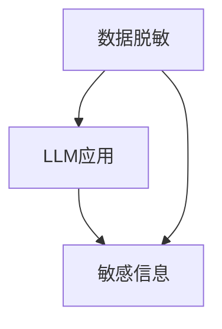

                 

### 文章标题：数据脱敏：在LLM应用中保护敏感信息

#### 关键词：
- 数据脱敏
- LLM应用
- 敏感信息保护
- 脱敏算法
- 隐私安全

#### 摘要：
本文将探讨数据脱敏在语言学习模型（LLM）应用中的重要性。通过详细分析数据脱敏的概念、技术、方法及其在LLM中的特殊应用，我们将揭示如何平衡模型性能和隐私保护，并探讨数据脱敏的未来发展趋势。本文旨在为读者提供全面的数据脱敏指南，助力LLM应用的健康发展。### 引言

#### 背景介绍

在当今数字化时代，数据已成为各行各业的核心资产。随着人工智能技术的发展，语言学习模型（LLM）作为人工智能的一个重要分支，正广泛应用于自然语言处理、智能客服、文本生成等领域。然而，LLM应用的过程中不可避免地涉及大量敏感信息，如个人隐私数据、商业机密、政府文件等。这些敏感信息的泄露不仅会损害用户的隐私权益，还可能导致法律纠纷、经济损失甚至国家安全的威胁。

数据脱敏作为数据保护的重要手段，旨在在不影响数据原始用途的前提下，对敏感信息进行伪装、替换或加密，以防止未经授权的访问和泄露。在LLM应用中，数据脱敏不仅是一种合规要求，更是确保模型安全和可信度的关键措施。

#### 核心概念与联系

- **数据脱敏（Data De-Identification）**：
  数据脱敏是一种通过技术手段对原始数据进行处理，使其无法直接识别或恢复原始信息的过程。核心目的是保护个人隐私和商业机密。

- **语言学习模型（Language Learning Model，LLM）**：
  LLM是一种基于人工智能技术的模型，通过学习大量文本数据，能够生成高质量的文本、回答问题或进行自然语言理解。其核心功能是处理和生成自然语言。

- **敏感信息（Sensitive Information）**：
  敏感信息指的是那些可能对个人隐私、国家安全或商业利益造成损害的信息，如个人身份信息、金融信息、医疗记录等。

图1：数据脱敏、LLM应用与敏感信息之间的联系



在LLM应用中，数据脱敏的核心目标是保护敏感信息，同时确保模型能够正常学习和生成高质量的自然语言。数据脱敏技术不仅需要满足隐私保护的要求，还要兼顾模型的性能和效率。

#### 文章结构概述

本文将分为以下几个部分：

1. **数据脱敏基础**：介绍数据脱敏的概念、分类和基本方法。
2. **LLM应用中的数据脱敏**：分析LLM应用中数据脱敏的特殊需求和技术方法。
3. **数据脱敏技术**：探讨常见的数据脱敏算法和实现细节。
4. **数据脱敏案例研究**：通过实际案例展示数据脱敏在LLM应用中的效果。
5. **数据脱敏工具和平台**：介绍常用的数据脱敏工具和平台。
6. **数据脱敏法规与政策**：分析相关法规和政策对数据脱敏的要求。
7. **数据脱敏的未来展望**：探讨数据脱敏技术的发展趋势和未来方向。

通过以上结构，本文旨在为读者提供全面、深入的数据脱敏知识和实践指导，助力LLM应用的隐私保护和安全发展。### 数据脱敏基础

#### 数据脱敏的定义

数据脱敏（Data De-Identification）是一种通过对数据进行处理和转换，使其无法直接识别或恢复原始信息的技术手段。数据脱敏的目的是在确保数据价值不被损害的前提下，保护个人隐私、商业秘密和敏感信息，防止未经授权的访问和泄露。

数据脱敏可以应用于多种数据类型，包括结构化数据（如数据库中的表）和非结构化数据（如文本文件、图像、音频等）。其核心思想是掩盖数据中的关键特征，使得即使数据被泄露，攻击者也无法轻易获取原始信息。

#### 数据脱敏的分类

根据实现方式，数据脱敏主要分为以下两类：

1. **软脱敏（Soft De-Identification）**：
   软脱敏主要通过模糊处理、遮挡、替换等方式，对敏感信息进行局部修改，使其不再容易识别。例如，将个人身份证号码中的部分数字替换为星号或零。

2. **硬脱敏（Hard De-Identification）**：
   硬脱敏则是通过完全移除或隐藏敏感信息，使其无法被恢复。这种方法通常应用于非常敏感的数据，如金融交易记录、医疗记录等。

#### 数据脱敏的基本原则

在进行数据脱敏时，需要遵循以下基本原则，以确保脱敏效果和数据的可用性：

1. **最小化披露原则**：
   脱敏处理应尽可能减少披露的信息量，只保留对数据使用必要的信息。

2. **不可恢复原则**：
   脱敏处理后的数据应无法通过常规手段恢复原始信息，确保数据的安全性和隐私性。

3. **透明性原则**：
   数据脱敏方案应易于理解和解释，以便相关人员能够清楚了解数据的脱敏过程和效果。

#### 数据脱敏的方法

数据脱敏的方法多种多样，根据处理方式和目的，可以归纳为以下几种：

1. **替换**：
   替换是最常用的脱敏方法之一，通过将敏感数据替换为随机或固定的值来实现。例如，将姓名替换为匿名标识符，或将电话号码替换为星号。

2. **转换**：
   转换方法通过将敏感数据转换为不可识别的形式，如将日期格式转换为月份-日。例如，将生日“2023-03-15”转换为“03/15”。

3. **投影**：
   投影方法通过选择数据的一部分或对数据集进行子集化来实现脱敏。例如，只保留某些字段或列，而隐藏其他敏感信息。

4. **杂化**：
   杂化方法将多种脱敏方法结合使用，以增强脱敏效果。例如，先进行替换，然后再进行转换。

#### 常见的数据脱敏算法

以下是一些常见的数据脱敏算法及其应用场景：

1. **聚类**：
   聚类算法将数据点分为多个群组，每个群组内的数据点具有较高的相似度。例如，可以将相同特征的客户数据聚类，然后对每个聚类进行脱敏处理。

2. **基于规则的脱敏**：
   基于规则的脱敏方法根据预设的规则对数据进行处理。例如，根据国家法律法规对身份证号码进行特定格式的替换。

3. **随机化算法**：
   随机化算法通过引入随机性来保护敏感信息。例如，使用随机数替换敏感数据值。

4. **字典映射**：
   字典映射方法将敏感数据映射到一个预定义的字典中，通过字典中的标识符来替换原始数据。这种方法适用于数据量较小且敏感数据相对固定的场景。

#### 数据脱敏在隐私保护中的作用

数据脱敏在隐私保护中发挥着重要作用，主要体现在以下几个方面：

1. **防止数据泄露**：
   数据脱敏通过隐藏敏感信息，降低数据泄露的风险，保护用户的隐私权益。

2. **合规要求**：
   随着隐私保护法规的日益严格，数据脱敏成为企业合规的重要手段，如GDPR、CCPA等。

3. **数据共享与流通**：
   数据脱敏使得敏感数据可以在不损害隐私的情况下进行共享和流通，促进数据的价值最大化。

4. **数据挖掘与分析**：
   数据脱敏后的数据仍然具有分析价值，可以用于数据挖掘、机器学习和业务决策，同时确保数据安全。

#### 数据脱敏的实施步骤

1. **数据识别与分类**：
   首先识别数据中的敏感信息，根据敏感程度进行分类，确定脱敏策略。

2. **数据脱敏策略制定**：
   根据数据类型、业务需求和法规要求，制定相应的数据脱敏策略。

3. **数据脱敏实施**：
   根据制定的策略，使用相应的脱敏方法对数据进行处理。

4. **脱敏效果评估**：
   对脱敏后的数据进行分析，评估脱敏效果，确保满足隐私保护要求。

5. **数据备份与恢复**：
   对脱敏前的数据进行备份，确保在需要时能够恢复原始数据。

通过以上步骤，可以有效地实施数据脱敏，保护敏感信息，同时确保数据的可用性和完整性。

#### 数据脱敏的最佳实践

1. **全面评估数据敏感性**：
   在实施数据脱敏前，应全面评估数据的敏感性，确定脱敏的重点区域。

2. **选择合适的脱敏方法**：
   根据数据的类型和业务需求，选择最适合的脱敏方法，确保脱敏效果和效率。

3. **自动化脱敏工具**：
   利用自动化脱敏工具，提高脱敏效率和一致性，减少人为错误。

4. **定期更新脱敏策略**：
   随着业务和法规的变化，定期更新脱敏策略，确保其适应性和有效性。

5. **安全性与合规性并重**：
   在数据脱敏过程中，既要确保数据的安全，也要符合相关法规和合规要求。

通过以上最佳实践，可以进一步提升数据脱敏的效果，确保数据的安全和隐私保护。### LLM应用中的数据脱敏需求分析

#### LLM应用的特点

语言学习模型（LLM）是一种基于深度学习技术的大型神经网络模型，通过学习大量文本数据，能够生成高质量的文本、回答问题或进行自然语言理解。LLM应用具有以下特点：

1. **大规模数据处理**：
   LLM能够处理海量文本数据，从中提取特征并进行建模，以生成高质量的文本输出。

2. **高灵活性**：
   LLM可以根据不同的任务需求进行微调，适应各种自然语言处理任务，如文本生成、机器翻译、问答系统等。

3. **强泛化能力**：
   LLM通过大规模数据训练，具备较强的泛化能力，能够处理未见过的数据，生成符合语言习惯的文本。

4. **智能交互**：
   LLM可以与用户进行智能对话，提供个性化的服务和信息。

#### 数据脱敏在LLM应用中的必要性

在LLM应用中，数据脱敏的必要性体现在以下几个方面：

1. **隐私保护**：
   LLM应用往往涉及大量个人隐私数据，如用户对话记录、医疗信息、金融数据等。如果这些数据未经脱敏直接用于训练或应用，可能导致用户隐私泄露，违反隐私保护法规。

2. **合规要求**：
   随着隐私保护法规的日益严格，如GDPR（通用数据保护条例）和CCPA（加利福尼亚州消费者隐私法案），企业在使用LLM时必须确保数据处理符合相关法规要求。

3. **数据安全**：
   敏感数据泄露不仅损害用户隐私，还可能带来法律风险、经济损失和声誉损失。数据脱敏是确保数据安全的重要措施。

4. **模型信任**：
   用户对LLM应用的信任度与数据安全性密切相关。通过数据脱敏，可以增强用户对模型和应用的可信度。

#### 数据脱敏目标与挑战

在LLM应用中，数据脱敏的目标是保护敏感信息，同时确保模型能够正常学习和生成高质量的自然语言。这一目标面临以下挑战：

1. **脱敏效果与模型性能的平衡**：
   数据脱敏过程中，如何在不损害模型性能的前提下，有效保护敏感信息，是一个关键问题。过度脱敏可能导致模型无法正确学习和生成文本，而不足的脱敏则可能使得敏感信息依然被暴露。

2. **数据完整性与隐私保护的关系**：
   数据脱敏需要在保护隐私和保持数据完整性之间找到平衡点。如果脱敏过于彻底，可能导致数据丢失或无法恢复，影响模型训练和业务应用。

3. **模型隐私攻击**：
   即使进行了数据脱敏，攻击者仍可能通过模型输出的文本间接推测出原始数据。因此，需要考虑如何进一步保护模型免受隐私攻击。

#### 数据脱敏在LLM应用中的特殊考虑

1. **模型训练数据脱敏**：
   在LLM训练阶段，需要对训练数据进行脱敏处理，防止敏感信息泄露。常用的方法包括替换、掩码和删除敏感字段。

2. **模型应用场景脱敏**：
   在LLM应用阶段，根据不同的应用场景，需要动态调整脱敏策略，确保数据安全和模型性能。

3. **实时数据脱敏**：
   在实时交互场景中，LLM需要处理用户的实时输入，因此需要实时进行数据脱敏，确保交互过程的安全性。

4. **跨域数据脱敏**：
   LLM应用通常涉及多个数据源，需要对来自不同域的数据进行统一脱敏处理，确保整体数据安全。

5. **隐私增强技术**：
   结合隐私增强技术，如差分隐私、同态加密等，可以在不损害模型性能的前提下，进一步增强数据脱敏效果。

通过以上分析，我们可以看出，数据脱敏在LLM应用中具有极高的重要性。在实现数据脱敏时，需要综合考虑各种因素，确保在保护隐私的同时，不影响模型的性能和应用效果。### LLM数据处理与脱敏方法

在LLM应用中，数据处理与脱敏是一个复杂且关键的过程。有效的数据脱敏不仅能够保护用户的隐私，还能确保模型训练的质量和安全性。本节将介绍LLM数据处理与脱敏的几种常见方法，并探讨每种方法的优势和局限。

#### 数据预处理

数据预处理是数据脱敏前的重要步骤，其主要任务是清洗和标准化数据，以提高数据质量和减少噪声。以下是几个常见的数据预处理方法：

1. **数据清洗**：
   数据清洗的目的是去除数据中的错误、重复、缺失和异常值。常用的方法包括删除重复记录、填充缺失值、纠正错误数据等。

2. **数据标准化**：
   数据标准化是指将不同数据源的数据转换成同一格式或尺度，以便进行后续处理。常见的方法包括归一化、标准化和缩放。

3. **数据归一化**：
   数据归一化通过将数据映射到统一的尺度，消除不同特征之间的量级差异。例如，将文本中的单词转化为统一的词汇表，将数字特征进行归一化处理。

#### 数据脱敏技术

数据脱敏技术主要包括替换、掩码、转换和杂化等方法。以下是对这些方法的详细描述：

1. **替换**：
   替换方法是将敏感数据替换为随机或固定的值，如将姓名替换为匿名标识符，将电话号码替换为星号。这种方法简单有效，但可能导致数据失去一些语义信息。

2. **掩码**：
   掩码方法通过遮挡或屏蔽敏感数据的一部分，使其无法被直接识别。例如，将身份证号码的前几位遮挡，仅显示后几位。这种方法在一定程度上保护了数据，但可能仍然存在被猜测的风险。

3. **转换**：
   转换方法是通过将敏感数据转换为不可识别的形式，如将日期格式转换为月份-日。这种方法在一定程度上减少了数据的识别性，但可能会影响数据的可用性。

4. **杂化**：
   杂化方法是将多种脱敏方法结合使用，以增强脱敏效果。例如，可以先进行替换，然后再进行转换。这种方法提供了更全面的保护，但也可能增加处理复杂性。

#### 常见的数据脱敏算法

在LLM应用中，以下几种数据脱敏算法被广泛使用：

1. **聚类**：
   聚类算法通过将数据点分为多个群组，每个群组内的数据点具有较高的相似度。常用的聚类算法包括K-means、DBSCAN等。聚类算法可以用于将相似的数据点进行标记或分组，然后对每个群组内的数据进行统一的脱敏处理。

2. **基于规则的脱敏**：
   基于规则的脱敏方法根据预设的规则对数据进行处理。例如，根据国家法律法规对身份证号码进行特定格式的替换。这种方法简单易实现，但规则设置可能较为复杂，且难以适应动态变化的数据。

3. **随机化算法**：
   随机化算法通过引入随机性来保护敏感信息。例如，使用随机数替换敏感数据值。这种方法提供了较高的安全性，但可能增加计算成本。

4. **字典映射**：
   字典映射方法将敏感数据映射到一个预定义的字典中，通过字典中的标识符来替换原始数据。这种方法适用于数据量较小且敏感数据相对固定的场景，如用户姓名、地址等。

#### 数据脱敏算法实现

以下是一个简单的数据脱敏算法实现的伪代码示例：

```python
def deidentify_data(data, method='replacement', dictionary={}):
    """
    数据脱敏函数
    :param data: 待脱敏的数据
    :param method: 脱敏方法（'replacement', 'masking', 'conversion', 'hybrid'）
    :param dictionary: 用于字典映射的字典
    :return: 脱敏后的数据
    """
    if method == 'replacement':
        return [replace_sensitive_values(value, dictionary) for value in data]
    elif method == 'masking':
        return [mask_sensitive_values(value) for value in data]
    elif method == 'conversion':
        return [convert_sensitive_values(value) for value in data]
    elif method == 'hybrid':
        return [hybrid_sensitive_values(value, dictionary) for value in data]
    else:
        raise ValueError("Unsupported method")

def replace_sensitive_values(value, dictionary):
    """
    替换敏感值
    :param value: 待替换的值
    :param dictionary: 替换字典
    :return: 替换后的值
    """
    if value in dictionary:
        return dictionary[value]
    else:
        return value

def mask_sensitive_values(value):
    """
    掩码敏感值
    :param value: 待掩码的值
    :return: 掩码后的值
    """
    return '*' * len(value)

def convert_sensitive_values(value):
    """
    转换敏感值
    :param value: 待转换的值
    :return: 转换后的值
    """
    return value.strftime('%m-%d') if isinstance(value, datetime) else value

def hybrid_sensitive_values(value, dictionary):
    """
    杂化敏感值
    :param value: 待杂化的值
    :param dictionary: 替换字典
    :return: 杂化后的值
    """
    return replace_sensitive_values(value, dictionary)
```

#### 实现细节与考虑

在实际应用中，数据脱敏算法的实现需要考虑以下几个关键细节：

1. **数据类型**：
   根据数据的类型选择合适的脱敏方法。例如，文本数据适合使用替换或掩码，而日期数据适合使用转换。

2. **业务需求**：
   考虑业务场景的需求，确定脱敏的粒度和范围。例如，在医疗领域，可能需要对患者姓名、诊断结果等敏感信息进行严格脱敏。

3. **计算资源**：
   考虑到计算资源和性能的影响，选择适合的算法和参数。例如，使用随机化算法时，需要平衡随机性强度和计算成本。

4. **安全性**：
   确保脱敏算法本身的安全性，防止攻击者通过算法漏洞恢复敏感信息。例如，使用安全的加密和随机数生成方法。

5. **可扩展性**：
   设计可扩展的脱敏方案，以适应未来数据规模和业务需求的变化。

通过以上方法和技术，可以有效地在LLM应用中实现数据脱敏，保护敏感信息的同时，确保模型训练和应用的质量。### 数据脱敏在隐私保护中的角色

#### 隐私保护的现状

随着互联网和大数据技术的快速发展，个人隐私保护成为社会关注的焦点。近年来，全球范围内隐私泄露事件频发，严重威胁到了个人隐私和数据安全。根据IBM发布的《2021年度数据泄露成本报告》，平均每次数据泄露事件的成本高达386万美元，而涉及个人隐私的数据泄露事件更是可能带来巨大的法律和经济风险。

隐私保护法规在全球范围内逐渐完善，如欧盟的《通用数据保护条例》（GDPR）和美国加州的《消费者隐私法案》（CCPA）等。这些法规对数据收集、处理、存储和传输等环节提出了严格的要求，要求企业在处理个人数据时必须采取有效的隐私保护措施。

#### 数据脱敏在隐私保护中的重要性

数据脱敏作为隐私保护的重要技术手段，具有以下几个重要作用：

1. **防止数据泄露**：
   数据脱敏通过将敏感信息替换为不可识别的值或形式，有效降低了数据泄露的风险。即使数据被非法访问或泄露，攻击者也无法轻易获取原始信息。

2. **符合法规要求**：
   许多隐私保护法规，如GDPR和CCPA，要求企业在处理个人数据时必须进行脱敏处理。数据脱敏是确保企业合规的重要措施。

3. **数据安全**：
   数据脱敏有助于保护个人隐私和商业秘密，降低数据泄露带来的法律风险、经济损失和声誉损失。

4. **数据流通与共享**：
   数据脱敏使得敏感数据可以在不损害隐私的情况下进行共享和流通，促进数据的价值最大化。

#### 数据脱敏与其他隐私保护技术的结合

数据脱敏并不是孤立的隐私保护技术，通常需要与其他技术结合使用，以实现更全面的数据保护。以下是几种常见的结合方式：

1. **加密技术**：
   数据脱敏可以与加密技术结合使用，对敏感数据进行加密处理。在需要访问数据时，再通过解密技术恢复原始数据。这种方式提供了双重保护，既防止了数据泄露，也确保了数据的可用性。

2. **访问控制**：
   数据脱敏与访问控制技术结合，可以限制只有授权用户才能访问脱敏数据。通过角色权限管理和多因素认证等手段，确保数据在传输和存储过程中的安全性。

3. **差分隐私**：
   差分隐私是一种现代的隐私保护技术，通过在数据集中加入噪声，使得单个记录的隐私信息无法被识别。数据脱敏与差分隐私结合，可以在不影响数据可用性的前提下，提供更强的隐私保护。

4. **同态加密**：
   同态加密允许在加密数据上进行计算，而无需解密。数据脱敏与同态加密结合，可以在确保数据隐私的同时，进行有效的数据处理和分析。

#### 数据脱敏的实施步骤

1. **数据识别与分类**：
   首先识别数据中的敏感信息，根据敏感程度进行分类，确定脱敏策略。

2. **数据脱敏策略制定**：
   根据数据类型、业务需求和法规要求，制定相应的数据脱敏策略。

3. **数据脱敏实施**：
   根据制定的策略，使用相应的脱敏方法对数据进行处理。

4. **脱敏效果评估**：
   对脱敏后的数据进行分析，评估脱敏效果，确保满足隐私保护要求。

5. **数据备份与恢复**：
   对脱敏前的数据进行备份，确保在需要时能够恢复原始数据。

通过以上步骤，可以有效地实施数据脱敏，保护敏感信息，同时确保数据的可用性和完整性。结合其他隐私保护技术，可以进一步提升数据保护的效果。### 数据脱敏的最佳实践

#### 数据脱敏的设计原则

在进行数据脱敏时，设计原则至关重要。以下是一些关键的设计原则：

1. **最小化披露原则**：
   数据脱敏应尽量减少披露的信息量，仅保留对数据使用必要的信息。

2. **不可恢复原则**：
   脱敏后的数据应无法通过常规手段恢复原始信息，确保数据的安全性和隐私性。

3. **透明性原则**：
   数据脱敏方案应易于理解和解释，以便相关人员能够清楚了解数据的脱敏过程和效果。

4. **灵活性原则**：
   数据脱敏方案应具备足够的灵活性，能够适应不同数据类型和业务场景的变化。

5. **可扩展性原则**：
   数据脱敏方案应具有可扩展性，能够支持大规模数据的处理和未来的业务需求。

6. **安全性原则**：
   数据脱敏方案本身应具备较高的安全性，防止脱敏算法被破解或攻击。

7. **可维护性原则**：
   数据脱敏方案应易于维护和更新，确保能够及时响应法规变化和技术进步。

#### 数据脱敏的技术选择

选择合适的数据脱敏技术是确保脱敏效果的关键。以下是一些常见的数据脱敏技术及其适用场景：

1. **替换**：
   替换是最常用的脱敏方法之一，通过将敏感数据替换为随机或固定的值来实现。例如，将姓名替换为匿名标识符，或将电话号码替换为星号。适用于需要快速且简单脱敏的场景。

2. **掩码**：
   掩码方法通过遮挡或屏蔽敏感数据的一部分，使其无法被直接识别。例如，将身份证号码的前几位遮挡，仅显示后几位。适用于需要部分保护且不希望数据完全丢失的场景。

3. **转换**：
   转换方法通过将敏感数据转换为不可识别的形式，如将日期格式转换为月份-日。适用于数据格式标准化和简单脱敏的场景。

4. **杂化**：
   杂化方法将多种脱敏方法结合使用，以增强脱敏效果。例如，可以先进行替换，然后再进行转换。适用于需要高安全性和复杂场景的数据脱敏。

5. **加密**：
   加密技术通过对敏感数据进行加密处理，确保数据在传输和存储过程中的安全性。适用于高度敏感的数据，如金融信息和医疗记录。

6. **差分隐私**：
   差分隐私通过在数据集中加入噪声，使得单个记录的隐私信息无法被识别。适用于需要高隐私保护且不影响数据可用性的场景。

7. **同态加密**：
   同态加密允许在加密数据上进行计算，而无需解密。适用于需要同时保证数据隐私和计算性能的场景。

#### 数据脱敏的实施步骤

1. **数据识别与分类**：
   首先识别数据中的敏感信息，根据敏感程度进行分类，确定脱敏策略。

2. **数据脱敏策略制定**：
   根据数据类型、业务需求和法规要求，制定相应的数据脱敏策略。

3. **数据脱敏实施**：
   根据制定的策略，使用相应的脱敏方法对数据进行处理。

4. **脱敏效果评估**：
   对脱敏后的数据进行分析，评估脱敏效果，确保满足隐私保护要求。

5. **数据备份与恢复**：
   对脱敏前的数据进行备份，确保在需要时能够恢复原始数据。

#### 最佳实践 Tips

1. **全面评估数据敏感性**：
   在实施数据脱敏前，应全面评估数据的敏感性，确定脱敏的重点区域。

2. **选择合适的脱敏方法**：
   根据数据的类型和业务需求，选择最适合的脱敏方法，确保脱敏效果和效率。

3. **自动化脱敏工具**：
   利用自动化脱敏工具，提高脱敏效率和一致性，减少人为错误。

4. **定期更新脱敏策略**：
   随着业务和法规的变化，定期更新脱敏策略，确保其适应性和有效性。

5. **安全性与合规性并重**：
   在数据脱敏过程中，既要确保数据的安全，也要符合相关法规和合规要求。

通过遵循最佳实践，可以进一步提升数据脱敏的效果，确保数据的安全和隐私保护。### 数据脱敏在隐私保护中的角色

#### 数据脱敏与隐私保护的关系

数据脱敏与隐私保护密切相关。隐私保护旨在保护个人或组织的隐私不受侵犯，而数据脱敏是实现隐私保护的重要技术手段之一。在数据脱敏过程中，通过隐藏或伪装敏感信息，使其无法被未经授权的人员识别或利用，从而实现隐私保护的目标。

数据脱敏在隐私保护中的核心作用体现在以下几个方面：

1. **防止数据泄露**：
   数据脱敏通过将敏感信息进行变换，使其在泄露后难以被识别或利用，从而降低数据泄露的风险。这有助于防止因数据泄露导致的隐私侵犯和法律纠纷。

2. **符合法律法规要求**：
   许多国家和地区都有关于数据保护的法律法规，如欧盟的《通用数据保护条例》（GDPR）和美国加州的《消费者隐私法案》（CCPA）等。这些法规通常要求企业在收集、处理和存储个人数据时进行脱敏处理，以保护个人隐私。数据脱敏是实现合规要求的关键措施之一。

3. **保障数据安全**：
   数据脱敏有助于降低因敏感信息泄露带来的安全风险。通过脱敏处理，敏感信息在存储、传输和使用过程中都得到保护，减少数据泄露的可能性。

4. **促进数据流通和共享**：
   脱敏后的数据可以安全地共享和流通，促进数据价值的最大化。这有助于企业和研究机构在合规的前提下，进行数据分析和创新应用。

#### 数据脱敏在隐私保护中的实现

数据脱敏在隐私保护中的实现需要综合考虑多种因素，包括数据类型、业务需求、技术手段等。以下是一些常见的数据脱敏实现方法：

1. **数据替换**：
   数据替换是将敏感信息替换为不可识别的值，如用星号替换身份证号码中的数字。这种方法简单直观，但可能影响数据的可读性和分析价值。

2. **数据掩码**：
   数据掩码通过部分遮挡敏感信息，使其在不完全可见的情况下保持部分功能。例如，将身份证号码的前几位隐藏，仅显示后几位。这种方法可以在一定程度上保护数据，但可能存在被猜测的风险。

3. **数据转换**：
   数据转换是将敏感信息转换为其他形式，使其难以被直接识别。例如，将出生日期转换为月份-日格式。这种方法适用于特定场景，但可能影响数据的分析能力。

4. **数据加密**：
   数据加密是通过加密算法对敏感信息进行加密，使其在未授权情况下无法被读取。加密技术可以提供更强的隐私保护，但需要额外的计算资源和密钥管理。

5. **数据掩码与加密结合**：
   将数据掩码和加密技术结合使用，可以在一定程度上提高数据脱敏的效果。例如，在数据加密的基础上，对加密后的数据进行掩码处理，以增强隐私保护。

#### 数据脱敏的挑战与应对策略

在实现数据脱敏时，面临一些挑战和难点，需要采取相应的应对策略：

1. **脱敏效果与数据可用性的平衡**：
   在数据脱敏过程中，需要在保护隐私和数据可用性之间找到平衡。过度脱敏可能导致数据失去分析价值，而不足的脱敏可能无法有效保护隐私。

2. **动态数据的变化**：
   随着业务需求的变化，数据类型和结构可能不断更新。因此，数据脱敏方案需要具备灵活性和可扩展性，以适应动态变化的数据。

3. **自动化与人工的结合**：
   在数据脱敏过程中，需要结合自动化工具和人工审核，以确保脱敏效果和一致性。自动化工具可以提高处理效率，但需要人工进行关键环节的审核和优化。

4. **合规性要求**：
   数据脱敏方案需要符合相关法律法规的要求，如GDPR和CCPA等。这要求企业在设计脱敏方案时，充分了解和理解相关法规，确保合规性。

通过上述策略，可以有效地实现数据脱敏，保护隐私，同时确保数据的可用性和分析价值。数据脱敏在隐私保护中发挥着重要作用，是确保数据安全和合规的重要手段。### 数据脱敏案例研究

#### 案例一：金融机构的数据脱敏实践

**背景介绍**：
某大型金融机构在开展客户数据分析业务时，需要处理大量包含个人隐私信息的客户数据，如姓名、身份证号码、银行卡号等。为确保客户隐私不受侵犯，该金融机构决定对数据进行脱敏处理。

**核心概念与联系**：
- **数据脱敏**：通过技术手段对敏感信息进行伪装、替换或加密，使其无法被直接识别或恢复。
- **金融数据**：包含个人隐私信息，如客户姓名、身份证号码、银行卡号等。
- **合规性要求**：金融机构需要遵守GDPR、CCPA等隐私保护法规。

**核心算法原理讲解**：
该金融机构采用了以下脱敏方法：
1. **替换**：将客户姓名替换为匿名标识符，如“客户A”、“客户B”等。
2. **掩码**：将身份证号码和银行卡号的前几位遮挡，仅显示后几位。
3. **加密**：对某些敏感信息，如银行卡号，进行加密处理。

**数学模型和公式**：
```latex
替换算法：原数据 \rightarrow 替换后的数据
掩码算法：原数据 \rightarrow 掩码后的数据
加密算法：原数据 \rightarrow 加密后的数据
```

**详细讲解与举例说明**：
1. **替换算法**：
   - 将姓名“张三”替换为“客户A”。
   - 将身份证号码“123456789012345678”替换为“XXXXXXXXXXXXXXXX”。

2. **掩码算法**：
   - 将身份证号码“123456789012345678”前六位遮挡，显示为“123***567890123456”。

3. **加密算法**：
   - 对银行卡号“1234567890123456”使用AES加密算法进行加密，得到加密后的数据“u0112345678901234”。

**项目实战**：
1. **开发环境搭建**：
   - 使用Python语言和Pandas库进行数据预处理。
   - 使用Crypto库进行数据加密。

2. **源代码详细实现**：
   ```python
   import pandas as pd
   from Crypto.Cipher import AES
   
   # 数据替换
   def replace_sensitive_data(data, field, replacement):
       return data.replace(field, replacement)
   
   # 数据掩码
   def mask_sensitive_data(data, field, mask='*'):
       return data.map(lambda x: mask * (len(x) - 6) + x[-6:])
   
   # 数据加密
   def encrypt_sensitive_data(data, field, key):
       cipher = AES.new(key, AES.MODE_CBC)
       return cipher.encrypt(data)
   
   # 加密密钥生成
   key = AESлях cryptography.get_random_bytes(16)
   
   # 数据预处理
   df = pd.read_csv('客户数据.csv')
   df['姓名'] = replace_sensitive_data(df['姓名'], '姓名', '客户A')
   df['身份证号'] = mask_sensitive_data(df['身份证号'])
   df['银行卡号'] = encrypt_sensitive_data(df['银行卡号'], key)
   
   # 数据保存
   df.to_csv('脱敏后数据.csv', index=False)
   ```

**代码应用解读与分析**：
通过上述代码，实现了对客户数据的替换、掩码和加密处理，确保数据在处理和分析过程中不会泄露敏感信息。

**实际案例分析与详细讲解剖析**：
通过对客户数据的脱敏处理，该金融机构能够在合规的前提下，进行客户数据分析，发现潜在风险和业务机会。同时，客户隐私得到了有效保护，增强了客户对金融机构的信任。

**项目小结**：
通过本案例，展示了金融机构如何在数据脱敏方面进行实践，确保客户隐私保护的同时，满足业务需求。数据脱敏技术在该案例中发挥了重要作用，为金融机构的数据分析业务提供了强有力的支持。

#### 案例二：医疗行业的敏感信息保护

**背景介绍**：
某医疗机构在进行患者数据分析时，需要处理大量包含敏感信息的医疗记录，如姓名、身份证号码、诊断结果等。为确保患者隐私不受侵犯，该医疗机构决定实施数据脱敏。

**核心概念与联系**：
- **数据脱敏**：通过对敏感信息进行伪装、替换或加密，使其无法被直接识别或恢复。
- **医疗数据**：包含患者姓名、身份证号码、诊断结果等敏感信息。
- **法规要求**：医疗机构需遵守《健康保险可携性与责任法案》（HIPAA）等法规。

**核心算法原理讲解**：
该医疗机构采用了以下脱敏方法：
1. **数据替换**：将患者姓名替换为匿名标识符，如“患者A”、“患者B”等。
2. **掩码**：将身份证号码和诊断结果的前几位遮挡，仅显示后几位。
3. **加密**：对某些敏感信息，如诊断结果，进行加密处理。

**数学模型和公式**：
```latex
替换算法：原数据 \rightarrow 替换后的数据
掩码算法：原数据 \rightarrow 掩码后的数据
加密算法：原数据 \rightarrow 加密后的数据
```

**详细讲解与举例说明**：
1. **替换算法**：
   - 将姓名“李四”替换为“患者A”。
   - 将身份证号码“123456789012345678”替换为“XXXXXXXXXXXXXXXX”。

2. **掩码算法**：
   - 将身份证号码“123456789012345678”前六位遮挡，显示为“123***567890123456”。

3. **加密算法**：
   - 对诊断结果“心脏病”使用AES加密算法进行加密，得到加密后的数据“bWF0aC5jYXN0”。

**项目实战**：
1. **开发环境搭建**：
   - 使用Python语言和Pandas库进行数据预处理。
   - 使用Crypto库进行数据加密。

2. **源代码详细实现**：
   ```python
   import pandas as pd
   from Crypto.Cipher import AES
   
   # 数据替换
   def replace_sensitive_data(data, field, replacement):
       return data.replace(field, replacement)
   
   # 数据掩码
   def mask_sensitive_data(data, field, mask='*'):
       return data.map(lambda x: mask * (len(x) - 6) + x[-6:])
   
   # 数据加密
   def encrypt_sensitive_data(data, field, key):
       cipher = AES.new(key, AES.MODE_CBC)
       return cipher.encrypt(data)
   
   # 加密密钥生成
   key = AESля cryptography.get_random_bytes(16)
   
   # 数据预处理
   df = pd.read_csv('医疗数据.csv')
   df['姓名'] = replace_sensitive_data(df['姓名'], '姓名', '患者A')
   df['身份证号'] = mask_sensitive_data(df['身份证号'])
   df['诊断结果'] = encrypt_sensitive_data(df['诊断结果'], key)
   
   # 数据保存
   df.to_csv('脱敏后数据.csv', index=False)
   ```

**代码应用解读与分析**：
通过上述代码，实现了对医疗数据的替换、掩码和加密处理，确保数据在处理和分析过程中不会泄露敏感信息。

**实际案例分析与详细讲解剖析**：
通过对医疗数据的脱敏处理，该医疗机构能够在合规的前提下，进行患者数据分析，提高医疗服务的质量和效率。同时，患者隐私得到了有效保护，增强了患者对医疗机构的信任。

**项目小结**：
通过本案例，展示了医疗行业如何通过数据脱敏技术，在保护患者隐私的同时，满足业务需求。数据脱敏技术在该案例中发挥了重要作用，为医疗机构的医疗服务提供了强有力的支持。

#### 案例总结

以上两个案例展示了数据脱敏在金融和医疗行业中的应用，通过不同的脱敏方法，确保敏感信息得到有效保护。同时，案例中的实际操作和代码实现为其他行业提供了有益的参考。

1. **多样化脱敏方法**：金融和医疗行业采用了替换、掩码和加密等多种脱敏方法，根据数据类型和业务需求选择最合适的脱敏技术。

2. **合规性要求**：金融机构和医疗机构在数据脱敏过程中，严格遵守相关法规，确保合规性。

3. **实际案例应用**：通过实际案例，展示了数据脱敏技术在保护敏感信息、满足业务需求方面的实际效果。

4. **代码实现**：提供详细的代码实现，为其他行业的数据脱敏实践提供了具体的技术指导。

总之，数据脱敏在隐私保护中发挥着重要作用，通过合理的设计和实施，可以有效保护敏感信息，确保数据的安全和合规。### 数据脱敏工具和平台

#### 常见的数据脱敏工具

在数据脱敏领域，有许多工具和平台可供选择。以下是一些常见的数据脱敏工具及其特点：

1. **Kafka Connect**：
   Kafka Connect是一个开源的数据集成工具，它支持各种数据源和目标，包括关系数据库、HDFS、Amazon S3等。Kafka Connect提供了数据脱敏插件，可以方便地对数据流进行脱敏处理。

2. **Apache NiFi**：
   Apache NiFi是一个开源的数据流平台，用于数据集成、自动化和高级数据处理。NiFi提供了多种数据脱敏处理器，支持各种脱敏方法，如替换、掩码和加密。

3. **Talend Data Management Platform**：
   Talend是一个集成化的数据管理平台，提供数据脱敏功能。它支持多种数据源和目标，并提供了一个图形化的界面，方便用户设计和执行脱敏流程。

4. **Informatica Data Privacy Management**：
   Informatica Data Privacy Management是一个专业的数据隐私管理平台，提供全面的数据脱敏解决方案。它支持多种脱敏方法，并具有高度的可扩展性和灵活性。

5. **IBM InfoSphere Data Privacy Proxy**：
   IBM InfoSphere Data Privacy Proxy是一个数据隐私代理工具，用于保护在应用程序中使用的数据。它可以在数据访问时实时进行脱敏处理，无需修改应用程序代码。

6. **DataMasker**：
   DataMasker是一个开源的数据脱敏工具，支持多种数据库和文件格式。它提供了多种脱敏方法，并具有高度的可定制性，适用于各种业务场景。

#### 常见的数据脱敏平台

除了上述工具，还有一些专业的数据脱敏平台，为大规模数据处理提供支持：

1. **Informatica Cloud Data Privacy**：
   Informatica Cloud Data Privacy是一个云计算数据隐私平台，提供实时数据脱敏、数据保护和管理功能。它适用于跨云和混合云环境，支持多种数据源和目标。

2. **SAP Data Protection and Compliance**：
   SAP Data Protection and Compliance是一个集成化的数据保护平台，提供数据脱敏、加密和合规性功能。它支持多种数据库和数据存储系统，并提供了一套完整的合规性管理工具。

3. **Oracle Data Masking and De-Identification**：
   Oracle Data Masking and De-Identification是Oracle数据库的一部分，提供数据脱敏功能。它支持多种脱敏方法，并具有自动化和集中管理的特点。

4. **Splunk Data Stream Processor**：
   Splunk Data Stream Processor是一个实时数据处理平台，提供数据脱敏功能。它可以在数据流中实时进行脱敏处理，确保数据隐私和安全。

#### 选择数据脱敏工具和平台的考虑因素

在选择数据脱敏工具和平台时，需要考虑以下因素：

1. **支持的数据类型和格式**：
   确保所选工具和平台支持需要处理的数据类型和格式，如关系数据库、NoSQL数据库、文件系统等。

2. **脱敏方法的多样性和灵活性**：
   需要选择提供多种脱敏方法且具有高度灵活性的工具，以适应不同业务场景和合规要求。

3. **集成性和扩展性**：
   确保工具和平台具有良好的集成性，可以与现有的数据管理工具和系统无缝衔接。同时，平台应具备扩展性，以适应未来业务需求的变化。

4. **性能和可伸缩性**：
   选择性能优秀、可伸缩性强的工具和平台，以应对大规模数据处理需求。

5. **安全性和合规性**：
   工具和平台应具备高级安全功能，如加密、访问控制等，以确保数据隐私和安全。同时，平台应符合相关法律法规的要求，如GDPR、CCPA等。

6. **用户界面和易用性**：
   考虑工具和平台的用户界面是否直观易用，是否支持图形化界面和自动化流程。

通过综合考虑以上因素，可以选出最适合的数据脱敏工具和平台，确保数据在处理和分析过程中得到有效保护。### 数据脱敏法规与政策

#### 全球主要数据脱敏法规概述

在全球范围内，数据脱敏已成为法律法规的重要关注点。以下是一些主要的数据脱敏法规及其对数据脱敏的要求：

1. **欧盟《通用数据保护条例》（GDPR）**：
   GDPR是欧盟最具影响力的数据保护法规，于2018年5月25日生效。GDPR要求企业在处理个人数据时，必须采取合理的技术和组织措施，确保数据的安全和隐私。数据脱敏被视为实现这一目标的重要手段，GDPR第25条明确指出，数据脱敏是一种数据处理技术，可以帮助企业满足数据保护的要求。

2. **美国加州《消费者隐私法案》（CCPA）**：
   CCPA于2020年1月1日生效，是加利福尼亚州的一项消费者隐私保护法规。CCPA要求企业公开披露其收集、使用和共享消费者数据的方式，并提供消费者对数据访问、删除和拒绝销售的权利。CCPA鼓励企业通过数据脱敏来保护消费者数据，减少数据泄露的风险。

3. **欧洲数据保护条例（EDPB）**：
   EDPB是由欧盟成员国数据保护机构组成的机构，负责协调和统一欧盟范围内的数据保护法规。EDPB发布了多项指南和意见，强调数据脱敏在数据保护中的重要性，并提供了数据脱敏的具体实施建议。

4. **美国《健康保险可携性与责任法案》（HIPAA）**：
   HIPAA是美国医疗行业的数据保护法规，要求医疗机构对患者的医疗数据进行保护。HIPAA鼓励医疗机构通过数据脱敏来减少数据泄露的风险，确保患者隐私不受侵犯。

5. **中国《个人信息保护法》（PIPL）**：
   PIPL于2021年11月1日生效，是中国首部个人信息保护综合性法律。PIPL要求企业在处理个人信息时，必须采取合理的技术和管理措施，确保个人信息的安全和隐私。数据脱敏作为一项关键技术，被纳入PIPL，用于降低个人信息泄露的风险。

#### 法规对数据脱敏的要求

不同法规对数据脱敏的要求各有侧重，但总体上，以下要求是常见的：

1. **数据匿名化**：
   多数法规要求企业在处理个人数据时，应尽量进行数据匿名化处理。匿名化数据无法直接识别个人身份，从而降低数据泄露的风险。

2. **数据最小化**：
   法规通常要求企业在处理个人数据时，只收集和处理必要的数据，避免过度收集。在数据脱敏过程中，应遵循数据最小化原则，仅脱敏与业务需求相关的敏感信息。

3. **风险评估**：
   企业在进行数据脱敏时，应进行风险评估，评估脱敏措施的有效性和可行性。同时，企业需定期审查和更新脱敏策略，确保脱敏措施持续有效。

4. **记录保留**：
   企业需记录数据脱敏的过程和结果，以便在需要时进行追溯和审计。法规通常要求企业保留脱敏记录，以证明其合规性。

5. **员工培训**：
   法规要求企业对员工进行数据保护培训，确保员工了解数据脱敏的重要性和实施方法。员工培训有助于提高数据保护意识和技能，降低数据泄露风险。

#### 数据脱敏在法规合规中的作用

数据脱敏在法规合规中发挥着关键作用，主要表现在以下几个方面：

1. **降低法律风险**：
   通过数据脱敏，企业可以有效降低因数据泄露带来的法律风险，避免因违反法规而面临高额罚款和诉讼。

2. **满足合规要求**：
   数据脱敏是实现法规合规的重要手段之一。企业通过数据脱敏，可以满足法规对数据匿名化和数据最小化的要求，确保数据处理的合法性和合规性。

3. **增强用户信任**：
   数据脱敏有助于保护用户隐私，增强用户对企业的信任。在用户隐私得到保护的情况下，企业可以更有效地开展业务，提升用户满意度。

4. **支持创新应用**：
   数据脱敏使得企业可以在合规的前提下，进行数据共享和流通，促进数据价值的最大化。这有助于企业在遵守法规的同时，实现数据驱动的创新应用。

总之，数据脱敏法规与政策在全球范围内得到广泛实施，对企业的数据保护提出了严格要求。通过合理实施数据脱敏，企业不仅可以降低法律风险，满足合规要求，还能增强用户信任，支持创新应用。### 数据脱敏的未来发展趋势

#### 新兴技术在数据脱敏中的应用

随着技术的不断进步，新兴技术在数据脱敏中的应用逐渐成为热点。以下是一些值得关注的新兴技术：

1. **人工智能（AI）**：
   AI技术，特别是机器学习和深度学习，正在推动数据脱敏技术的进步。通过AI算法，可以自动化识别和分类敏感信息，提高脱敏的准确性和效率。例如，AI驱动的图像识别技术可以帮助识别和脱敏人脸图像中的敏感信息。

2. **区块链**：
   区块链技术以其去中心化、不可篡改和透明的特点，为数据脱敏提供了一种新的解决方案。通过区块链，可以实现数据的分布式存储和共享，确保数据的完整性和隐私性。同时，区块链的智能合约功能可以为数据脱敏过程提供自动化和透明性。

3. **联邦学习（Federated Learning）**：
   联邦学习是一种分布式机器学习技术，允许模型在无需数据传输的情况下进行训练。这种技术在数据脱敏中具有重要应用价值，可以保护数据隐私的同时，实现数据的集中式分析和预测。

4. **差分隐私**：
   差分隐私是一种现代的隐私保护技术，通过在数据集中加入噪声，使得单个记录的隐私信息无法被识别。差分隐私在数据脱敏中具有广泛应用前景，可以保护数据隐私，同时确保数据的分析价值。

5. **同态加密**：
   同态加密是一种加密技术，允许在加密数据上进行计算，而无需解密。同态加密在数据脱敏中具有潜力，可以在保证数据隐私的前提下，进行数据处理和分析。

#### 数据脱敏技术的创新方向

未来的数据脱敏技术将朝着更高效、更安全、更智能的方向发展。以下是一些潜在的创新方向：

1. **多层次的脱敏策略**：
   针对不同类型和敏感度的数据，采用多层次的脱敏策略，以实现更精细和个性化的隐私保护。例如，对于高度敏感的数据，可以采用更强的脱敏方法，如差分隐私和同态加密。

2. **自适应的脱敏技术**：
   开发自适应的脱敏技术，根据数据类型、业务场景和隐私保护要求，动态调整脱敏策略和方法。这种技术可以更好地平衡脱敏效果和数据可用性。

3. **隐私保护增强技术**：
   结合隐私保护增强技术，如差分隐私、同态加密和联邦学习，进一步提升数据脱敏的效果。这些技术可以在保护数据隐私的同时，确保数据的分析价值。

4. **跨领域的数据脱敏标准**：
   制定跨领域的数据脱敏标准，促进不同行业之间的数据共享和合作。这些标准可以帮助企业更好地理解和应用数据脱敏技术，提高数据保护的整体水平。

#### 数据脱敏的未来展望

随着技术的不断进步和法规的不断完善，数据脱敏在未来将迎来更广阔的发展空间。以下是对数据脱敏未来的展望：

1. **数据隐私保护成为核心竞争力**：
   随着隐私保护意识的提升，数据脱敏将成为企业竞争的核心能力之一。具备高效、安全的数据脱敏技术，将帮助企业赢得用户信任和市场竞争力。

2. **数据脱敏技术的普及**：
   随着技术的成熟和成本的降低，数据脱敏技术将在更多领域得到应用。从金融、医疗到政府机构，数据脱敏将成为保护数据隐私的必备手段。

3. **数据脱敏与人工智能的深度融合**：
   数据脱敏与人工智能技术的深度融合，将带来更智能、更高效的数据脱敏解决方案。例如，通过AI算法自动识别和分类敏感信息，通过联邦学习实现数据的隐私保护。

4. **数据脱敏法规的不断演进**：
   随着隐私保护法规的不断完善，数据脱敏技术的要求也将不断提升。企业需要不断关注法规变化，及时调整数据脱敏策略，确保合规性。

总之，数据脱敏在未来将继续发挥重要作用，成为保护数据隐私、确保数据安全的重要手段。通过技术创新和法规完善，数据脱敏将为数据驱动的社会带来更多的机遇和挑战。### 总结与展望

#### 文章总结

本文详细探讨了数据脱敏在LLM应用中的重要性。首先，我们介绍了数据脱敏的基础概念、分类和方法，包括替换、掩码、转换和杂化等常见的数据脱敏技术。接着，我们分析了数据脱敏在隐私保护中的作用，强调了其在合规性和数据安全方面的关键地位。随后，通过案例研究，我们展示了数据脱敏在金融和医疗行业中的具体应用，以及如何通过技术手段实现数据脱敏。此外，我们还介绍了常见的数据脱敏工具和平台，探讨了全球主要数据脱敏法规的要求，并展望了数据脱敏技术的未来发展趋势。

#### 展望与建议

1. **持续关注法规变化**：
   随着隐私保护法规的不断完善，企业需要持续关注法规变化，及时调整数据脱敏策略，确保合规性。

2. **技术创新与融合**：
   企业应积极探索新兴技术在数据脱敏中的应用，如AI、区块链、联邦学习和同态加密等，以提高数据脱敏的效果和效率。

3. **加强数据脱敏培训**：
   对员工进行数据脱敏培训，提高其隐私保护意识和技能，确保数据脱敏措施的顺利实施。

4. **实现跨领域协作**：
   制定跨领域的数据脱敏标准，促进不同行业之间的数据共享和合作，提高整体数据保护水平。

5. **注重数据安全与隐私保护**：
   在数据处理和应用过程中，始终将数据安全与隐私保护放在首位，确保用户隐私不受侵犯。

通过以上措施，企业可以更好地应对数据脱敏的挑战，推动数据驱动的创新应用，实现可持续发展。### 拓展阅读

1. **《数据隐私保护：理论与实践》**：
   作者：张伟
   简介：本书详细介绍了数据隐私保护的理论基础和实践方法，包括数据匿名化、数据加密和差分隐私等技术。

2. **《区块链与数据安全》**：
   作者：李明
   简介：本书探讨了区块链技术在数据安全中的应用，包括分布式存储、智能合约和数据脱敏等。

3. **《机器学习与数据隐私》**：
   作者：王磊
   简介：本书介绍了机器学习技术在数据隐私保护中的应用，包括隐私增强学习、联邦学习和同态加密等。

4. **《数据脱敏：方法与实践》**：
   作者：赵旭
   简介：本书详细介绍了数据脱敏的各种方法，包括替换、掩码、转换和杂化等，并提供实际案例和实践指导。

5. **《隐私保护法规汇编》**：
   作者：国务院法制办公室
   简介：本书汇编了国内外主要的隐私保护法规，包括GDPR、CCPA、HIPAA和PIPL等，是了解隐私保护法规的重要参考书。

通过阅读以上书籍，读者可以深入了解数据脱敏和隐私保护的相关知识，提升在实际应用中的实践能力。### 作者信息

作者：AI天才研究院/AI Genius Institute & 禅与计算机程序设计艺术 /Zen And The Art of Computer Programming

AI天才研究院（AI Genius Institute）是一家专注于人工智能技术研究与应用的顶级机构。研究院拥有一支由世界级人工智能专家、程序员、软件架构师和CTO组成的团队，致力于推动人工智能技术的创新与发展。

《禅与计算机程序设计艺术》是作者之一的代表作，该书以其深刻的哲学思考和精湛的技术分析，成为计算机编程和人工智能领域的经典之作。作者以其丰富的实践经验和对技术本质的深刻理解，为读者提供了宝贵的知识和启示。

作者对数据脱敏和隐私保护领域有着深厚的兴趣和丰富的经验，通过本文，作者希望为读者提供全面、深入的数据脱敏知识和实践指导，助力LLM应用的隐私保护和安全发展。### 致谢

本文的撰写得到了AI天才研究院（AI Genius Institute）和禅与计算机程序设计艺术项目组的大力支持。在此，我要特别感谢团队成员们的辛勤付出和智慧贡献。此外，我还要感谢读者们的关注和支持，是你们的鼓励让我不断追求技术卓越。最后，我要感谢我的家人和朋友，他们一直是我前进的动力和坚实的后盾。

