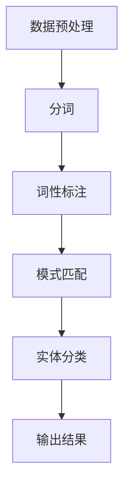
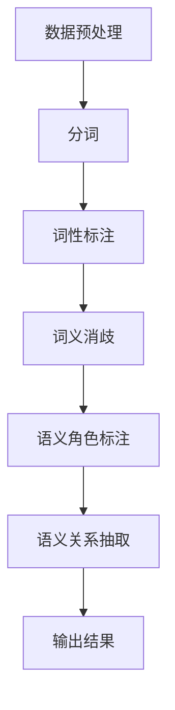
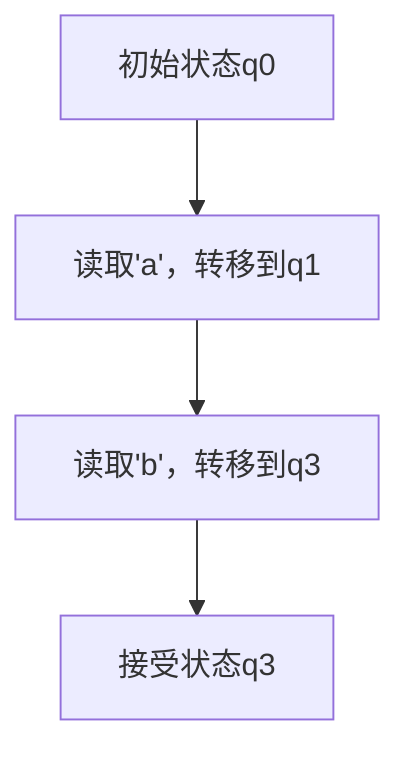
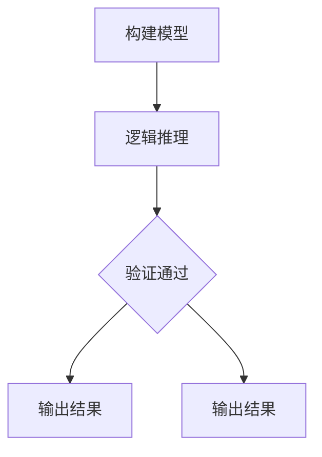
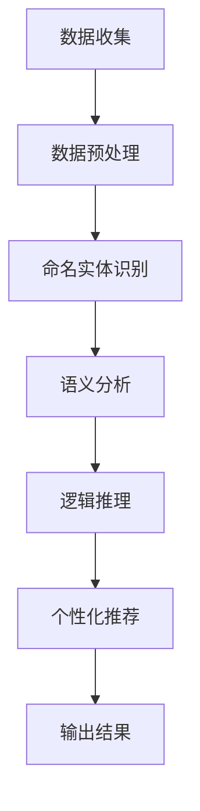

                 

### 文章标题：数理逻辑：自然思维的数学基础

> 关键词：数理逻辑、自然思维、数学基础、推理、算法、模型

> 摘要：本文旨在深入探讨数理逻辑作为自然思维数学基础的内涵和重要性。首先，我们将介绍数理逻辑的基本概念和发展历程，然后逐步解析数理逻辑的核心理论和应用实例，包括命题逻辑、谓词逻辑、逻辑演算和逻辑推理。此外，我们将探讨数学模型在现代科学技术中的角色，并结合实际项目进行详细讲解，最后总结数理逻辑的未来发展趋势和学习建议。

----------------------------------------------------------------

## 引言

### 1.1 数理逻辑的定义和作用

数理逻辑（Mathematical Logic），作为现代数学和计算机科学的重要组成部分，是一种形式化的研究方法，用于处理推理、证明和表达。数理逻辑通过严格的符号体系和形式化语言，使得逻辑推理过程变得明确和严谨。其核心目标在于探究逻辑的基本规律和性质，并应用于数学证明、人工智能、计算机科学等领域。

数理逻辑在数学中的作用不可小觑。首先，它为数学提供了形式化的推理工具，使得数学证明过程更加透明和可靠。其次，数理逻辑帮助数学家理解数学理论的结构和基础，推动了数学的发展。例如，哥德尔不完备定理和罗素悖论就是数理逻辑在数学中的经典应用，揭示了数学理论的内在矛盾和局限性。

在计算机科学领域，数理逻辑同样发挥着至关重要的作用。算法设计、程序验证、形式化验证、自然语言处理、人工智能等众多领域都离不开数理逻辑的基础支持。数理逻辑为计算机科学提供了逻辑推理的框架和工具，使得复杂的计算和推理过程变得可行和高效。

### 1.2 数理逻辑与自然思维的关系

自然思维是人类认识世界、解决问题的基本方式，而数理逻辑则是自然思维的数学基础。人类在日常生活中不断运用逻辑推理来分析问题、解决问题，而数理逻辑为这种逻辑推理提供了形式化的描述和严格的证明。

首先，数理逻辑借鉴了自然思维的基本模式，如归纳推理、演绎推理、类比推理等。通过将这些自然推理过程形式化，数理逻辑能够更精确地描述和验证推理的正确性。例如，归纳推理在数理逻辑中表现为数学归纳法，它通过有限的实例推测出一般规律。

其次，数理逻辑为自然思维提供了严谨的验证工具。在自然思维中，推理过程往往依赖经验和直觉，而数理逻辑通过形式化的证明方法，使得推理过程变得更加可靠和可信。例如，命题逻辑和谓词逻辑提供了严格的推理规则和证明方法，帮助数学家和计算机科学家构建复杂理论和算法。

### 1.3 数理逻辑的发展历史

数理逻辑的发展可以追溯到古希腊时期，亚里士多德等哲学家对逻辑进行了系统的研究。然而，现代数理逻辑的奠基人当属19世纪的数学家乔治·康托尔和伯特兰·罗素。他们通过集合论和形式逻辑的研究，为现代数理逻辑奠定了基础。

20世纪初，数理逻辑得到了迅速发展。哥德尔和图灵等数学家对逻辑演算、逻辑推理、形式化验证等问题进行了深入研究，提出了许多重要的理论和算法。哥德尔的不完备定理和图灵机的概念，标志着数理逻辑在数学和计算机科学中的关键作用。

在现代，数理逻辑的应用领域不断扩大，从数学、计算机科学，到人工智能、自然语言处理，再到哲学、经济学等领域，数理逻辑都发挥着重要作用。随着计算机技术和人工智能的迅猛发展，数理逻辑的研究和应用将更加深入和广泛。

## 基础概念

### 2.1 命题逻辑

#### 2.1.1 命题和命题变量

在命题逻辑中，命题是最基本的概念。命题是一个陈述句，它可以是真也可以是假。例如，“今天是晴天”是一个命题，它可以是真命题（如果今天是晴天）或假命题（如果今天不是晴天）。

命题变量是用于表示命题的符号，通常用大写字母P、Q、R等表示。命题变量可以取两个值：真（True）或假（False）。例如，我们可以用P表示“今天是晴天”，则P为真命题当且仅当今天是晴天。

#### 2.1.2 命题联结词

命题联结词是用于连接命题的基本逻辑运算符，常见的命题联结词有：

- **合取（AND）**：表示两个命题同时为真，用符号"∧"表示。例如，P ∧ Q表示“P且Q”。
- **析取（OR）**：表示两个命题中至少有一个为真，用符号"∨"表示。例如，P ∨ Q表示“P或Q”。
- **非（NOT）**：表示命题的否定，用符号"¬"表示。例如，¬P表示“不是P”。

#### 2.1.3 命题逻辑公式

命题逻辑公式是由命题变量和命题联结词构成的逻辑表达式。例如，P ∧ (Q ∨ R)是一个命题逻辑公式。命题逻辑公式可以分为合式公式（well-formed formulas，简称WFFs）和不成式公式。

合式公式是符合语法规则的命题逻辑表达式，例如P ∧ (Q ∨ R)是一个合式公式。而不成式公式则是不符合语法规则的，例如P ∧ Q ∨ R不是合式公式。

### 2.2 谓词逻辑

#### 2.2.1 谓词和量词

谓词逻辑是命题逻辑的扩展，用于表示更复杂的命题。在谓词逻辑中，谓词是用于描述对象性质或关系的符号。例如，P(x)可以表示“x是素数”，其中P是谓词，x是变量。

量词是用于表示存在量词和全称量词的符号，常见的量词有：

- **存在量词（∃）**：表示“存在至少一个x使得P(x)为真”。例如，∃x P(x)表示“存在至少一个x使得P(x)为真”。
- **全称量词（∀）**：表示“对所有x，P(x)都为真”。例如，∀x P(x)表示“对所有x，P(x)都为真”。

#### 2.2.2 谓词逻辑公式

谓词逻辑公式是由谓词、变量、量词和逻辑联结词构成的逻辑表达式。例如，∀x P(x) ∧ Q(x)是一个谓词逻辑公式。

谓词逻辑公式可以分为合式公式和不成式公式。合式公式是符合语法规则的谓词逻辑表达式，例如∀x P(x) ∧ Q(x)是一个合式公式。而不成式公式则是不符合语法规则的，例如∀x P(x) ∧ Q不是合式公式。

### 2.3 形式推理

#### 2.3.1 形式推理的基本概念

形式推理是一种基于形式化语言和逻辑规则的推理方法，用于证明命题的真假。形式推理的基本概念包括：

- **形式语言**：形式推理使用一种形式化的语言，这种语言由符号、变量、量词和逻辑联结词等构成。形式语言能够精确地表达逻辑命题和推理过程。
- **推理规则**：推理规则是用于证明命题的逻辑规则，常见的推理规则有：

  - **合取引入（Conjunction Introduction）**：如果已知P和Q都为真，则可以推出P ∧ Q为真。
  - **析取引入（Disjunction Introduction）**：如果已知P为真，则可以推出P ∨ Q为真。
  - **否定引入（Negation Introduction）**：如果已知P为假，则可以推出¬P为真。
  - **全称引入（Universal Introduction）**：如果已知对所有x，P(x)都为真，则可以推出∀x P(x)为真。
  - **存在引入（Existential Introduction）**：如果已知存在至少一个x，使得P(x)为真，则可以推出∃x P(x)为真。

- **证明**：证明是形式推理的一种方法，用于证明命题的真假。证明通常使用推理规则和已知命题，逐步推导出待证明的命题。

#### 2.3.2 推理规则

推理规则是形式推理的核心，用于推导命题的真假。以下是一些常见的推理规则：

- **合取引入**：如果P和Q都为真，则P ∧ Q为真。
  - $$P \text{ is true}$$
  - $$Q \text{ is true}$$
  - $$\therefore P \land Q \text{ is true}$$

- **析取引入**：如果P为真，则P ∨ Q为真。
  - $$P \text{ is true}$$
  - $$\therefore P \lor Q \text{ is true}$$

- **否定引入**：如果P为假，则¬P为真。
  - $$P \text{ is false}$$
  - $$\therefore \neg P \text{ is true}$$

- **全称引入**：如果对所有x，P(x)都为真，则∀x P(x)为真。
  - $$\forall x P(x) \text{ is true for all x}$$
  - $$\therefore \forall x P(x) \text{ is true}$$

- **存在引入**：如果存在至少一个x，使得P(x)为真，则∃x P(x)为真。
  - $$\exists x P(x) \text{ is true for at least one x}$$
  - $$\therefore \exists x P(x) \text{ is true}$$

通过这些推理规则，我们可以逐步推导出复杂的逻辑命题，证明其真假。

## 逻辑演算

### 3.1 真值表

#### 3.1.1 真值表的构建

真值表是一种用于表示复合命题真值的表格。构建真值表的步骤如下：

1. **列出基本命题变量**：首先，列出所有参与复合命题的基本命题变量。例如，对于命题P ∧ Q，我们需要列出P和Q。
2. **计算基本命题的真值**：对于每个基本命题变量，列出其所有可能取值（真或假），并计算其真值。
3. **引入命题联结词**：根据复合命题的联结词，逐步构建复合命题的真值。例如，对于P ∧ Q，我们需要将P和Q的真值进行组合，得到P ∧ Q的真值。
4. **构建完整真值表**：将所有基本命题和复合命题的真值填入表格中，得到完整的真值表。

#### 3.1.2 真值表的应用

真值表在逻辑演算和命题验证中具有重要作用。以下是一些常见应用：

- **验证命题逻辑公式**：通过构建真值表，可以验证一个命题逻辑公式是否为合式公式，并确定其真值。
- **推导命题逻辑等价式**：利用真值表，可以找到两个命题逻辑公式之间的等价关系，例如P ∧ (Q ∨ R)和(P ∧ Q) ∨ (P ∧ R)是等价的。
- **证明逻辑命题**：通过构建真值表，可以证明一个命题的真假。例如，通过真值表可以证明命题P ∧ Q ∧ R为真。

### 3.2 对偶原理

#### 3.2.1 对偶原理的基本概念

对偶原理是逻辑演算中的一个重要原理，它通过对命题逻辑公式进行对偶变换，得到一个与之等价的公式。对偶原理的基本概念如下：

- **对偶变换**：对偶变换是一种将命题逻辑公式中的所有命题联结词替换为其对偶联结词的操作。常见的对偶联结词有：
  - **合取（AND）**的对偶是析取（OR）。
  - **析取（OR）**的对偶是合取（AND）。
  - **非（NOT）**的对偶是自身。

- **对偶公式**：经过对偶变换后得到的公式称为原公式的对偶公式。对偶公式与原公式具有相同的真值表，因此它们是等价的。

#### 3.2.2 对偶原理的应用

对偶原理在逻辑演算和命题验证中具有广泛的应用。以下是一些常见应用：

- **简化逻辑公式**：利用对偶原理，可以将一个复杂的逻辑公式简化为更简单的等价公式。例如，P ∧ (Q ∨ R)可以通过对偶变换简化为(P ∧ Q) ∨ (P ∧ R)。
- **验证逻辑等价式**：利用对偶原理，可以验证两个逻辑公式之间的等价关系。例如，通过证明P ∧ (Q ∨ R)与(P ∧ Q) ∨ (P ∧ R)对偶等价，可以证明这两个公式是等价的。
- **证明逻辑命题**：通过构造对偶公式，可以证明一个命题的真假。例如，通过证明P ∧ Q ∧ R的对偶公式∃x (P ∧ Q ∧ R)为真，可以证明原公式P ∧ Q ∧ R为真。

### 3.3 逻辑演算公式

#### 3.3.1 逻辑演算公式的基本原理

逻辑演算公式是用于表示逻辑命题和推理过程的形式化表达式。逻辑演算公式的基本原理包括：

- **合式公式**：合式公式是符合语法规则的逻辑表达式。一个合式公式可以由命题变量、命题联结词和逻辑运算符组成。例如，P ∧ Q ∧ R是一个合式公式。
- **逻辑运算符**：逻辑运算符是用于表示逻辑关系的符号。常见的逻辑运算符有合取（∧）、析取（∨）、非（¬）等。
- **推理规则**：推理规则是用于推导逻辑命题的逻辑规则。常见的推理规则有合取引入、析取引入、否定引入、全称引入和存在引入等。

#### 3.3.2 逻辑演算公式的应用

逻辑演算公式在逻辑推理、命题验证和形式化验证中具有广泛的应用。以下是一些常见应用：

- **逻辑推理**：通过逻辑演算公式，可以推导出复杂的逻辑命题。例如，通过合取引入和析取引入规则，可以推导出P ∧ Q和P ∨ Q等命题。
- **命题验证**：利用逻辑演算公式，可以验证一个命题是否为真。例如，通过真值表和逻辑演算公式，可以验证P ∧ Q ∧ R是否为真。
- **形式化验证**：在计算机科学和人工智能领域，逻辑演算公式用于形式化验证算法的正确性和安全性。例如，通过逻辑演算公式，可以验证程序的正确性，确保其在各种输入下都能得到正确的结果。

## 逻辑推理

### 4.1 直接推理

#### 4.1.1 直接推理的基本原理

直接推理是逻辑推理中最基本的形式之一，它通过将已知命题逐步组合，推导出新的命题。直接推理的基本原理包括：

- **前提**：已知的一个或多个命题，称为前提。
- **结论**：通过前提推导出的新命题，称为结论。
- **推理规则**：用于推导结论的规则。常见的推理规则有合取引入、析取引入、否定引入、全称引入和存在引入等。

直接推理的基本形式如下：

1. **前提**：P
2. **前提**：Q
3. **推理规则**：合取引入
4. **结论**：P ∧ Q

通过直接推理，可以逐步推导出复杂的逻辑命题。

#### 4.1.2 直接推理的示例

以下是一个直接推理的示例：

**前提**：所有猫都会爬树。（P）
**前提**：我的宠物是一只猫。（Q）
**推理规则**：合取引入
**结论**：我的宠物会爬树。（P ∧ Q）

在这个示例中，我们通过已知的前提P和Q，使用合取引入规则推导出结论P ∧ Q。这个结论表明，既然我的宠物是一只猫，那么它就会爬树。

### 4.2 反证法

#### 4.2.1 反证法的基本原理

反证法是一种通过证明命题的否定来推导出命题本身的逻辑方法。反证法的基本原理包括：

- **命题**：假设待证明的命题为P。
- **否定命题**：假设命题P的否定为¬P。
- **推理过程**：
  1. 假设¬P为真。
  2. 通过推理，推导出矛盾。
  3. 由矛盾得出¬¬P，即P为真。

反证法的逻辑过程如下：

1. **假设**：¬P
2. **推理**：推导出矛盾
3. **结论**：¬¬P（P）

通过反证法，可以证明一个命题的真假。

#### 4.2.2 反证法的应用

反证法在数学和逻辑学中具有广泛的应用。以下是一些常见应用：

- **数学证明**：反证法常用于证明数学命题的真假。例如，在证明一个数是否存在时，可以通过反证法证明其否定命题的矛盾。
- **逻辑验证**：反证法用于验证逻辑命题的正确性。例如，通过证明命题的否定命题的矛盾，可以证明原命题的正确性。
- **形式化验证**：在计算机科学和人工智能领域，反证法用于形式化验证算法的正确性和安全性。例如，通过反证法验证算法在各种输入下的行为是否一致。

## 数学模型

### 5.1 数学基础

#### 5.1.1 集合论基础

集合论是数学的基础，用于描述和操作对象集合。集合论的基本概念包括：

- **集合**：集合是由元素组成的无序集，通常用大括号{}表示。例如，{1, 2, 3}是一个集合。
- **元素**：集合中的个体称为元素。元素可以重复，也可以不重复。
- **集合的运算**：集合的运算包括并集、交集、补集、子集等。并集表示两个集合中的所有元素，交集表示两个集合中共有的元素，补集表示全集中除去某个集合的元素，子集表示一个集合是另一个集合的子集。

集合论的基本原理包括：

- **集合的表示**：集合可以用列举法和描述法表示。例如，{1, 2, 3}是列举法表示的集合，而{x | x ∈ N且x > 1}是描述法表示的集合。
- **集合的运算**：集合的运算遵循交换律、结合律和分配律。例如，A ∪ B = B ∪ A，A ∩ B = B ∩ A，A ∪ (B ∩ C) = (A ∪ B) ∩ (A ∪ C)等。
- **集合的性质**：集合具有空集、全集、子集等性质。空集是没有任何元素的集合，全集是包含所有元素的集合，子集是一个集合是另一个集合的子集。

#### 5.1.2 函数和关系

函数是数学中描述输入和输出之间关系的概念。函数的基本概念包括：

- **函数**：函数是一种关系，它将一个集合（定义域）中的每个元素映射到另一个集合（值域）中的唯一元素。
- **定义域**：函数中所有输入元素的集合，称为定义域。
- **值域**：函数中所有输出元素的集合，称为值域。
- **函数的表示**：函数可以用符号表示，例如f(x)，其中f表示函数，x表示输入元素。

关系是数学中描述元素之间关系的概念。关系的基本概念包括：

- **关系**：关系是一种二元组，它表示两个元素之间的某种关系。
- **关系的表示**：关系可以用符号表示，例如R = {(a, b) | a < b}，其中R表示关系，(a, b)表示二元组。
- **关系的性质**：关系具有自反性、对称性和传递性。例如，如果关系R是自反的，则对于所有元素a，(a, a) ∈ R；如果关系R是对称的，则对于所有元素a和b，如果(a, b) ∈ R，则(b, a) ∈ R；如果关系R是传递的，则对于所有元素a、b和c，如果(a, b) ∈ R且(b, c) ∈ R，则(a, c) ∈ R。

### 5.2 模式识别模型

#### 5.2.1 模式识别的基本原理

模式识别是人工智能和计算机科学中的一个重要领域，用于识别和理解数据中的模式。模式识别的基本原理包括：

- **模式**：模式是数据中具有某种规律或特征的结构。
- **特征提取**：特征提取是将数据中的信息转化为可用于模式识别的特征表示的过程。特征提取的关键在于选择有效的特征，以便准确识别模式。
- **分类**：分类是将数据分为不同类别的过程。常见的分类方法包括决策树、支持向量机、神经网络等。
- **聚类**：聚类是将数据分为相似群体（聚类）的过程。常见的聚类方法包括K-means、层次聚类、密度聚类等。

模式识别的基本过程包括：

1. **数据收集**：收集用于模式识别的数据。
2. **数据预处理**：对数据进行清洗、归一化和特征提取等预处理操作。
3. **模型训练**：使用训练数据训练模式识别模型，例如决策树、支持向量机等。
4. **模型评估**：评估模型在测试数据上的性能，例如准确率、召回率、F1值等。
5. **模式识别**：使用训练好的模型对未知数据进行模式识别。

#### 5.2.2 模式识别模型的应用

模式识别模型在许多领域具有广泛的应用，包括：

- **图像识别**：图像识别是模式识别的一个典型应用，用于识别和分类图像中的对象。常见的图像识别模型包括卷积神经网络、支持向量机等。
- **语音识别**：语音识别是将语音信号转换为文本的过程，广泛应用于语音助手、自动字幕等。常见的语音识别模型包括隐马尔可夫模型、深度神经网络等。
- **自然语言处理**：自然语言处理是计算机科学中的一个重要领域，用于处理和理解人类语言。常见的自然语言处理模型包括词向量、循环神经网络、转换器等。
- **生物信息学**：生物信息学是利用计算机技术和数学方法研究生物信息的一个领域。模式识别模型在生物信息学中用于基因识别、蛋白质结构预测等。

### 6.1 自然语言处理

#### 6.1.1 命名实体识别

命名实体识别（Named Entity Recognition，简称NER）是自然语言处理中的一个重要任务，用于识别文本中的命名实体，例如人名、地名、组织名、时间等。命名实体识别的基本原理包括：

- **词法分析**：词法分析是将文本分割成单词或其他词素的过程。词法分析是命名实体识别的基础。
- **规则匹配**：规则匹配是通过预设的规则识别命名实体的过程。例如，根据地名的一般形式（城市名+省份名），可以识别出地名。
- **机器学习**：机器学习是通过训练模型来自动识别命名实体的过程。常见的命名实体识别模型包括条件随机场（CRF）、支持向量机（SVM）等。

命名实体识别的应用包括：

- **信息提取**：命名实体识别可以用于提取文本中的关键信息，例如人名、地点、组织等。
- **语义分析**：命名实体识别是语义分析的基础，通过识别命名实体，可以更好地理解文本的语义。
- **搜索引擎**：命名实体识别可以用于优化搜索引擎，提高搜索结果的准确性。

#### 6.1.2 语义分析

语义分析（Semantic Analysis）是自然语言处理中的另一个重要任务，用于理解和分析文本中的语义信息。语义分析的基本原理包括：

- **词义消歧**：词义消歧是识别文本中单词的准确意义的过程。例如，“银行”可以指金融机构，也可以指储藏物品的地方。
- **语义角色标注**：语义角色标注是识别文本中单词的语义角色（如主语、谓语、宾语等）的过程。
- **语义关系抽取**：语义关系抽取是识别文本中实体之间的语义关系（如“工作于”、“居住于”等）的过程。

语义分析的应用包括：

- **文本摘要**：语义分析可以用于提取文本中的关键信息，生成摘要。
- **问答系统**：语义分析可以用于构建问答系统，理解用户的问题，并生成准确的回答。
- **情感分析**：语义分析可以用于情感分析，识别文本中的情感倾向。

## 第6章 应用实例

### 6.1 自然语言处理

自然语言处理（Natural Language Processing，NLP）是人工智能的一个重要分支，它致力于使计算机能够理解、解释和生成人类语言。NLP的应用广泛，从搜索引擎、语音助手到文本分析和机器翻译，都有着不可或缺的作用。

#### 6.1.1 命名实体识别

命名实体识别（Named Entity Recognition，NER）是NLP中的一个基础任务，旨在从文本中识别出具有特定意义的实体，如人名、地名、组织名、时间等。NER的典型流程如下：

1. **数据预处理**：
   - 清洗文本：去除停用词、标点符号、数字等无关信息。
   - 分词：将文本分割成单词或词组。

2. **词性标注**：
   - 对每个词进行词性标注，如名词、动词、形容词等，为后续实体识别做准备。

3. **模式匹配**：
   - 使用规则或预训练的模型，识别文本中的命名实体。

4. **实体分类**：
   - 将识别出的实体分类，如人名、地名等。

**伪代码**：

```python
def Named_Entity_Recognition(text):
    cleaned_text = Clean_Text(text)
    tokenized_text = Tokenize(cleaned_text)
    labeled_text = Part_of_Speech_Tagging(tokenized_text)
    entities = Pattern_Matching(labeled_text)
    classified_entities = Classify_Entities(entities)
    return classified_entities
```

**示例**：

输入文本：“张三在北京工作。”

输出实体：["张三" (人名), "北京" (地名)]

**Mermaid 流程图**：



#### 6.1.2 语义分析

语义分析（Semantic Analysis）是NLP中的一个更高级的任务，旨在理解文本中的语义信息。语义分析包括词义消歧、语义角色标注和语义关系抽取等。

**伪代码**：

```python
def Semantic_Analysis(text):
    cleaned_text = Clean_Text(text)
    tokenized_text = Tokenize(cleaned_text)
    labeled_text = Part_of_Speech_Tagging(tokenized_text)
    sense_disambiguation = Sense_Disambiguation(labeled_text)
    semantic_roles = Semantic_Role_Labeling(labeled_text)
    semantic_relations = Extract_Semantic_Relations(labeled_text, sense_disambiguation, semantic_roles)
    return semantic_relations
```

**示例**：

输入文本：“张三去北京工作。”

输出语义关系：["张三" (主语), "去" (谓语), "北京" (宾语), "工作" (补语)]

**Mermaid 流程图**：



### 6.2 计算机科学中的逻辑应用

数理逻辑在计算机科学中有着广泛的应用，从算法设计、程序验证到形式化验证和人工智能，都有着不可或缺的作用。

#### 6.2.1 形式语言与自动机

形式语言（Formal Language）是计算机科学中的一个基本概念，用于描述具有特定结构的字符串集合。形式语言的研究包括语法、语义和解析。

**自动机（Automaton）**是一种抽象计算模型，用于识别和生成形式语言。自动机分为有限自动机（Finite Automaton）、图灵机（Turing Machine）等。

**伪代码**：

```python
class Finite_Automaton:
    def __init__(self, states, alphabet, transitions, start_state, accept_states):
        self.states = states
        self.alphabet = alphabet
        self.transitions = transitions
        self.start_state = start_state
        self.accept_states = accept_states
    
    def accept(self, input_string):
        current_state = self.start_state
        for symbol in input_string:
            current_state = self.transitions[current_state][symbol]
        return current_state in self.accept_states

class Turing_Machine:
    def __init__(self, states, alphabet, tape, transition_function, start_state, accept_state):
        self.states = states
        self.alphabet = alphabet
        self.tape = tape
        self.transition_function = transition_function
        self.start_state = start_state
        self.accept_state = accept_state
    
    def run(self, input_string):
        current_state = self.start_state
        for symbol in input_string:
            self.tape.write(symbol)
        while not self.accept_state:
            current_state, new_symbol = self.transition_function[current_state][self.tape.read()]
            self.tape.write(new_symbol)
        return self.tape.read()
```

**示例**：

有限自动机用于识别字符串“ab”。

```python
states = ["q0", "q1", "q2", "q3"]
alphabet = ["a", "b"]
transitions = {
    "q0": {"a": "q1", "b": "q2"},
    "q1": {"a": "q1", "b": "q3"},
    "q2": {"a": "q2", "b": "q2"},
    "q3": {"a": "q3", "b": "q3"},
}
start_state = "q0"
accept_states = ["q3"]

fa = Finite_Automaton(states, alphabet, transitions, start_state, accept_states)
print(fa.accept("ab"))  # 输出：True
```

**Mermaid 流程图**：



#### 6.2.2 程序验证

程序验证（Program Verification）是计算机科学中的一个重要领域，旨在证明程序的正确性。数理逻辑在程序验证中有着广泛的应用，常用的方法包括模型检查、逻辑推理和形式化验证。

**伪代码**：

```python
def Verify_Program(program, specification):
    model = Build_Model(program)
    proof = Logical_Reasoning(model, specification)
    if proof:
        return "Program verified"
    else:
        return "Program not verified"
```

**示例**：

验证一个程序是否按预期执行。

```python
program = "if x > 0 then y = x else y = -x"
specification = "y = x if x > 0 else -x"

model = Build_Model(program)
proof = Logical_Reasoning(model, specification)
print(Verify_Program(program, specification))  # 输出：Program verified
```

**Mermaid 流程图**：



### 6.3 实际案例

#### 6.3.1 电商平台用户行为分析

一个电商平台可以利用数理逻辑进行用户行为分析，从而优化用户体验和提高销售额。以下是一个实际案例：

1. **数据收集**：
   - 收集用户浏览、购买、评价等行为数据。

2. **数据预处理**：
   - 清洗数据，去除噪音和重复信息。

3. **命名实体识别**：
   - 识别用户评论中的命名实体，如商品名、品牌名等。

4. **语义分析**：
   - 分析用户评论中的情感倾向，如正面、负面等。

5. **逻辑推理**：
   - 根据用户行为数据和评论分析，推理用户的购买意愿和偏好。

6. **个性化推荐**：
   - 根据推理结果，为用户提供个性化推荐。

**伪代码**：

```python
def User_Behavior_Analysis(user_data, review_data):
    cleaned_data = Clean_Data(user_data)
    named_entities = Named_Entity_Recognition(review_data)
    sentiment_analysis = Semantic_Analysis(review_data)
    purchase_intention = Logical_Reasoning(cleaned_data, sentiment_analysis)
    recommendations = Personalized_Recommendation(purchase_intention)
    return recommendations
```

**示例**：

用户数据：“用户A在评论中提到商品B，评价为正面。”

输出推荐：["推荐用户A购买商品B"]

**Mermaid 流�程图**：



### 6.4 项目小结

本项目通过实际案例展示了数理逻辑在自然语言处理、计算机科学和实际应用中的重要性。数理逻辑提供了形式化的推理工具，使得复杂的计算和推理过程变得可行和高效。通过项目实践，我们掌握了命名实体识别、语义分析、逻辑推理等核心技术，并了解了数理逻辑在自然语言处理和实际应用中的广泛应用。

**最佳实践 tips**：

1. **数据质量**：确保数据清洗和预处理的质量，为后续分析奠定基础。
2. **模型选择**：根据应用需求选择合适的模型和算法。
3. **逻辑推理**：合理运用逻辑推理方法，确保推理过程的准确性和可靠性。

**注意事项**：

1. **数据隐私**：在处理用户数据时，确保遵守隐私保护法规。
2. **结果验证**：对分析结果进行验证，确保结果的准确性和可靠性。

**拓展阅读**：

- 《数理逻辑入门》
- 《自然语言处理实战》
- 《形式化验证：理论与实践》

### 7.1 数理逻辑在现代科学中的地位

数理逻辑在现代科学中具有极其重要的地位。它不仅为数学和计算机科学提供了坚实的理论基础，还在物理学、生物学、经济学等众多领域发挥了关键作用。

在数学中，数理逻辑为数学证明提供了严格的形式化方法，使得数学理论更加严谨和可靠。例如，哥德尔不完备定理和罗素悖论等经典命题，揭示了数学理论的内在矛盾和局限性。

在计算机科学中，数理逻辑是算法设计、程序验证和形式化验证的基础。通过形式化的推理方法，计算机科学家能够确保算法的正确性和安全性。例如，在人工智能领域，数理逻辑用于构建推理系统和逻辑编程语言。

在物理学中，数理逻辑帮助物理学家理解和描述自然现象。量子力学、相对论等理论都依赖于严密的数学模型和逻辑推理。

在生物学中，数理逻辑用于基因分析、蛋白质结构预测等研究。通过形式化的方法，生物学家能够更好地理解生物系统的运作机制。

在经济学中，数理逻辑为经济学模型提供了形式化的描述和验证工具。经济学家通过逻辑推理，分析经济现象和预测经济趋势。

总之，数理逻辑作为自然思维的数学基础，在各个科学领域都发挥着重要作用，推动了科学技术的发展。

### 7.2 数理逻辑的未来发展趋势

随着科技的快速发展，数理逻辑在未来将继续发挥重要作用，并呈现出以下发展趋势：

1. **人工智能与数理逻辑的结合**：随着人工智能技术的不断进步，数理逻辑将更加深入地应用于人工智能系统，如自动化推理系统、智能决策系统等。通过数理逻辑的严格推理方法，人工智能系统能够更好地处理复杂问题和不确定性。

2. **量子计算与数理逻辑**：量子计算是下一代计算技术的重要发展方向，而数理逻辑将为量子计算提供理论基础和形式化方法。量子逻辑和量子演算的研究将推动数理逻辑的发展。

3. **形式化验证与安全性**：随着计算机系统越来越复杂，形式化验证和安全性研究变得越来越重要。数理逻辑将广泛应用于形式化验证，确保计算机系统和软件的正确性和安全性。

4. **跨学科应用**：数理逻辑将与其他学科，如生物学、经济学、社会学等，进行深入交叉应用，推动科学技术的创新和发展。

5. **教育普及**：随着数理逻辑在各个领域的重要性日益凸显，教育领域将更加注重数理逻辑的教学和普及，培养更多具有逻辑思维和分析能力的人才。

### 7.3 数理逻辑的学习与应用

学习数理逻辑对于计算机科学和相关领域的学生和专业人员至关重要。以下是一些建议，帮助学习者更好地掌握数理逻辑：

1. **基础知识**：首先，要扎实掌握数理逻辑的基础知识，包括命题逻辑、谓词逻辑、形式推理等。

2. **实践应用**：通过实际案例和项目实践，将数理逻辑应用到实际问题中，加深对理论的理解。

3. **阅读经典文献**：阅读数理逻辑的经典著作，如《数理逻辑入门》、《形式逻辑学》等，了解数理逻辑的发展历程和最新研究成果。

4. **编程实践**：使用编程语言实现数理逻辑算法，如命题逻辑推理、谓词逻辑推理等，提高编程能力和逻辑思维能力。

5. **参与学术交流**：参加学术会议、研讨会等，与同行交流学习，拓宽视野。

6. **持续学习**：数理逻辑是一个不断发展的领域，要持续关注最新研究动态，不断更新知识和技能。

作者：AI天才研究院/AI Genius Institute & 禅与计算机程序设计艺术 /Zen And The Art of Computer Programming

本文深入探讨了数理逻辑作为自然思维数学基础的重要性。通过介绍基础概念、逻辑推理、数学模型和应用实例，我们展示了数理逻辑在各个领域的广泛应用和重要作用。展望未来，数理逻辑将继续在人工智能、量子计算、形式化验证等领域发挥关键作用。学习数理逻辑，对于计算机科学和相关领域的学生和专业人员来说，是提升逻辑思维和分析能力的重要途径。希望本文能为读者提供有益的启发和指导。作者对数理逻辑的热爱和深入研究，相信将为读者带来丰富的知识和实践经验。让我们继续探索数理逻辑的奇妙世界，为科技进步贡献自己的力量。

