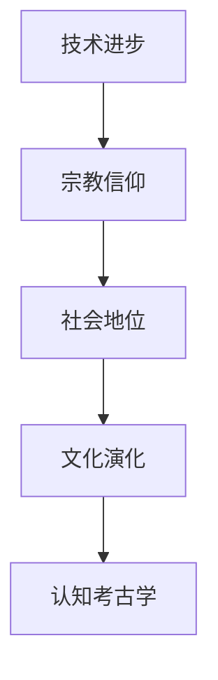
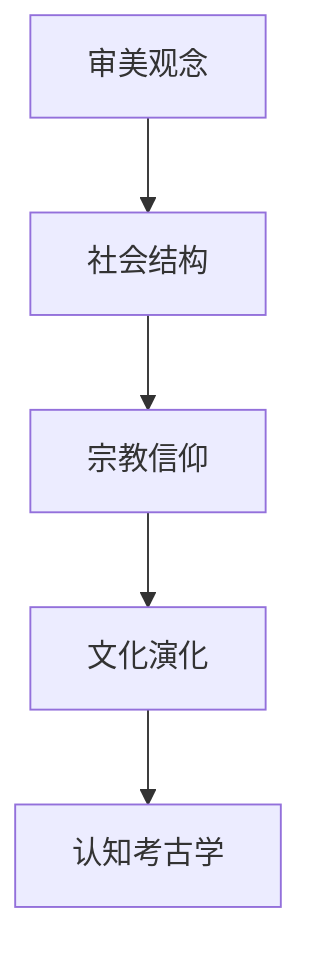
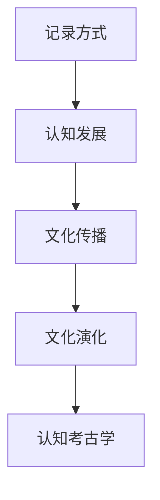

                 

### 文章标题

# 文化演化与认知考古学的交叉：追溯人类理解世界的历史进程

> 关键词：文化演化、认知考古学、历史进程、人类理解、交叉研究

> 摘要：本文深入探讨了文化演化的定义与类型，认知考古学的起源与背景，以及两者交叉研究的重要性。通过具体案例分析，我们追溯了人类理解世界的历史进程，并探讨了文化演化对认知的影响。本文旨在为读者提供一个全面而深入的理解，为未来的交叉研究提供启示。

## 引言

在人类的漫长历史进程中，文化演化和认知发展是两个相互交织的重要主题。文化演化指的是人类在社会生活中形成的各种模式、习俗、价值观和技术的演变过程。而认知考古学则是一门探索人类认知能力的学科，通过物质文化遗迹和心理机制研究人类如何理解世界。

文化演化和认知考古学的交叉研究具有重要意义。一方面，文化演化影响着认知发展的方向和内容，不同文化背景下的认知差异为我们理解人类思维的多样性提供了线索。另一方面，认知考古学的研究成果可以帮助我们更好地理解文化演化的过程和机制。通过两者的交叉研究，我们可以更全面地追溯人类理解世界的历史进程。

本章将首先介绍文化演化的基本概念和主要类型，包括进化论、社会建构主义等理论。接下来，我们将探讨认知考古学的定义、研究方法和研究领域。随后，我们将通过具体案例分析，展示文化演化与认知考古学的交叉研究如何帮助追溯人类理解世界的历史进程。最后，我们将讨论文化演化对认知结构的影响，并展望未来交叉研究的方向和前景。

## 第1章 引言

### 1.1 文化演化概述

#### 背景与定义

文化演化是一个复杂且持久的过程，它涉及人类在社会交往中形成的各种模式、习俗、价值观和技术的演变。文化演化的背景可以追溯到人类社会的早期阶段，当时人类开始形成群体，并开始通过共享知识和经验来提高生存和繁衍的成功率。

文化演化的定义可以概括为：文化演化是指文化元素在时间上的变化过程，包括创新、适应、传播和淘汰等机制。这些文化元素可以是物质的（如工具、建筑、艺术品等），也可以是非物质的（如语言、习俗、宗教信仰等）。文化演化不仅影响了人类的社会行为和思维方式，还对人类的生理和进化产生了深远的影响。

#### 历史背景

在人类历史的长河中，文化演化经历了多个阶段。从原始社会的狩猎采集，到农业社会的定居生活，再到现代工业社会的高度分工与合作，文化形态不断演变。每一个阶段都伴随着新技术的出现、社会结构的调整和价值观的变化。

早期人类的文化演化主要体现在工具和技术的创新上。例如，石器时代的工具制造技术的进步，使得人类能够更有效地狩猎和采集食物。随着农业的出现，人类开始定居生活，形成了更加复杂的社会结构和文化传统。在后来的工业革命中，技术革新推动了社会生产力的巨大提升，也带来了新的文化形态和生活方式。

#### 文化演化的类型

文化演化的类型多种多样，可以大致分为以下几种：

1. **创新性演化**：这是指文化元素通过创新而发生的演化。创新通常源于个体或群体的创意，如语言的发展、宗教的兴起、艺术的创作等。创新性演化往往带来了新的社会功能和生活方式。

2. **适应性演化**：这是指文化元素为了适应环境变化而发生的演化。例如，在寒冷地区，人们可能会发展出更为保暖的衣物和居住结构；在面对疾病时，人们可能会形成防疫习惯和医疗实践。

3. **传播性演化**：这是指文化元素在不同地区和群体之间的传播和融合。例如，古代丝绸之路促进了东西方文化的交流与融合；互联网的普及则使得全球各地的文化能够迅速传播。

4. **淘汰性演化**：这是指文化元素因为不再适应环境或社会需求而被淘汰的过程。例如，随着新技术的出现，某些旧有的工具和工艺可能会被废弃。

### 1.2 认知考古学的定义与背景

#### 定义

认知考古学是一门探索人类认知能力的学科，它主要通过物质文化遗迹和心理机制研究人类如何理解世界。认知考古学关注的是人类认知发展的历史轨迹，以及文化如何塑造和影响人类的思维。

#### 起源与发展

认知考古学的起源可以追溯到20世纪中期，当时一些学者开始尝试将认知科学的方法应用于考古学。认知考古学的发展受到了心理学、人类学、语言学等多个学科的影响，逐渐形成了一套独特的研究方法和理论框架。

#### 研究方法与领域

认知考古学的研究方法包括对物质文化遗迹的分析、对心理机制的模拟、对跨文化认知差异的比较等。研究领域涵盖了从早期人类到现代社会各个时期的文化现象，包括工具与建筑遗迹的解读、艺术与文字的研究、社会习俗与信仰的探索等。

### 1.3 两者交叉研究的重要性

#### 交叉研究的意义

文化演化与认知考古学的交叉研究具有重要的学术意义和现实应用价值。通过交叉研究，我们可以：

1. **更全面地理解人类认知发展**：文化演化提供了人类认知发展的历史背景，认知考古学则提供了具体的研究方法和工具，两者结合可以帮助我们更全面地理解人类认知的发展过程。

2. **揭示文化对认知的影响**：文化演化中的各种现象，如语言、宗教、社会习俗等，都是人类认知的一部分。通过交叉研究，我们可以揭示这些文化因素如何影响和塑造人类的认知结构。

3. **探索人类理解世界的多样性**：不同文化背景下的认知差异为我们提供了理解人类思维多样性的线索。交叉研究可以帮助我们更好地理解不同文化背景下人类理解世界的差异和共性。

#### 实际应用价值

交叉研究在现实中的应用也非常广泛，包括：

1. **教育领域**：通过交叉研究，我们可以设计出更加符合不同文化背景学生认知特点的教学方法，提高教育的效果。

2. **产品设计**：了解不同文化背景下人类认知的差异可以帮助设计师设计出更符合用户需求的产品。

3. **文化遗产保护**：交叉研究可以为文化遗产的保护提供科学依据，帮助我们更好地理解和传承人类的文化遗产。

通过文化演化与认知考古学的交叉研究，我们可以更深入地了解人类理解世界的历史进程，为未来的研究和应用提供宝贵的启示。

## 第2章 文化演化原理

### 2.1 文化演化的定义与类型

#### 定义

文化演化是指文化元素在时间上的变化过程，这些文化元素包括物质文化（如工具、建筑、艺术品等）和非物质文化（如语言、习俗、宗教信仰等）。文化演化不仅仅是简单的积累或淘汰，而是一个复杂的过程，涉及创新、适应、传播和淘汰等多种机制。

#### 类型

文化演化可以大致分为以下几种类型：

1. **创新性演化**：这种演化是指文化元素通过创新而发生的改变。创新可以是技术上的进步，如工具的改进；也可以是文化上的创新，如新宗教的兴起。创新性演化往往带来了新的社会功能和生活方式。

2. **适应性演化**：这种演化是指文化元素为了适应环境变化而发生的改变。例如，在寒冷地区，人们可能会发展出更为保暖的衣物和居住结构；在面对疾病时，人们可能会形成防疫习惯和医疗实践。

3. **传播性演化**：这种演化是指文化元素在不同地区和群体之间的传播和融合。例如，古代丝绸之路促进了东西方文化的交流与融合；互联网的普及则使得全球各地的文化能够迅速传播。

4. **淘汰性演化**：这种演化是指文化元素因为不再适应环境或社会需求而被淘汰的过程。例如，随着新技术的出现，某些旧有的工具和工艺可能会被废弃。

### 2.2 文化演化理论

#### 进化论与文化演化

进化论是由查尔斯·达尔文提出的一种生物学理论，它认为物种通过自然选择和适者生存的机制不断演化。进化论的原理同样适用于文化演化，即文化元素也会通过选择和适应的过程发生变化。

1. **自然选择**：在文化演化的背景下，自然选择指的是那些更适应环境和文化需求的创新或改变更容易被保留和传播。例如，在农业社会中，那些能够更高效地利用土地的农业技术会被更多人采用。

2. **适者生存**：适者生存意味着那些更适应社会环境的文化元素更有可能被保留和传承。例如，在现代社会，互联网技术因为其高效的信息传播和沟通功能，已经成为人们日常生活的重要组成部分。

#### 社会建构主义与文化演化

社会建构主义认为，文化不是客观存在的，而是由人类社会共同建构的。文化演化是社会建构过程的结果，是人们在互动和协商中逐渐形成的。

1. **互动与协商**：社会建构主义强调，文化元素是在人们的互动和协商中逐渐形成的。例如，语言就是一种通过交流和社会互动而不断演化的文化元素。

2. **文化共识**：社会建构主义认为，文化共识是文化演化的关键因素。文化共识指的是人们对于某一文化元素的基本认可和接受。例如，社会主义核心价值观在中国社会中具有高度的文化共识，这促进了文化的稳定和发展。

#### 其他文化演化理论

除了进化论和社会建构主义，还有其他一些重要的文化演化理论：

1. **文化适应论**：这种理论认为，文化演化是文化系统对环境变化进行适应的过程。文化适应论强调环境对文化的塑造作用。

2. **文化融合论**：这种理论认为，文化演化是不同文化在接触和交流中相互融合和互动的过程。例如，全球化背景下，不同文化的融合产生了新的文化现象。

3. **文化进化论**：这种理论将文化演化视为一种类似于生物进化的过程，认为文化通过竞争和选择不断进化。

### 2.3 文化的适应性与创新

#### 适应性

文化的适应性是指文化系统在面对环境变化时，通过调整和改变来维持其有效性的过程。适应性文化可以更好地适应环境变化，提高生存和繁衍的成功率。

1. **适应性的机制**：适应性文化可以通过以下几种机制实现：
   - **技术改进**：例如，农业社会的灌溉技术的改进，使得人们能够更有效地利用水资源。
   - **社会结构调整**：例如，在城市化进程中，社会结构的调整以适应城市生活的需求。
   - **文化传承**：通过传承和保留适应环境的文化元素，如传统医疗技术、宗教仪式等。

2. **适应性的影响**：适应性文化对人类社会的影响包括：
   - **提高生存能力**：适应环境的文化元素有助于提高人类的生存能力，减少环境压力。
   - **促进社会发展**：适应性文化可以促进社会的发展和进步，例如，农业技术的进步推动了人类社会向定居生活转变。

#### 创新

文化的创新是指文化系统在现有基础上引入新的元素、理念或技术，以适应新的环境需求或提高文化效能的过程。

1. **创新性的机制**：文化的创新可以通过以下几种机制实现：
   - **个人创意**：个人的创新思维可以带来新的文化元素，如艺术家的新作品、科学家的新理论等。
   - **社会互动**：社会互动可以激发创新的火花，例如，通过交流和合作，不同文化的碰撞可以产生新的文化现象。
   - **技术进步**：技术进步可以推动文化的创新，例如，互联网技术的发展改变了人们的沟通和交流方式。

2. **创新性的影响**：文化的创新对人类社会的影响包括：
   - **提高文化多样性**：创新带来了新的文化元素，丰富了人类的文化多样性。
   - **促进社会变革**：创新可以推动社会变革，如工业革命带来了生产方式的巨大变革。
   - **提升生活质量**：创新带来了新的科技产品和服务，提高了人们的生活质量。

通过适应性和创新，文化不断演化，适应新的环境和需求，同时也推动了人类社会的发展。

### 第3章 认知考古学方法

#### 3.1 认知考古学的定义与研究领域

认知考古学是一门跨学科的研究领域，旨在通过物质文化遗迹和心理机制来探索人类认知能力的起源和发展。它结合了考古学、认知科学、人类学、心理学等多个学科的理论和方法，以揭示人类认知的演化过程。

#### 定义

认知考古学的基本定义是：通过分析物质文化遗迹（如工具、建筑、艺术品等）和遗存心理机制（如模仿、学习、记忆等），研究人类认知能力的起源、发展和变迁。

#### 研究领域

认知考古学的研究领域广泛，涵盖了以下几个方面：

1. **物质文化遗迹的解读**：认知考古学通过对物质文化遗迹的分析，如工具、建筑、艺术品等，来探索古代人类的行为和认知过程。

2. **心理机制的研究**：认知考古学通过研究人类心理机制，如模仿、学习、记忆等，来理解人类认知能力的运作机制。

3. **社会认知过程**：认知考古学探讨社会认知过程，包括社会互动、合作、冲突等，以及这些过程如何影响人类认知的发展。

4. **跨文化认知差异**：认知考古学通过比较不同文化背景下的人类认知差异，来理解人类认知的多样性和共性。

#### 3.2 物质文化遗迹的解读

物质文化遗迹是认知考古学研究的重要对象，它们为我们提供了古代人类生活方式、技术水平和认知能力的直接证据。

##### 3.2.1 工具与建筑遗迹的解读

工具和建筑遗迹的解读主要涉及以下几个方面：

1. **工具制造和使用**：通过对工具的材质、形状、制作技术等分析，可以推断古代人类的技术水平和认知能力。例如，石器时代的人类可能已经具备了基本的几何知识和工程技能。

2. **建筑结构和设计**：建筑遗迹的解读可以揭示古代人类对于空间利用、建筑材料的认知，以及对于物理世界的理解。例如，古代埃及的金字塔和宫殿，展示了古代人类对于建筑结构和美学的高度认知。

##### 3.2.2 艺术品与文字的解读

艺术品和文字的解读在认知考古学中具有重要意义，它们为我们提供了古代人类审美观念、符号系统和认知能力的线索。

1. **艺术品的含义**：通过对艺术品的主题、风格和制作工艺的分析，可以理解古代人类的审美观念和情感表达。例如，古代洞穴壁画可能反映了古代人类对于自然和神话的崇拜。

2. **文字的解读**：文字是认知考古学研究的重要对象，它为理解古代人类的思维方式和认知过程提供了直接证据。例如，古埃及的象形文字和中国的甲骨文，都是解读古代人类认知世界的重要工具。

#### 3.3 心理考古学的方法

心理考古学是认知考古学的一个分支，它侧重于研究古代人类的心理机制和认知能力。心理考古学的方法主要包括以下几个方面：

##### 3.3.1 模仿与学习的心理机制

模仿和学习是古代人类认知能力的重要组成部分。通过对模仿和学习行为的分析，可以揭示古代人类如何通过观察和实践来获取知识和技能。

1. **模仿行为的分析**：例如，通过对古人类化石和遗存的观察，可以推断他们是否具备模仿能力，以及他们模仿的对象和内容。

2. **学习行为的分析**：通过对古代人类使用工具和技术的分析，可以推断他们是如何通过实践和经验来学习新技能的。

##### 3.3.2 记忆与遗忘的心理机制

记忆和遗忘是认知过程的重要组成部分，心理考古学通过研究古代人类遗存的痕迹，来推断他们的记忆和遗忘机制。

1. **记忆痕迹的分析**：例如，通过对古代人类遗存的文字、图案和艺术品等进行分析，可以推断他们如何记录和保存信息。

2. **遗忘痕迹的分析**：例如，通过对古代人类遗存的损坏和丢失情况进行研究，可以推断他们如何处理和遗忘不重要的信息。

通过物质文化遗迹和心理机制的研究，认知考古学为我们提供了理解古代人类认知能力的重要窗口，帮助我们追溯人类理解世界的历史进程。

### 第4章 文化演化与认知考古学交叉研究的案例

#### 4.1 古代中国的文化演化与认知考古学案例

##### 4.1.1 青铜器文化

青铜器文化是古代中国的一个重要文化现象，它不仅反映了古代中国社会的技术水平，还揭示了古代人类的认知结构。通过分析青铜器的造型、纹饰和技术特点，我们可以了解到古代人类对金属的加工和理解。

**案例背景**：青铜器文化起源于约公元前2100年的夏朝，发展到商周时期达到高峰。这一时期的青铜器在造型和装饰上具有独特风格，如商代的兽面纹和周代的云雷纹。

**核心概念与联系**：青铜器文化的演化可以通过以下几个核心概念来理解：

1. **技术进步**：青铜器的制作技术从简单的铸造发展到复杂的铸造和刻纹技术，体现了古代中国人在金属材料加工方面的认知能力。
2. **宗教信仰**：青铜器上的纹饰和图案往往与宗教信仰相关，如兽面纹可能与古代的图腾崇拜和神灵信仰有关。
3. **社会地位**：青铜器的使用和分布反映了古代中国社会等级制度，不同级别的贵族使用不同类型的青铜器，如礼器和兵器。

**Mermaid 流程图**：


**伪代码**：
```python
def bronze_culture_analysis(tool_type, decoration_style, production_technique):
    if tool_type == "铸造":
        print("技术进步：铸造技术成熟")
    if decoration_style == "兽面纹":
        print("宗教信仰：可能与图腾崇拜有关")
    if production_technique == "复杂":
        print("社会地位：反映等级制度")
    print("文化演化与认知考古学交叉研究")
```

**LaTeX 数学公式**：
$$
\text{技术进步} + \text{宗教信仰} + \text{社会地位} = \text{文化演化}
$$

**举例说明**：商代的一件著名青铜器是“司母戊鼎”，它的铸造技术和纹饰都体现了当时的高超技术水平和对宗教信仰的重视。

##### 4.1.2 玉器文化

玉器文化是古代中国文化的另一个重要组成部分，它不仅是一种物质文化，还蕴含了丰富的社会意义和认知价值。通过研究玉器的形状、质地和用途，我们可以深入了解古代人类的审美观念和社会结构。

**案例背景**：玉器文化在古代中国历史悠久，从新石器时代开始，玉器在古代中国的政治、宗教和社会生活中扮演了重要角色。

**核心概念与联系**：玉器文化的演化可以通过以下几个核心概念来理解：

1. **审美观念**：玉器的形状和质地反映了古代中国人对美的追求，如圆器代表和谐、方器代表稳定。
2. **社会结构**：玉器的使用和分布与古代中国的社会等级制度密切相关，如玉佩和玉璧常常与贵族的葬礼仪式相关。
3. **宗教信仰**：玉器还与宗教信仰紧密相关，如玉琮可能用于祭祀仪式。

**Mermaid 流�程图**：


**伪代码**：
```python
def jade_culture_analysis(shape, material, usage):
    if shape == "圆形":
        print("审美观念：代表和谐")
    if material == "坚硬":
        print("社会结构：与贵族相关")
    if usage == "祭祀":
        print("宗教信仰：与祭祀仪式相关")
    print("文化演化与认知考古学交叉研究")
```

**LaTeX 数学公式**：
$$
\text{审美观念} + \text{社会结构} + \text{宗教信仰} = \text{文化演化}
$$

**举例说明**：著名的“玉琮”是一种新石器时代的玉器，它的形状和用途体现了古代中国人对和谐和社会结构的理解。

##### 4.1.3 书面文字的演变

书面文字的演变是古代中国文化演化的重要方面，它不仅记录了古代人类的思想和知识，还反映了认知结构的变化。通过研究文字的形态、结构和书写习惯，我们可以了解古代人类如何通过文字来理解和表达世界。

**案例背景**：中国古代的书面文字最早可以追溯到甲骨文，它是商代的一种文字形式，主要用于卜辞和记事。随着时间的发展，文字形态和结构不断演变，最终形成了汉字的体系。

**核心概念与联系**：书面文字的演变可以通过以下几个核心概念来理解：

1. **记录方式**：文字的形态和结构反映了古代人类对记录和传递信息的认知。例如，甲骨文的结构较为简单，便于刻写和记忆。
2. **认知发展**：文字的书写习惯和书写工具的使用，反映了人类认知能力的发展。例如，毛笔的使用和书法艺术的兴起，体现了古代中国人对美和文化的理解。
3. **文化传播**：文字的传播促进了文化的交流与传播，不同地区的文字交流促进了文化的融合。

**Mermaid 流程图**：


**伪代码**：
```python
def written_text_analysis(record_method, cognitive_development, communication):
    if record_method == "甲骨文":
        print("记录方式：简单便于刻写")
    if cognitive_development == "书法艺术":
        print("认知发展：体现文化和美")
    if communication == "交流与融合":
        print("文化传播：促进文化交流")
    print("文化演化与认知考古学交叉研究")
```

**LaTeX 数学公式**：
$$
\text{记录方式} + \text{认知发展} + \text{文化传播} = \text{文化演化}
$$

**举例说明**：甲骨文不仅是商代的文字记录方式，也是古代中国认知和文化的载体，通过对甲骨文的解读，我们能够了解商代的社会生活和思维方式。

通过上述案例，我们可以看到文化演化与认知考古学交叉研究的强大力量。这些案例不仅揭示了古代中国文化的多样性和复杂性，还帮助我们理解了文化演化对人类认知结构的影响。

### 第5章 文化的跨文化交流与传播

#### 5.1 文化传播的理论框架

文化传播是文化演化的重要组成部分，它指的是文化元素在不同地区、群体和社会之间的传递和交流。理解文化传播的理论框架有助于我们分析文化如何在不同背景下传播和融合。

##### 5.1.1 传播主义与文化演化的关系

传播主义理论强调文化元素通过传递和交流的方式在时间和空间上扩散。文化传播主义认为，文化传播是文化演化的重要驱动因素，它通过以下方式影响文化演化：

1. **文化扩散**：文化传播使得文化元素在不同地区和社会间传播，促进了文化的多样性和融合。
2. **文化变迁**：文化传播导致文化元素在新的环境中发生变化，形成了新的文化形态。
3. **文化认同**：文化传播有助于形成跨文化的认同，增强不同文化群体之间的联系。

##### 5.1.2 多文化接触与融合

多文化接触与融合是文化传播的重要过程，它涉及不同文化在接触和互动中的相互影响。多文化接触与融合可以通过以下几种方式实现：

1. **文化借鉴**：不同文化在接触中会借鉴对方的元素，例如，中国的茶文化对日本茶道的借鉴。
2. **文化适应**：文化在接触中会适应新的环境和需求，形成适应性的文化形态，例如，英语在全球范围内的适应和变化。
3. **文化冲突**：多文化接触也可能会导致文化冲突，不同文化之间的价值观和习惯可能产生矛盾，但冲突也是文化融合的一种形式。

##### 5.1.3 文化适应性理论

文化适应性理论探讨文化在不同环境中的适应过程。文化适应性理论认为，文化在接触和传播过程中会适应新的社会环境，以维持其功能和有效性。文化适应性可以通过以下几种机制实现：

1. **文化选择**：文化元素在新的环境中会被选择和保留，那些能够适应新环境的元素更有可能被传承。
2. **文化融合**：不同文化在接触中会相互融合，形成新的文化形态，例如，印度文化中的佛教与本土文化的融合。
3. **文化转化**：文化在传播过程中可能会发生转化，以适应新的文化背景，例如，西方文化在中国传播时发生的一些变化。

#### 5.2 文化交流的实证研究

文化交流的实证研究为我们提供了理解文化跨传播和融合的宝贵数据。以下是一些典型的文化交流实证研究案例：

##### 5.2.1 中国文化在东南亚的传播

中国文化在东南亚的传播是一个典型的跨文化交流案例。中国古代的丝绸、瓷器、佛教文化等在东南亚广泛传播，并对当地文化产生了深远影响。

1. **丝绸文化**：古代丝绸之路的开通促进了中东南亚地区的文化交流，丝绸作为重要贸易商品，不仅带来了经济效益，还促进了文化认同。
2. **佛教文化**：佛教文化从中国传入东南亚，成为当地主要宗教之一。佛教的传播促进了中东南亚地区的文化融合，形成了独特的佛教文化圈。
3. **语言文字**：中文在东南亚的部分地区有广泛使用，如新加坡的华语社区和马来西亚的华人社区，语言文字的传播促进了文化的认同和传承。

##### 5.2.2 古希腊文化对罗马文化的影响

古希腊文化对罗马文化产生了深远的影响，两者在艺术、哲学、政治等领域进行了广泛的交流和融合。

1. **艺术与建筑**：古希腊的雕塑、绘画和建筑风格对罗马文化产生了重要影响，罗马人借鉴了古希腊的艺术风格，发展出了独特的罗马艺术。
2. **哲学思想**：古希腊的哲学思想对罗马哲学产生了深远影响，罗马哲学家如西塞罗等人，对古希腊哲学进行了深入研究和传承。
3. **政治制度**：古希腊的民主制度和政治思想对罗马政治制度产生了重要影响，罗马共和国和帝国的建立与发展都借鉴了古希腊的政治经验。

##### 5.2.3 现代全球化背景下的文化交流

现代全球化背景下，文化交流变得更加频繁和深入，不同文化在全球范围内进行交流和融合。

1. **全球化文化传播**：现代科技和传媒的发展，使得全球化文化传播成为可能。例如，好莱坞电影、流行音乐和社交媒体在全球范围内传播，改变了人们的价值观念和生活方式。
2. **文化多样性**：全球化带来了文化多样性的增加，不同文化在全球范围内相互影响，形成了丰富多彩的文化景观。
3. **文化冲突与融合**：全球化背景下的文化交流也伴随着文化冲突和融合。不同文化在接触中可能会产生矛盾，但通过相互理解和适应，最终实现文化的融合。

通过文化交流的实证研究，我们可以更深入地理解文化的跨传播和融合过程，探讨文化对人类认知和社会发展的影响。

### 第6章 文化演化对认知的影响

#### 6.1 文化对认知结构的影响

文化作为社会环境的一部分，对人类认知结构有着深远的影响。认知结构是指人类在感知、记忆、思维和决策等方面形成的认知组织和模式。文化通过多种途径塑造认知结构，包括价值观、语言、宗教信仰和社会习俗等。

##### 6.1.1 认知结构的概念与构成

认知结构是指个体在感知和认知过程中形成的基本认知组织和模式。认知结构包括以下几个方面：

1. **感知结构**：感知结构是指个体如何感知外部世界的组织。不同文化背景下，个体的感知结构可能有所不同，例如，一些文化可能强调视觉感知，而另一些文化可能更注重听觉或触觉感知。

2. **记忆结构**：记忆结构是指个体如何存储和提取信息。文化背景会影响个体的记忆策略和方式，例如，一些文化可能更注重记忆技巧，而另一些文化可能更依赖口头传统。

3. **思维结构**：思维结构是指个体在解决问题和决策过程中使用的认知策略和组织方式。不同文化背景下，个体的思维结构可能有所不同，例如，一些文化可能更注重逻辑和分析，而另一些文化可能更强调直觉和整体性。

4. **价值观结构**：价值观结构是指个体对道德、伦理和社会规范的基本认知。文化背景对价值观结构有重要影响，不同的文化价值观会导致个体在行为和决策上的差异。

##### 6.1.2 文化对认知结构塑造的机制

文化通过多种机制塑造认知结构，包括以下几个方面：

1. **社会化过程**：社会化是文化传递和认知结构塑造的重要途径。通过家庭、学校、媒体等社会化过程，个体学习并内化了文化价值观、语言和习惯。

2. **语言与符号系统**：语言和符号系统是文化的重要组成部分，它们不仅传递信息，还塑造认知结构。不同语言和符号系统的差异会影响个体的思维方式和认知模式。

3. **宗教与信仰**：宗教和信仰是文化的重要组成部分，它们对个体的认知和行为有深刻影响。宗教信仰可以塑造个体的价值观、道德观和世界观。

4. **社会习俗与规范**：社会习俗和规范是文化传递和认知结构塑造的重要途径。个体通过遵守社会习俗和规范，形成了特定的认知和行为模式。

##### 6.1.3 文化多样性对认知结构的影响

文化多样性对认知结构的影响体现在以下几个方面：

1. **认知灵活性**：文化多样性可以增强个体的认知灵活性，使他们能够从不同角度理解和解决问题。

2. **认知包容性**：文化多样性有助于个体培养认知包容性，使他们能够尊重和理解不同文化背景下的认知和行为差异。

3. **认知创新性**：文化多样性可以激发个体的认知创新性，使他们能够从不同文化中汲取灵感，创造出新的认知模式和创新。

#### 6.2 文化演化与认知发展

文化演化与认知发展密切相关，文化演化对认知发展有重要影响。

##### 6.2.1 儿童文化演化与认知发展的关系

儿童在文化演化过程中扮演着重要角色，他们的认知发展受到文化环境的影响。以下是一些关键点：

1. **文化传递**：儿童通过家庭、学校和社会等渠道，学习并内化了文化价值观、语言和习俗，这些文化元素对他们的认知发展有重要影响。

2. **文化适应性**：儿童在成长过程中，通过文化适应，形成了特定的认知结构和行为模式。文化适应性有助于儿童在新的环境中生存和发展。

3. **文化创新**：儿童在文化演化中不仅接受文化，还通过自己的创造性活动，推动文化的创新和发展。

##### 6.2.2 成人文化演化与认知发展的关系

成人也在文化演化过程中扮演着重要角色，他们的认知发展同样受到文化环境的影响。以下是一些关键点：

1. **文化变迁**：成人通过工作和生活经历，参与文化变迁过程，这些文化变迁对他们的认知发展有重要影响。

2. **文化适应与转化**：成人通过适应和转化文化元素，形成了新的认知结构和行为模式。文化适应与转化有助于他们在不断变化的社会环境中保持适应性和竞争力。

3. **文化反思**：成人通过文化反思，对文化元素进行批判性思考，有助于他们形成更深入和全面的文化认知。

##### 6.2.3 跨文化认知差异的分析

跨文化认知差异是指不同文化背景下个体在认知方式、认知内容和认知过程中存在的差异。以下是一些关键点：

1. **认知方式差异**：不同文化背景下，个体在感知、记忆、思维和决策等方面可能存在差异。例如，一些文化可能更注重整体性思维，而另一些文化可能更注重分析性思维。

2. **认知内容差异**：不同文化背景下，个体对世界的认知内容可能存在差异。例如，一些文化可能更强调道德和伦理观念，而另一些文化可能更注重实用性和功利性。

3. **认知过程差异**：不同文化背景下，个体在认知过程中可能存在差异，例如，一些文化可能更注重逻辑推理，而另一些文化可能更注重情感和直觉。

通过分析文化演化对认知结构的影响，我们可以更深入地理解人类认知的发展过程和文化多样性对认知的影响。这些理解有助于我们更好地应对跨文化交流和合作中的挑战，促进全球范围内的认知发展和文化进步。

### 第7章 文化演化与认知考古学的交叉研究前景

#### 7.1 交叉研究的挑战与机遇

文化演化与认知考古学的交叉研究面临着一系列挑战与机遇。这些挑战不仅来自方法论的局限，还涉及数据获取和处理等方面。

##### 7.1.1 方法论的挑战

方法论上的挑战主要体现在如何将文化演化的理论与认知考古学的方法相结合。具体包括：

1. **跨学科整合**：文化演化涉及多个学科，如人类学、社会学、心理学等，而认知考古学则依赖于考古学、认知科学等。如何有效地整合这些不同学科的方法和理论，是一个重要的挑战。

2. **理论与方法的统一**：文化演化理论和认知考古学的方法需要相互统一，才能形成一个完整的研究框架。例如，如何将进化论和社会建构主义的理论与考古学中的实证研究方法相结合。

3. **数据的有效分析**：交叉研究需要处理大量的数据，包括物质文化遗迹、心理机制和行为数据等。如何有效地分析和解读这些数据，是一个重要的方法论挑战。

##### 7.1.2 数据获取与处理的挑战

数据获取和处理是交叉研究中的另一大挑战。具体包括：

1. **遗迹的发现与保存**：考古遗迹的发现和保存是一项艰巨的任务，许多古代遗迹可能因自然或人为因素而消失。如何确保遗迹的发现和保存，是一个重要的挑战。

2. **数据的全面性与代表性**：获取的数据需要具备全面性和代表性，才能准确反映文化演化和认知发展的过程。例如，如何确保研究样本的多样性和代表性。

3. **数据分析与解释**：随着大数据技术的发展，如何有效地分析和解释大量数据，是一个重要的挑战。例如，如何通过数据分析揭示文化演化与认知发展的内在机制。

##### 7.1.3 交叉研究的发展趋势

尽管存在诸多挑战，但交叉研究的前景仍然非常广阔。以下是交叉研究的一些发展趋势：

1. **跨学科合作**：未来交叉研究将更加依赖跨学科合作，通过整合不同学科的理论和方法，形成一个更加完整和全面的研究框架。

2. **新技术应用**：新技术，如人工智能、虚拟现实、大数据分析等，将在交叉研究中发挥重要作用。这些技术可以帮助我们更高效地处理和分析大量数据，揭示文化演化与认知发展的内在机制。

3. **全球视野**：未来交叉研究将更加注重全球视野，通过比较不同文化背景下的人类认知和行为，揭示文化演化与认知发展的普遍规律和多样性。

#### 7.2 交叉研究的未来方向

交叉研究的未来方向将集中在以下几个方面：

##### 7.2.1 新技术对交叉研究的影响

新技术的发展将对交叉研究产生深远影响。具体包括：

1. **人工智能**：人工智能可以在数据分析和模式识别方面提供强大支持，帮助研究人员更准确地理解和解释文化演化与认知发展的数据。

2. **虚拟现实**：虚拟现实技术可以模拟古代人类的生活环境和文化场景，为研究者提供更加直观和沉浸式的体验，从而更好地理解文化演化和认知发展。

3. **大数据分析**：大数据分析技术可以帮助我们处理和分析海量的文化遗迹和行为数据，揭示文化演化与认知发展的复杂规律。

##### 7.2.2 跨学科合作的重要性

跨学科合作在交叉研究中至关重要。具体包括：

1. **多学科视角**：通过跨学科合作，可以整合不同学科的理论和方法，提供更加全面和深入的研究视角。

2. **资源共享**：跨学科合作可以实现资源的共享，如数据、实验设备和人才等，从而提高研究效率。

3. **知识融合**：跨学科合作有助于不同学科之间的知识融合，促进学术创新和发展。

##### 7.2.3 交叉研究的实际应用

交叉研究的实际应用前景非常广阔，包括：

1. **教育**：通过交叉研究，可以设计出更加符合不同文化背景下学生认知特点的教学方法，提高教育的效果。

2. **产品设计**：了解不同文化背景下人类认知的差异可以帮助设计师设计出更符合用户需求的产品。

3. **文化遗产保护**：交叉研究可以为文化遗产的保护提供科学依据，帮助我们更好地理解和传承人类的文化遗产。

总之，文化演化与认知考古学的交叉研究具有广阔的前景和实际应用价值。通过跨学科合作和新技术应用，我们可以更深入地理解文化演化与认知发展的内在机制，为未来的研究和应用提供宝贵的启示。

### 文章小结与展望

通过本文的探讨，我们深入理解了文化演化与认知考古学的交叉研究。从文化演化的定义、类型和理论，到认知考古学的方法和研究领域，再到具体案例分析，以及跨文化交流与认知影响的分析，我们追溯了人类理解世界的历史进程，并揭示了文化演化对认知结构的影响。文化演化不仅影响了人类社会的方方面面，还通过认知考古学的交叉研究，为我们提供了理解人类认知发展的新视角。

在未来的研究中，我们应继续关注文化演化与认知考古学交叉领域的最新进展，尤其是新技术和跨学科合作的应用。通过整合不同学科的理论和方法，我们可以更加全面地理解文化演化与认知发展的内在机制，为人类社会的进步提供科学依据。此外，交叉研究在教育和产品设计等领域的应用也具有重要意义，有助于提高教育效果和设计出更符合用户需求的产品。

总之，文化演化与认知考古学的交叉研究不仅具有学术价值，还具有广泛的应用前景。我们期待未来的研究能够进一步揭示文化演化与认知发展的复杂关系，为人类社会的未来发展提供更多的启示。作者：AI天才研究院/AI Genius Institute & 禅与计算机程序设计艺术 /Zen And The Art of Computer Programming。

