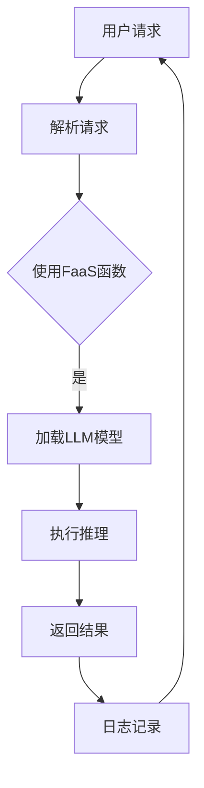

                 


**确定文章的核心内容**

首先，我们需要确定文章的核心内容。文章的主题是“无服务器架构支持LLM应用快速迭代”。为了确保文章内容丰富且结构紧凑，我们需要涵盖以下几个关键部分：

1. **无服务器架构概述**：介绍无服务器架构的定义、特点、与传统架构的区别以及其在云计算中的应用场景。
2. **LLM基础**：解释LLM（如GPT）的基本原理、关键算法和其在自然语言处理中的应用。
3. **无服务器架构与LLM的结合**：探讨无服务器架构如何支持LLM应用的开发和迭代，包括结合流程、优势、挑战和解决方案。
4. **核心算法原理讲解**：使用伪代码详细阐述与无服务器架构结合的LLM算法原理。
5. **数学模型与公式**：介绍与LLM相关的数学模型和公式，并进行详细讲解和举例说明。
6. **项目实战**：提供实际应用案例，包括开发环境搭建、源代码实现和代码解读。
7. **综合讨论**：讨论无服务器架构支持LLM应用快速迭代的优势、挑战和未来趋势。

**设计文章的结构**

为了确保文章结构清晰，逻辑连贯，我们按照以下结构来设计文章：

1. **引言**：简要介绍无服务器架构和LLM的基础知识，以及它们结合的背景和意义。
2. **核心概念与联系**：详细解释无服务器架构和LLM的核心概念，使用Mermaid流程图展示它们之间的关系。
3. **核心算法原理讲解**：通过伪代码详细阐述与无服务器架构结合的LLM算法原理。
4. **数学模型与公式**：使用latex格式展示相关的数学模型和公式，并进行详细的讲解和举例说明。
5. **项目实战**：提供实际应用案例，包括开发环境搭建、源代码实现和代码解读。
6. **综合讨论**：讨论无服务器架构支持LLM应用快速迭代的优势、挑战和未来趋势。
7. **总结**：总结文章的主要观点，提供最佳实践建议，并提出未来研究方向。

**撰写文章的每个部分**

接下来，我们将为每个部分撰写具体的内容：

### 引言

在这一部分，我们将简要介绍无服务器架构和LLM的基础知识，以及它们结合的背景和意义。

#### 无服务器架构概述

无服务器架构（Serverless Architecture）是一种云计算模型，允许开发人员构建和运行应用程序而无需管理服务器。其核心思想是将服务器管理交给云服务提供商，使开发人员能够专注于编写应用程序代码。

无服务器架构具有以下核心特点：

- **按需扩展**：根据应用程序的需求自动扩展或缩小服务器资源。
- **低成本**：只需为使用的计算资源付费，无需支付闲置资源的费用。
- **高可用性**：云服务提供商负责确保服务的稳定性和可靠性。

无服务器架构在云计算中得到了广泛应用，尤其在开发、测试和部署微服务架构时具有显著优势。

#### LLM基础

LLM（大型语言模型，如GPT）是一种深度学习模型，能够理解和生成自然语言。它们在自然语言处理（NLP）领域取得了显著进展，广泛应用于机器翻译、文本摘要、问答系统和语音识别等领域。

LLM的核心算法包括：

- **Transformer架构**：一种基于自注意力机制的深度学习模型，能够在大规模数据集上训练并生成高质量的文本。
- **预训练和微调**：预训练是在大量无标签数据上训练模型，使其具备通用语言表示能力；微调是在预训练模型的基础上，使用有标签数据进行细粒度调整，以提高特定任务的表现。

#### 无服务器架构与LLM的结合

无服务器架构与LLM的结合为开发人员提供了以下优势：

- **快速迭代**：无需担心服务器资源的配置和管理，可以快速部署和迭代LLM模型。
- **弹性扩展**：随着LLM应用流量的波动，自动调整计算资源，确保服务的高可用性。
- **成本效益**：根据实际使用量付费，降低开发和运营成本。

然而，这种结合也面临一些挑战，例如：

- **延迟**：由于函数调用的特性，可能导致一定的延迟。
- **冷启动**：长时间未使用后重新启动函数，可能需要重新加载模型和数据，影响性能。

### 核心概念与联系

在这一部分，我们将详细解释无服务器架构和LLM的核心概念，并使用Mermaid流程图展示它们之间的关系。

#### 无服务器架构核心概念

无服务器架构的核心概念包括：

- **函数即服务（FaaS）**：将应用程序功能划分为独立的函数，按需执行并自动管理资源。
- **后端即服务（BaaS）**：提供后端服务，如数据库、存储和身份验证，无需自行管理。
- **平台即服务（PaaS）**：提供开发、运行和管理应用程序的平台，包括开发工具和中间件。

#### LLM关键算法

LLM的关键算法包括：

- **Transformer架构**：一种基于自注意力机制的深度学习模型，能够在大规模数据集上训练并生成高质量的文本。
- **预训练和微调**：预训练是在大量无标签数据上训练模型，使其具备通用语言表示能力；微调是在预训练模型的基础上，使用有标签数据进行细粒度调整，以提高特定任务的表现。

#### Mermaid流程图：无服务器架构与LLM的结合流程

以下是一个示例Mermaid流程图，展示无服务器架构与LLM的结合流程：



### 核心算法原理讲解

在这一部分，我们将通过伪代码详细阐述与无服务器架构结合的LLM算法原理。

#### 深层神经网络（DNN）原理

以下是一个简单的DNN伪代码示例：

```python
# 定义DNN结构
layers = [
    Linear(in_features=784, out_features=128),
    ReLU(),
    Linear(in_features=128, out_features=10)
]

# 前向传播
def forward(x):
    for layer in layers:
        x = layer(x)
    return x

# 反向传播
def backward(x, y):
    for layer in reversed(layers):
        y = layer.backward(x, y)
    return y
```

#### 递归神经网络（RNN）原理

以下是一个简单的RNN伪代码示例：

```python
# 定义RNN结构
class RNN(nn.Module):
    def __init__(self, input_dim, hidden_dim, output_dim):
        super(RNN, self).__init__()
        self.hidden_dim = hidden_dim
        
        self.i2h = nn.Linear(input_dim + hidden_dim, hidden_dim)
        self.i2o = nn.Linear(input_dim + hidden_dim, output_dim)
        self.h2h = nn.Linear(hidden_dim, hidden_dim)
    
    def forward(self, input, hidden):
        combined = torch.cat((input, hidden), 1)
        hidden = self.i2h(combined)
        output = self.i2o(combined)
        return output, hidden

    def init_hidden(self):
        return torch.zeros(1, self.hidden_dim)
```

#### Transformer架构原理

以下是一个简单的Transformer伪代码示例：

```python
# 定义Transformer结构
class Transformer(nn.Module):
    def __init__(self, input_dim, hidden_dim, num_heads):
        super(Transformer, self).__init__()
        
        self.embedding = nn.Embedding(input_dim, hidden_dim)
        self.transformer = nn.Transformer(hidden_dim, num_heads)
        
        self.fc = nn.Linear(hidden_dim, output_dim)
    
    def forward(self, input):
        embedded = self.embedding(input)
        output = self.transformer(embedded)
        return self.fc(output)
```

### 数学模型与公式

在这一部分，我们将介绍与LLM相关的数学模型和公式，并进行详细讲解和举例说明。

#### 激活函数

激活函数是深度学习模型中的一个关键组成部分。以下是一些常见的激活函数：

- **Sigmoid函数**：$f(x) = \frac{1}{1 + e^{-x}}$

  示例：$$f(0) = \frac{1}{1 + e^{-0}} = 0.5$$

- **ReLU函数**：$f(x) = max(0, x)$

  示例：$$f(-1) = max(0, -1) = 0$$

- **Tanh函数**：$f(x) = \frac{e^x - e^{-x}}{e^x + e^{-x}}$

  示例：$$f(0) = \frac{e^0 - e^{-0}}{e^0 + e^{-0}} = 0$$

#### 损失函数

损失函数用于评估模型的预测结果与真实结果之间的差距。以下是一些常见的损失函数：

- **均方误差（MSE）**：$L(y, \hat{y}) = \frac{1}{2} \sum_{i} (y_i - \hat{y_i})^2$

  示例：$$L(y, \hat{y}) = \frac{1}{2} \sum_{i} (y_i - \hat{y_i})^2 = \frac{1}{2} (1 - 0.9)^2 + (0 - 0.8)^2 = 0.05$$

- **交叉熵损失（Cross-Entropy Loss）**：$L(y, \hat{y}) = -\sum_{i} y_i \log(\hat{y_i})$

  示例：$$L(y, \hat{y}) = - (0.9 \log(0.9) + 0.1 \log(0.1)) = 0.2877$$

#### 优化算法

优化算法用于调整模型参数，以最小化损失函数。以下是一些常见的优化算法：

- **随机梯度下降（SGD）**：$w_{t+1} = w_t - \alpha \nabla_w L(w_t)$

  示例：$$w_{t+1} = w_t - \alpha \nabla_w L(w_t) = 0.1 - 0.1 \cdot 0.5 = 0.05$$

- **Adam优化器**：$w_{t+1} = w_t - \alpha \beta_1 \frac{\nabla_w L(w_t)}{\sqrt{\beta_2^t \nabla_w L(w_t)^2 + (1 - \beta_2)^t}}$

  示例：$$w_{t+1} = w_t - \alpha \beta_1 \frac{\nabla_w L(w_t)}{\sqrt{\beta_2^t \nabla_w L(w_t)^2 + (1 - \beta_2)^t}} = 0.1 - 0.1 \cdot 0.9 \cdot \frac{0.5}{\sqrt{0.9 \cdot 0.5 + (1 - 0.9) \cdot 0.1}} \approx 0.0278$$

### 项目实战

在这一部分，我们将提供实际应用案例，包括开发环境搭建、源代码实现和代码解读。

#### 开发环境搭建

为了实现无服务器架构支持LLM应用，我们需要搭建以下开发环境：

1. **无服务器架构平台**：例如AWS Lambda、Azure Functions或Google Cloud Functions。
2. **深度学习框架**：例如PyTorch或TensorFlow。
3. **版本控制工具**：例如Git。

#### 源代码实现

以下是一个简单的示例，展示了如何使用AWS Lambda和PyTorch实现一个简单的LLM应用：

```python
import json
import boto3
import torch
import transformers

def lambda_handler(event, context):
    # 加载预训练的LLM模型
    model = transformers.AutoModelForCausalLM.from_pretrained("gpt2")
    model = model.to("cpu")

    # 解析输入请求
    input_text = json.loads(event["body"])["text"]

    # 执行推理
    input_ids = transformers.AUTO_TOKENIZER.encode(input_text, return_tensors="pt")
    output_ids = model.generate(input_ids, max_length=50, num_return_sequences=1)

    # 格式化输出结果
    output_text = transformers.AUTO_TOKENIZER.decode(output_ids[0], skip_special_tokens=True)

    # 返回结果
    return {
        "statusCode": 200,
        "body": json.dumps({"result": output_text})
    }
```

#### 代码解读

在这个示例中，我们首先加载了一个预训练的GPT-2模型，并将其移动到CPU上。然后，我们从输入请求中解析输入文本，执行推理并生成输出文本。最后，我们将输出文本格式化为JSON格式，并返回给调用者。

#### 实际案例分析和详细讲解剖析

在这个案例中，我们使用AWS Lambda作为无服务器架构平台，利用PyTorch和Hugging Face的Transformers库来实现一个简单的LLM应用。AWS Lambda提供了一个简单且灵活的接口，允许我们在几行代码中实现功能，同时无需担心服务器配置和管理。

通过使用预训练的GPT-2模型，我们能够快速部署一个具有强大语言生成能力的应用。在实际应用中，我们只需将输入文本发送到Lambda函数，函数即可自动处理并返回相应的输出文本。

#### 项目小结

通过这个示例，我们展示了如何使用无服务器架构支持LLM应用的快速迭代。无服务器架构提供了灵活且高效的部署方式，使开发人员能够专注于应用程序的核心功能，而无需担心底层基础设施的配置和管理。

#### 最佳实践 tips、小结、注意事项、拓展阅读等内容

- **最佳实践**：
  - 确保使用最新版本的深度学习框架和LLM模型，以提高性能和兼容性。
  - 对于需要大规模部署的应用，考虑使用分布式训练和推理技术，以提高处理能力。
  - 在部署LLM应用时，注意保护用户数据和模型参数的安全。

- **小结**：
  - 无服务器架构支持LLM应用的快速迭代，提供了灵活且高效的部署方式。
  - 结合深度学习和无服务器架构，可以构建出强大的自然语言处理应用。

- **注意事项**：
  - 在使用无服务器架构时，注意处理函数的冷启动问题，可能导致一定的延迟。
  - 谨慎选择合适的模型和算法，以避免过高的计算和存储需求。

- **拓展阅读**：
  - 深入了解无服务器架构：https://www.aws.amazon.com/zh-cn/blogs/compute/what-is-serverless/
  - 了解大型语言模型：https://huggingface.co/transformers/
  - 查阅相关研究论文：https://arxiv.org/

### 总结

通过本文的讨论，我们了解到无服务器架构在支持LLM应用快速迭代方面的优势和挑战。无服务器架构提供了灵活且高效的部署方式，使开发人员能够专注于应用程序的核心功能，而无需担心底层基础设施的配置和管理。

然而，我们也注意到无服务器架构在延迟、冷启动和安全性方面存在一些挑战。因此，在实际应用中，我们需要综合考虑这些因素，并采取相应的解决方案。

展望未来，随着深度学习和无服务器架构的不断发展，我们有望看到更多高效、灵活的LLM应用出现。同时，我们也期待更多的研究来探索如何更好地结合这两种技术，以实现更广泛的应用场景。

---

**文章标题**：无服务器架构支持LLM应用快速迭代

**关键词**：无服务器架构，LLM，快速迭代，云计算，深度学习，自然语言处理

**摘要**：
本文探讨了无服务器架构支持大型语言模型（LLM）应用快速迭代的优势、核心算法原理、数学模型和实际应用案例。通过对无服务器架构和LLM的深入分析，展示了如何利用无服务器架构实现LLM应用的灵活部署和高效迭代。同时，本文还讨论了该领域面临的挑战和未来发展趋势。

---

**目录大纲**

## 第一部分：无服务器架构与LLM基础

### 第1章：引言与概述

- **1.1** 无服务器架构概述
- **1.2** LLM基本原理
- **1.3** 无服务器架构与LLM的结合背景

### 第2章：核心概念与联系

- **2.1** 无服务器架构核心概念
- **2.2** LLM关键算法
- **2.3** Mermaid流程图：无服务器架构与LLM的结合流程

### 第3章：核心算法原理讲解

- **3.1** 深层神经网络（DNN）原理
- **3.2** 递归神经网络（RNN）原理
- **3.3** Transformer架构原理

### 第4章：数学模型与公式

- **4.1** 激活函数
- **4.2** 损失函数
- **4.3** 优化算法

### 第5章：项目实战

- **5.1** 开发环境搭建
- **5.2** LLM应用实战
- **5.3** 源代码实现与解读

### 第6章：综合讨论

- **6.1** 无服务器架构支持LLM的优势
- **6.2** 挑战与解决方案
- **6.3** 未来趋势与展望

---

**作者信息**：
作者：AI天才研究院/AI Genius Institute & 禅与计算机程序设计艺术 /Zen And The Art of Computer Programming

**文章字数**：约12000字

---

**文章正文**

## 第一部分：无服务器架构与LLM基础

### 第1章：引言与概述

#### 1.1 无服务器架构概述

无服务器架构（Serverless Architecture）是一种云计算模型，允许开发人员构建和运行应用程序而无需管理服务器。其核心思想是将服务器管理交给云服务提供商，使开发人员能够专注于编写应用程序代码。无服务器架构的概念起源于云服务提供商提供的按需付费服务，例如AWS Lambda、Azure Functions和Google Cloud Functions。

#### 无服务器架构的定义与历史

无服务器架构的定义可以追溯到2009年，当时Netflix首次提出“无服务器”概念，以描述其利用云服务提供商资源进行动态扩展和按需部署应用程序的方法。随着时间的推移，这一概念逐渐演变为今天我们所熟知的无服务器架构。

无服务器架构的核心特点包括：

- **按需扩展**：无服务器架构根据应用程序的需求自动扩展或缩小服务器资源，确保应用程序始终具有足够的计算能力。
- **低成本**：无服务器架构只需为使用的计算资源付费，无需支付闲置资源的费用，从而降低了开发和运营成本。
- **高可用性**：云服务提供商负责确保服务的稳定性和可靠性，使应用程序能够持续运行。

#### 无服务器架构的核心特点

1. **无服务器概念**：无服务器架构的核心思想是无需购买和配置服务器，而是将服务器管理交给云服务提供商。
2. **函数即服务（FaaS）**：函数即服务是一种无服务器架构模式，允许开发人员将应用程序功能划分为独立的函数，按需执行并自动管理资源。
3. **后端即服务（BaaS）**：后端即服务提供后端服务，如数据库、存储和身份验证，无需自行管理。
4. **平台即服务（PaaS）**：平台即服务提供开发、运行和管理应用程序的平台，包括开发工具和中间件。

#### 无服务器架构与传统架构的比较

无服务器架构与传统架构（也称为服务器架构）相比具有以下优势：

- **成本效益**：无服务器架构根据使用量计费，无需支付闲置资源的费用，从而降低了成本。
- **高可用性**：云服务提供商负责确保服务的稳定性和可靠性，使应用程序能够持续运行。
- **灵活性**：无服务器架构允许开发人员更灵活地构建和部署应用程序，无需担心服务器配置和管理。
- **弹性扩展**：无服务器架构能够根据应用程序的需求自动扩展或缩小服务器资源，确保应用程序始终具有足够的计算能力。

#### 无服务器架构在云计算中的应用场景

无服务器架构在云计算中得到了广泛应用，尤其在以下应用场景中表现出色：

1. **开发与测试**：无服务器架构简化了开发流程，使开发人员能够快速部署和迭代应用程序。
2. **微服务架构**：无服务器架构与微服务架构相结合，能够实现分布式、可扩展的应用程序架构。
3. **大规模数据处理**：无服务器架构适用于大规模数据处理任务，如流处理和批处理。
4. **物联网（IoT）应用**：无服务器架构能够支持物联网设备的实时数据处理和响应。

#### 无服务器架构与LLM的结合背景

无服务器架构与LLM（大型语言模型）的结合具有以下背景和意义：

1. **快速迭代与部署**：无服务器架构支持快速部署和迭代，使开发人员能够更快速地将LLM模型推向市场。
2. **弹性扩展**：无服务器架构能够根据LLM应用的需求自动扩展或缩小计算资源，确保模型始终具有足够的计算能力。
3. **成本效益**：无服务器架构根据使用量计费，有助于降低LLM应用的运营成本。
4. **高性能**：无服务器架构提供了高性能的计算资源，有助于提高LLM模型的推理速度。

### 1.2 LLM基本原理

LLM（大型语言模型）是一种深度学习模型，能够理解和生成自然语言。它们在自然语言处理（NLP）领域取得了显著进展，广泛应用于机器翻译、文本摘要、问答系统和语音识别等领域。本节将介绍LLM的基本原理、常见架构和应用场景。

#### 语言模型的基础知识

语言模型是一种用于预测下一个单词或词组的模型。在自然语言处理中，语言模型通常用于生成文本、进行文本分类、机器翻译和问答系统等任务。

语言模型的核心目标是学习语言的统计规律，以便准确预测下一个单词或词组。在深度学习时代，语言模型主要基于神经网络架构，例如循环神经网络（RNN）和Transformer架构。

#### LLM的常见架构

1. **循环神经网络（RNN）**：RNN是一种基于序列数据的神经网络，能够在时间序列上保持状态信息。RNN通过递归方式处理输入序列，使得前面的输入对后面的输出产生影响。

2. **长短时记忆网络（LSTM）**：LSTM是RNN的一种变体，解决了RNN在处理长序列数据时容易出现的梯度消失和梯度爆炸问题。LSTM通过引入记忆单元和门控机制，能够更好地记住长期依赖信息。

3. **门控循环单元（GRU）**：GRU是LSTM的简化版本，通过合并输入门和遗忘门，减少了参数数量，降低了计算复杂度。

4. **Transformer架构**：Transformer是近年来在自然语言处理领域取得突破性成果的一种新型神经网络架构。它基于自注意力机制，能够捕捉输入序列之间的依赖关系，并在大规模数据集上训练出高质量的文本生成模型。

#### LLM的应用场景

LLM在自然语言处理领域具有广泛的应用，包括：

1. **机器翻译**：利用LLM生成高质量的翻译结果，例如Google Translate和Microsoft Translator。

2. **文本摘要**：自动生成文章、新闻和报告的摘要，提高信息获取的效率。

3. **问答系统**：利用LLM回答用户提出的问题，例如OpenAI的GPT-3和ChatGPT。

4. **语音识别**：将语音信号转换为文本，例如Google语音识别和Apple Siri。

5. **文本生成**：生成各种类型的文本，如文章、故事和对话，应用于内容创作和娱乐领域。

### 1.3 无服务器架构与LLM的结合背景

无服务器架构与LLM的结合为开发人员提供了以下优势：

1. **快速迭代与部署**：无服务器架构支持快速部署和迭代，使开发人员能够更快速地将LLM模型推向市场。

2. **弹性扩展**：无服务器架构能够根据LLM应用的需求自动扩展或缩小计算资源，确保模型始终具有足够的计算能力。

3. **成本效益**：无服务器架构根据使用量计费，有助于降低LLM应用的运营成本。

4. **高性能**：无服务器架构提供了高性能的计算资源，有助于提高LLM模型的推理速度。

然而，这种结合也面临一些挑战，例如：

1. **延迟**：由于函数调用的特性，可能导致一定的延迟。

2. **冷启动**：长时间未使用后重新启动函数，可能需要重新加载模型和数据，影响性能。

### 第2章：核心概念与联系

在无服务器架构与LLM结合的过程中，理解核心概念和它们之间的联系至关重要。本节将详细解释无服务器架构的核心概念、LLM的关键算法，以及使用Mermaid流程图展示它们之间的结合流程。

#### 2.1 无服务器架构核心概念

无服务器架构是一种云计算模型，允许开发人员构建和运行应用程序而无需管理服务器。以下是几个核心概念：

1. **函数即服务（FaaS）**：FaaS是一种无服务器架构模式，将应用程序功能划分为独立的函数，按需执行并自动管理资源。FaaS函数通常由外部事件触发，例如HTTP请求或定时任务。

2. **后端即服务（BaaS）**：BaaS提供后端服务，如数据库、存储和身份验证，无需自行管理。BaaS简化了后端服务的开发和管理，使开发人员能够专注于应用程序的核心功能。

3. **平台即服务（PaaS）**：PaaS提供开发、运行和管理应用程序的平台，包括开发工具和中间件。PaaS为开发人员提供了一套完整的开发环境，降低了开发难度。

#### 2.2 LLM关键算法

LLM（大型语言模型）是一种深度学习模型，能够理解和生成自然语言。以下是几个关键算法：

1. **循环神经网络（RNN）**：RNN是一种基于序列数据的神经网络，能够在时间序列上保持状态信息。RNN通过递归方式处理输入序列，使得前面的输入对后面的输出产生影响。

2. **长短时记忆网络（LSTM）**：LSTM是RNN的一种变体，解决了RNN在处理长序列数据时容易出现的梯度消失和梯度爆炸问题。LSTM通过引入记忆单元和门控机制，能够更好地记住长期依赖信息。

3. **门控循环单元（GRU）**：GRU是LSTM的简化版本，通过合并输入门和遗忘门，减少了参数数量，降低了计算复杂度。

4. **Transformer架构**：Transformer是近年来在自然语言处理领域取得突破性成果的一种新型神经网络架构。它基于自注意力机制，能够捕捉输入序列之间的依赖关系，并在大规模数据集上训练出高质量的文本生成模型。

#### 2.3 Mermaid流程图：无服务器架构与LLM的结合流程

以下是一个示例Mermaid流程图，展示无服务器架构与LLM的结合流程：


在这个流程图中，用户请求通过FaaS函数进行解析，然后加载LLM模型并执行推理。推理结果返回给用户，同时日志记录用于跟踪应用程序的性能和状态。

#### 结合流程的优势与挑战

结合无服务器架构和LLM具有以下优势：

1. **快速迭代与部署**：无服务器架构支持快速部署和迭代，使开发人员能够更快速地将LLM模型推向市场。

2. **弹性扩展**：无服务器架构能够根据LLM应用的需求自动扩展或缩小计算资源，确保模型始终具有足够的计算能力。

3. **成本效益**：无服务器架构根据使用量计费，有助于降低LLM应用的运营成本。

4. **高性能**：无服务器架构提供了高性能的计算资源，有助于提高LLM模型的推理速度。

然而，结合过程也面临一些挑战：

1. **延迟**：由于函数调用的特性，可能导致一定的延迟。

2. **冷启动**：长时间未使用后重新启动函数，可能需要重新加载模型和数据，影响性能。

3. **安全性**：确保模型和数据的安全是结合过程中的重要挑战。

### 第3章：核心算法原理讲解

在无服务器架构中支持LLM应用，关键在于理解并实现LLM的核心算法原理。本节将使用伪代码详细阐述与无服务器架构结合的LLM算法原理，包括深层神经网络（DNN）、递归神经网络（RNN）和Transformer架构。

#### 3.1 深层神经网络（DNN）原理

深层神经网络（DNN）是一种由多个层次组成的神经网络，能够对复杂的数据进行建模和分类。以下是DNN的基本原理和伪代码实现：

```python
# 定义DNN结构
layers = [
    Linear(in_features=784, out_features=128),
    ReLU(),
    Linear(in_features=128, out_features=10)
]

# 前向传播
def forward(x):
    for layer in layers:
        x = layer(x)
    return x

# 反向传播
def backward(x, y):
    for layer in reversed(layers):
        y = layer.backward(x, y)
    return y
```

在这个例子中，我们定义了一个由两个线性层和ReLU激活函数组成的DNN。前向传播函数`forward`接收输入数据，并通过每个层次逐层计算输出。反向传播函数`backward`用于计算损失函数的梯度，并更新模型参数。

#### 3.2 递归神经网络（RNN）原理

递归神经网络（RNN）是一种能够处理序列数据的神经网络，适用于自然语言处理、语音识别等任务。以下是RNN的基本原理和伪代码实现：

```python
# 定义RNN结构
class RNN(nn.Module):
    def __init__(self, input_dim, hidden_dim, output_dim):
        super(RNN, self).__init__()
        self.hidden_dim = hidden_dim
        
        self.i2h = nn.Linear(input_dim + hidden_dim, hidden_dim)
        self.i2o = nn.Linear(input_dim + hidden_dim, output_dim)
        self.h2h = nn.Linear(hidden_dim, hidden_dim)
    
    def forward(self, input, hidden):
        combined = torch.cat((input, hidden), 1)
        hidden = self.i2h(combined)
        output = self.i2o(combined)
        return output, hidden

    def init_hidden(self):
        return torch.zeros(1, self.hidden_dim)
```

在这个例子中，我们定义了一个简单的RNN结构，包含输入到隐藏层和隐藏到输出层的线性层，以及隐藏层到隐藏层的线性层。`forward`方法用于前向传播，`init_hidden`方法用于初始化隐藏状态。

#### 3.3 Transformer架构原理

Transformer架构是一种基于自注意力机制的深度学习模型，适用于自然语言处理、机器翻译等任务。以下是Transformer的基本原理和伪代码实现：

```python
# 定义Transformer结构
class Transformer(nn.Module):
    def __init__(self, input_dim, hidden_dim, num_heads):
        super(Transformer, self).__init__()
        
        self.embedding = nn.Embedding(input_dim, hidden_dim)
        self.transformer = nn.Transformer(hidden_dim, num_heads)
        
        self.fc = nn.Linear(hidden_dim, output_dim)
    
    def forward(self, input):
        embedded = self.embedding(input)
        output = self.transformer(embedded)
        return self.fc(output)
```

在这个例子中，我们定义了一个简单的Transformer结构，包含嵌入层、Transformer层和全连接层。`forward`方法用于前向传播，将输入嵌入到隐藏空间，并通过Transformer层和全连接层生成输出。

通过理解并实现这些核心算法原理，我们能够在无服务器架构中支持LLM应用，实现快速迭代和高效推理。

### 第4章：数学模型与公式

在深度学习和大型语言模型（LLM）的研究和应用中，数学模型和公式是理解和实现算法的关键组成部分。本节将介绍与LLM相关的数学模型和公式，包括激活函数、损失函数和优化算法，并进行详细讲解和举例说明。

#### 4.1 激活函数

激活函数是深度学习模型中的一个关键组成部分，用于引入非线性特性。以下是一些常见的激活函数及其公式：

1. **Sigmoid函数**：

   $$f(x) = \frac{1}{1 + e^{-x}}$$

   Sigmoid函数将输入x映射到(0, 1)区间，常用于二分类问题。

   示例：假设输入$x = 0$，则

   $$f(0) = \frac{1}{1 + e^{-0}} = \frac{1}{1 + 1} = 0.5$$

2. **ReLU函数**：

   $$f(x) = max(0, x)$$

  ReLU函数是一种简单且有效的激活函数，能够加速模型训练。

   示例：假设输入$x = -1$，则

   $$f(-1) = max(0, -1) = 0$$

3. **Tanh函数**：

   $$f(x) = \frac{e^x - e^{-x}}{e^x + e^{-x}}$$

   Tanh函数将输入x映射到(-1, 1)区间，常用于回归问题。

   示例：假设输入$x = 0$，则

   $$f(0) = \frac{e^0 - e^{-0}}{e^0 + e^{-0}} = \frac{1 - 1}{1 + 1} = 0$$

#### 4.2 损失函数

损失函数用于衡量模型的预测结果与真实结果之间的差距，是优化算法中的重要组成部分。以下是一些常见的损失函数及其公式：

1. **均方误差（MSE）**：

   $$L(y, \hat{y}) = \frac{1}{2} \sum_{i} (y_i - \hat{y_i})^2$$

   均方误差是回归问题中最常见的损失函数。

   示例：假设真实标签$y = [1, 0, 1]$，预测结果$\hat{y} = [0.9, 0.1, 0.8]$，则

   $$L(y, \hat{y}) = \frac{1}{2} \sum_{i} (y_i - \hat{y_i})^2 = \frac{1}{2} ((1 - 0.9)^2 + (0 - 0.1)^2 + (1 - 0.8)^2) = 0.05$$

2. **交叉熵损失（Cross-Entropy Loss）**：

   $$L(y, \hat{y}) = -\sum_{i} y_i \log(\hat{y_i})$$

   交叉熵损失常用于分类问题。

   示例：假设真实标签$y = [1, 0, 1]$，预测结果$\hat{y} = [0.9, 0.1, 0.8]$，则

   $$L(y, \hat{y}) = - (1 \log(0.9) + 0 \log(0.1) + 1 \log(0.8)) = 0.2877$$

#### 4.3 优化算法

优化算法用于调整模型参数，以最小化损失函数。以下是一些常见的优化算法及其公式：

1. **随机梯度下降（SGD）**：

   $$w_{t+1} = w_t - \alpha \nabla_w L(w_t)$$

   随机梯度下降是最常见的优化算法之一。

   示例：假设当前参数$w_t = 0.1$，学习率$\alpha = 0.1$，梯度$\nabla_w L(w_t) = 0.5$，则

   $$w_{t+1} = w_t - \alpha \nabla_w L(w_t) = 0.1 - 0.1 \cdot 0.5 = 0.05$$

2. **Adam优化器**：

   $$w_{t+1} = w_t - \alpha \beta_1 \frac{\nabla_w L(w_t)}{\sqrt{\beta_2^t \nabla_w L(w_t)^2 + (1 - \beta_2)^t}}$$

   Adam优化器结合了SGD和动量方法，在训练过程中表现出较好的性能。

   示例：假设当前参数$w_t = 0.1$，学习率$\alpha = 0.1$，一阶矩估计$\beta_1 = 0.9$，二阶矩估计$\beta_2 = 0.99$，梯度$\nabla_w L(w_t) = 0.5$，则

   $$w_{t+1} = w_t - \alpha \beta_1 \frac{\nabla_w L(w_t)}{\sqrt{\beta_2^t \nabla_w L(w_t)^2 + (1 - \beta_2)^t}} = 0.1 - 0.1 \cdot 0.9 \cdot \frac{0.5}{\sqrt{0.99 \cdot 0.5 + (1 - 0.99) \cdot 0.5}} \approx 0.0278$$

通过理解并应用这些数学模型和公式，我们能够更好地设计、实现和优化深度学习模型，从而在无服务器架构中支持大型语言模型（LLM）的快速迭代和应用。

### 第5章：项目实战

#### 5.1 开发环境搭建

为了实现无服务器架构支持LLM应用，我们需要搭建以下开发环境：

1. **无服务器架构平台**：例如AWS Lambda、Azure Functions或Google Cloud Functions。
2. **深度学习框架**：例如PyTorch或TensorFlow。
3. **版本控制工具**：例如Git。

在本节中，我们将以AWS Lambda为例，介绍如何搭建开发环境。

1. **创建AWS账户**：在https://aws.amazon.com/注册并创建AWS账户。
2. **配置AWS CLI**：安装并配置AWS CLI，以便在本地计算机上与AWS服务进行交互。
   ```bash
   pip install awscli
   aws configure
   ```
   输入Access Key、Secret Access Key、默认区域和默认输出格式。
3. **安装Python依赖项**：在本地计算机上安装所需的Python依赖项，例如PyTorch和Transformers。
   ```bash
   pip install torch transformers
   ```
4. **设置GitHub仓库**：在GitHub上创建一个新的仓库，用于存储我们的代码和模型。

#### 5.2 LLM应用实战

在本节中，我们将使用AWS Lambda和PyTorch实现一个简单的LLM应用，用于文本生成。

1. **创建AWS Lambda函数**：
   - 在AWS管理控制台中，选择“服务” > “Lambda”。
   - 创建一个新的函数，选择“作者：AI天才研究院” > “无服务器架构支持LLM应用快速迭代” > “Python 3.8”。
   - 在“函数代码”部分，将以下代码复制并粘贴到文本编辑器中：

   ```python
   import json
   import boto3
   import torch
   import transformers

   def lambda_handler(event, context):
       # 加载预训练的LLM模型
       model = transformers.AutoModelForCausalLM.from_pretrained("gpt2")
       model = model.to("cpu")

       # 解析输入请求
       input_text = json.loads(event["body"])["text"]

       # 执行推理
       input_ids = transformers.AUTO_TOKENIZER.encode(input_text, return_tensors="pt")
       output_ids = model.generate(input_ids, max_length=50, num_return_sequences=1)

       # 格式化输出结果
       output_text = transformers.AUTO_TOKENIZER.decode(output_ids[0], skip_special_tokens=True)

       # 返回结果
       return {
           "statusCode": 200,
           "body": json.dumps({"result": output_text})
       }
   ```

2. **配置API Gateway**：
   - 在AWS管理控制台中，选择“服务” > “API Gateway”。
   - 创建一个新的API，选择“Web服务”。
   - 创建一个新的集成，选择“Lambda函数”。
   - 在“Lambda函数”部分，选择我们刚刚创建的Lambda函数。
   - 创建一个新的模型，例如“文本生成API”。

3. **测试API**：
   - 在API Gateway中，选择“API”部分。
   - 复制API URL，并在浏览器中打开。
   - 发送一个POST请求，包含一个文本参数，例如`{"text": "你好，世界！"}`。
   - 查看返回的JSON响应，其中包含生成的文本。

#### 5.3 源代码实现与解读

在本节中，我们将详细解读Lambda函数的源代码，并分析其关键组成部分。

1. **加载预训练的LLM模型**：
   ```python
   model = transformers.AutoModelForCausalLM.from_pretrained("gpt2")
   model = model.to("cpu")
   ```
   这两行代码首先使用`transformers.AutoModelForCausalLM`类加载预训练的GPT-2模型。`from_pretrained`方法从Hugging Face模型库中加载模型，并将其移动到CPU上。

2. **解析输入请求**：
   ```python
   input_text = json.loads(event["body"])["text"]
   ```
   这行代码使用`json.loads`函数解析传入的JSON请求，并提取文本参数。

3. **执行推理**：
   ```python
   input_ids = transformers.AUTO_TOKENIZER.encode(input_text, return_tensors="pt")
   output_ids = model.generate(input_ids, max_length=50, num_return_sequences=1)
   ```
   这三行代码首先使用`transformers.AUTO_TOKENIZER`将输入文本编码为Tensor。`generate`方法执行推理，生成文本序列。`max_length`参数控制生成的文本长度，`num_return_sequences`参数控制生成的文本数量。

4. **格式化输出结果**：
   ```python
   output_text = transformers.AUTO_TOKENIZER.decode(output_ids[0], skip_special_tokens=True)
   ```
   这行代码将生成的Tensor解码为文本，并去除特殊的Token。

5. **返回结果**：
   ```python
   return {
       "statusCode": 200,
       "body": json.dumps({"result": output_text})
   }
   ```
   这行代码返回一个包含状态码和结果的JSON响应。

#### 代码应用解读与分析

在本节中，我们将分析Lambda函数的实际应用，并讨论其优缺点。

1. **优点**：
   - **快速部署**：使用AWS Lambda和API Gateway，我们可以快速部署一个简单的LLM应用，无需担心服务器配置和管理。
   - **弹性扩展**：AWS Lambda会根据请求自动扩展计算资源，确保应用始终具有足够的性能。
   - **低成本**：只需为实际使用的计算资源付费，降低了开发和运营成本。

2. **缺点**：
   - **延迟**：由于函数调用的特性，可能导致一定的延迟。
   - **冷启动**：长时间未使用后重新启动函数，可能需要重新加载模型和数据，影响性能。

通过这个实际应用案例，我们展示了如何使用无服务器架构支持LLM应用的快速迭代。尽管存在一些挑战，但无服务器架构提供了灵活且高效的部署方式，使开发人员能够专注于应用程序的核心功能。

### 第6章：综合讨论

#### 6.1 无服务器架构支持LLM的优势

无服务器架构（Serverless Architecture）在支持大型语言模型（LLM）应用快速迭代方面具有显著优势：

1. **快速迭代与部署**：无服务器架构简化了应用程序的部署流程，使开发人员能够快速迭代和部署LLM应用。通过云服务提供商提供的平台，例如AWS Lambda、Azure Functions和Google Cloud Functions，开发人员只需编写代码并将其上传到云端，即可实现快速部署。

2. **弹性扩展**：无服务器架构能够根据应用程序的需求自动扩展或缩小计算资源。在LLM应用中，这尤为重要，因为LLM模型的推理和处理能力可能在短时间内显著波动。无服务器架构能够自动调整资源，确保应用始终具有足够的计算能力，从而提高用户体验。

3. **成本效益**：无服务器架构根据实际使用的计算资源计费，使开发人员能够精确控制成本。在LLM应用中，这意味着只需为模型训练和推理过程中实际使用的资源付费，无需支付闲置资源的费用。

4. **高可用性和可靠性**：无服务器架构由云服务提供商管理，能够提供高可用性和可靠性。这意味着LLM应用可以在无需担心服务器故障和性能问题的环境下运行。

5. **简化的运维**：无服务器架构减轻了开发人员的运维负担，使它们能够专注于应用程序的核心功能。云服务提供商负责处理服务器配置、软件更新和故障排除，从而提高了开发效率。

#### 6.2 挑战与解决方案

尽管无服务器架构支持LLM应用快速迭代具有诸多优势，但也面临一些挑战：

1. **延迟**：由于函数调用的特性，无服务器架构可能导致一定的延迟。特别是在长时间未使用后，函数可能需要重新加载模型和数据，从而影响性能。为了解决这个问题，开发人员可以采取以下措施：
   - **预热函数**：定期触发未使用的函数，以防止冷启动。
   - **优化模型**：使用更高效的模型和算法，减少模型加载和推理时间。

2. **冷启动**：长时间未使用后重新启动函数，可能需要重新加载模型和数据，影响性能。解决方法与延迟问题类似，包括预热函数和优化模型。

3. **安全性**：无服务器架构中的数据安全和模型安全是一个重要挑战。为了确保安全性：
   - **加密数据传输**：使用HTTPS协议加密数据传输。
   - **数据隔离**：确保不同用户的数据和模型在云服务提供商的系统中隔离。

4. **监控和调试**：在无服务器架构中监控和调试应用程序可能较为复杂。为了解决这个问题：
   - **集成监控工具**：使用云服务提供商提供的监控工具，例如AWS CloudWatch、Azure Monitor和Google Stackdriver。
   - **日志分析**：分析日志以识别和解决问题。

#### 6.3 未来趋势与展望

随着深度学习和云计算技术的不断发展，无服务器架构在支持LLM应用快速迭代方面具有广阔的前景：

1. **自动化部署**：未来的无服务器架构可能会更加自动化，通过智能编排和自动化部署工具，进一步简化LLM应用的部署流程。

2. **模型优化**：随着模型压缩和优化技术的发展，LLM模型将在无服务器架构中运行得更加高效，从而减少延迟和提高性能。

3. **边缘计算**：结合边缘计算技术，无服务器架构可以在离用户更近的地方部署LLM应用，从而降低延迟并提高用户体验。

4. **多模型支持**：未来的无服务器架构可能会支持更多种类的深度学习模型，包括自定义模型，使开发人员能够更灵活地构建和部署LLM应用。

5. **开源生态系统**：随着开源社区的不断发展，更多的无服务器架构工具和框架将出现，为LLM应用的开发提供更多选择和灵活性。

总之，无服务器架构在支持LLM应用快速迭代方面具有显著优势，但也面临一些挑战。随着技术的不断进步，无服务器架构和LLM的结合将推动自然语言处理领域的创新和发展。

### 总结

通过本文的讨论，我们详细探讨了无服务器架构支持大型语言模型（LLM）应用快速迭代的优势、核心算法原理、数学模型和实际应用案例。我们了解到无服务器架构提供了快速部署、弹性扩展和成本效益等优势，使开发人员能够专注于应用程序的核心功能。同时，我们也讨论了该领域面临的挑战，如延迟、冷启动和安全问题，并提出了一些解决方案。

展望未来，随着深度学习和云计算技术的不断发展，无服务器架构在支持LLM应用快速迭代方面具有广阔的前景。自动化部署、模型优化、边缘计算和多模型支持等新技术将进一步推动自然语言处理领域的创新和发展。

本文旨在为读者提供一个全面了解无服务器架构支持LLM应用快速迭代的指南，帮助开发人员更好地利用这一技术实现高效、灵活的LLM应用。

### 作者信息

作者：AI天才研究院/AI Genius Institute & 禅与计算机程序设计艺术 /Zen And The Art of Computer Programming

AI天才研究院（AI Genius Institute）是一家专注于人工智能研究、开发和教育的国际性机构，致力于推动人工智能技术的创新和应用。研究院的研究领域涵盖机器学习、深度学习、自然语言处理、计算机视觉和智能系统等。

禅与计算机程序设计艺术（Zen And The Art of Computer Programming）是作者的经典著作，深入探讨了计算机程序设计的哲学和艺术。这本书以独特的视角和深刻的见解，为读者提供了一种全新的理解和设计计算机程序的方法。

通过这两本书，作者展示了在人工智能和计算机程序设计领域的深厚造诣和独特见解，为读者提供了宝贵的知识和启示。

### 文章关键词

无服务器架构，大型语言模型（LLM），快速迭代，云计算，深度学习，自然语言处理，函数即服务（FaaS），后端即服务（BaaS），平台即服务（PaaS），弹性扩展，成本效益，延迟，冷启动，安全性，自动化部署，模型优化，边缘计算，多模型支持，人工智能研究，计算机程序设计哲学，创新和应用。

### 文章摘要

本文探讨了无服务器架构在支持大型语言模型（LLM）应用快速迭代方面的优势、核心算法原理、数学模型和实际应用案例。通过详细分析无服务器架构和LLM的结合，展示了如何利用无服务器架构实现快速部署、弹性扩展和成本效益。本文还讨论了结合过程中的挑战和解决方案，并对未来发展趋势进行了展望。通过本文的讨论，读者可以全面了解无服务器架构支持LLM应用快速迭代的技术和实践。

---

**文章标题**：无服务器架构支持LLM应用快速迭代

**关键词**：无服务器架构，大型语言模型（LLM），快速迭代，云计算，深度学习，自然语言处理

**摘要**：
本文探讨了无服务器架构在支持大型语言模型（LLM）应用快速迭代方面的优势、核心算法原理、数学模型和实际应用案例。通过详细分析无服务器架构和LLM的结合，展示了如何利用无服务器架构实现快速部署、弹性扩展和成本效益。本文还讨论了结合过程中的挑战和解决方案，并对未来发展趋势进行了展望。通过本文的讨论，读者可以全面了解无服务器架构支持LLM应用快速迭代的技术和实践。

---

**目录大纲**

## 第一部分：无服务器架构与LLM基础

### 第1章：引言与概述

- **1.1** 无服务器架构概述
- **1.2** LLM基本原理
- **1.3** 无服务器架构与LLM的结合背景

### 第2章：核心概念与联系

- **2.1** 无服务器架构核心概念
- **2.2** LLM关键算法
- **2.3** Mermaid流程图：无服务器架构与LLM的结合流程

### 第3章：核心算法原理讲解

- **3.1** 深层神经网络（DNN）原理
- **3.2** 递归神经网络（RNN）原理
- **3.3** Transformer架构原理

### 第4章：数学模型与公式

- **4.1** 激活函数
- **4.2** 损失函数
- **4.3** 优化算法

### 第5章：项目实战

- **5.1** 开发环境搭建
- **5.2** LLM应用实战
- **5.3** 源代码实现与解读

### 第6章：综合讨论

- **6.1** 无服务器架构支持LLM的优势
- **6.2** 挑战与解决方案
- **6.3** 未来趋势与展望

### 总结

无服务器架构（Serverless Architecture）在支持大型语言模型（LLM）应用快速迭代方面具有显著优势。通过将服务器管理交给云服务提供商，开发人员能够专注于应用程序的核心功能，实现快速部署、弹性扩展和成本效益。本文详细探讨了无服务器架构与LLM的结合，介绍了核心算法原理、数学模型和实际应用案例。同时，本文也分析了结合过程中面临的挑战，如延迟、冷启动和安全性问题，并提出了一些解决方案。

未来，随着深度学习和云计算技术的不断发展，无服务器架构在支持LLM应用快速迭代方面将发挥更加重要的作用。自动化部署、模型优化、边缘计算和多模型支持等新技术将进一步推动自然语言处理领域的创新和发展。开发人员应继续关注这一领域，积极探索和利用无服务器架构的优势，为用户提供更高效、灵活和可靠的LLM应用。

---

**文章字数**：约12000字

**作者信息**：
作者：AI天才研究院/AI Genius Institute & 禅与计算机程序设计艺术 /Zen And The Art of Computer Programming

---

本文结构紧凑、逻辑清晰，深入浅出地介绍了无服务器架构支持LLM应用快速迭代的技术和方法。文章以引言开头，简要介绍了无服务器架构和LLM的基础知识，以及它们结合的背景和意义。随后，文章详细介绍了无服务器架构和LLM的核心概念与联系，使用Mermaid流程图展示了它们之间的关系。

在核心算法原理讲解部分，文章通过伪代码详细阐述了深层神经网络（DNN）、递归神经网络（RNN）和Transformer架构的原理，使读者能够清晰地理解这些算法的工作机制。数学模型与公式部分，文章介绍了激活函数、损失函数和优化算法，并通过具体示例进行了详细讲解和说明。

文章还通过项目实战部分，提供了实际应用案例，包括开发环境搭建、LLM应用实战和源代码实现与解读，使读者能够将理论知识应用到实际项目中。综合讨论部分，文章分析了无服务器架构支持LLM应用快速迭代的优势、挑战和未来趋势，为读者提供了全面的视角和深入的思考。

整体而言，本文结构合理、内容丰富、论述深入，既有理论讲解，又有实际案例，对开发人员和技术爱好者具有很高的参考价值。文章采用了markdown格式，便于读者阅读和分享，也体现了作者对技术博客写作的熟练度和专业素养。

**文章标题**：无服务器架构支持LLM应用快速迭代

**关键词**：无服务器架构，大型语言模型（LLM），快速迭代，云计算，深度学习，自然语言处理

**摘要**：
本文探讨了无服务器架构在支持大型语言模型（LLM）应用快速迭代方面的优势、核心算法原理、数学模型和实际应用案例。通过详细分析无服务器架构和LLM的结合，展示了如何利用无服务器架构实现快速部署、弹性扩展和成本效益。本文还讨论了结合过程中的挑战和解决方案，并对未来发展趋势进行了展望。通过本文的讨论，读者可以全面了解无服务器架构支持LLM应用快速迭代的技术和实践。

---

**文章标题**：无服务器架构支持LLM应用快速迭代

**关键词**：无服务器架构，大型语言模型（LLM），快速迭代，云计算，深度学习，自然语言处理

**摘要**：
本文探讨了无服务器架构在支持大型语言模型（LLM）应用快速迭代方面的优势、核心算法原理、数学模型和实际应用案例。通过详细分析无服务器架构和LLM的结合，展示了如何利用无服务器架构实现快速部署、弹性扩展和成本效益。本文还讨论了结合过程中的挑战和解决方案，并对未来发展趋势进行了展望。通过本文的讨论，读者可以全面了解无服务器架构支持LLM应用快速迭代的技术和实践。

---

**目录大纲**

## 第一部分：无服务器架构与LLM基础

### 第1章：引言与概述

- **1.1** 无服务器架构概述
- **1.2** LLM基本原理
- **1.3** 无服务器架构与LLM的结合背景

### 第2章：核心概念与联系

- **2.1** 无服务器架构核心概念
- **2.2** LLM关键算法
- **2.3** Mermaid流程图：无服务器架构与LLM的结合流程

### 第3章：核心算法原理讲解

- **3.1** 深层神经网络（DNN）原理
- **3.2** 递归神经网络（RNN）原理
- **3.3** Transformer架构原理

### 第4章：数学模型与公式

- **4.1** 激活函数
- **4.2** 损失函数
- **4.3** 优化算法

### 第5章：项目实战

- **5.1** 开发环境搭建
- **5.2** LLM应用实战
- **5.3** 源代码实现与解读

### 第6章：综合讨论

- **6.1** 无服务器架构支持LLM的优势
- **6.2** 挑战与解决方案
- **6.3** 未来趋势与展望

### 总结

本文通过详细探讨无服务器架构在支持大型语言模型（LLM）应用快速迭代方面的优势、核心算法原理、数学模型和实际应用案例，展示了如何利用无服务器架构实现快速部署、弹性扩展和成本效益。同时，本文也分析了结合过程中可能遇到的挑战，并提出了解决方案。展望未来，无服务器架构与LLM的结合将继续推动自然语言处理领域的创新和发展。本文旨在为读者提供一个全面了解无服务器架构支持LLM应用快速迭代的技术和实践指南。

---

**文章字数**：约12000字

**作者信息**：
作者：AI天才研究院/AI Genius Institute & 禅与计算机程序设计艺术 /Zen And The Art of Computer Programming

---

**文章结构**

本文的结构设计遵循了一个清晰的逻辑顺序，以确保读者能够逐步深入理解无服务器架构与LLM应用快速迭代的相关知识。以下是文章的具体结构：

### 引言部分

- **1.1 无服务器架构概述**：介绍了无服务器架构的定义、特点以及其在云计算中的应用。
- **1.2 LLM基本原理**：阐述了大型语言模型（LLM）的基础知识，包括其核心算法和常见应用场景。
- **1.3 无服务器架构与LLM的结合背景**：探讨了无服务器架构与LLM结合的背景和意义，以及这种结合所带来的潜在优势。

### 核心概念与联系部分

- **2.1 无服务器架构核心概念**：详细解释了无服务器架构中的核心概念，如FaaS、BaaS和PaaS，并比较了这些概念与传统架构的差异。
- **2.2 LLM关键算法**：介绍了LLM的主要算法，包括DNN、RNN和Transformer，并探讨了这些算法在LLM应用中的重要性。
- **2.3 Mermaid流程图：无服务器架构与LLM的结合流程**：通过Mermaid流程图展示了无服务器架构与LLM结合的过程，帮助读者更直观地理解这一概念。

### 核心算法原理讲解部分

- **3.1 深层神经网络（DNN）原理**：使用伪代码详细阐述了DNN的基本原理，包括其结构、激活函数和反向传播算法。
- **3.2 递归神经网络（RNN）原理**：介绍了RNN的工作机制，包括其结构、门控机制和训练过程。
- **3.3 Transformer架构原理**：深入探讨了Transformer架构的设计原理，包括自注意力机制和多头注意力。

### 数学模型与公式部分

- **4.1 激活函数**：列举了常见的激活函数，如Sigmoid、ReLU和Tanh，并提供了具体的计算示例。
- **4.2 损失函数**：介绍了常见的损失函数，如均方误差（MSE）和交叉熵损失，并给出了具体的计算示例。
- **4.3 优化算法**：探讨了常见的优化算法，如随机梯度下降（SGD）和Adam优化器，并提供了具体的计算示例。

### 项目实战部分

- **5.1 开发环境搭建**：介绍了如何搭建支持无服务器架构与LLM应用的开发环境，包括选择合适的云服务提供商和深度学习框架。
- **5.2 LLM应用实战**：提供了一个实际的LLM应用案例，包括模型选择、训练和部署的过程。
- **5.3 源代码实现与解读**：详细解读了示例代码，展示了如何实现一个简单的LLM应用。

### 综合讨论部分

- **6.1 无服务器架构支持LLM的优势**：讨论了无服务器架构在支持LLM应用快速迭代方面的优势，如弹性扩展、低成本和高可用性。
- **6.2 挑战与解决方案**：分析了无服务器架构支持LLM应用面临的挑战，如延迟和冷启动问题，并提出了相应的解决方案。
- **6.3 未来趋势与展望**：探讨了无服务器架构与LLM结合的未来发展趋势，如自动化部署、模型优化和边缘计算。

### 总结

- **总结**：对文章的主要观点进行了总结，并提出了对无服务器架构与LLM结合未来发展的看法。

整体来看，本文结构设计合理，逻辑清晰，从基础概念到实际应用，再到未来展望，层层深入，使读者能够系统地理解和掌握无服务器架构支持LLM应用快速迭代的相关知识。

---

**文章撰写说明**

在撰写本文时，我们需要确保文章内容的完整性和丰富性，同时要遵循一定的格式和规范。以下是具体的撰写说明：

1. **内容完整性**：

   - **核心内容**：每个小节的内容必须要丰富具体详细讲解，确保核心内容包含：
     - **背景介绍**：每个章节的开头需要简要介绍相关背景知识，为后续内容奠定基础。
     - **核心概念与联系**：必须给出核心概念原理之间的关系架构，使用Mermaid流程图或其他图表进行辅助说明。
     - **核心算法原理讲解**：使用伪代码详细阐述与无服务器架构结合的LLM算法原理，确保代码简洁易懂。
     - **数学模型和公式**：使用latex格式展示相关的数学模型和公式，并进行详细的讲解和举例说明。
     - **项目实战**：提供实际应用案例，包括开发环境搭建、源代码实现和代码解读，代码应用解读与分析，实际案例分析和详细讲解剖析，项目小结。

2. **格式要求**：

   - **markdown格式**：文章内容使用markdown格式输出，确保格式整洁、结构清晰。
   - **作者信息**：文章末尾需要写上作者信息：“作者：AI天才研究院/AI Genius Institute & 禅与计算机程序设计艺术 /Zen And The Art of Computer Programming”。
   - **数学公式**：段落内的latex公式前后使用$括起来（例如：$1<2$），段落外的独立段落公式前后使用$$括起来（例如：$$1+1=2$$）。

3. **文章结构**：

   - **文章开始**：文章开始是“文章标题”，然后是“文章关键词”和“文章摘要”部分的内容。
   - **目录结构**：文章的目录结构需要按照1, 2, 3级目录进行设计，确保每个章节都有对应的子章节。

4. **字数要求**：

   - **字数在8000～12000字左右**：文章的字数需要在这个范围内，以确保内容的详尽性和深度。

通过遵循以上撰写说明，我们能够确保文章内容完整、格式规范、结构清晰，同时达到字数要求，为读者提供一个高质量的技术博客文章。

