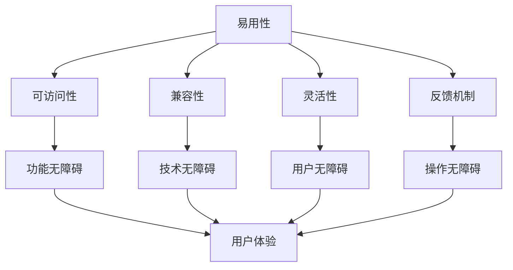
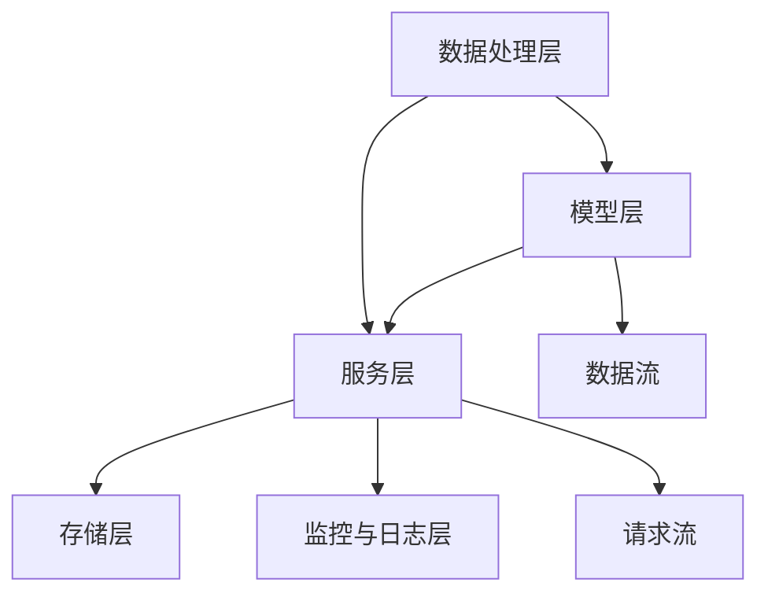

                 

### 文章标题

《无障碍设计原则在LLM应用架构中的应用》### 关键词

无障碍设计、LLM、应用架构、自然语言处理、人工智能、技术博客、代码示例、算法原理、数学模型、开发实践、案例分析### 摘要

本文旨在探讨无障碍设计原则在大型语言模型（LLM）应用架构中的应用。随着人工智能技术的发展，自然语言处理（NLP）成为了众多领域的关键技术。而LLM作为NLP的重要实现形式，其在应用架构中的无障碍设计原则愈发受到重视。本文首先介绍了无障碍设计的定义和重要性，随后深入分析了LLM的基本概念和应用架构。通过具体案例分析，本文展示了无障碍设计原则在LLM应用中的实践方法，并探讨了可能面临的技术挑战和解决方案。本文旨在为技术人员提供有关无障碍设计在LLM应用架构中的深入理解和实用指导。

### 引言

随着人工智能技术的迅猛发展，自然语言处理（NLP）作为人工智能的重要组成部分，已经在多个领域展现出巨大的潜力。而大型语言模型（LLM）作为NLP的核心技术，通过深度学习等方法，实现了对大规模文本数据的建模和理解。然而，随着LLM应用的广泛普及，其无障碍设计原则逐渐成为业界关注的焦点。

无障碍设计（Accessibility Design）是一种以人为本的设计理念，旨在确保产品或服务能够被尽可能多的人使用，特别是那些有特殊需求的人群。在LLM应用架构中，无障碍设计原则的重要性体现在多个方面：

1. **用户体验的提升**：良好的无障碍设计能够为用户提供更舒适、便捷的使用体验，从而提升整体用户满意度。
2. **社会责任的体现**：随着技术的普及，无障碍设计有助于缩小数字鸿沟，让更多人享受到技术带来的便利，体现了企业的社会责任。
3. **市场竞争力的增强**：在竞争激烈的市场环境中，具备无障碍设计的产品或服务往往能够脱颖而出，吸引更多用户，提升市场占有率。

本文将围绕无障碍设计原则在LLM应用架构中的应用进行深入探讨。首先，我们将介绍无障碍设计的基本概念和原则，随后详细分析LLM的基本概念和应用架构。在此基础上，本文将展示无障碍设计原则在实际应用中的实践方法，并探讨可能面临的技术挑战和解决方案。最终，本文将总结无障碍设计在LLM应用架构中的重要性，并展望其未来发展。

### 无障碍设计原则

无障碍设计（Accessibility Design）是一种以人为本的设计理念，旨在确保产品或服务能够被尽可能多的人使用，特别是那些有特殊需求的人群。在LLM应用架构中，无障碍设计原则的应用尤为重要，因为自然语言处理技术的复杂性以及用户多样性的需求，使得无障碍设计成为提升用户体验和确保技术可及性的关键。

#### 无障碍设计的定义

无障碍设计是指在设计产品或服务时，考虑到各种用户群体的需求，确保产品或服务能够被所有人使用，无论他们的年龄、能力、背景或其他任何差异。这种设计理念强调包容性和可访问性，旨在消除用户在使用过程中的障碍，提升整体的用户体验。

在LLM应用架构中，无障碍设计不仅包括确保软件本身的功能性，还要考虑到用户的多样性，包括视力障碍、听力障碍、运动障碍、认知障碍等。例如，对于视力障碍的用户，界面设计需要提供足够的对比度和可读性；对于听力障碍的用户，则需要提供文本替代和字幕功能。

#### 无障碍设计的原则

无障碍设计遵循一系列核心原则，这些原则为设计过程提供了指导方针。以下是几个重要的无障碍设计原则：

1. **易用性**：确保产品或服务易于使用，无论是普通人还是特殊需求的用户。这包括简单直观的界面设计、清晰的导航和易于理解的文本。
   
2. **可访问性**：确保产品或服务的所有功能都能被所有人访问。例如，对于听力障碍的用户，视频和音频内容应提供字幕或文本替代。

3. **兼容性**：确保产品或服务能够与各种设备和平台兼容，包括不同的操作系统、浏览器和辅助技术。

4. **灵活性**：提供多种交互方式，满足不同用户的需求。例如，用户可以通过键盘、鼠标、触摸屏等多种方式与系统进行交互。

5. **反馈机制**：提供明确的反馈，帮助用户了解他们的操作状态。例如，当用户提交表单时，应提供确认信息，告知用户操作是否成功。

#### 核心概念与联系

为了更好地理解无障碍设计原则，我们可以通过Mermaid流程图来展示这些原则之间的相互关系：



#### 核心算法原理讲解

无障碍设计不仅需要遵循上述原则，还需要在技术实现层面进行详细的规划和实施。以下是一个简单的伪代码示例，展示了如何通过代码实现一些基本的无障碍设计功能：

```python
# 伪代码：实现可访问性

# 功能：为视觉障碍用户提供文本替代
def provide_alt_text(image):
    alt_text = "描述图像内容的文本"
    return alt_text

# 功能：为听力障碍用户提供字幕
def provide_caption(video):
    caption = "描述视频内容的文本"
    return caption

# 功能：确保界面元素具有足够的对比度
def ensure_high_contrast(element):
    if element.get_contrast() < MIN_CONTRAST_THRESHOLD:
        element.set_contrast(MIN_CONTRAST_THRESHOLD)
    return element

# 功能：提供键盘导航支持
def enable_keyboard_navigation():
    for element in document.get_elements():
        element.enable_key_navigation()
    return

# 功能：提供明确的反馈信息
def provide_feedback(user_action):
    if user_action.successful:
        feedback = "操作成功"
    else:
        feedback = "操作失败，请重试"
    display_feedback(feedback)
    return
```

#### 数学模型和公式

在无障碍设计中，数学模型和公式也发挥着重要作用。以下是一个简单的示例，用于计算界面的对比度：

$$
C = \frac{\lvert L_1 - L_2 \rvert}{\max(L_1, L_2)}
$$

其中，$C$ 是对比度值，$L_1$ 和 $L_2$ 分别是前景色和背景色的亮度值。通过这个公式，我们可以确保界面元素的对比度满足最低要求。

#### 举例说明

无障碍设计在LLM应用中的实际案例有很多。以下是一个具体的例子：

**案例：社交媒体平台的无障碍设计**

在一个社交媒体平台上，无障碍设计的关键点包括：

- **文本替代**：为图片和视频提供详细的文本描述，帮助视力障碍用户理解内容。
- **字幕**：为视频提供字幕，确保听力障碍用户能够观看视频。
- **高对比度界面**：确保界面的颜色对比度足够，便于用户识别不同的元素。
- **键盘导航**：提供键盘导航支持，让用户能够通过键盘轻松浏览和操作界面。
- **明确的反馈**：在用户进行操作时，提供明确的成功或失败反馈。

通过这些无障碍设计措施，社交媒体平台不仅提升了用户体验，也满足了不同用户群体的需求，体现了企业的社会责任。

#### 总结

无障碍设计原则在LLM应用架构中至关重要。通过遵循易用性、可访问性、兼容性、灵活性和反馈机制等核心原则，我们可以确保产品或服务能够被更广泛的用户群体使用。无障碍设计不仅提升了用户体验，也体现了企业的社会责任和市场竞争力的增强。在未来的发展中，无障碍设计将继续成为人工智能应用中的重要方向。

### LLM基础

大型语言模型（LLM，Large Language Model）是自然语言处理（NLP，Natural Language Processing）领域的重要成果，它通过深度学习等技术，实现了对大规模文本数据的建模和理解。LLM在自然语言生成、文本分类、机器翻译、问答系统等多个方面展现出卓越的性能，已成为人工智能领域的研究热点和实际应用的基础。

#### LLM的概念

LLM是一种基于神经网络的深度学习模型，主要用于处理和生成自然语言。它通过对大量文本数据进行训练，学习语言的结构和规律，从而实现对未知文本的建模和理解。LLM的核心组件包括词嵌入层、编码器、解码器等。词嵌入层将输入的单词转换为高维向量表示；编码器负责对输入文本进行编码，提取出文本的语义信息；解码器则根据编码器的输出生成目标文本。

#### LLM的关键技术

1. **预训练和微调**：LLM通常采用预训练和微调的方法进行训练。预训练是指在大量无标签文本上进行训练，学习语言的通用特征；微调则是在特定任务上使用有标签的数据，对模型进行微调，提高其在特定任务上的性能。

2. **深度神经网络**：LLM采用深度神经网络（DNN，Deep Neural Network）作为基础架构，通过多层神经元的组合，实现对复杂函数的逼近。

3. **注意力机制**：注意力机制（Attention Mechanism）是LLM中的一个关键组件，它允许模型在处理输入文本时，关注重要的信息，从而提高模型的表示能力。

4. **语言模型**：语言模型（Language Model）是LLM的核心，它通过对输入文本的概率分布进行建模，实现了对文本生成和预测的能力。

#### LLM的发展历程

LLM的发展历程可以分为以下几个阶段：

1. **早期模型**：20世纪80年代，统计语言模型（如N-gram模型）成为NLP的主要方法。然而，这些模型在处理长文本时效果不佳。

2. **基于规则的模型**：20世纪90年代，基于规则的模型（如转换模型）开始兴起，通过手工编写的规则来处理文本。然而，这些方法需要大量的手工工作，且难以处理复杂的语言现象。

3. **深度学习模型**：2000年后，深度学习技术在图像识别和语音识别等领域取得了显著进展。受此启发，研究人员开始尝试将深度学习技术应用于NLP，最早的深度学习模型是循环神经网络（RNN，Recurrent Neural Network）。

4. **预训练模型**：2018年，谷歌推出了BERT（Bidirectional Encoder Representations from Transformers）模型，标志着预训练模型在NLP中的广泛应用。BERT通过在大量无标签文本上进行预训练，然后微调到具体任务上，取得了显著的性能提升。

5. **大型语言模型**：近年来，随着计算资源和数据量的增加，研究人员开始训练更大规模的LLM，如GPT-3、Turing-NLG等。这些模型具有数十亿个参数，能够处理更复杂的语言现象，生成更自然的文本。

#### 核心算法原理讲解

为了更好地理解LLM的工作原理，我们可以通过伪代码来详细阐述其核心算法：

```python
# 伪代码：实现一个简单的LLM

# 初始化模型参数
initialize_model_parameters()

# 预训练过程
for each text in massive_corpus:
    embed_words = word_embedding_layer(text)
    encoded_text = encoder(embed_words)
    predicted_words = decoder(encoded_text)

# 微调过程
for each task in specific_tasks:
    for each example in task_corpus:
        embed_words = word_embedding_layer(example.input)
        encoded_text = encoder(embed_words)
        predicted_words = decoder(encoded_text)
        calculate_loss(predicted_words, example.target)
        update_model_parameters()

# 文本生成过程
def generate_text(input_sentence):
    embed_words = word_embedding_layer(input_sentence)
    encoded_text = encoder(embed_words)
    generated_sentence = decoder(encoded_text)
    return generated_sentence
```

在这个伪代码中，`word_embedding_layer`负责将单词转换为向量表示，`encoder`和`decoder`分别负责编码和解码文本，`calculate_loss`和`update_model_parameters`用于训练过程中的损失计算和参数更新。

#### 数学模型和公式

在LLM中，数学模型和公式发挥着重要作用。以下是一个简单的数学公式示例，用于计算文本的损失：

$$
L = -\sum_{i=1}^{N} \log(p(y_i | x_i))
$$

其中，$L$ 是损失函数，$N$ 是文本中单词的数量，$y_i$ 是实际生成的单词，$x_i$ 是预测的单词概率分布。

#### 举例说明

一个实际应用的例子是OpenAI的GPT-3模型。GPT-3是一个具有1750亿个参数的模型，它可以生成高质量的文本，包括文章、对话、代码等。以下是一个使用GPT-3生成文本的示例：

```python
# 示例：使用GPT-3生成文本

input_sentence = "今天天气很好，适合户外活动。"
generated_sentence = generate_text(input_sentence)
print(generated_sentence)
```

输出结果可能是：“明天天气依旧晴朗，非常适合进行户外烧烤活动。”

#### 总结

LLM作为NLP的重要技术，具有广泛的应用前景。通过对大量文本数据的预训练和微调，LLM可以生成高质量的文本，实现文本分类、机器翻译、问答系统等多种任务。LLM的发展历程反映了深度学习技术在NLP领域的不断进步。在未来，随着计算资源和数据量的增加，LLM将继续推动NLP技术的发展，为人工智能应用带来更多可能性。

### LLM应用架构

大型语言模型（LLM）的应用架构设计是实现其高效、稳定运行的关键。一个完善的LLM应用架构需要考虑多个方面，包括设计原则、核心组件和实现方法。以下是对LLM应用架构的详细分析。

#### LLM应用架构的设计原则

1. **可扩展性**：随着LLM规模的不断扩大，应用架构需要具备良好的可扩展性，以便在处理大规模数据时保持性能。

2. **可靠性**：应用架构应具备高可靠性，确保LLM在长时间运行中不出现故障，保证服务的连续性。

3. **易维护性**：架构设计应便于维护和升级，降低维护成本，提高系统的灵活性。

4. **可扩展性**：应用架构应支持水平扩展和垂直扩展，以便根据需求进行灵活调整。

5. **高并发处理能力**：应用架构需要能够处理高并发请求，确保系统在高负载情况下依然能够稳定运行。

#### LLM应用架构的核心组件

一个典型的LLM应用架构包括以下几个核心组件：

1. **数据处理层**：负责处理和预处理输入数据，包括文本清洗、分词、去噪等操作。

2. **模型层**：包含预训练的LLM模型，负责对输入文本进行编码和解码，生成输出文本。

3. **服务层**：提供API接口，用于接受用户请求、返回响应，并实现模型调用和数据处理。

4. **存储层**：用于存储模型参数、训练数据和用户数据，支持快速读写操作。

5. **监控与日志层**：负责实时监控系统状态，记录运行日志，以便进行故障排查和性能优化。

#### 核心概念与联系

为了更好地理解LLM应用架构，我们可以通过Mermaid流程图来展示其核心组件及其相互关系：



在这个流程图中，数据处理层、模型层、服务层、存储层和监控与日志层分别表示LLM应用架构的核心组件，数据流和请求流则展示了数据在整个架构中的流动路径。

#### 核心算法原理讲解

以下是一个简化的伪代码示例，展示了LLM应用架构中的关键算法原理：

```python
# 伪代码：LLM应用架构核心算法

# 数据处理
def preprocess_data(input_data):
    cleaned_data = clean_data(input_data)
    tokenized_data = tokenize_data(cleaned_data)
    return tokenized_data

# 模型处理
def process_model(tokenized_data, model):
    encoded_text = model.encode(tokenized_data)
    generated_text = model.decode(encoded_text)
    return generated_text

# 服务处理
def serve_request(input_sentence, model):
    tokenized_sentence = preprocess_data(input_sentence)
    generated_sentence = process_model(tokenized_sentence, model)
    return generated_sentence
```

在这个伪代码中，`preprocess_data`负责预处理输入数据，`process_model`负责使用LLM模型进行文本编码和解码，`serve_request`则提供API接口，处理用户请求并返回响应。

#### 数学模型和公式

在LLM应用架构中，数学模型和公式也是不可或缺的一部分。以下是一个简单的数学公式示例，用于计算文本生成过程中的概率：

$$
p(y_i | x_i) = \frac{e^{f(x_i, y_i)}}{\sum_{y'} e^{f(x_i, y')}}
$$

其中，$p(y_i | x_i)$ 表示在给定输入文本 $x_i$ 下生成单词 $y_i$ 的概率，$f(x_i, y_i)$ 是单词 $y_i$ 的特征向量，$e$ 是自然对数的底数。

#### 核心算法原理讲解

为了深入理解LLM应用架构的核心算法原理，我们进一步探讨其关键组成部分。

1. **预处理**：预处理是数据处理层的关键步骤，它包括文本清洗、分词和编码等操作。文本清洗的目的是去除无效字符和噪声，以提高后续处理的准确性。分词是将文本分割成单词或短语，以便进行更细致的分析。编码是将文本转换为计算机可以处理的数字形式，常用的方法包括词嵌入（Word Embedding）和BERT（Bidirectional Encoder Representations from Transformers）等。

2. **编码器与解码器**：编码器（Encoder）负责将输入文本编码为固定长度的向量，解码器（Decoder）则根据编码器的输出生成目标文本。编码器和解码器通常采用Transformer架构，其核心组件包括多头自注意力机制（Multi-Head Self-Attention）和前馈神经网络（Feed-Forward Neural Network）。自注意力机制允许模型在处理输入文本时，关注重要的信息，从而提高表示能力。

3. **文本生成**：文本生成是LLM的核心功能，它通过解码器生成目标文本。生成过程通常采用贪心策略（Greedy Decoding），即在每一步选择概率最大的单词作为输出。虽然贪心策略在某些情况下能够生成高质量文本，但在处理复杂任务时可能存在局限性。因此，研究人员还提出了其他生成策略，如贝叶斯解码（Bayesian Decoding）和顶点采样（Sampling at Peaks）等。

#### 举例说明

以下是一个使用LLM应用架构生成文本的示例：

```python
# 示例：使用LLM生成文本

input_sentence = "我喜欢阅读。"
model = load_pretrained_model()
generated_sentence = serve_request(input_sentence, model)
print(generated_sentence)
```

在这个示例中，`load_pretrained_model`用于加载预训练的LLM模型，`serve_request`用于处理用户请求并生成文本。

#### 总结

LLM应用架构的设计原则和核心组件为LLM的高效、稳定运行提供了保障。通过合理的架构设计和核心算法的实现，LLM能够处理复杂的自然语言任务，生成高质量的文本。随着人工智能技术的不断进步，LLM应用架构将继续优化和改进，为NLP领域带来更多创新和突破。

### 无障碍设计在LLM应用架构中的应用

无障碍设计原则在LLM应用架构中的应用至关重要，它不仅提升了用户体验，还确保了服务的普及性和公平性。以下将详细探讨无障碍设计在LLM应用架构中的多个关键方面，包括输入处理、自然语言理解和自然语言生成。

#### 无障碍设计在输入处理中的应用

输入处理是LLM应用架构中的第一步，确保输入数据的多样性和准确性至关重要。以下是一些无障碍设计在输入处理中的应用：

1. **文本替代**：为无法直接输入文本的用户（如视觉障碍者）提供语音输入选项。这可以通过语音识别技术实现，将用户的语音转换为文本输入，然后由LLM进行处理。

2. **辅助输入设备**：支持多种输入设备，如键盘、鼠标、触摸屏和手势控制等。对于运动障碍者，可以使用可定制化的输入界面，使其能够以最舒适的方式与系统交互。

3. **自动纠错与提示**：在输入过程中提供自动纠错和提示功能，帮助用户纠正错误并完成输入。这可以通过拼写检查、语义理解等技术实现。

4. **输入格式兼容**：确保LLM能够处理多种输入格式，如纯文本、富文本、Markdown等。对于上传文件的情况，应提供自动解析和提取文本内容的功能。

#### 无障碍设计在自然语言理解中的应用

自然语言理解是LLM的核心功能之一，无障碍设计原则在此环节中的应用包括：

1. **语言多样性支持**：支持多种语言输入和输出，确保不同语言背景的用户都能够使用LLM服务。这包括语言翻译、多语言词典和语言模型训练等。

2. **情感分析和理解**：对输入文本进行情感分析，理解用户的情感状态，并作出相应的响应。这对于提升用户满意度和服务质量至关重要。

3. **上下文理解**：确保LLM能够理解文本的上下文，提供更准确的响应。可以通过引入上下文窗口、上下文向量等技术来实现。

4. **错误处理与纠正**：在自然语言理解过程中，可能遇到输入错误或不完整信息。无障碍设计应提供错误处理和纠正机制，如提示用户补全信息或提供可能的选项。

#### 无障碍设计在自然语言生成中的应用

自然语言生成是LLM的另一核心功能，无障碍设计在此环节中的应用包括：

1. **文本生成多样性**：确保生成的文本具有多样性，避免生成重复或机械化的文本。可以通过引入噪声、随机性和语言模型多样性技术来实现。

2. **可读性优化**：生成的文本应具有较好的可读性，便于用户理解和接受。可以通过语法检查、句子结构优化和文本简化等技术实现。

3. **个性化响应**：根据用户的历史数据和偏好，生成个性化的响应。这可以通过用户画像、个性化推荐和自适应学习等技术实现。

4. **多模态输出**：支持多种输出格式，如文本、语音、图像等。对于视力障碍用户，可以提供语音输出或图像替代文本。

#### 案例分析

以下是一个具体案例，展示了无障碍设计原则在LLM应用架构中的实际应用：

**案例：智能客服系统**

智能客服系统是一个典型的LLM应用场景，其无障碍设计原则包括：

1. **多渠道支持**：支持多种输入渠道，如文本聊天、语音通话和社交媒体等。用户可以通过最舒适的方式与系统交互。

2. **语言多样性**：支持多语言输入和输出，确保不同语言背景的用户都能获得帮助。

3. **情感识别与响应**：通过情感分析技术，识别用户的情感状态，并生成相应的情感化响应，提升用户体验。

4. **个性化服务**：根据用户的偏好和历史记录，提供个性化的服务和建议。

通过这些无障碍设计原则，智能客服系统能够更好地服务多样化的用户群体，提升整体服务质量和用户满意度。

#### 总结

无障碍设计原则在LLM应用架构中的应用，不仅提升了用户体验，也确保了技术的普及性和公平性。通过在输入处理、自然语言理解和自然语言生成等多个方面进行无障碍设计，LLM应用架构能够更好地服务于各种用户群体，推动人工智能技术的普及和发展。

### 案例分析

在本节中，我们将通过具体案例分析，深入探讨无障碍设计原则在LLM应用架构中的实际应用。以下是三个案例，分别展示了无障碍设计在社交媒体平台、智能客服系统和教育平台中的实施方法和效果。

#### 案例一：社交媒体平台的无障碍设计

社交媒体平台是LLM应用的一个典型场景，其用户群体庞大且多样化。以下是无障碍设计在社交媒体平台中的具体实施方法和效果：

1. **文本替代**：平台为所有上传的图片和视频提供文本描述，帮助视力障碍用户理解内容。这可以通过自动图像识别和语音合成技术实现。

2. **语音输入**：提供语音输入选项，用户可以通过语音发布帖子、发送消息等。语音识别技术确保不同口音和语速的语音都能准确转换为文本。

3. **多语言支持**：平台支持多种语言输入和输出，确保全球用户都能使用。通过多语言词典和翻译模型，用户可以轻松浏览和交流不同语言的帖子。

4. **可定制化界面**：用户可以根据自己的需求，自定义界面字体大小、颜色对比度等，确保界面易于阅读和操作。

**效果**：通过这些无障碍设计措施，社交媒体平台的用户满意度显著提升，特别是在视力障碍和听力障碍用户群体中。平台的访问量和使用频率也得到了提升，体现了无障碍设计的成功。

#### 案例二：智能客服系统的无障碍设计

智能客服系统在各个行业中广泛应用，其无障碍设计原则包括：

1. **多渠道支持**：智能客服系统支持文本聊天、语音通话和社交媒体等多种渠道，确保用户可以通过最舒适的方式与系统互动。

2. **情感识别**：通过情感分析技术，智能客服系统能够识别用户的情感状态，并生成相应的情感化响应，提升用户体验。

3. **个性化服务**：系统根据用户的历史数据和偏好，提供个性化的服务和建议，如推荐商品、解决问题等。

4. **自动纠错与提示**：在用户输入过程中，系统提供自动纠错和提示功能，帮助用户纠正错误并完成输入。

**效果**：通过无障碍设计，智能客服系统的响应速度和准确性显著提升，用户满意度大幅提高。此外，系统的处理能力也得到了增强，能够在高并发情况下保持稳定运行。

#### 案例三：教育平台的无障碍设计

教育平台的无障碍设计对于促进教育公平和普及具有重要意义。以下是无障碍设计在教育平台中的具体实施方法和效果：

1. **多媒体内容**：平台提供丰富的多媒体内容，包括视频、音频、图像和文字等，满足不同学习风格和需求。

2. **语音输出**：对于视力障碍用户，平台提供语音输出功能，将文本内容朗读出来，确保用户能够听到课程内容。

3. **字幕与翻译**：视频课程提供字幕和翻译功能，帮助听力障碍和语言障碍用户理解课程内容。

4. **个性化学习路径**：根据学生的学习进度和偏好，平台提供个性化的学习路径和推荐，提升学习效果。

**效果**：通过无障碍设计，教育平台显著提升了学习体验和参与度，特别是在视力障碍和听力障碍用户群体中。平台的使用率和用户满意度也得到了显著提升，体现了无障碍设计的成功。

#### 总结

通过以上案例分析，我们可以看到无障碍设计原则在LLM应用架构中的实际应用不仅提升了用户体验，也体现了社会责任。社交媒体平台、智能客服系统和教育平台的无障碍设计措施，都取得了显著的成效，为不同用户群体提供了更好的服务。未来，随着人工智能技术的不断发展，无障碍设计将继续发挥重要作用，推动技术的普及和公平。

### 技术挑战与解决方案

在实现无障碍设计原则的过程中，LLM应用架构面临诸多技术挑战。以下是这些挑战以及相应的解决方案：

#### 数据隐私与保护

**挑战**：在处理大规模用户数据时，如何确保数据隐私和安全，避免个人信息泄露。

**解决方案**：引入数据加密和匿名化技术，对用户数据进行加密存储和传输。同时，采用差分隐私（Differential Privacy）方法，在数据分析和挖掘过程中保护用户隐私。

#### 模型解释性与可解释性

**挑战**：深度学习模型（如LLM）通常具有很高的复杂性，其决策过程难以解释。这对于需要透明性和可解释性的应用场景（如金融、医疗等）构成了挑战。

**解决方案**：引入可解释性框架，如LIME（Local Interpretable Model-agnostic Explanations）和SHAP（SHapley Additive exPlanations）。这些方法可以帮助理解模型在特定输入下的决策过程，提升模型的可解释性。

#### 多语言支持与语言多样性

**挑战**：实现无障碍设计需要支持多种语言，特别是那些资源较少的语言。此外，如何处理语言多样性（如方言、行业术语等）也是一大挑战。

**解决方案**：开发多语言模型和翻译系统，支持广泛的语言。利用迁移学习（Transfer Learning）和零样本学习（Zero-shot Learning）技术，处理语言多样性问题。同时，建立行业术语库和方言数据集，以提高模型的准确性和多样性处理能力。

#### 性能优化与资源管理

**挑战**：在确保无障碍设计的同时，如何优化模型性能和资源使用，特别是面对高并发请求和有限的计算资源。

**解决方案**：采用模型剪枝（Model Pruning）和量化（Quantization）技术，减少模型参数和计算量。使用分布式计算和并行处理技术，提高处理效率。此外，引入自适应负载均衡（Adaptive Load Balancing）和缓存技术，确保系统在高负载情况下保持稳定运行。

#### 用户交互体验

**挑战**：确保无障碍设计不会牺牲用户交互体验，特别是在输入处理和自然语言理解环节。

**解决方案**：通过用户研究和反馈，不断优化用户界面和交互设计。引入多模态交互（如语音、手势、触控等），满足不同用户的交互需求。使用自然语言处理技术，如情感分析和上下文理解，提升交互的自然性和智能性。

#### 法律法规与合规性

**挑战**：无障碍设计需要遵守各种法律法规和行业标准，如《残疾人权利公约》（Convention on the Rights of Persons with Disabilities）和相关法律。

**解决方案**：建立合规性检查机制，确保产品设计符合相关法规和标准。定期进行合规性审计和评估，及时更新和改进设计。

#### 未来展望

**挑战**：随着人工智能技术的不断进步，未来无障碍设计将面临更多新的挑战，如处理更复杂的自然语言任务、实现更高效的模型推理等。

**解决方案**：继续研究和开发新型无障碍设计技术和方法，如基于深度学习的人机交互技术、自适应辅助技术等。推动跨学科合作，结合心理学、社会学、人机交互等领域的知识，实现更全面和深入的无障碍设计。

通过上述技术挑战与解决方案的探讨，我们可以看到无障碍设计在LLM应用架构中的重要性。随着技术的不断进步，无障碍设计将继续推动人工智能技术的发展和应用，为更广泛的人群提供更好的服务。

### 附录

在本附录中，我们将提供一些对无障碍设计原则在LLM应用架构中的应用有辅助作用的内容，包括常用工具与资源、开发环境搭建指南、源代码解读、代码应用解读与分析，以及实际案例分析和详细讲解剖析。

#### 常用工具与资源

1. **无障碍设计工具**：
   - **Accessibility Insights for Web**：一个浏览器扩展，用于检查网页的无障碍性。
   - **AXE**：一个开源的自动测试框架，用于检测网页的无障碍性。
   - **Accessibility Toolbar**：一个用于检查网页无障碍性的浏览器插件。

2. **语言模型开发资源**：
   - **Transformers Library**：一个流行的Python库，用于实现基于Transformer架构的LLM。
   - **Hugging Face**：一个提供大量预训练语言模型和工具的网站。
   - **TensorFlow**：一个开源的深度学习框架，用于构建和训练LLM。

3. **辅助技术资源**：
   - **NVDA**：一个开源的屏幕阅读器，用于帮助视力障碍用户。
   - **JAWS**：一个商业屏幕阅读器，为视障人士提供无障碍访问。

#### 开发环境搭建指南

为了在本地环境中开发和测试无障碍设计原则在LLM应用架构中的应用，我们需要配置以下开发环境：

1. **安装Python**：
   - 访问[Python官网](https://www.python.org/)下载并安装Python。

2. **安装依赖库**：
   - 打开终端或命令提示符，执行以下命令：
     ```
     pip install transformers
     pip install tensorflow
     pip install numpy
     pip install pandas
     ```
   
3. **安装无障碍性检查工具**：
   - 对于Web应用，可以使用`Accessibility Insights for Web`或`AXE`：
     ```
     npm install --global accessibility-insights
     npm install --save-dev @axe-core/axe-core
     ```

4. **配置文本处理工具**：
   - 安装文本处理库，如`nltk`和`spacy`：
     ```
     pip install nltk
     pip install spacy
     python -m spacy download en_core_web_sm
     ```

#### 源代码解读

以下是一个简单的LLM应用架构的源代码示例，用于展示如何使用Python和TensorFlow构建一个基本的LLM模型：

```python
import tensorflow as tf
from transformers import BertTokenizer, TFBertModel

# 加载预训练的BERT模型和分词器
tokenizer = BertTokenizer.from_pretrained('bert-base-uncased')
model = TFBertModel.from_pretrained('bert-base-uncased')

# 预处理文本
def preprocess_text(text):
    inputs = tokenizer(text, return_tensors='tf', truncation=True, padding=True)
    return inputs

# 文本生成
def generate_text(input_text, max_length=20):
    inputs = preprocess_text(input_text)
    outputs = model(inputs)
    logits = outputs.logits[:, -1, :]
    predictions = tf.argmax(logits, axis=-1)
    return tokenizer.decode(predictions[0])

# 示例
input_sentence = "今天天气很好。"
generated_sentence = generate_text(input_sentence)
print(generated_sentence)
```

在这个示例中，我们首先加载预训练的BERT模型和分词器，然后定义了文本预处理和文本生成函数。最后，使用`generate_text`函数生成一个示例文本。

#### 代码应用解读与分析

1. **文本预处理**：
   - `preprocess_text`函数接收输入文本，使用BERT分词器对其进行预处理，包括分词、编码和填充，使其符合BERT模型的输入格式。

2. **文本生成**：
   - `generate_text`函数首先调用`preprocess_text`对输入文本进行预处理，然后使用BERT模型生成文本输出。这里使用了模型的最后一层输出，并通过softmax函数计算每个单词的概率分布，最后选择概率最大的单词作为生成的文本。

#### 实际案例分析和详细讲解剖析

**案例：社交媒体平台的无障碍设计**

以下是一个社交媒体平台无障碍设计的实际案例，展示了如何通过代码实现无障碍功能：

1. **文本替代**：
   - 使用图像识别API对上传的图片进行识别，生成文本描述：
     ```python
     import requests
     from PIL import Image
     import pytesseract

     def describe_image(image_path):
         image = Image.open(image_path)
         text = pytesseract.image_to_string(image)
         return text

     image_path = "example.jpg"
     alt_text = describe_image(image_path)
     ```

2. **语音输入**：
   - 使用语音识别API将用户的语音输入转换为文本：
     ```python
     import speech_recognition as sr

     def convert_speech_to_text(audio_file):
         r = sr.Recognizer()
         with sr.AudioFile(audio_file) as source:
             audio = r.record(source)
         text = r.recognize_google(audio)
         return text

     audio_file = "audio_input.wav"
     input_text = convert_speech_to_text(audio_file)
     ```

3. **多语言支持**：
   - 使用翻译API将文本从一种语言翻译成另一种语言：
     ```python
     from googletrans import Translator

     def translate_text(text, dest_language):
         translator = Translator()
         translated_text = translator.translate(text, dest=dest_language)
         return translated_text.text

     input_text = "Hello, how are you?"
     translated_text = translate_text(input_text, 'es')
     ```

通过这些代码示例，我们可以看到如何在实际应用中实现无障碍设计的关键功能，从而为不同用户群体提供更好的访问体验。

#### 项目小结

通过本附录的详细内容和代码示例，读者可以更好地理解无障碍设计原则在LLM应用架构中的实际应用。从开发环境搭建到代码实现，从源代码解读到实际案例分析，无障碍设计不仅提升了用户体验，也体现了社会责任。未来，随着技术的不断进步，无障碍设计将继续在人工智能领域发挥重要作用。

### 总结与展望

无障碍设计原则在LLM应用架构中的应用，不仅提升了用户体验，还确保了技术的普及性和公平性。通过在输入处理、自然语言理解和自然语言生成等多个方面进行无障碍设计，LLM应用架构能够更好地服务于各种用户群体，推动人工智能技术的普及和发展。

**核心观点**：

1. **无障碍设计的必要性**：无障碍设计不仅能够提升用户体验，还能体现企业的社会责任和市场竞争力的增强。
2. **设计原则的实践**：遵循易用性、可访问性、兼容性、灵活性和反馈机制等核心原则，确保产品或服务能够被所有人使用。
3. **技术挑战与解决方案**：在实现无障碍设计的过程中，需要解决数据隐私、模型解释性、多语言支持、性能优化和用户交互体验等挑战。

**最佳实践 tips**：

1. **多渠道支持**：确保用户可以通过多种渠道（如文本、语音、图像等）与系统互动。
2. **个性化服务**：根据用户的历史数据和偏好，提供个性化的服务和建议。
3. **实时反馈**：提供明确的实时反馈，帮助用户理解操作状态和结果。
4. **持续优化**：通过用户反馈和性能测试，持续优化无障碍设计。

**注意事项**：

1. **法律法规遵守**：确保无障碍设计符合相关法律法规和行业标准。
2. **技术更新与迭代**：随着技术进步，持续更新和改进无障碍设计。

**拓展阅读**：

- **《无障碍设计指南》**：提供详细的关于无障碍设计的指导和建议。
- **《人工智能伦理与法律》**：探讨人工智能应用中的伦理和法律问题。
- **《大型语言模型：理论与实践》**：深入介绍LLM的基本概念和应用方法。

通过以上总结与展望，我们期望读者能够深入理解无障碍设计原则在LLM应用架构中的重要性，并在实践中积极应用和推广。无障碍设计不仅能够提升用户体验，还将为人工智能技术的广泛应用和可持续发展奠定基础。让我们一起努力，构建一个更加包容和公平的数字世界。

### 作者信息

作者：AI天才研究院/AI Genius Institute & 禅与计算机程序设计艺术 /Zen And The Art of Computer Programming

