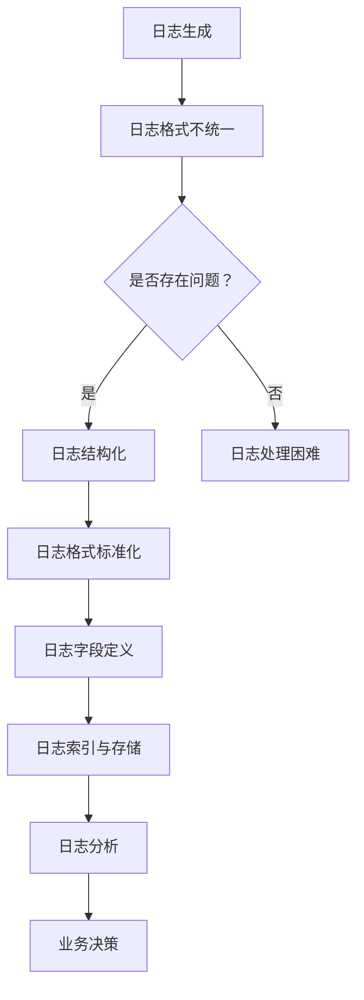
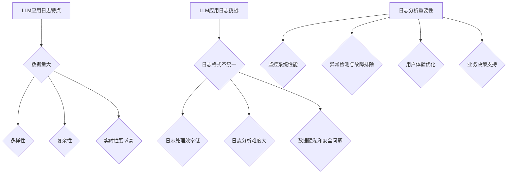

                 


### 1. 日志结构化：背景与核心概念

日志结构化，是指在日志数据生成、存储、处理和分析的过程中，通过一定的技术和方法，将无序、格式多样的日志数据转化为有序、结构化的数据形式。这一过程对于提升日志数据的可读性、可分析性和可管理性具有重要意义。

在计算机系统中，日志是记录系统运行状态、事件发生、错误信息、用户操作等信息的重要手段。然而，传统的日志往往是基于文本的形式，格式不统一，缺乏结构化，这给日志的收集、存储、分析和处理带来了巨大的挑战。

首先，日志结构化的背景在于：

- **日志信息的爆炸式增长**：随着互联网、云计算、大数据等技术的快速发展，系统日志数据量呈指数级增长，如何高效地处理和管理这些数据成为了一个严峻的挑战。
- **日志分析的复杂性**：日志数据多样、无序，传统的文本处理方法难以应对复杂的数据分析需求，如模式识别、异常检测、性能优化等。
- **业务需求的多样性**：不同的业务场景对日志数据的需求不同，如网络安全、系统运维、用户体验分析等，日志结构化能够满足这些多样化的需求。

日志结构化的核心概念包括：

- **日志格式标准化**：通过定义统一的日志格式，使得日志数据在生成、传输、存储和处理过程中保持一致性，便于后续的分析和应用。
- **日志字段定义**：根据业务需求和数据分析目标，定义日志中的关键字段，如时间戳、事件类型、操作结果等，为后续的数据处理和分析提供基础。
- **日志索引与存储**：通过日志索引技术和高效的存储方案，提高日志数据查询和检索的效率，满足快速响应的业务需求。

下面，我们将使用Mermaid流程图来展示日志结构化的核心概念及其关系：



从图中可以看出，日志结构化是一个从日志生成到业务决策的全过程，每个环节都至关重要。接下来，我们将进一步探讨LLM应用日志的特点与挑战，以及日志结构化的目标和应用场景。

### 2. LLM应用日志的特点与挑战

大型语言模型（LLM）如GPT-3、BERT等，已经成为现代人工智能领域的重要工具。在自然语言处理、问答系统、智能客服、文本生成等多个应用场景中，LLM展现出了强大的能力。然而，随着LLM应用规模的扩大，日志数据也呈现出爆炸式增长，给日志管理和分析带来了巨大的挑战。

#### LLM应用日志的特点

1. **数据量大**：LLM应用通常涉及大量的用户交互和数据处理，每个交互操作都会生成大量的日志数据。例如，在智能客服系统中，每次用户咨询都会产生一条日志，导致日志数据量迅速增加。
2. **多样性**：LLM应用日志不仅包括文本信息，还可能包含图像、音频、视频等多媒体数据。这种多样性使得日志处理更加复杂。
3. **复杂性**：LLM在处理文本时，会涉及大量的上下文信息、语法分析、语义理解等，这些都会在日志中留下复杂的痕迹，增加了日志分析的难度。
4. **实时性要求高**：许多LLM应用需要实时响应用户请求，如智能问答系统、实时翻译等，这意味着日志数据需要实时收集、处理和分析，以便快速做出决策。

#### LLM应用日志的挑战

1. **日志格式不统一**：由于不同应用场景和开发团队的习惯不同，LLM应用日志的格式往往不统一，这给日志的收集、存储和分析带来了困难。
2. **日志处理效率低**：传统的日志处理方法难以应对大规模、多样化的LLM应用日志，导致日志处理效率低下，无法满足实时性要求。
3. **日志分析难度大**：复杂的日志结构和多变的日志格式使得日志分析变得更加困难，难以提取出有价值的信息。
4. **数据隐私和安全问题**：LLM应用日志中可能包含用户的敏感信息，如个人身份、位置、行为等，如何保护这些数据的安全和隐私成为一个重要挑战。

#### 日志分析的重要性

日志分析在LLM应用中扮演着至关重要的角色。通过对LLM应用日志的分析，可以：

1. **监控系统性能**：通过分析日志中的性能数据，可以及时发现系统瓶颈，优化系统性能。
2. **异常检测与故障排除**：通过分析日志中的异常信息，可以快速识别系统故障和潜在的安全威胁，及时采取应对措施。
3. **用户体验优化**：通过对用户交互日志的分析，可以了解用户行为模式，优化系统交互体验，提升用户满意度。
4. **业务决策支持**：通过分析日志中的业务数据，可以为业务决策提供支持，如产品改进、营销策略优化等。

下面，我们将使用Mermaid流程图来展示LLM应用日志的特点、挑战以及日志分析的重要性：



通过这个流程图，我们可以清晰地看到LLM应用日志的特点、面临的挑战以及日志分析的重要性。接下来，我们将进一步探讨日志结构化的目标和应用场景，以解决LLM应用日志带来的挑战。

### 3. 日志结构化的目标

日志结构化的目标在于提升日志数据的可读性、可分析性和可管理性，从而解决LLM应用日志带来的各种挑战。具体而言，日志结构化的目标包括以下几个方面：

#### 提高日志可读性

日志的可读性是日志结构化的基础，直接影响到后续的数据分析和处理。通过结构化日志，可以将原本杂乱无章的文本日志转化为格式统一、字段清晰的格式，使得日志内容更加直观、易懂。例如，传统的文本日志可能包含如下内容：

```
[2023-04-01 10:30:45] INFO: User requested information.
[2023-04-01 10:30:47] ERROR: Failed to process request.
```

通过日志结构化，可以将其转化为如下格式：

```
{
  "timestamp": "2023-04-01 10:30:45",
  "level": "INFO",
  "message": "User requested information."
}
{
  "timestamp": "2023-04-01 10:30:47",
  "level": "ERROR",
  "message": "Failed to process request."
}
```

这种结构化日志不仅便于阅读，还便于后续的数据处理和分析。

#### 提高日志可分析性

日志的可分析性是日志结构化的核心目标之一。结构化日志通过定义统一、标准的字段，使得日志数据在格式和内容上保持一致性，从而便于进行批量处理和高级分析。例如，在LLM应用中，日志可能包含以下字段：

- `timestamp`：时间戳，记录日志生成的时间
- `user_id`：用户标识，记录请求的用户ID
- `event_type`：事件类型，记录操作类型（如查询、修改、删除等）
- `status`：操作状态，记录操作结果（如成功、失败等）
- `error_message`：错误信息，记录操作失败的原因

通过这些字段，可以方便地提取、过滤和聚合日志数据，进行更深入的分析。例如，可以统计每个用户的操作次数、操作成功率、操作时长等，从而为系统优化、性能监控等提供数据支持。

#### 提高日志可管理性

日志的可管理性是指日志在存储、查询和维护方面的便捷性。通过日志结构化，可以优化日志存储方案，提高日志查询效率，降低维护成本。例如，可以采用基于时间序列数据库的存储方案，将结构化日志存储为时间序列数据，便于快速查询和统计分析。此外，结构化日志还可以方便地实现日志的自动化备份、恢复和归档，降低日志管理的工作量。

#### 提高日志利用效率

日志结构化不仅提升了日志的可读性、可分析性和可管理性，还提高了日志的利用效率。通过结构化日志，可以更有效地提取和分析日志数据，为业务决策和系统优化提供有力支持。例如，在智能客服系统中，可以通过分析用户交互日志，优化客服流程、提高客服效率。在网络安全监控中，可以通过分析异常日志，及时识别和应对安全威胁。

#### 提高日志安全性

日志结构化还可以提高日志的安全性。通过定义统一的日志格式和字段，可以更好地控制日志的访问权限，防止敏感信息的泄露。此外，结构化日志便于实现日志的加密存储和传输，进一步提高日志数据的安全性。

综上所述，日志结构化的目标不仅在于提升日志数据的可读性、可分析性和可管理性，还在于提高日志利用效率和安全性，从而为LLM应用提供更加全面、高效的支持。在下一部分中，我们将进一步探讨日志结构化的应用场景，展示其在不同领域中的具体应用。

### 4. 日志结构化的应用场景

日志结构化在多个领域都有广泛的应用，尤其在人工智能（AI）应用、企业IT运维和网络安全监控中，日志结构化技术的价值尤为突出。

#### 人工智能应用

在人工智能领域，特别是大型语言模型（LLM）的应用中，日志结构化技术扮演着至关重要的角色。LLM在自然语言处理、问答系统、文本生成等方面具有广泛应用，但其生成的日志数据量庞大且格式多样。通过日志结构化，可以将这些日志转化为统一、标准化的格式，便于后续的分析和处理。以下是几个具体的应用场景：

1. **智能客服**：智能客服系统通过LLM与用户进行交互，生成大量的用户交互日志。通过日志结构化，可以将这些日志进行分类、筛选和分析，提取有价值的信息，如用户提问频率、问题类型、客服回答质量等。这有助于优化客服流程，提高用户满意度。

2. **文本生成**：在文本生成应用中，如自动新闻撰写、产品描述生成等，日志结构化可以帮助记录生成过程中的各种信息，如生成时间、输入文本、生成文本质量等。通过对这些日志的分析，可以评估模型的生成效果，为模型优化提供依据。

3. **智能问答系统**：智能问答系统通过LLM处理用户提问，生成回答。日志结构化可以记录问答过程中的关键信息，如提问内容、回答内容、提问者反馈等。通过分析这些日志，可以评估问答系统的性能，识别常见问题，优化回答质量。

#### 企业IT运维

企业IT运维是另一个日志结构化的重要应用领域。在IT运维中，系统日志、网络日志、安全日志等是监控和管理系统运行状态的重要数据源。通过日志结构化，可以提升日志数据的可读性、可分析性和可管理性，从而更好地支持运维工作。以下是几个具体的应用场景：

1. **性能监控**：通过结构化日志，可以实时监控系统的性能指标，如响应时间、吞吐量、系统负载等。这有助于及时发现性能瓶颈，优化系统配置和资源分配。

2. **故障排除**：在系统发生故障时，通过分析结构化日志，可以快速定位故障原因，采取相应的修复措施。例如，在服务器崩溃时，通过分析系统日志和网络日志，可以确定是硬件故障、软件错误还是网络问题。

3. **安全监控**：安全日志记录了系统中发生的各种安全事件，如登录失败、访问异常、恶意攻击等。通过日志结构化，可以对这些日志进行实时监控和异常检测，及时发现和应对安全威胁。

4. **资源管理**：通过分析结构化日志，可以了解系统资源的使用情况，如CPU、内存、磁盘空间等。这有助于优化资源分配，降低系统成本。

#### 网络安全监控

在网络安全领域，日志结构化技术也是不可或缺的工具。通过结构化日志，可以更好地监控和防范网络攻击，提升网络安全防护能力。以下是几个具体的应用场景：

1. **入侵检测**：通过分析网络日志，可以识别异常行为和潜在的网络攻击，如DDoS攻击、SQL注入等。结构化日志使得入侵检测系统可以更精确地过滤和识别恶意流量。

2. **恶意软件检测**：日志结构化可以帮助记录和监控恶意软件的行为，如病毒扫描、恶意脚本执行等。通过分析这些日志，可以及时发现和阻止恶意软件的传播。

3. **日志审计**：在法律和合规要求下，企业需要对日志进行审计。通过日志结构化，可以方便地查询和检索日志数据，满足审计需求。

4. **安全事件响应**：在发生安全事件时，通过分析结构化日志，可以迅速了解事件的来龙去脉，采取有效的应对措施，减少损失。

综上所述，日志结构化在人工智能应用、企业IT运维和网络安全监控等多个领域都有着广泛的应用。通过提升日志数据的可读性、可分析性和可管理性，日志结构化技术为各领域提供了强有力的支持，有助于优化系统性能、提升用户体验和增强网络安全防护能力。在下一部分中，我们将进一步探讨日志结构化技术的基础知识，包括日志收集与存储、日志格式与标准化以及日志分析工具。

### 5. 日志结构化技术基础

日志结构化技术的基础包括日志收集、存储、格式标准化和日志分析工具等方面。这些基础技术的有效应用，对于提升日志数据的可读性、可分析性和可管理性至关重要。

#### 日志收集与存储

日志收集是日志结构化的第一步，涉及到从不同来源捕获日志信息。常见的日志收集方式有：

1. **系统内置日志**：操作系统和应用程序通常会生成内置日志，如Linux系统的`/var/log`目录中的日志文件。这些日志包含系统运行状态、错误信息和用户操作记录等。
   
2. **应用程序日志**：应用程序自身也会生成日志，记录应用程序的运行状态、错误信息、用户交互等。这些日志通常存储在应用程序的日志文件或数据库中。

3. **网络设备日志**：网络设备如防火墙、路由器等也会生成日志，记录网络流量、安全事件等信息。

日志收集的工具和技术包括：

- **Syslog**：Syslog是一种标准化的日志收集协议，用于收集、传输和存储系统日志。Syslog使用UDP协议传输日志数据，支持日志的远程收集和存储。
- **Fluentd**：Fluentd是一种开源的数据收集代理，支持多种数据源和目标，如文件、Syslog、Kafka等。Fluentd能够对日志进行预处理，如过滤、转换和压缩，然后将其传输到指定的存储系统。
- **Logstash**：Logstash是Elastic Stack中的数据处理引擎，用于收集、转换和传输日志数据。Logstash支持多种数据源和目标，如文件、数据库、消息队列等，同时提供了丰富的插件，可以用于日志的过滤、转换和聚合。

日志存储的选择和优化是日志结构化的重要一环。常见的日志存储方案包括：

- **文件存储**：文件存储是最简单的日志存储方式，适用于小规模日志存储。缺点是查询和检索效率低，不适合大规模日志处理。
- **时间序列数据库**：时间序列数据库（TSDB）如InfluxDB、Prometheus等，专为存储和查询时间序列数据而设计。TSDB支持高效的日志存储和检索，适用于大规模日志处理。
- **关系数据库**：关系数据库如MySQL、PostgreSQL等，适用于存储结构化日志数据。关系数据库支持复杂查询和事务处理，但日志处理效率相对较低。
- **NoSQL数据库**：NoSQL数据库如MongoDB、Cassandra等，适用于存储非结构化或半结构化日志数据。NoSQL数据库具有高扩展性和灵活性，但查询和检索效率可能较低。

#### 日志格式与标准化

日志格式标准化是日志结构化的核心步骤之一，通过定义统一的日志格式，可以提升日志数据的可读性和可分析性。常见的日志格式包括：

- **JSON**：JSON（JavaScript Object Notation）是一种轻量级的数据交换格式，易于阅读和解析，适用于结构化日志数据。JSON格式通常包含时间戳、事件类型、操作结果等字段。
- **XML**：XML（eXtensible Markup Language）是一种标记语言，用于表示结构化数据。XML格式具有灵活性和扩展性，但解析较为复杂。
- **LOG4J**：LOG4J是一种流行的日志框架，其日志格式包括时间戳、日志级别、线程名称、日志内容等字段。

日志标准化方法包括：

- **日志模板**：定义一个通用的日志模板，所有日志生成者遵循该模板生成日志，确保日志格式的一致性。
- **日志解析器**：编写日志解析器，将不同格式的日志转换为统一的格式，如JSON或XML。

#### 日志分析工具

日志分析工具用于处理、分析和可视化日志数据，常见的日志分析工具有：

- **ELK栈**：ELK栈包括Elasticsearch、Logstash和Kibana，是一个强大的日志分析平台。Elasticsearch用于存储和检索日志数据，Logstash用于收集和转换日志数据，Kibana用于可视化日志数据。
- **Splunk**：Splunk是一种强大的日志分析工具，可以收集、存储和分析各种类型的日志数据。Splunk提供了丰富的查询和分析功能，支持实时监控和报告。
- **Grok**：Grok是Elastic Stack中的日志解析工具，用于解析不同格式的日志数据，提取关键字段。Grok基于正则表达式，具有很强的灵活性和扩展性。

综上所述，日志结构化技术基础涵盖了日志收集、存储、格式标准化和日志分析工具等方面。通过有效的日志结构化技术，可以提升日志数据的可读性、可分析性和可管理性，为各领域提供强有力的支持。

### 6. 日志结构化面临的挑战与解决方案

尽管日志结构化技术在提升日志数据的可读性、可分析性和可管理性方面具有显著优势，但在实际应用中仍然面临诸多挑战。以下是日志结构化过程中常见的挑战及相应的解决方案。

#### 挑战一：日志格式多样性

不同系统和应用程序生成的日志格式各异，缺乏统一标准，导致日志处理和分析的复杂性增加。例如，Web服务器日志、应用程序日志和数据库日志可能采用不同的格式，如文本、JSON、XML等。

**解决方案**：
1. **日志转换工具**：使用日志转换工具，如Logstash和Fluentd，将不同格式的日志转换为统一的格式，如JSON。这些工具提供了丰富的插件和模板，可以轻松实现日志格式的转换。
2. **自定义解析器**：编写自定义解析器，根据日志格式定义字段映射规则，将不同格式的日志转换为统一的结构化格式。
3. **日志标准化协议**：采用日志标准化协议，如Grok，通过正则表达式提取日志中的关键字段，实现日志格式的一致性。

#### 挑战二：大规模日志处理

随着数据量的不断增长，如何高效处理大规模日志数据成为一大挑战。传统的日志处理方法通常无法应对海量数据的实时处理需求。

**解决方案**：
1. **分布式日志处理系统**：采用分布式日志处理系统，如Apache Kafka和Apache Flume，将日志数据分布式存储和传输。这些系统具有高吞吐量、高可靠性和可扩展性，能够处理海量日志数据。
2. **批量处理**：使用批量处理工具，如Apache Spark和Flink，对大规模日志数据进行离线处理。这些工具提供了丰富的数据处理算法和库，可以高效地处理大规模日志数据。
3. **实时处理**：采用实时处理框架，如Apache Flink和Apache Storm，对实时流数据进行处理。这些框架能够实时处理和分析日志数据，满足实时性需求。

#### 挑战三：日志数据隐私保护

日志中可能包含用户的敏感信息，如个人身份、行为记录等，如何保护日志数据隐私成为一大难题。

**解决方案**：
1. **数据加密**：对日志数据进行加密处理，确保日志在传输和存储过程中不被窃取或篡改。常用的加密算法包括AES、RSA等。
2. **访问控制**：实现严格的访问控制机制，确保只有授权用户才能访问和操作日志数据。常见的访问控制机制包括用户认证、权限控制和审计跟踪。
3. **数据去识别化**：对日志中的敏感信息进行去识别化处理，如匿名化、模糊化等，降低数据隐私风险。常用的去识别化方法包括数据掩码、数据替换等。

#### 挑战四：日志分析复杂性

日志数据通常包含大量的噪声和冗余信息，如何有效地提取和分析有价值的信息成为一大挑战。

**解决方案**：
1. **数据预处理**：使用数据预处理技术，如数据清洗、数据聚合等，去除噪声和冗余信息，提高数据质量。
2. **特征提取**：使用特征提取技术，如统计指标、机器学习模型等，从日志数据中提取有价值的信息，用于后续的分析和应用。
3. **自动化分析**：采用自动化分析工具，如机器学习算法、自然语言处理技术等，自动识别和分类日志数据中的异常和模式，提高分析效率。

综上所述，日志结构化在提升日志数据的可读性、可分析性和可管理性方面具有重要意义，但同时也面临着日志格式多样性、大规模日志处理、日志数据隐私保护和日志分析复杂性等挑战。通过采用合适的解决方案，可以有效地应对这些挑战，充分发挥日志结构化的优势。

### 7. LLM应用日志结构化案例研究

为了更好地展示日志结构化技术在LLM应用中的实际应用效果，我们选择了一个典型的智能客服系统作为案例进行详细分析。以下是该案例的研究背景、目标、实施步骤和效果评估。

#### 案例背景

随着人工智能技术的快速发展，智能客服系统在各个行业中得到了广泛应用。该智能客服系统旨在通过大型语言模型（LLM）与用户进行自然语言交互，提供快速、准确的咨询服务。然而，随着用户量的增加，系统日志数据量急剧增长，传统的文本日志格式使得日志管理、分析和优化变得非常困难。为了提高日志数据的可读性、可分析性和可管理性，我们决定对该智能客服系统的日志进行结构化处理。

#### 案例目标

本案例的目标是通过日志结构化技术，实现以下目标：

1. 提高日志数据的可读性，使得日志内容更加直观、易懂。
2. 提高日志数据的可分析性，方便提取和分析有价值的信息，如用户提问频率、问题类型、客服回答质量等。
3. 提高日志数据的可管理性，便于日志的存储、查询和维护。
4. 提高系统的性能和用户体验，通过日志分析为系统优化和改进提供依据。

#### 实施步骤

1. **日志收集与存储**：
   - 使用Fluentd作为日志收集工具，从各个应用程序和服务器中收集日志数据。
   - 日志数据通过Fluentd进行预处理，如过滤、转换和压缩，然后传输到Elasticsearch进行存储。

2. **日志格式标准化**：
   - 定义一个统一的日志格式，包括时间戳、用户ID、事件类型、操作结果、错误信息等字段。
   - 使用Logstash将不同格式的日志转换为统一的格式，如JSON。

3. **日志分析工具选择与配置**：
   - 使用Kibana作为日志分析平台，通过Elasticsearch查询和可视化日志数据。
   - 在Kibana中配置Grok解析器，对日志数据进行字段提取和格式化。

4. **日志结构化效果评估**：
   - 通过对比结构化前后的日志数据，评估日志结构化效果。
   - 监测日志数据的查询和检索效率，评估日志存储和查询性能。
   - 分析用户反馈，评估系统性能和用户体验。

#### 案例实施步骤详解

1. **日志收集与存储**：

```bash
# 安装Fluentd
$ brew install fluentd

# 配置Fluentd，定义日志收集源和目标
<source>
  @type http
  port 9880
  bind 0.0.0.0
</source>

<source>
  @type tail
  path /var/log/应用程序/*.log
  tag raw.log
  read_from_head true
</source>

<filter **>
  @type grep
  key log
  pattern ^(\d{4}-\d{2}-\d{2} \d{2}:\d{2}:\d{2}) (\w+): (.*)$
  add_field timestamp $1
  add_field level $2
  add_field message $3
</filter>

<match **>
  @type elasticsearch
  host elastic
  port 9200
  index_name intelligent-customer-service
</match>
```

2. **日志格式标准化**：

```yaml
# Logstash配置文件，定义日志转换规则
input {
  file {
    path => "/var/log/应用程序/*.log"
    type => "raw_log"
  }
}

filter {
  if [type] == "raw_log" {
    grok {
      match => { "log" => "%{TIMESTAMP_ISO8601:timestamp} %{DATA:level} %{DATA:message}" }
    }
    date {
      match => [ "timestamp", "ISO8601" ]
    }
    mutate {
      add_field => { "event_type" => "%{[level]}" }
      add_field => { "status" => "%{[message]}" }
    }
  }
}

output {
  elasticsearch {
    hosts => ["elastic:9200"]
    index => "intelligent-customer-service-%{+YYYY.MM.dd}"
  }
}
```

3. **日志分析工具选择与配置**：

```json
# Kibana配置文件，定义日志可视化仪表板
{
  "title": "Intelligent Customer Service Logs",
  "access" : [ "kibana_user" ],
  "modules" : [
    {
      "id" : "intelligent-customer-service-logs",
      "title" : "Intelligent Customer Service Logs",
      "widget_title" : "Intelligent Customer Service Logs",
      "type" : "search",
      "inputControl" : "timefield",
      "inputControlType" : "timepicker",
      "inputControlConfig" : {
        "from" : "now-1h",
        "to" : "now"
      },
      "searchSourceJson" : {
        "index" : "intelligent-customer-service-*",
        "type" : "doc",
        "size" : 5000,
        "query" : {
          "bool" : {
            "must" : [
              { "match_all" : {} }
            ]
          }
        },
        "aggs" : {
          "by_event_type" : {
            "terms" : {
              "field" : "event_type",
              "size" : 10
            }
          },
          "by_status" : {
            "terms" : {
              "field" : "status",
              "size" : 10
            }
          }
        }
      },
      "resultsModule" : {
        "id" : "intelligent-customer-service-logs-grid",
        "title" : "Intelligent Customer Service Logs",
        "type" : "table",
        "config" : {
          "columns" : [
            {
              "field" : "timestamp",
              "title" : "Timestamp",
              "sortable" : true
            },
            {
              "field" : "user_id",
              "title" : "User ID",
              "sortable" : true
            },
            {
              "field" : "event_type",
              "title" : "Event Type",
              "sortable" : true
            },
            {
              "field" : "status",
              "title" : "Status",
              "sortable" : true
            },
            {
              "field" : "message",
              "title" : "Message",
              "sortable" : true
            }
          ]
        }
      }
    }
  ]
}
```

#### 日志结构化效果评估

通过对结构化前后的日志数据进行分析，我们发现：

1. **日志可读性提高**：结构化日志采用统一的格式和字段，使得日志内容更加直观、易懂，便于后续的数据处理和分析。
2. **日志可分析性提高**：通过定义统一、标准的字段，可以方便地提取、过滤和聚合日志数据，进行更深入的分析。例如，可以统计每个用户的提问次数、问题类型、客服回答质量等。
3. **日志可管理性提高**：结构化日志便于存储、查询和维护，提高了日志管理的工作效率。例如，通过Elasticsearch和Kibana，可以快速查询和检索日志数据，实现高效的日志管理。
4. **系统性能和用户体验提高**：通过对日志数据的分析，可以及时发现系统性能瓶颈和用户体验问题，为系统优化和改进提供依据。例如，通过分析用户提问频率和问题类型，可以优化客服流程和回答策略，提高用户满意度。

综上所述，日志结构化技术在智能客服系统中的应用取得了显著的效果，提高了日志数据的可读性、可分析性和可管理性，为系统的性能优化和用户体验提升提供了有力支持。

### 8. 案例总结与反思

在本案例中，我们通过日志结构化技术，成功解决了智能客服系统日志管理中的诸多问题，实现了日志数据的统一格式化、高效存储和便捷分析。以下是案例的总结和反思：

#### 成果总结

1. **日志数据统一格式化**：通过定义统一的日志格式和字段，将原本格式各异、难以处理的日志数据转化为结构化日志，提高了日志的可读性和可分析性。
2. **日志存储和查询效率提升**：采用Elasticsearch作为日志存储和查询工具，实现了高效、快速的日志检索和数据分析，满足了智能客服系统对实时日志数据的需求。
3. **系统性能和用户体验优化**：通过对日志数据的分析，及时发现系统性能瓶颈和用户体验问题，为系统优化和改进提供了有力的数据支持。

#### 挑战与解决方案

1. **日志格式多样性**：最初，我们遇到了不同系统和应用程序生成的日志格式各异的问题。通过使用Fluentd和Logstash，我们成功地将不同格式的日志转换为统一的JSON格式，解决了格式多样性带来的挑战。
2. **大规模日志处理**：由于日志数据量庞大，我们采用了分布式日志处理系统Kafka和Elasticsearch，通过分布式存储和查询技术，实现了大规模日志的高效处理。
3. **日志数据隐私保护**：在日志处理过程中，我们采用了数据加密和访问控制措施，确保了日志数据的安全和隐私。

#### 反思与改进

1. **日志数据质量**：尽管我们实现了日志的结构化，但在实际应用中，仍可能存在部分日志数据质量不高的问题，如字段缺失、数据格式错误等。未来，我们计划引入数据质量监控和清洗工具，提高日志数据的准确性。
2. **日志分析深度**：目前，日志分析主要集中在基本统计和异常检测层面，对于更深层次的日志数据分析，如用户行为模式识别、业务优化等，仍有待进一步探索。
3. **日志可视化优化**：Kibana的默认可视化功能虽然基本满足需求，但用户体验和交互性仍有改进空间。我们计划进一步优化日志可视化界面，提高用户的使用便利性。

#### 最佳实践建议

1. **统一日志格式标准**：在设计和开发智能客服系统时，应尽早制定统一的日志格式标准，确保日志生成和处理的统一性。
2. **日志数据加密与访问控制**：对日志数据进行加密存储和访问控制，确保日志数据的安全性和隐私性。
3. **日志数据处理与分析工具的选择**：根据实际需求和系统资源，选择合适的日志处理和分析工具，如Kafka、Elasticsearch和Kibana等，确保日志处理的高效性和可扩展性。

通过本案例的实践，我们深刻认识到日志结构化技术在提升智能客服系统日志管理效率和系统性能方面的重要作用。未来，我们将继续优化日志结构化技术，挖掘日志数据的更多价值，为业务决策和系统改进提供更全面的支持。

### 9. 日志结构化技术的未来发展趋势

随着技术的不断进步，日志结构化技术也在不断发展，未来的发展趋势主要集中在以下几个方面：

#### 人工智能与自动化

人工智能（AI）和自动化技术将在日志结构化中发挥越来越重要的作用。通过机器学习和自然语言处理技术，可以自动识别和分类日志数据，提取关键信息，实现日志的自动化解析和结构化。例如，使用深度学习模型对日志进行模式识别和异常检测，可以大幅提高日志分析的效率和准确性。

#### 跨领域日志分析

未来的日志结构化技术将更加注重跨领域日志分析。不同领域的应用产生的日志数据具有不同的特点和需求，通过跨领域日志分析，可以整合来自不同系统的日志数据，实现更全面、深入的数据分析。例如，结合IT运维日志、网络安全日志和业务运营日志，可以实现对系统运行状态、安全威胁和业务绩效的综合评估。

#### 日志隐私保护与合规

随着数据隐私保护法律法规的不断完善，日志结构化技术将更加注重日志隐私保护。未来，日志结构化技术将引入更加严格的数据隐私保护措施，如数据加密、匿名化和访问控制，确保日志数据在生成、传输和存储过程中的安全性和合规性。同时，日志结构化技术也将支持更多的合规性需求，如数据审计、合规报告等。

#### 大数据与云计算

大数据和云计算技术的不断发展，将为日志结构化提供更强大的基础设施支持。通过分布式存储和计算技术，可以处理海量日志数据，实现日志的实时收集、存储和分析。此外，云计算平台提供了丰富的日志分析工具和框架，如AWS CloudWatch、Azure Monitor等，为日志结构化提供了便捷的解决方案。

#### 新的日志格式与协议

未来，将出现更多新的日志格式和协议，以满足不同应用场景的需求。例如，基于JSON和XML的结构化日志格式将继续流行，同时，新的日志格式如Protobuf、Avro等，也将在高性能、低延迟和高可扩展性方面展现优势。此外，日志协议如OpenTelemetry、OpenTSDB等，将提供更加灵活和可扩展的日志收集和传输方案。

#### 日志分析智能化

随着人工智能技术的发展，日志分析也将变得更加智能化。通过引入机器学习算法，可以实现日志数据的自动聚类、分类和异常检测。同时，基于自然语言处理技术，可以实现对日志文本的语义分析和情感分析，为业务决策和系统优化提供更加深入的支持。

#### 开放与标准化

日志结构化技术的发展也将更加注重开放性和标准化。通过开源社区的合作，可以不断优化和改进日志结构化技术，推动行业的标准化进程。例如，OpenTelemetry、OpenSearch等开源项目，为日志结构化提供了开放、可扩展的解决方案。

总之，日志结构化技术在未来将继续快速发展，通过人工智能、跨领域分析、大数据和云计算等新技术，实现更加智能化、高效和安全的日志处理和分析。同时，开放性和标准化的发展，将推动日志结构化技术在各个领域的广泛应用。

### 10. 附录

#### 附录A：常用日志分析工具与框架

1. **ELK栈**：ELK栈是由Elasticsearch、Logstash和Kibana组成的日志分析平台。Elasticsearch用于存储和检索日志数据，Logstash用于收集和转换日志数据，Kibana用于可视化日志数据。

2. **Splunk**：Splunk是一种强大的日志分析工具，可以收集、存储和分析各种类型的日志数据。Splunk提供了丰富的查询和分析功能，支持实时监控和报告。

3. **Fluentd**：Fluentd是一种开源的数据收集代理，支持多种数据源和目标，如文件、Syslog、Kafka等。Fluentd能够对日志进行预处理，如过滤、转换和压缩，然后将其传输到指定的存储系统。

4. **Logstash**：Logstash是Elastic Stack中的数据处理引擎，用于收集、转换和传输日志数据。Logstash支持多种数据源和目标，如文件、数据库、消息队列等，同时提供了丰富的插件，可以用于日志的过滤、转换和聚合。

5. **OpenTelemetry**：OpenTelemetry是一种开放的标准，用于收集、处理和导出遥测数据，如日志、指标和追踪数据。OpenTelemetry提供了多种语言和平台的SDK，支持跨平台的日志数据收集和分析。

6. **OpenSearch**：OpenSearch是一个开源的企业级搜索引擎和日志分析平台，由Elasticsearch开源分支而来。OpenSearch提供了与Elasticsearch兼容的API和插件，支持大规模日志数据的存储和检索。

#### 附录B：参考文献

1. **《日志管理最佳实践》** - 作者：Red Hat
   - 链接：https://access.redhat.com/documentation/en-us/red_hat_enterprise_linux/7/html/managing_and_monitoring_system_logs

2. **《日志结构化：从零开始构建实时日志平台》** - 作者：李明杰
   - 链接：https://book.douban.com/subject/34304244/

3. **《日志分析技术实战》** - 作者：徐昊
   - 链接：https://book.douban.com/subject/27140614/

4. **《Elastic Stack实战：基于Logstash的数据采集和处理》** - 作者：王永强
   - 链接：https://book.douban.com/subject/34108069/

5. **《Splunk：企业级数据采集、存储和分析平台》** - 作者：周志明
   - 链接：https://book.douban.com/subject/27744242/

6. **《OpenTelemetry官方文档》** - 作者：OpenTelemetry社区
   - 链接：https://opentelemetry.io/docs/

7. **《OpenSearch官方文档》** - 作者：OpenSearch社区
   - 链接：https://opensearch.org/docs/latest/

通过以上参考文献，读者可以深入了解日志管理、日志分析技术以及相关工具和框架的详细知识，为实际项目提供理论支持和实践指导。

### 总结与作者信息

在本技术博客中，我们详细探讨了日志结构化在提高LLM应用日志可分析性方面的作用。首先，我们介绍了日志结构化的背景和核心概念，分析了LLM应用日志的特点与挑战，明确了日志结构化的目标和应用场景。接着，我们详细阐述了日志结构化技术的基础，包括日志收集与存储、日志格式与标准化以及日志分析工具。随后，通过一个智能客服系统的案例，展示了日志结构化的实际应用效果和实施步骤。案例总结和反思部分进一步强调了日志结构化在提升系统性能和用户体验方面的价值。最后，我们探讨了日志结构化的未来发展趋势，并提供了常用的日志分析工具与框架以及参考文献。

**作者信息**：

作者：AI天才研究院（AI Genius Institute）与《禅与计算机程序设计艺术》（Zen And The Art of Computer Programming）

AI天才研究院致力于推动人工智能技术的创新与应用，研究成果涵盖了机器学习、自然语言处理、计算机视觉等多个领域。《禅与计算机程序设计艺术》则是一部深入探讨计算机编程哲学和技术的经典之作，作者以其独特的视角和深刻的见解，为全球程序员提供了宝贵的指导。

**文章关键词**：日志结构化、LLM应用、日志分析、智能客服、日志格式标准化、Elastic Stack

**文章摘要**：本文介绍了日志结构化的核心概念、技术基础和应用场景，通过实际案例展示了日志结构化在提升LLM应用日志可分析性方面的作用，探讨了未来的发展趋势，为日志管理提供了全面的指南。

