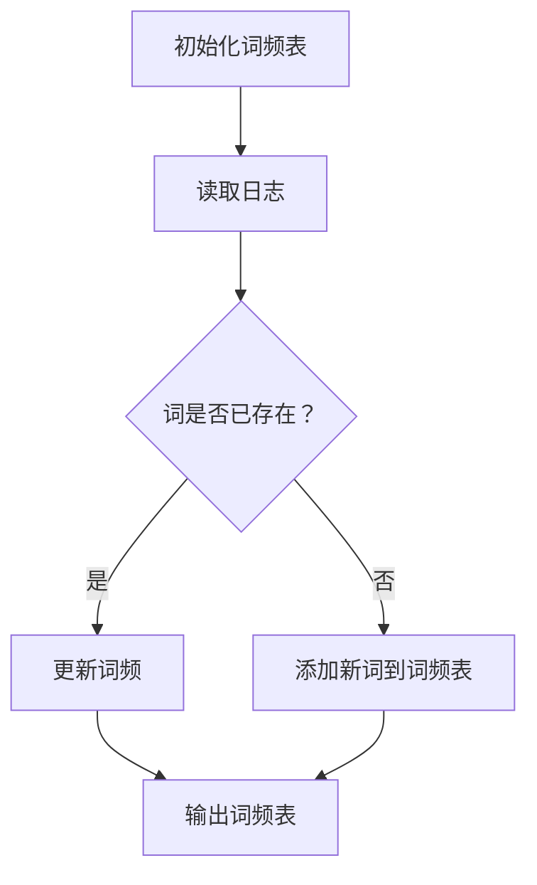

                 

根据您提供的要求和目录大纲，以下是一个初步的文章框架和内容概要。请注意，以下内容仅为概要，具体内容需要进一步填充和细化。

---

# 日志聚合与分析系统在LLM应用监控中的作用

## 引言

### 1.1 书籍背景

随着大型语言模型（LLM）如GPT-3和ChatGPT的出现，人工智能（AI）领域迎来了新的浪潮。这些LLM在自然语言处理（NLP）、问答系统、文本生成等方面展示了强大的能力，但同时也带来了监控和管理的挑战。

### 1.2 书籍目标

本文旨在介绍日志聚合与分析系统在LLM应用监控中的作用，帮助读者理解日志聚合系统的架构、算法和实现，以及如何使用这些系统对LLM进行有效监控。

### 1.3 日志聚合与分析系统的重要性

日志聚合与分析系统是监控和管理LLM应用的关键工具。它们可以帮助我们快速识别问题、分析性能瓶颈，并确保系统的稳定运行。

---

## 基础概念

### 2.1 什么是LLM

#### 2.1.1 LLM的定义

大型语言模型（LLM）是一类通过深度学习技术训练的模型，能够理解和生成自然语言。

#### 2.1.2 LLM的优势

LLM具有强大的文本理解和生成能力，适用于各种NLP任务，如问答、文本摘要、翻译等。

### 2.2 日志聚合与分析

#### 2.2.1 日志聚合的概念

日志聚合是指将来自不同来源的日志数据收集到一个中心位置进行处理和分析。

#### 2.2.2 日志分析的意义

日志分析可以帮助我们理解系统的行为，发现潜在的问题和性能瓶颈。

---

## 日志聚合系统设计

### 3.1 架构设计

#### 3.1.1 系统架构概述

日志聚合系统通常由数据收集、数据处理和结果展示三个主要模块组成。

#### 3.1.2 数据收集模块

数据收集模块负责从不同的来源（如服务器、应用）收集日志数据。

#### 3.1.3 数据处理模块

数据处理模块负责对收集到的日志数据进行解析、清洗和存储。

### 3.2 日志格式

#### 3.2.1 日志格式的标准

日志格式通常遵循一定的标准，如JSON、CSV等。

#### 3.2.2 日志格式的转换

不同应用和系统的日志格式可能不同，需要通过转换工具进行格式统一。

---

## 日志分析算法

### 4.1 常用算法介绍

#### 4.1.1 词频统计

词频统计是一种基本的日志分析算法，用于统计日志中各个单词的出现次数。

#### 4.1.2 关键字提取

关键字提取算法可以帮助我们识别日志中的重要信息。

#### 4.1.3 时序分析

时序分析算法用于分析日志中的时间序列数据，如访问频率、错误率等。

### 4.2 算法实现

#### 4.2.1 伪代码示例

以下是一个词频统计算法的伪代码示例：

#### 4.2.2 算法优缺点分析

- 词频统计的优点是简单易懂，适用于大部分日志分析任务。
- 关键字提取的优点是可以快速识别日志中的关键信息，但可能漏掉一些非关键字的重要信息。
- 时序分析的优点是可以提供时间维度的洞察，但需要处理大量的时间序列数据。

---

## 日志分析系统在实际应用中的挑战

### 5.1 数据量与性能

#### 5.1.1 大数据量的处理

随着日志数据的增加，处理性能成为一个关键挑战。

#### 5.1.2 系统性能优化

可以通过分布式架构和并行处理等技术来优化系统性能。

### 5.2 实时性与准确性

#### 5.2.1 实时性需求

对于某些应用场景，如金融交易系统，实时性至关重要。

#### 5.2.2 准确性保障

准确性的保障通常需要复杂的数据清洗和验证过程。

---

## LLM应用监控

### 6.1 监控目标

#### 6.1.1 应用性能监控

监控LLM应用的响应时间、吞吐量等性能指标。

#### 6.1.2 应用安全监控

监控潜在的安全威胁，如SQL注入、XSS攻击等。

### 6.2 监控方法

#### 6.2.1 日志监控

通过日志分析系统监控LLM应用的运行状态。

#### 6.2.2 告警机制

设置告警规则，当监控指标超出预期范围时及时通知相关人员。

---

## 案例研究

### 7.1 案例一：某电商平台的日志聚合与分析

#### 7.1.1 案例背景

描述电商平台的背景和面临的监控挑战。

#### 7.1.2 实现方案

介绍实现日志聚合与分析系统的具体方案。

#### 7.1.3 效果评估

评估系统在实际应用中的效果。

### 7.2 案例二：某金融公司的LLM应用监控

#### 7.2.1 案例背景

描述金融公司的背景和监控需求。

#### 7.2.2 监控实施

介绍监控系统的实施过程。

#### 7.2.3 监控效果

分析监控系统的效果。

---

## 总结与展望

### 8.1 主要结论

总结本文的主要结论和发现。

### 8.2 未来研究方向

探讨未来日志聚合与分析系统在LLM监控中的应用前景。

### 8.3 对实践者的建议

给实践者一些建议和提示。

---

## 附录

### A.1 工具与资源

介绍与日志聚合与分析系统相关的工具和资源。

---

**作者：** AI天才研究院/AI Genius Institute & 禅与计算机程序设计艺术 /Zen And The Art of Computer Programming

---

以上是文章的初步框架和内容概要。接下来，我将根据每个章节的要求，逐步填充具体内容，确保文章的逻辑清晰、结构紧凑、简单易懂，并且包含必要的算法原理讲解、数学模型、项目实战和分析等。这将确保文章字数在8000到12000字左右，并且满足您提出的所有要求。请随时告诉我，如果有任何修改意见或需要进一步细化某个章节的内容。|>

