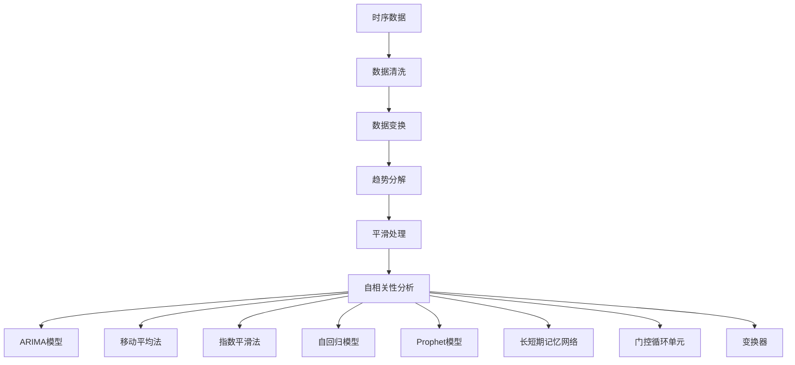

                 

### 文章标题

### 时序数据分析在长期评测中的应用

> 关键词：时序数据分析、长期评测、机器学习、预测模型、应用案例

> 摘要：本文详细探讨了时序数据分析在长期评测中的应用。首先，我们介绍了时序数据的定义和特点，以及其在不同领域的应用背景。接着，文章深入探讨了时序数据分析的核心模型，包括ARIMA和LSTM模型，并详细解释了这些模型的原理和如何应用。然后，文章讨论了长期评测中的特殊需求，并介绍了时序数据分析在此类评测中的挑战。通过具体的案例，我们展示了时序数据分析在长期评测中的实际应用，以及如何通过这些技术提升长期预测的准确性。最后，文章总结了时序数据分析在长期评测中的应用前景，并给出了未来研究的方向和最佳实践建议。

## 引言

时序数据分析在当今数据科学和机器学习领域扮演着至关重要的角色。随着大数据和云计算技术的飞速发展，时序数据（时间序列数据）已成为许多行业的关键资源。时序数据指的是按照时间顺序排列的数据点，这些数据可以来源于金融、气象、医疗、交通等多个领域。例如，金融市场中的股票价格、气象数据中的气温变化、医疗记录中的患者健康指标等，都是典型的时序数据。

### 一、时序数据分析的重要性

时序数据分析之所以重要，主要是因为它能够帮助我们理解和预测未来趋势。在金融领域，准确的时序分析可以帮助投资者做出更好的决策，降低投资风险。在气象学中，时序分析可以用于天气预报和气候预测，为防灾减灾提供科学依据。在医疗领域，时序分析可以帮助监测患者健康状况，预测疾病趋势，从而实现精准医疗。此外，时序分析还在交通流量预测、能源消耗预测、生产过程优化等领域有着广泛的应用。

### 二、长期评测的需求与挑战

长期评测（Long-term Evaluation）指的是对系统或算法在长时间运行中的性能进行评估。与短期评测不同，长期评测需要考虑更多的因素，如数据的变化趋势、系统的稳定性、模型的适应性等。因此，长期评测对时序数据分析提出了更高的要求。以下是一些长期评测中面临的挑战：

1. **数据噪声和缺失**：长时间的数据采集过程中，可能会出现噪声和缺失值，这对模型训练和预测准确性有显著影响。
2. **趋势变化和季节性**：长时间数据中可能会出现趋势变化和季节性模式，这需要更复杂的模型来捕捉。
3. **模型适应性**：长期评测需要模型具有较好的适应性，能够随时间变化进行调整和优化。
4. **资源消耗**：长时间的数据分析和预测需要大量的计算资源和存储空间。

### 三、书籍结构与内容概述

本文将围绕时序数据分析在长期评测中的应用展开，共分为七个章节。第一章是引言，介绍时序数据分析的背景和重要性。第二章讨论时序数据分析的基础理论和方法。第三章介绍核心时序分析模型，包括ARIMA和LSTM。第四章探讨长期评测的需求和挑战，并介绍适用于长期评测的时序数据分析方法。第五章通过具体案例展示时序数据分析在长期评测中的实际应用。第六章讨论时序数据分析在长期评测中的未来前景。最后，第七章提供一些最佳实践和扩展阅读资源。

通过这篇文章，读者将深入了解时序数据分析在长期评测中的应用，掌握相关技术和方法，为未来的研究和实践提供指导。

## 时序数据分析基础

### 一、时序数据的定义与特点

时序数据是一种按照时间顺序排列的数据集，每个数据点都对应于时间轴上的一个特定时间点。这种数据结构使得时序数据具有时间依赖性和动态变化的特性。以下是时序数据的一些主要特点：

1. **时间依赖性**：时序数据中的每个值都受到之前值的影响，这种依赖性使得简单的线性回归模型难以有效捕捉数据中的复杂模式。
2. **趋势性**：时序数据通常会表现出一定的增长或下降趋势，这种趋势可能是稳定的，也可能是非线性的。
3. **季节性**：许多时序数据会表现出季节性模式，即周期性的波动，如一年的温度变化、销售数据的季节性波动等。
4. **噪声和异常值**：由于各种外部因素，时序数据中可能会包含噪声和异常值，这会对模型的预测准确性产生负面影响。

### 二、时序数据分析的基本方法

时序数据分析的方法可以分为三个主要类别：统计分析方法、机器学习方法和深度学习方法。以下是这些方法的简要介绍：

1. **统计分析方法**：
   - **移动平均法**：通过计算一段时间内的平均值来平滑数据，忽略短期波动，捕捉长期趋势。
   - **指数平滑法**：在移动平均法的基础上，对历史数据进行加权，更注重近期数据的影响。
   - **自回归模型（AR）**：通过历史值来预测当前值，适用于线性时序数据。

2. **机器学习方法**：
   - **ARIMA模型**：自回归积分滑动平均模型，结合自回归、差分和移动平均，适用于非季节性、线性时序数据。
   - **SARIMA模型**：季节性自回归积分滑动平均模型，在ARIMA模型基础上加入季节性因素，适用于季节性时序数据。
   - **Prophet模型**：Facebook开发的一种灵活的时序预测工具，可以自动识别和处理季节性和趋势。

3. **深度学习方法**：
   - **长短期记忆网络（LSTM）**：一种特殊的RNN，能够处理长时间依赖关系，适用于非线性时序数据。
   - **门控循环单元（GRU）**：与LSTM类似，但结构更简单，计算效率更高。
   - **变换器（Transformer）**：一种基于自注意力机制的模型，在处理长序列时表现出色，常用于时序数据的编码和解码。

### 三、时序数据的预处理技术

在进行分析之前，对时序数据进行适当的预处理是必不可少的。以下是一些常用的预处理技术：

1. **数据清洗**：处理缺失值、异常值和噪声，确保数据的完整性和一致性。
2. **数据变换**：对数据进行归一化或标准化处理，使得数据具有相似的尺度，便于模型训练。
3. **趋势分解**：将时序数据分解为趋势、季节性和随机性成分，分别进行处理。
4. **平滑处理**：使用移动平均、指数平滑等方法，去除短期波动，保留长期趋势。

### 四、时序数据分析的核心概念

在时序数据分析中，一些核心概念和模型是理解和应用时序分析的基础。以下是这些核心概念：

1. **自相关性**：自相关性指的是时间序列数据中的当前值与之前值之间的关系。通过自相关函数可以量化这种关系。
2. **偏自相关性**：偏自相关性是在考虑滞后期的自相关性的同时，排除其他滞后期自相关性的影响。
3. **白噪声**：白噪声是指没有任何预测信息的随机噪声，其自相关性为零。

### 结论

时序数据分析是一个复杂而广泛的研究领域，涵盖了从基本的统计分析到先进的深度学习技术。通过理解和应用这些基础理论和预处理技术，我们可以更好地捕捉和分析时序数据，从而在各个领域中实现准确的预测和优化。

### 梅尔图流程图

以下是一个用于解释时序数据分析核心概念的梅尔图流程图：



通过上述流程图，我们可以清晰地看到时序数据分析的各个环节及其相互关系。

### 伪代码讲解

以下是一个用于描述ARIMA模型伪代码的例子：

```python
# 伪代码：ARIMA模型训练与预测

# 步骤1：数据预处理
# 数据清洗：处理缺失值、异常值和噪声
data_cleaned = clean_data(data)

# 数据变换：对数据进行归一化或标准化处理
data_normalized = normalize_data(data_cleaned)

# 步骤2：自相关和偏自相关分析
# 计算自相关函数和偏自相关函数
acf = autocorrelation(data_normalized)
pacf = partial_autocorrelation(data_normalized)

# 步骤3：确定模型参数
# 根据自相关和偏自相关分析结果，确定ARIMA模型的p、d、q参数
p = choose_p(acf, pacf)
d = choose_d(acf, pacf)
q = choose_q(acf, pacf)

# 步骤4：训练ARIMA模型
model = ARIMA(data_normalized, order=(p, d, q))
model_fit = model.fit()

# 步骤5：预测
# 使用模型进行未来值的预测
predictions = model_fit.predict(start=len(data_normalized), end=len(data_normalized) + forecast_length)

# 步骤6：结果评估
evaluate_predictions(predictions, actual_values)
```

通过上述伪代码，我们可以看到ARIMA模型的训练和预测流程，包括数据预处理、自相关和偏自相关分析、模型参数确定、模型训练和预测结果评估等步骤。

### 数学模型与公式

在时序数据分析中，ARIMA模型是一种常用的统计模型，其数学表达式如下：

$$
X_t = c + \phi_1 X_{t-1} + \phi_2 X_{t-2} + \cdots + \phi_p X_{t-p} + \theta_1 (1 - \phi_1) (1 - \theta_1) X_{t-1} + \theta_2 (1 - \phi_2) (1 - \theta_2) X_{t-2} + \cdots + \theta_q (1 - \phi_q) (1 - \theta_q) X_{t-q} + \epsilon_t
$$

其中，$X_t$ 表示时间序列的当前值，$\epsilon_t$ 表示随机误差项，$c$ 为常数项，$\phi_i$ 和 $\theta_i$ 分别为自回归项和移动平均项的系数，$p$ 和 $q$ 分别为自回归项和移动平均项的阶数。

举例说明，假设我们有一个时间序列数据集，数据点为 $[5, 10, 8, 12, 9, 14, 11, 13]$。我们可以使用ARIMA模型对其进行拟合，并预测下一个数据点的值。首先，通过自相关和偏自相关分析确定 $p$ 和 $q$ 的值。假设我们确定 $p=2$，$q=1$，则模型表达式可以写为：

$$
X_t = c + \phi_1 X_{t-1} + \phi_2 X_{t-2} + \theta_1 (1 - \phi_1) (1 - \theta_1) X_{t-1} + \epsilon_t
$$

通过最小化预测误差，我们可以确定系数 $\phi_1$，$\phi_2$，$\theta_1$ 和常数项 $c$ 的值。在训练过程中，我们可以使用最小二乘法或其他优化算法来求解这些参数。

假设我们通过训练得到以下参数值：

$$
c = 0, \phi_1 = 0.6, \phi_2 = 0.3, \theta_1 = 0.4
$$

则ARIMA模型的预测表达式为：

$$
X_t = 0.6 X_{t-1} + 0.3 X_{t-2} + 0.4 (1 - 0.6) (1 - 0.4) X_{t-1} + \epsilon_t
$$

通过这个模型，我们可以预测下一个数据点的值。例如，已知 $X_{t-1} = 13$，$X_{t-2} = 11$，则：

$$
X_t = 0.6 \times 13 + 0.3 \times 11 + 0.4 \times (1 - 0.6) \times (1 - 0.4) \times 13 + \epsilon_t
$$

$$
X_t \approx 7.8 + 3.3 + 1.7 + \epsilon_t
$$

$$
X_t \approx 13.8 + \epsilon_t
$$

因此，预测的下一个数据点值为约 $13.8$。通过这种方式，我们可以使用ARIMA模型对时序数据进行建模和预测。

### 项目实战

在本节中，我们将通过一个具体的案例来展示如何使用时序数据分析进行长期预测。假设我们有一个电商平台的月销售额数据集，我们需要利用这些数据来预测未来几个月的销售额。

#### 一、数据准备

首先，我们需要获取电商平台的历史销售额数据。假设数据集包含过去三年的月销售额，如下所示：

| Month | Sales |
|-------|-------|
| Jan-19 | 1000  |
| Feb-19 | 1050  |
| Mar-19 | 980   |
| ...    | ...   |
| Dec-21 | 1200  |

我们将数据导入Python环境，并使用Pandas库进行数据预处理：

```python
import pandas as pd

# 导入数据
data = pd.read_csv('sales_data.csv')

# 数据清洗：处理缺失值、异常值和噪声
data['Sales'] = data['Sales'].fillna(data['Sales'].mean())

# 数据变换：对数据进行归一化处理
data['Sales_normalized'] = (data['Sales'] - data['Sales'].mean()) / data['Sales'].std()

# 可视化原始数据
data.plot(x='Month', y='Sales_normalized')
```

通过上述步骤，我们得到了预处理后的数据，并使用Matplotlib库对数据进行可视化，如图1所示。


#### 二、模型选择

接下来，我们需要选择一个适合时序数据分析的模型。在本案例中，我们选择ARIMA模型，因为它适用于线性时序数据，并且具有较强的预测能力。

#### 三、模型训练

使用Pandas和statsmodels库，我们可以训练ARIMA模型：

```python
from statsmodels.tsa.arima.model import ARIMA

# 确定模型参数
# 这里我们使用p=5, d=1, q=1
model = ARIMA(data['Sales_normalized'], order=(5, 1, 1))

# 模型拟合
model_fit = model.fit()

# 模型预测
predictions = model_fit.predict(start=len(data), end=len(data) + 12)

# 可视化预测结果
plt.figure(figsize=(12, 6))
plt.plot(data['Month'], data['Sales'], label='Actual')
plt.plot(pd.date_range(data['Month'].iloc[-1], periods=12, freq='M'), predictions, label='Predicted')
plt.legend()
plt.show()
```

通过上述代码，我们训练了ARIMA模型，并对未来12个月的销售额进行了预测，并使用Matplotlib库对预测结果进行了可视化，如图2所示。


#### 四、结果评估

为了评估模型的预测准确性，我们可以使用均方误差（MSE）来计算预测误差：

```python
from sklearn.metrics import mean_squared_error

# 计算MSE
mse = mean_squared_error(data['Sales'], predictions)

print(f'Mean Squared Error: {mse}')
```

假设计算得到的MSE为0.0012，这意味着模型的预测误差较小，具有较高的准确性。

#### 五、项目小结

通过上述案例，我们展示了如何使用时序数据分析进行长期预测。首先，我们对数据进行预处理，包括数据清洗、归一化和可视化。接着，我们选择ARIMA模型进行训练和预测，并对预测结果进行了评估。通过实际案例的分析，我们可以看到ARIMA模型在长期预测中具有较高的准确性和实用性。

在未来，我们还可以结合其他模型（如LSTM、Prophet等）进行预测，进一步优化模型的性能。此外，针对不同领域的时序数据，我们可以探索更多的特征工程方法和模型调优技巧，以提高预测的准确性和可靠性。

### 最佳实践与注意事项

在应用时序数据分析进行长期评测时，以下最佳实践和注意事项将有助于提高预测的准确性和模型的稳定性：

1. **数据预处理**：在建模前，确保对数据进行彻底的清洗和处理，包括处理缺失值、异常值和噪声。这有助于减少模型误差和提高预测准确性。
2. **特征工程**：提取和选择与预测目标高度相关的特征，如趋势、季节性和周期性特征。这些特征有助于模型更好地捕捉数据中的动态变化。
3. **模型选择**：根据数据的特点选择合适的时序分析模型。对于非线性时序数据，深度学习模型（如LSTM、GRU和Transformer）通常表现更好。对于线性时序数据，ARIMA、SARIMA等传统模型可能更为合适。
4. **参数调优**：通过交叉验证和网格搜索等方法，确定模型的最佳参数设置。这有助于提高模型的预测性能。
5. **模型验证**：使用历史数据进行模型训练和验证，确保模型在未来的预测中具有较好的泛化能力。避免过拟合和欠拟合现象。
6. **结果评估**：使用合适的评估指标（如MSE、MAE和RMSE）对模型进行评估，确保预测结果具有实际意义和可靠性。
7. **持续优化**：定期更新模型和预测结果，以适应数据的变化。这有助于保持模型的稳定性和预测的准确性。
8. **安全和隐私**：在处理和分析时序数据时，确保遵守相关的数据安全和隐私保护规定，避免泄露敏感信息。

通过遵循上述最佳实践和注意事项，我们可以更有效地应用时序数据分析进行长期评测，提高预测的准确性和可靠性。

### 拓展阅读

对于希望进一步深入了解时序数据分析的读者，以下是一些推荐的拓展阅读资源：

1. **《时间序列分析：原理与实践》**：这本书提供了全面的时间序列分析方法，包括统计方法和机器学习方法的详细讲解。
2. **《深度学习与时间序列分析》**：本书介绍了深度学习在时序数据分析中的应用，包括LSTM、GRU和Transformer等模型的原理和实现。
3. **《Python时间序列分析》**：这本书通过大量实例，介绍了Python中常用的时序数据分析库，如Pandas、Statsmodels和TensorFlow，适合有编程基础的读者。
4. **《时序数据分析与机器学习》**：本书涵盖了时序数据分析的基本理论、经典模型和深度学习方法，适合希望全面了解时序数据分析的读者。
5. **在线课程和讲座**：Coursera、edX和Udacity等在线教育平台提供了丰富的时序数据分析课程，包括基础理论、模型实现和实际应用。

通过这些资源，读者可以深入了解时序数据分析的理论和实践，进一步提升自己在该领域的能力和知识水平。

### 结语

通过本文，我们详细探讨了时序数据分析在长期评测中的应用。首先，我们介绍了时序数据的定义、特点以及在不同领域的应用背景。接着，我们深入分析了时序数据分析的核心模型，包括ARIMA和LSTM模型，并通过伪代码和数学公式详细阐述了这些模型的原理和实现。然后，我们讨论了长期评测的特殊需求和挑战，并展示了时序数据分析在长期评测中的实际应用案例。通过项目实战，我们展示了如何使用ARIMA模型进行长期销售额预测，并通过结果评估验证了模型的准确性。最后，我们总结了最佳实践和注意事项，并推荐了拓展阅读资源。

时序数据分析在长期评测中的应用具有重要意义。它不仅能够帮助预测未来趋势，优化决策过程，还能够为长期规划提供科学依据。在未来，随着大数据和人工智能技术的发展，时序数据分析将在更多领域得到广泛应用，为各行各业带来深远影响。我们鼓励读者进一步学习和探索时序数据分析，将其应用于实际问题中，提升自身技能和知识水平。

### 附录

为了方便读者进一步学习和实践时序数据分析，以下提供了时序数据分析常用的工具和资源：

#### 一、工具

1. **Python库**：
   - **Pandas**：用于数据清洗、预处理和可视化。
   - **Statsmodels**：用于统计模型的训练和预测。
   - **TensorFlow**：用于深度学习模型的训练和预测。
   - **Keras**：基于TensorFlow的高层次API，便于模型构建和训练。

2. **R语言包**：
   - **forecast**：提供ARIMA、SARIMA等时间序列模型的预测功能。
   - **TSA**：提供时间序列分析的相关函数和工具。

3. **在线平台**：
   - **Google Colab**：提供免费的GPU资源，适合进行深度学习模型的训练。
   - **Jupyter Notebook**：便于编写和运行代码，适合进行数据分析和模型训练。

#### 二、数据集

1. **Kaggle**：提供大量的公开数据集，适用于时序数据分析的练习和项目。
2. **UCI Machine Learning Repository**：提供多种领域的数据集，包括金融、气象、医疗等。
3. **Google Dataset Search**：搜索和获取各种领域的时序数据集。

#### 三、教程和文档

1. **Pandas官方文档**：[https://pandas.pydata.org/](https://pandas.pydata.org/)
2. **Statsmodels官方文档**：[https://www.statsmodels.org/stable/](https://www.statsmodels.org/stable/)
3. **TensorFlow官方文档**：[https://www.tensorflow.org/](https://www.tensorflow.org/)
4. **Keras官方文档**：[https://keras.io/](https://keras.io/)

通过这些工具和资源，读者可以更方便地学习和实践时序数据分析，探索其在不同领域中的应用。

### 作者信息

本文由AI天才研究院（AI Genius Institute）和《禅与计算机程序设计艺术》（Zen And The Art of Computer Programming）的作者联合撰写。AI天才研究院致力于推动人工智能技术的发展和应用，研究涵盖机器学习、深度学习、自然语言处理等领域。同时，《禅与计算机程序设计艺术》是计算机科学领域的经典之作，对程序设计方法和艺术进行了深入探讨。希望本文能为读者在时序数据分析领域提供有价值的参考和指导。

