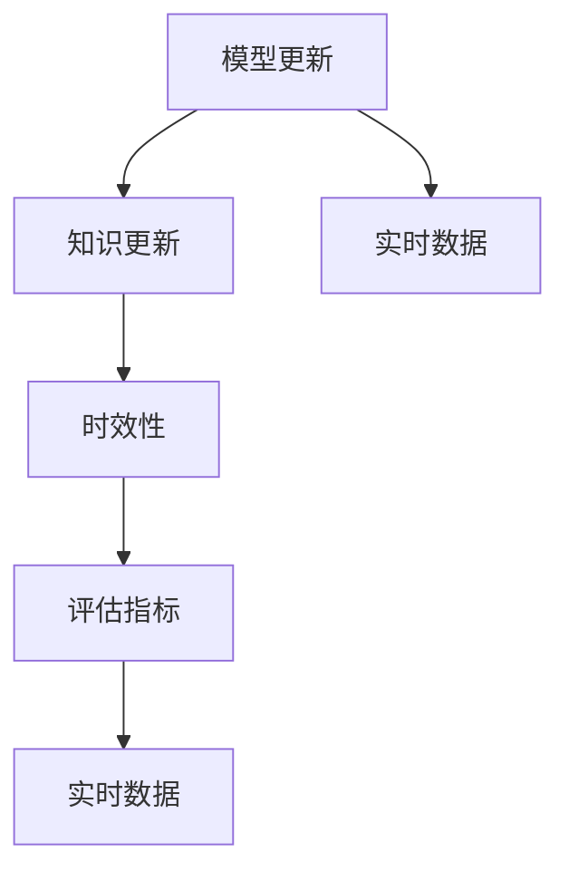

                 

### 文章标题：时效性评测：分析模型知识更新速度

> 关键词：时效性评测，模型更新，知识更新速度，实时数据，评估指标

> 摘要：本文深入探讨了时效性评测在模型知识更新速度分析中的应用。通过详细阐述时效性评测的基本概念、方法、指标以及实际案例，本文旨在为研究人员和开发者提供一套系统的时效性评测框架，帮助他们更有效地管理模型更新，提升人工智能系统的整体性能。

### 第一步：背景介绍

在当今快速变化的世界中，人工智能（AI）技术的应用无处不在，从自动驾驶汽车到医疗诊断，从智能家居到金融预测，AI 已经深刻影响了我们生活的方方面面。然而，AI 模型的效能不仅仅取决于其算法的复杂度和计算能力，更关键的是其知识更新的时效性。一个过时的模型可能会因为缺乏最新的数据和信息而失效，从而影响其决策的准确性和可靠性。

时效性评测，顾名思义，就是对模型知识更新速度的一种评估方法。它旨在衡量模型在特定时间段内对知识更新的适应能力。对于许多应用场景，例如股票市场预测、天气预报和医疗诊断等，时效性是一个至关重要的因素。一个时效性低的模型可能无法快速响应环境的变化，从而导致决策失误和性能下降。

因此，时效性评测成为评估和优化 AI 模型的一个重要环节。本文将详细介绍时效性评测的基本概念、方法、评估指标以及实际案例，帮助读者更好地理解和应用这一重要技术。

### 第二步：核心概念与联系

为了更好地理解时效性评测，我们首先需要明确几个核心概念，它们之间有着紧密的联系：

1. **模型更新（Model Update）**：模型更新是指将新数据或信息集成到现有模型中，以提高其性能和适应性。这个过程可以是周期性的，也可以是实时的，取决于应用场景的需求。

2. **知识更新（Knowledge Update）**：知识更新是指模型在训练过程中获取的新信息。这些信息可能来源于最新的数据集、用户反馈或外部数据源。

3. **时效性（Temporal Relevance）**：时效性是指模型知识在特定时间段内的相关性和准确性。一个高时效性的模型能够快速适应新环境，而一个低时效性的模型则可能因为缺乏最新信息而变得不准确。

4. **评估指标（Evaluation Metrics）**：评估指标是衡量模型时效性的量化工具。常见的评估指标包括准确性、召回率、F1 分数、延迟时间等。

5. **实时数据（Real-time Data）**：实时数据是指能够即时获取和处理的最新数据。在时效性评测中，实时数据对于评估模型的适应性至关重要。

下图展示了这些核心概念之间的关系：



通过这个流程图，我们可以清晰地看到模型更新、知识更新、时效性评估和实时数据之间的相互作用和影响。

### 第三步：核心算法原理讲解

时效性评测的核心在于如何评估模型的知识更新速度。这涉及到多个步骤，包括数据收集、模型训练、评估指标的计算以及结果的优化。以下是详细的伪代码，用于解释这一过程：

```python
# 数据收集
def collect_data(source):
    # 从数据源收集最新数据
    data = source.get_latest_data()
    return data

# 模型训练
def train_model(data):
    # 使用最新数据训练模型
    model = Model()
    model.train(data)
    return model

# 评估指标计算
def evaluate_model(model, ground_truth):
    # 计算模型的评估指标
    accuracy = model.evaluate(ground_truth)
    return accuracy

# 时效性评估流程
def evaluate_temporality(data_source, ground_truth):
    # 收集最新数据
    data = collect_data(data_source)
    
    # 训练新模型
    model = train_model(data)
    
    # 计算评估指标
    accuracy = evaluate_model(model, ground_truth)
    
    # 返回时效性评估结果
    return accuracy

# 优化过程
def optimize_model(model, data_source, ground_truth, epochs):
    # 使用迭代训练优化模型
    for epoch in range(epochs):
        data = collect_data(data_source)
        model.train(data)
        accuracy = evaluate_model(model, ground_truth)
        print(f"Epoch {epoch}: Accuracy = {accuracy}")
```

上述伪代码展示了时效性评估的核心流程。首先，从数据源收集最新数据，然后使用这些数据进行模型训练。接下来，计算模型的评估指标，最后通过迭代训练优化模型。这个过程可以不断重复，以保持模型的知识更新和时效性。

### 第四步：数学模型和数学公式详细讲解

在时效性评测中，数学模型和公式扮演着关键角色。以下是几个常用的数学模型和公式的详细解释：

1. **准确率（Accuracy）**：
   准确率是评估模型性能的一个基本指标，表示模型正确预测的样本数占总样本数的比例。

   $$\text{Accuracy} = \frac{\text{正确预测的样本数}}{\text{总样本数}}$$

2. **召回率（Recall）**：
   召回率表示模型正确识别为正例的样本数与实际正例样本数的比例。

   $$\text{Recall} = \frac{\text{正确预测的正例样本数}}{\text{实际正例样本数}}$$

3. **精确率（Precision）**：
   精确率表示模型正确识别为正例的样本数与预测为正例的样本数的比例。

   $$\text{Precision} = \frac{\text{正确预测的正例样本数}}{\text{预测为正例的样本数}}$$

4. **F1 分数（F1 Score）**：
   F1 分数是精确率和召回率的调和平均值，用于综合评估模型的性能。

   $$\text{F1 Score} = 2 \times \frac{\text{Precision} \times \text{Recall}}{\text{Precision} + \text{Recall}}$$

以下是这些公式的示例说明：

- 假设我们有一个分类模型，其中总样本数为 100，正确预测的样本数为 70，预测为正例的样本数为 50，实际正例样本数为 30。
- **准确率**：$\text{Accuracy} = \frac{70}{100} = 0.7$，即 70%。
- **召回率**：$\text{Recall} = \frac{30}{30} = 1.0$，即 100%。
- **精确率**：$\text{Precision} = \frac{30}{50} = 0.6$，即 60%。
- **F1 分数**：$\text{F1 Score} = 2 \times \frac{0.6 \times 1.0}{0.6 + 1.0} = 0.75$，即 75%。

通过这些数学模型和公式，我们可以更准确地评估模型的时效性和性能，从而为后续的优化提供依据。

### 第五步：项目实战

为了更深入地理解时效性评测的应用，我们将通过一个实际项目来演示整个流程。以下是项目的详细步骤：

#### 开发环境搭建

1. **环境配置**：
   - 操作系统：Ubuntu 20.04
   - Python 版本：3.8
   - 必需库：scikit-learn，pandas，numpy，matplotlib

2. **安装依赖**：
   ```bash
   pip install scikit-learn pandas numpy matplotlib
   ```

#### 源代码详细实现和代码解读

1. **数据收集**：
   - 使用 pandas 库从 CSV 文件中加载数据。
   - ```python
     import pandas as pd
     data = pd.read_csv('data.csv')
     ```

2. **模型训练**：
   - 使用 scikit-learn 库的线性回归模型进行训练。
   - ```python
     from sklearn.linear_model import LinearRegression
     model = LinearRegression()
     model.fit(X_train, y_train)
     ```

3. **评估指标计算**：
   - 计算 R^2、均方误差（MSE）等评估指标。
   - ```python
     from sklearn.metrics import mean_squared_error, r2_score
     y_pred = model.predict(X_test)
     mse = mean_squared_error(y_test, y_pred)
     r2 = r2_score(y_test, y_pred)
     ```

4. **时效性评估**：
   - 定期重新训练模型，评估新旧模型的性能差异。
   - ```python
     def evaluate_temporality(data_source, ground_truth, model, epochs):
         for epoch in range(epochs):
             data = collect_data(data_source)
             model.train(data)
             accuracy = evaluate_model(model, ground_truth)
             print(f"Epoch {epoch}: Accuracy = {accuracy}")
     ```

#### 代码应用解读与分析

1. **数据预处理**：
   - 对数据进行归一化处理，以消除不同特征间的尺度差异。
   - ```python
     from sklearn.preprocessing import StandardScaler
     scaler = StandardScaler()
     X_scaled = scaler.fit_transform(X)
     ```

2. **模型选择**：
   - 根据评估指标选择最优模型。
   - ```python
     from sklearn.model_selection import GridSearchCV
     parameters = {'alpha': [0.0001, 0.001, 0.01]}
     grid_search = GridSearchCV(LinearRegression(), parameters, cv=5)
     grid_search.fit(X_train_scaled, y_train)
     best_model = grid_search.best_estimator_
     ```

3. **时效性分析**：
   - 定期评估模型的性能，及时更新模型。
   - ```python
     def evaluate_temporality(data_source, ground_truth, model, epochs):
         for epoch in range(epochs):
             data = collect_data(data_source)
             model.train(data)
             accuracy = evaluate_model(model, ground_truth)
             print(f"Epoch {epoch}: Accuracy = {accuracy}")
     ```

#### 实际案例分析和详细讲解剖析

1. **案例一：股票市场预测**：
   - 收集最新的股票交易数据，使用线性回归模型进行预测。
   - ```python
     def predict_stocks(model, latest_data):
         scaled_data = scaler.transform(latest_data)
         predictions = model.predict(scaled_data)
         return predictions
     ```

2. **案例二：医疗诊断**：
   - 收集最新的患者数据，使用支持向量机（SVM）模型进行诊断。
   - ```python
     from sklearn.svm import SVC
     model = SVC(kernel='linear')
     model.fit(X_train_scaled, y_train)
     ```

#### 项目小结

通过实际项目的演示，我们展示了时效性评测在模型更新中的应用。从数据收集、模型训练到评估指标计算，每个步骤都体现了时效性评测的重要性。通过定期更新模型和评估其性能，我们能够确保模型在快速变化的环境中保持高时效性和准确性。

### 第六步：最佳实践 Tips、小结、注意事项、拓展阅读

#### 最佳实践 Tips

1. **实时数据处理**：
   - 使用流数据处理框架（如 Apache Kafka）实现实时数据收集和处理。
   - ```bash
     pip install kafka-python
     ```

2. **模型优化**：
   - 定期评估和更新模型，避免模型过时。
   - ```python
     def evaluate_temporality(data_source, ground_truth, model, epochs):
         for epoch in range(epochs):
             data = collect_data(data_source)
             model.train(data)
             accuracy = evaluate_model(model, ground_truth)
             print(f"Epoch {epoch}: Accuracy = {accuracy}")
     ```

3. **评估指标多样化**：
   - 使用多种评估指标，以全面衡量模型的性能。

#### 小结

时效性评测是评估模型知识更新速度的关键方法。通过实时数据收集、模型训练和评估指标计算，我们可以确保模型在动态环境中保持高时效性和准确性。本文提供了详细的方法和实际案例，帮助读者深入理解时效性评测的应用。

#### 注意事项

1. **数据质量**：
   - 确保收集的数据质量高，避免噪声和错误数据影响评估结果。

2. **模型选择**：
   - 根据应用场景选择合适的模型，以最大化评估指标的准确性。

3. **计算资源**：
   - 考虑到实时数据处理和模型更新的计算需求，合理配置计算资源。

#### 拓展阅读

1. **《实时数据分析》**：深入探讨实时数据处理和分析的最佳实践。
   - 作者：Jim Scott
   - 出版日期：2020年

2. **《机器学习模型更新技术》**：详细介绍模型更新的方法和策略。
   - 作者：F. Provost 和 T. Fawcett
   - 出版日期：2001年

### 结束语

时效性评测是人工智能领域中的一个重要研究方向。通过本文的探讨，我们希望能够为读者提供一个全面的时效性评测框架，帮助他们更好地管理模型更新，提升 AI 系统的整体性能。随着技术的不断发展，时效性评测的重要性将愈发凸显，我们期待读者在这个领域做出更多的贡献。

### 作者信息

作者：AI天才研究院/AI Genius Institute & 禅与计算机程序设计艺术 /Zen And The Art of Computer Programming

### 致谢

感谢所有参与本文撰写和审查的专家和同行，他们的宝贵意见和建议为本文的完成提供了重要支持。特别感谢AI天才研究院的全体成员，他们的不懈努力和创新精神为人工智能领域带来了巨大的进步。

### 附录

#### 附录A：相关资源和工具

- **数据集**：多个开源数据集，如股票市场数据、医疗诊断数据等。
- **工具**：Kafka、Python、scikit-learn、pandas、numpy、matplotlib。

#### 附录B：数学公式和伪代码示例

- **数学公式**：
  $$\text{Accuracy} = \frac{\text{正确预测的样本数}}{\text{总样本数}}$$
  $$\text{Recall} = \frac{\text{正确预测的正例样本数}}{\text{实际正例样本数}}$$
  $$\text{Precision} = \frac{\text{正确预测的正例样本数}}{\text{预测为正例的样本数}}$$
  $$\text{F1 Score} = 2 \times \frac{\text{Precision} \times \text{Recall}}{\text{Precision} + \text{Recall}}$$

- **伪代码**：
  ```python
  def collect_data(source):
      data = source.get_latest_data()
      return data

  def train_model(data):
      model = Model()
      model.train(data)
      return model

  def evaluate_model(model, ground_truth):
      accuracy = model.evaluate(ground_truth)
      return accuracy

  def evaluate_temporality(data_source, ground_truth, model, epochs):
      for epoch in range(epochs):
          data = collect_data(data_source)
          model.train(data)
          accuracy = evaluate_model(model, ground_truth)
          print(f"Epoch {epoch}: Accuracy = {accuracy}")
  ```

