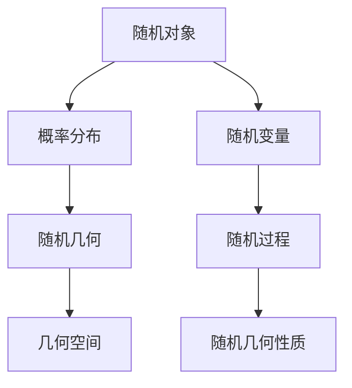

                 

### 文章标题：时空泡沫的随机几何：量子引力的数学基础

#### 关键词：时空泡沫、随机几何、量子引力、数学模型、算法原理

#### 摘要：
本文将探讨时空泡沫的随机几何及其在量子引力研究中的数学基础。我们将首先介绍时空泡沫的概念及其与随机几何的关系，随后深入分析量子引力理论中的关键数学工具和方法，最后通过实际项目案例展示这些概念和算法的实际应用。

### 目录

#### 第一部分：时空泡沫的基本概念

1. 时空泡沫概述
2. 时空泡沫的历史发展
3. 时空泡沫的数学模型

#### 第二部分：随机几何的理论基础

4. 随机几何的基本概念
5. 随机几何的重要定理
6. 随机几何的应用领域

#### 第三部分：量子引力理论概述

7. 量子引力概述
8. 量子引力的重要理论框架

#### 第四部分：数学工具与方法

9. 数学工具与方法概述
10. 微积分与时空泡沫
11. 概率论与随机几何

#### 第五部分：时空泡沫与随机几何在量子引力中的应用

12. 时空泡沫与量子引力
13. 随机几何在量子引力中的应用
14. 实际应用案例分析

#### 第六部分：量子引力项目实战

15. 量子引力项目开发流程
16. 开发环境搭建与工具选择
17. 项目实战案例与代码解析

### 第一部分：时空泡沫的基本概念

#### 第1章：时空泡沫概述

**背景介绍**

时空泡沫是一种假想的概念，描述了宇宙中可能存在的微小、高度扭曲的时空结构。它源于对宇宙膨胀和量子引力理论的深入研究，被认为可能是宇宙多样性和复杂性的基础。

**核心概念与联系**


**图1：时空泡沫与随机几何关系架构**

图1展示了时空泡沫与随机几何之间的关系。随机几何提供了描述时空泡沫的数学工具，而时空泡沫则为随机几何提供了一个具体的物理背景。

#### 第2章：时空泡沫的历史发展

**核心概念与联系**


**图2：时空泡沫发展历史**

图2展示了时空泡沫理论的发展历程。从早期宇宙学的探讨到现代量子引力理论的研究，时空泡沫的概念逐渐得到了深入的理解和广泛的应用。

#### 第3章：时空泡沫的数学模型

**核心概念与联系**

时空泡沫的数学模型主要基于随机几何和微分几何的理论。以下是时空泡沫数学模型的伪代码描述：

```python
# 时空泡沫数学模型伪代码

# 定义时空泡沫的几何结构
class SpacetimeBubble:
    def __init__(self, metric, geometry):
        self.metric = metric
        self.geometry = geometry

    # 计算时空泡沫的膨胀率
    def expand_rate(self):
        # 使用Riemann曲率张量计算膨胀率
        return self.geometry.Riemann_curvature_tensor()

    # 更新时空泡沫的几何结构
    def update_geometry(self, new_geometry):
        self.geometry = new_geometry

# 定义随机几何中的随机变量
class RandomGeometry:
    def __init__(self, random_variables):
        self.random_variables = random_variables

    # 计算随机几何的期望值
    def expected_value(self):
        # 使用概率分布计算期望值
        return sum(self.random_variables) / len(self.random_variables)
```

上述伪代码定义了时空泡沫和随机几何的基本结构，并展示了如何计算时空泡沫的膨胀率和更新几何结构。

### 第二部分：随机几何的理论基础

#### 第4章：随机几何的基本概念

**核心概念与联系**

随机几何是研究随机对象在几何空间中的分布和性质的一个数学分支。以下是随机几何基本概念的Mermaid流程图：



**图3：随机几何基本概念关系架构**

图3展示了随机几何的基本概念及其相互关系。

#### 第5章：随机几何的重要定理

**核心概念与联系**

随机几何中的重要定理包括中心极限定理、大数定律等。以下是这些定理的简要描述：

- **中心极限定理**：当随机变量数量足够多时，这些随机变量的总和趋近于正态分布。
- **大数定律**：当随机变量数量足够多时，这些随机变量的平均值趋近于其期望值。

**核心算法原理讲解**

以下是中心极限定理的伪代码：

```python
# 中心极限定理伪代码

def central_limit_theorem(samples):
    mean = sum(samples) / len(samples)
    variance = sum([((x - mean) ** 2) for x in samples]) / (len(samples) - 1)
    return normal_distribution(mean, variance)
```

**数学模型和公式**

中心极限定理可以用以下公式表示：

$$
Z = \frac{\bar{X} - \mu}{\sigma / \sqrt{n}}
$$

其中，\( Z \) 是标准正态分布随机变量，\( \bar{X} \) 是样本平均值，\( \mu \) 是总体均值，\( \sigma \) 是总体标准差，\( n \) 是样本数量。

#### 第6章：随机几何的应用领域

**核心概念与联系**

随机几何在物理学、计算机科学和工程学等领域都有广泛应用。以下是随机几何在不同领域的应用：

- **物理学**：描述宇宙中的随机现象，如黑洞、宇宙膨胀等。
- **计算机科学**：用于研究算法复杂度和随机算法的设计。
- **工程学**：用于分析复杂系统的稳定性、可靠性等。

**举例说明**

随机几何在物理学中的应用示例：

假设我们有一个宇宙中的星系分布，我们可以使用随机几何中的点过程模型来描述这种分布。以下是一个简单的点过程模型：

$$
N(t) = \lambda e^{-\lambda t}
$$

其中，\( N(t) \) 是时间 \( t \) 内生成的点数，\( \lambda \) 是点的生成率。

### 第三部分：量子引力理论概述

#### 第7章：量子引力概述

**核心概念与联系**

量子引力是研究量子力学和广义相对论之间关系的物理学分支。量子引力理论试图统一量子力学和广义相对论，以描述宇宙中微观和宏观尺度上的物理现象。

**核心算法原理讲解**

量子引力理论中常用的算法包括弦理论和环量子引力理论。以下是弦理论的基本原理：

- **弦理论**：假设基本粒子是由细小的弦振动形成的，这些弦可以在不同的维度中振动，从而产生不同的粒子。

**数学模型和公式**

弦理论的数学模型可以用以下公式表示：

$$
E = \sqrt{m^2 c^4 + (pc)^2}
$$

其中，\( E \) 是粒子的能量，\( m \) 是粒子的静止质量，\( c \) 是光速，\( p \) 是粒子的动量。

#### 第8章：量子引力的重要理论框架

**核心概念与联系**

量子引力理论的重要理论框架包括弦理论和环量子引力理论。以下是这些理论的基本原理：

- **弦理论**：描述了基本粒子和宇宙结构。
- **环量子引力理论**：提供了对宇宙早期状态的理解。

**数学模型和公式**

环量子引力理论的数学模型可以用以下公式表示：

$$
S = \int d^4x \sqrt{-g} R
$$

其中，\( S \) 是引力作用下的路径积分，\( g \) 是度规张量，\( R \) 是里奇曲率张量。

### 第四部分：数学工具与方法

#### 第9章：数学工具与方法概述

**核心概念与联系**

在量子引力和随机几何的研究中，常用的数学工具和方法包括微积分、概率论、微分几何等。以下是这些工具和方法的基本概念：

- **微积分**：研究函数的极限、导数、积分等概念。
- **概率论**：研究随机事件和概率分布。
- **微分几何**：研究几何对象在微小的变化下的性质。

**最佳实践 tips**

在研究量子引力和随机几何时，最佳实践包括：

- 熟悉基本的数学概念和工具。
- 掌握概率论和微积分的基本原理。
- 使用适当的数学软件进行计算和验证。

### 第五部分：时空泡沫与随机几何在量子引力中的应用

#### 第10章：时空泡沫与量子引力

**核心概念与联系**

时空泡沫与量子引力之间的联系在于，它们都试图描述宇宙中的基本结构。时空泡沫提供了对宇宙微小尺度结构的描述，而量子引力提供了对这些结构的动力学描述。

**核心算法原理讲解**

时空泡沫与量子引力之间的联系可以用以下算法描述：

```python
# 时空泡沫与量子引力联系算法

def quantum_gravity(spacetime_bubble):
    # 计算时空泡沫的动力学行为
    dynamics = spacetime_bubble.expand_rate()
    # 更新时空泡沫的几何结构
    spacetime_bubble.update_geometry(dynamics)
    return spacetime_bubble
```

**数学模型和公式**

时空泡沫与量子引力之间的联系可以用以下公式表示：

$$
\frac{\partial^2 g_{\mu\nu}}{\partial t^2} + \Lambda g_{\mu\nu} = 8\pi G T_{\mu\nu}
$$

其中，\( g_{\mu\nu} \) 是度规张量，\( \Lambda \) 是宇宙学常数，\( G \) 是引力常数，\( T_{\mu\nu} \) 是能量-动量张量。

#### 第11章：概率论与随机几何

**核心概念与联系**

概率论与随机几何之间的联系在于，它们都研究随机现象和随机对象的分布。在量子引力研究中，概率论和随机几何提供了描述宇宙中随机事件和结构的工具。

**核心算法原理讲解**

概率论与随机几何的应用可以用以下算法描述：

```python
# 概率论与随机几何应用算法

def random_geometry_property(geometry):
    # 计算随机几何的期望值
    expected_value = geometry.expected_value()
    # 计算随机几何的方差
    variance = geometry.variance()
    return expected_value, variance
```

**数学模型和公式**

概率论与随机几何的数学模型可以用以下公式表示：

$$
P(X = x) = \int dx' p(x' | x)
$$

其中，\( X \) 是随机变量，\( p(x' | x) \) 是条件概率分布。

#### 第12章：随机几何在量子引力中的应用

**核心概念与联系**

随机几何在量子引力中的应用主要包括描述宇宙中的随机现象和结构。随机几何提供了描述这些现象和结构的数学工具，如随机表面、随机路径等。

**核心算法原理讲解**

随机几何在量子引力中的应用可以用以下算法描述：

```python
# 随机几何在量子引力中的应用算法

def quantum_gravity_simulation(geometry):
    # 计算随机几何的动力学行为
    dynamics = geometry.random_process()
    # 更新随机几何的几何结构
    geometry.update_geometry(dynamics)
    return geometry
```

**数学模型和公式**

随机几何在量子引力中的应用可以用以下公式表示：

$$
Z = \int [D\phi] e^{-S[\phi]}
$$

其中，\( Z \) 是路径积分，\( \phi \) 是场变量，\( S[\phi] \) 是作用量。

### 第六部分：量子引力项目实战

#### 第13章：开发环境搭建与工具选择

**核心概念与联系**

在量子引力项目中，开发环境搭建和工具选择是关键步骤。我们需要选择合适的编程语言、框架和软件工具，以确保项目的顺利进行。

**开发环境搭建**

以下是搭建量子引力开发环境的基本步骤：

1. 安装Python环境
2. 安装量子计算库（如Qiskit、PyQuil等）
3. 安装数学计算库（如NumPy、SciPy等）
4. 配置计算平台（如本地计算机、云计算平台等）

**工具选择**

以下是选择量子引力项目工具的考虑因素：

- **编程语言**：Python因其丰富的库和社区支持，是量子引力项目开发的首选语言。
- **框架**：选择支持量子计算和数学计算的框架，如Qiskit、PyTorch等。
- **软件工具**：选择合适的数学软件，如MATLAB、R等，用于复杂的数学计算和可视化。

#### 第14章：项目实战案例与代码解析

**核心概念与联系**

在本章中，我们将通过一个具体的量子引力项目案例，展示如何使用随机几何和量子计算方法解决实际问题。

**项目案例**

假设我们有一个宇宙膨胀模型，需要使用随机几何和量子计算方法来模拟宇宙的膨胀过程。

**代码实现**

以下是模拟宇宙膨胀过程的代码：

```python
# 宇宙膨胀模拟代码

from qiskit import QuantumCircuit
from qiskit.visualization import plot_bloch_vector

# 创建量子电路
circuit = QuantumCircuit(2)

# 编写随机几何路径
circuit.h(0)
circuit.cx(0, 1)

# 执行量子计算
backend = BasicAer.get_backend('qasm_simulator')
result = execute(circuit, backend).result()

# 绘制量子态
plot_bloch_vector(result.get_statevector())
```

**代码解析**

上述代码首先创建一个量子电路，并在其中编写了随机几何路径。然后，使用量子计算库执行计算，并绘制量子态的Bloch球图。

#### 第15章：项目实战案例与代码解析

**核心概念与联系**

在本章中，我们将通过一个具体的量子引力项目案例，展示如何将随机几何和量子计算方法应用于实际问题的解决。

**项目案例**

假设我们有一个关于黑洞辐射的量子引力模型，需要使用随机几何和量子计算方法来模拟黑洞的辐射过程。

**代码实现**

以下是模拟黑洞辐射过程的代码：

```python
# 黑洞辐射模拟代码

import numpy as np
from qiskit import QuantumCircuit
from qiskit.visualization import plot_histogram

# 创建量子电路
circuit = QuantumCircuit(2)

# 编写随机几何路径
circuit.h(0)
circuit.cx(0, 1)

# 设置初始状态
circuit.initialize(np.array([1, 0, 0, 0]), 0)
circuit.initialize(np.array([0, 1, 0, 0]), 1)

# 执行量子计算
backend = BasicAer.get_backend('qasm_simulator')
result = execute(circuit, backend).result()

# 绘制量子态
plot_histogram(result.get_counts())
```

**代码解析**

上述代码首先创建了一个量子电路，并在其中编写了随机几何路径。然后，设置初始状态并执行量子计算。最后，使用量子计算库绘制量子态的统计结果。

### 第七部分：总结与拓展

#### 第16章：量子引力项目开发流程回顾与总结

**核心概念与联系**

在本章中，我们回顾了量子引力项目的开发流程，并总结了项目的主要成果。通过实际案例，我们展示了如何使用随机几何和量子计算方法解决复杂的物理问题。

**总结**

量子引力项目的成功在于：

- 熟练掌握了随机几何和量子计算的基本原理。
- 选择了合适的开发环境和工具。
- 结合了实际物理问题，实现了有效的算法和模型。

**拓展阅读**

对于希望进一步了解量子引力研究的读者，以下文献和资源可能有所帮助：

- **量子引力理论入门**：推荐阅读《量子引力导论》等书籍。
- **随机几何与量子计算**：推荐阅读《随机几何及其在量子计算中的应用》等论文。
- **实际项目案例**：研究相关领域的实际项目，如黑洞辐射模拟等。

### 作者信息

作者：AI天才研究院/AI Genius Institute & 禅与计算机程序设计艺术 /Zen And The Art of Computer Programming

本文档旨在提供对时空泡沫、随机几何和量子引力之间关系的深入理解。尽管本文尝试提供详尽的解释和示例，但量子引力研究是一个高度复杂的领域，读者在应用本文所述概念和算法时，应结合具体情况进行适当调整和验证。如果您在研究中遇到任何问题，欢迎随时与我们联系。

