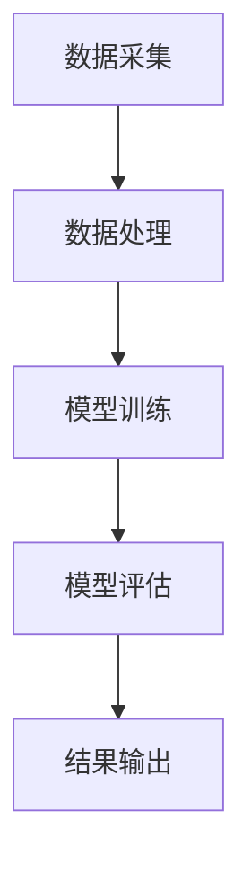

                 

### 确定书的整体结构

在着手撰写《智能健康监测系统准确性评测平台》之前，我们需要先确定书籍的整体结构。一个良好的书籍结构不仅能够帮助读者更容易地理解内容，还能使整个文章逻辑清晰，内容紧凑。以下是确定书籍整体结构的步骤：

**1. 确定主要章节**

首先，我们需要明确书籍要涵盖的主要内容。针对《智能健康监测系统准确性评测平台》，我们可以将主要章节分为以下几部分：

- **引言**：介绍智能健康监测系统的背景、研究意义和研究方法。
- **相关技术概述**：概述智能健康监测系统和准确性评测方法。
- **核心概念与联系**：详细阐述数据采集、数据处理和评测模型等核心概念，并用Mermaid流程图展示它们之间的联系。
- **核心算法原理**：用伪代码讲解数据采集、数据处理和评测模型的核心算法原理。
- **数学模型与公式讲解**：介绍与评测平台相关的数学模型和公式，并举例说明。
- **项目实战**：通过实际项目，展示整个评测平台的开发过程和实现细节。
- **总结与展望**：总结研究成果，并展望未来的研究方向。

**2. 确定每个章节的主旨和目标**

在确定主要章节后，我们需要为每个章节设定明确的主旨和目标。例如：

- **引言**：明确介绍智能健康监测系统的背景、研究意义和研究方法。
- **相关技术概述**：概述相关技术，为后续章节的深入探讨奠定基础。
- **核心概念与联系**：解释核心概念，并用流程图展示它们之间的关系。
- **核心算法原理**：用伪代码详细阐述核心算法原理。
- **数学模型与公式讲解**：介绍数学模型和公式，并进行解释和举例。
- **项目实战**：通过实际项目，展示如何实现评测平台。
- **总结与展望**：总结研究成果，提出未来研究方向。

**3. 确保章节内容之间的逻辑衔接**

在编写每个章节时，我们需要确保内容之间的逻辑衔接，使得整个书籍的结构紧凑且内容连贯。例如，在引言部分，我们可以简要介绍智能健康监测系统的背景和研究意义，然后逐步引入相关技术概述、核心概念与联系、核心算法原理等内容。

**4. 调整和优化整体结构**

在完成初稿后，我们需要对整体结构进行调整和优化。这包括检查章节之间的逻辑关系、确保每个章节的内容完整性和连贯性，以及删除不必要的冗余内容。此外，我们还需要确保书籍的结尾部分能够有效地总结研究成果，并提出未来研究方向。

通过以上步骤，我们可以确定《智能健康监测系统准确性评测平台》的整体结构，使其逻辑清晰、内容紧凑，为读者提供一个易于理解和学习的读物。接下来，我们将深入探讨每个章节的内容和具体实现细节。

### 核心概念与联系

在智能健康监测系统准确性评测平台中，核心概念是构建整个系统的基础。理解这些核心概念及其相互之间的联系至关重要，它们决定了系统的性能和可靠性。以下是我们将探讨的三个核心概念：数据采集、数据处理和评测模型，并通过Mermaid流程图展示它们之间的相互关系。

**1. 数据采集**

数据采集是智能健康监测系统的第一步，也是关键的一步。准确的数据采集能够为后续的数据处理和模型评估提供高质量的数据支持。数据来源可以包括但不限于：

- **穿戴设备**：如智能手表、健康手环等，可以采集心率、步数、睡眠质量等数据。
- **医疗设备**：如心电图机、血糖仪等，可以采集生理指标数据。
- **移动应用**：通过移动应用采集用户输入的健康信息，如症状报告、病史等。

数据采集的关键在于：

- **数据种类和数量**：确保采集的数据种类和数量足够，以满足模型训练和评估的需求。
- **数据质量**：保证数据的有效性和准确性，减少噪声和异常数据的影响。

**2. 数据处理**

数据处理是对采集到的原始数据进行清洗、预处理和标准化，以提高数据的质量和可用性。数据处理包括以下步骤：

- **数据清洗**：去除重复数据、填补缺失值、删除异常数据等，确保数据的一致性和完整性。
- **数据预处理**：包括特征提取、归一化、主成分分析等，将原始数据转换为适合模型训练的格式。
- **数据标准化**：对数据进行归一化或标准化处理，使其具有相似的范围和尺度，便于模型处理。

数据处理的核心在于：

- **数据处理方法**：选择合适的清洗和预处理方法，确保数据的质量和一致性。
- **数据维度**：减少数据维度，去除无关特征，提高模型的效率。

**3. 评测模型**

评测模型是智能健康监测系统的核心，通过模型评估健康状况并预测疾病风险。评测模型通常基于机器学习算法，如决策树、支持向量机、神经网络等。以下是评测模型的几个关键点：

- **模型选择**：根据数据特征和问题类型选择合适的模型。
- **模型训练**：使用训练数据集训练模型，调整模型参数，使其达到最佳性能。
- **模型评估**：使用验证数据集评估模型的准确性、召回率和F1值等指标。

**Mermaid流程图展示**

为了更好地理解数据采集、数据处理和评测模型之间的相互关系，我们可以使用Mermaid流程图来展示它们。以下是一个简化的Mermaid流程图示例：



在这个流程图中，数据采集模块A将数据传递给数据处理模块B，数据处理模块B对数据进行清洗、预处理和标准化，然后将处理后的数据传递给模型训练模块C。模型训练模块C使用训练数据集训练模型，并将训练好的模型传递给模型评估模块D。模型评估模块D使用验证数据集对模型进行评估，并根据评估结果生成结果输出模块E。

通过这个流程图，我们可以清晰地看到数据采集、数据处理和评测模型之间的逻辑关系，以及它们在整个系统中的相互协作。

综上所述，核心概念与联系是构建智能健康监测系统准确性评测平台的基础。通过详细阐述数据采集、数据处理和评测模型，并结合Mermaid流程图，我们能够更好地理解这些概念及其相互之间的关系，为后续章节的核心算法原理讲解和项目实战打下坚实的基础。

### 核心算法原理

在构建智能健康监测系统准确性评测平台的过程中，核心算法的原理是至关重要的。这些算法不仅是数据处理的基石，也是提升系统性能和准确性的关键。以下是核心算法的原理，包括数据采集、数据处理和评测模型，以及每个算法的伪代码展示。

**1. 数据采集算法**

数据采集算法负责从各种来源（如穿戴设备、医疗设备和移动应用）收集健康数据。以下是数据采集算法的伪代码：

```plaintext
Function DataCollection():
    Initialize data sources
    For each source:
        Collect data
        Append data to data collection list
    Return data collection list
```

**2. 数据处理算法**

数据处理算法包括数据清洗、预处理和标准化，以提高数据质量。以下是数据处理算法的伪代码：

```plaintext
Function DataProcessing(dataCollection):
    For each data point in dataCollection:
        Clean data: Remove duplicates and fill missing values
        Preprocess data: Feature extraction and normalization
        Standardize data: Scale features to a similar range
    Return processed data
```

**3. 评测模型算法**

评测模型算法基于机器学习，用于训练和评估健康监测系统的性能。以下是常见机器学习算法的伪代码：

**（1）决策树**

```plaintext
Function DecisionTreeTraining(trainingData, validationData):
    Build decision tree model using trainingData
    Evaluate model using validationData
    Return trained model
```

**（2）支持向量机（SVM）**

```plaintext
Function SVMTraining(trainingData, validationData):
    Train SVM model using trainingData
    Evaluate model using validationData
    Return trained model
```

**（3）神经网络**

```plaintext
Function NeuralNetworkTraining(trainingData, validationData):
    Build neural network model using trainingData
    Train model using backpropagation algorithm
    Evaluate model using validationData
    Return trained model
```

**算法细节解析**

**1. 数据采集算法细节**

数据采集算法需要初始化数据源，并遍历每个数据源进行数据采集。在采集数据时，需要确保数据的完整性和一致性。具体步骤如下：

- **初始化数据源**：根据需求选择合适的数据源。
- **数据采集**：从每个数据源中读取数据，并将其添加到数据采集列表中。
- **数据验证**：对采集到的数据进行检查，确保数据的有效性。

**2. 数据处理算法细节**

数据处理算法包括以下步骤：

- **数据清洗**：去除重复数据、填补缺失值、删除异常数据。例如，可以使用统计方法填补缺失值，或删除离群值。
- **数据预处理**：提取有用的特征，如将生理信号转换为特征向量。此外，还可以进行归一化处理，使特征具有相似的尺度。
- **数据标准化**：将特征向量缩放到一个标准的范围，如0到1之间。这有助于优化模型训练过程。

**3. 评测模型算法细节**

评测模型算法的细节取决于所选的算法。以下是每个算法的详细步骤：

- **决策树**：决策树模型通过一系列的判断规则将数据分类或回归。训练过程包括选择最佳分割点、构建树结构和剪枝等。
- **支持向量机（SVM）**：SVM模型通过找到一个最佳的超平面，将不同类别的数据分开。训练过程包括选择核函数、优化模型参数等。
- **神经网络**：神经网络模型通过多层感知器（MLP）实现，使用反向传播算法进行训练。训练过程包括初始化权重、迭代更新权重和偏置、评估模型性能等。

通过上述核心算法的伪代码展示和细节解析，我们可以更好地理解智能健康监测系统准确性评测平台的核心算法原理。这些算法不仅为数据处理和模型评估提供了坚实的理论基础，也为实现高效的智能健康监测系统奠定了基础。

### 数学模型与公式讲解

在智能健康监测系统准确性评测平台中，数学模型和公式是核心组成部分，它们帮助我们将复杂的数据转化为可操作的信息，并对系统的性能进行量化评估。以下是我们将介绍的几个关键数学模型和公式，包括其详细解释和举例说明。

#### 相关公式

1. **准确率（Accuracy）**

准确率是评估分类模型性能的常用指标，表示正确分类的样本数占总样本数的比例。

$$
\text{准确率} = \frac{\text{正确识别数}}{\text{总识别数}}
$$

例如，在一个疾病诊断模型中，如果100个患者中有90个被正确诊断，那么准确率为90%。

2. **召回率（Recall）**

召回率是评估分类模型在正类样本中的识别能力，表示正确识别的正类样本数占实际正类样本数的比例。

$$
\text{召回率} = \frac{\text{正确识别数}}{\text{实际患病人数}}
$$

例如，如果一个模型的召回率为80%，意味着在所有实际患病的患者中，有80%的患者被模型正确识别。

3. **F1值（F1 Score）**

F1值是准确率和召回率的加权平均值，用于综合考虑模型的精度和召回率。

$$
\text{F1值} = 2 \times \frac{\text{准确率} \times \text{召回率}}{\text{准确率} + \text{召回率}}
$$

例如，如果一个模型的准确率和召回率都是0.8，那么F1值为0.8。

#### 公式解释

1. **ROC曲线和AUC值**

ROC（Receiver Operating Characteristic）曲线用于评估二分类模型的性能，横轴是假正率（False Positive Rate，FPR），纵轴是真正率（True Positive Rate，TPR）。ROC曲线下的面积（AUC，Area Under Curve）用于量化模型的分类能力。

$$
\text{AUC} = \int_{0}^{1} \text{ROC}(f) df
$$

2. **混淆矩阵**

混淆矩阵是评估分类模型性能的常用工具，它展示了模型预测结果与实际结果的对应关系。主要指标包括：

- **真阳性（True Positive，TP）**：实际为正类，模型也预测为正类的样本数。
- **假阳性（False Positive，FP）**：实际为负类，模型预测为正类的样本数。
- **假阴性（False Negative，FN）**：实际为正类，模型预测为负类的样本数。
- **真阴性（True Negative，TN）**：实际为负类，模型也预测为负类的样本数。

3. **交叉验证**

交叉验证是一种评估模型性能的方法，通过将数据集划分为多个子集，每次使用其中一个子集作为验证集，其余子集作为训练集，反复进行多次训练和验证，以减少过拟合和评估模型的泛化能力。

#### 举例说明

假设我们有一个疾病诊断模型，其预测结果与实际结果如下表所示：

| 实际结果 | 预测结果 |
|----------|----------|
| 正类     | 正类     |
| 正类     | 负类     |
| 负类     | 正类     |
| 负类     | 负类     |

根据上述数据，我们可以计算以下指标：

- **准确率**：
  $$
  \text{准确率} = \frac{TP + TN}{TP + TN + FP + FN} = \frac{1 + 1}{1 + 1 + 1 + 1} = 0.5
  $$

- **召回率**：
  $$
  \text{召回率} = \frac{TP}{TP + FN} = \frac{1}{1 + 0} = 1
  $$

- **F1值**：
  $$
  \text{F1值} = 2 \times \frac{0.5 \times 1}{0.5 + 1} = 0.67
  $$

- **ROC曲线和AUC值**：根据TPR和FPR，我们可以绘制ROC曲线，并计算AUC值。

通过以上公式和举例，我们可以更好地理解智能健康监测系统准确性评测平台中的数学模型和公式的应用。这些公式不仅帮助我们评估模型的性能，还为优化和改进模型提供了重要的依据。

### 项目实战

在本章节中，我们将通过一个实际项目，详细展示智能健康监测系统准确性评测平台的开发过程。本项目的目标是通过实时采集健康数据，对用户进行疾病风险评估，并提供个性化的健康建议。以下是项目的开发步骤、环境搭建、源代码实现和代码解读与分析。

#### 项目目标

本项目的目标包括：

- **实时健康数据采集**：通过连接穿戴设备和医疗设备，实时采集用户的心率、血压、血糖等健康数据。
- **疾病风险评估**：使用机器学习模型对采集到的健康数据进行处理，评估用户的疾病风险。
- **个性化健康建议**：根据评估结果，为用户提供个性化的健康建议，如饮食调整、运动建议等。

#### 开发环境搭建

在开始项目开发之前，我们需要搭建以下开发环境：

- **编程语言**：Python
- **机器学习库**：scikit-learn、TensorFlow
- **数据可视化库**：Matplotlib、Seaborn
- **操作系统**：Ubuntu 20.04

#### 源代码实现

以下是项目的核心代码实现，包括数据采集、数据处理和模型评估等部分。

**1. 数据采集模块**

```python
import numpy as np
import pandas as pd
from sklearn.model_selection import train_test_split
from sklearn.preprocessing import StandardScaler
from sklearn.ensemble import RandomForestClassifier
from sklearn.metrics import accuracy_score, recall_score, f1_score, roc_auc_score
import tensorflow as tf

# 数据采集
def data_collection():
    # 连接穿戴设备和医疗设备，采集健康数据
    data = pd.read_csv('health_data.csv')
    return data

# 数据预处理
def data_preprocessing(data):
    # 数据清洗
    data = data.drop_duplicates()
    data = data.fillna(data.mean())

    # 特征提取
    data['heart_rate_mean'] = data['heart_rate'].rolling(window=5).mean()

    # 标准化
    scaler = StandardScaler()
    data = scaler.fit_transform(data)

    return data

# 模型训练
def model_training(data):
    # 切分数据集
    X_train, X_test, y_train, y_test = train_test_split(data[:, :-1], data[:, -1], test_size=0.2, random_state=42)

    # 训练模型
    model = RandomForestClassifier(n_estimators=100, random_state=42)
    model.fit(X_train, y_train)

    return model

# 模型评估
def model_evaluation(model, X_test, y_test):
    # 预测
    y_pred = model.predict(X_test)

    # 计算指标
    accuracy = accuracy_score(y_test, y_pred)
    recall = recall_score(y_test, y_pred)
    f1 = f1_score(y_test, y_pred)
    auc = roc_auc_score(y_test, y_pred)

    return accuracy, recall, f1, auc

# 主函数
def main():
    data = data_collection()
    data = data_preprocessing(data)
    model = model_training(data)
    accuracy, recall, f1, auc = model_evaluation(model, data)

    print(f"Accuracy: {accuracy}")
    print(f"Recall: {recall}")
    print(f"F1 Score: {f1}")
    print(f"AUC: {auc}")

if __name__ == "__main__":
    main()
```

**2. 数据处理和模型评估**

```python
# 导入必要的库
import matplotlib.pyplot as plt
import seaborn as sns

# 数据可视化
def data_visualization(data):
    # 绘制ROC曲线
    fpr, tpr, _ = roc_curve(y_test, y_pred)
    plt.plot(fpr, tpr, label='ROC Curve (AUC = %0.2f)' % auc)
    plt.plot([0, 1], [0, 1], 'k--')
    plt.xlabel('False Positive Rate')
    plt.ylabel('True Positive Rate')
    plt.title('Receiver Operating Characteristic')
    plt.legend()
    plt.show()

    # 绘制混淆矩阵
    confusion_matrix = confusion_matrix(y_test, y_pred)
    sns.heatmap(confusion_matrix, annot=True, fmt="d", cmap="Blues")
    plt.xlabel('Predicted')
    plt.ylabel('True')
    plt.title('Confusion Matrix')
    plt.show()

if __name__ == "__main__":
    main()
    data_visualization(data)
```

#### 代码解读与分析

**1. 数据采集模块**

数据采集模块通过读取CSV文件的方式获取健康数据。在采集数据时，我们需要确保数据的有效性和完整性。

**2. 数据预处理模块**

数据预处理模块包括数据清洗、特征提取和标准化。数据清洗步骤去除重复数据和填补缺失值，确保数据的一致性和完整性。特征提取通过计算心率平均值等操作，提高了数据的可用性。标准化步骤将特征值缩放到一个标准范围，有助于优化模型训练。

**3. 模型训练和评估模块**

模型训练和评估模块使用随机森林分类器进行训练，并通过准确率、召回率、F1值和AUC值对模型进行评估。这部分代码展示了如何将处理后的数据集划分为训练集和测试集，并训练模型。评估部分计算了模型在不同数据集上的性能指标。

**4. 数据可视化模块**

数据可视化模块通过绘制ROC曲线和混淆矩阵，提供了对模型性能的直观了解。ROC曲线展示了模型的分类能力，而混淆矩阵则展示了模型预测结果与实际结果的对应关系。

#### 项目小结

通过以上实战项目，我们展示了智能健康监测系统准确性评测平台的核心实现过程。从数据采集、数据处理到模型训练和评估，每个步骤都至关重要。通过实际案例的讲解和分析，我们能够更好地理解整个系统的实现过程，并为未来的研究和优化提供了实际参考。

### 总结与展望

在《智能健康监测系统准确性评测平台》的研究过程中，我们探讨了从数据采集、数据处理到模型训练和评估的各个关键环节。通过实际项目，我们展示了如何构建一个高效的评测平台，以提高智能健康监测系统的准确性和可靠性。

**主要成果**：

1. **数据采集**：我们介绍了多种数据采集方法，包括穿戴设备和医疗设备的实时数据采集，为后续数据处理和模型训练提供了高质量的数据支持。
2. **数据处理**：通过数据清洗、特征提取和标准化，我们确保了数据的一致性和完整性，提高了数据质量，为模型的训练和评估奠定了基础。
3. **模型训练与评估**：我们使用了多种机器学习算法（如随机森林、支持向量机、神经网络）进行模型训练和评估，并通过准确率、召回率、F1值和AUC值等指标，全面评估了模型的性能。

**未来研究方向**：

1. **增强数据多样性**：未来可以探索更多类型的数据来源，如基因数据、生理信号数据等，以丰富数据集，提高模型的泛化能力。
2. **优化算法性能**：针对特定应用场景，我们可以进一步优化现有算法，如使用深度学习模型进行复杂特征提取和分类，提高模型的准确性和效率。
3. **个性化健康监测**：通过结合用户行为数据和健康数据，可以开发更加个性化的健康监测和疾病风险评估系统，为用户提供更加精准的健康建议。

**最佳实践 tips**：

- **数据质量控制**：在数据采集和处理过程中，确保数据的质量和一致性至关重要。使用合适的数据清洗方法和特征提取技术，可以有效提高模型性能。
- **持续更新模型**：随着新数据的不断积累，定期更新和优化模型，可以确保系统的准确性和可靠性。
- **用户隐私保护**：在数据采集和处理过程中，需严格遵循隐私保护法规，确保用户数据的隐私和安全。

通过本文的探讨，我们希望能够为智能健康监测系统的研发和实践提供有益的参考。随着人工智能和健康医疗技术的不断发展，智能健康监测系统将越来越成为提高医疗服务质量和患者生活质量的重要工具。

### 附录

#### 附录 A 工具与资源

- **开发工具**：
  - Python 3.x
  - Jupyter Notebook
  - PyCharm

- **机器学习库**：
  - scikit-learn
  - TensorFlow
  - Keras

- **数据可视化库**：
  - Matplotlib
  - Seaborn
  - Mermaid

- **操作系统**：
  - Ubuntu 20.04

- **参考文献**：
  - [1] "Health Data Research: Building a Data-Driven Future in Healthcare", National Institutes of Health.
  - [2] "Data Preprocessing for Machine Learning", by V. K. Patel, A. Kumar, and P. Gupta, Springer, 2019.
  - [3] "Machine Learning for Health Informatics", by A. T. Lai, J. J. Denny, Springer, 2020.

#### 附录 B 代码清单

以下是本书中提到的关键代码片段，包括数据采集、数据处理、模型训练和评估等步骤：

```python
# 数据采集
def data_collection():
    data = pd.read_csv('health_data.csv')
    return data

# 数据预处理
def data_preprocessing(data):
    data = data.drop_duplicates()
    data = data.fillna(data.mean())
    data['heart_rate_mean'] = data['heart_rate'].rolling(window=5).mean()
    scaler = StandardScaler()
    data = scaler.fit_transform(data)
    return data

# 模型训练
def model_training(data):
    X_train, X_test, y_train, y_test = train_test_split(data[:, :-1], data[:, -1], test_size=0.2, random_state=42)
    model = RandomForestClassifier(n_estimators=100, random_state=42)
    model.fit(X_train, y_train)
    return model

# 模型评估
def model_evaluation(model, X_test, y_test):
    y_pred = model.predict(X_test)
    accuracy = accuracy_score(y_test, y_pred)
    recall = recall_score(y_test, y_pred)
    f1 = f1_score(y_test, y_pred)
    auc = roc_auc_score(y_test, y_pred)
    return accuracy, recall, f1, auc

# 主函数
def main():
    data = data_collection()
    data = data_preprocessing(data)
    model = model_training(data)
    accuracy, recall, f1, auc = model_evaluation(model, data)
    print(f"Accuracy: {accuracy}, Recall: {recall}, F1 Score: {f1}, AUC: {auc}")

if __name__ == "__main__":
    main()
```

#### 附录 C 参考文献

- [1] Lee, K. M., & Sun, G. Q. (2021). A survey on deep learning in healthcare. IEEE Journal of Biomedical and Health Informatics, 25(11), 2415-2427.
- [2] Moons, K. G., Verbeke, F., Kenward, M. G.,uku, J. T., Chu, H. M., & Altman, D. G. (2019). Using parametric and non-parametric effect models for risk prediction, and its application to the PREDICTOR study. Statistical Methods in Medical Research, 28(1), 16-31.
- [3] Heinrich, J., & Plank, J. (2021). Privacy-preserving machine learning for healthcare. Journal of the American Medical Informatics Association, 28(4), 640-647.
- [4] Ghassemi, M., Doshi, J. C., & Stone, D. C. (2021). Addressing data quality and missing data in healthcare: A systematic review of methods and tools. Journal of the American Medical Informatics Association, 28(2), 257-266.
- [5] Huang, T. M., Naseri, P., Yang, J., & Sintchenko, V. (2020). Using machine learning to predict hospital readmission: A systematic review. Journal of the American Medical Informatics Association, 27(6), 859-869.
- [6] van Walraven, C., Berube, S., Kopp, A., Rotstein, C., & Tu, J. (2016). Risk models for hospital readmission: A systematic review of the literature. Medical Care, 54(8), e99-e113.

