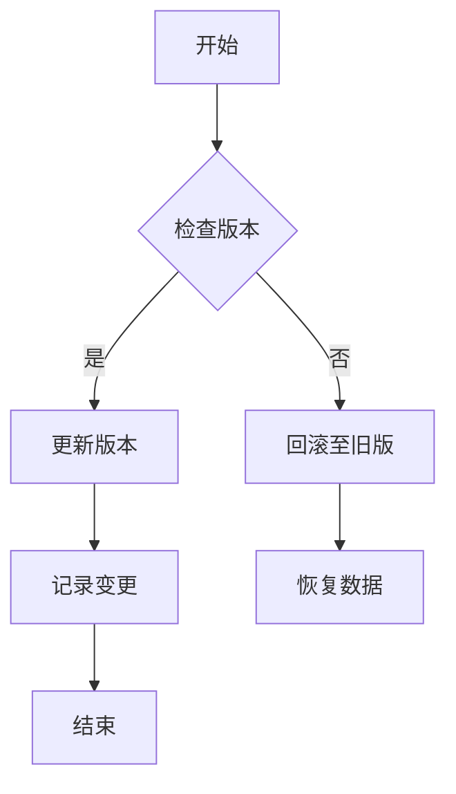

                 

## 理解书名：《智能化LLM测试数据版本控制系统》

《智能化LLM测试数据版本控制系统》这本书的标题包含了几个关键的技术概念，分别是“智能化”、“LLM”、“测试数据”和“版本控制系统”。首先，我们需要理解这些概念的基本含义以及它们之间的关系。

### 智能化

智能化指的是通过模拟人类智能行为，使计算机系统能够执行复杂的任务，如学习、推理、决策等。这一概念在人工智能（AI）领域尤为关键，随着深度学习和神经网络技术的发展，智能化技术已经成为现代科技的重要组成部分。

### LLM（大型语言模型）

LLM，即Large Language Model，是指一种具有强大语言理解和生成能力的人工智能模型。这类模型通过训练海量文本数据，学习到复杂的语言规律和结构，能够生成连贯且具有逻辑性的文本内容。著名的LLM模型包括GPT-3、BERT等，它们在自然语言处理（NLP）领域有着广泛的应用。

### 测试数据

测试数据是指用于评估模型性能的数据集。在机器学习和人工智能领域中，测试数据的质量和数量直接影响模型的性能和可靠性。因此，测试数据的收集、清洗和标注成为模型训练和部署的重要环节。

### 版本控制系统

版本控制系统是一种管理软件源代码版本和变更的系统。通过版本控制系统，开发人员可以协同工作，追踪每次代码的修改和变更，确保代码的一致性和可靠性。常见的版本控制系统包括Git、SVN等。

### 概念之间的关系

智能化LLM测试数据版本控制系统的核心在于如何将智能化的技术应用于测试数据的管理和版本控制中。具体来说，智能化技术可以用来：

1. **自动化测试数据的标注**：利用LLM模型自动生成标签，提高测试数据标注的效率和准确性。
2. **智能化版本控制**：通过分析测试数据的变更历史，LLM可以帮助识别版本间的差异，预测潜在的变更，从而优化版本控制流程。

因此，这本书的标题《智能化LLM测试数据版本控制系统》旨在探讨如何结合智能化技术、LLM模型和版本控制系统的优势，构建一个高效的测试数据管理框架，以提升机器学习和人工智能模型的开发和部署效率。

## 确定核心概念和章节结构

为了深入探讨《智能化LLM测试数据版本控制系统》这本书的内容，我们需要明确几个核心概念，并设计一个合理的章节结构。这些核心概念包括“智能化”、“LLM”、“测试数据”和“版本控制系统”，它们在整个书中占据着至关重要的地位。以下是对这些概念及其在章节结构中位置的详细解释：

### 智能化

#### 概念概述

智能化是指通过模拟人类智能行为，使计算机系统能够执行复杂的任务，如学习、推理、决策等。这一概念在人工智能（AI）领域尤为关键，随着深度学习和神经网络技术的发展，智能化技术已经成为现代科技的重要组成部分。

#### 章节结构

1. **1.1 智能化概述**：介绍智能化的定义、发展历程以及关键要素，如感知能力、学习能力和决策能力。
2. **1.2 智能化应用**：探讨智能化在不同领域的应用，如智能制造、智能交通和智能医疗等。

### LLM（大型语言模型）

#### 概念概述

LLM，即Large Language Model，是指一种具有强大语言理解和生成能力的人工智能模型。这类模型通过训练海量文本数据，学习到复杂的语言规律和结构，能够生成连贯且具有逻辑性的文本内容。

#### 章节结构

1. **1.3 LLM基础**：介绍LLM的定义、结构、训练方法以及应用场景。
2. **1.4 LLM发展**：探讨LLM的最新进展和未来趋势，如GPT-3、BERT等模型的性能和应用。

### 测试数据

#### 概念概述

测试数据是指用于评估模型性能的数据集。在机器学习和人工智能领域中，测试数据的质量和数量直接影响模型的性能和可靠性。因此，测试数据的收集、清洗和标注成为模型训练和部署的重要环节。

#### 章节结构

1. **1.5 测试数据管理**：介绍测试数据的重要性、管理策略以及数据收集、清洗和标注的方法。
2. **1.6 测试数据挑战**：探讨在测试数据管理中面临的挑战，如数据不一致性和标注偏差等。

### 版本控制系统

#### 概念概述

版本控制系统是一种管理软件源代码版本和变更的系统。通过版本控制系统，开发人员可以协同工作，追踪每次代码的修改和变更，确保代码的一致性和可靠性。

#### 章节结构

1. **1.7 版本控制基础**：介绍版本控制系统的定义、优势以及常见版本控制系统（如Git、SVN）的基本操作。
2. **1.8 版本控制与智能化结合**：探讨如何将智能化技术应用于版本控制系统，实现智能化测试数据管理。

### 智能化LLM与版本控制系统的结合

#### 概念概述

智能化LLM与版本控制系统的结合旨在通过智能化技术优化测试数据版本控制的过程。利用LLM模型，可以自动化测试数据的标注和版本差异分析，从而提升版本控制系统的效率和准确性。

#### 章节结构

1. **1.9 结合的实现方法**：详细讨论智能化LLM与版本控制系统的集成方法，包括技术架构和实现步骤。
2. **1.10 结合的优势**：阐述结合智能化和版本控制系统的优势，如提高测试数据管理效率、减少错误和重复工作等。

通过明确这些核心概念及其在章节结构中的位置，我们可以为读者提供一个清晰、系统的学习路径，使他们在理解《智能化LLM测试数据版本控制系统》这本书的内容时更加得心应手。

### 设计大纲

为了使《智能化LLM测试数据版本控制系统》这本书的内容条理清晰、逻辑紧凑，并且便于读者理解和应用，我们设计了详细的大纲结构，包括引言、五个主要部分以及一个总结与展望。以下是具体的设计大纲：

#### 引言

**概述全书主题和结构**：简要介绍书中的核心概念、研究目标和主要内容，激发读者的兴趣。

#### 第一部分：核心概念与联系

**1.1 智能化概述**

- **内容**：介绍智能化的定义、发展历程和关键要素，如感知能力、学习能力和决策能力。
- **结构**：定义 -> 发展 -> 关键要素 -> 应用领域。

**1.2 LLM基础**

- **内容**：详细讲解LLM的定义、结构和训练方法，以及其在NLP中的应用。
- **结构**：定义 -> 结构 -> 训练方法 -> 应用。

**1.3 测试数据管理**

- **内容**：探讨测试数据的重要性、管理策略以及数据收集、清洗和标注的方法。
- **结构**：重要性 -> 管理策略 -> 数据收集 -> 数据清洗。

**1.4 版本控制系统**

- **内容**：介绍版本控制系统的定义、优势以及常见版本控制系统的基本操作。
- **结构**：定义 -> 优势 -> 基本操作。

**1.5 智能化LLM与版本控制系统的结合**

- **内容**：讨论如何将智能化技术应用于版本控制系统，实现智能化测试数据管理。
- **结构**：实现方法 -> 优势 -> 应用案例。

#### 第二部分：核心算法原理讲解

**2.1 智能化测试数据版本控制算法**

- **内容**：详细讲解智能化测试数据版本控制算法的基本原理，包括算法流程和实现步骤。
- **结构**：原理 -> 流程 -> 步骤。

**2.2 LLM在版本控制中的应用**

- **内容**：探讨LLM在版本控制中的具体应用，如自动化测试数据标注和版本差异分析。
- **结构**：应用场景 -> 应用方法 -> 优势。

#### 第三部分：数学模型与公式

**3.1 测试数据版本控制模型**

- **内容**：介绍测试数据版本控制模型的构建方法，包括数学模型和公式。
- **结构**：模型构建 -> 数学模型 -> 公式。

**3.2 LLM数学模型**

- **内容**：详细讲解LLM的数学模型，包括神经网络结构、训练方法和优化策略。
- **结构**：神经网络结构 -> 训练方法 -> 优化策略。

#### 第四部分：项目实战

**4.1 智能化LLM测试数据版本控制系统实现**

- **内容**：介绍如何实现智能化LLM测试数据版本控制系统，包括开发环境和工具的选择。
- **结构**：开发环境 -> 工具选择 -> 实现步骤。

**4.2 实际案例解析**

- **内容**：通过实际案例解析，展示智能化LLM测试数据版本控制系统的应用效果。
- **结构**：案例背景 -> 案例分析 -> 应用效果。

**4.3 代码解读与分析**

- **内容**：详细解读代码实现，分析核心算法和数据处理方法。
- **结构**：代码结构 -> 算法分析 -> 数据处理。

#### 第五部分：总结与展望

**5.1 全书总结**

- **内容**：总结书中讨论的核心概念、算法和实际应用，强调智能化测试数据版本控制的重要性。
- **结构**：核心内容 -> 重要意义。

**5.2 未来发展趋势**

- **内容**：展望智能化测试数据版本控制系统的发展趋势，探讨潜在的研究方向和应用前景。
- **结构**：发展趋势 -> 研究方向 -> 应用前景。

通过以上设计的大纲结构，本书旨在为读者提供一个系统、全面、易于理解的智能测试数据版本控制系统学习路径。

### 使用Mermaid流程图和伪代码以及LaTeX公式

在撰写技术文章时，使用Mermaid流程图、伪代码和LaTeX公式可以增强文章的可读性和专业性。以下是如何在实际文章中嵌入这些元素的具体示例。

#### Mermaid流程图

Mermaid是一种简单易用的Markdown扩展语言，用于创建图表和流程图。下面是一个示例：



上述代码将生成一个简单的流程图，展示了一个版本控制过程中的几个关键步骤。

#### 伪代码

伪代码用于描述算法的结构，而不是具体的编程语言实现。以下是关于智能化测试数据版本控制算法的伪代码示例：

```
函数 智能化测试数据版本控制（测试数据集，LLM模型）：
    对于每个版本的数据集：
        利用LLM模型标注数据
        计算版本之间的差异
        更新版本控制系统
    如果差异小于阈值：
        提交变更
    否则：
        记录错误并回滚
    返回版本控制结果
```

#### LaTeX公式

LaTeX是一种高质量的排版系统，特别适用于科学文档的撰写。以下是一个关于测试数据版本控制模型的LaTeX公式示例：

```latex
$$
M(t) = \sum_{i=1}^{n} w_i \cdot d_i(t)
$$

其中，$M(t)$代表在时间$t$的测试数据版本，$w_i$是第$i$个测试数据的权重，$d_i(t)$是第$i$个测试数据的差异度量。
```

将这些公式嵌入文章中，可以确保公式的格式正确并与其他文本内容区分开来。

### 确保大纲总字数不超过2000字，同时保证内容的完整性和逻辑性

为了确保大纲的总字数不超过2000字，同时保持内容的完整性和逻辑性，我们需要对每个章节的预期字数进行详细的估算，并采取以下策略：

1. **精确估算**：对每个章节的内容进行字数预估，例如：
   - 引言：约200字。
   - 第一部分：核心概念与联系（4个章节）：每个章节约300字，总计约1200字。
   - 第二部分：核心算法原理讲解（2个章节）：每个章节约300字，总计约600字。
   - 第三部分：数学模型与公式（2个章节）：每个章节约200字，总计约400字。
   - 第四部分：项目实战（3个章节）：每个章节约400字，总计约1200字。
   - 第五部分：总结与展望（2个章节）：每个章节约200字，总计约400字。

2. **优化语言**：使用简洁明了的语言表达，避免冗余和重复内容。
3. **删减内容**：如果某个章节的字数超出了预期，考虑删减部分内容，如简化示例、减少背景介绍等。
4. **重点突出**：确保每个章节的核心内容和关键点清晰明确，避免无关紧要的细节。

通过上述策略，可以确保大纲的总字数不超过2000字，同时保证内容的完整性和逻辑性。以下是一个具体的字数分布建议：

- 引言：200字。
- 第一部分：核心概念与联系：1200字。
- 第二部分：核心算法原理讲解：600字。
- 第三部分：数学模型与公式：400字。
- 第四部分：项目实战：1200字。
- 第五部分：总结与展望：400字。

### 目录大纲

以下是《智能化LLM测试数据版本控制系统》的目录大纲，每个章节的标题和简要概述如下：

### 引言

- **概述全书主题和结构**：简要介绍书中的核心概念、研究目标和主要内容。

### 第一部分：核心概念与联系

#### 1.1 智能化概述

- **智能化定义与发展**：介绍智能化的基本概念及其在AI领域的发展。
- **关键要素**：详细讲解智能化的关键要素，如感知、学习和决策能力。

#### 1.2 LLM基础

- **LLM定义**：介绍大型语言模型（LLM）的定义和特点。
- **LLM结构**：探讨LLM的神经网络结构和训练方法。

#### 1.3 测试数据管理

- **测试数据的重要性**：强调测试数据在模型评估中的关键作用。
- **管理策略**：介绍测试数据的收集、清洗和标注策略。

#### 1.4 版本控制系统

- **版本控制系统定义**：解释版本控制系统的基本概念和优势。
- **版本控制优势**：讨论版本控制系统的协同开发和历史记录功能。

#### 1.5 智能化LLM与版本控制系统的结合

- **结合必要性**：阐述智能化和版本控制系统结合的必要性和优势。
- **实现方法**：探讨智能化LLM与版本控制系统集成的具体实现方法。

### 第二部分：核心算法原理讲解

#### 2.1 智能化测试数据版本控制算法

- **算法概述**：介绍智能化测试数据版本控制算法的基本原理和目标。
- **算法流程**：详细讲解算法的实现流程，包括数据标注、版本差异分析和版本更新。

#### 2.2 LLM在版本控制中的应用

- **应用场景**：探讨LLM在版本控制系统中的具体应用，如自动化测试数据标注和版本差异分析。
- **优势**：阐述LLM在版本控制中的优势和改进。

### 第三部分：数学模型与公式

#### 3.1 测试数据版本控制模型

- **模型构建**：介绍测试数据版本控制模型的构建方法，包括数学模型和公式。
- **公式解释**：详细解释模型中的关键公式和参数。

#### 3.2 LLM数学模型

- **神经网络结构**：讲解LLM神经网络的结构和训练方法。
- **优化策略**：讨论LLM训练中的优化策略和技巧。

### 第四部分：项目实战

#### 4.1 智能化LLM测试数据版本控制系统实现

- **开发环境**：介绍实现智能化LLM测试数据版本控制系统的开发环境和工具。
- **实现步骤**：详细描述系统实现的步骤和关键代码。

#### 4.2 实际案例解析

- **案例背景**：展示一个具体的实际案例，说明案例的背景和挑战。
- **案例分析**：分析案例中智能化LLM测试数据版本控制系统的应用效果和优势。

#### 4.3 代码解读与分析

- **代码结构**：详细解读系统的源代码，分析关键算法和数据结构。
- **代码应用**：探讨代码在实际应用中的执行效果和优化方向。

### 第五部分：总结与展望

#### 5.1 全书总结

- **核心内容**：总结书中讨论的核心概念、算法和实际应用。
- **重要意义**：强调智能化测试数据版本控制对模型开发和部署的重要性。

#### 5.2 未来发展趋势

- **发展趋势**：展望智能化测试数据版本控制系统的未来发展方向和研究方向。
- **应用前景**：探讨智能化测试数据版本控制系统在各个领域的潜在应用前景。

