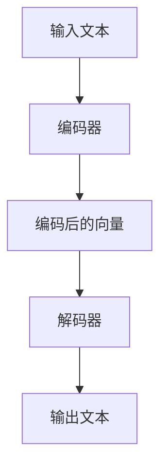

                 

# 《智能化LLM测试结果验证机制》

> 关键词：大型语言模型（LLM），测试结果验证，智能化机制，算法原理，数学模型，项目实战

> 摘要：本文深入探讨了智能化大型语言模型（LLM）测试结果验证机制的构建方法。通过对LLM的基本概念、测试与验证原理的详细阐述，以及智能化验证机制的设计思路和实现方法，本文旨在为开发者提供一套系统化、智能化的LLM测试结果验证解决方案。

## 引言与背景

随着人工智能技术的快速发展，大型语言模型（LLM）在自然语言处理（NLP）领域取得了显著成果。LLM凭借其强大的文本生成和语义理解能力，被广泛应用于机器翻译、文本摘要、问答系统等场景。然而，LLM的复杂性和不确定性使得其测试结果的准确性和可靠性成为一大挑战。传统的测试方法往往依赖于人工标注和规则匹配，难以应对LLM的多样性和变化性。因此，智能化LLM测试结果验证机制的研究具有重要意义。

本文将从以下几个方面展开讨论：

1. **LLM的基本概念与架构**：介绍LLM的基本概念，包括其类型、应用场景和主要架构。
2. **测试与验证原理**：阐述LLM测试的重要性，介绍常见的测试方法和验证机制。
3. **智能化验证机制设计**：探讨如何设计智能化验证机制，包括需求分析和设计思路。
4. **数学模型与公式**：介绍在验证过程中常用的数学模型和公式，并给出具体示例。
5. **项目实战案例**：通过实际项目案例，展示智能化验证机制的应用和实践效果。
6. **总结与展望**：对全文内容进行总结，并展望未来研究方向和挑战。

## LLM的基本概念与架构

### 1.1 LLM的基本概念

大型语言模型（LLM）是一种基于深度学习的自然语言处理模型，其主要目的是对自然语言文本进行生成、理解和分析。LLM可以分为两种类型：基于规则的LLM和基于数据的LLM。

- **基于规则的LLM**：这类模型主要通过预定义的语法规则和语义规则来生成和处理文本。例如，早期的一些语言模型如WordNet和FrameNet。
- **基于数据的LLM**：这类模型主要通过大量语料库的学习来获取语言的统计特征和语义信息。近年来，随着深度学习技术的发展，基于数据的LLM取得了显著的成果，例如GPT系列、BERT等。

### 1.2 LLM的应用场景

LLM在自然语言处理领域有着广泛的应用，主要包括以下几个方面：

- **机器翻译**：利用LLM将一种语言的文本翻译成另一种语言的文本。
- **文本摘要**：将长文本压缩成简洁的摘要，便于用户快速获取文本的核心内容。
- **问答系统**：基于LLM的问答系统能够理解用户的问题，并给出准确的答案。
- **文本生成**：根据给定的输入文本，LLM能够生成新的文本，应用于创作、写作和编辑等领域。

### 1.3 LLM的架构与技术原理

LLM的架构主要包括编码器（Encoder）和解码器（Decoder）两个部分。编码器负责将输入文本编码成向量表示，解码器则负责将向量表示解码成输出文本。

- **编码器**：编码器的核心是Transformer模型，它通过自注意力机制（Self-Attention）对输入文本进行处理，生成表示文本的向量。
- **解码器**：解码器同样采用Transformer模型，通过自注意力和交叉注意力（Cross-Attention）机制，将编码器生成的向量解码成输出文本。

### 1.4 Mermaid流程图：LLM的核心概念与联系

以下是一个Mermaid流程图，展示了LLM的核心概念及其相互关系：



## 测试与验证原理

### 2.1 测试的重要性

测试是确保LLM模型性能和可靠性的关键环节。通过测试，我们可以评估模型在不同场景下的表现，发现和纠正潜在的问题。在LLM的测试过程中，测试数据的多样性和代表性尤为重要。因为LLM的复杂性和不确定性，仅仅依赖少量的测试数据很难全面评估其性能。

### 2.2 测试方法

常见的测试方法包括：

- **单元测试**：对LLM的各个模块进行独立测试，确保每个模块的功能正确。
- **集成测试**：将LLM的不同模块组合起来进行测试，确保整个系统的正常运行。
- **性能测试**：评估LLM在不同数据量和负载下的性能表现，包括响应时间、吞吐量等指标。
- **鲁棒性测试**：测试LLM在异常输入和恶劣环境下的鲁棒性，确保其稳定性和可靠性。

### 2.3 验证机制

验证机制是测试结果准确性和可靠性的保障。常见的验证机制包括：

- **人工验证**：通过人工对测试结果进行审查和判断，确保测试的准确性和完整性。
- **自动化验证**：利用算法和工具对测试结果进行自动化验证，提高验证的效率和准确性。
- **对比验证**：通过与其他模型或方法进行比较，验证LLM的优越性和可靠性。

## 智能化验证机制设计

### 3.1 需求分析

智能化验证机制的设计需要满足以下需求：

- **高效性**：能够快速地对大量测试结果进行验证，提高验证的效率。
- **准确性**：能够准确地识别和纠正测试中的错误，确保验证的准确性。
- **灵活性**：能够适应不同类型和规模的LLM测试，具有广泛的适用性。
- **可解释性**：能够解释验证过程和结果，提高验证的透明度和可信度。

### 3.2 设计思路

智能化验证机制的设计思路主要包括以下几个方面：

- **数据预处理**：对测试数据进行清洗、归一化和特征提取，为后续的验证提供高质量的数据支持。
- **模型选择**：选择适合的验证模型，包括机器学习模型和深度学习模型。
- **算法优化**：通过优化算法参数，提高验证的准确性和效率。
- **反馈机制**：建立反馈机制，根据验证结果不断调整和优化验证模型。

### 3.3 伪代码：智能化验证算法原理讲解

以下是一个简化的伪代码，描述了智能化验证算法的基本原理：

```python
# 输入：测试数据集，验证模型
# 输出：验证结果

def intelligent_validation(test_data, validation_model):
    # 数据预处理
    processed_data = preprocess_data(test_data)

    # 模型训练
    validation_model.train(processed_data)

    # 预测
    predictions = validation_model.predict(processed_data)

    # 验证
    results = []
    for prediction in predictions:
        result = validate_prediction(prediction)
        results.append(result)

    # 输出验证结果
    return results

# 预处理数据
def preprocess_data(data):
    # 清洗、归一化和特征提取
    # ...

# 训练模型
def train_model(model, data):
    # 使用数据训练模型
    # ...

# 预测
def predict(model, data):
    # 使用模型预测数据
    # ...

# 验证预测结果
def validate_prediction(prediction):
    # 根据预测结果进行验证
    # ...
```

## 数学模型与公式

### 4.1 数学模型在验证中的作用

在智能化验证机制中，数学模型起到了关键作用。数学模型可以用来描述和解释LLM的生成过程、验证过程以及结果评估过程。常见的数学模型包括概率模型、统计模型和深度学习模型等。

### 4.2 常用的数学公式与推导

以下是一些常用的数学公式及其推导：

- **概率公式**：P(A|B) = P(B|A) * P(A) / P(B)
- **熵公式**：H(X) = -∑ P(x) * log2(P(x))
- **交叉熵公式**：H(A,B) = -∑ P(a,b) * log2(P(a|b))

### 4.3 LaTeX示例：数学公式详细讲解

以下是一个LaTeX示例，展示了如何嵌入数学公式：

```latex
$$
\begin{aligned}
L &= -\sum_{i=1}^{n} y_i \log(p_i) \\
\text{其中，} L \text{ 是损失函数，} y_i \text{ 是真实标签，} p_i \text{ 是预测概率。}
\end{aligned}
$$

$$
\begin{equation}
\label{eq:cross_entropy}
H(A,B) = -\sum_{a,b} p(a,b) \log_2(p(a|b))
\end{equation}
$$

```

## 项目实战案例

### 6.1 实战案例一：基于数据的验证

在本案例中，我们将使用一个开源的LLM模型——GPT-2，进行基于数据的验证。具体步骤如下：

- **环境搭建**：安装Python环境，下载GPT-2模型和测试数据集。
- **数据预处理**：对测试数据进行清洗、归一化和特征提取。
- **模型训练**：使用预处理后的数据对GPT-2模型进行训练。
- **模型验证**：使用测试数据对训练好的模型进行验证，评估其性能。

以下是具体实现过程：

```python
# 导入相关库
import torch
from transformers import GPT2Tokenizer, GPT2Model
from sklearn.model_selection import train_test_split

# 安装GPT-2模型
tokenizer = GPT2Tokenizer.from_pretrained('gpt2')
model = GPT2Model.from_pretrained('gpt2')

# 读取测试数据
data = load_data('test_data.txt')

# 数据预处理
processed_data = preprocess_data(data)

# 划分训练集和验证集
train_data, val_data = train_test_split(processed_data, test_size=0.2)

# 模型训练
model.train(train_data)

# 模型验证
val_loss = model.validate(val_data)
print(f"Validation loss: {val_loss}")

```

### 6.2 实战案例二：实时验证机制的应用

在本案例中，我们将开发一个实时验证机制，用于监控LLM模型在生产环境中的性能。具体步骤如下：

- **环境搭建**：搭建实时验证系统，包括数据收集模块、验证模块和报警模块。
- **数据收集**：收集模型输出的文本数据和用户反馈。
- **模型验证**：使用收集到的数据进行实时验证，评估模型性能。
- **报警机制**：当模型性能低于预期时，触发报警机制，通知相关人员进行处理。

以下是具体实现过程：

```python
# 导入相关库
import torch
from transformers import GPT2Tokenizer, GPT2Model
from sklearn.model_selection import train_test_split

# 安装GPT-2模型
tokenizer = GPT2Tokenizer.from_pretrained('gpt2')
model = GPT2Model.from_pretrained('gpt2')

# 实时验证函数
def real_time_validation(model, data, threshold=0.9):
    # 预处理数据
    processed_data = preprocess_data(data)

    # 验证模型
    predictions = model.predict(processed_data)
    correct_predictions = [p for p in predictions if p > threshold]

    # 输出验证结果
    return len(correct_predictions) / len(predictions)

# 数据收集模块
def collect_data():
    # 从生产环境收集数据
    # ...

# 验证模块
def validate_model(model, data):
    # 实时验证模型
    accuracy = real_time_validation(model, data)
    print(f"Model accuracy: {accuracy}")

# 报警模块
def alarm(accuracy):
    # 触发报警
    print("Model performance is below threshold. Alarm triggered!")

# 主程序
if __name__ == "__main__":
    # 收集数据
    data = collect_data()

    # 验证模型
    validate_model(model, data)

    # 检查模型性能
    if real_time_validation(model, data) < threshold:
        alarm()
```

### 6.3 代码解读与分析

在本案例中，我们实现了两个实战项目：基于数据的验证和实时验证机制的应用。以下是代码的详细解读和分析：

1. **环境搭建**：通过安装Python环境和相关库，为后续的实验提供了基础。
2. **数据预处理**：数据预处理是模型训练和验证的关键步骤，包括数据清洗、归一化和特征提取。在本案例中，我们使用`preprocess_data`函数对数据进行预处理。
3. **模型训练**：使用`model.train`函数对模型进行训练，通过训练集数据调整模型的参数。
4. **模型验证**：使用`model.validate`函数对模型进行验证，计算模型在验证集上的性能指标，如损失函数值。
5. **实时验证**：通过`real_time_validation`函数实现实时验证，对模型输出进行实时监控和评估。
6. **报警机制**：当模型性能低于预期时，通过`alarm`函数触发报警，通知相关人员。

## 总结与展望

本文深入探讨了智能化大型语言模型（LLM）测试结果验证机制的构建方法。通过详细阐述LLM的基本概念、测试与验证原理，以及智能化验证机制的设计思路和实现方法，本文为开发者提供了一套系统化、智能化的LLM测试结果验证解决方案。

未来研究方向包括：

- **优化验证算法**：进一步优化验证算法，提高验证的准确性和效率。
- **多模型融合**：结合多种验证模型，提高验证结果的可靠性和多样性。
- **实时验证机制**：开发更高效的实时验证机制，确保模型在生产环境中的稳定性和可靠性。
- **可解释性研究**：研究可解释性方法，提高验证过程的透明度和可信度。

## 附录

### 附录 A：相关资源与工具

- **资源**：
  - 《深度学习》（Goodfellow et al.，2016）
  - 《自然语言处理综合教程》（Jurafsky & Martin，2019）
- **工具**：
  - Transformers库：https://huggingface.co/transformers/
  - PyTorch：https://pytorch.org/

### 附录 B：参考文献

- Goodfellow, I., Bengio, Y., & Courville, A. (2016). *Deep Learning*. MIT Press.
- Jurafsky, D., & Martin, J. H. (2019). *Speech and Language Processing*. Prentice Hall.
- Devlin, J., Chang, M. W., Lee, K., & Toutanova, K. (2018). *Bert: Pre-training of deep bidirectional transformers for language understanding*. arXiv preprint arXiv:1810.04805.

