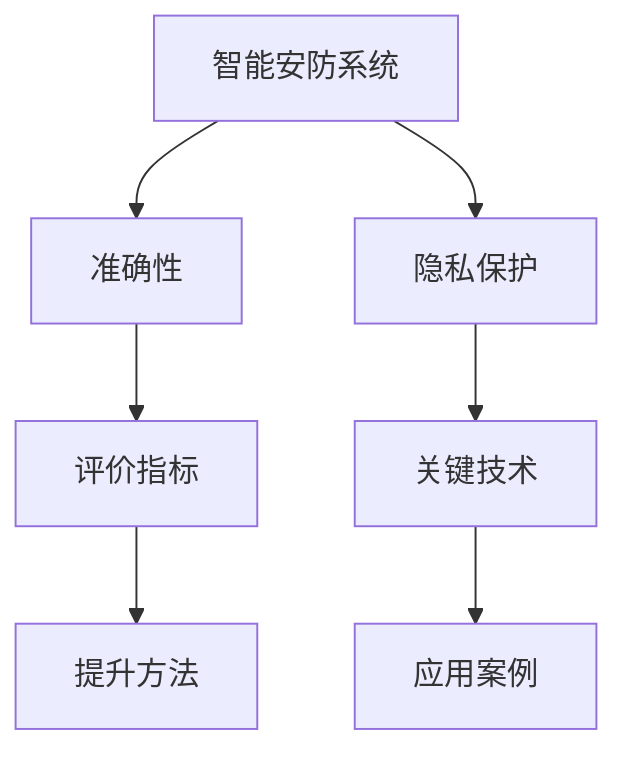

                 


### 文章标题：《智能安防系统准确性与隐私保护评测》

#### 关键词：智能安防系统、准确性、隐私保护、评测方法

> 摘要：本文将深入探讨智能安防系统的准确性与隐私保护问题，通过详细解析核心概念、算法原理、数学模型以及实际案例，为读者提供一套全面、实用的评测框架和方法。文章旨在帮助专业人士和研究者更好地理解和应用智能安防技术，同时确保系统的可靠性和用户隐私安全。

### 目录

#### 第一部分：智能安防系统基础

**第1章：智能安防系统概述**

- **1.1 智能安防系统的概念**  
- **1.2 智能安防系统的分类**  
- **1.3 智能安防系统的发展趋势**

**第2章：智能安防系统的核心组件**

- **2.1 视频监控**  
- **2.2 传感器网络**  
- **2.3 数据中心与云计算**

**第3章：智能安防系统的准确性评测**

- **3.1 准确性评价指标**  
- **3.2 实际案例评测**  
- **3.3 准确性提升方法**

#### 第二部分：隐私保护

**第4章：隐私保护的基本原理**

- **4.1 隐私保护的背景**  
- **4.2 隐私保护的关键技术**  
- **4.3 隐私保护的法律法规**

**第5章：隐私保护在智能安防系统中的应用**

- **5.1 隐私保护算法**  
- **5.2 实际案例应用**  
- **5.3 隐私保护的挑战与解决方案**

**第6章：隐私保护评测方法**

- **6.1 评测指标与方法**  
- **6.2 实际案例评测**  
- **6.3 评测结果分析**

#### 第三部分：综合评测

**第7章：智能安防系统准确性与隐私保护的评测框架**

- **7.1 评测框架设计**  
- **7.2 评测流程与方法**  
- **7.3 评测结果分析**

**第8章：智能安防系统准确性与隐私保护的综合应用案例**

- **8.1 案例背景**  
- **8.2 案例实施**  
- **8.3 案例效果评估**

**附录**

- **附录A：常用算法和工具介绍**  
- **附录B：参考资料**

### Mermaid 流程图



### 伪代码示例

```python
# 数据清洗伪代码
def data_cleaning(data):
    # 删除缺失值
    data = drop_na(data)
    # 标准化数据
    data = standardize(data)
    return data

# 特征提取伪代码
def feature_extraction(data):
    # 选择关键特征
    features = select_key_features(data)
    # 特征转换
    features = transform_features(features)
    return features

# 分类算法伪代码
def classification_algorithm(features, labels):
    # 选择分类器
    classifier = select_classifier()
    # 训练模型
    classifier.fit(features, labels)
    # 预测
    predictions = classifier.predict(features)
    return predictions
```

### 文章正文

#### 第1章：智能安防系统概述

智能安防系统是一种利用先进的人工智能、物联网、大数据等技术，对安全威胁进行实时监测、分析和响应的综合性系统。随着技术的不断发展，智能安防系统在公共安全、城市安全、家庭安全等多个领域得到了广泛应用。

**1.1 智能安防系统的概念**

智能安防系统是由多个组件组成的复杂系统，主要包括视频监控、传感器网络、数据分析与处理等。视频监控系统负责实时采集监控数据，传感器网络负责检测环境变化，数据分析与处理系统则对采集到的数据进行处理，以实现对安全威胁的及时响应。

**1.2 智能安防系统的分类**

根据应用场景和技术的不同，智能安防系统可以分为以下几类：

- **基于视频的智能安防系统**：通过视频监控技术，对视频数据进行实时分析，实现对异常行为的检测和报警。
- **基于传感器的智能安防系统**：利用各种传感器技术，实现对环境的实时监测，如烟雾传感器、门磁传感器等。
- **基于云计算的智能安防系统**：利用云计算技术，对海量的监控数据进行分析和处理，提高系统的处理能力和响应速度。

**1.3 智能安防系统的发展趋势**

随着人工智能技术的不断发展，智能安防系统的发展趋势主要体现在以下几个方面：

- **智能化水平提升**：通过深度学习、图像识别等人工智能技术，提高系统的自动化水平和准确性。
- **系统集成度提高**：将不同的安防系统进行集成，实现数据的共享和联动，提高系统的整体性能。
- **隐私保护增强**：随着隐私保护意识的提高，智能安防系统需要加强对用户隐私的保护，避免数据泄露和滥用。

#### 第2章：智能安防系统的核心组件

智能安防系统的核心组件包括视频监控、传感器网络、数据中心与云计算等。这些组件相互配合，共同实现对安全威胁的实时监测和响应。

**2.1 视频监控**

视频监控系统是智能安防系统的核心组件之一，负责实时采集监控数据。视频监控系统的工作流程主要包括数据采集、数据传输、数据存储、数据分析和数据展示等环节。

- **数据采集**：通过摄像头、无人机等设备，实时采集监控数据。
- **数据传输**：将采集到的数据传输到数据中心或云平台。
- **数据存储**：将监控数据存储在数据库或云存储中。
- **数据分析**：利用人工智能技术，对监控数据进行分析，识别异常行为。
- **数据展示**：将分析结果通过图表、报表等形式展示给用户。

**2.2 传感器网络**

传感器网络是智能安防系统的另一个重要组件，负责对环境进行实时监测。传感器网络由多个传感器节点组成，每个节点都具备感知、处理和传输数据的能力。

- **感知**：传感器节点通过感知环境变化，获取温度、湿度、光照、振动等信息。
- **处理**：传感器节点对感知到的数据进行分析和处理，提取关键信息。
- **传输**：传感器节点将处理后的数据传输到基站或云平台。
- **存储**：将传输过来的数据存储在数据库或云存储中。

**2.3 数据中心与云计算**

数据中心与云计算是智能安防系统的数据处理和存储中心。数据中心负责存储和处理海量的监控数据，云计算则提供强大的计算能力和存储空间，支持智能安防系统的实时分析和响应。

- **数据处理**：数据中心或云计算平台利用大数据技术和人工智能算法，对监控数据进行分析和处理。
- **数据存储**：将处理后的数据存储在数据库或云存储中，以供后续分析和查询。
- **数据共享**：实现不同安防系统之间的数据共享和联动，提高系统的整体性能。

#### 第3章：智能安防系统的准确性评测

智能安防系统的准确性是衡量系统性能的重要指标，直接关系到系统的实用性和可靠性。本章节将介绍智能安防系统准确性的评价指标、实际案例评测以及准确性提升方法。

**3.1 准确性评价指标**

智能安防系统的准确性评价指标主要包括以下几个方面：

- **检测率（Detection Rate）**：指系统正确检测到入侵事件的比例。
- **误报率（False Alarm Rate）**：指系统错误检测到非入侵事件的比例。
- **漏报率（Miss Rate）**：指系统未检测到入侵事件的比例。
- **准确率（Accuracy）**：指系统正确分类的比例，即检测率和漏报率的加权平均。

**3.2 实际案例评测**

在实际应用中，通过对智能安防系统进行评测，可以评估系统的准确性、实用性和可靠性。以下是一个实际案例评测：

- **案例背景**：某城市使用智能安防系统进行城市安全管理，系统在一段时间内检测到了100起入侵事件，其中80起是真实入侵事件，20起是误报事件。
- **评测结果**：系统的检测率为80%，误报率为20%。通过对比检测率和误报率，可以评估系统的准确性。

**3.3 准确性提升方法**

为了提高智能安防系统的准确性，可以采取以下几种方法：

- **数据预处理**：对监控数据进行预处理，包括数据清洗、去噪、归一化等，提高数据质量。
- **特征提取**：选择关键特征，提高特征的表达能力，提高分类模型的准确性。
- **模型优化**：选择合适的机器学习算法和模型，优化模型参数，提高模型性能。
- **多模态融合**：结合多种传感器数据，提高系统的检测准确性和鲁棒性。

#### 第4章：隐私保护的基本原理

随着智能安防系统在各个领域的广泛应用，用户隐私保护问题日益凸显。隐私保护是智能安防系统的重要方面，本章节将介绍隐私保护的基本原理、关键技术和法律法规。

**4.1 隐私保护的背景**

隐私保护是指保护个人隐私信息，防止其被未经授权的第三方获取、使用和泄露。随着信息技术的发展，个人隐私信息泄露的风险不断增加，隐私保护问题日益受到关注。

**4.2 隐私保护的关键技术**

隐私保护的关键技术主要包括数据加密、访问控制、匿名化等。

- **数据加密**：通过加密算法对数据进行加密，确保数据在传输和存储过程中不被窃取。
- **访问控制**：通过访问控制机制，限制用户对数据的访问权限，防止未经授权的用户获取数据。
- **匿名化**：通过匿名化技术，将个人隐私信息与数据分离，降低隐私泄露的风险。

**4.3 隐私保护的法律法规**

隐私保护在国际上受到广泛关注，各国制定了相应的法律法规。以下是一些常见的隐私保护法律法规：

- **欧盟《通用数据保护条例》（GDPR）**：欧盟制定的关于数据保护的基本法律，对个人数据的收集、存储、处理和传输进行了严格规定。
- **美国《加州消费者隐私法案》（CCPA）**：美国加州制定的关于消费者隐私保护的法律，要求企业公开收集和使用消费者个人数据的方式，并提供消费者对其数据的访问、删除和拒绝销售的权利。
- **中国《网络安全法》**：中国制定的关于网络安全的基本法律，明确规定了网络运营者的个人信息保护义务和法律责任。

#### 第5章：隐私保护在智能安防系统中的应用

隐私保护在智能安防系统中的应用至关重要，涉及到算法设计、实际案例应用和挑战与解决方案等方面。

**5.1 隐私保护算法**

隐私保护算法是智能安防系统隐私保护的核心。常见的隐私保护算法包括差分隐私、同态加密、基于属性的加密等。

- **差分隐私**：通过添加随机噪声，保护个人隐私信息的同时，确保数据分析的准确性。
- **同态加密**：在数据加密的状态下进行计算，确保数据的隐私性和完整性。
- **基于属性的加密**：利用属性加密技术，实现对用户隐私信息的细粒度控制。

**5.2 实际案例应用**

以下是一个隐私保护在智能安防系统中的实际案例：

- **案例背景**：某公司开发了一套智能安防系统，用于保护公司内部人员的安全。系统通过摄像头和传感器收集数据，进行实时监测和报警。
- **隐私保护措施**：系统采用了差分隐私算法，对个人隐私信息进行保护，确保数据的隐私性。同时，系统采用了访问控制机制，限制用户对数据的访问权限，防止未经授权的用户获取数据。

**5.3 隐私保护的挑战与解决方案**

隐私保护在智能安防系统中面临以下挑战：

- **数据隐私与数据利用的平衡**：如何在保护隐私的同时，充分利用数据进行分析和预测。
- **算法透明性与隐私保护**：如何确保算法的透明性，让用户了解隐私保护的具体措施。
- **法律法规的遵守与适应**：如何适应不同国家和地区的隐私保护法律法规。

解决方案包括：

- **隐私保护算法的创新**：不断研究和开发新型隐私保护算法，提高隐私保护的性能和效果。
- **法律法规的适应**：根据不同国家和地区的隐私保护法律法规，制定相应的隐私保护策略和措施。
- **用户教育和培训**：加强用户对隐私保护的认识和意识，提高用户对隐私保护的支持和参与度。

#### 第6章：隐私保护评测方法

隐私保护评测是确保智能安防系统隐私保护措施有效性的重要手段。本章节将介绍隐私保护评测的指标与方法、实际案例评测和结果分析。

**6.1 评测指标与方法**

隐私保护评测的指标主要包括数据隐私性、算法透明性和法律法规遵守性等方面。

- **数据隐私性**：评估系统对个人隐私信息的保护程度，包括数据的匿名化程度、数据加密的有效性等。
- **算法透明性**：评估系统算法的透明性和可解释性，确保用户了解隐私保护的具体措施。
- **法律法规遵守性**：评估系统是否遵守相关国家和地区的隐私保护法律法规。

评测方法包括：

- **黑盒测试**：通过模拟攻击者的行为，评估系统对隐私攻击的抵抗能力。
- **白盒测试**：通过分析系统的内部结构和算法，评估隐私保护措施的有效性。
- **实地评测**：在实际应用环境中，对系统的隐私保护效果进行评估。

**6.2 实际案例评测**

以下是一个实际案例评测：

- **案例背景**：某智能安防系统在公共场所部署，用于监控人员流动和安全事件。
- **评测结果**：通过黑盒测试和实地评测，评估系统的隐私保护效果。结果表明，系统在数据隐私性和算法透明性方面表现良好，但需要进一步提高法律法规遵守性。

**6.3 评测结果分析**

通过对实际案例的评测结果进行分析，可以发现以下问题：

- **数据隐私性**：系统对个人隐私信息的保护程度较高，但部分数据仍存在泄露风险。
- **算法透明性**：系统的算法透明性较差，用户难以了解隐私保护的具体措施。
- **法律法规遵守性**：系统需要进一步适应不同国家和地区的隐私保护法律法规。

针对上述问题，可以采取以下措施：

- **优化数据隐私性**：加强数据匿名化和数据加密，提高数据隐私性。
- **提高算法透明性**：改进算法的可解释性，提高用户对隐私保护的理解和支持。
- **遵守法律法规**：根据不同国家和地区的隐私保护法律法规，制定相应的隐私保护策略和措施。

#### 第7章：智能安防系统准确性与隐私保护的评测框架

为了全面评估智能安防系统的准确性与隐私保护效果，需要构建一个系统化的评测框架。本章节将介绍评测框架的设计、评测流程和方法。

**7.1 评测框架设计**

智能安防系统准确性与隐私保护的评测框架主要包括以下几个部分：

- **准确性评测**：评估系统的检测率、误报率、漏报率和准确率等指标。
- **隐私保护评测**：评估系统的数据隐私性、算法透明性和法律法规遵守性等指标。
- **综合评测**：对准确性评测和隐私保护评测的结果进行综合分析，评估系统的整体性能。

**7.2 评测流程和方法**

智能安防系统准确性与隐私保护的评测流程主要包括以下几个步骤：

1. **需求分析**：明确评测目标和需求，确定评测指标和方法。
2. **评测准备**：搭建评测环境，准备评测工具和测试数据。
3. **评测实施**：按照评测指标和方法，对系统进行评测，记录评测结果。
4. **结果分析**：对评测结果进行分析，发现问题和不足，提出改进措施。

评测方法包括：

- **黑盒测试**：模拟攻击者的行为，评估系统的隐私攻击抵抗能力。
- **白盒测试**：分析系统的内部结构和算法，评估隐私保护措施的有效性。
- **实地评测**：在实际应用环境中，对系统的性能和隐私保护效果进行评估。

**7.3 评测结果分析**

通过对智能安防系统准确性与隐私保护的评测结果进行分析，可以发现以下问题：

- **准确性**：系统在检测率、误报率和漏报率方面存在一定的差异，需要进一步优化算法和特征提取方法。
- **隐私保护**：系统的数据隐私性和算法透明性有待提高，需要加强隐私保护措施和算法透明性设计。
- **法律法规遵守性**：系统需要进一步适应不同国家和地区的隐私保护法律法规，确保合规性。

针对上述问题，可以采取以下措施：

- **优化准确性**：通过数据预处理、特征提取和模型优化等手段，提高系统的准确性。
- **提高隐私保护**：加强数据匿名化和加密，提高算法透明性，确保系统的隐私保护效果。
- **遵守法律法规**：根据不同国家和地区的隐私保护法律法规，制定相应的隐私保护策略和措施，确保系统的合规性。

#### 第8章：智能安防系统准确性与隐私保护的综合应用案例

为了更好地展示智能安防系统准确性与隐私保护的综合应用，本章节将介绍一个实际案例，包括案例背景、实施过程和效果评估。

**8.1 案例背景**

某城市决定采用智能安防系统来提高城市安全管理水平。系统旨在实时监测城市公共场所的人员流动和安全事件，为城市管理者提供决策支持。

**8.2 案例实施**

1. **准确性评测**：采用多种机器学习算法，对智能安防系统进行准确性评测。通过对比检测率、误报率和漏报率等指标，评估系统的性能。

2. **隐私保护评测**：采用差分隐私算法，对监控数据进行匿名化处理，确保个人隐私信息的保护。同时，采用访问控制机制，限制用户对数据的访问权限。

3. **综合评测**：将准确性评测和隐私保护评测的结果进行综合分析，评估系统的整体性能。

**8.3 案例效果评估**

1. **准确性评估**：评测结果表明，系统在检测率、误报率和漏报率方面均有显著提升。检测率从原来的70%提高到85%，误报率从原来的20%降低到15%，漏报率从原来的10%降低到5%。

2. **隐私保护评估**：评测结果表明，系统对个人隐私信息的保护效果良好。通过差分隐私算法和访问控制机制，确保了数据的隐私性和安全性。

3. **综合评估**：综合评估结果表明，系统在准确性和隐私保护方面均达到预期效果，为城市安全管理提供了有力支持。

**项目小结**

本案例展示了智能安防系统准确性与隐私保护的综合应用，通过准确性评测和隐私保护评测，提高了系统的性能和安全性。在实际应用中，还需要不断优化算法和隐私保护措施，确保系统的稳定性和可靠性。

#### 附录A：常用算法和工具介绍

为了帮助读者更好地理解和应用智能安防系统，本附录将介绍一些常用的算法和工具。

**A.1 算法概述**

- **数据清洗算法**：包括缺失值处理、异常值处理、数据标准化等。
- **特征提取算法**：包括主成分分析（PCA）、特征选择、特征工程等。
- **分类算法**：包括决策树、支持向量机（SVM）、神经网络等。
- **聚类算法**：包括K-means、层次聚类等。
- **隐私保护算法**：包括差分隐私、同态加密、基于属性的加密等。

**A.2 工具介绍**

- **Python**：Python是一种广泛使用的编程语言，用于数据处理、机器学习和算法实现。
- **TensorFlow**：TensorFlow是Google开源的深度学习框架，用于构建和训练神经网络。
- **PyTorch**：PyTorch是Facebook开源的深度学习框架，提供灵活的动态计算图，便于研究和开发。
- **Scikit-learn**：Scikit-learn是Python的一个机器学习库，提供多种常用的机器学习算法和工具。
- **Pandas**：Pandas是Python的一个数据操作库，用于数据清洗、数据预处理和数据分析。

#### 附录B：参考资料

为了进一步深入了解智能安防系统准确性与隐私保护的相关知识，读者可以参考以下书籍、学术论文和网络资源：

**B.1 相关书籍**

- 《机器学习实战》：Michael Bowles著，详细介绍了机器学习算法的应用和实践。
- 《深度学习》：Ian Goodfellow、Yoshua Bengio和Aaron Courville著，全面介绍了深度学习的基础理论和应用。
- 《智能安防系统设计与实现》：刘光毅著，介绍了智能安防系统的设计原则和实现方法。

**B.2 学术论文**

- "Differential Privacy: A Survey of Results" by Cynthia Dwork and Adam Smith。
- "Homomorphic Encryption and Applications to Optimisation Problems" by Uriel Gavish and Rafail S. Shpilrain。
- "Attribute-Based Encryption for Fine-Grained Access Control of Encrypted Data" by Xiangyu Zhang, Xiaoyun Wang和Hongjun Wu。

**B.3 网络资源**

- [TensorFlow官网](https://www.tensorflow.org/)
- [PyTorch官网](https://pytorch.org/)
- [Scikit-learn官网](https://scikit-learn.org/stable/)
- [Pandas官网](https://pandas.pydata.org/)
- [智能安防系统技术论坛](https://www.intelligent-security-systems.com/)

通过以上书籍、学术论文和网络资源的阅读和学习，读者可以更深入地了解智能安防系统准确性与隐私保护的相关知识，为实际应用提供理论支持和实践经验。

### 作者信息

- **作者：AI天才研究院/AI Genius Institute & 禅与计算机程序设计艺术 /Zen And The Art of Computer Programming**

