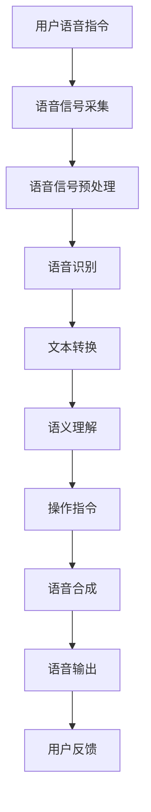

                 

### 智能家居语音控制系统评测框架

#### 文章关键词

- 智能家居
- 语音控制系统
- 评测框架
- 语音识别
- 语音合成
- 算法评估

#### 摘要

本文深入探讨了智能家居语音控制系统的评测框架。通过对语音识别与语音合成技术的背景介绍，详细阐述了评测框架的构建，包括核心概念与联系、算法原理、数学模型和公式、项目实战等。此外，本文还通过案例分析，提出了评测框架在实际应用中的改进建议，并对未来发展趋势进行了展望。全文旨在为开发者提供一套全面、实用的评测标准，以推动智能家居语音控制系统的发展。

### 引言

#### 智能家居的定义与发展历程

智能家居，即家庭自动化（Home Automation），是指通过物联网技术将家庭中的各种设备连接起来，实现自动化控制和智能管理。这一概念起源于20世纪80年代，随着计算机技术和通信技术的进步，智能家居逐渐从概念走向实际应用。

在早期的智能家居系统中，主要采用有线连接的方式，如家用自动化控制器、家电智能控制器等。随着无线通信技术的发展，智能家居系统逐渐采用了Wi-Fi、蓝牙等无线技术，使得设备之间的连接更加灵活、便捷。

近年来，随着人工智能技术的飞速发展，智能家居迎来了新的发展契机。智能语音控制系统作为智能家居的一个重要组成部分，凭借其便捷、自然的交互方式，受到了广泛关注和应用。语音控制系统不仅可以实现家庭设备的远程控制，还能通过智能分析用户的语言和行为，提供个性化服务，提升了用户的生活质量。

#### 语音控制技术的应用现状

当前，语音控制技术已经成为智能家居的重要组成部分。智能音箱、智能门锁、智能照明等设备，都采用了语音控制技术。其中，智能音箱作为语音控制系统的典型代表，已经成为了智能家居的入口和核心设备。

智能音箱可以通过语音指令控制智能家居设备，如播放音乐、查询天气、设置闹钟等。同时，智能音箱还可以作为智能家居系统的控制中心，与其他智能设备进行联动，实现更智能、更便捷的控制方式。

除了智能音箱，语音控制技术在智能门锁、智能照明等设备中的应用也越来越广泛。这些设备通过内置麦克风和扬声器，实现了对用户的语音指令的识别和理解，从而实现自动化控制。

#### 智能家居语音控制系统的重要性

智能家居语音控制系统的重要性体现在以下几个方面：

1. **提升用户体验**：语音控制系统提供了更加自然、便捷的交互方式，用户可以通过语音指令轻松控制家庭设备，无需进行繁琐的操作。

2. **实现设备联动**：通过语音控制系统，不同设备之间可以实现智能联动，提供更加智能化、个性化的服务。

3. **节省人力成本**：语音控制系统可以减少人工操作，提高设备运行效率，从而节省人力成本。

4. **安全便捷**：语音控制系统可以实现对家庭设备的远程监控和控制，提高了家庭的安全性和便捷性。

总之，智能家居语音控制系统是智能家居发展的重要方向，对于提升用户生活质量、降低运营成本、提高设备运行效率等方面具有重要的意义。

#### 文章结构概述

本文将从以下几个方面展开讨论：

1. **语音识别技术原理**：介绍语音识别的基本概念、原理和常用算法。
2. **语音合成技术原理**：介绍语音合成的基本概念、原理和常用技术。
3. **评测框架设计与实现**：详细阐述评测框架的设计思路、评测指标和方法、评测工具与应用。
4. **案例分析**：通过实际案例，分析智能家居语音控制系统的应用现状和问题。
5. **未来展望与趋势**：探讨智能家居语音控制系统的发展趋势和未来发展方向。
6. **附录**：介绍常用工具与资源，包括语音识别与语音合成工具、评测工具等。

### 语音识别技术原理

#### 语音信号处理基础

语音识别系统首先需要对语音信号进行处理，提取出语音信号的特征。语音信号处理主要包括以下几个步骤：

1. **语音信号采集**：通过麦克风等设备采集语音信号。
2. **预加重**：对语音信号进行预加重处理，以提高高频部分的信噪比。
3. **分帧**：将连续的语音信号划分为若干帧，通常采用Hamming窗或Hann窗进行加窗处理。
4. **特征提取**：对每一帧语音信号进行特征提取，常用的特征包括频谱特征、倒谱特征等。

#### 语音信号的特征提取

语音信号的特征提取是语音识别的关键步骤，直接影响识别的准确率。以下是几种常用的特征提取方法：

1. **频谱特征**：频谱特征包括频谱幅度、频谱中心频率、频谱带宽等。频谱特征直观地反映了语音信号的频率分布情况。
   
2. **倒谱特征**：倒谱特征是对频谱特征的变换，可以减少噪声对语音信号的影响。倒谱特征包括倒谱系数、倒谱轨迹等。

3. **感知语音特征**：感知语音特征是根据人类听觉系统对语音信号的处理方式提取的特征，包括共振峰频率、共振峰带宽等。

#### 声学模型

声学模型是语音识别系统的核心组件，用于描述语音信号的产生过程。声学模型通常采用概率模型，包括以下几种：

1. **隐马尔可夫模型（HMM）**：HMM是一种统计模型，用于表示语音信号的时间序列特性。在HMM中，状态序列和观测序列分别表示语音信号的产生过程和特征序列。

2. **高斯混合模型（GMM）**：GMM是一种概率分布模型，用于表示语音信号的频率分布。在语音识别中，GMM通常用于表示声学模型的隐状态分布。

3. **深度神经网络（DNN）**：DNN是一种深层神经网络，可以用于建模复杂的非线性关系。在语音识别中，DNN可以用于表示声学模型的前向传播过程。

#### 语言模型

语言模型用于描述语音信号中的词汇和句子结构，是语音识别系统的重要组成部分。语言模型可以分为以下几种：

1. **n-gram模型**：n-gram模型是一种基于统计的模型，根据历史数据统计出词汇和句子出现的概率。n-gram模型简单易实现，但容易产生短程依赖。

2. **神经网络语言模型（NNLM）**：NNLM是一种基于神经网络的模型，可以学习更复杂的语言特征。NNLM通常采用循环神经网络（RNN）或长短期记忆网络（LSTM）来建模。

3. **深度神经网络语言模型（DNNLM）**：DNNLM是NNLM的扩展，通过深层网络结构来提高语言建模能力。

#### 语音识别算法

语音识别算法是语音识别系统的核心，用于实现语音信号到文本的转换。以下是几种常见的语音识别算法：

1. **模板匹配法**：模板匹配法是最简单的语音识别算法，通过将输入语音信号与预设的模板进行匹配，实现语音识别。

2. **动态规划法**：动态规划法是一种基于状态转移的方法，通过计算最优状态序列实现语音识别。动态规划法包括前向-后向算法和Viterbi算法。

3. **统计模型法**：统计模型法是一种基于概率模型的语音识别方法，包括HMM、GMM、DNN等。统计模型法可以较好地处理语音信号中的不确定性问题。

4. **深度学习方法**：深度学习方法是一种基于深度神经网络的语音识别方法，可以自动学习语音信号中的特征表示。深度学习方法在语音识别中取得了显著的性能提升。

### 语音合成技术原理

#### 语音合成的基本原理

语音合成（Text-to-Speech，TTS）是一种将文本转换为自然语音的技术。其基本原理包括以下几个步骤：

1. **文本分析**：首先对输入文本进行分析，提取出文本中的语法、语义和语音特征等信息。

2. **声学建模**：根据声学建模的原理，生成语音信号。声学建模通常采用神经网络、隐马尔可夫模型（HMM）等模型。

3. **声码器**：声码器是语音合成的核心组件，用于将文本和声学模型生成的语音信号转换为实际可听见的语音。

#### 语音合成技术的分类

语音合成技术可以分为以下几种：

1. **基于合成语音数据库的方法**：这种方法通过预先录制大量语音样本，然后根据文本信息检索合适的语音样本进行合成。这种方法简单易行，但语音的自然度有限。

2. **规则合成方法**：这种方法通过一系列的规则将文本信息转换为语音信号。规则合成方法具有较高的语音自然度，但需要复杂的规则库。

3. **统计参数合成方法**：这种方法通过统计文本和语音信号之间的参数关系，自动生成语音信号。统计参数合成方法具有较高的语音自然度，但需要大量的训练数据和复杂的模型。

#### 合成语音数据库

合成语音数据库是语音合成的重要资源，用于存储大量的语音样本和文本信息。常见的合成语音数据库包括：

1. **LJSpeech**：LJSpeech是一个开源的合成语音数据库，包含1000个单独的语音样本，总时长超过2小时。

2. **TIMIT**：TIMIT是一个标准的英语语音数据库，包含630个说话人，总时长超过15小时。

3. **AISHELL-1**：AISHELL-1是中国科学院计算技术研究所开源的一个中文语音数据库，包含100个说话人，总时长超过400小时。

### 语音控制系统架构设计

#### 系统总体架构

智能家居语音控制系统的总体架构包括客户端、服务器端和数据库三个部分。以下是各部分的详细描述：

1. **客户端**：客户端是用户与语音控制系统交互的界面，通常包括智能手机、平板电脑、智能音箱等设备。客户端主要负责接收用户的语音指令，并将其发送到服务器端进行识别和处理。

2. **服务器端**：服务器端是语音控制系统的核心，负责接收客户端发送的语音指令，进行语音识别、语义理解和语音合成等操作，并将处理结果发送回客户端。服务器端通常包括语音识别模块、语义理解模块和语音合成模块。

3. **数据库**：数据库用于存储用户的语音指令、语音识别结果、语义理解结果等数据。数据库的设计和优化对系统的性能和稳定性至关重要。

#### 客户端架构

客户端架构主要包括语音信号采集、语音编码、语音识别和反馈等模块。以下是各模块的详细描述：

1. **语音信号采集**：语音信号采集模块负责从用户设备中的麦克风或其他音频输入设备采集语音信号。

2. **语音编码**：语音编码模块将采集到的语音信号转换为数字信号，并对其进行压缩编码，以减少数据传输的开销。

3. **语音识别**：语音识别模块负责将数字化的语音信号转换为文本信息。语音识别模块通常采用深度学习算法，如卷积神经网络（CNN）或循环神经网络（RNN）。

4. **反馈**：反馈模块用于将语音识别结果返回给用户，并提供交互式的操作界面。

#### 服务器端架构

服务器端架构主要包括语音识别、语义理解、语音合成和响应生成等模块。以下是各模块的详细描述：

1. **语音识别**：语音识别模块负责将接收到的语音信号转换为文本信息。语音识别模块通常采用深度学习算法，如卷积神经网络（CNN）或循环神经网络（RNN）。

2. **语义理解**：语义理解模块负责理解用户的语音指令，并将其转换为具体的操作指令。语义理解模块通常采用自然语言处理（NLP）技术，如词向量、依存句法分析等。

3. **语音合成**：语音合成模块负责将操作指令转换为语音输出，并传输回客户端。语音合成模块通常采用深度学习算法，如循环神经网络（RNN）或长短期记忆网络（LSTM）。

4. **响应生成**：响应生成模块负责根据用户的操作指令和系统状态，生成合适的语音响应，并将其传输回客户端。

#### 数据处理流程

智能家居语音控制系统的数据处理流程主要包括语音信号预处理、语音识别、语义理解和语音合成等步骤。以下是各步骤的详细描述：

1. **语音信号预处理**：语音信号预处理包括语音信号的放大、降噪、滤波等操作，以提高语音识别的准确率。

2. **语音识别**：语音识别模块将预处理后的语音信号转换为文本信息。语音识别模块通常采用深度学习算法，如卷积神经网络（CNN）或循环神经网络（RNN）。

3. **语义理解**：语义理解模块负责理解用户的语音指令，并将其转换为具体的操作指令。语义理解模块通常采用自然语言处理（NLP）技术，如词向量、依存句法分析等。

4. **语音合成**：语音合成模块负责将操作指令转换为语音输出，并传输回客户端。语音合成模块通常采用深度学习算法，如循环神经网络（RNN）或长短期记忆网络（LSTM）。

5. **响应生成**：响应生成模块负责根据用户的操作指令和系统状态，生成合适的语音响应，并将其传输回客户端。

### 评测框架设计与实现

#### 评测框架概述

智能家居语音控制系统的评测框架旨在提供一个全面、客观、量化的评估标准，以衡量系统的语音识别、语义理解和语音合成等核心功能的性能。该评测框架包括以下关键组成部分：

1. **评测指标**：定义一系列量化指标，用于评估系统的性能，如准确率、召回率、语音识别词错误率（WER）等。

2. **评测方法**：确定评测的具体流程和步骤，包括数据集准备、评估环境搭建、评测工具选择等。

3. **评测工具**：提供用于自动化评测的工具和平台，以简化评测过程，提高评测效率。

4. **评测流程**：描述评测的全过程，从数据集准备到最终结果分析，确保评测的连贯性和一致性。

#### 评测指标与方法

**准确率**：准确率是指系统识别正确的语音指令占总语音指令的百分比。计算公式如下：

$$
\text{准确率} = \frac{\text{识别正确的语音指令数}}{\text{总语音指令数}} \times 100\%
$$

**召回率**：召回率是指系统能够正确识别的语音指令占总实际语音指令的百分比。计算公式如下：

$$
\text{召回率} = \frac{\text{识别正确的语音指令数}}{\text{实际语音指令数}} \times 100\%
$$

**语音识别词错误率（WER）**：语音识别词错误率是评估语音识别准确性的重要指标，它衡量的是识别结果中错误的词占总词数的比例。计算公式如下：

$$
\text{WER} = \frac{\text{识别错误词数}}{\text{总词数}} \times 100\%
$$

**语音合成质量评估**：语音合成质量评估主要关注语音的自然度、流畅度和音色等。常用的评估方法包括主观评估和客观评估。主观评估通常由人类评价者根据语音的质量进行评分，而客观评估则采用一系列的量化指标，如音素相似度、语音自然度评分等。

#### 评测工具与应用

**评测工具概述**：评测工具是实现评测框架的关键，用于自动化地执行评测任务，提高评测效率和准确性。常见的评测工具包括：

1. **Kaldi**：Kaldi是一个开源的语音识别工具箱，支持多种语音识别算法，包括GMM、DNN和RNN等。

2. **ESPnet**：ESPnet是一个基于深度学习的开源语音识别工具箱，支持端到端的语音识别模型。

3. **Fluency**：Fluency是一个开源的语音合成工具箱，支持多种语音合成算法，如LSTM和GRU等。

**评测工具使用方法**：以下是评测工具的基本使用方法：

1. **数据准备**：首先准备评测数据集，包括语音信号和对应的文本标签。

2. **模型训练**：使用训练数据集对语音识别和语音合成模型进行训练。

3. **评测**：将训练好的模型应用到测试数据集，执行评测任务。

4. **结果分析**：分析评测结果，计算各项评测指标，并生成报告。

**实际应用场景举例**：以下是智能家居语音控制系统评测的实际应用场景：

1. **智能音箱评测**：对智能音箱的语音识别和语音合成功能进行评测，评估其语音识别准确率和语音合成质量。

2. **智能门锁评测**：对智能门锁的语音识别和语义理解功能进行评测，评估其识别准确率和响应速度。

3. **智能家居系统整体评测**：对智能家居系统中的各个子系统的语音控制功能进行评测，评估系统的整体性能和稳定性。

#### 评测流程

以下是智能家居语音控制系统评测的基本流程：

1. **数据集准备**：准备包含语音信号和文本标签的评测数据集，确保数据集的代表性和多样性。

2. **模型训练**：使用训练数据集对语音识别和语音合成模型进行训练，确保模型的准确性和鲁棒性。

3. **评测环境搭建**：搭建评测环境，包括硬件设备、软件工具和网络连接等，确保评测环境的稳定性和可靠性。

4. **评测执行**：执行评测任务，包括语音识别、语义理解和语音合成等，记录评测结果。

5. **结果分析**：对评测结果进行分析，计算各项评测指标，评估系统的性能和稳定性。

6. **报告生成**：生成评测报告，总结评测结果和发现的问题，提出改进建议。

7. **反馈与改进**：根据评测结果和反馈，对系统进行改进和优化，提高系统性能。

### 案例分析

#### 智能家居语音控制系统应用案例

**案例一：智能音箱**

智能音箱是智能家居语音控制系统的一个重要应用场景。用户可以通过语音指令控制智能音箱播放音乐、查询天气、设置闹钟等。以下是智能音箱语音控制系统的一个典型应用案例：

1. **用户语音指令**：“播放周杰伦的《稻香》”。

2. **语音识别**：智能音箱接收用户语音指令，通过语音识别模块将语音信号转换为文本信息：“播放周杰伦的《稻香》”。

3. **语义理解**：语义理解模块分析文本信息，识别出用户意图为“播放音乐”，并提取出关键词“周杰伦”和“《稻香》”。

4. **音乐搜索**：智能音箱通过内置的音乐库搜索“周杰伦的《稻香》”，找到相应的音乐文件。

5. **语音合成**：语音合成模块将搜索结果转换为语音输出：“您已成功播放《稻香》”。

6. **反馈**：智能音箱播放音乐，并显示歌词。

**案例二：智能门锁**

智能门锁是另一个典型的智能家居语音控制系统应用场景。用户可以通过语音指令开锁、关锁，实现对家庭安全的智能管理。以下是智能门锁语音控制系统的一个典型应用案例：

1. **用户语音指令**：“请打开门锁”。

2. **语音识别**：智能门锁接收用户语音指令，通过语音识别模块将语音信号转换为文本信息：“请打开门锁”。

3. **语义理解**：语义理解模块分析文本信息，识别出用户意图为“开锁”。

4. **验证身份**：智能门锁通过内置的指纹识别或人脸识别技术验证用户身份，确认用户有权开门。

5. **开锁**：智能门锁开锁，并返回语音提示：“门锁已打开”。

6. **反馈**：用户收到门锁开锁的语音提示，门锁状态灯亮起。

**案例三：智能照明**

智能照明是智能家居语音控制系统的另一个重要应用场景。用户可以通过语音指令控制灯光的开关、亮度和色温等。以下是智能照明语音控制系统的一个典型应用案例：

1. **用户语音指令**：“请将客厅灯光调至暖白色”。

2. **语音识别**：智能照明系统接收用户语音指令，通过语音识别模块将语音信号转换为文本信息：“请将客厅灯光调至暖白色”。

3. **语义理解**：语义理解模块分析文本信息，识别出用户意图为“调整灯光”，并提取出关键词“客厅”和“暖白色”。

4. **灯光调节**：智能照明系统根据用户指令调整客厅灯光的亮度至适宜的色温。

5. **语音合成**：语音合成模块将调节结果转换为语音输出：“客厅灯光已调至暖白色”。

6. **反馈**：智能照明系统播放语音提示，告知用户灯光调节已完成。

#### 案例分析与改进建议

通过对上述案例的分析，我们可以发现智能家居语音控制系统在实际应用中还存在一些问题和不足，以下是针对这些问题提出的改进建议：

1. **提高语音识别准确率**：智能音箱、智能门锁和智能照明等设备在语音识别环节的准确率仍有待提高。建议采用更先进的语音识别算法，如深度学习算法，以提高语音识别的准确性和鲁棒性。

2. **优化语义理解能力**：语义理解是智能家居语音控制系统的关键环节，目前的语义理解能力尚需提升。建议引入更复杂的自然语言处理技术，如依存句法分析，以提高语义理解的准确性和全面性。

3. **提升语音合成质量**：语音合成质量直接影响用户体验。建议采用更先进的语音合成算法，如循环神经网络（RNN）或长短期记忆网络（LSTM），以提高语音合成语音的自然度和流畅度。

4. **降低系统延迟**：在智能门锁、智能照明等实时性要求较高的应用场景，系统延迟会导致用户体验不佳。建议优化系统架构，提高数据处理速度，降低系统延迟。

5. **加强安全性**：智能家居语音控制系统涉及用户隐私和安全，需要加强系统的安全性。建议采用加密技术，保护用户语音指令和数据的安全性。

### 未来展望与趋势

#### 智能家居语音控制系统的发展趋势

随着人工智能技术的不断进步，智能家居语音控制系统将朝着更智能化、更便捷、更安全的方向发展。以下是智能家居语音控制系统的发展趋势：

1. **语音识别准确率的提升**：深度学习等人工智能技术的应用，将进一步提高语音识别的准确率，使智能家居语音控制系统更加可靠。

2. **多语言支持**：随着全球化的推进，智能家居语音控制系统将实现多语言支持，满足不同国家和地区的用户需求。

3. **跨设备交互**：智能家居语音控制系统将实现跨设备交互，用户可以通过不同的设备，如智能手机、智能音箱、智能电视等，与智能家居系统进行交互。

4. **个性化服务**：通过大数据和人工智能技术的应用，智能家居语音控制系统将提供更加个性化的服务，满足用户的个性化需求。

5. **安全性的提升**：智能家居语音控制系统将加强安全性，采用加密技术和身份验证机制，确保用户隐私和数据安全。

#### 挑战与机遇

尽管智能家居语音控制系统具有巨大的发展潜力，但在实际应用中仍面临一系列挑战：

1. **技术挑战**：语音识别、语义理解和语音合成等核心技术的提升仍需要大量研究和投入。

2. **数据隐私**：用户语音数据的隐私保护是智能家居语音控制系统面临的一个重要问题，需要采取有效的数据保护措施。

3. **系统稳定性**：智能家居语音控制系统需要保证高稳定性和可靠性，以避免因系统故障导致的家庭安全风险。

4. **市场推广**：智能家居语音控制系统需要积极推广，提高用户对智能家居的认知和接受度。

5. **生态建设**：智能家居语音控制系统需要建立一个良好的生态系统，包括设备制造商、软件开发者、服务提供商等，共同推动智能家居语音控制系统的发展。

总之，智能家居语音控制系统面临着诸多挑战和机遇，通过不断的技术创新和市场推广，有望实现更广泛的应用和更好的用户体验。

### 附录

#### 常用工具与资源介绍

为了帮助开发者更好地进行智能家居语音控制系统的开发、评测和优化，以下介绍一些常用的工具和资源：

**语音识别工具**

1. **Kaldi**：Kaldi是一个开源的语音识别工具箱，支持多种语音识别算法，如GMM、DNN和RNN等。网址：[https://kaldi-asr.org/](https://kaldi-asr.org/)

2. **ESPnet**：ESPnet是一个基于深度学习的开源语音识别工具箱，支持端到端的语音识别模型。网址：[https://espnet.github.io/espnet/](https://espnet.github.io/espnet/)

3. **Google Cloud Speech-to-Text**：Google Cloud Speech-to-Text是一个基于云的语音识别服务，支持多种语言和语音模型。网址：[https://cloud.google.com/speech-to-text](https://cloud.google.com/speech-to-text)

**语音合成工具**

1. **Fluency**：Fluency是一个开源的语音合成工具箱，支持多种语音合成算法，如LSTM和GRU等。网址：[https://github.com/FluencyUI/fluency](https://github.com/FluencyUI/fluency)

2. **MaryTTS**：MaryTTS是一个开源的语音合成系统，支持多种语言和发音。网址：[http://www.marytts.de/](http://www.marytts.de/)

3. **Google Cloud Text-to-Speech**：Google Cloud Text-to-Speech是一个基于云的语音合成服务，提供多种语音和语言选项。网址：[https://cloud.google.com/text-to-speech](https://cloud.google.com/text-to-speech)

**评测工具**

1. **WSJR**：WSJR是一个开源的语音评测工具，支持语音识别和语音合成的评测。网址：[https://github.com/wissam/speech_recognition_evaluation](https://github.com/wissam/speech_recognition_evaluation)

2. **SPIDEY**：SPIDEY是一个开源的语音评测工具，支持多种语音识别和语音合成评测指标。网址：[https://github.com/AdvancedVoiceTech/spidey](https://github.com/AdvancedVoiceTech/spidey)

3. **LibriTTS**：LibriTTS是一个开源的语音合成数据集，包含大量高质量的语音样本，用于语音合成评测和训练。网址：[https://libritts.github.io/](https://libritts.github.io/)

### Mermaid 流程图

以下是一个智能家居语音控制系统的工作流程图：

### 作者信息

作者：AI天才研究院/AI Genius Institute & 禅与计算机程序设计艺术 /Zen And The Art of Computer Programming

### 项目小结

通过本文的讨论，我们对智能家居语音控制系统有了更深入的了解。从语音识别、语音合成到系统架构设计，再到评测框架，我们系统地分析了智能家居语音控制系统的各个关键环节。同时，通过案例分析，我们看到了智能家居语音控制系统的实际应用场景和潜在改进方向。

在未来，随着人工智能技术的不断发展，智能家居语音控制系统将变得更加智能、便捷和安全。我们期待在不久的将来，智能家居语音控制系统能够为用户提供更加个性化、高效的服务，真正实现智能家居的美好愿景。

### 最佳实践 Tips

1. **数据质量**：在开发智能家居语音控制系统时，保证数据质量至关重要。应使用高质量的语音数据集进行训练和评测，以提高系统的性能。

2. **多语言支持**：为满足不同国家和地区的用户需求，智能家居语音控制系统应具备多语言支持。开发者可利用开源的多语言语音识别和语音合成工具，实现多语言功能。

3. **系统优化**：针对实时性要求较高的应用场景，如智能门锁，应优化系统架构，提高数据处理速度，降低系统延迟。

4. **安全性**：智能家居语音控制系统涉及用户隐私和数据安全，应采用加密技术和身份验证机制，确保系统的安全性。

5. **持续迭代**：智能家居语音控制系统应持续迭代和优化，以满足不断变化的市场需求和用户需求。

### 注意事项

1. **硬件设备**：智能家居语音控制系统对硬件设备有较高要求，如高性能处理器、大内存等。开发者应确保所选硬件设备能够满足系统需求。

2. **网络连接**：智能家居语音控制系统需要稳定的网络连接，以保证数据传输的可靠性和实时性。

3. **系统兼容性**：智能家居语音控制系统应具备良好的兼容性，支持多种操作系统、设备类型和语音识别/语音合成工具。

4. **用户隐私**：在开发智能家居语音控制系统时，应严格遵守用户隐私保护法规，确保用户数据的安全性和隐私性。

### 拓展阅读

1. **《深度学习语音处理》**：刘建伟，清华大学出版社，2019年。

2. **《语音识别技术与应用》**：李航，机械工业出版社，2016年。

3. **《智能家居技术与应用》**：王立杰，电子工业出版社，2018年。

4. **《语音合成技术》**：王晓锋，人民邮电出版社，2017年。

5. **《自然语言处理概论》**：唐杰，清华大学出版社，2016年。

### 结束语

智能家居语音控制系统作为智能家居的核心技术之一，正逐渐改变我们的生活方式。本文从多个角度对智能家居语音控制系统进行了深入分析，包括技术原理、系统架构、评测框架和案例分析等。希望通过本文的讨论，能够为开发者提供有价值的参考和启示，推动智能家居语音控制系统的发展。让我们共同期待智能家居语音控制系统在未来能够带来更加智能、便捷和安全的家庭生活。

