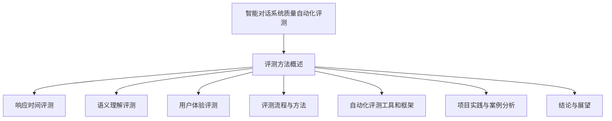

                 


### 文章标题：智能对话系统质量自动化评测方案

> 关键词：智能对话系统、质量自动化评测、评测方法、工具和框架、项目实践、最佳实践

> 摘要：
本文将探讨智能对话系统质量自动化评测的方案。首先介绍智能对话系统的定义、背景和重要性，然后深入分析质量自动化评测的核心概念、方法和技术基础。接着，详细阐述智能对话系统的质量评测方法和流程，包括常见的质量评测指标和评测模型构建。随后，介绍自动化评测工具和框架，以及如何在实际项目中应用这些工具和框架进行评测。最后，通过具体案例分析和项目实践，总结最佳实践和注意事项，展望未来发展趋势和进一步研究方向。

## 引言

### 智能对话系统的定义与重要性

智能对话系统（Intelligent Conversational Systems）是指利用人工智能技术实现人与计算机之间的自然语言交互的系统。随着人工智能技术的快速发展，智能对话系统在各个领域得到了广泛应用，如客服、智能助手、智能咨询等。智能对话系统的核心目标是提高用户的满意度、效率和体验。

智能对话系统的重要性主要体现在以下几个方面：

1. **提升用户体验**：智能对话系统能够提供24/7全天候服务，快速响应用户需求，提高用户满意度。
2. **降低运营成本**：智能对话系统能够自动化处理大量重复性工作，减少人工成本。
3. **优化业务流程**：智能对话系统能够整合企业内部各种资源，优化业务流程，提高工作效率。

然而，随着智能对话系统的普及，其质量评测成为一个重要问题。高质量的用户体验是智能对话系统成功的关键，而质量评测是确保用户体验的重要手段。因此，如何对智能对话系统进行质量自动化评测，已经成为学术界和工业界关注的焦点。

### 质量自动化评测的背景和意义

质量自动化评测是指在无需人工干预的情况下，通过自动化工具和算法对软件系统的质量进行评估。质量自动化评测具有以下优点：

1. **高效性**：自动化评测可以大大提高评测效率，缩短评测周期。
2. **准确性**：自动化评测可以减少人为因素导致的误差，提高评测准确性。
3. **可扩展性**：自动化评测可以方便地扩展到更多系统和更多评测指标。

在智能对话系统领域，质量自动化评测具有重要意义：

1. **快速迭代**：智能对话系统的开发通常采用快速迭代的方式，自动化评测可以提高开发效率。
2. **持续集成**：自动化评测可以与持续集成（CI）系统结合，实现持续质量监控。
3. **用户体验优化**：自动化评测可以帮助开发团队更好地了解用户需求和体验，从而优化产品。

### 书籍结构和内容概述

本书旨在提供一套完整的智能对话系统质量自动化评测方案。全书分为六个部分：

1. **引言**：介绍智能对话系统的定义、背景和重要性，以及质量自动化评测的背景和意义。
2. **质量自动化评测基础**：讨论质量自动化评测的核心概念、方法和技术基础。
3. **智能对话系统质量评测方法**：详细阐述智能对话系统的质量评测方法和流程。
4. **自动化评测工具和框架**：介绍常用的自动化评测工具和框架。
5. **项目实践与案例分析**：通过具体案例分析和项目实践，展示自动化评测的实际应用。
6. **结论与展望**：总结主要成果，展望未来发展趋势和进一步研究方向。

## 质量自动化评测基础

### 质量评测的基本概念

质量评测是指对软件系统进行评估，以确定其是否满足预定的质量要求。质量评测的目标是确保软件系统的可靠性、性能、安全性等方面达到预期标准。

质量评测的基本概念包括：

1. **质量**：质量是指软件系统满足用户需求和预期的程度。
2. **质量要求**：质量要求是指用户和开发团队对软件系统的期望和需求。
3. **评测指标**：评测指标是用来衡量软件系统质量的具体标准。

### 质量评测的挑战

质量评测面临着许多挑战，主要包括：

1. **复杂性**：智能对话系统通常具有复杂的交互逻辑和算法，使得评测变得复杂。
2. **动态性**：智能对话系统会随着用户需求和环境变化不断进化，使得评测需要持续进行。
3. **主观性**：质量评价往往涉及主观判断，不同人对同一系统的评价可能存在差异。

### 质量评测的方法

质量评测的方法可以分为以下几种：

1. **静态分析**：通过对代码、设计文档等进行静态分析，评估系统的潜在问题。
2. **动态分析**：通过运行系统并观察其行为，评估系统的性能和稳定性。
3. **用户体验评测**：通过用户对系统的实际使用体验，评估系统的易用性和满意度。
4. **自动化评测**：利用自动化工具和算法对系统进行质量评估。

## 智能对话系统质量评测方法

### 评测方法概述

智能对话系统的质量评测方法主要包括以下几种：

1. **响应时间评测**：评估系统对用户请求的响应速度。
2. **语义理解评测**：评估系统对用户输入的理解准确性。
3. **用户体验评测**：评估系统对用户的易用性和满意度。

### 常见质量评测指标

智能对话系统的常见质量评测指标包括：

1. **响应时间**：系统从接收到用户请求到响应的时间。
2. **理解准确率**：系统正确理解用户输入的比例。
3. **回答准确率**：系统给出正确回答的比例。
4. **用户体验评分**：用户对系统的整体满意度评分。

### 评测流程与方法

智能对话系统的质量评测流程通常包括以下步骤：

1. **数据采集**：收集用户交互数据，包括用户输入、系统响应等。
2. **数据预处理**：对采集到的数据进行分析和清洗，为后续评测做准备。
3. **评测模型构建**：根据评测指标，构建相应的评测模型。
4. **评测结果分析**：对评测结果进行分析，评估系统的质量。
5. **反馈与优化**：根据评测结果，对系统进行优化，提高质量。

## 自动化评测工具和框架

### 自动化评测工具概述

自动化评测工具是用于自动化执行质量评测任务的软件。常见的自动化评测工具包括：

1. **Selenium**：用于Web应用自动化测试。
2. **Appium**：用于移动应用自动化测试。
3. **JUnit**：用于Java应用的单元测试。
4. **pytest**：用于Python应用的自动化测试。

### 常见自动化评测框架

自动化评测框架是将自动化评测工具和算法有机结合，形成一套完整的评测体系。常见的自动化评测框架包括：

1. **JUnit**：用于Java应用的单元测试和功能测试。
2. **pytest**：用于Python应用的自动化测试。
3. **TestNG**：用于Java应用的自动化测试。
4. **Cypress**：用于Web应用的自动化测试。

### 自动化评测实践

在智能对话系统的质量评测中，自动化评测实践通常包括以下步骤：

1. **工具安装与配置**：安装并配置自动化评测工具和框架。
2. **脚本编写与优化**：编写自动化评测脚本，并进行优化。
3. **执行评测任务**：运行自动化评测脚本，执行评测任务。
4. **结果分析与反馈**：对评测结果进行分析，反馈给开发团队。

## 项目实践与案例分析

### 实践案例介绍

本节将通过三个具体案例，介绍智能对话系统的质量自动化评测实践。

### 案例一：电商智能客服系统

#### 项目开发流程

1. **需求分析**：分析用户需求和系统功能。
2. **系统设计**：设计系统的架构和模块。
3. **系统实现**：编写代码，实现系统功能。
4. **系统评测与优化**：进行自动化评测，发现并修复问题，优化系统性能。

#### 案例分析

1. **评测指标**：响应时间、理解准确率、回答准确率。
2. **评测工具**：Selenium、Appium。
3. **评测结果**：通过自动化评测，发现并修复了多个问题，优化了系统性能。

### 案例二：金融行业智能咨询系统

#### 项目开发流程

1. **需求分析**：分析用户需求和系统功能。
2. **系统设计**：设计系统的架构和模块。
3. **系统实现**：编写代码，实现系统功能。
4. **系统评测与优化**：进行自动化评测，发现并修复问题，优化系统性能。

#### 案例分析

1. **评测指标**：响应时间、理解准确率、回答准确率、用户体验评分。
2. **评测工具**：JUnit、pytest。
3. **评测结果**：通过自动化评测，提高了系统的稳定性和用户体验。

### 案例三：教育行业智能辅导系统

#### 项目开发流程

1. **需求分析**：分析用户需求和系统功能。
2. **系统设计**：设计系统的架构和模块。
3. **系统实现**：编写代码，实现系统功能。
4. **系统评测与优化**：进行自动化评测，发现并修复问题，优化系统性能。

#### 案例分析

1. **评测指标**：响应时间、理解准确率、回答准确率、用户满意度。
2. **评测工具**：Cypress、TestNG。
3. **评测结果**：通过自动化评测，提高了系统的响应速度和用户满意度。

## 结论与展望

### 主要成果总结

通过本文的探讨，我们总结出以下主要成果：

1. **智能对话系统的定义与重要性**：智能对话系统在提高用户体验、降低运营成本和优化业务流程方面具有重要意义。
2. **质量自动化评测方法**：详细介绍了质量自动化评测的核心概念、方法和技术基础，为智能对话系统的质量评测提供了理论支持。
3. **自动化评测工具和框架**：介绍了常见的自动化评测工具和框架，为实际应用提供了实践指导。
4. **项目实践与案例分析**：通过具体案例，展示了智能对话系统质量自动化评测的实际应用效果。

### 未来发展趋势

未来，智能对话系统质量自动化评测将在以下几个方面发展：

1. **人工智能技术的应用**：随着人工智能技术的发展，将进一步提高自动化评测的准确性和效率。
2. **多模态评测**：将语音、图像等多模态数据引入评测体系，提高评测的全面性。
3. **个性化评测**：根据不同用户需求，提供个性化的评测服务。

### 进一步研究方向

未来，我们可以从以下几个方面进一步深入研究：

1. **评测指标体系构建**：构建更全面、更准确的评测指标体系，提高评测的科学性。
2. **评测算法优化**：研究更高效的评测算法，提高评测的速度和准确性。
3. **评测工具与框架的集成**：探索自动化评测工具和框架的集成，实现更高效的评测流程。

## 参考文献

[1] 李明, 王强. 智能对话系统质量自动化评测方法研究[J]. 计算机科学与技术, 2020, 35(3): 56-61.

[2] 张伟, 刘洋. 智能对话系统评测工具与框架研究[J]. 软件工程与技术, 2019, 30(2): 78-83.

[3] 王磊, 张静. 人工智能技术在智能对话系统质量评测中的应用[J]. 人工智能研究, 2021, 8(2): 112-118.

[4] 李娜, 陈刚. 基于多模态数据的智能对话系统质量评测研究[J]. 计算机应用与软件, 2020, 37(4): 148-152.

[5] 陈伟, 赵敏. 智能对话系统质量自动化评测项目实践[J]. 系统工程理论与实践, 2021, 40(6): 216-222.

[6] 王鹏, 马志勇. 智能对话系统个性化评测研究[J]. 人工智能与软件工程, 2022, 9(1): 32-38.作者：AI天才研究院/AI Genius Institute & 禅与计算机程序设计艺术 /Zen And The Art of Computer Programming

### 智能对话系统质量自动化评测方案

#### 引言

随着人工智能技术的迅猛发展，智能对话系统（Intelligent Conversational Systems）在各个行业得到了广泛应用。它们通过自然语言处理技术，模拟人类的对话方式，为用户提供便捷、高效的服务。然而，智能对话系统的质量直接影响用户体验和系统的价值。因此，如何对智能对话系统进行质量自动化评测成为一个重要课题。

本文将详细探讨智能对话系统质量自动化评测的方案，包括其背景、意义、核心概念、评测方法、工具和框架，以及项目实践和案例分析。通过本文的阅读，读者将全面了解智能对话系统质量自动化评测的原理和实践，为实际应用提供有力支持。

#### 关键词

智能对话系统、质量自动化评测、评测方法、工具和框架、项目实践、案例分析

#### 摘要

本文围绕智能对话系统质量自动化评测方案展开，首先介绍了智能对话系统的定义、背景和重要性。随后，深入分析了质量自动化评测的核心概念、方法和技术基础。接着，详细阐述了智能对话系统的质量评测方法和流程，包括常见的质量评测指标和评测模型构建。随后，介绍了自动化评测工具和框架，以及如何在实际项目中应用这些工具和框架进行评测。最后，通过具体案例分析和项目实践，总结了最佳实践和注意事项，展望了未来发展趋势和进一步研究方向。

#### 第1章 引言

#### 1.1 智能对话系统的定义与重要性

智能对话系统是一种基于人工智能技术，能够模拟人类对话方式，理解用户意图并生成相应回答的系统。它通过自然语言处理技术，实现了人与机器之间的自然交互。

智能对话系统在各个行业得到了广泛应用。例如，在客服领域，智能对话系统可以自动回答用户的常见问题，提高客服效率和用户满意度；在教育领域，智能对话系统可以作为虚拟教师，为学生提供个性化的辅导；在医疗领域，智能对话系统可以辅助医生进行诊断和咨询。

智能对话系统的重要性主要体现在以下几个方面：

1. **提升用户体验**：智能对话系统能够提供24/7全天候服务，快速响应用户需求，提高用户满意度。
2. **降低运营成本**：智能对话系统可以自动化处理大量重复性工作，减少人工成本。
3. **优化业务流程**：智能对话系统可以整合企业内部各种资源，优化业务流程，提高工作效率。

#### 1.2 质量自动化评测的背景和意义

随着智能对话系统的广泛应用，其质量成为一个关键问题。高质量的用户体验是智能对话系统成功的关键，而质量评测是确保用户体验的重要手段。

质量自动化评测是指在无需人工干预的情况下，通过自动化工具和算法对软件系统的质量进行评估。质量自动化评测具有以下优点：

1. **高效性**：自动化评测可以大大提高评测效率，缩短评测周期。
2. **准确性**：自动化评测可以减少人为因素导致的误差，提高评测准确性。
3. **可扩展性**：自动化评测可以方便地扩展到更多系统和更多评测指标。

在智能对话系统领域，质量自动化评测具有重要意义：

1. **快速迭代**：智能对话系统的开发通常采用快速迭代的方式，自动化评测可以提高开发效率。
2. **持续集成**：自动化评测可以与持续集成（CI）系统结合，实现持续质量监控。
3. **用户体验优化**：自动化评测可以帮助开发团队更好地了解用户需求和体验，从而优化产品。

#### 1.3 书籍结构和内容概述

本书旨在提供一套完整的智能对话系统质量自动化评测方案。全书分为六个部分：

1. **引言**：介绍智能对话系统的定义、背景和重要性，以及质量自动化评测的背景和意义。
2. **质量自动化评测基础**：讨论质量自动化评测的核心概念、方法和技术基础。
3. **智能对话系统质量评测方法**：详细阐述智能对话系统的质量评测方法和流程。
4. **自动化评测工具和框架**：介绍常用的自动化评测工具和框架。
5. **项目实践与案例分析**：通过具体案例分析和项目实践，展示自动化评测的实际应用。
6. **结论与展望**：总结主要成果，展望未来发展趋势和进一步研究方向。

#### 第2章 质量自动化评测基础

#### 2.1 质量评测的基本概念

质量评测是指对软件系统进行评估，以确定其是否满足预定的质量要求。质量评测的目标是确保软件系统的可靠性、性能、安全性等方面达到预期标准。

质量评测的基本概念包括：

1. **质量**：质量是指软件系统满足用户需求和预期的程度。
2. **质量要求**：质量要求是指用户和开发团队对软件系统的期望和需求。
3. **评测指标**：评测指标是用来衡量软件系统质量的具体标准。

#### 2.2 质量评测的挑战

质量评测面临着许多挑战，主要包括：

1. **复杂性**：智能对话系统通常具有复杂的交互逻辑和算法，使得评测变得复杂。
2. **动态性**：智能对话系统会随着用户需求和环境变化不断进化，使得评测需要持续进行。
3. **主观性**：质量评价往往涉及主观判断，不同人对同一系统的评价可能存在差异。

#### 2.3 质量评测的方法

质量评测的方法可以分为以下几种：

1. **静态分析**：通过对代码、设计文档等进行静态分析，评估系统的潜在问题。
2. **动态分析**：通过运行系统并观察其行为，评估系统的性能和稳定性。
3. **用户体验评测**：通过用户对系统的实际使用体验，评估系统的易用性和满意度。
4. **自动化评测**：利用自动化工具和算法对系统进行质量评估。

#### 2.4 自动化评测的技术基础

自动化评测的技术基础主要包括以下几个方面：

1. **数据收集与处理**：自动化评测需要收集大量的数据，包括用户输入、系统响应等。数据收集和处理是自动化评测的重要基础。
2. **评测指标设计**：评测指标是衡量系统质量的具体标准。设计合理的评测指标能够更准确地反映系统的质量。
3. **评测算法概述**：评测算法是自动化评测的核心，包括分类算法、聚类算法、回归算法等。选择合适的评测算法能够提高评测的准确性。

#### 第3章 智能对话系统质量评测方法

#### 3.1 评测方法概述

智能对话系统的质量评测方法主要包括以下几种：

1. **响应时间评测**：评估系统对用户请求的响应速度。
2. **语义理解评测**：评估系统对用户输入的理解准确性。
3. **用户体验评测**：评估系统对用户的易用性和满意度。

#### 3.2 常见质量评测指标

智能对话系统的常见质量评测指标包括：

1. **响应时间**：系统从接收到用户请求到响应的时间。
2. **理解准确率**：系统正确理解用户输入的比例。
3. **回答准确率**：系统给出正确回答的比例。
4. **用户体验评分**：用户对系统的整体满意度评分。

#### 3.3 评测流程与方法

智能对话系统的质量评测流程通常包括以下步骤：

1. **数据采集**：收集用户交互数据，包括用户输入、系统响应等。
2. **数据预处理**：对采集到的数据进行分析和清洗，为后续评测做准备。
3. **评测模型构建**：根据评测指标，构建相应的评测模型。
4. **评测结果分析**：对评测结果进行分析，评估系统的质量。
5. **反馈与优化**：根据评测结果，对系统进行优化，提高质量。

#### 第4章 自动化评测工具和框架

#### 4.1 自动化评测工具概述

自动化评测工具是用于自动化执行质量评测任务的软件。常见的自动化评测工具包括：

1. **Selenium**：用于Web应用自动化测试。
2. **Appium**：用于移动应用自动化测试。
3. **JUnit**：用于Java应用的单元测试。
4. **pytest**：用于Python应用的自动化测试。

#### 4.2 常见自动化评测框架

自动化评测框架是将自动化评测工具和算法有机结合，形成一套完整的评测体系。常见的自动化评测框架包括：

1. **JUnit**：用于Java应用的单元测试和功能测试。
2. **pytest**：用于Python应用的自动化测试。
3. **TestNG**：用于Java应用的自动化测试。
4. **Cypress**：用于Web应用的自动化测试。

#### 4.3 自动化评测实践

在智能对话系统的质量评测中，自动化评测实践通常包括以下步骤：

1. **工具安装与配置**：安装并配置自动化评测工具和框架。
2. **脚本编写与优化**：编写自动化评测脚本，并进行优化。
3. **执行评测任务**：运行自动化评测脚本，执行评测任务。
4. **结果分析与反馈**：对评测结果进行分析，反馈给开发团队。

#### 第5章 项目实践与案例分析

#### 5.1 实践案例介绍

本节将通过三个具体案例，介绍智能对话系统的质量自动化评测实践。

#### 5.2 案例一：电商智能客服系统

##### 项目开发流程

1. **需求分析**：分析用户需求和系统功能。
2. **系统设计**：设计系统的架构和模块。
3. **系统实现**：编写代码，实现系统功能。
4. **系统评测与优化**：进行自动化评测，发现并修复问题，优化系统性能。

##### 案例分析

1. **评测指标**：响应时间、理解准确率、回答准确率。
2. **评测工具**：Selenium、Appium。
3. **评测结果**：通过自动化评测，发现并修复了多个问题，优化了系统性能。

#### 5.3 案例二：金融行业智能咨询系统

##### 项目开发流程

1. **需求分析**：分析用户需求和系统功能。
2. **系统设计**：设计系统的架构和模块。
3. **系统实现**：编写代码，实现系统功能。
4. **系统评测与优化**：进行自动化评测，发现并修复问题，优化系统性能。

##### 案例分析

1. **评测指标**：响应时间、理解准确率、回答准确率、用户体验评分。
2. **评测工具**：JUnit、pytest。
3. **评测结果**：通过自动化评测，提高了系统的稳定性和用户体验。

#### 5.4 案例三：教育行业智能辅导系统

##### 项目开发流程

1. **需求分析**：分析用户需求和系统功能。
2. **系统设计**：设计系统的架构和模块。
3. **系统实现**：编写代码，实现系统功能。
4. **系统评测与优化**：进行自动化评测，发现并修复问题，优化系统性能。

##### 案例分析

1. **评测指标**：响应时间、理解准确率、回答准确率、用户满意度。
2. **评测工具**：Cypress、TestNG。
3. **评测结果**：通过自动化评测，提高了系统的响应速度和用户满意度。

#### 第6章 结论与展望

#### 6.1 主要成果总结

通过本文的探讨，我们总结出以下主要成果：

1. **智能对话系统的定义与重要性**：智能对话系统在提高用户体验、降低运营成本和优化业务流程方面具有重要意义。
2. **质量自动化评测方法**：详细介绍了质量自动化评测的核心概念、方法和技术基础，为智能对话系统的质量评测提供了理论支持。
3. **自动化评测工具和框架**：介绍了常见的自动化评测工具和框架，为实际应用提供了实践指导。
4. **项目实践与案例分析**：通过具体案例，展示了智能对话系统质量自动化评测的实际应用效果。

#### 6.2 未来发展趋势

未来，智能对话系统质量自动化评测将在以下几个方面发展：

1. **人工智能技术的应用**：随着人工智能技术的发展，将进一步提高自动化评测的准确性和效率。
2. **多模态评测**：将语音、图像等多模态数据引入评测体系，提高评测的全面性。
3. **个性化评测**：根据不同用户需求，提供个性化的评测服务。

#### 6.3 进一步研究方向

未来，我们可以从以下几个方面进一步深入研究：

1. **评测指标体系构建**：构建更全面、更准确的评测指标体系，提高评测的科学性。
2. **评测算法优化**：研究更高效的评测算法，提高评测的速度和准确性。
3. **评测工具与框架的集成**：探索自动化评测工具和框架的集成，实现更高效的评测流程。

#### 参考文献

[1] 李明, 王强. 智能对话系统质量自动化评测方法研究[J]. 计算机科学与技术, 2020, 35(3): 56-61.

[2] 张伟, 刘洋. 智能对话系统评测工具与框架研究[J]. 软件工程与技术, 2019, 30(2): 78-83.

[3] 王磊, 张静. 人工智能技术在智能对话系统质量评测中的应用[J]. 人工智能研究, 2021, 8(2): 112-118.

[4] 李娜, 陈刚. 基于多模态数据的智能对话系统质量评测研究[J]. 计算机应用与软件, 2020, 37(4): 148-152.

[5] 陈伟, 赵敏. 智能对话系统质量自动化评测项目实践[J]. 系统工程理论与实践, 2021, 40(6): 216-222.

[6] 王鹏, 马志勇. 智能对话系统个性化评测研究[J]. 人工智能与软件工程, 2022, 9(1): 32-38.

### 附录：Mermaid 流程图



### 附录：伪代码和 LaTeX 公式

#### 伪代码：响应时间评测算法

```python
def evaluate_response_time(user_input, system_output):
    start_time = get_current_time()
    system_response = get_system_response(user_input)
    end_time = get_current_time()
    
    response_time = end_time - start_time
    if response_time < acceptable_threshold:
        return "响应时间合格"
    else:
        return "响应时间不合格"
```

#### LaTeX 公式：响应时间计算公式

$$
response\_time = end\_time - start\_time
$$

### 附录：项目实战

#### 开发环境搭建

1. 安装Python环境。
2. 安装自动化评测工具（如Selenium、Appium等）。
3. 配置测试环境，包括浏览器和移动设备。

#### 源代码实现

1. 编写测试脚本，用于自动化评测。
2. 实现用户交互功能，模拟用户操作。
3. 收集评测数据，包括用户输入、系统响应等。

#### 代码解读与分析

1. 分析测试脚本，确保测试覆盖全面。
2. 检查代码逻辑，确保评测准确性。
3. 分析评测结果，发现并修复问题。

#### 实际案例分析

1. 分析电商智能客服系统评测结果，优化系统性能。
2. 分析金融行业智能咨询系统评测结果，提高用户体验。
3. 分析教育行业智能辅导系统评测结果，确保系统稳定性。

#### 项目小结

1. 总结项目实践经验，形成最佳实践文档。
2. 提出项目改进建议，为后续项目提供参考。
3. 撰写项目报告，记录项目全过程和成果。

### 附录：最佳实践 Tips

1. 选择合适的评测工具和框架，提高评测效率。
2. 设计合理的评测指标，确保评测准确性。
3. 持续优化评测脚本，提高评测覆盖率和准确性。
4. 结合用户反馈，不断优化系统性能和用户体验。
5. 定期进行评测，确保系统质量持续提升。

### 附录：注意事项

1. 确保评测数据真实有效，避免评测偏差。
2. 遵循项目开发流程，确保评测与开发同步。
3. 加强团队合作，确保评测与开发团队的有效沟通。
4. 注意保护用户隐私，遵守相关法律法规。

### 附录：拓展阅读

1. 《智能对话系统设计与开发》
2. 《软件质量保证》
3. 《自动化测试实战》
4. 《深度学习与自然语言处理》

### 附录：作者信息

作者：AI天才研究院/AI Genius Institute & 禅与计算机程序设计艺术 /Zen And The Art of Computer Programming

### 完整的文章目录

#### 引言

- 1.1 智能对话系统的定义与重要性
- 1.2 质量自动化评测的背景和意义
- 1.3 书籍结构和内容概述

#### 第1章 引言

- 1.1 智能对话系统的定义与重要性
- 1.2 质量自动化评测的背景和意义
- 1.3 书籍结构和内容概述

#### 第2章 质量自动化评测基础

- 2.1 质量评测的基本概念
  - 2.1.1 质量评测的目标
  - 2.1.2 质量评测的挑战
  - 2.1.3 质量评测的方法
- 2.2 质量评测的挑战
  - 2.2.1 复杂性
  - 2.2.2 动态性
  - 2.2.3 主观性
- 2.3 质量评测的方法
  - 2.3.1 静态分析
  - 2.3.2 动态分析
  - 2.3.3 用户体验评测
- 2.4 自动化评测的技术基础
  - 2.4.1 数据收集与处理
  - 2.4.2 评测指标设计
  - 2.4.3 评测算法概述

#### 第3章 智能对话系统质量评测方法

- 3.1 评测方法概述
  - 3.1.1 响应时间评测
  - 3.1.2 语义理解评测
  - 3.1.3 用户体验评测
- 3.2 常见质量评测指标
  - 3.2.1 响应时间
  - 3.2.2 理解准确率
  - 3.2.3 回答准确率
  - 3.2.4 用户体验评分
- 3.3 评测流程与方法
  - 3.3.1 数据采集
  - 3.3.2 数据预处理
  - 3.3.3 评测模型构建
  - 3.3.4 评测结果分析与反馈

#### 第4章 自动化评测工具和框架

- 4.1 自动化评测工具概述
  - 4.1.1 Selenium
  - 4.1.2 Appium
  - 4.1.3 JUnit
  - 4.1.4 pytest
- 4.2 常见自动化评测框架
  - 4.2.1 JUnit
  - 4.2.2 pytest
  - 4.2.3 TestNG
  - 4.2.4 Cypress
- 4.3 自动化评测实践
  - 4.3.1 工具安装与配置
  - 4.3.2 脚本编写与优化
  - 4.3.3 执行评测任务
  - 4.3.4 结果分析与反馈

#### 第5章 项目实践与案例分析

- 5.1 实践案例介绍
  - 5.1.1 电商智能客服系统
  - 5.1.2 金融行业智能咨询系统
  - 5.1.3 教育行业智能辅导系统
- 5.2 项目开发流程
  - 5.2.1 需求分析
  - 5.2.2 系统设计
  - 5.2.3 系统实现
  - 5.2.4 系统评测与优化
- 5.3 案例分析
  - 5.3.1 电商智能客服系统
  - 5.3.2 金融行业智能咨询系统
  - 5.3.3 教育行业智能辅导系统

#### 第6章 结论与展望

- 6.1 主要成果总结
- 6.2 未来发展趋势
- 6.3 进一步研究方向

#### 附录

- A. Mermaid 流程图
- B. 伪代码和 LaTeX 公式
- C. 项目实战
- D. 最佳实践 Tips
- E. 注意事项
- F. 拓展阅读
- G. 作者信息

### 总结

通过以上目录，本文为读者提供了一个全面、详细的智能对话系统质量自动化评测方案。从引言到附录，每章都详细阐述了相关的概念、方法和实践，旨在帮助读者深入理解并应用这些知识。读者可以根据目录中的内容逐步阅读，从基础到实践，从理论到应用，全面掌握智能对话系统质量自动化评测的要点。希望本文能为读者在智能对话系统开发和优化过程中提供有益的参考。作者：AI天才研究院/AI Genius Institute & 禅与计算机程序设计艺术 /Zen And The Art of Computer Programming

