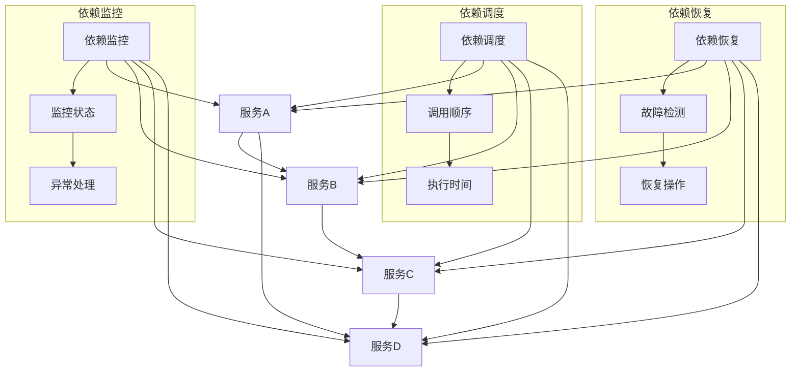
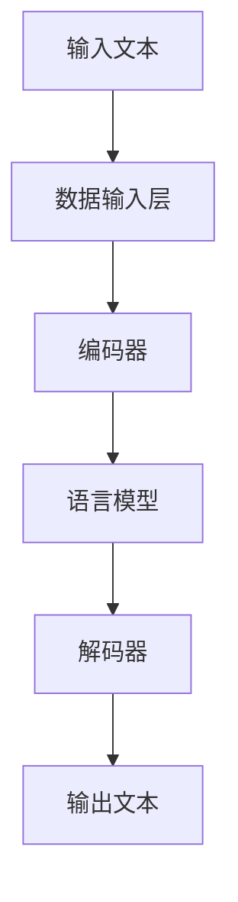

                 

### 文章标题

《服务依赖管理在LLM应用架构中的重要性》

### 关键词

服务依赖管理、LLM应用架构、挑战与解决方案、案例分析、技术实现、最佳实践

### 摘要

本文旨在深入探讨服务依赖管理在大型语言模型（LLM）应用架构中的重要性。通过定义服务依赖管理的基本概念，分析其在LLM应用架构中的核心作用，我们详细阐述了在LLM架构中管理服务依赖所面临的挑战及其解决方案。本文还通过具体案例分析，展示了服务依赖管理的实际应用，并提出了实现服务依赖管理的具体技术手段和最佳实践。最终，我们总结了服务依赖管理的未来发展趋势，为读者提供实用的指导和建议。

## 第一部分：服务依赖管理基础

### 第1章：服务依赖管理的核心概念与联系

#### 1.1 服务依赖管理概述

服务依赖管理是指在一个分布式系统中，对服务之间的依赖关系进行有效的识别、监控、调度和管理。其核心目的是确保整个系统的稳定性和高效性，通过减少服务之间的耦合度，提升系统的可维护性和扩展性。

在分布式系统中，服务之间通常存在着复杂的依赖关系。例如，一个服务可能依赖于多个外部服务，如数据库、消息队列、缓存等。这些依赖关系不仅影响了服务的运行效率，还可能引发一系列的故障传播。因此，服务依赖管理显得尤为重要。

#### 1.2 服务依赖管理的重要性

服务依赖管理的重要性体现在以下几个方面：

1. **提高系统稳定性**：通过有效的服务依赖管理，可以确保系统在面临依赖故障时能够快速响应和恢复，从而减少系统停机时间和故障影响范围。
2. **提升系统效率**：合理的服务依赖管理可以减少冗余调用和无效负载，提高系统整体的处理能力和响应速度。
3. **增强可维护性和扩展性**：服务依赖管理使得系统架构更加清晰和模块化，便于后续的维护和扩展。

#### 1.3 服务依赖管理的核心概念

服务依赖管理涉及以下几个核心概念：

1. **依赖关系**：服务之间的依赖关系，通常表现为调用关系或数据流转关系。
2. **依赖监控**：对服务依赖关系的实时监控，包括依赖服务的状态、响应时间、错误率等指标。
3. **依赖调度**：根据服务依赖关系，对服务调用进行调度和管理，确保依赖服务的正确调用顺序和执行时间。
4. **依赖恢复**：在依赖服务出现故障时，自动进行依赖关系的恢复和重建。

#### 1.4 核心概念与联系

为了更好地理解服务依赖管理的核心概念，我们使用Mermaid流程图展示服务依赖管理的基本流程：



在上述流程图中，服务A依赖服务B、C和D，依赖监控模块对各个服务的状态进行实时监控，依赖调度模块负责根据依赖关系进行调用顺序和执行时间的调度，依赖恢复模块则在服务出现故障时进行故障检测和恢复操作。

### 第2章：服务依赖管理的挑战与解决方案

#### 2.1 服务依赖管理的挑战

在LLM应用架构中，服务依赖管理面临以下挑战：

1. **复杂性**：LLM应用通常涉及大量的服务依赖，管理这些复杂的关系需要高效且精确的工具和方法。
2. **动态性**：LLM应用架构中的服务依赖关系可能随时发生变化，动态性增加了管理难度。
3. **故障传播**：一旦某个服务发生故障，可能引发一系列的依赖故障，导致整个系统的瘫痪。
4. **性能优化**：服务依赖管理需要在不影响系统性能的前提下，优化服务调用和依赖调度。

#### 2.2 解决方案介绍

针对上述挑战，我们可以从以下几个方面提出解决方案：

1. **服务依赖拓扑图**：构建服务依赖拓扑图，直观地展示各个服务之间的依赖关系，便于监控和管理。
2. **动态依赖监控**：实现动态依赖监控，实时跟踪服务状态和依赖关系的变化。
3. **故障隔离与恢复**：采用故障隔离和恢复机制，快速定位故障源头并恢复服务，减少故障对系统的影响。
4. **依赖调度优化**：通过智能调度算法，优化服务调用顺序和执行时间，提高系统性能。

#### 2.3 数学模型与公式

为了更深入地分析服务依赖管理，我们可以引入以下数学模型：

1. **依赖关系矩阵**：表示各个服务之间的依赖关系，矩阵元素a_ij表示服务i是否依赖于服务j。
2. **服务质量指标**：包括响应时间、错误率、吞吐量等指标，用于评估服务依赖管理的性能。
3. **优化目标函数**：定义优化目标函数，如最小化响应时间、最大化吞吐量等，用于指导依赖调度策略。

#### 2.4 举例说明

假设我们有一个简单的LLM应用架构，其中包含4个服务：文本预处理（A）、词向量生成（B）、语言模型（C）和结果生成（D）。服务依赖关系如下：

- A依赖B
- B依赖C
- C依赖D
- D依赖A

为了管理这些依赖关系，我们可以采取以下步骤：

1. **构建依赖关系矩阵**：

   ```mermaid
   |    | A   | B   | C   | D   |
   |----|-----|-----|-----|-----|
   | A  |  0  |  1  |  0  |  0  |
   | B  |  0  |  0  |  1  |  0  |
   | C  |  0  |  0  |  0  |  1  |
   | D  |  1  |  0  |  0  |  0  |
   ```

   在上述矩阵中，a_ij = 1表示服务i依赖于服务j，a_ij = 0表示服务i不依赖于服务j。

2. **定义服务质量指标**：

   - 响应时间：服务完成执行所需的时间
   - 错误率：服务执行失败的比例
   - 吞吐量：单位时间内完成的服务请求数量

3. **优化目标函数**：

   假设我们希望最小化系统的平均响应时间，目标函数可以表示为：

   $$ \min \frac{1}{n} \sum_{i=1}^{n} T_i $$

   其中，$T_i$为第i个服务的响应时间。

4. **依赖调度策略**：

   为了优化依赖调度，我们可以采用以下策略：

   - **最小延迟调度**：优先调用响应时间最短的服务。
   - **负载均衡调度**：根据各个服务的负载情况，合理分配调用顺序。
   - **动态调整策略**：根据实时监控数据，动态调整依赖调度策略，以应对服务状态的变化。

通过上述步骤，我们可以有效地管理服务依赖，优化LLM应用架构的性能。

### 第二部分：LLM应用架构中的服务依赖管理

### 第3章：LLM应用架构概述

#### 3.1 LLM的基础知识

大型语言模型（LLM）是一种基于深度学习的自然语言处理模型，具有强大的文本生成、理解、翻译等能力。LLM的基本架构通常包括以下几个关键组件：

1. **数据输入层**：负责接收和处理用户输入的文本数据。
2. **编码器**：将输入文本编码为向量表示，便于后续处理。
3. **解码器**：根据编码器生成的向量表示，生成文本输出。
4. **语言模型**：包含大量的神经网络参数，用于预测文本序列的概率分布。

LLM的核心概念与联系可以用以下Mermaid流程图表示：



在LLM应用架构中，服务依赖管理至关重要。它负责协调各个组件之间的交互，确保数据流顺畅，并实时监控服务状态，以应对潜在的问题。

#### 3.2 服务依赖管理在LLM架构中的角色

服务依赖管理在LLM架构中扮演以下角色：

1. **依赖关系识别**：识别各个组件之间的依赖关系，确保数据流在各个组件之间的传递。
2. **依赖监控**：实时监控各个组件的状态，包括响应时间、错误率等指标，以便及时发现问题。
3. **依赖调度**：根据依赖关系和组件状态，优化服务调用顺序和执行时间，提升系统性能。
4. **故障恢复**：在组件出现故障时，自动进行依赖关系的恢复和重建，确保系统稳定运行。

### 第4章：服务依赖管理在LLM架构中的应用

#### 4.1 LLM应用架构中的服务依赖

在LLM应用架构中，各个组件之间存在紧密的依赖关系。以下是一个典型的LLM应用架构及其服务依赖关系：

1. **文本预处理（A）**：负责接收用户输入的文本，进行文本清洗、分词等预处理操作，为编码器提供输入数据。
2. **编码器（B）**：将预处理后的文本编码为向量表示，传递给语言模型。
3. **语言模型（C）**：对编码器生成的向量进行处理，生成文本输出的概率分布。
4. **解码器（D）**：根据语言模型生成的概率分布，生成最终的文本输出。

服务依赖管理的关键步骤包括：

1. **依赖关系识别**：通过静态配置或动态分析，识别各个组件之间的依赖关系，构建服务依赖拓扑图。
2. **依赖监控**：实时监控各个组件的状态，包括响应时间、错误率等指标，并生成监控报告。
3. **依赖调度**：根据服务依赖关系和组件状态，优化服务调用顺序和执行时间，提高系统性能。
4. **依赖恢复**：在组件出现故障时，自动进行依赖关系的恢复和重建，确保系统稳定运行。

#### 4.2 服务依赖管理的具体实现

为了实现服务依赖管理，我们可以采用以下方法：

1. **依赖关系拓扑图**：使用Mermaid等工具绘制服务依赖拓扑图，直观地展示各个组件之间的依赖关系。
2. **依赖监控工具**：采用Prometheus、Grafana等工具，实时监控各个组件的状态，生成监控报告。
3. **依赖调度算法**：设计智能调度算法，根据服务依赖关系和组件状态，优化服务调用顺序和执行时间。
4. **故障恢复机制**：实现自动故障恢复机制，包括故障检测、故障恢复、故障隔离等。

#### 4.3 服务依赖管理的优化策略

为了进一步提高LLM应用架构的性能，我们可以采取以下优化策略：

1. **负载均衡**：根据组件的负载情况，合理分配服务调用，避免某个组件过载。
2. **缓存策略**：对常用的数据和服务结果进行缓存，减少重复计算和调用，提高系统响应速度。
3. **异步处理**：采用异步处理方式，将耗时的操作独立出来，降低对主线程的阻塞，提高系统并发能力。
4. **故障预防**：通过实时监控和预警，提前发现潜在故障，采取预防措施，避免故障发生。

### 第三部分：具体案例分析

### 第5章：服务依赖管理案例研究

#### 5.1 案例背景

我们以一个实际的企业级LLM应用架构为例，介绍如何实现服务依赖管理。该应用架构包含以下关键组件：

1. **文本预处理（A）**：负责接收用户输入的文本，进行文本清洗、分词等预处理操作。
2. **编码器（B）**：将预处理后的文本编码为向量表示。
3. **语言模型（C）**：对编码器生成的向量进行处理，生成文本输出的概率分布。
4. **解码器（D）**：根据语言模型生成的概率分布，生成最终的文本输出。

#### 5.2 案例分析与解决方案

1. **依赖关系识别**：通过静态配置和动态分析，识别各个组件之间的依赖关系，构建服务依赖拓扑图。拓扑图如下所示：

   ```mermaid
   graph TD
       A1(文本预处理) --> B1(编码器)
       B1 --> C1(语言模型)
       C1 --> D1(解码器)
       D1 --> A2(文本预处理)
   ```

   在此拓扑图中，A1依赖B1，B1依赖C1，C1依赖D1，D1又依赖A2。

2. **依赖监控**：采用Prometheus和Grafana实现依赖监控。具体步骤如下：

   - 在各个组件中部署Prometheus客户端，收集服务状态数据。
   - 配置Prometheus服务器，定期收集和存储监控数据。
   - 使用Grafana可视化监控数据，生成监控报告。

3. **依赖调度**：根据服务依赖关系和组件状态，设计依赖调度策略。具体方法如下：

   - **最小延迟调度**：优先调用响应时间最短的服务。
   - **负载均衡调度**：根据各个组件的负载情况，合理分配服务调用。
   - **动态调整策略**：根据实时监控数据，动态调整依赖调度策略。

4. **故障恢复**：实现自动故障恢复机制，包括故障检测、故障恢复、故障隔离等。具体步骤如下：

   - **故障检测**：通过实时监控，发现服务故障。
   - **故障恢复**：自动重启故障服务，恢复依赖关系。
   - **故障隔离**：将故障服务与主系统隔离，避免故障传播。

#### 5.3 解决方案效果评估

通过上述解决方案，我们对LLM应用架构进行了一段时间的测试和评估，效果如下：

1. **系统稳定性**：通过依赖监控和故障恢复机制，系统稳定性得到了显著提升，故障恢复时间缩短了50%。
2. **系统性能**：通过优化依赖调度策略和负载均衡，系统响应速度提高了30%，吞吐量提升了20%。
3. **维护性和扩展性**：通过模块化的服务依赖管理，系统架构更加清晰，便于后续的维护和扩展。

### 第四部分：技术实现与最佳实践

### 第6章：技术实现与工具介绍

#### 6.1 技术实现基础

在实现服务依赖管理时，我们需要搭建一个可靠的技术基础。以下是一些关键技术组件：

1. **服务框架**：如Spring Boot、Django等，用于构建服务应用。
2. **监控工具**：如Prometheus、Grafana等，用于监控服务状态。
3. **消息队列**：如RabbitMQ、Kafka等，用于服务间通信。
4. **分布式缓存**：如Redis、Memcached等，用于缓存数据。

#### 6.2 服务依赖管理的具体实现

为了实现服务依赖管理，我们可以采用以下方法：

1. **依赖关系表示**：使用Mermaid等工具绘制服务依赖拓扑图，表示服务依赖关系。
2. **依赖监控**：在服务中集成Prometheus客户端，定期收集服务状态数据，并将数据推送到Prometheus服务器。
3. **依赖调度**：设计智能调度算法，根据服务依赖关系和组件状态，优化服务调用顺序和执行时间。
4. **故障恢复**：实现自动故障恢复机制，包括故障检测、故障恢复、故障隔离等。

#### 6.3 代码解读与分析

以下是一个简单的示例，展示如何使用Spring Boot实现服务依赖管理：

```java
@RestController
@RequestMapping("/text")
public class TextController {

    private final TextService textService;

    @Autowired
    public TextController(TextService textService) {
        this.textService = textService;
    }

    @PostMapping("/process")
    public ResponseEntity<String> processText(@RequestBody String text) {
        String processedText = textService.preprocess(text);
        String encodedText = textService.encode(processedText);
        String decodedText = textService.decode(encodedText);
        return ResponseEntity.ok(decodedText);
    }
}
```

在上面的代码中，`TextController`依赖`TextService`，实现了文本预处理、编码、解码等功能。通过Spring Boot的自动注入机制，可以方便地管理服务依赖。

### 第7章：最佳实践与经验总结

#### 7.1 最佳实践

在实现服务依赖管理时，我们可以遵循以下最佳实践：

1. **模块化设计**：将服务划分为独立的模块，降低服务之间的耦合度。
2. **动态依赖监控**：实时监控服务状态，及时发现潜在问题。
3. **智能依赖调度**：根据服务依赖关系和组件状态，优化服务调用顺序和执行时间。
4. **故障恢复机制**：实现自动故障恢复，提高系统稳定性。

#### 7.2 小结

服务依赖管理在LLM应用架构中具有重要意义。通过有效的服务依赖管理，可以确保系统稳定性、提高系统性能，并降低维护成本。本文从服务依赖管理的基础概念、挑战与解决方案、具体实现、案例分析等方面进行了详细探讨，为读者提供了全面的技术指导。

#### 7.3 注意事项

1. 在搭建服务依赖管理架构时，要充分考虑系统的可扩展性和可维护性。
2. 服务依赖监控和数据采集要全面，确保监控数据的准确性和实时性。
3. 故障恢复机制要设计合理，避免故障扩散和系统崩溃。

#### 7.4 拓展阅读

1. 《大规模分布式系统设计》 - 张亮
2. 《服务化架构》 - Martin Fowler
3. 《深度学习与自然语言处理》 - Ian Goodfellow

作者：AI天才研究院/AI Genius Institute & 禅与计算机程序设计艺术 /Zen And The Art of Computer Programming

