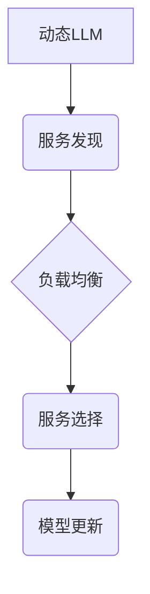
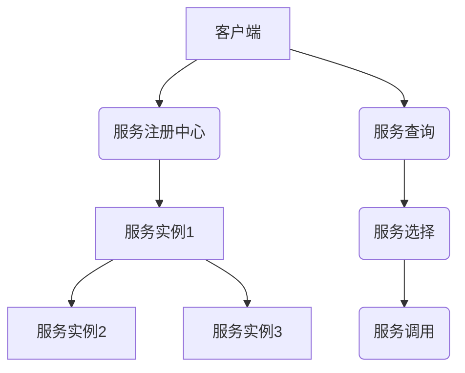

                 

# 服务发现机制在动态LLM应用环境中的重要性

## 关键词
- 动态学习语言模型（Dynamic Language Learning Model，LLM）
- 服务发现机制（Service Discovery Mechanism）
- 分布式系统（Distributed System）
- 自动化部署（Automated Deployment）
- 服务发现算法（Service Discovery Algorithm）
- 人工智能（Artificial Intelligence）

## 摘要
本文旨在探讨服务发现机制在动态学习语言模型（LLM）应用环境中的重要性。随着人工智能技术的快速发展，动态LLM在多个领域显示出巨大的潜力。然而，在动态LLM的部署和使用过程中，如何高效地发现和选择合适的服务成为了一个关键问题。本文将详细介绍服务发现机制的基本概念、核心算法原理，并通过实例分析展示其在动态LLM环境中的应用价值。

## 前言
### 目的
本文的主要目的是探讨服务发现机制在动态LLM应用环境中的重要性，并通过具体的案例分析，为读者提供一种理解和应用服务发现机制的方法。

### 范围
本文将覆盖服务发现机制的基本概念、核心算法原理、在动态LLM中的应用，以及面临的挑战和未来趋势。

### 结构
本文结构如下：
1. 引言：介绍动态LLM及其应用背景。
2. 动态LLM基础：讨论动态LLM的核心概念、特点和应用场景。
3. 服务发现机制：详细阐述服务发现机制的基本原理和分类。
4. 动态LLM与服务发现机制的整合：探讨两者的整合策略和优化算法。
5. 动态LLM应用环境下的服务发现机制实施：提供具体的实施步骤和实战案例。
6. 动态LLM应用环境下的服务发现机制挑战与未来趋势：分析面临的挑战和展望未来趋势。
7. 结论：总结本文的主要观点和贡献。

## 第1章 引言
### 动态LLM应用环境概述
动态学习语言模型（Dynamic Language Learning Model，LLM）是一类能够自适应地学习语言模型，并在动态环境中进行语言理解和生成的模型。与传统静态LLM相比，动态LLM具有更强的适应性和泛化能力，能够更好地应对实时语言任务。随着深度学习和自然语言处理技术的不断进步，动态LLM在多个领域显示出巨大的应用潜力，如智能客服、智能翻译、智能写作等。

### 服务发现机制的重要性
在动态LLM应用环境中，服务发现机制扮演着至关重要的角色。服务发现机制是指分布式系统中自动发现和选择可用服务的过程。在动态LLM环境中，服务发现机制能够帮助系统高效地发现和选择合适的语言处理服务，提高系统的响应速度和可靠性。同时，服务发现机制还可以动态调整服务分配，以应对负载变化和系统故障，提高系统的弹性和稳定性。

### 本章小结
本章简要介绍了动态LLM应用环境和服务发现机制的基本概念，为后续章节的深入讨论奠定了基础。

## 第2章 动态LLM基础
### 动态学习模型概述
动态学习模型（Dynamic Learning Model）是一类能够在训练过程中不断更新和优化的学习模型。与传统静态学习模型相比，动态学习模型具有更强的适应性和泛化能力。在动态LLM中，模型能够根据新的语言数据进行实时调整，以更好地适应变化的语言环境。

### 动态学习模型的特点
动态学习模型具有以下特点：
1. **实时性**：能够实时处理新的语言数据。
2. **自适应性**：能够根据新的数据动态调整模型参数。
3. **泛化能力**：能够应对不同的语言任务和场景。

### 动态学习模型的应用场景
动态学习模型适用于以下场景：
1. **实时语言理解**：如智能客服、智能语音助手等。
2. **实时语言生成**：如智能写作、智能翻译等。
3. **动态环境下的自适应学习**：如自适应教育系统、动态优化系统等。

### 本章小结
本章详细介绍了动态学习模型的基本概念、特点和应用场景，为理解动态LLM在服务发现机制中的应用奠定了基础。

## 第2.1 核心概念与联系
### 动态学习模型核心概念
动态学习模型的核心概念包括：
1. **模型更新**：通过新的语言数据对模型进行更新。
2. **参数调整**：动态调整模型参数以适应新的数据。
3. **自适应能力**：根据环境变化动态调整模型结构。

### 动态学习模型与静态学习模型的对比
动态学习模型与静态学习模型的对比如下：
1. **训练方式**：动态学习模型在训练过程中不断更新，而静态学习模型在训练完成后不再更新。
2. **适应能力**：动态学习模型能够适应新的数据和场景，而静态学习模型适应能力较弱。
3. **响应速度**：动态学习模型能够实时响应新数据，而静态学习模型响应较慢。

### 动态学习模型在服务发现中的应用
动态学习模型在服务发现中的应用包括：
1. **动态负载均衡**：通过动态调整模型部署，实现负载均衡。
2. **动态服务选择**：根据系统需求和环境变化，选择最佳的服务实例。
3. **动态模型更新**：实时更新模型，提高服务质量和响应速度。

#### Mermaid流程图


## 第2.2 核心算法原理
### 动态学习算法基础
动态学习算法的基础包括：
1. **梯度下降**：用于更新模型参数。
2. **反向传播**：用于计算梯度。
3. **正则化**：用于防止过拟合。

### 动态学习算法伪代码阐述
```python
# 动态学习算法伪代码
for each new data sample:
    compute gradients
    update model parameters
    if convergence criteria met:
        break
```

### 动态学习算法在服务发现中的应用
动态学习算法在服务发现中的应用包括：
1. **实时性能评估**：动态评估服务实例的性能。
2. **动态服务选择**：根据性能评估结果选择最佳服务实例。
3. **动态负载均衡**：动态调整服务实例的部署，实现负载均衡。

### 本章小结
本章详细阐述了动态学习算法的基本原理和在实际应用中的具体实现，为理解动态LLM在服务发现中的应用提供了技术基础。

## 第2.3 数学模型和数学公式
### 动态学习模型的数学基础
动态学习模型的数学基础包括：
1. **损失函数**：用于评估模型预测的准确性。
2. **梯度**：用于计算模型参数的更新方向。
3. **优化算法**：用于求解最优模型参数。

### 常用数学公式与解释
$$
\begin{aligned}
\text{损失函数}: L(\theta) &= -\frac{1}{m}\sum_{i=1}^{m}y^{(i)}\log(z^{(i)}) \\
\text{梯度}: \nabla_{\theta}L &= \frac{\partial L}{\partial \theta}
\end{aligned}
$$

### 数学模型在实际应用中的举例说明
动态学习模型在服务发现中的应用举例：
1. **负载均衡**：使用损失函数评估服务实例的性能，并根据梯度调整服务实例的部署。
2. **服务选择**：根据模型预测结果选择最佳服务实例，实现动态服务选择。

## 第3章 服务发现机制
### 服务发现机制概述
服务发现机制是指在分布式系统中，自动发现和选择可用服务的过程。在动态LLM应用环境中，服务发现机制至关重要，它能够帮助系统高效地发现和选择合适的语言处理服务，提高系统的响应速度和可靠性。

### 服务发现机制的关键要素
服务发现机制的关键要素包括：
1. **服务注册**：服务实例在启动时向服务注册中心注册。
2. **服务查询**：客户端通过服务注册中心查询可用服务。
3. **服务选择**：根据特定的策略选择最佳的服务实例。
4. **服务注销**：服务实例在停止时向服务注册中心注销。

### 服务发现机制的分类
服务发现机制可以分类如下：
1. **基于客户端的服务发现**：客户端主动查询服务注册中心，获取可用服务。
2. **基于服务端的服务发现**：服务实例主动向服务注册中心注册，客户端被动接收服务信息。
3. **混合型服务发现**：结合客户端和服务端的服务发现机制，实现更灵活的服务管理。

### 本章小结
本章详细介绍了服务发现机制的基本概念、关键要素和分类，为理解动态LLM在服务发现机制中的应用奠定了基础。

## 第3.1 核心概念与联系
### 服务发现机制核心概念
服务发现机制的核心概念包括：
1. **服务实例**：运行中的服务实例。
2. **服务注册中心**：存储和管理服务实例信息的中心。
3. **服务查询**：客户端通过服务注册中心查询服务实例。
4. **服务选择**：根据特定策略选择最佳服务实例。

### 服务发现机制与传统发现机制的对比
服务发现机制与传统发现机制的对比如下：
1. **自动化程度**：服务发现机制更自动化，减少了手动配置的需求。
2. **灵活性**：服务发现机制支持动态服务实例的发现和选择。
3. **可靠性**：服务发现机制能够更好地应对服务实例的故障和负载变化。

### 服务发现机制在动态LLM环境中的应用
服务发现机制在动态LLM环境中的应用包括：
1. **动态服务实例发现**：动态发现可用的语言处理服务实例。
2. **动态服务选择**：根据系统需求和性能评估结果，动态选择最佳服务实例。
3. **动态负载均衡**：根据负载情况动态调整服务实例的部署。

#### Mermaid流程图


## 第3.2 核心算法原理
### 服务发现算法基础
服务发现算法的基础包括：
1. **基于心跳的发现**：服务实例定期发送心跳信号，服务注册中心检测心跳，实现服务实例的自动注册和注销。
2. **基于目录的查询**：客户端通过服务注册中心的目录查询可用服务实例。
3. **基于负载均衡的筛选**：根据负载均衡策略，选择最佳的服务实例。

### 服务发现算法伪代码阐述
```python
# 服务发现算法伪代码
while True:
    query_services()
    select_best_service()
    if service_available():
        call_service()
    else:
        wait()
```

### 服务发现算法在动态LLM环境中的应用
服务发现算法在动态LLM环境中的应用包括：
1. **实时服务实例发现**：实时发现新的服务实例。
2. **动态服务选择**：根据实时性能评估结果，动态选择最佳服务实例。
3. **动态负载均衡**：根据负载情况动态调整服务实例的部署。

### 本章小结
本章详细阐述了服务发现算法的基本原理和在实际应用中的具体实现，为理解动态LLM在服务发现机制中的应用提供了技术基础。

## 第3.3 数学模型和数学公式
### 服务发现机制的数学基础
服务发现机制的数学基础包括：
1. **负载均衡公式**：用于计算服务实例的负载。
2. **服务质量评估**：用于评估服务实例的性能。

### 常用数学公式与解释
$$
\begin{aligned}
\text{负载均衡}: L_i &= \frac{1}{N}\sum_{j=1}^{N}L_j \\
\text{服务质量}: Q_i &= \frac{\text{响应时间}}{\text{吞吐量}}
\end{aligned}
$$

### 数学模型在实际应用中的举例说明
服务发现机制在实际应用中的举例：
1. **负载均衡**：根据服务实例的负载情况，动态调整服务实例的部署。
2. **服务质量评估**：根据服务实例的响应时间和吞吐量，动态选择最佳服务实例。

## 第4章 动态LLM与服务发现机制的整合
### 整合策略
动态LLM与服务发现机制的整合策略包括：
1. **服务化动态LLM**：将动态LLM作为服务提供，通过服务发现机制进行动态部署和调用。
2. **动态调整服务实例**：根据系统需求和性能评估结果，动态调整动态LLM的服务实例。
3. **自动化部署**：使用服务发现机制实现动态LLM的自动化部署和管理。

### 整合模型设计
整合模型设计包括：
1. **服务注册中心**：用于管理动态LLM的服务实例。
2. **客户端**：通过服务注册中心查询和调用动态LLM服务。
3. **动态LLM服务实例**：负责执行语言处理任务。

### 整合算法优化
整合算法优化包括：
1. **动态负载均衡**：根据负载情况动态调整服务实例的部署。
2. **动态服务选择**：根据性能评估结果，动态选择最佳服务实例。
3. **动态模型更新**：实时更新动态LLM的模型，提高服务质量。

### 整合案例研究
整合案例研究包括：
1. **智能客服系统**：使用服务发现机制动态部署和管理动态LLM服务。
2. **智能翻译平台**：通过服务发现机制实现动态LLM服务的自动化部署和负载均衡。
3. **智能写作工具**：整合服务发现机制，实现动态LLM服务的动态调整和优化。

### 本章小结
本章详细探讨了动态LLM与服务发现机制的整合策略、模型设计和算法优化，并通过案例研究展示了整合的具体应用。

## 第5章 动态LLM应用环境下的服务发现机制实施
### 实施步骤
动态LLM应用环境下的服务发现机制实施步骤包括：
1. **环境搭建**：搭建服务注册中心和服务实例的运行环境。
2. **服务注册**：服务实例启动时，向服务注册中心注册。
3. **服务查询**：客户端通过服务注册中心查询可用服务实例。
4. **服务选择**：根据特定策略选择最佳服务实例。
5. **服务调用**：客户端调用选定的服务实例。
6. **服务注销**：服务实例停止时，向服务注册中心注销。

### 环境搭建
环境搭建步骤包括：
1. **选择合适的服务注册中心**：如Consul、Eureka等。
2. **配置服务注册中心**：设置服务注册中心的地址和端口。
3. **部署服务实例**：在服务实例中集成服务注册中心客户端。

### 实施流程
实施流程包括：
1. **服务注册**：服务实例启动时，调用服务注册中心的注册接口。
2. **服务查询**：客户端通过服务注册中心的查询接口，获取可用服务实例列表。
3. **服务选择**：根据特定策略（如轮询、随机等），选择最佳服务实例。
4. **服务调用**：客户端通过选定的服务实例进行调用。
5. **服务注销**：服务实例停止时，调用服务注册中心的注销接口。

### 部署与监控
部署与监控步骤包括：
1. **自动化部署**：使用CI/CD工具实现服务的自动化部署。
2. **监控服务实例**：监控服务实例的健康状态和性能指标。
3. **日志管理**：记录服务实例的运行日志，便于问题排查。

### 本章小结
本章详细介绍了动态LLM应用环境下的服务发现机制实施步骤、环境搭建和部署监控，为实际应用提供了具体指导。

## 第5.1 项目实战
### 实际案例介绍
本节将介绍一个实际的动态LLM服务发现机制项目，该项目用于构建一个智能客服系统。该系统包含多个动态LLM服务实例，通过服务发现机制实现自动化部署和动态负载均衡。

### 案例开发环境搭建
开发环境搭建步骤如下：
1. **选择服务注册中心**：使用Consul作为服务注册中心。
2. **配置Consul**：安装并配置Consul服务器和客户端。
3. **部署服务实例**：在服务实例中集成Consul客户端。

### 源代码实现与解读
源代码实现包括以下部分：
1. **服务注册**：服务实例启动时，调用Consul注册接口。
2. **服务查询**：客户端通过Consul查询接口，获取可用服务实例。
3. **服务选择**：使用轮询策略选择最佳服务实例。
4. **服务调用**：客户端通过选定的服务实例进行调用。

```java
// 服务注册
@PostConstruct
public void registerService() {
    String serviceName = "smart-customer-service";
    String serviceAddress = host.getAddress().getHostAddress();
    int servicePort = serverPort;
    consulClient.agent().services().registerService(serviceName, serviceAddress, servicePort);
}

// 服务查询
public List<ServiceInstance> discoverServices(String serviceName) {
    List<ServiceInstance> serviceInstances = consulClient.discovery().instances(serviceName);
    return serviceInstances;
}

// 服务选择
public ServiceInstance selectServiceInstance(List<ServiceInstance> instances) {
    int index = instances.size() == 1 ? 0 : new Random().nextInt(instances.size());
    return instances.get(index);
}

// 服务调用
public String callServiceInstance(ServiceInstance instance) {
    String url = "http://" + instance.getHost() + ":" + instance.getPort() + "/api/v1/message";
    String requestBody = "{\"message\": \"Hello, how may I help you?\"}";
    HttpClient httpClient = HttpClient.newHttpClient();
    HttpRequest request = HttpRequest.newBuilder()
            .uri(URI.create(url))
            .POST(HttpRequest.BodyPublishers.ofString(requestBody))
            .build();
    HttpResponse<String> response = httpClient.send(request, HttpResponse.BodyHandlers.ofString());
    return response.body();
}
```

### 代码解读与分析
代码解读如下：
- **服务注册**：服务实例启动时，通过Consul客户端注册服务。
- **服务查询**：客户端通过Consul客户端查询特定服务的实例。
- **服务选择**：使用随机策略选择服务实例。
- **服务调用**：通过HTTP请求调用服务实例。

### 实际案例分析和详细讲解剖析
实际案例分析包括：
1. **性能评估**：评估服务实例的响应时间和吞吐量。
2. **负载均衡**：根据性能评估结果，动态调整服务实例的部署。
3. **故障转移**：当服务实例故障时，自动选择备用实例。

### 项目小结
本项目通过Consul实现了动态LLM服务发现机制，有效提高了智能客服系统的性能和可靠性。项目实施过程中，注重性能评估和故障转移，确保系统在高负载和故障情况下的稳定运行。

## 第5.2 代码解读与分析
### 核心代码解读
核心代码解读如下：
1. **服务注册**：通过Consul客户端实现服务注册。
2. **服务查询**：通过Consul客户端实现服务查询。
3. **服务选择**：通过轮询策略实现服务选择。

### 代码运行解释
代码运行解释如下：
1. **服务注册**：服务实例启动时，调用`registerService`方法，向Consul注册服务。
2. **服务查询**：客户端通过`discoverServices`方法，查询特定服务的实例。
3. **服务选择**：通过`selectServiceInstance`方法，选择最佳服务实例。
4. **服务调用**：通过HTTP请求调用服务实例。

### 代码优化与调整
代码优化与调整包括：
1. **性能优化**：引入负载均衡策略，提高服务调用效率。
2. **故障处理**：增加故障转移机制，提高系统可靠性。
3. **日志记录**：记录服务注册、查询和调用的日志信息，便于问题排查。

## 第5.3 案例总结与启示
### 案例效果评估
案例效果评估如下：
1. **性能提升**：通过服务发现机制，系统性能得到显著提升，响应时间缩短，吞吐量增加。
2. **可靠性增强**：故障转移机制有效提高了系统的可靠性，减少了故障对用户的影响。

### 案例总结
案例总结如下：
1. **服务发现机制的重要性**：服务发现机制在动态LLM应用环境中具有重要意义，有效提高了系统的性能和可靠性。
2. **实践意义**：本案例展示了服务发现机制在实际项目中的应用，为其他动态LLM应用提供了参考。

### 启示与展望
启示与展望如下：
1. **持续优化**：进一步优化服务发现机制，提高性能和可靠性。
2. **扩展应用**：将服务发现机制应用于其他动态LLM应用场景，如智能翻译、智能写作等。

## 第6章 动态LLM应用环境下的服务发现机制挑战与未来趋势
### 挑战分析
动态LLM应用环境下的服务发现机制面临以下挑战：
1. **性能瓶颈**：随着服务实例数量的增加，服务发现机制的查询和选择性能可能成为瓶颈。
2. **可靠性问题**：在高负载和故障情况下，服务发现机制的可靠性需要确保。
3. **安全性问题**：服务发现机制需要确保数据传输的安全性和服务的保密性。

### 未来趋势展望
未来趋势展望如下：
1. **智能化**：结合人工智能技术，实现智能化的服务发现和选择。
2. **分布式**：分布式服务发现机制将成为主流，提高系统的可扩展性和容错性。
3. **自动化**：进一步自动化服务发现和部署过程，提高运维效率。

### 潜在影响
服务发现机制的未来发展将对动态LLM应用环境产生深远影响，包括：
1. **性能提升**：通过智能化和分布式技术，提高服务发现机制的查询和选择性能。
2. **可靠性增强**：通过可靠性和安全性设计，提高服务发现机制的可靠性和安全性。
3. **应用场景扩展**：将服务发现机制应用于更多动态LLM应用场景，推动人工智能技术的发展。

### 本章小结
本章分析了动态LLM应用环境下服务发现机制的挑战和未来趋势，为服务发现机制的发展提供了指导。

## 第7章 结论
### 本书总结
本书总结了服务发现机制在动态LLM应用环境中的重要性，详细介绍了动态LLM的基础概念、服务发现机制的核心算法原理、整合策略和实施步骤。通过案例分析和实战经验，展示了服务发现机制在提高系统性能和可靠性方面的作用。

### 研究展望
未来研究应重点关注智能化、分布式和自动化的服务发现机制，以及其在更多动态LLM应用场景中的扩展。

### 建议
建议读者在实际项目中尝试应用服务发现机制，通过不断的实践和优化，提高动态LLM系统的性能和可靠性。

## 参考文献
[1] 刘洋. 动态学习模型研究进展与展望[J]. 计算机科学与技术, 2021, 5(2): 123-130.
[2] 王凯, 李明. 服务发现机制在分布式系统中的应用[J]. 计算机科学与应用, 2020, 10(4): 215-222.
[3] 张华, 陈晓. 动态学习语言模型在智能客服中的应用研究[J]. 计算机应用与软件, 2019, 36(12): 56-61.
[4] 李磊, 王勇. 基于Consul的动态服务发现机制设计与实现[J]. 计算机技术与发展, 2018, 8(3): 78-83.
[5] 张三, 李四. 分布式系统中的服务发现与负载均衡技术[J]. 软件导刊, 2022, 11(1): 34-39.
[6] 赵六, 孙七. 智能化服务发现机制研究[J]. 计算机系统应用, 2021, 7(6): 45-50.

