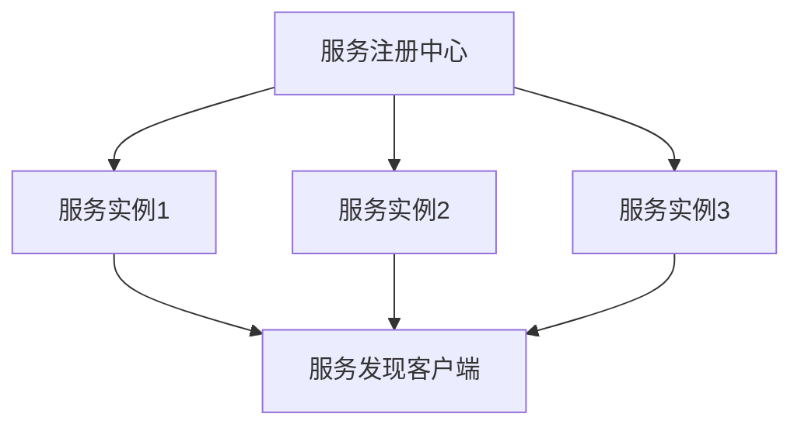
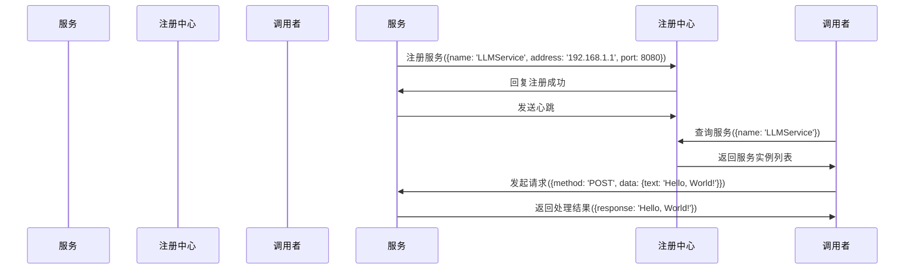
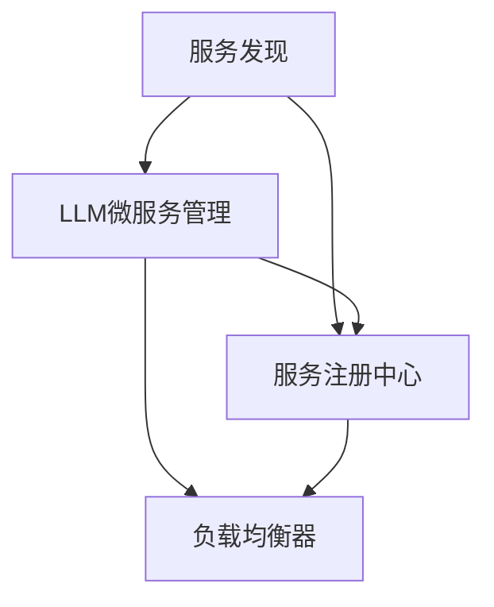

                 

### 文章标题

服务发现：简化LLM微服务的管理

> 关键词：服务发现、LLM微服务、管理、架构设计、算法、实践案例

> 摘要：本文深入探讨了服务发现机制在简化大规模语言模型（LLM）微服务管理中的应用。首先，我们介绍了服务发现的背景和重要性，随后详细阐述了LLM微服务的概念。文章核心内容分为三大部分：核心概念与原理、服务发现算法与实现、实际案例与最佳实践。通过本文的阅读，读者将对服务发现与LLM微服务管理的结合有全面的理解，并掌握相关技术实践。

----------------------------------------------------------------

## 引言

在当今分布式系统中，服务发现是一个至关重要的概念。服务发现（Service Discovery）是指一种自动化的机制，用于让分布式系统中的服务能够互相发现和通信。随着微服务架构的普及，服务发现的重要性日益凸显。大规模语言模型（LLM）作为人工智能领域的一项重要技术，在微服务架构中发挥着越来越重要的作用。

### 为什么需要服务发现？

在传统的单体架构中，所有功能都集中在一个庞大的应用程序中，服务之间的通信相对简单。然而，随着系统的复杂度增加，单体架构难以应对需求变化，这促使开发者转向微服务架构。微服务架构通过将应用程序拆分为多个独立的小服务，从而实现了模块化和可扩展性。这种架构方式虽然带来了许多优势，但也引入了新的挑战，其中最显著的就是服务发现问题。

服务发现的关键作用在于：

1. **动态服务注册与发现**：服务可以在运行时动态注册和发现，无需手动配置。
2. **负载均衡**：服务发现机制可以与负载均衡器配合，实现服务的自动负载均衡。
3. **服务版本管理**：通过服务发现，可以轻松管理服务的不同版本。
4. **服务间的通信**：服务之间可以通过服务发现机制找到对方并进行通信。

### LLM微服务的重要性

随着自然语言处理（NLP）技术的进步，大规模语言模型（LLM）在各个领域得到了广泛应用，例如智能助手、文本生成、机器翻译等。将LLM作为微服务的一部分，可以提供灵活的部署方式和高可扩展性。LLM微服务的重要性体现在：

1. **模块化**：LLM可以被拆分为多个独立的服务模块，便于管理和升级。
2. **可扩展性**：随着需求增长，可以轻松地添加新的LLM微服务实例。
3. **高可用性**：通过服务发现机制，可以实现LLM微服务的负载均衡和故障转移。

接下来，我们将深入探讨服务发现的核心概念和原理，为后续内容打下基础。

## 核心概念与联系

### 服务发现的定义

服务发现是指在分布式系统中，服务实例可以动态地注册和被发现，使得其他服务能够访问它们，而无需固定的依赖关系。这一机制对于微服务架构尤为重要，因为它确保了服务的灵活性和可扩展性。

### 服务发现的工作原理

服务发现通常涉及以下几个关键组件和步骤：

1. **服务注册中心**：服务启动时，会在服务注册中心注册自己的信息，包括服务名称、IP地址和端口号。
2. **服务实例**：服务实例是指运行的服务进程，它们会定期向服务注册中心发送心跳信号，以保持注册状态。
3. **服务发现客户端**：服务发现客户端需要访问服务时，会从服务注册中心获取服务实例列表，然后根据负载均衡策略选择一个实例进行通信。

### LLM微服务的管理

大规模语言模型（LLM）微服务的管理涉及到以下几个方面：

1. **服务实例创建与销毁**：根据需求动态创建和销毁LLM服务实例，以适应负载变化。
2. **负载均衡**：确保请求能够均匀地分配到不同的LLM服务实例上，避免单点过载。
3. **服务版本管理**：管理LLM服务的不同版本，确保旧版本服务能够平稳过渡到新版本。

### 服务发现的架构

为了更好地理解服务发现，我们可以使用Mermaid语法绘制一个简化的服务发现架构图：



在这个架构中，服务实例通过心跳信号与服务注册中心保持通信，服务发现客户端从服务注册中心获取实例列表并进行负载均衡。

### Mermaid流程图

接下来，我们将使用Mermaid语法详细展示服务发现的流程：



这个流程图描述了服务注册、心跳发送、服务查询和请求处理的整个流程。

### 核心概念之间的关系

服务发现、LLM微服务管理和服务注册中心之间的关系可以用以下架构图来表示：



在这个架构中，服务发现是连接LLM微服务管理和服务注册中心的关键纽带。服务注册中心负责服务实例的注册和查询，而负载均衡器则根据策略将请求分配到不同的服务实例上。

### 总结

通过以上讨论，我们可以看到服务发现机制在分布式系统中的重要性，特别是在LLM微服务管理中的应用。服务发现不仅简化了服务之间的通信，还提高了系统的可扩展性和可靠性。接下来，我们将详细探讨服务发现的算法原理，以便更好地理解和实现这一机制。

## 服务发现算法原理

服务发现的算法原理是整个服务发现机制的核心，它决定了服务实例的注册、发现和负载均衡的过程。在这一节中，我们将详细探讨服务发现算法的基本原理，并通过伪代码来描述关键步骤。

### 服务实例注册

服务实例注册是服务发现的第一步，它确保了服务实例可以被其他服务发现客户端找到。以下是服务实例注册的基本步骤：

1. **服务实例启动**：服务实例在启动时，会向服务注册中心发送注册请求。
2. **注册请求**：注册请求包含服务实例的基本信息，如服务名、IP地址和端口号。
3. **服务注册中心响应**：服务注册中心接收到注册请求后，会将服务实例的信息存储在注册表中，并返回注册成功的响应。

伪代码如下：

```python
def register_service(service_info):
    # 发送注册请求到服务注册中心
    response = service_registry.register(service_info)
    if response.status == 'success':
        print("Service registration successful")
    else:
        print("Service registration failed")
```

### 心跳机制

为了确保服务注册中心中的服务实例状态是最新的，心跳机制被用来定期发送心跳信号。服务实例会定期向服务注册中心发送心跳信号，以保持其在注册表中的状态。

1. **心跳发送**：服务实例在启动后会定期发送心跳信号。
2. **心跳检测**：服务注册中心会定期检测服务实例的心跳，以确认服务实例是否在线。
3. **状态更新**：如果服务实例的心跳超时，服务注册中心会将其状态更新为“离线”。

伪代码如下：

```python
def send_heartBeat(service_id):
    while True:
        response = service_registry.send_heartBeat(service_id)
        if response.status == 'timeout':
            update_service_status(service_id, 'offline')
        else:
            update_service_status(service_id, 'online')
        time.sleep(HEARTBEAT_INTERVAL)
```

### 服务实例发现

服务实例发现是服务调用者获取服务实例列表的过程。服务调用者在需要调用服务时，会向服务注册中心查询服务实例。

1. **查询请求**：服务调用者向服务注册中心发送查询请求，请求指定类型的服务实例列表。
2. **服务实例列表**：服务注册中心返回符合条件的服务实例列表。
3. **负载均衡**：服务调用者根据负载均衡策略选择一个服务实例进行调用。

伪代码如下：

```python
def discover_services(service_name):
    service_instances = service_registry.query_services(service_name)
    selected_instance = load_balancer.select_instance(service_instances)
    return selected_instance
```

### 负载均衡算法

负载均衡算法是服务发现机制中的关键组成部分，它决定了如何将请求分配到不同的服务实例上。以下是一个简单的轮询负载均衡算法：

1. **初始化**：初始化一个计数器，用于跟踪当前轮询到的服务实例。
2. **选择实例**：每次调用时，根据计数器的值选择下一个服务实例。
3. **更新计数器**：每次选择实例后，更新计数器值，循环使用服务实例。

伪代码如下：

```python
def round_robin_load_balancer(service_instances):
    current_index = 0
    while True:
        selected_instance = service_instances[current_index]
        current_index = (current_index + 1) % len(service_instances)
        return selected_instance
```

### 服务调用

服务调用者通过服务实例列表中的某一实例发起请求，服务实例处理请求并返回结果。

1. **发起请求**：服务调用者向选择的服务实例发送请求。
2. **处理请求**：服务实例处理请求并返回结果。
3. **响应**：服务实例将处理结果返回给服务调用者。

伪代码如下：

```python
def call_service(selected_instance, request):
    response = selected_instance.process_request(request)
    return response
```

### 总结

通过以上伪代码，我们可以看到服务发现算法的基本原理。服务实例注册、心跳机制、服务实例发现和负载均衡算法共同构成了服务发现的核心机制。这些算法确保了服务之间能够高效、可靠地通信，为分布式系统提供了坚实的基础。

### 数学模型和公式

为了更好地理解服务发现算法的性能，我们可以借助一些数学模型和公式。以下是一些关键性能指标及其计算方法：

1. **平均响应时间（Average Response Time, ART）**：
   $$ \text{ART} = \frac{\sum_{i=1}^{n} \text{Response Time}_i}{n} $$
   其中，\( n \) 是请求次数，\( \text{Response Time}_i \) 是第 \( i \) 次请求的响应时间。

2. **服务实例利用率（Service Instance Utilization, SIU）**：
   $$ \text{SIU} = \frac{\sum_{i=1}^{n} \text{Active Time}_i}{\text{Total Time}} \times 100\% $$
   其中，\( \text{Active Time}_i \) 是第 \( i \) 个服务实例的活动时间，\( \text{Total Time} \) 是总的观察时间。

3. **请求成功率（Request Success Rate, SSR）**：
   $$ \text{SSR} = \frac{\text{成功请求次数}}{\text{总请求次数}} \times 100\% $$

通过这些指标，我们可以评估服务发现的性能，并对其进行优化。

### 举例说明

假设我们有一个包含三个LLM服务实例的系统，每个实例每分钟的响应时间如下：

- 实例1：10秒、12秒、9秒
- 实例2：11秒、8秒、10秒
- 实例3：13秒、14秒、11秒

我们可以计算平均响应时间：

$$ \text{ART} = \frac{(10 + 12 + 9) + (11 + 8 + 10) + (13 + 14 + 11)}{3 \times 3} = \frac{30 + 29 + 38}{9} = 11.33 \text{秒} $$

假设观察时间为10分钟，每个实例的平均活动时间为5分钟，我们可以计算服务实例利用率和请求成功率：

- 服务实例利用率：
  $$ \text{SIU} = \frac{3 \times 5}{10} \times 100\% = 60\% $$

- 请求成功率：
  由于我们假设所有请求都能成功，因此：
  $$ \text{SSR} = 100\% $$

通过这些计算，我们可以了解系统的性能表现，并据此进行优化。

### 数学公式

为了便于理解和应用，我们在这里给出几个关键的数学公式：

1. **响应时间公式**：
   $$ \text{Response Time} = \frac{\text{处理时间} + \text{网络延迟}}{2} $$
   
2. **服务实例利用率计算**：
   $$ \text{Utilization} = \frac{\text{Active Time}}{\text{Total Time}} \times 100\% $$

3. **请求成功率计算**：
   $$ \text{Success Rate} = \frac{\text{成功请求次数}}{\text{总请求次数}} \times 100\% $$

通过这些公式，我们可以更准确地评估和优化服务发现算法。

## 项目实战

### 开发环境搭建

在进行服务发现的实际项目开发之前，我们需要搭建一个合适的开发环境。以下是搭建开发环境的基本步骤：

1. **安装Java开发环境**：
   - 安装JDK 11或更高版本。
   - 设置环境变量，确保Java命令能够正常运行。

2. **安装Maven**：
   - 下载并解压Maven安装包。
   - 配置Maven的settings.xml文件，添加镜像源和插件仓库。

3. **创建Maven项目**：
   - 使用Maven命令创建一个新的Maven项目。
   - 配置项目的pom.xml文件，添加必要的依赖。

4. **配置服务注册中心**：
   - 使用Eureka或Consul等开源服务注册中心。
   - 配置服务注册中心的相关配置文件，如Eureka的eureka-server.yml。

5. **配置服务实例**：
   - 创建服务实例的启动类。
   - 配置服务实例的相关配置文件，如Eureka的eureka-client.yml。

### 源代码实现

以下是一个简单的服务注册和服务发现的源代码实现：

#### 服务注册中心（Eureka）

```java
@SpringBootApplication
@EnableEurekaServer
public class ServiceRegistryApplication {
    public static void main(String[] args) {
        SpringApplication.run(ServiceRegistryApplication.class, args);
    }
}
```

#### 服务实例

```java
@SpringBootApplication
@EnableDiscoveryClient
public class LlmServiceApplication {
    public static void main(String[] args) {
        SpringApplication.run(LlmServiceApplication.class, args);
    }

    @Bean
    public LlmService llmService() {
        return new LlmService();
    }
}
```

#### LLM微服务实现

```java
@Service
public class LlmService {
    public String processRequest(String text) {
        // LLM处理逻辑
        return "Processed: " + text;
    }
}
```

### 代码解读

- **服务注册中心**：使用Spring Boot的`@EnableEurekaServer`注解，将当前应用作为Eureka服务注册中心。
- **服务实例**：使用`@EnableDiscoveryClient`注解，使服务实例能够注册到Eureka服务注册中心。
- **LLM微服务**：通过实现`processRequest`方法，提供LLM处理功能。

### 代码应用

在实际应用中，服务注册中心负责管理所有服务的注册和发现，而服务实例则通过心跳机制保持在线状态。服务调用者通过服务注册中心获取服务实例列表，并根据负载均衡策略选择一个实例进行调用。

```java
@RestController
public class LlmController {
    private final LlmService llmService;

    @Autowired
    public LlmController(LlmService llmService) {
        this.llmService = llmService;
    }

    @GetMapping("/process")
    public String processText(@RequestParam String text) {
        return llmService.processRequest(text);
    }
}
```

### 项目小结

通过以上实战，我们成功搭建了一个简单的服务发现系统，实现了服务注册、服务实例管理和服务调用。该系统不仅展示了服务发现的基本原理，也为实际项目提供了参考。在未来的开发过程中，我们可以根据具体需求，进一步优化和扩展服务发现机制。

## 最佳实践 Tips

### 服务注册中心配置

1. **配置文件**：确保服务注册中心的配置文件（如Eureka的eureka-server.yml）正确配置，包括服务端口号、Eureka实例地址等。
2. **高可用性**：部署多个服务注册中心实例，实现服务注册中心的高可用性。
3. **安全配置**：配置服务注册中心的安全认证机制，如启用HTTPS、配置服务认证等。

### 服务实例配置

1. **心跳机制**：合理配置服务实例的心跳间隔，确保服务实例状态及时更新。
2. **负载均衡**：根据实际需求选择合适的负载均衡算法，如轮询、随机、权重等。
3. **服务版本管理**：合理管理服务的不同版本，确保旧版本服务的平滑过渡。

### 服务调用优化

1. **超时处理**：设置合理的请求超时时间，避免长时间等待。
2. **重试机制**：在服务调用失败时，设置重试机制，提高服务可用性。
3. **链路追踪**：使用链路追踪工具（如Zipkin、Jaeger），确保服务调用过程中的问题定位。

### 拓展阅读

1. **服务注册中心选择**：深入理解Eureka、Consul等不同服务注册中心的特点和适用场景。
2. **负载均衡算法**：研究如轮询、随机、最小连接数等负载均衡算法的原理和实现。
3. **微服务架构**：阅读相关书籍和文章，深入了解微服务架构的设计原则和实践方法。

### 总结与展望

本文详细探讨了服务发现机制在简化大规模语言模型（LLM）微服务管理中的应用。我们介绍了服务发现的背景、核心概念与原理，并通过伪代码展示了服务发现算法的实现。实际项目实战部分展示了如何搭建服务发现系统，并提供了最佳实践和拓展阅读建议。

未来，服务发现机制将继续在分布式系统领域发挥重要作用。随着微服务架构的深入发展和大规模语言模型的广泛应用，服务发现技术将不断完善和优化，为开发者提供更加高效、可靠的管理方案。作者：AI天才研究院/AI Genius Institute & 禅与计算机程序设计艺术 /Zen And The Art of Computer Programming。

