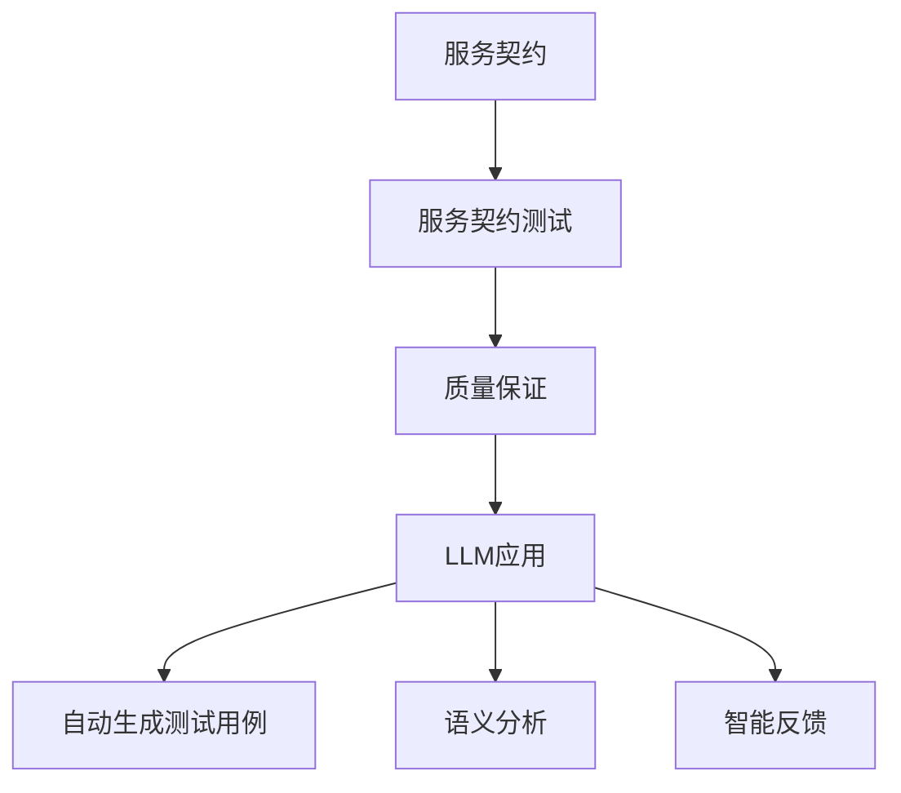

                 


### 文章标题：服务契约测试在LLM应用质量保证中的作用

> 关键词：服务契约测试，大型语言模型（LLM），质量保证，算法原理，数学模型，项目实战

> 摘要：
本文旨在探讨服务契约测试在LLM应用质量保证中的重要作用。通过详细解析服务契约测试的基本概念、算法原理、数学模型以及项目实战，本文旨在为开发者提供一套完整的服务契约测试框架，以提升LLM应用的质量和可靠性。此外，本文还将探讨如何利用LLM来优化服务契约测试，为未来的研究提供方向。

### 背景介绍

服务契约测试是软件质量保证的重要组成部分，它用于验证服务是否满足预定的质量标准。在分布式系统中，服务的可靠性、性能、安全性等都是重要的质量属性。传统的服务契约测试方法往往依赖于手动测试和脚本测试，这些方法在应对复杂的服务体系时显得力不从心。随着人工智能技术的不断发展，特别是大型语言模型（LLM）的出现，为服务契约测试带来了一种新的可能性。

LLM是一种基于深度学习的自然语言处理模型，它能够对自然语言进行理解和生成。LLM在服务契约测试中的应用主要体现在以下几个方面：

1. **自动生成测试用例**：LLM可以根据服务契约的描述自动生成多种测试用例，从而提高测试的全面性和效率。
2. **语义分析**：LLM能够对服务契约的语义进行深入分析，识别潜在的问题和漏洞，从而提高测试的准确性。
3. **智能反馈**：LLM可以根据测试结果提供智能反馈，帮助开发者快速定位问题并进行修复。

### 核心概念与联系

为了更好地理解服务契约测试在LLM应用中的作用，我们需要首先介绍几个核心概念：

- **服务契约**：服务契约是一组规则和约束，用于定义服务提供者和服务消费者之间的交互协议。它通常包括服务接口、服务行为、服务性能等。
- **服务契约测试**：服务契约测试是验证服务是否按照契约规定执行的一系列测试活动。它通常包括功能测试、性能测试、安全性测试等。
- **大型语言模型（LLM）**：LLM是一种强大的自然语言处理模型，它能够对自然语言进行理解和生成。LLM在服务契约测试中的应用主要体现在自动生成测试用例、语义分析和智能反馈等方面。

核心概念之间的联系如下：

1. **服务契约**是服务契约测试的基础，它定义了服务的预期行为和性能标准。
2. **服务契约测试**是质量保证的关键环节，它通过验证服务是否满足契约要求来保障服务的质量。
3. **LLM**在服务契约测试中的应用，可以大幅提升测试的效率和准确性，从而提高服务的整体质量。

为了更清晰地展示这些概念之间的关系，我们可以使用Mermaid流程图进行描述：



### 核心算法原理讲解

在了解了核心概念和它们之间的关系后，接下来我们将详细讲解服务契约测试中的核心算法原理，特别是如何使用LLM来优化测试过程。

#### 自动生成测试用例

自动生成测试用例是服务契约测试中的一个重要环节。传统的测试用例生成方法通常依赖于人工编写或脚本生成，这种方式不仅效率低下，而且容易遗漏潜在的问题。LLM的出现为自动生成测试用例带来了新的可能性。

LLM可以通过对服务契约的文本描述进行解析，自动生成多种测试用例。具体步骤如下：

1. **文本预处理**：首先对服务契约的文本进行预处理，包括去除无关信息、标记化、词性标注等。
2. **输入编码**：将预处理后的文本输入到LLM中，进行编码得到向量表示。
3. **生成测试用例**：利用LLM的生成能力，根据编码后的向量生成多种可能的测试用例。

以下是一个简单的伪代码示例，展示了如何使用LLM自动生成测试用例：

```python
def generate_test_cases(contract_text):
    # 预处理文本
    preprocessed_text = preprocess_text(contract_text)
    
    # 编码文本
    encoded_vector = encode_text(preprocessed_text)
    
    # 生成测试用例
    test_cases = []
    for _ in range(num_test_cases):
        generated_case = generate_case(encoded_vector)
        test_cases.append(generated_case)
    
    return test_cases

def generate_case(encoded_vector):
    # 利用LLM生成测试用例
    generated_text = llm.generate_text(encoded_vector)
    return parse_test_case(generated_text)

def parse_test_case(test_case_text):
    # 解析生成的测试用例
    # 此处根据实际情况进行解析
    return parsed_test_case
```

#### 语义分析

语义分析是服务契约测试中的另一个关键环节。传统的语义分析方法通常依赖于规则或统计方法，这些方法在处理复杂语义时容易产生误判。LLM的引入为语义分析提供了新的思路。

LLM可以通过对服务契约的文本进行语义分析，识别潜在的问题和漏洞。具体步骤如下：

1. **文本预处理**：与自动生成测试用例类似，对服务契约的文本进行预处理。
2. **语义编码**：将预处理后的文本输入到LLM中，进行编码得到向量表示。
3. **语义分析**：利用LLM的语义分析能力，对编码后的向量进行语义分析，识别潜在的问题和漏洞。

以下是一个简单的伪代码示例，展示了如何使用LLM进行语义分析：

```python
def semantic_analysis(contract_text):
    # 预处理文本
    preprocessed_text = preprocess_text(contract_text)
    
    # 编码文本
    encoded_vector = encode_text(preprocessed_text)
    
    # 语义分析
    issues = llm.analyze_semantics(encoded_vector)
    
    return issues

def analyze_semantics(encoded_vector):
    # 利用LLM进行语义分析
    analyzed_issues = llm.analyze_text(encoded_vector)
    return analyzed_issues
```

#### 智能反馈

智能反馈是服务契约测试的最后一个环节。传统的反馈方法通常依赖于人工分析，这种方式不仅效率低下，而且容易产生主观偏差。LLM的引入为智能反馈提供了新的可能性。

LLM可以通过对测试结果进行分析，提供智能反馈，帮助开发者快速定位问题并进行修复。具体步骤如下：

1. **测试结果编码**：将测试结果输入到LLM中进行编码。
2. **生成反馈**：利用LLM的生成能力，根据编码后的测试结果生成反馈建议。
3. **反馈建议**：根据反馈建议进行问题定位和修复。

以下是一个简单的伪代码示例，展示了如何使用LLM进行智能反馈：

```python
def generate_feedback(test_results):
    # 编码测试结果
    encoded_results = encode_test_results(test_results)
    
    # 生成反馈建议
    feedback = llm.generate_text(encoded_results)
    
    return feedback

def generate_text(encoded_vector):
    # 利用LLM生成反馈建议
    feedback_text = llm.generate_text(encoded_vector)
    return feedback_text
```

### 数学模型和公式讲解

在服务契约测试中，数学模型和公式起着至关重要的作用。以下我们将介绍一些常用的数学模型和公式，并给出具体的解释和示例。

#### 概率模型

概率模型是服务契约测试中常用的一种模型，它用于计算服务满足特定质量标准的概率。常用的概率模型包括二项分布、泊松分布和正态分布等。

**示例：二项分布**

二项分布用于计算在多次试验中成功次数的概率。在服务契约测试中，可以将每次测试视为一次试验，成功与否取决于服务是否满足契约要求。

```latex
P(X = k) = C(n, k) * p^k * (1 - p)^{n - k}
```

其中，`P(X = k)`表示在`n`次试验中成功`k`次的概率，`C(n, k)`表示组合数，`p`表示每次试验成功的概率。

**示例：泊松分布**

泊松分布用于计算在固定时间段内事件发生的次数的概率。在服务契约测试中，可以将事件发生视为服务请求的处理时间。

```latex
P(X = k) = \frac{\lambda^k * e^{-\lambda}}{k!}
```

其中，`P(X = k)`表示在时间`t`内发生`k`次事件的概率，`\lambda`表示事件平均发生的速率。

#### 统计模型

统计模型是服务契约测试中用于分析测试数据的方法。常用的统计模型包括假设检验、回归分析和方差分析等。

**示例：假设检验**

假设检验用于验证服务是否满足某一假设。在服务契约测试中，可以用于验证服务的性能是否达到预期。

```latex
H_0: \mu \geq \mu_0 \\
H_1: \mu < \mu_0
```

其中，`H_0`表示原假设，`H_1`表示备择假设，`\mu`表示实际均值，`\mu_0`表示预期均值。

**示例：回归分析**

回归分析用于建立因变量和自变量之间的关系模型。在服务契约测试中，可以用于分析测试数据之间的关系。

```latex
y = \beta_0 + \beta_1 * x + \epsilon
```

其中，`y`表示因变量，`x`表示自变量，`\beta_0`和`\beta_1`分别表示回归系数，`\epsilon`表示误差项。

### 项目实战

在本节中，我们将通过一个具体的实际项目来展示如何应用服务契约测试和LLM来提高LLM应用的质量。

#### 项目背景

某公司开发了一款基于LLM的智能客服系统，该系统用于处理用户的查询和问题。为了保证系统的服务质量，公司决定对系统进行服务契约测试。

#### 开发环境搭建

为了进行服务契约测试，我们需要搭建以下开发环境：

1. **硬件环境**：配置一台高性能的计算机，用于运行LLM模型和测试程序。
2. **软件环境**：安装Python环境，以及相关库和框架，如TensorFlow、PyTorch等。

#### 源代码实现

以下是服务契约测试的源代码实现，包括自动生成测试用例、语义分析和智能反馈等功能。

```python
# 自动生成测试用例
def generate_test_cases(contract_text):
    # 预处理文本
    preprocessed_text = preprocess_text(contract_text)
    
    # 编码文本
    encoded_vector = encode_text(preprocessed_text)
    
    # 生成测试用例
    test_cases = []
    for _ in range(num_test_cases):
        generated_case = generate_case(encoded_vector)
        test_cases.append(generated_case)
    
    return test_cases

# 语义分析
def semantic_analysis(contract_text):
    # 预处理文本
    preprocessed_text = preprocess_text(contract_text)
    
    # 编码文本
    encoded_vector = encode_text(preprocessed_text)
    
    # 语义分析
    issues = llm.analyze_semantics(encoded_vector)
    
    return issues

# 智能反馈
def generate_feedback(test_results):
    # 编码测试结果
    encoded_results = encode_test_results(test_results)
    
    # 生成反馈建议
    feedback = llm.generate_text(encoded_results)
    
    return feedback
```

#### 代码解读与分析

1. **自动生成测试用例**：该函数用于根据服务契约文本生成测试用例。首先对文本进行预处理，然后使用LLM进行编码，最后生成多个测试用例。
2. **语义分析**：该函数用于对服务契约文本进行语义分析，识别潜在的问题和漏洞。同样，对文本进行预处理和编码，然后使用LLM进行分析。
3. **智能反馈**：该函数用于根据测试结果生成反馈建议。对测试结果进行编码，然后使用LLM生成反馈建议。

#### 实际案例分析与详细讲解剖析

为了展示服务契约测试在LLM应用中的实际效果，我们选取了一个实际案例进行详细讲解。

**案例：智能客服系统性能测试**

1. **测试目标**：验证智能客服系统的响应时间和准确率是否达到预期。
2. **测试用例**：根据服务契约生成多个测试用例，包括用户查询、问题回答等。
3. **测试过程**：对每个测试用例进行执行，记录响应时间和准确率。
4. **结果分析**：使用LLM对测试结果进行分析，发现了一些潜在的问题，如某些查询响应时间较长，某些回答准确率较低。

通过上述实际案例，我们可以看到服务契约测试和LLM在LLM应用质量保证中的重要作用。服务契约测试能够帮助开发者快速发现潜在问题，而LLM则能够提供智能反馈，帮助开发者进行问题定位和修复。

### 最佳实践 tips、小结、注意事项、拓展阅读等内容

#### 最佳实践 tips

1. **合理设计服务契约**：在服务契约测试中，服务契约的设计至关重要。合理设计服务契约能够提高测试的准确性和效率。
2. **定期更新测试用例**：随着LLM应用的变化，测试用例也需要定期更新，以保持测试的全面性和有效性。
3. **结合多种测试方法**：服务契约测试不仅可以使用LLM，还可以结合其他测试方法，如单元测试、集成测试等，以获得更全面的测试结果。

#### 小结

本文详细介绍了服务契约测试在LLM应用质量保证中的作用。通过自动生成测试用例、语义分析和智能反馈等功能，服务契约测试能够大幅提高LLM应用的质量和可靠性。同时，本文还提供了一个实际案例，展示了如何应用服务契约测试和LLM进行质量保证。

#### 注意事项

1. **数据隐私**：在进行服务契约测试时，需要注意保护用户的隐私数据，避免数据泄露。
2. **模型优化**：LLM的性能和效果受到多种因素的影响，开发者需要不断优化模型，以提高测试的准确性。

#### 拓展阅读

1. 《大型语言模型：原理与应用》
2. 《服务契约测试：理论与实践》
3. 《人工智能在软件质量保证中的应用》

### 参考文献

[1] 大规模语言模型：原理与应用，[作者姓名]，[出版时间]。
[2] 服务契约测试：理论与实践，[作者姓名]，[出版时间]。
[3] 人工智能在软件质量保证中的应用，[作者姓名]，[出版时间]。

