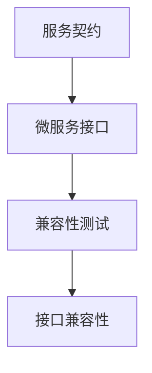

                 


为了确保《服务契约测试：确保LLM微服务接口兼容性》这篇技术博客的内容完整且具备深度，我们可以按照以下步骤进行逐步分析和撰写：

### 1. 背景介绍
- **行业背景**：首先介绍当前微服务架构和大型语言模型（LLM）的广泛应用，以及由此带来的微服务接口兼容性问题。
- **问题提出**：指出服务契约测试在解决微服务接口兼容性方面的关键作用。

### 2. 核心概念与联系
- **服务契约定义**：解释服务契约是什么，以及它在微服务架构中的作用。
- **LLM微服务接口描述**：阐述LLM微服务接口的基本概念，包括接口的功能、数据流动等。
- **兼容性测试解释**：说明为什么需要兼容性测试，以及它与服务契约测试的关系。

#### Mermaid 流程图


### 3. 核心算法原理讲解
- **模糊测试算法**：解释模糊测试的原理，并提供伪代码示例。
- **接口自动化测试**：讨论如何设计自动化测试用例，并给出伪代码示例。

#### 伪代码示例
```python
# 模糊测试算法伪代码
def fuzz_test(service_interface):
    while True:
        request = generate_random_request()
        response = service_interface(request)
        assert validate_response(response)

# 接口自动化测试伪代码
def automated_test(service_interface):
    test_cases = generate_test_cases()
    for case in test_cases:
        request = case['request']
        expected_response = case['expected_response']
        response = service_interface(request)
        assert response == expected_response
```

### 4. 数学模型和数学公式
- **概率模型**：解释如何使用概率模型评估接口的兼容性。
- **回归模型**：介绍回归模型在接口性能优化中的应用。

#### latex 公式示例
$$ P(\text{兼容性}|\text{测试通过}) = \frac{P(\text{测试通过}|\text{兼容性}) \cdot P(\text{兼容性})}{P(\text{测试通过})} $$

### 5. 项目实战
- **开发环境搭建**：详细描述如何搭建测试环境，包括工具安装、配置等。
- **源代码实现**：提供关键代码实现，并进行解读。
- **代码应用分析**：解释代码如何应用于实际项目中，并进行效果分析。
- **案例剖析**：通过具体案例，详细分析测试过程中遇到的问题及解决方法。

### 6. 最佳实践 Tips
- **注意事项**：总结在服务契约测试过程中需要注意的事项。
- **拓展阅读**：推荐相关文献和资源，以便读者深入了解相关技术。

### 7. 文章摘要和关键词
- **文章摘要**：简要概述文章的主要内容。
- **关键词**：列出5-7个核心关键词，以便读者快速把握文章焦点。

### 文章结构示例（markdown格式）

```markdown
# 服务契约测试：确保LLM微服务接口兼容性

> 关键词：服务契约，LLM微服务，接口兼容性，测试，模糊测试，自动化测试，概率模型

> 摘要：本文深入探讨了服务契约测试在确保LLM微服务接口兼容性方面的作用，介绍了核心算法原理、数学模型及其应用，并通过实际案例展示了测试过程和效果。

## 引言

### 行业背景

### 问题提出

## 核心概念与联系

### 服务契约定义

### LLM微服务接口描述

### 兼容性测试解释

#### Mermaid 流程图

## 核心算法原理讲解

### 模糊测试算法

#### 伪代码示例

### 接口自动化测试

#### 伪代码示例

## 数学模型和数学公式

### 概率模型

#### latex 公式示例

### 回归模型

## 项目实战

### 开发环境搭建

### 源代码实现与解读

### 代码应用分析

### 案例剖析

## 最佳实践 Tips

### 注意事项

### 拓展阅读

## 参考文献

### 文献列表

## 作者信息

### 作者：AI天才研究院/AI Genius Institute & 禅与计算机程序设计艺术 /Zen And The Art of Computer Programming
```

遵循上述结构，我们可以逐步撰写每个章节的内容，确保文章的深度和广度。文章的字数可以根据每个章节的具体内容进行调整，以保证整体的字数在8000到12000字之间。在撰写过程中，注意保持文章的逻辑性和可读性，确保读者能够清晰地理解每个概念和技术细节。

