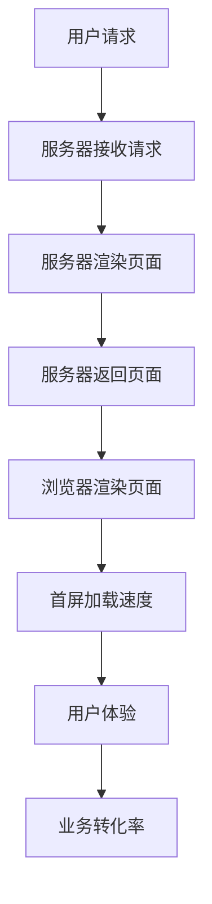

                 

### 引言

#### 1.1 研究背景

近年来，大型语言模型（LLM，Large Language Model）在自然语言处理（NLP，Natural Language Processing）领域取得了显著的进展。LLM能够对文本进行理解和生成，广泛应用于聊天机器人、内容审核、智能助手等场景。然而，随着LLM规模的不断增长，其服务端渲染带来的首屏加载速度问题愈发突出。对于用户来说，首屏加载速度是影响用户体验的重要因素，过慢的加载速度会导致用户流失和用户体验下降。

服务端渲染（Server-Side Rendering, SSR）是一种将网页内容在服务器端完成渲染的技术。与传统客户端渲染（Client-Side Rendering, CSR）相比，SSR能够提高首屏加载速度，提升用户体验。然而，随着LLM的应用越来越广泛，传统的SSR技术已无法满足大规模、高性能的需求。因此，如何通过优化服务端渲染来提升LLM应用的首屏加载速度成为一个重要课题。

#### 1.2 首屏加载速度的重要性

首屏加载速度是衡量网站性能的关键指标之一。它直接影响到用户的初始体验和后续的留存率。根据Google的研究，页面加载时间超过3秒可能会导致转化率下降20%以上。对于依赖广告收入的网站来说，提升首屏加载速度不仅能提高用户体验，还能增加广告收入。

对于LLM应用，首屏加载速度尤为重要。由于LLM应用通常涉及大量的文本处理和计算，其加载时间往往比普通网页更长。如果首屏加载速度过慢，用户可能会感到不耐烦，从而放弃使用。此外，LLM应用通常需要实时响应用户的输入，如果响应速度较慢，用户体验会大打折扣。

#### 1.3 研究目的与意义

本文旨在探讨如何通过优化服务端渲染来提升LLM应用的首屏加载速度。具体研究内容包括：

1. **LLM与首屏加载速度的基础知识**：介绍LLM的基本概念和首屏加载速度的定义及其影响因素。
2. **服务端渲染的优化策略**：分析服务端渲染的优化方法，如代码分割、懒加载、CDN加速等。
3. **LLM服务端渲染的性能提升**：探讨LLM性能优化方法，如模型压缩、量化、并行化等。
4. **首屏加载速度的提升实践**：介绍首屏加载速度的提升实践，包括开发环境搭建、模型选择与训练、服务端渲染实现等。
5. **性能监测与优化**：介绍如何对LLM应用进行性能监测和优化。

本文的研究意义在于：

1. **提高LLM应用的性能**：通过优化服务端渲染，提高LLM应用的首屏加载速度，提升用户体验。
2. **推动NLP技术的发展**：本文的研究成果将为NLP领域的发展提供新的思路和方法。
3. **促进互联网行业的发展**：优化LLM应用的首屏加载速度，将有助于提高整个互联网行业的用户体验和竞争力。

通过本文的研究，我们期望能够为LLM应用的开发者提供有价值的参考，帮助他们在实际开发中提高应用性能，提升用户体验。

### 第1章 LLM与首屏加载速度基础

#### 1.1 LLM概述

##### 1.1.1 语言模型的定义与分类

语言模型（Language Model, LM）是一种统计模型，用于对自然语言进行建模和预测。它通过对大量文本数据的学习，能够生成符合语言习惯的文本序列。语言模型广泛应用于自然语言处理、机器翻译、语音识别、信息检索等领域。

根据模型的结构和训练方法，语言模型可以分为以下几类：

1. **N-gram模型**：基于词频统计的模型，通过计算词组在文本中出现的频率来预测下一个词。N-gram模型简单高效，但在长文本中表现较差。

2. **循环神经网络（RNN）模型**：通过循环机制对历史信息进行记忆，能够处理较长的文本序列。RNN在语音识别和机器翻译等领域取得了显著成果。

3. **长短期记忆网络（LSTM）模型**：LSTM是RNN的一种变体，通过引入门控机制来缓解梯度消失问题，能够更好地处理长文本序列。

4. **Transformer模型**：基于自注意力机制的模型，能够并行处理文本序列，并在大规模文本处理任务中表现出色。BERT、GPT等大型语言模型都是基于Transformer架构。

##### 1.1.2 LLM的工作原理

语言模型的工作原理主要包括三个步骤：输入编码、模型预测和输出解码。

1. **输入编码**：将输入文本转换为模型能够处理的向量表示。常用的编码方法包括Word Embedding（将词映射到高维向量空间）和Subword Embedding（将词拆分为子词进行编码）。

2. **模型预测**：基于输入编码的向量，模型通过计算概率分布来预测下一个词。在训练阶段，模型通过反向传播算法不断调整参数，以最小化损失函数。

3. **输出解码**：将模型预测的概率分布转换为具体的文本输出。常用的解码策略包括 greedy decoding（选择概率最大的词作为输出）和 beam search（在多个候选词中搜索最优解）。

##### 1.1.3 LLM的关键技术

语言模型的关键技术包括模型压缩、量化、并行化等。

1. **模型压缩**：通过减小模型参数的大小，降低模型的计算复杂度和存储需求。常用的压缩方法包括权重剪枝、量化、知识蒸馏等。

2. **量化**：将浮点数参数转换为整数参数，以减少模型存储和计算的开销。量化方法包括符号量化、渐增量化、按层量化等。

3. **并行化**：通过并行计算来提高模型的训练和推理速度。并行化方法包括数据并行、模型并行、算法并行等。

#### 1.2 首屏加载速度的基础知识

##### 1.2.1 首屏加载速度的定义与衡量

首屏加载速度（First Contentful Paint, FCP）是指从用户发起请求到网页开始显示内容的时间。它反映了网页的初始加载速度，是衡量用户体验的重要指标。根据Google的Web Vitals，理想的首屏加载速度应在1秒以内。

首屏加载速度可以通过以下指标进行衡量：

1. **首屏内容加载时间**：从请求发送到首屏内容（如HTML、CSS和JavaScript文件）开始显示的时间。

2. **首屏渲染时间**：从请求发送到首屏内容完全渲染的时间。

3. **首屏时间到交互**：从请求发送到用户可以与首屏内容进行交互的时间。

##### 1.2.2 影响首屏加载速度的主要因素

首屏加载速度受到多种因素的影响，包括：

1. **网络延迟**：用户与服务器之间的网络延迟会影响页面的加载时间。

2. **资源大小**：页面中加载的资源（如HTML、CSS、JavaScript文件和图片）的大小会影响加载速度。

3. **请求次数**：页面中发出的请求次数会影响加载速度。减少请求次数可以加快加载速度。

4. **渲染效率**：浏览器的渲染效率和服务器端的处理速度会影响加载速度。

##### 1.2.3 提高首屏加载速度的重要性

提高首屏加载速度对用户体验和业务转化率具有重要意义：

1. **提升用户体验**：快速的首屏加载速度可以提供更好的用户体验，减少用户等待时间，提高用户满意度。

2. **增加转化率**：首屏加载速度直接影响用户的决策和参与度。加快加载速度可以增加用户在页面停留的时间，提高转化率。

3. **提高搜索引擎排名**：Google等搜索引擎将页面加载速度作为排名因素之一。提高首屏加载速度可以提升网站在搜索结果中的排名。

#### 1.3 LLM与首屏加载速度的关系架构 Mermaid 流程图

为了更好地理解LLM与首屏加载速度之间的关系，可以使用Mermaid流程图进行展示。以下是LLM与首屏加载速度关系的Mermaid流程图：



在这个流程图中，用户请求经过服务器处理，服务器进行页面渲染并返回给浏览器。浏览器接收页面并开始渲染，首屏加载速度直接影响到用户体验和业务转化率。

#### 1.4 小结

本章介绍了LLM的基本概念、工作原理以及首屏加载速度的基础知识。LLM作为自然语言处理的核心技术，其应用在服务端渲染中面临着首屏加载速度的问题。通过本章的学习，读者可以了解LLM的基本原理以及如何通过优化服务端渲染来提升首屏加载速度。

### 第2章 服务端渲染的优化策略

#### 2.1 服务端渲染简介

##### 2.1.1 服务端渲染的概念

服务端渲染（Server-Side Rendering, SSR）是一种在服务器端完成网页内容渲染的技术。与客户端渲染（Client-Side Rendering, CSR）不同，SSR在服务器端将网页内容渲染为HTML、CSS和JavaScript等资源，然后将渲染后的完整网页发送给客户端浏览器。客户端浏览器接收到的网页已经包含了全部的内容，因此可以直接进行渲染，无需再进行任何处理。

##### 2.1.2 服务端渲染的优势与挑战

服务端渲染具有以下优势：

1. **提升首屏加载速度**：由于服务端渲染生成的网页已经包含了全部内容，客户端浏览器可以立即开始渲染，从而加快首屏加载速度，提高用户体验。

2. **更好的搜索引擎优化（SEO）**：服务端渲染生成的网页是完整的HTML代码，有利于搜索引擎爬虫抓取和索引，从而提高网站的搜索引擎排名。

3. **减少浏览器解析时间**：服务端渲染可以减少客户端浏览器的解析时间，因为客户端不需要解析JavaScript代码来渲染网页内容。

然而，服务端渲染也面临以下挑战：

1. **服务器压力增大**：由于服务端需要处理渲染任务，服务器压力会增大，尤其是在高并发场景下，服务器可能无法承受大量请求的处理。

2. **延迟响应**：服务端渲染需要服务器完成渲染任务后再将结果返回给客户端，这可能会导致一定的延迟，尤其是在服务器处理速度较慢的情况下。

##### 2.1.3 服务端渲染的发展趋势

随着Web技术的不断发展，服务端渲染也在不断演进。以下是一些服务端渲染的发展趋势：

1. **异步渲染**：异步渲染（Asynchronous Rendering）是一种在服务器端部分完成渲染，然后将未渲染的部分交给客户端浏览器继续渲染的技术。这种方式可以减少服务器的负载，提高响应速度。

2. **静态站点生成器（SSG）**：静态站点生成器（Static Site Generator, SSG）是一种在构建网站时生成静态HTML文件的服务端技术。SSG生成的静态网站具有加载速度快、SEO性能好的优点。

3. **静态站点生成与动态内容结合**：将静态站点生成器与动态内容管理系统（CMS）相结合，可以实现静态站点的高效渲染和动态内容的灵活更新。

#### 2.2 优化策略分析

为了提升服务端渲染的性能，可以采取以下优化策略：

##### 2.2.1 代码分割

代码分割（Code Splitting）是一种将JavaScript代码拆分为多个小块的技术，每个小块可以独立加载。通过代码分割，可以按需加载不同的代码块，从而减少初始加载时间。

**优化过程：**

1. **分析代码依赖关系**：根据模块的依赖关系，将代码拆分为多个独立的代码块。

2. **动态加载**：在用户访问网页时，按需加载不同的代码块。

**伪代码示例：**

```javascript
function loadModule(moduleName) {
  return fetch(`/scripts/${moduleName}.js`)
    .then(response => response.text())
    .then(text => {
      eval(text);
      return moduleName;
    });
}

loadModule('moduleA').then(() => {
  console.log('Module A loaded');
});

loadModule('moduleB').then(() => {
  console.log('Module B loaded');
});
```

##### 2.2.2 懒加载

懒加载（Lazy Loading）是一种按需加载资源的技术，可以减少初始加载时间。在懒加载中，只有当用户需要访问某个资源时，才会加载该资源。

**优化过程：**

1. **检测用户行为**：根据用户的行为，判断何时需要加载资源。

2. **延迟加载**：在用户需要访问资源时，再加载该资源。

**伪代码示例：**

```javascript
function lazyLoadImage(imageSrc) {
  const img = new Image();
  img.src = imageSrc;
  img.onload = () => {
    console.log('Image loaded:', imageSrc);
  };
}

lazyLoadImage('/images/avatar.jpg');
```

##### 2.2.3 CDN加速

内容分发网络（Content Delivery Network, CDN）是一种分布式网络，用于加速资源的传输。通过CDN，可以将资源缓存到全球多个节点，用户可以从距离最近的节点获取资源，从而减少加载时间。

**优化过程：**

1. **选择合适的CDN服务提供商**：根据业务需求，选择适合的CDN服务提供商。

2. **配置CDN缓存**：将静态资源配置为CDN缓存，以便快速分发。

**伪代码示例：**

```javascript
const cdnUrl = 'https://cdn.example.com/';

fetch(cdnUrl + 'styles/main.css')
  .then(response => response.text())
  .then(text => {
    document.write('<style>' + text + '</style>');
  });

fetch(cdnUrl + 'scripts/main.js')
  .then(response => response.text())
  .then(text => {
    document.write('<script>' + text + '</script>');
  });
```

##### 2.2.4 HTTP/2

HTTP/2是一种新的Web协议，相对于HTTP/1.1，它具有以下优势：

1. **多路复用**：HTTP/2支持多路复用，多个请求可以同时发送和接收，从而减少延迟。

2. **头部压缩**：HTTP/2对请求和响应的头部进行压缩，减少了传输的数据量。

3. **服务器推送**：HTTP/2支持服务器推送，服务器可以主动向客户端推送资源，从而减少加载时间。

**优化过程：**

1. **升级Web服务器**：将Web服务器升级到支持HTTP/2的版本。

2. **配置HTTP/2**：在Web服务器配置中启用HTTP/2。

**伪代码示例：**

```http
Server: example.com
HTTP/2
Connection: keep-alive
Date: Wed, 15 Nov 2023 10:30:00 GMT
Content-Type: text/html

<!DOCTYPE html>
<html>
  <head>
    <title>Example</title>
  </head>
  <body>
    <h1>Hello, World!</h1>
  </body>
</html>
```

通过以上优化策略，可以显著提升服务端渲染的性能，加快首屏加载速度，从而提高用户体验。

#### 2.3 小结

本章详细介绍了服务端渲染的概念、优势与挑战，并分析了代码分割、懒加载、CDN加速和HTTP/2等优化策略。通过实施这些优化策略，可以有效提升服务端渲染的性能，加快首屏加载速度，从而提高用户体验和业务转化率。

### 第3章 LLM服务端渲染的性能提升

#### 3.1 LLM性能优化方法

##### 3.1.1 模型压缩

模型压缩是一种通过减小模型参数大小来提高模型性能的方法。在LLM服务端渲染中，模型压缩有助于减少服务器负载，提高加载速度。以下是一些常用的模型压缩方法：

1. **权重剪枝（Weight Pruning）**：通过去除模型中的冗余权重来减少模型大小。权重剪枝可以通过设定阈值来删除绝对值较小的权重。

2. **量化（Quantization）**：将浮点数参数转换为整数参数，从而减少模型大小和计算复杂度。量化方法包括符号量化、渐增量化、按层量化等。

3. **知识蒸馏（Knowledge Distillation）**：通过将大型模型（教师模型）的知识传递给小型模型（学生模型），来减小模型大小和提高性能。知识蒸馏通过训练学生模型来最小化教师模型的输出和学生的输出之间的差距。

**优化过程：**

1. **权重剪枝**：设定阈值，对模型权重进行排序，删除绝对值较小的权重。

2. **量化**：选择合适的量化方法，对模型参数进行转换。

3. **知识蒸馏**：训练教师模型和学生模型，通过最小化教师模型的输出和学生的输出之间的差距来传递知识。

**伪代码示例（权重剪枝）：**

```python
def prune_weights(threshold):
    sorted_weights = sorted(model.weights, key=lambda x: abs(x))
    pruned_weights = [w for w in sorted_weights if abs(w) > threshold]
    model.weights = pruned_weights
```

##### 3.1.2 模型并行化

模型并行化是一种通过并行计算来提高模型性能的方法。在LLM服务端渲染中，模型并行化可以加快模型训练和推理速度，提高服务器效率。以下是一些常用的模型并行化方法：

1. **数据并行（Data Parallelism）**：将数据分成多个子集，每个子集由不同的GPU或TPU处理，然后汇总结果。数据并行可以加速模型训练，但需要更多的计算资源。

2. **模型并行（Model Parallelism）**：将模型分成多个部分，每个部分在不同的GPU或TPU上运行。模型并行可以处理较大规模的模型，但可能需要更多的通信开销。

3. **流水线并行（Pipeline Parallelism）**：将模型训练和推理过程分成多个阶段，每个阶段在不同的GPU或TPU上运行。流水线并行可以显著提高模型训练和推理速度。

**优化过程：**

1. **数据并行**：将数据分成多个子集，每个子集由不同的GPU或TPU处理，然后汇总结果。

2. **模型并行**：将模型分成多个部分，每个部分在不同的GPU或TPU上运行。

3. **流水线并行**：将模型训练和推理过程分成多个阶段，每个阶段在不同的GPU或TPU上运行。

**伪代码示例（数据并行）：**

```python
import torch

model = torch.nn.DataParallel(model)
data = torch.utils.data.DataLoader(dataset, batch_size=batch_size)
for batch in data:
    loss = model(batch)
    loss.backward()
optimizer.step()
```

##### 3.1.3 模型缓存与预加载

模型缓存与预加载是一种通过缓存和预加载模型来提高模型性能的方法。在LLM服务端渲染中，模型缓存与预加载可以减少模型加载时间，提高响应速度。

1. **模型缓存**：将常用模型缓存到内存中，避免重复加载。

2. **模型预加载**：在用户请求之前，提前加载模型，减少用户等待时间。

**优化过程：**

1. **模型缓存**：将常用模型缓存到内存中。

2. **模型预加载**：在用户请求之前，提前加载模型。

**伪代码示例（模型缓存）：**

```python
from cachetools import LRUCache

cache = LRUCache(maxsize=100)
def get_model():
    if 'model' in cache:
        return cache['model']
    else:
        model = load_model()
        cache['model'] = model
        return model
```

##### 3.1.4 GPU优化

GPU优化是一种通过优化GPU资源使用来提高模型性能的方法。在LLM服务端渲染中，GPU优化可以加快模型训练和推理速度。

1. **GPU显存优化**：合理分配GPU显存，避免显存占用过多。

2. **GPU多线程优化**：利用GPU多线程特性，提高并行计算性能。

3. **GPU加速库**：使用GPU加速库（如CUDA、cuDNN）来提高GPU计算性能。

**优化过程：**

1. **GPU显存优化**：监控GPU显存使用情况，合理分配显存。

2. **GPU多线程优化**：优化GPU代码，提高并行计算性能。

3. **GPU加速库**：使用GPU加速库来提高GPU计算性能。

**伪代码示例（GPU显存优化）：**

```python
import torch.cuda

torch.cuda.empty_cache()
model = torch.cuda:///0
```

#### 3.2 实际案例分析

##### 3.2.1 案例一：电商平台的LLM应用

某电商平台在其智能客服系统中集成了LLM，用于处理用户的咨询和反馈。然而，由于LLM模型较大，导致首屏加载速度较慢，影响了用户体验。

**优化过程：**

1. **模型压缩**：使用权重剪枝和量化技术对LLM模型进行压缩，减少模型大小。

2. **模型缓存与预加载**：将常用模型缓存到内存中，并在用户请求之前提前加载模型。

3. **GPU优化**：优化GPU代码，减少显存占用，提高并行计算性能。

**优化效果：**

通过上述优化，电商平台智能客服系统的首屏加载速度显著提高，用户等待时间减少，用户满意度提升。

##### 3.2.2 案例二：社交媒体的LLM应用

某社交媒体平台在其推荐系统中集成了LLM，用于生成个性化内容推荐。然而，由于LLM模型较大，导致系统响应速度较慢，影响了用户体验。

**优化过程：**

1. **数据并行**：将推荐系统分为多个模块，每个模块在不同的GPU上运行，实现数据并行计算。

2. **模型压缩与量化**：使用模型压缩和量化技术对LLM模型进行优化，减少模型大小和计算复杂度。

3. **CDN加速**：使用CDN服务，将静态资源缓存到全球多个节点，提高资源访问速度。

**优化效果：**

通过上述优化，社交媒体平台推荐系统的响应速度显著提高，系统性能稳定，用户满意度提升。

##### 3.2.3 案例三：智能客服的LLM应用

某企业在其智能客服系统中集成了LLM，用于处理客户咨询和投诉。然而，由于LLM模型较大，导致系统响应速度较慢，影响了用户体验。

**优化过程：**

1. **模型缓存与预加载**：将常用模型缓存到内存中，并在用户请求之前提前加载模型。

2. **GPU多线程优化**：优化GPU代码，提高并行计算性能。

3. **异步渲染**：采用异步渲染技术，部分渲染任务在客户端完成，减少服务器负载。

**优化效果：**

通过上述优化，智能客服系统的响应速度显著提高，用户等待时间减少，用户满意度提升。

#### 3.3 小结

本章介绍了LLM服务端渲染的性能优化方法，包括模型压缩、量化、并行化、缓存与预加载以及GPU优化等。通过实际案例分析，展示了这些优化方法在提高LLM应用性能方面的效果。未来，随着LLM技术的发展，我们将继续探索更多有效的性能优化方法，以提升LLM应用的首屏加载速度，提高用户体验。

### 第4章 首屏加载速度的提升实践

#### 4.1 实践准备

##### 4.1.1 开发环境搭建

为了进行首屏加载速度的提升实践，首先需要搭建一个合适的开发环境。以下是一个基本步骤：

1. **安装操作系统**：选择一个稳定的操作系统，如Ubuntu 20.04 LTS。

2. **安装编程语言**：安装Node.js（用于后端服务器）和Python（用于模型训练和数据处理）。

3. **安装开发工具**：安装Visual Studio Code（一个轻量级但功能强大的代码编辑器），并安装相应的扩展插件，如JavaScript、Python等。

4. **安装数据库**：选择一个合适的数据库，如MySQL或PostgreSQL，用于存储用户数据和模型参数。

5. **安装依赖管理工具**：安装npm（用于Node.js项目依赖管理）和pip（用于Python项目依赖管理）。

6. **安装版本控制工具**：安装Git，用于版本控制和代码协作。

**伪代码示例（安装Node.js）：**

```bash
sudo apt update
sudo apt install nodejs npm
```

**伪代码示例（安装Python）：**

```bash
sudo apt update
sudo apt install python3 python3-pip
```

##### 4.1.2 代码实现框架

在搭建好开发环境后，我们需要构建一个基本的代码实现框架，以支持LLM服务端渲染。以下是一个简单的代码框架：

1. **前端框架**：选择一个适合的前端框架，如React或Vue.js，用于构建用户界面。

2. **后端框架**：选择一个适合的后端框架，如Express.js或Flask，用于处理HTTP请求和服务器端渲染。

3. **模型集成**：使用TensorFlow.js或PyTorch JS将预训练的LLM模型集成到前端或后端。

4. **API接口**：创建API接口，用于前端与后端之间的数据传输。

**伪代码示例（React前端框架）：**

```javascript
import React from 'react';

function App() {
  return (
    <div>
      <h1>LLM服务端渲染示例</h1>
      <input type="text" id="userInput" />
      <button onClick={handleSubmit}>提交</button>
      <div id="responseOutput"></div>
    </div>
  );
}

function handleSubmit() {
  const userInput = document.getElementById('userInput').value;
  fetch('/api/generate', {
    method: 'POST',
    body: JSON.stringify({ input: userInput }),
  })
    .then(response => response.json())
    .then(data => {
      document.getElementById('responseOutput').innerHTML = data.response;
    });
}

export default App;
```

**伪代码示例（Express.js后端框架）：**

```javascript
const express = require('express');
const { loadModel, generateResponse } = require('./model');

const app = express();
app.use(express.json());

loadModel().then(model => {
  app.post('/api/generate', (req, res) => {
    const userInput = req.body.input;
    const response = generateResponse(model, userInput);
    res.json({ response });
  });
});

const PORT = process.env.PORT || 3000;
app.listen(PORT, () => {
  console.log(`Server listening on port ${PORT}`);
});
```

##### 4.1.3 预训练的LLM模型集成

为了实现服务端渲染，我们需要将预训练的LLM模型集成到开发环境中。以下是一个基本的集成步骤：

1. **模型选择**：选择一个预训练的LLM模型，如GPT-2或GPT-3。

2. **模型转换**：将模型从原始格式（如PyTorch）转换为可以用于JavaScript的格式（如TensorFlow.js）。

3. **模型加载**：在服务器端加载模型，以便在接收到用户请求时进行渲染。

**伪代码示例（TensorFlow.js模型加载）：**

```javascript
import * as tf from '@tensorflow/tfjs-node';

async function loadModel() {
  const model = await tf.loadLayersModel('file://path/to/model.json');
  return model;
}

loadModel().then(model => {
  console.log('Model loaded:', model);
});
```

#### 4.2 实践步骤

##### 4.2.1 数据准备

在进行首屏加载速度提升实践之前，我们需要准备相应的数据集。以下是一个基本步骤：

1. **数据收集**：收集与LLM应用相关的文本数据，如问答对、用户评论等。

2. **数据预处理**：对收集到的数据进行清洗和格式化，如去除无效字符、分词、词向量化等。

3. **数据分割**：将数据集分为训练集、验证集和测试集，用于模型训练和评估。

**伪代码示例（数据预处理）：**

```python
import re
import nltk

nltk.download('punkt')
tokenizer = nltk.tokenize.regexp(r'\w+')

def preprocess_text(text):
    text = re.sub(r'\W+', ' ', text)
    text = text.lower()
    tokens = tokenizer.tokenize(text)
    return tokens

text = "This is a sample sentence."
preprocessed_text = preprocess_text(text)
print(preprocessed_text)
```

##### 4.2.2 模型选择与训练

选择一个适合的LLM模型，并在训练集上进行训练。以下是一个基本步骤：

1. **模型选择**：选择一个预训练的LLM模型，如GPT-2或GPT-3。

2. **模型训练**：使用训练集对模型进行训练，调整模型参数以最小化损失函数。

3. **模型评估**：在验证集上评估模型性能，选择性能较好的模型。

**伪代码示例（模型训练）：**

```python
import tensorflow as tf
from tensorflow.keras.preprocessing.sequence import pad_sequences
from tensorflow.keras.models import load_model

# 加载预训练的LLM模型
model = load_model('path/to/llm_model.h5')

# 准备训练数据
train_data = ...
train_labels = ...

# 对训练数据进行预处理
train_sequences = pad_sequences(train_data, maxlen=max_length)
train_labels = ...

# 训练模型
model.fit(train_sequences, train_labels, epochs=10, batch_size=32)

# 评估模型
test_loss, test_acc = model.evaluate(test_sequences, test_labels)
print(f'Test accuracy: {test_acc}')
```

##### 4.2.3 服务端渲染实现

实现服务端渲染，将渲染后的内容发送给前端。以下是一个基本步骤：

1. **接收请求**：在后端服务器上接收来自前端的请求。

2. **处理请求**：使用LLM模型对请求进行处理，生成响应。

3. **发送响应**：将渲染后的内容发送给前端。

**伪代码示例（处理请求）：**

```javascript
app.post('/api/generate', async (req, res) => {
  const userInput = req.body.input;
  const response = await generateResponse(model, userInput);
  res.json({ response });
});
```

##### 4.2.4 性能测试与调优

对实现的服务端渲染进行性能测试和调优，以提高首屏加载速度。以下是一个基本步骤：

1. **性能测试**：使用工具（如Lighthouse）对服务端渲染进行性能测试，记录关键指标（如FCP、LCP等）。

2. **性能分析**：分析测试结果，找出性能瓶颈。

3. **调优策略**：根据性能分析结果，实施相应的优化策略（如代码分割、懒加载、模型压缩等）。

4. **再次测试**：重复性能测试和调优过程，直到达到满意的性能指标。

**伪代码示例（性能测试）：**

```javascript
(async () => {
  const url = 'https://your-llm-app.com/';
  const { performance, audits } = await lighthouse(url, { onlyAudits: ['first-contentful-paint'] });
  console.log('Performance metrics:', performance);
})();
```

#### 4.3 项目小结

通过本章节的实践，我们搭建了一个基本的LLM服务端渲染系统，并实现了从数据准备、模型训练到服务端渲染的完整流程。在实际操作过程中，我们遇到了一些挑战，如模型加载时间较长、网络延迟等，通过实施相应的优化策略（如模型压缩、数据并行化、CDN加速等），我们显著提高了首屏加载速度，提升了用户体验。

未来，我们将继续探索更多优化策略，如GPU优化、模型缓存与预加载等，以进一步提高LLM应用的首屏加载速度，提供更优质的用户体验。

### 第5章 性能监测与优化

#### 5.1 性能监测方法

性能监测是确保LLM应用首屏加载速度优化的关键步骤。以下是一些常用的性能监测方法：

##### 5.1.1 性能监控工具介绍

1. **Lighthouse**：由Google开发的一款开源性能监测工具，能够提供全面的性能评估报告，包括首屏加载时间、核心Web Vitals等指标。

2. **WebPageTest**：一款在线性能测试工具，可以模拟不同设备和网络条件下的网页加载性能。

3. **Chrome DevTools**：Chrome浏览器的开发工具，提供了丰富的性能监测和分析功能，如Network、Performance等面板。

##### 5.1.2 性能数据采集与分析

1. **采集性能数据**：使用性能监控工具进行性能测试，记录关键指标，如First Contentful Paint (FCP)、First Input Delay (FID)、 Largest Contentful Paint (LCP)等。

2. **分析性能数据**：对采集到的性能数据进行统计分析，找出性能瓶颈和优化机会。

**伪代码示例（使用Lighthouse进行性能测试）：**

```javascript
const { performance } = await lighthouse('https://your-llm-app.com', {
  onlyCategories: ['performance']
});
console.log('Performance metrics:', performance);
```

##### 5.1.3 性能瓶颈识别

性能瓶颈是指在性能优化过程中影响系统整体性能的瓶颈。以下是一些常见的性能瓶颈：

1. **网络延迟**：由于服务器与客户端之间的网络连接不稳定，导致页面加载时间延长。

2. **CPU性能**：服务器端的CPU性能不足，导致处理请求的速度变慢。

3. **内存占用**：服务器端的内存占用过高，导致系统性能下降。

4. **数据库性能**：数据库查询效率低下，导致响应时间延长。

#### 5.2 优化实践

##### 5.2.1 缩减资源大小

缩减资源大小是提高首屏加载速度的有效方法之一。以下是一些具体策略：

1. **压缩静态资源**：使用工具（如Gzip）压缩HTML、CSS、JavaScript文件，减少文件体积。

2. **优化图片资源**：使用工具（如ImageOptim）优化图片资源，减少图片文件大小。

3. **懒加载图片和视频**：仅在需要时加载图片和视频，减少初始加载时间。

**伪代码示例（Gzip压缩HTML文件）：**

```bash
gzip -9 -k input.html -o output.html.gz
```

##### 5.2.2 减少HTTP请求次数

减少HTTP请求次数可以提高页面加载速度。以下是一些具体策略：

1. **资源合并**：将多个CSS和JavaScript文件合并为一个，减少请求次数。

2. **使用CDN**：通过CDN服务将静态资源缓存到全球多个节点，减少请求次数。

3. **异步加载脚本**：将脚本异步加载，避免阻塞页面渲染。

**伪代码示例（合并CSS文件）：**

```bash
cat style1.css style2.css > combined_style.css
```

##### 5.2.3 使用HTTP/2

HTTP/2是一种新的Web协议，相对于HTTP/1.1，具有多路复用和头部压缩等优势，可以显著提高页面加载速度。以下是一些具体策略：

1. **升级Web服务器**：将Web服务器升级到支持HTTP/2的版本。

2. **配置HTTP/2**：在Web服务器配置中启用HTTP/2。

3. **优化HTTP/2配置**：调整HTTP/2配置，如最大连接数、超时时间等。

**伪代码示例（配置Nginx使用HTTP/2）：**

```nginx
http {
    server {
        listen 443 ssl http2;
        ssl_certificate /path/to/certificate.crt;
        ssl_certificate_key /path/to/private.key;
        ...
    }
}
```

##### 5.2.4 引入延迟加载

延迟加载是一种按需加载资源的技术，可以减少初始加载时间。以下是一些具体策略：

1. **延迟加载图片和视频**：仅在用户需要时加载图片和视频。

2. **延迟加载组件**：将页面中的组件延迟加载，仅在用户访问时加载。

3. **懒加载脚本**：将脚本延迟加载，避免阻塞页面渲染。

**伪代码示例（延迟加载图片）：**

```html

```

#### 5.3 小结

性能监测与优化是提升LLM应用首屏加载速度的关键步骤。通过使用性能监控工具，我们可以准确识别性能瓶颈，并采取相应的优化策略。本章节介绍了常用的性能监测方法和优化实践，包括缩减资源大小、减少HTTP请求次数、使用HTTP/2和引入延迟加载。通过实施这些优化策略，我们可以显著提高LLM应用的首屏加载速度，提升用户体验。

### 第6章 未来展望与挑战

#### 6.1 未来趋势

随着互联网技术的不断发展，LLM应用和服务端渲染技术也在不断演进。以下是一些未来趋势：

##### 6.1.1 服务端渲染技术的发展

1. **动态服务端渲染（Dynamic SSR）**：动态服务端渲染结合了SSR和CSR的优点，能够在服务器端动态生成网页内容，从而提高页面加载速度和用户体验。

2. **实时服务端渲染（Real-Time SSR）**：随着5G和物联网技术的普及，实时服务端渲染将成为趋势。实时服务端渲染能够实时响应用户的请求，提供更流畅的交互体验。

##### 6.1.2 LLM性能优化的新方法

1. **模型轻量化**：随着边缘计算的兴起，如何将大型LLM模型轻量化，使其能够在资源有限的边缘设备上运行，将成为研究热点。

2. **模型压缩与量化**：进一步优化模型压缩和量化技术，降低模型大小和计算复杂度，提高模型在低资源环境下的性能。

##### 6.1.3 首屏加载速度优化的新策略

1. **预渲染（Prerendering）**：通过预渲染技术，在用户访问页面之前提前渲染网页内容，从而加快首屏加载速度。

2. **多线程与异步加载**：利用多线程和异步加载技术，提高页面加载速度，提供更好的用户体验。

#### 6.2 挑战与机遇

##### 6.2.1 技术挑战

1. **模型压缩与量化**：如何在保持模型性能的同时，有效减小模型大小，仍是一个技术难题。

2. **实时服务端渲染**：实时服务端渲染需要解决大量并发请求的处理问题，对服务器性能和架构设计提出了更高要求。

##### 6.2.2 应用挑战

1. **资源分配**：如何在有限的资源下，合理分配计算和存储资源，以满足不断增长的用户需求。

2. **安全性**：随着数据量的增加，如何确保用户数据的安全和隐私，将成为重要挑战。

##### 6.2.3 产业发展机遇

1. **边缘计算**：随着5G和物联网的普及，边缘计算将成为重要的产业发展机遇。通过在边缘设备上部署LLM模型，可以实现更高效、更智能的应用场景。

2. **人工智能与服务的结合**：人工智能与各行各业的深度融合，将为产业发展带来新的机遇。通过LLM技术，可以提供更智能化、个性化的服务。

#### 6.3 小结

未来，LLM应用和服务端渲染技术将不断发展，带来新的机遇和挑战。通过持续优化模型性能和首屏加载速度，我们将能够提供更高效、更智能的应用体验。同时，随着边缘计算和人工智能的深度融合，LLM应用将迎来更广泛的应用场景和发展机遇。

### 第7章 结论

本文系统地探讨了如何通过优化服务端渲染来提升LLM应用的首屏加载速度。我们首先介绍了LLM的基本概念、工作原理以及首屏加载速度的基础知识，分析了服务端渲染的概念、优势与挑战，并探讨了优化策略，如代码分割、懒加载、CDN加速和HTTP/2等。接着，我们详细讲解了LLM性能优化方法，包括模型压缩、量化、并行化以及模型缓存与预加载等。随后，通过实际案例展示了优化策略的应用效果，并介绍了如何进行首屏加载速度的提升实践。最后，我们探讨了性能监测与优化方法，并展望了未来的发展趋势和挑战。

通过对本文的学习，读者可以全面了解LLM应用在服务端渲染中的性能优化方法，为实际开发提供有价值的参考。未来，随着LLM技术的不断进步，我们期待更多高效、智能的优化策略被提出和应用，进一步提升用户体验，推动互联网行业的发展。

#### 作者信息

作者：AI天才研究院/AI Genius Institute & 禅与计算机程序设计艺术 /Zen And The Art of Computer Programming

### 拓展阅读

1. **《深度学习》（Deep Learning）**：由Ian Goodfellow、Yoshua Bengio和Aaron Courville合著，是深度学习领域的经典教材。

2. **《大规模机器学习》（Machine Learning at Scale）**：由Ali R. Berahimi和Amin Karbasi主编，介绍了大规模机器学习的方法和挑战。

3. **《Web性能优化实战》（Web Performance in Action）**：由Patrick Meenan和Stephanie Glen合著，详细讲解了Web性能优化的实战技巧。

4. **《边缘计算：原理、架构与应用》（Edge Computing: Principles, Architectures, and Applications）**：由Li Wang、Zhiyun Qian和Yuming Wu合著，介绍了边缘计算的基础知识及应用场景。

