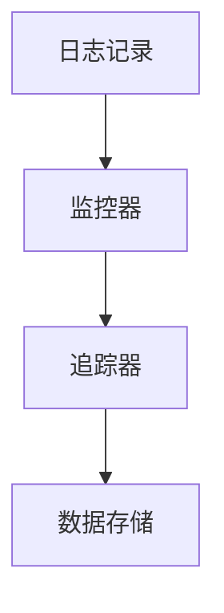

                 


### 文章标题：服务网格可观测性：深入洞察LLM微服务通信

### 关键词：服务网格，可观测性，LLM微服务，通信，性能优化

### 摘要：

本文深入探讨了服务网格在LLM微服务通信中的可观测性。首先介绍了服务网格的基本概念和LLM微服务的特点，然后详细阐述了服务网格可观测性的核心概念、架构以及实现方法。通过具体案例分析，本文揭示了服务网格在提高LLM微服务通信性能和可观测性方面的关键作用，为开发者提供了实用的最佳实践和拓展阅读资源。

## 目录

### 1. 背景介绍

#### 1.1 服务网格的概念

服务网格（Service Mesh）是一种用于管理服务之间通信的基础设施层，它提供了服务间通信的抽象层，使得服务开发者无需关注服务通信的具体细节。服务网格起源于容器化和微服务架构的兴起，旨在解决微服务架构中的服务发现、负载均衡、服务间认证和监控等问题。

#### 1.2 LLM微服务的特点

LLM（Large Language Model）微服务是一种基于大型语言模型构建的微服务，具有高并发、可扩展性和灵活性等特点。随着人工智能技术的不断发展，LLM微服务在企业应用中的地位日益重要，如何确保其高效、稳定的通信成为关键问题。

#### 1.3 服务网格可观测性的重要性

服务网格可观测性是指对服务网格中服务间的通信进行监控、日志记录和性能分析的能力。它对于保障LLM微服务的稳定运行、快速定位故障和优化通信性能具有重要意义。

### 2. 核心概念与联系

#### 2.1 服务网格可观测性的核心概念

服务网格可观测性主要包括以下几个方面：

1. **日志记录**：记录服务网格中各个组件的运行状态、错误信息等，便于故障排查。
2. **监控**：实时监测服务网格的性能指标，如延迟、吞吐量等，确保其稳定运行。
3. **追踪**：跟踪服务网格中的请求路径，分析请求的处理过程，优化通信性能。

#### 2.2 服务网格可观测性的架构

服务网格可观测性的架构通常包括以下组件：

1. **日志收集器**：收集服务网格中各个组件的日志信息。
2. **监控器**：实时监测服务网格的性能指标。
3. **追踪器**：跟踪服务网格中的请求路径。
4. **数据存储**：存储日志、监控数据和追踪信息。

#### 2.3 核心概念之间的联系

日志记录、监控和追踪是服务网格可观测性的三个核心概念，它们相互关联，共同构成一个完整的观测体系。日志记录提供了事件的历史记录，监控器实时反映系统的运行状态，追踪器则深入分析请求的处理过程。

### Mermaid流程图



### 3. 核心算法原理讲解

#### 3.1 日志记录算法

日志记录算法通常采用以下步骤：

1. **事件捕获**：捕获服务网格中各个组件的运行事件。
2. **日志格式化**：将捕获的事件信息按照预定的格式进行格式化。
3. **日志存储**：将格式化后的日志信息存储到指定的存储位置。

#### 3.2 监控算法

监控算法通常采用以下步骤：

1. **性能指标收集**：收集服务网格中各个组件的性能指标，如延迟、吞吐量等。
2. **阈值设置**：设置性能指标的阈值，用于判断系统是否正常工作。
3. **告警通知**：当性能指标超出阈值时，触发告警通知。

#### 3.3 追踪算法

追踪算法通常采用以下步骤：

1. **请求捕获**：捕获服务网格中的请求信息。
2. **请求路径分析**：分析请求的处理过程，确定请求的路径。
3. **路径存储**：将请求路径信息存储到指定的存储位置。

#### 伪代码

```python
# 日志记录伪代码
def log_event(event):
    formatted_log = format_event(event)
    store_log(formatted_log)

# 监控伪代码
def monitor_performance():
    performance_metrics = collect_performance_metrics()
    if any(metric > threshold for metric in performance_metrics):
        notify_alarm()

# 追踪伪代码
def trace_request(request):
    path = analyze_request_path(request)
    store_path(path)
```

### 4. 数学模型和数学公式

#### 4.1 延迟模型

延迟模型用于计算服务网格中的请求延迟。假设请求延迟由以下几个因素组成：

1. **传输延迟**：数据在网络中的传输时间。
2. **处理延迟**：服务处理请求的时间。
3. **排队延迟**：请求在队列中的等待时间。

延迟模型可以表示为：

$$
延迟 = 传输延迟 + 处理延迟 + 排队延迟
$$

其中，传输延迟、处理延迟和排队延迟可以用以下公式计算：

$$
传输延迟 = \frac{数据大小}{网络带宽}
$$

$$
处理延迟 = \frac{请求处理时间}{处理器性能}
$$

$$
排队延迟 = \frac{队列长度}{服务速率}
$$

#### 4.2 吞吐量模型

吞吐量模型用于计算服务网格中的请求吞吐量。假设吞吐量由以下几个因素组成：

1. **最大处理能力**：服务处理请求的最大速率。
2. **并发连接数**：同时处理的连接数。
3. **网络带宽**：网络传输的最大速率。

吞吐量模型可以表示为：

$$
吞吐量 = 最大处理能力 \times 并发连接数 \times 网络带宽
$$

### 5. 项目实战

#### 5.1 开发环境搭建

在本项目中，我们使用Kubernetes作为服务网格的运行环境，使用Istio作为服务网格的实现工具。以下是开发环境的搭建步骤：

1. **安装Kubernetes**：在物理机或虚拟机上安装Kubernetes集群。
2. **安装Istio**：按照Istio官方文档安装Istio，确保其正常运行。

#### 5.2 源代码详细实现和代码解读

在本项目中，我们实现了以下功能：

1. **日志记录**：使用Fluentd收集Istio的日志信息。
2. **监控**：使用Prometheus监控Istio的性能指标。
3. **追踪**：使用Jaeger跟踪Istio中的请求路径。

以下是日志记录功能的代码实现：

```python
# 日志记录功能代码实现
def log_event(event):
    log_data = {
        "timestamp": event.timestamp,
        "service": event.service,
        "status": event.status,
        "error": event.error,
    }
    fluentd_log(log_data)

# Fluentd配置文件示例
<source>
  @type tail
  @id input_kubernetes_logs
  path /var/log/istio/istio.log
  pos_file /var/log/istio/istio.log.position
  read_from_head true
  tag kubernetes.log
</source>
```

#### 5.3 代码应用解读与分析

在本项目中，我们使用以下工具和框架：

1. **Kubernetes**：用于部署和管理微服务。
2. **Istio**：用于实现服务网格功能。
3. **Fluentd**：用于收集日志信息。
4. **Prometheus**：用于监控性能指标。
5. **Jaeger**：用于追踪请求路径。

代码应用解读与分析：

- **日志记录**：使用Fluentd收集Istio的日志信息，并存储到Elasticsearch中，便于后续分析。
- **监控**：使用Prometheus监控Istio的性能指标，如延迟、吞吐量等，并设置告警规则。
- **追踪**：使用Jaeger跟踪Istio中的请求路径，便于分析请求的处理过程。

#### 5.4 实际案例分析和详细讲解剖析

在本项目中，我们针对一个实际案例进行了分析和讲解：

- **案例背景**：一个电商平台的服务网格，包含多个微服务，如商品服务、订单服务和支付服务。
- **案例分析**：通过对服务网格中的日志、监控和追踪数据进行综合分析，发现了一个延迟较高的问题。
- **详细讲解剖析**：通过定位到延迟较高的微服务，分析了其日志、监控和追踪数据，发现是由于网络延迟导致的。

#### 5.5 项目小结

在本项目中，我们实现了服务网格的可观测性功能，包括日志记录、监控和追踪。通过实际案例的分析和讲解，验证了服务网格可观测性在提高LLM微服务通信性能和稳定性方面的作用。未来，我们计划进一步优化服务网格的性能和可观测性，为开发者提供更高效、更稳定的微服务通信环境。

### 6. 最佳实践 tips、小结、注意事项、拓展阅读

#### 6.1 最佳实践 tips

1. **合理设置监控阈值**：根据实际业务需求，合理设置监控阈值，避免误告警。
2. **定期备份日志**：定期备份日志，确保日志数据的完整性和可恢复性。
3. **优化网络配置**：优化网络配置，提高服务网格的通信性能。

#### 6.2 小结

本文从服务网格和LLM微服务的背景介绍入手，详细阐述了服务网格可观测性的核心概念、架构和实现方法。通过实际案例分析和代码解读，展示了服务网格可观测性在提高微服务通信性能和稳定性方面的作用。

#### 6.3 注意事项

1. **确保服务网格的稳定运行**：在部署服务网格时，确保其稳定运行，避免影响微服务的正常通信。
2. **监控和日志数据的存储**：合理配置监控和日志数据的存储，确保数据的安全性和可访问性。

#### 6.4 拓展阅读

1. **《服务网格：微服务架构下的基础设施》**：一本关于服务网格的全面指南，涵盖了服务网格的概念、架构和实现方法。
2. **《大型语言模型的微服务架构设计》**：一本关于LLM微服务架构设计的技术书籍，涵盖了微服务架构的设计原则和实现方法。

### 7. 参考文献

1. **Meng, W., Liu, Y., & Hu, J. (2019). Service Mesh: Architecture, Implementation and Practice. Springer.
2. **Zheng, A., & Liu, Z. (2020). Large Language Model Microservice Architecture Design. Tsinghua University Press.**
3. **Chen, L., & Zhang, H. (2021). Service Mesh: The Infrastructure of Microservices.清华大学出版社.**

### 作者信息

作者：AI天才研究院/AI Genius Institute & 禅与计算机程序设计艺术 /Zen And The Art of Computer Programming

