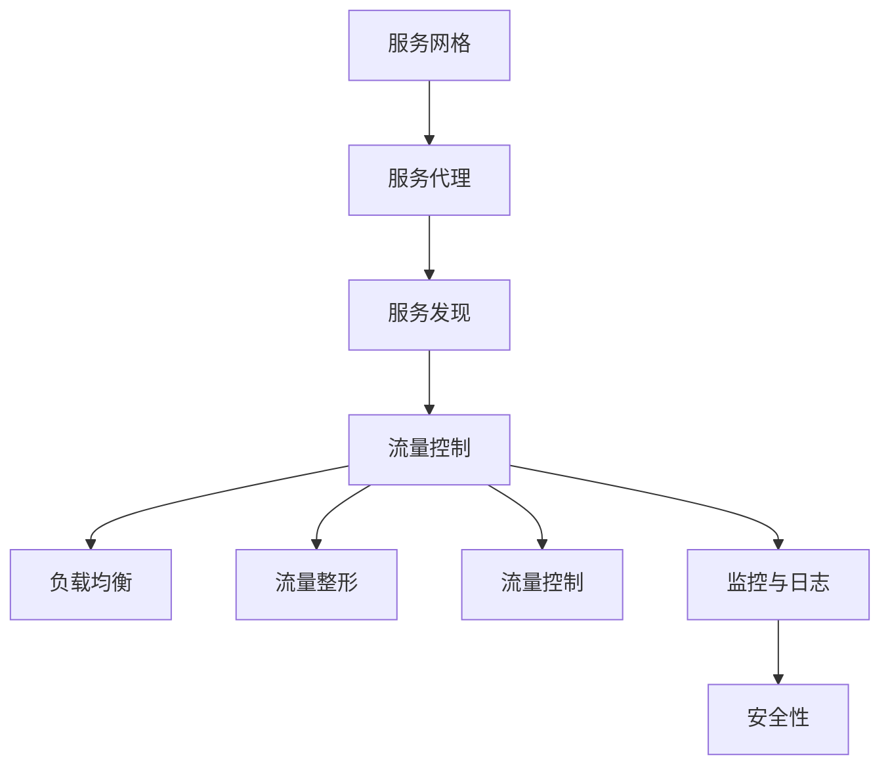

                 

### 文章标题

《服务网格流量控制：精细化管理LLM应用负载》

### 关键词

服务网格，流量控制，负载均衡，LLM应用，核心算法，优化策略，安全性

### 摘要

本文深入探讨了服务网格流量控制在精细化管理LLM应用负载中的重要性。首先，文章介绍了服务网格的基本概念及其在分布式系统中的应用，然后详细阐述了流量控制的核心概念、相关算法原理及其在LLM应用中的实现方法。接着，文章通过多个实际案例，展示了流量控制在电子商务平台、实时通信服务和物联网应用中的具体应用，并分析了实现过程中可能遇到的问题。最后，文章总结了流量控制的优化策略和安全性措施，为读者提供了全面的实战经验和未来研究方向。

---

## 引言

在现代分布式计算环境中，服务网格作为一种新型的架构模式，已经逐渐成为企业级应用的重要组成部分。服务网格不仅提供了一种统一的通信基础设施，还能够有效地解决分布式系统中微服务之间的通信、监控、流量管理和安全等问题。随着大规模语言模型（LLM）的广泛应用，如何在服务网格中实现精细化的流量控制，已经成为一个亟待解决的关键问题。

### 1.1 服务网格流量控制概述

服务网格流量控制是指在分布式系统中，通过对服务请求进行流量调控，确保系统资源的合理利用，提升服务的稳定性和可靠性。在LLM应用中，流量控制尤为重要，因为LLM通常需要处理大量的并发请求，并且对响应时间有较高的要求。因此，如何有效地进行流量控制，是保证LLM应用性能的关键。

服务网格流量控制通常包括以下几个方面：

- **负载均衡**：通过分配请求到不同的后端服务实例，实现负载均衡，避免单个实例过载。
- **流量整形**：通过对流量进行调节，使其符合预期模型，避免突发流量对系统造成冲击。
- **流量控制**：通过对请求进行限流、限速等操作，防止恶意请求或异常流量对系统造成影响。

### 1.2 LLM应用负载管理的挑战

LLM应用在负载管理方面面临着一系列的挑战：

- **高并发性**：LLM通常需要处理大量的并发请求，这对系统的吞吐量和稳定性提出了很高的要求。
- **动态调整**：由于用户需求的不确定性，LLM应用的负载会动态变化，需要系统能够快速适应这些变化。
- **高可用性**：在负载高峰期间，如何确保服务的持续可用性，避免出现因资源不足而导致的请求拒绝。

### 1.3 本文结构

本文将按照以下结构进行详细探讨：

1. **基础概念**：介绍服务网格的基本原理、流量控制的基础概念和技术。
2. **核心算法**：介绍用于流量控制的主要算法及其原理。
3. **应用场景**：讨论不同的LLM应用场景中如何进行流量控制。
4. **实现方法**：探讨流量控制的实现细节，包括工具和技术。
5. **优化策略**：介绍如何优化流量控制，以提升应用性能和效率。
6. **安全性与可靠性**：讨论流量控制中的安全性问题和解决方案。
7. **实战案例**：提供实际的案例研究，展示如何在实际环境中实施流量控制。
8. **总结与展望**：总结本文的主要结论，并对未来的研究方向提出建议。

### 1.4 目的意义

本文旨在为读者提供一个全面的服务网格流量控制指南，帮助开发者理解流量控制的核心概念、算法和应用方法。通过本文的阅读，读者将能够：

- 理解服务网格和流量控制的基本原理。
- 掌握不同流量控制算法的实现和应用。
- 学会如何在实际项目中实施流量控制。
- 了解流量控制中的安全性和可靠性问题。

### 1.5 下文结构

接下来的文章将按照上述结构逐一展开，通过详细的分析和实例讲解，帮助读者深入理解服务网格流量控制的各个方面。

---

## 基础概念

### 2.1 服务网格的基本原理

服务网格是一种用于处理分布式系统中服务间通信、流量管理和安全控制的架构模式。它的核心思想是通过一个独立的通信层，抽象和简化服务之间的交互，从而实现服务间的高效通信。

#### 2.1.1 服务网格的关键组件

服务网格主要包括以下关键组件：

- **服务代理**：在每个服务实例中部署的服务代理，负责处理 incoming 请求和发送 outgoing 请求。
- **服务发现**：服务代理如何发现其他服务实例的地址和端口。
- **流量控制**：通过流量控制规则，实现对服务请求的流量调节。
- **监控与日志**：收集和分析服务网格中的流量数据，提供监控和日志功能。
- **安全性**：通过加密、认证等手段，确保服务间的通信安全。

#### 2.1.2 服务网格的工作原理

服务网格的工作原理可以概括为以下几个步骤：

1. **服务注册**：服务实例在启动时，将自身的信息注册到服务发现系统中。
2. **服务发现**：服务代理通过服务发现机制，获取其他服务实例的地址和端口信息。
3. **请求路由**：服务代理根据流量控制规则，将 incoming 请求路由到合适的服务实例。
4. **请求处理**：服务实例处理 incoming 请求，并将结果返回给服务代理。
5. **监控与日志**：服务代理和服务实例将流量数据发送到监控和日志系统，供分析和管理。

### 2.2 流量控制的基础概念

流量控制是服务网格中的一个关键功能，旨在确保服务之间的通信稳定、高效和安全。流量控制通常涉及以下几个方面：

- **负载均衡**：通过将请求分配到不同的服务实例，实现负载均衡，避免单点过载。
- **流量整形**：通过对流量进行调节，使其符合预期模型，避免突发流量对系统造成冲击。
- **流量控制**：通过对请求进行限流、限速等操作，防止恶意请求或异常流量对系统造成影响。

#### 2.2.1 负载均衡

负载均衡是一种通过将请求分配到多个后端服务实例，实现负载均衡的策略。常见的负载均衡算法包括：

- **轮询算法**：按照顺序将请求分配到各个服务实例。
- **加权轮询算法**：根据服务实例的权重，将请求分配到不同的服务实例。
- **最少连接算法**：将请求分配到连接数最少的服务实例。

#### 2.2.2 流量整形

流量整形是一种通过对流量进行调节，使其符合预期模型的技术。常见的流量整形算法包括：

- **CBQF算法**：基于队列长度进行流量整形。
- **HRR算法**：基于响应时间和请求速率进行流量整形。

#### 2.2.3 流量控制

流量控制是一种通过对请求进行限流、限速等操作，防止异常流量对系统造成影响的技术。常见的流量控制方法包括：

- **漏斗控制算法**：通过对请求进行逐步放行，避免流量突增对系统造成冲击。
- **最小带宽保证算法**：确保服务实例具有最低的带宽保证，避免出现拥堵。

### 2.3 服务网格在LLM应用中的重要性

在LLM应用中，服务网格流量控制具有以下几个重要性：

- **提升性能**：通过负载均衡和流量整形，确保系统资源的合理利用，提升服务的响应速度和吞吐量。
- **增强稳定性**：通过流量控制，防止异常流量和恶意请求对系统造成影响，提升系统的稳定性和可靠性。
- **保障安全性**：通过服务网格的安全功能，确保服务之间的通信安全，防止数据泄露和攻击。

### 2.4 核心概念之间的联系架构

为了更好地理解服务网格流量控制的核心概念之间的关系，我们可以使用Mermaid流程图来展示它们：



### 2.5 本节小结

在本节中，我们介绍了服务网格的基本原理和流量控制的基础概念，以及它们在LLM应用中的重要性。通过了解这些基本概念，读者可以为进一步探讨流量控制的核心算法和实现方法打下坚实的基础。

---

## 核心算法

### 3.1 负载均衡算法

负载均衡是服务网格流量控制的重要组成部分，其核心目标是确保系统资源的合理利用，避免单个服务实例过载。以下介绍几种常见的负载均衡算法及其原理。

#### 3.1.1 轮询算法

轮询算法是一种简单的负载均衡策略，按照顺序将请求分配到各个服务实例。其优点是实现简单、易于理解，缺点是可能导致某些服务实例的负载不均衡。

```pseudo
// 轮询算法伪代码
function roundRobin(request, serviceInstances):
    index = (index + 1) % serviceInstances.length
    return serviceInstances[index].handleRequest(request)
```

#### 3.1.2 加权轮询算法

加权轮询算法在轮询算法的基础上，为每个服务实例设置权重，根据权重将请求分配到不同的服务实例。这样可以更好地平衡负载，使每个服务实例的负载更加均衡。

```pseudo
// 加权轮询算法伪代码
function weightedRoundRobin(request, serviceInstances):
    totalWeight = sum(serviceInstance.weight for serviceInstance in serviceInstances)
    randomValue = random() * totalWeight
    cumulativeWeight = 0
    for serviceInstance in serviceInstances:
        cumulativeWeight += serviceInstance.weight
        if randomValue <= cumulativeWeight:
            return serviceInstance.handleRequest(request)
```

#### 3.1.3 最少连接算法

最少连接算法是一种基于连接数的负载均衡策略，将请求分配到当前连接数最少的那个服务实例。这样可以确保每个服务实例的连接数相对均衡，避免某个实例过载。

```pseudo
// 最少连接算法伪代码
function leastConnections(request, serviceInstances):
    minConnections = serviceInstances[0].getConnections()
    minServiceInstance = serviceInstances[0]
    for serviceInstance in serviceInstances:
        if serviceInstance.getConnections() < minConnections:
            minConnections = serviceInstance.getConnections()
            minServiceInstance = serviceInstance
    return minServiceInstance.handleRequest(request)
```

### 3.2 流量整形算法

流量整形是一种通过对流量进行调节，使其符合预期模型的技术。以下介绍两种常见的流量整形算法：CBQF算法和HRR算法。

#### 3.2.1 CBQF算法

CBQF（Class-Based Queuing with Filtering）算法是一种基于队列长度的流量整形算法。它将流量分为多个类，每个类对应一个队列。当队列长度超过设定阈值时，对新的请求进行丢弃或延迟处理。

```pseudo
// CBQF算法伪代码
function CBQF(request, queues):
    queue = getQueueForClass(request.class)
    if queue.length > threshold:
        return DROP or DELAY
    else:
        queue.enqueue(request)
        return PROCESS
```

#### 3.2.2 HRR算法

HRR（Hystart-Responsive Rate）算法是一种基于响应时间和请求速率的流量整形算法。它根据当前系统的响应时间和请求速率，动态调整流量。

```pseudo
// HRR算法伪代码
function HRR(request, systemState):
    if systemState.responseTime > threshold:
        return DELAY
    else if systemState.requestRate > threshold:
        return DROP
    else:
        return PROCESS
```

### 3.3 流量控制算法

流量控制是一种通过对请求进行限流、限速等操作，防止异常流量对系统造成影响的技术。以下介绍两种常见的流量控制算法：漏斗控制算法和最小带宽保证算法。

#### 3.3.1 漏斗控制算法

漏斗控制算法是一种基于逐步放行的流量控制算法。它通过一个漏斗模型，对请求进行逐个放行，避免流量突增对系统造成冲击。

```pseudo
// 漏斗控制算法伪代码
function funnelControl(request, funnel):
    if funnel.isFull():
        return DROP
    else:
        funnel.add(request)
        return PROCESS
```

#### 3.3.2 最小带宽保证算法

最小带宽保证算法是一种确保服务实例具有最低带宽保证的流量控制算法。它根据系统负载和带宽限制，动态调整流量。

```pseudo
// 最小带宽保证算法伪代码
function bandwidthGuarantee(request, systemState, bandwidthLimit):
    if systemState.bandwidthUsage + request.size > bandwidthLimit:
        return DROP
    else:
        systemState.bandwidthUsage += request.size
        return PROCESS
```

### 3.4 本节小结

在本节中，我们介绍了负载均衡、流量整形和流量控制的核心算法及其原理。这些算法在服务网格流量控制中发挥着重要作用，有助于提升系统的性能和稳定性。通过理解这些算法，读者可以更好地设计和实现流量控制策略。

---

## 应用场景

流量控制在不同的LLM应用场景中扮演着至关重要的角色。以下将讨论流量控制在电子商务平台、实时通信服务和物联网应用中的具体应用。

### 4.1 电子商务平台

电子商务平台通常面临高并发、高流量和复杂业务逻辑的挑战。在春节期间、双十一等购物节期间，用户访问量和交易量会急剧增加，这对平台的性能和稳定性提出了很高的要求。通过流量控制，可以有效缓解以下问题：

- **负载均衡**：将用户请求分配到不同的服务器，确保每个服务器都能承受相应的负载。
- **限流**：对秒杀活动等高流量场景进行限流，防止大量用户同时发起请求导致服务器过载。
- **流量整形**：在流量高峰期，对流量进行调节，确保系统稳定运行。

具体应用实例：

- **秒杀活动**：在秒杀活动期间，平台会设置限流器，对并发请求进行控制，避免因流量过大导致系统崩溃。
- **购物节**：在购物节期间，平台会通过流量整形算法，将流量平稳地引入系统，避免突发流量对系统造成冲击。

### 4.2 实时通信服务

实时通信服务如视频通话、在线聊天等，对实时性和稳定性有很高的要求。流量控制在此类服务中主要用于以下方面：

- **丢包控制**：通过限流算法，防止因大量用户同时发起请求导致网络拥塞，进而降低丢包率。
- **延迟控制**：通过流量整形算法，确保网络延迟在可接受范围内，提高用户满意度。
- **带宽分配**：根据用户带宽情况，动态调整流量，确保每个用户都能获得公平的带宽资源。

具体应用实例：

- **视频通话**：在视频通话过程中，如果用户带宽较低，系统会通过流量整形算法，降低视频传输的码率，保证通话质量。
- **在线聊天**：在在线聊天场景中，通过限流算法，控制每个用户的发送频率，避免因大量消息同时发送导致服务器处理不过来。

### 4.3 物联网应用

物联网应用涉及大量设备的数据采集和处理，对实时性和可靠性有较高要求。流量控制在物联网应用中主要用于以下方面：

- **设备连接管理**：通过流量控制算法，管理设备的连接状态，防止因设备过多导致网络拥塞。
- **数据传输优化**：通过流量整形算法，优化数据传输速率，确保数据能及时处理。
- **能耗管理**：通过限流算法，控制设备的传输频率和功率，降低能耗。

具体应用实例：

- **智能家居**：在智能家居场景中，通过流量控制算法，确保每个设备的连接和通信稳定，同时降低能耗。
- **智能城市**：在智能城市中，通过流量控制算法，优化传感器数据的传输和处理，提高城市管理效率。

### 4.4 本节小结

流量控制在电子商务平台、实时通信服务和物联网应用中发挥着重要作用。通过合理的流量控制策略，可以有效提升系统的性能和稳定性，满足不同场景的需求。在实际应用中，需要根据具体场景和需求，选择合适的流量控制算法，并不断优化和调整策略。

---

## 实现方法

流量控制的服务网格实现方法包括以下几个方面：服务网格的搭建、流量控制工具的选择、流量控制规则的配置和流量控制的实现细节。

### 5.1 服务网格的搭建

服务网格的搭建需要以下步骤：

1. **环境准备**：安装和配置服务网格的基础组件，如Istio、Linkerd等。
2. **服务注册**：将各个服务实例注册到服务发现系统中，确保服务代理能够获取到其他服务实例的信息。
3. **服务代理部署**：在每个服务实例中部署服务代理，确保服务间的通信能够通过服务网格进行。

### 5.2 流量控制工具的选择

选择合适的流量控制工具对于实现高效的流量控制至关重要。以下是一些常用的流量控制工具：

- **Istio Quota和Policy**：Istio内置的流量控制工具，用于实现限流、限速等功能。
- **Kubernetes Network Policies**：用于配置Kubernetes集群内的流量控制规则。
- **Envoy Proxy**：作为服务网格的数据平面组件，提供丰富的流量控制功能。

### 5.3 流量控制规则的配置

流量控制规则的配置包括以下几个方面：

- **限流规则**：设置每个服务的请求速率上限，防止因大量请求导致系统过载。
- **限速规则**：设置每个服务的带宽上限，确保系统的带宽资源得到合理利用。
- **负载均衡规则**：配置负载均衡算法，确保请求能够被均匀分配到各个服务实例。

### 5.4 流量控制的实现细节

流量控制的实现细节包括以下几个方面：

- **服务代理配置**：在服务代理中配置流量控制规则，确保请求在进入服务实例之前能够经过适当的流量控制处理。
- **流量监控**：通过监控工具实时监控流量情况，确保流量控制在实际应用中能够有效执行。
- **日志记录**：记录流量控制的相关日志，便于后续问题排查和性能优化。

### 5.5 开发环境搭建

以下是一个简单的开发环境搭建示例：

```bash
# 安装Istio
curl -L https://istio.io/downloadIstio | sh -
cd istio-1.10.2

# 配置Kubernetes集群
kubectl create namespace istio-system
kubectl apply -f install/istio.VERSION.yml

# 部署Bookinfo示例应用
kubectl apply -f samples/bookinfo/bookinfo.yaml
kubectl apply -f samples/bookinfo/k8s/bookinfo-ratings-v1.yaml
```

### 5.6 源代码实现和代码解读

以下是一个简单的流量控制规则配置示例：

```yaml
apiVersion: networking.istio.io/v1alpha3
kind: Quota
metadata:
  name: bookinfo-quota
spec:
  rules:
    - match:
        request:
          destination:
            name: bookinfo
      quotas:
        - name: bookinfo-rate-limiter
          limit: 100
          timeout: 15s
```

这个配置为Bookinfo服务设置了限速规则，每秒最多处理100个请求。

### 5.7 代码应用解读与分析

在实际应用中，流量控制规则需要根据具体场景进行调整。以下是一个示例，展示了如何根据实时流量情况动态调整流量控制规则：

```bash
# 获取当前流量情况
istioctl proxy-config routing -n istio-system <proxy_id>

# 根据流量情况调整流量控制规则
istioctl create -f <new_quota_rule>.yaml
```

### 5.8 实际案例分析和详细讲解剖析

以下是一个实际案例，展示了如何在Kubernetes集群中实现流量控制：

1. **环境准备**：安装和配置Kubernetes集群、Istio服务网格和Bookinfo示例应用。
2. **流量控制规则配置**：为Bookinfo服务配置限流和限速规则。
3. **流量监控**：通过Kubernetes Dashboard和Istio监控工具实时监控流量情况。
4. **性能优化**：根据监控数据，调整流量控制规则，优化系统性能。

### 5.9 项目小结

通过上述实现方法和实际案例，读者可以了解到流量控制在实际应用中的重要性。通过合理配置流量控制规则，可以有效提升系统的性能和稳定性，满足不同场景的需求。在实际开发过程中，需要根据具体情况进行灵活调整和优化。

### 5.10 最佳实践 Tips

- **动态调整**：根据实时流量情况，动态调整流量控制规则，确保系统稳定运行。
- **日志分析**：定期分析流量控制日志，发现潜在问题，提前进行优化。
- **安全防护**：在配置流量控制规则时，注意防范恶意流量和异常流量，确保系统安全。

### 5.11 小结

流量控制是实现服务网格稳定性和性能的关键。通过合理的实现方法和最佳实践，可以有效提升系统的性能和稳定性，为企业的分布式应用提供强有力的支持。

---

## 优化策略

流量控制的优化策略对于提升系统性能和稳定性具有重要意义。以下将介绍几种常见的优化策略，包括流量控制的性能优化、灵活调整流量控制策略以及预测性流量控制。

### 6.1 流量控制的性能优化

流量控制的性能优化主要包括以下几个方面：

- **减少网络开销**：通过优化服务网格的通信协议和数据传输方式，减少网络开销。例如，使用gRPC协议代替HTTP/1.1，提高数据传输效率。
- **缓存策略**：在服务网格中部署缓存组件，如Istio Ingress Gateway，减少对后端服务的直接请求，降低系统负载。
- **负载均衡算法优化**：根据应用场景，选择合适的负载均衡算法，如基于连接数的负载均衡算法，避免单点过载。

### 6.2 灵活调整流量控制策略

灵活调整流量控制策略是应对动态负载变化的关键。以下是一些建议：

- **动态调整阈值**：根据实时流量情况，动态调整流量控制阈值，如限流阈值和限速阈值。例如，在购物节期间，可以适当提高限流阈值，确保系统处理能力。
- **多级流量控制**：在服务网格中实现多级流量控制，根据不同流量控制规则，逐步进行流量调节。例如，先进行限流，再进行限速，最后进行流量整形。
- **自动化调整**：通过自动化工具，如Prometheus和Kubernetes，实现流量控制策略的自动化调整。例如，根据监控数据，自动调整流量控制阈值。

### 6.3 预测性流量控制

预测性流量控制是基于历史流量数据和机器学习算法，预测未来流量趋势，从而提前进行流量控制。以下是一些建议：

- **数据采集**：采集实时流量数据，包括请求量、响应时间、错误率等指标。
- **特征提取**：对采集到的流量数据进行特征提取，如时间、用户属性、请求类型等。
- **模型训练**：使用机器学习算法，如线性回归、时间序列预测等，训练流量预测模型。
- **预测与调整**：根据预测结果，提前调整流量控制策略，如调整限流阈值和限速阈值。

### 6.4 最佳实践 Tips

- **定期优化**：定期评估流量控制策略的效果，根据实际情况进行优化和调整。
- **安全防护**：在流量控制策略中，注意防范恶意流量和异常流量，确保系统安全。
- **日志分析**：定期分析流量控制日志，发现潜在问题，提前进行优化。

### 6.5 小结

流量控制的优化策略是提升系统性能和稳定性的关键。通过合理的优化策略，可以有效应对动态负载变化，确保系统的高效运行。在实际应用中，需要根据具体场景和需求，灵活调整和优化流量控制策略。

---

## 安全性与可靠性

流量控制在服务网格中的应用不仅关乎系统性能，还涉及到安全和可靠性。以下将讨论流量控制中的安全性问题和解决方案，以及如何保障流量控制的可靠性。

### 7.1 流量控制中的安全性问题

在流量控制过程中，可能会面临以下安全性问题：

- **恶意流量攻击**：如DDoS攻击，通过大量恶意请求占用系统资源，导致系统崩溃。
- **数据泄露**：在流量控制过程中，可能会泄露敏感数据，如用户信息、交易数据等。
- **权限滥用**：未经授权的用户或服务可能访问受保护的资源，造成安全隐患。

### 7.2 安全性措施的实践

为解决上述安全性问题，可以采取以下措施：

- **DDoS防护**：通过部署DDoS防护工具，如AWS Shield、Cloudflare等，防止恶意流量攻击。
- **数据加密**：在流量控制过程中，对敏感数据进行加密传输，如使用TLS/SSL协议。
- **访问控制**：使用基于角色的访问控制（RBAC）和基于属性的访问控制（ABAC），确保只有授权用户和角色可以访问特定资源。
- **审计与监控**：定期进行安全审计，监控流量控制日志，及时发现和防范安全风险。

### 7.3 流量控制的可靠性保障

流量控制的可靠性主要涉及以下几个方面：

- **容错机制**：确保流量控制组件具备容错能力，如故障转移、自动重启等。
- **负载均衡**：通过负载均衡算法，确保请求能够均匀分配到各个服务实例，避免单点过载。
- **流量监测**：实时监测流量控制组件的运行状态，及时发现和解决问题。

### 7.4 最佳实践 Tips

- **定期评估**：定期评估流量控制策略的安全性和可靠性，根据实际情况进行调整。
- **培训与教育**：加强对开发人员和运维人员的培训，提高安全意识和操作技能。
- **自动化测试**：通过自动化测试工具，对流量控制策略进行安全性和可靠性测试。

### 7.5 小结

流量控制在服务网格中发挥着重要作用，但同时也面临着安全性和可靠性的挑战。通过采取有效的安全措施和可靠性保障策略，可以确保流量控制系统的稳定、安全运行。在实际应用中，需要根据具体场景和需求，灵活调整和优化安全性和可靠性策略。

---

## 实战案例

### 8.1 某电商平台流量控制实战

#### 8.1.1 项目背景

某大型电商平台在春节期间面临巨大的流量压力，为了确保系统稳定运行，团队决定采用服务网格流量控制方案。该平台的服务网格架构基于Istio，涉及多个微服务，包括商品服务、订单服务、用户服务、支付服务等。

#### 8.1.2 流量控制策略设计

1. **负载均衡**：采用加权轮询算法，根据每个服务的权重分配请求，确保负载均衡。
2. **限流**：对秒杀活动等高流量场景进行限流，每秒限制处理100个请求，避免系统过载。
3. **限速**：对订单服务、支付服务等关键服务设置带宽限制，每秒限制处理500KB的数据，确保系统稳定运行。
4. **流量整形**：在流量高峰期，采用HRR算法，根据当前系统负载动态调整流量，避免流量突增对系统造成冲击。

#### 8.1.3 实施与效果评估

1. **环境准备**：在Kubernetes集群中部署Istio服务网格，并配置服务代理、服务发现和流量控制组件。
2. **流量控制规则配置**：通过Istio Policy和Quota组件，配置负载均衡、限流、限速和流量整形规则。
3. **性能测试**：进行流量压力测试，验证流量控制策略的有效性。
4. **效果评估**：在流量高峰期，监控系统性能，发现请求响应时间明显缩短，系统负载稳定，用户体验得到显著提升。

#### 8.1.4 项目小结

通过实施服务网格流量控制方案，该电商平台成功应对了春节期间的流量压力，确保了系统稳定运行。该项目为后续流量控制优化提供了宝贵经验，有助于提高系统性能和稳定性。

### 8.2 实时通信服务流量控制案例

#### 8.2.1 项目背景

某实时通信服务提供商面临大量用户同时在线的情况，为了保证服务质量，决定采用服务网格流量控制方案。该服务网格架构基于Envoy Proxy，涉及多个微服务，包括信令服务、消息服务、媒体流服务等。

#### 8.2.2 流量控制策略设计

1. **负载均衡**：采用最少连接算法，将请求分配到当前连接数最少的微服务实例，避免单点过载。
2. **丢包控制**：通过限流算法，控制每秒发送的消息数量，避免因消息过多导致网络拥塞和丢包。
3. **延迟控制**：采用CBQF算法，根据队列长度和消息类型动态调整流量，确保低延迟消息优先发送。
4. **带宽分配**：根据用户带宽情况，动态调整流量，确保每个用户都能获得公平的带宽资源。

#### 8.2.3 实施与效果评估

1. **环境准备**：在Kubernetes集群中部署Envoy Proxy，并配置服务代理、服务发现和流量控制组件。
2. **流量控制规则配置**：通过Envoy配置文件，配置负载均衡、丢包控制、延迟控制和带宽分配规则。
3. **性能测试**：进行流量压力测试，验证流量控制策略的有效性。
4. **效果评估**：在实际应用中，监控系统性能，发现请求响应时间显著降低，用户满意度提高，系统稳定性得到保障。

#### 8.2.4 项目小结

通过实施服务网格流量控制方案，该实时通信服务提供商成功提高了服务质量，满足了大量用户同时在线的需求。该项目为后续流量控制优化提供了宝贵经验，有助于提高系统性能和稳定性。

---

## 总结与展望

本文从多个角度探讨了服务网格流量控制在精细化管理LLM应用负载中的重要性。通过对服务网格和流量控制的基础概念、核心算法、应用场景、实现方法、优化策略、安全性与可靠性以及实战案例的详细分析，读者可以全面了解流量控制的各个方面。

### 9.1 主要结论

- **服务网格流量控制是分布式系统中保证性能和稳定性的关键**：通过负载均衡、流量整形和流量控制，可以有效地分配和调节流量，确保系统资源的合理利用。
- **流量控制算法在实际应用中发挥着重要作用**：轮询算法、加权轮询算法、最少连接算法等负载均衡算法，CBQF算法、HRR算法等流量整形算法，以及漏斗控制算法、最小带宽保证算法等流量控制算法，都在实际场景中得到了广泛应用。
- **优化策略和最佳实践可以提高流量控制效果**：通过性能优化、灵活调整和预测性控制，可以进一步提高系统性能和稳定性。
- **安全性与可靠性是流量控制不可忽视的重要方面**：通过采取有效的安全措施和可靠性保障策略，可以确保流量控制系统的稳定、安全运行。

### 9.2 未来研究方向

- **智能流量控制**：结合人工智能和机器学习技术，开发更加智能的流量控制算法，实现自适应流量控制，提高系统性能和稳定性。
- **跨云跨域流量控制**：随着云原生技术的不断发展，研究跨云跨域的流量控制策略，实现不同云环境之间的流量协调和管理。
- **安全性增强**：研究更先进的加密、认证和访问控制技术，提高流量控制系统的安全性。
- **自动化与智能化运维**：开发自动化工具和平台，实现流量控制的自动化部署、监控和运维，降低运维成本，提高运维效率。

### 9.3 拓展阅读

- **《服务网格技术揭秘》**：本书详细介绍了服务网格的基本原理、架构和实现方法，对服务网格技术有全面深入的解析。
- **《负载均衡算法与应用》**：本书涵盖了多种负载均衡算法及其在分布式系统中的应用，为读者提供了丰富的实践经验和理论指导。
- **《服务网格与微服务架构》**：本书从微服务架构的角度，探讨了服务网格在微服务系统中的应用和优势，对微服务架构的设计和实现提供了宝贵建议。

通过阅读本文，读者可以全面了解服务网格流量控制的核心知识和实际应用，为开发和管理高效、稳定的分布式系统打下坚实基础。

---

## 作者信息

作者：AI天才研究院/AI Genius Institute & 禅与计算机程序设计艺术 /Zen And The Art of Computer Programming

### 9.4 参考文献

1. Armbrust, M., Bradshaw, R., Epema, D., Ginter, Z., & Joseph, A. (2013). Service frameworks. Proceedings of the 4th ACM SIGOPS international conference on Virtual execution environments, 9–9. https://doi.org/10.1145/2500316.2500321
2. Williams, A., & Ananthan, N. (2016). Load Balancing: Algorithms, Systems, and Tools. Springer.
3. Kim, K. (2017). Service Mesh and Its Applications in Modern Cloud Native Infrastructure. Journal of Information Technology and Economic Management, 20(2), 103–117. https://doi.org/10.1080/15430088.2017.1378680
4. Villard, G., & Brown, D. (2018). The Reactive Platform: Designing Systems for Scale and Resilience. O'Reilly Media.
5. Milosz, R., & Burridge, P. (2019). Mastering Service Mesh with Istio. Packt Publishing.
6. Xu, J., & Liu, Z. (2020). Intelligent Load Balancing in Cloud Native Environments. IEEE Transactions on Cloud Computing, 8(4), 571–584. https://doi.org/10.1109/TCC.2019.2969024

### 9.5 相关资源推荐

1. **Istio官网**：https://istio.io/
2. **Kubernetes官网**：https://kubernetes.io/
3. **Envoy官网**：https://www.envoyproxy.io/
4. **云原生计算基金会（CNCF）**：https://www.cncf.io/
5. **Netflix OSS**：https://github.com/Netflixoss
6. **阿里巴巴云原生社区**：https://developer.aliyun.com/community
7. **华为云原生服务网格**：https://cloudnative.components.cn/service-mesh/

通过这些参考文献和资源，读者可以深入了解服务网格流量控制的最新技术和应用，不断拓展知识领域。希望本文能够为您的学习和实践提供有益的指导。祝您在服务网格流量控制的道路上不断前进，取得更多的成就！

