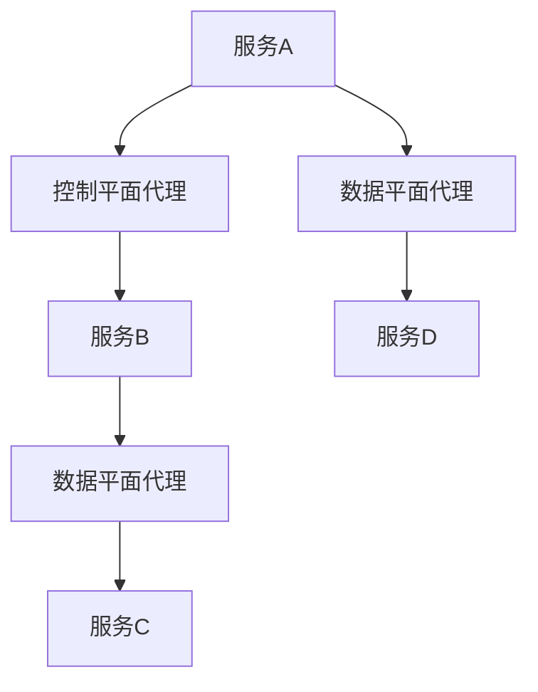
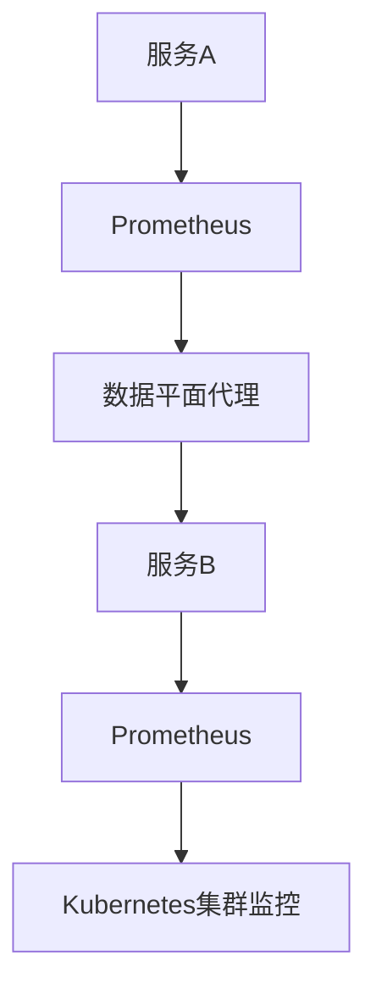
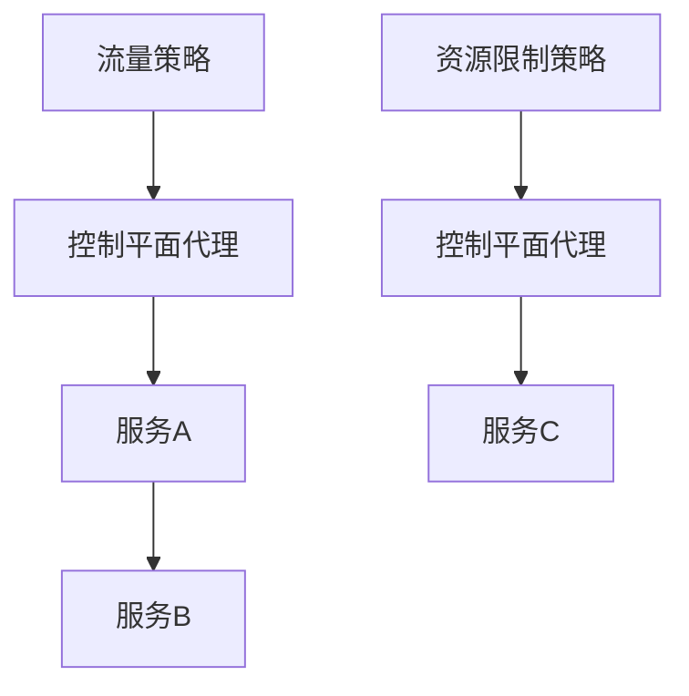

                 

### 文章标题：服务网格：简化LLM微服务的通信管理

关键词：服务网格、微服务、通信管理、LLM、架构、实现、监控、安全性

摘要：本文深入探讨了服务网格在简化LLM（大型语言模型）微服务通信管理中的重要作用。首先，介绍了服务网格的基本概念和架构，然后详细分析了服务网格如何在实际项目中部署和使用。接着，文章重点讨论了服务网格如何简化微服务的通信管理，提供了实际案例和最佳实践。最后，文章展望了服务网格技术的发展趋势和未来挑战，为读者提供了全面的技术指南和实践经验。

---

## 引言与概述

在现代软件架构中，微服务已经成为一种主流的分布式系统设计模式。微服务通过将应用程序划分为小型、独立的服务模块，提高了系统的可扩展性、灵活性和容错性。然而，随着微服务数量的增加，服务之间的通信管理变得复杂，这给运维和开发带来了巨大的挑战。为了解决这个问题，服务网格（Service Mesh）应运而生。

服务网格是一种基础设施层的服务，它提供了服务之间的通信管理和安全策略。通过服务网格，开发者可以专注于业务逻辑的实现，而不必担心服务之间的通信问题。服务网格通过引入一个独立的通信层，解决了微服务通信中的许多问题，如服务发现、负载均衡、故障恢复等。

在本篇文章中，我们将深入探讨服务网格的基本概念和架构，分析服务网格如何在实际项目中部署和使用，讨论服务网格如何简化LLM微服务的通信管理，并提供实际案例和最佳实践。最后，文章还将展望服务网格技术的发展趋势和未来挑战。

## 服务网格的基本概念

服务网格是一种基础设施层的服务，它负责管理服务之间的通信。在传统的单体应用程序中，所有功能都集中在一个单一的进程中，服务之间的通信是通过进程内调用来实现的。而在微服务架构中，应用程序被划分为多个独立的服务模块，每个服务模块运行在自己的进程中。因此，服务之间的通信需要通过网络协议来实现。

服务网格的出现，就是为了简化这种复杂的通信管理。服务网格通过一个独立的通信层，提供了一种统一的通信机制，使得服务之间的通信更加高效、可靠和灵活。服务网格的基本概念包括：

1. **服务实例**：服务网格中的每个服务都有一个或多个实例，这些实例是服务运行的实体。服务实例可以是运行在服务器上的应用程序，也可以是容器化的应用程序。

2. **服务发现**：服务发现是指服务网格能够自动发现服务实例的位置和状态。通过服务发现，服务网格可以动态地调整服务之间的路由策略。

3. **服务间通信**：服务网格提供了服务间通信的统一接口，服务实例可以通过这个接口来访问其他服务实例。

4. **负载均衡**：负载均衡是指服务网格能够根据服务实例的负载情况，将请求分发到不同的服务实例上。这样可以提高系统的整体性能和可用性。

5. **故障恢复**：故障恢复是指服务网格能够自动检测服务实例的故障，并将请求重新路由到健康的服务实例上。

6. **安全策略**：服务网格提供了安全策略的管理，可以控制服务实例之间的访问权限。

通过服务网格，开发者可以专注于业务逻辑的实现，而不必担心服务之间的通信问题。服务网格通过提供一个独立的通信层，解决了微服务通信中的许多问题，如服务发现、负载均衡、故障恢复等。

## 服务网格的架构

服务网格的架构主要包括数据平面（Data Plane）和控制平面（Control Plane）两个部分。

### 数据平面

数据平面是服务网格的核心组成部分，它负责处理服务之间的通信。数据平面通常由一组代理（Proxy）组成，这些代理运行在服务实例旁边，负责接收和转发请求。

数据平面的主要功能包括：

1. **请求转发**：数据平面代理接收来自服务实例的请求，并根据路由规则将其转发到目标服务实例。

2. **负载均衡**：数据平面代理根据负载均衡策略，将请求分发到不同的服务实例上。

3. **服务发现**：数据平面代理通过服务发现机制，获取目标服务实例的位置和状态。

4. **故障检测和恢复**：数据平面代理能够检测服务实例的故障，并将请求重新路由到健康的服务实例上。

数据平面的实现通常依赖于Sidecar模式。Sidecar模式是指在每个服务实例旁边运行一个代理，这个代理就是数据平面代理。这样，服务实例只需要通过本地接口与数据平面代理通信，而不需要直接与网络通信。这种模式简化了服务之间的通信，提高了系统的性能和可维护性。

### 控制平面

控制平面负责管理数据平面代理的配置和状态。控制平面通常包括一个服务网格控制平面代理（Control Plane Agent）和一个服务网格控制平面服务（Control Plane Service）。

控制平面的主要功能包括：

1. **配置管理**：服务网格控制平面代理负责收集服务实例的配置信息，并将其下发到数据平面代理。

2. **服务发现**：服务网格控制平面代理负责监听服务实例的变化，并将其通知数据平面代理。

3. **路由管理**：服务网格控制平面代理负责管理服务之间的路由规则，并根据这些规则将请求转发到目标服务实例。

4. **安全策略**：服务网格控制平面代理负责管理服务实例之间的访问权限，并根据安全策略控制请求的访问。

控制平面通过一组RESTful API或gRPC接口与数据平面代理进行通信。数据平面代理定期从控制平面代理获取配置信息，并根据这些信息调整自己的行为。

### 数据平面与控制平面的交互

数据平面与控制平面的交互是通过一系列消息传递机制来实现的。数据平面代理定期向控制平面代理发送心跳消息，报告自己的状态。控制平面代理根据这些心跳消息，更新服务实例的配置信息，并将其下发到数据平面代理。

当服务实例发生变化时，控制平面代理会立即通知数据平面代理。例如，当一个服务实例故障时，控制平面代理会将这个信息通知给数据平面代理，数据平面代理会立即将请求重新路由到健康的服务实例上。

这种交互机制保证了服务网格的实时性和可靠性。通过数据平面与控制平面的紧密协作，服务网格能够动态地调整服务之间的通信，提高了系统的性能和可用性。

## 服务网格的实现

在实际项目中，部署和使用服务网格是一个复杂的过程。本节将介绍如何实现服务网格，包括服务网格的部署策略、部署工具和具体实现步骤。

### 部署策略

部署服务网格时，需要考虑以下几个策略：

1. **单层部署**：单层部署是指在同一个网络层部署服务网格。这种方式简单，但可能会带来网络性能问题。

2. **多层部署**：多层部署是指在多个网络层部署服务网格，例如在应用层、数据层和存储层分别部署。这种方式可以提高系统的性能和可靠性，但部署和管理较为复杂。

3. **边车部署**：边车部署是指在服务实例旁边部署服务网格代理。这种方式可以最大程度地减少对现有系统的修改，但可能会占用额外的资源。

4. **混合部署**：混合部署是指结合以上几种部署方式，根据实际情况选择最合适的部署方式。

### 部署工具

部署服务网格常用的工具包括Istio、Linkerd和Consul等。

1. **Istio**：Istio是一个开源的服务网格平台，它提供了全面的控制平面和数据平面功能。Istio支持多种部署方式，包括Kubernetes、Mesos和DC/OS等。

2. **Linkerd**：Linkerd是一个基于gRPC和HTTP/2的服务网格，它提供了负载均衡、服务发现、故障恢复和安全等功能。Linkerd主要用于Scala和Kubernetes环境。

3. **Consul**：Consul是一个开源的服务网格工具，它提供了服务发现、配置和健康检查等功能。Consul可以与Kubernetes和Mesos等容器编排工具集成。

### 部署步骤

以下是在Kubernetes环境中部署Istio服务网格的步骤：

1. **安装Istio**：首先，从Istio官网下载Istio安装包，并解压。

2. **配置Kubernetes集群**：配置Kubernetes集群，使其能够运行Istio。这包括创建Istio的命名空间、配置Kubernetes集群的网络策略等。

3. **部署Istio控制平面**：部署Istio的控制平面组件，包括Istiod服务、Citadel服务、Galley服务和Pilot服务。这些服务将负责管理数据平面代理的配置和状态。

4. **部署数据平面代理**：在每个服务实例旁边部署Envoy代理，作为数据平面代理。Envoy代理将负责处理服务之间的通信。

5. **配置服务网格**：通过Istio的API接口，配置服务网格的规则和策略。例如，配置服务发现、负载均衡和安全策略等。

6. **测试服务网格**：测试服务网格的功能，确保服务之间的通信正常。

通过以上步骤，可以在Kubernetes环境中部署和使用服务网格。服务网格提供了强大的通信管理和安全功能，有助于简化微服务的通信管理。

## 服务网格与微服务

服务网格通过引入一个独立的通信层，简化了微服务的通信管理。以下是服务网格如何简化微服务通信的详细分析：

### 1. 服务发现

在传统的微服务架构中，服务实例的位置和状态通常由服务注册中心来管理。服务实例启动时，需要向服务注册中心注册自己，并在关闭时注销。服务消费者需要从服务注册中心查询服务实例的位置，并根据这些信息进行通信。

服务网格通过服务发现机制，简化了这一过程。服务网格控制平面代理会实时监控服务实例的变化，并将这些信息通知数据平面代理。数据平面代理会根据这些信息，动态地更新服务实例的路由表，确保请求能够正确地转发到目标服务实例。

### 2. 负载均衡

负载均衡是微服务通信中的一个重要环节。传统的负载均衡通常由网关或负载均衡器来实现。这些组件需要处理大量的请求，并分配到不同的服务实例上。

服务网格通过数据平面代理来实现负载均衡。数据平面代理可以根据负载均衡策略，将请求分发到不同的服务实例上。常用的负载均衡策略包括轮询、最小连接数、源IP哈希等。

### 3. 故障恢复

在分布式系统中，服务实例的故障是不可避免的。传统的解决方案是定期检查服务实例的健康状态，并将请求重新路由到健康的服务实例上。

服务网格通过数据平面代理来实现故障恢复。数据平面代理会定期向控制平面代理发送心跳消息，报告自己的状态。当控制平面代理检测到服务实例的故障时，它会通知数据平面代理，并将请求重新路由到健康的服务实例上。

### 4. 安全性

安全性是微服务通信中的一个关键问题。传统的解决方案是通过配置防火墙和访问控制列表来控制服务实例之间的访问。

服务网格提供了更加安全可靠的通信机制。服务网格通过控制平面代理来管理服务实例之间的访问权限。控制平面代理可以根据安全策略，控制服务实例之间的通信。例如，可以限制某些服务实例只能访问特定的服务，或者限制某些服务的访问频率。

### 5. 性能优化

性能优化是微服务通信中的一个重要问题。传统的解决方案是优化服务实例之间的通信协议和传输效率。

服务网格通过数据平面代理来实现性能优化。数据平面代理可以缓存请求和响应，减少网络传输的开销。此外，数据平面代理还可以实现请求的压缩和加密，提高通信的效率和安全性。

通过以上分析，可以看出服务网格通过引入一个独立的通信层，简化了微服务的通信管理。服务网格提供了服务发现、负载均衡、故障恢复、安全性和性能优化等功能，有助于提高系统的性能和可用性。

### 服务网格的高级功能

服务网格不仅仅是一个简单的通信层，它还提供了一系列高级功能，如安全性、监控和策略管理。这些功能使得服务网格成为微服务架构中不可或缺的一部分。

#### 1. 安全性

安全性是服务网格的核心功能之一。服务网格通过控制平面代理来管理服务实例之间的访问权限。控制平面代理可以配置细粒度的安全策略，如允许哪些服务实例访问特定的服务，或者限制某些服务的访问频率。此外，服务网格还可以实现通信的加密和认证，确保数据在传输过程中的安全。

例如，Istio提供了基于身份验证和访问控制的安全机制。它使用服务身份验证和访问控制（Service Identity and Access Control，SIAC）来确保只有授权的服务才能访问其他服务。Istio通过服务网格控制平面中的Citadel组件来管理证书和密钥，确保服务的认证和加密。



在上面的Mermaid流程图中，服务A和服务B通过控制平面代理和数据平面代理进行通信，服务C和服务D通过数据平面代理进行通信。控制平面代理负责管理安全策略，确保只有授权的服务才能访问其他服务。

#### 2. 监控

监控是确保服务网格正常运行的重要手段。服务网格提供了丰富的监控功能，包括流量监控、性能监控和错误监控等。

Istio提供了集成的监控和日志收集功能。它使用Prometheus和Kubernetes的集群监控功能来收集流量和性能数据。同时，Istio还提供了与Jaeger和Zipkin等分布式追踪系统的集成，方便开发者进行分布式追踪和分析。



在上面的Mermaid流程图中，服务A和服务B通过数据平面代理进行通信，同时Prometheus和Kubernetes集群监控收集流量和性能数据。

#### 3. 策略管理

策略管理是服务网格的重要功能之一。服务网格允许开发者定义和执行一系列策略，如流量策略、安全策略和资源限制策略等。

Istio提供了丰富的策略管理功能。开发者可以使用Istio的API来定义流量策略，如指定哪些服务实例可以访问其他服务，或者限制某些服务的访问频率。此外，Istio还提供了资源限制策略，如限制服务实例的CPU和内存使用。



在上面的Mermaid流程图中，流量策略控制服务A和服务B之间的访问，资源限制策略控制服务C的资源使用。

通过这些高级功能，服务网格不仅简化了微服务的通信管理，还提供了强大的安全性和监控能力，有助于开发者构建可靠和高效的分布式系统。

### 最佳实践与案例分析

在实际项目中，使用服务网格可以显著简化微服务的通信管理。本节将提供一些最佳实践和实际案例，以展示如何在实际环境中部署和使用服务网格。

#### 案例一：企业内部服务网格实践

某大型企业在其内部系统采用了服务网格来管理微服务之间的通信。该企业首先选择了Istio作为服务网格工具，并采用了分层部署策略。在应用层，该企业部署了Istio的数据平面代理，以实现服务之间的通信。在数据层和存储层，该企业部署了额外的服务网格代理，以提高系统的性能和可靠性。

为了简化部署和管理，该企业使用了自动化工具来自动化服务网格的部署和配置。例如，他们使用了Kubernetes的Helm工具来管理Istio的安装和配置。此外，该企业还使用了Prometheus和Grafana来监控服务网格的运行状态，并及时发现和解决问题。

通过使用服务网格，该企业成功简化了微服务的通信管理，提高了系统的性能和可用性。同时，服务网格提供的监控和策略管理功能，使得企业能够更好地控制服务之间的通信，确保系统的安全性和稳定性。

#### 案例二：金融行业服务网格应用

某金融科技公司在其在线交易系统中采用了服务网格来管理微服务之间的通信。该公司的交易系统包含了多个微服务，如订单处理服务、支付服务、风险控制服务等。这些微服务通过服务网格进行通信，以确保交易过程的高效和可靠。

为了提高系统的安全性，该金融科技公司使用了服务网格的安全功能，如服务身份验证和访问控制。通过这些功能，该公司能够确保只有授权的服务实例才能访问其他服务，从而防止未授权的访问和数据泄露。

此外，该金融科技公司还使用了服务网格的监控功能来实时监控交易系统的运行状态。通过Prometheus和Grafana，该公司能够及时了解服务网格的流量和性能，并快速识别和解决问题。

通过使用服务网格，该金融科技公司成功提高了系统的性能和安全性，同时简化了微服务的通信管理，为用户提供了一个稳定和高效的交易环境。

#### 案例三：云原生架构下的服务网格

某云服务提供商在其云原生架构中采用了服务网格来管理微服务之间的通信。该提供商提供了多种云服务，如容器服务、数据库服务和存储服务。这些服务通过服务网格进行通信，以确保服务的灵活性和可扩展性。

为了简化部署和管理，该提供商使用了自动化的服务网格部署工具。例如，他们使用了Istio的自动化部署工具，可以一键部署服务网格到Kubernetes集群中。此外，该提供商还使用了云原生的监控和日志收集工具，如Kubernetes的集群监控和Elasticsearch + Kibana日志分析系统。

通过使用服务网格，该云服务提供商成功简化了微服务的通信管理，提高了系统的性能和可靠性。同时，服务网格提供的监控和策略管理功能，使得提供商能够更好地控制服务之间的通信，确保系统的安全性和稳定性。

### 项目实战

在本节中，我们将介绍如何在实际项目中部署和使用服务网格。我们将以一个简单的电商系统为例，展示服务网格的部署、配置和使用。

#### 1. 开发环境搭建

首先，我们需要搭建一个开发环境，用于部署服务网格和微服务。在本例中，我们使用Kubernetes作为容器编排工具，并选择Istio作为服务网格工具。

1. 安装Kubernetes集群。可以使用Minikube、Kind或其他工具在本地或云环境中安装Kubernetes集群。

2. 安装Istio。从Istio官网下载Istio安装包，并解压。执行以下命令安装Istio：

   ```shell
   istioctl install --set profile=demo
   ```

#### 2. 源代码实现

接下来，我们将实现一个简单的电商系统，包括订单服务、商品服务和用户服务。这些服务将运行在Kubernetes集群中，并通过Istio进行通信。

1. **订单服务**：订单服务负责处理用户的订单请求，包括创建订单、查询订单和取消订单等。

2. **商品服务**：商品服务负责管理商品信息，包括查询商品、添加商品和更新商品等。

3. **用户服务**：用户服务负责管理用户信息，包括注册用户、登录用户和查询用户等。

以下是订单服务的源代码：

```java
@RestController
@RequestMapping("/orders")
public class OrderController {

    @Autowired
    private OrderService orderService;

    @PostMapping
    public ResponseEntity<Order> createOrder(@RequestBody OrderRequest request) {
        Order order = orderService.createOrder(request);
        return new ResponseEntity<>(order, HttpStatus.CREATED);
    }

    @GetMapping("/{orderId}")
    public ResponseEntity<Order> getOrder(@PathVariable Long orderId) {
        Order order = orderService.getOrder(orderId);
        return new ResponseEntity<>(order, HttpStatus.OK);
    }

    @DeleteMapping("/{orderId}")
    public ResponseEntity<Void> cancelOrder(@PathVariable Long orderId) {
        orderService.cancelOrder(orderId);
        return new ResponseEntity<>(HttpStatus.NO_CONTENT);
    }
}
```

#### 3. 代码解读与分析

在上述代码中，我们使用Spring Boot框架实现了订单服务。订单服务通过REST API接收和处理订单请求。订单服务使用Spring Cloud Kubernetes客户端库来与服务网格进行通信。

```java
@Autowired
private DiscoveryClient discoveryClient;
```

通过DiscoveryClient，订单服务可以查询服务网格中的服务实例，并根据这些实例的位置和状态进行通信。

```java
private RestTemplate restTemplate = new RestTemplate();

private String getOrderServiceUrl() {
    return discoveryClient.getURI("orders-service").toString();
}

public Order getOrder(Long orderId) {
    String url = getOrderServiceUrl() + "/{orderId}";
    HttpEntity<Order> request = new HttpEntity<>(new Order());
    return restTemplate.exchange(url, HttpMethod.GET, request, Order.class, orderId);
}
```

上述代码使用RestTemplate向服务网格中的订单服务实例发送HTTP GET请求，获取订单信息。

#### 4. 实际案例分析和详细讲解剖析

在实际项目中，我们可能需要处理更复杂的场景，如跨集群服务调用、服务熔断和限流等。在这种情况下，服务网格提供了丰富的功能来简化通信管理。

1. **跨集群服务调用**：服务网格支持跨集群服务调用。通过配置服务网格的路由规则，我们可以将请求从一个集群的服务实例路由到另一个集群的服务实例。

2. **服务熔断和限流**：服务网格支持服务熔断和限流。通过配置熔断和限流策略，我们可以防止系统过载，确保服务的稳定性和可靠性。

以下是一个示例，展示了如何配置服务网格的路由规则和熔断策略：

```yaml
apiVersion: networking.istio.io/v1alpha3
kind: VirtualService
metadata:
  name: orders-service
spec:
  hosts:
  - "orders-service"
  http:
  - match:
    - uri:
        prefix: /orders
    route:
    - destination:
        host: orders-service
        subset: v1
  - match:
    - uri:
        prefix: /orders
    route:
    - destination:
        host: orders-service
        subset: v2
        weight: 50

apiVersion: networking.istio.io/v1alpha3
kind: ServiceEntry
metadata:
  name: orders-service
spec:
  hosts:
  - "orders-service"
  addresses:
  - "10.10.10.10"
  ports:
  - number: 80
  location: MESH_EXTERNAL

apiVersion: networking.istio.io/v1alpha3
kind: DestinationRule
metadata:
  name: orders-service
spec:
  host: orders-service
  subsets:
  - name: v1
    trafficPolicy:
      loadBalancer:
        simple: ROUND_ROBIN
  - name: v2
    trafficPolicy:
      fault:
        http:
        - percentage: 50
          faultPercentage: 10
```

上述配置定义了一个名为“orders-service”的虚拟服务，它将所有与“/orders”前缀的请求路由到版本为v1和v2的订单服务实例。通过配置服务入口和服务规则，我们可以将服务实例部署在跨集群环境中。

通过上述配置，我们可以实现以下功能：

1. **跨集群服务调用**：通过配置服务入口和服务规则，我们将服务实例部署在不同的集群中，并通过服务网格进行通信。

2. **服务熔断和限流**：通过配置熔断策略，我们可以在服务实例出现故障时，将请求重新路由到健康的服务实例。通过配置限流策略，我们可以防止系统过载，确保服务的稳定性和可靠性。

#### 5. 项目小结

通过上述案例，我们可以看到如何在实际项目中部署和使用服务网格。服务网格通过简化微服务的通信管理，提高了系统的性能和可用性。同时，服务网格提供的高级功能，如安全性、监控和策略管理，为开发者提供了强大的工具，帮助构建可靠和高效的分布式系统。

### 未来展望与挑战

服务网格作为现代微服务架构的重要基础设施，其发展前景广阔。随着云计算、容器化和微服务技术的不断成熟，服务网格的应用场景将越来越广泛。然而，服务网格的发展也面临一些挑战。

#### 1. 资源消耗问题

服务网格引入了额外的通信层，可能会增加系统的资源消耗。尤其是对于资源受限的设备，如物联网设备，服务网格可能会带来额外的负担。因此，如何在保证性能和功能的同时，降低服务网格的资源消耗，是一个重要的研究方向。

#### 2. 性能优化

虽然服务网格提供了丰富的功能，但通信层的引入可能会对系统的性能产生一定影响。如何优化服务网格的性能，减少通信延迟和资源占用，是服务网格技术发展的重要方向。

#### 3. 安全性问题

随着服务网格的普及，安全性问题越来越受到关注。服务网格需要确保数据在传输过程中的安全，防止未授权的访问和数据泄露。如何设计更加安全可靠的服务网格，是未来的一个重要挑战。

#### 4. 多云环境下的服务网格

随着云计算技术的发展，越来越多的企业采用多云策略。如何在多云环境下部署和使用服务网格，是一个亟待解决的问题。未来的服务网格技术需要支持跨云平台的服务网格部署和管理。

#### 5. 与其他技术的集成

服务网格需要与其他技术，如容器编排工具、分布式追踪系统和监控工具等，进行集成。如何实现这些技术的无缝集成，提高系统的整体性能和可维护性，是服务网格技术发展的重要方向。

总之，服务网格技术在未来有着广阔的发展前景，但也面临着一系列挑战。通过不断的技术创新和优化，服务网格将为微服务架构带来更加高效、可靠和安全的通信管理。

### 附录

#### 附录 A 服务网格开源工具介绍

以下是几种常用的服务网格开源工具的简要介绍：

1. **Istio**：Istio是一个开源的服务网格平台，它提供了全面的控制平面和数据平面功能。Istio支持多种部署方式，包括Kubernetes、Mesos和DC/OS等。它提供了服务发现、负载均衡、故障恢复和安全等功能。

2. **Linkerd**：Linkerd是一个基于gRPC和HTTP/2的服务网格，它提供了负载均衡、服务发现、故障恢复和安全等功能。Linkerd主要用于Scala和Kubernetes环境。

3. **Consul**：Consul是一个开源的服务网格工具，它提供了服务发现、配置和健康检查等功能。Consul可以与Kubernetes和Mesos等容器编排工具集成。

#### 附录 B 服务网格配置与管理指南

以下是服务网格的配置和管理指南：

1. **安装和部署**：根据所选的服务网格工具，按照官方文档进行安装和部署。例如，对于Istio，可以使用以下命令进行安装：

   ```shell
   istioctl install --set profile=demo
   ```

2. **配置服务网格**：使用服务网格提供的API接口配置服务网格。例如，对于Istio，可以使用以下命令配置虚拟服务和目的地规则：

   ```shell
   istio create virtualservice orders-service --yaml virtualservice-orders.yaml
   istio create destinationrule orders-service --yaml destinationrule-orders.yaml
   ```

3. **监控和管理**：使用服务网格提供的监控工具和接口进行监控和管理。例如，对于Istio，可以使用Prometheus和Grafana进行监控。

4. **故障排查**：当服务网格出现问题时，可以通过日志和分析工具进行故障排查。例如，可以使用Istio提供的日志和监控接口。

### 小结

本文深入探讨了服务网格在简化LLM微服务通信管理中的重要作用。我们介绍了服务网格的基本概念和架构，分析了服务网格如何在实际项目中部署和使用，讨论了服务网格如何简化微服务的通信管理。同时，文章还提供了实际案例和最佳实践，展示了如何在实际环境中使用服务网格。最后，文章展望了服务网格技术的发展趋势和未来挑战。

通过本文的阅读，读者可以全面了解服务网格的技术原理和应用实践，为构建高效、可靠和安全的分布式系统提供有力支持。作者：AI天才研究院/AI Genius Institute & 禅与计算机程序设计艺术 /Zen And The Art of Computer Programming

