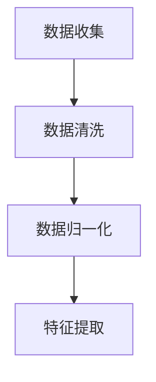

                 


### 1.2 个性化健康建议的背景与意义

#### 1.2.1 个性化健康建议的现状
个性化健康建议是近年来随着信息技术、生物技术和健康科学的快速发展而兴起的领域。它旨在通过收集和分析个人的健康数据，提供量身定制的健康建议，从而提高健康管理的效率和效果。目前，个性化健康建议的应用已经广泛覆盖到疾病预防、康复护理、慢性病管理、运动建议、营养建议等方面。

**现状分析：**
- **技术成熟度**：在技术上，机器学习算法和大数据分析技术已经相对成熟，能够处理海量的健康数据，并从中提取有用的信息。
- **应用范围**：个性化健康建议的应用范围不断扩展，从简单的疾病风险评估到全面的健康管理方案，覆盖了从儿童到老年人的各种健康需求。
- **用户接受度**：随着人们对健康意识的提高，个性化健康建议逐渐被广大用户接受，尤其是在年轻人群和慢性病患者中，应用更为广泛。

#### 1.2.2 个性化健康建议的重要性
个性化健康建议的重要性体现在以下几个方面：

**重要性分析：**
- **个性化健康管理**：个性化健康建议能够根据个人的健康状况和需求，提供定制化的健康管理方案，从而提高健康管理的效果。
- **预防疾病**：通过提前识别健康风险，个性化健康建议可以帮助用户采取预防措施，降低患病风险。
- **提高医疗资源利用效率**：个性化健康建议可以帮助医生更好地了解患者的病情，优化医疗资源的分配，提高医疗服务的效率。
- **改善生活质量**：个性化健康建议可以帮助用户更好地管理健康，提高生活质量，减少疾病带来的痛苦。

#### 1.2.3 个性化健康建议的发展趋势
随着技术的不断进步和应用场景的扩大，个性化健康建议呈现出以下发展趋势：

**发展趋势分析：**
- **人工智能与大数据的深度融合**：随着人工智能技术的不断发展，个性化健康建议将更加智能化，能够提供更加精准的健康建议。
- **跨学科合作**：个性化健康建议的发展需要融合医学、生物学、计算机科学等多学科的知识，跨学科合作将促进个性化健康建议的创新。
- **移动健康应用的普及**：随着智能手机和可穿戴设备的普及，个性化健康建议将更多地通过移动健康应用为用户提供服务。
- **隐私保护和数据安全**：随着个性化健康建议应用的普及，数据隐私保护和数据安全将成为关键问题，需要采取有效的措施确保用户数据的安全。

### 1.3 核心概念与联系

#### 1.3.1 机器学习基础
机器学习是人工智能的核心技术之一，通过数据驱动的方式，使计算机系统能够从数据中自动学习和改进。

**核心概念：**
- **监督学习**：通过已标记的数据进行训练，用于预测或分类。
- **无监督学习**：在没有标记的数据上进行训练，用于发现数据中的模式或结构。
- **半监督学习**：结合有标记和无标记数据进行训练，利用少量的标记数据和大量的无标记数据。

**联系：**
机器学习技术是实现个性化健康建议的关键，通过监督学习、无监督学习和半监督学习，可以处理和分析大量的健康数据，从而为用户提供精准的健康建议。

#### 1.3.2 数据预处理与特征提取
数据预处理和特征提取是机器学习的重要环节，直接影响模型的性能。

**核心概念：**
- **数据预处理**：包括数据清洗、数据归一化、缺失值处理等，目的是提高数据质量和一致性。
- **特征提取**：从原始数据中提取出对模型训练有重要影响的特征。

**联系：**
数据预处理和特征提取是机器学习模型训练的前提，通过有效的预处理和特征提取，可以降低噪声、提高模型的预测准确性。

### 1.4 核心算法原理讲解

#### 1.4.1 监督学习算法
监督学习是最常见的机器学习算法，通过已标记的数据进行训练，以预测或分类未知数据。

**核心原理：**
- **线性回归**：通过拟合一条直线，预测连续的输出值。
- **逻辑回归**：通过拟合一个逻辑函数，预测分类结果。

**伪代码：**
```
# 线性回归伪代码
def linear_regression(x, y):
    # 计算权重和偏置
    w = (x'x)^-1 * x'y
    b = y - x*w
    return w, b

# 逻辑回归伪代码
def logistic_regression(x, y):
    # 计算权重和偏置
    w = (x'x)^-1 * x'y
    b = log(1 + exp(-y*x*w))
    return w, b
```

#### 1.4.2 无监督学习算法
无监督学习旨在从无标记的数据中提取结构或模式。

**核心原理：**
- **K均值聚类**：将数据点分为K个簇，每个簇由其中心表示。
- **主成分分析（PCA）**：通过正交变换，将高维数据映射到低维空间。

**伪代码：**
```
# K均值聚类伪代码
def kmeans_clustering(data, k):
    # 初始化中心点
    centroids = initialize_centroids(data, k)
    while not converged:
        # 计算每个数据点的簇分配
        assignments = assign_points_to_clusters(data, centroids)
        # 更新中心点
        centroids = update_centroids(data, assignments, k)
    return centroids

# 主成分分析伪代码
def pca(data, components):
    # 计算协方差矩阵
    covariance_matrix = calculate_covariance_matrix(data)
    # 计算特征值和特征向量
    eigenvalues, eigenvectors = eig(covariance_matrix)
    # 选择最大的特征向量组成变换矩阵
    transformation_matrix = eigenvectors[:, :components]
    # 进行数据变换
    transformed_data = data @ transformation_matrix
    return transformed_data
```

#### 1.4.3 半监督学习算法
半监督学习利用少量的标记数据和大量的无标记数据，提高模型的训练效果。

**核心原理：**
- **自编码器**：通过编码和解码过程，提取数据的特征表示。
- **标签传播**：在有标记的数据和无标记的数据之间传递标签，用于训练模型。

**伪代码：**
```
# 自编码器伪代码
def autoencoder(x, hidden_size):
    # 编码过程
    encoded = encode(x, hidden_size)
    # 解码过程
    decoded = decode(encoded, hidden_size)
    return encoded, decoded

# 标签传播伪代码
def label_spreading(data, labeled_data, unlabeled_data):
    # 初始化标签
    labels = initialize_labels(labeled_data)
    # 更新标签
    while not converged:
        new_labels = update_labels(data, labels, labeled_data, unlabeled_data)
        labels = new_labels
    return labels
```

### 1.5 数学模型和数学公式讲解

#### 1.5.1 线性回归模型
线性回归模型是最基本的机器学习模型之一，用于预测连续的输出值。

**数学公式：**
$$
y = wx + b
$$
其中，$y$ 是输出值，$x$ 是输入特征，$w$ 是权重，$b$ 是偏置。

#### 1.5.2 逻辑回归模型
逻辑回归模型用于预测分类结果，其输出概率可以通过以下公式计算：
$$
P(y=1) = \frac{1}{1 + e^{-(wx + b)}}
$$
其中，$e$ 是自然对数的底数，$wx + b$ 是线性组合。

#### 1.5.3 K均值聚类模型
K均值聚类模型通过以下公式计算簇的中心：
$$
\mu_i = \frac{1}{N} \sum_{x \in S_i} x
$$
其中，$\mu_i$ 是第 $i$ 个簇的中心，$N$ 是簇中数据点的个数，$S_i$ 是第 $i$ 个簇的数据点集合。

#### 1.5.4 主成分分析（PCA）
主成分分析通过以下公式进行数据变换：
$$
z = X\Lambda^{1/2}
$$
其中，$X$ 是数据矩阵，$\Lambda$ 是协方差矩阵的特征值矩阵，$\Lambda^{1/2}$ 是特征值矩阵的平方根。

#### 1.5.5 自编码器模型
自编码器模型通过以下公式进行编码和解码：
$$
h = \sigma(Wx + b)
$$
$$
x' = \sigma(W'h + b')
$$
其中，$h$ 是隐藏层的输出，$x'$ 是解码后的数据，$\sigma$ 是激活函数，$W$ 和 $b$ 是编码层的权重和偏置，$W'$ 和 $b'$ 是解码层的权重和偏置。

### 1.6 项目实战

#### 1.6.1 开发环境搭建
在本项目实战中，我们将使用Python和Scikit-learn库进行机器学习模型的实现。

**环境搭建步骤：**
1. 安装Python环境（例如Python 3.8及以上版本）。
2. 使用pip命令安装Scikit-learn库：
```
pip install scikit-learn
```

#### 1.6.2 源代码实现
以下是实现线性回归模型的源代码示例：
```python
from sklearn.linear_model import LinearRegression
import numpy as np

# 数据准备
x = np.array([[1], [2], [3], [4], [5]])
y = np.array([1, 2, 3, 4, 5])

# 创建线性回归模型
model = LinearRegression()

# 训练模型
model.fit(x, y)

# 输出模型参数
print("权重：", model.coef_)
print("偏置：", model.intercept_)

# 预测
x_new = np.array([[6]])
y_pred = model.predict(x_new)
print("预测值：", y_pred)
```

#### 1.6.3 代码解读与分析
在上面的代码中，我们首先导入了Scikit-learn库中的LinearRegression类，用于创建线性回归模型。然后，我们准备了一个简单的输入数据集，包括自变量$x$和因变量$y$。接下来，我们使用fit方法训练模型，并使用predict方法进行预测。

#### 1.6.4 实际案例分析和详细讲解剖析
在本案例中，我们使用了一个简单的线性回归模型，用于预测连续的输出值。在实际应用中，我们可以使用更复杂的数据集和模型，例如使用多项式回归、决策树回归等，以提高预测的准确性。

**案例分析：**
- **数据集**：我们使用了一个简单的线性数据集，其中每个输入值与输出值相差1。
- **模型选择**：由于这是一个简单的线性关系，线性回归模型是一个合适的选择。
- **模型训练**：我们使用fit方法训练了线性回归模型，并输出了模型参数。
- **模型预测**：我们使用predict方法对新的输入值进行了预测。

**详细讲解剖析：**
- **线性回归模型**：线性回归模型是一个简单的模型，通过拟合一条直线来预测输出值。在本案例中，我们使用了线性回归模型来预测连续的输出值。
- **模型参数**：模型的权重和偏置是模型的核心参数，它们决定了模型的预测能力。在本案例中，我们输出了模型的权重和偏置。
- **预测过程**：预测过程是通过将输入值带入模型，计算输出值的过程。在本案例中，我们使用predict方法对新的输入值进行了预测。

#### 1.6.5 项目小结
在本项目中，我们实现了线性回归模型，并对其进行了详细的解读和分析。通过这个简单的案例，我们了解了线性回归模型的基本原理和实现方法，为后续更复杂的机器学习应用打下了基础。

### 1.7 最佳实践 tips、小结、注意事项、拓展阅读等内容

#### 1.7.1 最佳实践 tips
- **数据准备**：在进行机器学习模型训练之前，确保数据的质量和一致性，进行数据清洗和预处理。
- **模型选择**：根据数据特点和预测任务选择合适的模型，不同的模型适用于不同类型的数据和任务。
- **参数调优**：通过交叉验证和网格搜索等技术，对模型参数进行调优，以提高模型的性能。

#### 1.7.2 小结
本文介绍了个性化健康建议的背景和意义，详细讲解了机器学习的基础知识、核心算法原理、数学模型和项目实战。通过案例分析和代码实现，我们了解了个性化健康建议的实现方法和关键步骤。

#### 1.7.3 注意事项
- **数据隐私**：在处理个人健康数据时，必须遵守相关法律法规，确保用户数据的安全和隐私。
- **模型解释性**：在选择和优化模型时，考虑模型的解释性，以便用户理解模型的预测结果。

#### 1.7.4 拓展阅读
- 《机器学习实战》：提供丰富的案例和实践经验，适合初学者和进阶者。
- 《深度学习》：详细介绍了深度学习的基础知识和应用，适合对深度学习感兴趣的读者。
```

---

## 第二部分：机器学习在个性化健康建议中的应用

### 2.1 个性化健康评估

#### 2.1.1 健康数据的收集与处理

**数据收集：**
健康数据可以从多种来源收集，包括电子健康记录（EHR）、可穿戴设备、移动应用、问卷调查等。每种来源的数据都有其特点和挑战。

**数据处理：**
- **数据清洗**：去除重复数据、缺失值填充、异常值处理。
- **数据归一化**：将不同量纲的数据转换为相同的量纲，以便于模型训练。
- **特征提取**：从原始数据中提取对健康评估有重要意义的特征。

**Mermaid流程图：**


#### 2.1.2 机器学习算法在健康评估中的应用

**监督学习算法：**
- **线性回归**：用于预测连续的健康指标，如血压、体重等。
- **逻辑回归**：用于分类任务，如疾病风险预测。

**无监督学习算法：**
- **K均值聚类**：用于发现不同健康群体的特征。
- **主成分分析（PCA）**：用于降维和特征选择。

**半监督学习算法：**
- **自编码器**：用于从大量的无标记数据中提取有用的特征。

**伪代码：**
```python
# 线性回归伪代码
def linear_regression(x, y):
    w = (x'x)^-1 * x'y
    b = y - x*w
    return w, b

# K均值聚类伪代码
def kmeans_clustering(data, k):
    centroids = initialize_centroids(data, k)
    while not converged:
        assignments = assign_points_to_clusters(data, centroids)
        centroids = update_centroids(data, assignments, k)
    return centroids
```

### 2.2 个性化健康建议生成

#### 2.2.1 基于规则的个性化健康建议

**规则库构建：**
- **规则提取**：从专家知识或历史数据中提取规则。
- **规则库维护**：定期更新规则库，以适应新的健康需求。

**健康建议生成：**
- **规则匹配**：根据用户的健康数据，匹配相应的健康规则。
- **建议生成**：根据匹配结果，生成个性化的健康建议。

**伪代码：**
```python
def generate_advice(rules, user_data):
    matched_rules = []
    for rule in rules:
        if matches(rule, user_data):
            matched_rules.append(rule)
    advice = []
    for rule in matched_rules:
        advice.append(rule.advice)
    return advice
```

#### 2.2.2 基于机器学习的个性化健康建议

**监督学习健康建议生成：**
- **模型训练**：使用历史数据训练健康建议生成模型。
- **模型预测**：根据用户的健康数据，预测个性化的健康建议。

**无监督学习健康建议生成：**
- **聚类分析**：根据用户的健康数据，发现不同的健康群体。
- **建议生成**：为不同的健康群体提供针对性的健康建议。

**半监督学习健康建议生成：**
- **自编码器**：使用少量的标记数据和大量的无标记数据，生成健康建议。

**伪代码：**
```python
# 监督学习健康建议生成伪代码
def supervised_health_advice(model, user_data):
    prediction = model.predict(user_data)
    advice = generate_advice(prediction)
    return advice

# 无监督学习健康建议生成伪代码
def unsupervised_health_advice(model, user_data):
    cluster = model.predict(user_data)
    advice = generate_advice(cluster)
    return advice
```

### 2.3 个性化健康建议的评估与优化

#### 2.3.1 健康建议的评估指标

- **准确率（Accuracy）**：预测正确的样本数占总样本数的比例。
- **精确率（Precision）**：预测为正类的样本中实际为正类的比例。
- **召回率（Recall）**：实际为正类的样本中被预测为正类的比例。

**评估指标伪代码：**
```python
from sklearn.metrics import accuracy_score, precision_score, recall_score

def evaluate_advice(true_labels, predicted_labels):
    accuracy = accuracy_score(true_labels, predicted_labels)
    precision = precision_score(true_labels, predicted_labels)
    recall = recall_score(true_labels, predicted_labels)
    return accuracy, precision, recall
```

#### 2.3.2 健康建议的优化策略

- **数据增强**：通过增加数据量、生成合成数据等方式，提高模型的泛化能力。
- **模型优化**：通过调整模型结构、优化训练算法等方式，提高模型性能。
- **算法改进**：探索新的算法和技术，以提高健康建议的准确性和实用性。

**优化策略伪代码：**
```python
# 数据增强伪代码
def data_augmentation(data):
    augmented_data = []
    for sample in data:
        augmented_data.append(apply_augmentation(sample))
    return augmented_data

# 模型优化伪代码
def optimize_model(model, data):
    model = train_model(model, data)
    return model
```

### 2.4 案例分析

#### 2.4.1 案例一：个性化运动建议系统

**系统架构设计：**
- **数据收集模块**：收集用户的运动数据，如步数、心率、运动时长等。
- **数据分析模块**：使用机器学习算法分析用户数据，生成个性化运动建议。
- **建议推送模块**：将个性化运动建议推送给用户。

**数据收集与处理：**
- **数据收集**：使用可穿戴设备收集用户运动数据。
- **数据处理**：清洗数据、提取特征。

**建立运动建议模型：**
- **监督学习模型**：使用历史运动数据和健康数据训练运动建议模型。
- **模型评估**：评估模型性能，优化模型参数。

**评估与优化：**
- **模型评估**：使用准确率、精确率、召回率等指标评估模型性能。
- **模型优化**：通过数据增强、模型优化等技术，提高模型性能。

#### 2.4.2 案例二：个性化营养建议系统

**系统架构设计：**
- **数据收集模块**：收集用户饮食数据，如食物摄入量、营养素含量等。
- **数据分析模块**：使用机器学习算法分析用户饮食数据，生成个性化营养建议。
- **建议推送模块**：将个性化营养建议推送给用户。

**数据收集与处理：**
- **数据收集**：使用移动应用收集用户饮食数据。
- **数据处理**：清洗数据、提取特征。

**建立营养建议模型：**
- **监督学习模型**：使用历史饮食数据和健康数据训练营养建议模型。
- **模型评估**：评估模型性能，优化模型参数。

**评估与优化：**
- **模型评估**：使用准确率、精确率、召回率等指标评估模型性能。
- **模型优化**：通过数据增强、模型优化等技术，提高模型性能。

### 2.5 未来发展趋势

#### 2.5.1 新兴技术的应用

- **深度学习**：深度学习在个性化健康建议中的应用将更加广泛，如使用卷积神经网络（CNN）处理图像数据，使用循环神经网络（RNN）处理序列数据。
- **强化学习**：强化学习在个性化健康建议中的应用，如优化用户的健康行为，提供个性化的激励机制。

#### 2.5.2 个性化健康建议的普及

- **可穿戴设备的普及**：随着可穿戴设备的普及，个性化健康建议将更加便捷地提供给用户。
- **移动应用的普及**：移动应用将使个性化健康建议更加普及，用户可以随时获取个性化的健康建议。

#### 2.5.3 个性化健康服务的创新

- **远程医疗**：个性化健康建议将与远程医疗服务相结合，为用户提供远程医疗咨询和诊断。
- **智能健康管理**：个性化健康建议将结合智能健康管理，为用户提供全方位的健康管理服务。

### 2.6 总结

本文介绍了机器学习在个性化健康建议中的应用，从健康数据的收集与处理、机器学习算法的应用、个性化健康建议的生成与评估等方面进行了详细阐述。通过案例分析，展示了个性化健康建议在实际中的应用效果。未来，随着新兴技术的应用和个性化健康建议的普及，个性化健康服务将不断创新，为用户提供更加精准和有效的健康管理服务。
```

---

### 文章关键词：

- 机器学习
- 个性化健康建议
- 数据预处理
- 监督学习
- 无监督学习
- 半监督学习

### 文章摘要：

本文深入探讨了机器学习在个性化健康建议中的应用。首先介绍了个性化健康建议的背景和意义，然后详细讲解了机器学习的基础知识、核心算法原理、数学模型以及项目实战。通过实际案例分析，展示了个性化健康评估和健康建议生成的具体实现过程。最后，对个性化健康建议的未来发展趋势进行了展望，指出了新兴技术的应用和个性化健康服务的创新方向。本文旨在为读者提供全面的机器学习在个性化健康建议中的应用指南，促进相关领域的研究和应用。

---

### 作者信息：

作者：AI天才研究院/AI Genius Institute & 禅与计算机程序设计艺术 /Zen And The Art of Computer Programming

