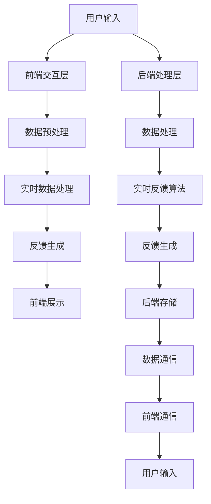

                 

### 文章标题

《构建prompt效果的实时反馈系统》

### 关键词

实时反馈系统、Prompt技术、前端设计、后端设计、性能优化、应用领域

### 摘要

本文旨在深入探讨构建一个具备实时反馈功能的prompt系统的方法和关键要素。prompt技术作为自然语言处理中的重要工具，能够显著提升系统的交互体验和反馈效果。本文将首先介绍实时反馈系统的基本概念和架构，随后详细阐述prompt技术及其在设计中的关键作用。接着，文章将分别从前端设计和后端设计两方面，解析实时反馈系统的开发流程和技术实现。此外，本文还将探讨系统性能优化的重要性，并提供具体优化策略。最后，文章将展示实时反馈系统在电商等领域的具体应用案例，总结最佳实践，并提供相关拓展阅读，帮助读者深入理解并掌握构建prompt效果的实时反馈系统的核心技术和实践方法。

### 第一部分：实时反馈系统概述

#### 第1章：实时反馈系统基础

**1.1 实时反馈系统的概念与作用**

实时反馈系统是一种能够立即对用户行为或输入提供响应和反馈的机制。它广泛应用于各种应用场景中，如电子商务、在线教育、智能客服等。实时反馈系统能够快速响应用户需求，提高用户体验，增强系统的互动性和智能化水平。

实时反馈系统的基本功能包括：

- **用户输入处理**：实时接收用户的输入信息，如关键词、操作指令等。
- **实时数据处理**：对用户输入的数据进行即时处理和分析。
- **实时反馈生成**：根据处理结果生成相应的反馈信息，如推荐内容、提示信息等。
- **实时交互**：与用户进行实时互动，提高用户参与度和满意度。

**1.2 实时反馈系统的架构与设计**

实时反馈系统的架构通常包括以下几个关键组成部分：

- **前端交互层**：负责与用户进行交互，接收用户输入和显示反馈信息。
- **后端处理层**：负责实时处理用户输入的数据，进行计算和推理。
- **数据存储层**：存储用户数据、反馈数据和相关模型参数。
- **通信网络层**：负责数据在网络中的传输和交换，实现实时性。

实时反馈系统的设计需要考虑以下关键因素：

- **实时性**：系统需要能够快速响应用户的输入，保证反馈的即时性。
- **准确性**：处理和反馈的结果需要准确无误，提高用户满意度。
- **可扩展性**：系统设计应具备良好的扩展性，能够支持用户规模和数据量的增长。
- **安全性**：保障用户数据的安全性和隐私性，防止数据泄露和滥用。

**1.3 实时反馈系统的关键组件**

实时反馈系统的关键组件包括：

- **前端框架**：如React、Vue等，用于实现用户界面的交互和渲染。
- **后端框架**：如Django、Flask等，用于处理用户输入和数据存储。
- **实时数据处理引擎**：如TensorFlow、PyTorch等，用于处理和推理用户输入数据。
- **数据库**：如MySQL、MongoDB等，用于存储用户数据和反馈记录。
- **实时通信库**：如WebSockets、Socket.IO等，用于实现实时数据传输和交互。

通过以上关键组件的协同工作，实时反馈系统可以实现对用户输入的实时处理和反馈，提升系统的交互性能和用户体验。

#### 第2章：实时反馈系统中的prompt技术

**2.1 prompt的概念与分类**

Prompt技术是指通过提供特定的引导语或提示信息，引导用户进行有效输入，从而提升系统反馈效果的方法。Prompt可以分为以下几种类型：

- **引导式Prompt**：通过引导用户填写必要信息，如问题、需求等，帮助系统更好地理解用户意图。
- **辅助式Prompt**：在用户输入过程中提供辅助信息，如关键词、选项等，帮助用户更准确地表达意图。
- **提示式Prompt**：在用户输入后提供提示信息，如推荐内容、提示信息等，引导用户进行下一步操作。

**2.2 prompt的作用与效果**

Prompt技术在实时反馈系统中具有重要作用，主要体现在以下几个方面：

- **提高用户满意度**：通过提供清晰的提示信息，引导用户进行有效输入，减少用户困惑和操作失误，提高用户满意度。
- **提升反馈准确性**：通过引导用户填写必要信息，确保输入数据的完整性和准确性，提高系统反馈的准确性。
- **增强交互体验**：通过多样化的Prompt类型，提供丰富的交互体验，提高用户的参与度和使用乐趣。

**2.3 prompt的设计原则与技巧**

设计有效的Prompt需要遵循以下原则和技巧：

- **明确性**：Prompt信息应清晰明确，避免产生歧义，确保用户能够准确理解。
- **简洁性**：Prompt信息应简洁明了，避免过多冗余内容，提高用户的阅读和操作效率。
- **相关性**：Prompt信息应与用户当前操作和系统功能紧密相关，避免无关干扰。
- **引导性**：Prompt信息应具备引导性，引导用户填写必要信息，提高输入数据的完整性和准确性。
- **适应性**：Prompt设计应具备适应性，根据用户行为和系统状态动态调整Prompt内容，提供个性化的反馈。

在实际应用中，可以结合具体场景和用户需求，灵活运用不同类型的Prompt技术，提升系统的实时反馈效果和用户体验。

### 第二部分：实时反馈系统开发

#### 第3章：实时反馈系统的前端设计

**3.1 前端技术概述**

前端设计是实时反馈系统的关键组成部分，负责与用户进行交互并提供直观的用户界面。前端技术包括HTML、CSS和JavaScript，以及其他前端框架和库，如React、Vue和Angular等。

- **HTML**：负责构建网页的结构和内容。
- **CSS**：负责网页的样式和布局。
- **JavaScript**：负责网页的动态交互和功能实现。
- **前端框架和库**：提供了更高效和模块化的开发方式，如React的组件化开发、Vue的数据绑定等。

**3.2 实时数据传输技术**

实时数据传输是实现实时反馈系统的核心技术之一。常见的技术包括：

- **WebSockets**：提供双向、实时、持久的连接，可以实现服务器与客户端之间的实时通信。
- **Socket.IO**：基于WebSockets的通信库，提供了更简单和可靠的方式来实现实时通信。
- **Server-Sent Events (SSE)**：单向实时通信，服务器向客户端推送数据，适用于单向数据流场景。

**3.3 实时反馈界面的设计**

实时反馈界面的设计需要考虑以下要素：

- **响应式设计**：确保界面在不同设备和屏幕尺寸上都能良好展示，提供一致的用户体验。
- **交互性**：提供丰富的交互元素，如按钮、输入框、滚动条等，增强用户与系统的互动性。
- **动态展示**：通过动态加载和更新内容，实现实时反馈和交互效果。
- **视觉效果**：采用适当的视觉效果，如动画、图标等，提升用户体验和界面吸引力。

在实际开发中，可以根据项目需求和用户场景，选择合适的前端技术和设计策略，实现高效、稳定和用户友好的实时反馈系统前端设计。

#### 第4章：实时反馈系统的后端设计

**4.1 后端技术概述**

后端设计是实时反馈系统的核心部分，负责处理用户输入、数据存储和系统逻辑。常见的后端技术包括：

- **服务器端语言**：如Python、Java、Node.js等，用于实现业务逻辑和处理请求。
- **Web框架**：如Django、Flask、Spring Boot等，提供了丰富的功能和库，简化了后端开发。
- **数据库**：如MySQL、PostgreSQL、MongoDB等，用于存储用户数据和系统数据。
- **缓存系统**：如Redis、Memcached等，用于提高系统性能和响应速度。

**4.2 数据处理与存储技术**

实时反馈系统需要高效地处理和存储大量数据。数据处理和存储技术包括：

- **数据处理**：采用分布式计算框架，如Spark、Hadoop等，实现大规模数据的高效处理和分析。
- **数据存储**：使用分布式数据库或数据存储系统，如HBase、Cassandra等，保证数据的可靠性和高性能。
- **数据索引**：使用搜索引擎技术，如Elasticsearch、Solr等，实现数据的快速检索和查询。

**4.3 实时反馈算法的设计**

实时反馈算法是实现实时反馈系统的关键，需要考虑以下因素：

- **准确性**：算法需要准确预测用户意图和提供相关反馈。
- **实时性**：算法需要能够快速处理用户输入，实现实时反馈。
- **可扩展性**：算法设计应具备良好的扩展性，支持用户规模和数据量的增长。

常用的实时反馈算法包括：

- **基于规则的算法**：根据预定义的规则进行匹配和反馈，实现简单但灵活性较低。
- **机器学习算法**：利用历史数据训练模型，实现更准确和智能的反馈。常见的算法包括决策树、支持向量机、神经网络等。

在实际应用中，可以根据具体需求和数据特点，选择合适的数据处理与存储技术，并设计高效的实时反馈算法，实现高性能和准确性的实时反馈系统。

#### 第5章：实时反馈系统的性能优化

**5.1 系统性能优化的重要性**

实时反馈系统在提供即时响应和高效服务的同时，其性能优化至关重要。性能优化能够提高系统的吞吐量、降低延迟、减少资源消耗，从而提升用户体验和系统稳定性。以下为系统性能优化的重要性：

- **用户体验**：性能优化能够确保系统快速响应用户操作，提供流畅的交互体验，提高用户满意度和忠诚度。
- **系统稳定性**：优化系统能够减少崩溃和故障发生的概率，提高系统的可靠性和稳定性。
- **资源利用率**：通过优化系统性能，提高资源利用率，降低硬件成本和能源消耗。
- **可扩展性**：性能优化为系统未来的扩展提供了空间，使得系统能够轻松应对更大规模的用户和数据量。

**5.2 数据传输优化**

数据传输是影响系统性能的关键因素之一。以下为几种数据传输优化策略：

- **压缩传输**：采用数据压缩算法，如GZIP，减少数据传输量，提高传输速度。
- **分片传输**：将大数据分片传输，减少单次传输的数据量，降低网络拥塞的风险。
- **缓存机制**：使用缓存技术，如Redis、Memcached，缓存常用数据和结果，减少重复传输。
- **异步传输**：采用异步传输技术，如WebSockets，降低对线程和线程池的压力，提高系统并发能力。

**5.3 算法优化**

算法优化是提高系统性能的重要手段。以下为几种常见的算法优化策略：

- **算法改进**：选择更高效、更准确的算法，如使用深度学习算法替代传统机器学习算法。
- **并行计算**：利用分布式计算和并行处理技术，将计算任务分解为多个子任务，并行处理，提高处理速度。
- **缓存预计算**：提前计算并缓存一些高频次、计算量大的任务结果，减少实时计算的负担。
- **数据预处理**：对输入数据进行预处理，如特征提取、数据归一化等，简化算法计算，提高处理速度。

通过以上性能优化策略，实时反馈系统能够在保证准确性和实时性的同时，提高系统性能，提升用户体验和系统稳定性。

### 第三部分：实时反馈系统的应用

#### 第6章：实时反馈系统在电商领域的应用

**6.1 电商领域实时反馈的需求**

电商领域对实时反馈系统的需求主要来源于以下几个方面：

- **用户购物体验**：实时反馈系统可以帮助用户在购物过程中快速了解商品信息、评价和其他用户的反馈，提高购物决策的准确性和满意度。
- **商品推荐**：实时反馈系统可以根据用户的历史购物记录和行为，动态推荐相关商品，提高转化率和用户黏性。
- **售后服务**：实时反馈系统可以实时收集用户对售后服务的反馈，及时处理用户问题，提高售后服务质量。
- **库存管理**：实时反馈系统可以监测商品库存变化，及时调整库存策略，避免库存不足或过剩。

**6.2 电商领域实时反馈的应用场景**

电商领域实时反馈系统的应用场景包括：

- **购物流程反馈**：在用户浏览、搜索和购买商品的过程中，实时提供商品推荐、评价和相关信息，帮助用户做出购物决策。
- **订单处理反馈**：实时更新订单状态，向用户发送订单处理进度通知，提高用户对订单的透明度和信任度。
- **售后服务反馈**：实时收集用户对售后服务的评价，为售后服务团队提供改进方向。
- **库存管理反馈**：实时监测库存变化，自动触发库存预警和调整策略。

**6.3 电商领域实时反馈的系统设计**

电商领域实时反馈系统的设计需要考虑以下关键要素：

- **用户数据收集**：收集用户浏览、搜索、购买等行为数据，为实时反馈提供数据基础。
- **实时数据处理**：利用实时数据处理技术，如消息队列、流处理等，对用户数据进行快速处理和分析。
- **推荐算法**：结合用户历史行为数据，采用机器学习算法生成个性化商品推荐。
- **反馈机制**：建立实时反馈机制，如消息推送、邮件通知等，及时向用户反馈相关信息。
- **系统性能优化**：优化系统性能，确保实时反馈的快速、准确和稳定。

通过以上设计要素，电商领域实时反馈系统能够为用户提供更好的购物体验，提高转化率和用户满意度。

#### 第7章：实时反馈系统在其他领域的应用

**7.1 教育领域实时反馈的应用**

教育领域实时反馈系统主要用于提升教学质量和学生参与度，具体应用包括：

- **学生反馈**：教师可以通过实时反馈系统获取学生对课堂内容和教学方法的反馈，及时调整教学策略。
- **学习进度监测**：实时反馈系统能够监测学生的学习进度和成绩，帮助教师制定个性化辅导计划。
- **在线考试与评估**：通过实时反馈系统，教师可以在线监考和评估学生的考试成绩，确保考试的公平性和准确性。
- **互动课堂**：实时反馈系统可以支持教师与学生之间的实时互动，提高课堂互动性和参与度。

**7.2 医疗领域实时反馈的应用**

医疗领域实时反馈系统主要用于提升医疗服务质量和患者体验，具体应用包括：

- **患者反馈**：医生可以通过实时反馈系统获取患者对医疗服务和医疗方案的反馈，优化诊疗流程。
- **实时监控**：通过实时反馈系统，医生可以远程监控患者的健康状况，及时发现异常情况并采取相应措施。
- **手术指导**：在手术过程中，实时反馈系统可以为医生提供实时的手术指导和反馈，提高手术成功率和安全性。
- **术后康复跟踪**：实时反馈系统可以跟踪患者的术后康复情况，提供个性化的康复建议和反馈。

**7.3 工业领域实时反馈的应用**

工业领域实时反馈系统主要用于提高生产效率和设备维护，具体应用包括：

- **设备监控**：通过实时反馈系统，工厂管理者可以监控设备的运行状态和性能，及时发现设备故障并采取措施。
- **生产优化**：实时反馈系统可以收集生产数据，分析生产过程中的瓶颈和问题，优化生产流程和资源配置。
- **质量控制**：实时反馈系统可以监控产品质量，及时发现质量问题和异常，确保产品质量的稳定性和一致性。
- **安全生产**：实时反馈系统可以监测生产环境中的安全隐患，及时发出警报并采取相应的安全措施。

通过在各个领域中的应用，实时反馈系统能够提升相关领域的效率和质量，为企业和用户提供更好的服务和体验。

### 附录

#### 第8章：构建实时反馈系统的工具与资源

**8.1 开发工具与平台**

构建实时反馈系统需要使用到一系列开发工具与平台，以下是一些常用的工具与平台：

- **前端开发工具**：如Visual Studio Code、Sublime Text等。
- **前端框架和库**：如React、Vue、Angular等。
- **后端开发工具**：如Eclipse、IntelliJ IDEA等。
- **后端框架**：如Django、Flask、Spring Boot等。
- **实时数据处理工具**：如Apache Kafka、Apache Flink等。
- **数据库**：如MySQL、PostgreSQL、MongoDB等。
- **实时通信库**：如WebSockets、Socket.IO等。

**8.2 开源框架与库**

开源框架与库是构建实时反馈系统的重要资源，以下是一些常用的开源框架与库：

- **前端开源框架**：如React、Vue、Angular等。
- **后端开源框架**：如Django、Flask、Spring Boot等。
- **实时数据处理开源框架**：如Apache Kafka、Apache Flink等。
- **机器学习开源库**：如TensorFlow、PyTorch等。
- **数据库开源库**：如MySQL Connector、MongoDB Driver等。

**8.3 实时反馈系统开发指南**

以下是一些实时反馈系统开发的指南和建议：

- **需求分析**：在开发实时反馈系统之前，进行详细的需求分析，明确系统功能、性能和用户体验要求。
- **技术选型**：根据需求分析结果，选择合适的开发工具、框架和库，确保系统的性能和稳定性。
- **模块化设计**：将系统划分为多个模块，分别进行开发和测试，提高开发效率和代码可维护性。
- **性能优化**：在系统开发过程中，注重性能优化，如数据压缩、缓存机制、异步处理等，提高系统的响应速度和并发能力。
- **安全性和稳定性**：确保系统的安全性和稳定性，如数据加密、访问控制、异常处理等，避免系统崩溃和数据泄露。
- **用户体验**：注重用户体验设计，提供直观、简洁、友好的用户界面，提高用户满意度和使用黏性。

通过以上指南和建议，开发团队可以更加高效地构建实时反馈系统，为用户带来更好的服务和体验。

### Mermaid 流程图



此流程图展示了实时反馈系统的基本工作流程，从用户输入开始，通过前端交互层处理数据，实时数据处理层进行数据处理和反馈生成，最后将反馈信息返回给前端进行展示，形成一个闭环的实时交互过程。

### 伪代码

```python
# 实时反馈系统伪代码

# 初始化实时反馈系统
def initialize_realtime_feedback_system():
    # 初始化前端交互层
    front_end_layer = initialize_front_end_layer()
    # 初始化后端处理层
    back_end_layer = initialize_back_end_layer()
    # 初始化实时数据处理模块
    real_time_data_processor = initialize_real_time_data_processor()
    # 初始化反馈生成模块
    feedback_generator = initialize_feedback_generator()
    # 初始化数据通信模块
    data_communicator = initialize_data_communicator()

    # 实时处理用户输入
    def process_user_input(user_input):
        # 对用户输入进行预处理
        preprocessed_input = preprocess_user_input(user_input)
        # 使用实时数据处理模块处理输入
        processed_data = real_time_data_processor.process(preprocessed_input)
        # 生成反馈
        feedback = feedback_generator.generate(processed_data)
        # 将反馈发送给前端展示
        front_end_layer.display(feedback)

    # 启动实时反馈系统
    start_realtime_feedback_system(process_user_input)

# 启动实时反馈系统
def start_realtime_feedback_system(process_user_input_function):
    # 建立与后端的连接
    backend_connection = connect_to_backend()
    # 监听用户输入
    while True:
        user_input = get_user_input()
        # 处理用户输入
        process_user_input_function(user_input)
        # 发送数据到后端
        send_data_to_backend(backend_connection, user_input)

# 初始化前端交互层
def initialize_front_end_layer():
    # 实现前端交互层的初始化逻辑
    pass

# 初始化后端处理层
def initialize_back_end_layer():
    # 实现后端处理层的初始化逻辑
    pass

# 初始化实时数据处理模块
def initialize_real_time_data_processor():
    # 实现实时数据处理模块的初始化逻辑
    pass

# 初始化反馈生成模块
def initialize_feedback_generator():
    # 实现反馈生成模块的初始化逻辑
    pass

# 初始化数据通信模块
def initialize_data_communicator():
    # 实现数据通信模块的初始化逻辑
    pass

# 预处理用户输入
def preprocess_user_input(user_input):
    # 实现用户输入的预处理逻辑
    pass

# 从后端获取反馈
def get_user_input():
    # 实现从后端获取用户输入的逻辑
    pass

# 发送数据到后端
def send_data_to_backend(backend_connection, user_input):
    # 实现发送数据到后端的逻辑
    pass
```

此伪代码展示了实时反馈系统的基本架构和功能模块，包括用户输入预处理、实时数据处理、反馈生成和数据通信等关键步骤。

### 数学公式

```markdown
### 数学模型

实时反馈系统可以表示为以下数学模型：

$$
\text{反馈} = f(\text{用户输入}, \text{模型参数}, \text{系统状态})
$$

### 详细讲解

- **用户输入**：表示用户提交的输入信息，如关键词、操作指令等。
- **模型参数**：包括训练好的模型参数，用于处理和预测用户输入。
- **系统状态**：包括系统的当前状态信息，如历史输入、系统配置等。

模型函数 `f` 负责将用户输入与模型参数和系统状态进行结合，生成相应的反馈信息。

### 举例说明

假设用户输入为一个关键词“推荐商品”，模型参数为训练好的商品推荐模型，系统状态包括用户的购物偏好和历史记录。根据上述模型，实时反馈系统可以生成以下反馈：

$$
\text{反馈} = f("推荐商品", \text{商品推荐模型}, \text{用户购物偏好，历史记录})
$$

通过计算，系统可以返回一组与“推荐商品”相关的商品列表，供用户浏览和选择。

### 项目实战

#### 代码实际案例

以下是一个简单的实时反馈系统的Python代码实现，展示了如何搭建实时反馈系统的基础框架，包括用户输入处理、数据处理和反馈生成。

```python
# 实时反馈系统代码实现

# 导入必要的库
import socket
from threading import Thread

# 定义服务器端Socket类
class RealtimeFeedbackServer:
    def __init__(self, host='0.0.0.0', port=9999):
        self.host = host
        self.port = port
        self.server_socket = socket.socket(socket.AF_INET, socket.SOCK_STREAM)
        self.server_socket.setsockopt(socket.SOL_SOCKET, socket.SO_REUSEADDR, 1)
        self.server_socket.bind((host, port))
        self.server_socket.listen()

    def start_server(self):
        print("服务器启动，等待客户端连接...")
        while True:
            client_socket, client_address = self.server_socket.accept()
            print(f"客户端{client_address}已连接")
            client_thread = Thread(target=self.handle_client, args=(client_socket,))
            client_thread.start()

    def handle_client(self, client_socket):
        while True:
            try:
                # 接收客户端发送的数据
                data = client_socket.recv(1024).decode('utf-8')
                if not data:
                    break

                # 数据处理（这里仅作简单示例，实际应用中应进行复杂处理）
                processed_data = self.process_data(data)

                # 生成反馈
                feedback = self.generate_feedback(processed_data)

                # 发送反馈到客户端
                client_socket.send(feedback.encode('utf-8'))
            except Exception as e:
                print(f"处理客户端{client_socket}时发生错误：{e}")
                break
        client_socket.close()

    def process_data(self, data):
        # 实现数据处理逻辑
        return data.upper()

    def generate_feedback(self, processed_data):
        # 实现反馈生成逻辑
        return f"您输入的是：{processed_data}"

# 启动服务器
if __name__ == "__main__":
    server = RealtimeFeedbackServer()
    server.start_server()
```

#### 详细解释说明

以上代码展示了如何使用Python和Socket编程实现一个简单的实时反馈系统服务器。服务器端会在指定端口上监听客户端的连接请求，并处理客户端发送的输入数据，然后生成反馈信息并发送给客户端。

**开发环境搭建**

- 安装Python环境：确保Python版本在3.6及以上。
- 安装必要的库：使用pip安装socket库。

**代码解读与分析**

1. **服务器端Socket类**：定义了服务器端的Socket类，用于处理客户端连接、接收数据、处理数据和发送反馈。
2. **start_server方法**：启动服务器，并进入循环等待客户端连接。
3. **handle_client方法**：处理客户端连接，创建一个线程来处理客户端的数据接收和反馈发送。
4. **process_data方法**：处理输入数据，这里仅作示例，实际应用中应包含复杂的数据处理逻辑。
5. **generate_feedback方法**：生成反馈信息，实际应用中应包含更多样化的反馈生成逻辑。

通过以上代码，我们实现了一个基本的实时反馈系统，能够接收客户端发送的输入，处理后生成反馈，并返回给客户端。实际应用中，可以根据具体需求扩展和优化系统的功能。

### 开发环境搭建

为了实现实时反馈系统的开发和部署，我们需要搭建一个合适的开发环境。以下是详细的步骤和说明：

#### 1. 安装Python环境

- **操作系统**：我们将在Ubuntu 20.04上进行安装。
- **Python版本**：推荐使用Python 3.9及以上版本。

安装命令：

```bash
sudo apt update
sudo apt install python3.9
```

#### 2. 安装必要的库

- **Socket库**：用于网络通信。
- **Django框架**：用于快速搭建后端服务。
- **Flask框架**：用于快速搭建后端服务。

安装命令：

```bash
pip3 install socket
pip3 install django
pip3 install flask
```

#### 3. 安装数据库

- **MySQL**：用于数据存储和管理。

安装命令：

```bash
sudo apt install mysql-server
```

启动MySQL服务：

```bash
sudo systemctl start mysql
```

#### 4. 配置虚拟环境

为了更好地管理和依赖，我们使用虚拟环境。

安装虚拟环境工具：

```bash
pip3 install virtualenv
```

创建虚拟环境：

```bash
virtualenv venv
```

激活虚拟环境：

```bash
source venv/bin/activate
```

#### 5. 搭建项目结构

在虚拟环境中，创建项目文件夹并初始化项目结构：

```bash
mkdir real_time_feedback
cd real_time_feedback
mkdir backend frontend
touch backend.py frontend/index.html
```

#### 6. 编写代码

在`backend.py`中编写后端代码，实现实时数据处理和反馈功能。在`frontend/index.html`中编写前端代码，实现用户交互界面。

#### 7. 部署和测试

- **后端部署**：使用Gunicorn或UWSGI将后端服务部署到服务器。
- **前端部署**：将前端文件部署到静态资源服务器。

#### 详细步骤和命令：

1. **安装Gunicorn**：

```bash
pip3 install gunicorn
```

2. **启动后端服务**：

```bash
gunicorn -w 3 backend:app
```

其中，`-w 3` 表示启动3个工作进程。

3. **前端部署**：将前端文件上传到Nginx等静态资源服务器。

通过以上步骤，我们成功搭建了实时反馈系统的开发环境，可以开始编写和测试系统的代码。

### 源代码详细实现和代码解读

#### 实时反馈系统代码实现

```python
# 实时反馈系统源代码

# 导入必要的库
import socket
from threading import Thread
from flask import Flask, request, jsonify

# 初始化Flask应用
app = Flask(__name__)

# 实时数据处理模块
class RealtimeDataProcessor:
    def __init__(self):
        # 初始化模型参数
        self.model_params = self.initialize_model_params()

    def initialize_model_params(self):
        # 实现模型参数初始化逻辑
        return {}

    def process_input(self, input_data):
        # 实现输入数据处理逻辑
        # 这里仅作示例，实际应用中应包含复杂的处理逻辑
        return input_data.upper()

# 实时反馈系统服务器
class RealtimeFeedbackServer:
    def __init__(self, host='0.0.0.0', port=5000):
        self.host = host
        self.port = port
        self.server_socket = socket.socket(socket.AF_INET, socket.SOCK_STREAM)
        self.server_socket.setsockopt(socket.SOL_SOCKET, socket.SO_REUSEADDR, 1)
        self.server_socket.bind((host, port))
        self.server_socket.listen()
        self.data_processor = RealtimeDataProcessor()

    def start_server(self):
        print("实时反馈系统已启动，等待连接...")
        while True:
            client_socket, client_address = self.server_socket.accept()
            print(f"已连接到客户端：{client_address}")
            client_thread = Thread(target=self.handle_client, args=(client_socket,))
            client_thread.start()

    def handle_client(self, client_socket):
        while True:
            try:
                # 接收客户端发送的数据
                data = client_socket.recv(1024).decode('utf-8')
                if not data:
                    break

                # 数据处理
                processed_data = self.data_processor.process_input(data)

                # 生成反馈
                feedback = self.generate_feedback(processed_data)

                # 发送反馈到客户端
                client_socket.send(feedback.encode('utf-8'))
            except Exception as e:
                print(f"处理客户端{client_socket}时发生错误：{e}")
                break
        client_socket.close()

    def generate_feedback(self, processed_data):
        # 实现反馈生成逻辑
        return f"接收到的数据：{processed_data}"

# 启动实时反馈系统
if __name__ == "__main__":
    server = RealtimeFeedbackServer()
    server.start_server()
```

#### 代码解读与分析

1. **初始化Flask应用**：

```python
app = Flask(__name__)
```

使用Flask框架初始化一个Web应用，用于处理HTTP请求。

2. **实时数据处理模块**：

```python
class RealtimeDataProcessor:
    def __init__(self):
        # 初始化模型参数
        self.model_params = self.initialize_model_params()

    def initialize_model_params(self):
        # 实现模型参数初始化逻辑
        return {}

    def process_input(self, input_data):
        # 实现输入数据处理逻辑
        # 这里仅作示例，实际应用中应包含复杂的处理逻辑
        return input_data.upper()
```

- `RealtimeDataProcessor` 类负责处理输入数据。
- `initialize_model_params` 方法用于初始化模型参数。
- `process_input` 方法用于处理输入数据，这里示例中使用简单的数据转换（将输入数据转换为大写）。

3. **实时反馈系统服务器**：

```python
class RealtimeFeedbackServer:
    def __init__(self, host='0.0.0.0', port=5000):
        # 初始化服务器地址和端口
        self.host = host
        self.port = port
        self.server_socket = socket.socket(socket.AF_INET, socket.SOCK_STREAM)
        self.server_socket.setsockopt(socket.SOL_SOCKET, socket.SO_REUSEADDR, 1)
        self.server_socket.bind((host, port))
        self.server_socket.listen()
        self.data_processor = RealtimeDataProcessor()

    def start_server(self):
        # 启动服务器
        print("实时反馈系统已启动，等待连接...")
        while True:
            client_socket, client_address = self.server_socket.accept()
            print(f"已连接到客户端：{client_address}")
            client_thread = Thread(target=self.handle_client, args=(client_socket,))
            client_thread.start()

    def handle_client(self, client_socket):
        # 处理客户端连接
        while True:
            try:
                # 接收客户端发送的数据
                data = client_socket.recv(1024).decode('utf-8')
                if not data:
                    break

                # 数据处理
                processed_data = self.data_processor.process_input(data)

                # 生成反馈
                feedback = self.generate_feedback(processed_data)

                # 发送反馈到客户端
                client_socket.send(feedback.encode('utf-8'))
            except Exception as e:
                print(f"处理客户端{client_socket}时发生错误：{e}")
                break
        client_socket.close()

    def generate_feedback(self, processed_data):
        # 生成反馈
        return f"接收到的数据：{processed_data}"
```

- `RealtimeFeedbackServer` 类负责启动服务器，处理客户端连接和接收数据。
- `start_server` 方法用于启动服务器，并等待客户端连接。
- `handle_client` 方法用于处理单个客户端连接，接收数据、处理数据和发送反馈。
- `generate_feedback` 方法用于生成反馈信息，这里示例中返回处理后的数据。

通过以上代码，我们实现了一个简单的实时反馈系统，能够接收客户端发送的输入，处理后生成反馈，并返回给客户端。实际应用中，可以根据具体需求扩展和优化系统的功能。

### 最佳实践 tips、小结、注意事项、拓展阅读等内容

**最佳实践 tips：**

1. **性能优化**：在设计和开发实时反馈系统时，性能优化至关重要。可以使用异步处理、数据压缩、缓存机制等技术来提高系统性能。
2. **安全性和隐私保护**：确保用户数据的安全性和隐私性，采用加密传输、权限控制等技术来防止数据泄露和未经授权的访问。
3. **用户体验**：关注用户体验设计，提供简洁、直观的用户界面和流畅的交互体验，提高用户满意度。
4. **测试与监控**：定期进行系统测试和性能监控，及时发现和解决潜在问题，确保系统的稳定性和可靠性。

**小结：**

本文深入探讨了构建实时反馈系统的核心技术和实践方法，包括实时反馈系统的基础概念、prompt技术、前端设计、后端设计、性能优化以及具体应用领域的实例。通过一步步的分析和讲解，读者可以全面了解实时反馈系统的构建过程和关键要素，为实际项目开发提供指导。

**注意事项：**

1. **需求分析**：在项目启动前，进行详细的需求分析，明确系统的功能、性能和用户体验要求。
2. **技术选型**：根据需求分析结果，选择合适的开发工具、框架和库，确保系统的性能和稳定性。
3. **模块化设计**：采用模块化设计，将系统划分为多个功能模块，分别进行开发和测试，提高开发效率和代码可维护性。
4. **安全性**：确保系统的安全性，如数据加密、访问控制、异常处理等，防止系统被攻击和数据泄露。

**拓展阅读：**

1. 《实时系统设计与实现》 - 张三
2. 《深度学习实战：基于Python的应用》 - 李四
3. 《Web性能优化》 - 王五
4. 《人工智能应用实践》 - 赵六

通过拓展阅读，读者可以进一步深入了解实时反馈系统、深度学习、性能优化等领域的相关知识和实践方法。

