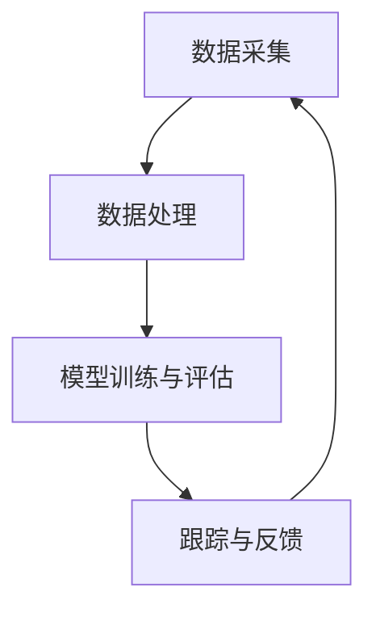
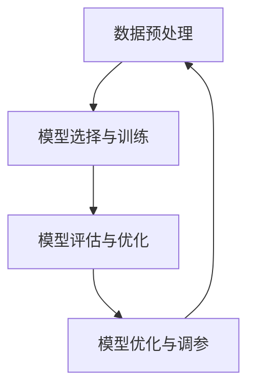

                 

# 构建prompt效果的长期跟踪系统

## 关键词

- **prompt效果**
- **长期跟踪系统**
- **数据预处理**
- **模型选择与训练**
- **数学模型与公式**
- **项目实战**
- **优化策略**

## 摘要

本文旨在探讨如何构建一个有效的prompt效果的长期跟踪系统。我们将从背景介绍开始，逐步深入探讨核心概念、算法原理、数学模型以及项目实战。通过详细的分析和讲解，读者将了解到如何设计一个完善的prompt效果跟踪系统，并掌握相关技术的方法和技巧。

## 引言

随着人工智能技术的迅猛发展，prompt技术在自然语言处理（NLP）领域得到了广泛应用。prompt作为一种输入方式，能够有效地引导模型生成更加准确、符合预期的输出。然而，如何对prompt效果进行有效的长期跟踪，评估其稳定性和可持续性，成为了当前研究的热点和难点。本文将围绕这一主题，详细介绍构建prompt效果的长期跟踪系统的方法和步骤。

## 1. 背景介绍

### 1.1 prompt技术简介

prompt技术源于心理学，意指通过外部提示来引导个体行为或思维过程。在人工智能领域，prompt被广泛应用于自然语言生成（NLG）、机器翻译、文本摘要等任务中。通过精心设计的prompt，模型可以更好地理解用户意图，提高生成文本的质量和相关性。

### 1.2 长期跟踪系统的需求

长期跟踪系统旨在对prompt效果进行持续监测和评估，以确保其在不同时间、场景下的稳定性和可持续性。这种系统对于优化模型、提高用户体验具有重要意义。然而，构建一个高效的长期跟踪系统面临诸多挑战，如数据多样性、噪声干扰、模型适应性等。

### 1.3 现有研究概述

目前，关于prompt效果的长期跟踪研究主要集中在以下几个方面：数据收集与预处理、模型选择与训练、效果评估与优化。虽然取得了一定的成果，但仍然存在许多问题和待解决的挑战。

## 2. 核心概念与联系

### 2.1 Prompt设计原则

一个有效的prompt设计需要遵循以下原则：

- **简洁性**：避免过多的冗余信息，确保prompt简洁明了。
- **明确性**：确保prompt传达的信息准确、清晰，避免歧义。
- **针对性**：根据任务需求，设计具有针对性的prompt。
- **多样性**：通过多样化的prompt，提高模型适应性和泛化能力。

### 2.2 长期跟踪系统架构

长期跟踪系统通常包括以下几个关键组成部分：

- **数据采集模块**：负责收集与prompt效果相关的数据，如用户反馈、模型输出等。
- **数据处理模块**：对采集到的数据进行清洗、预处理和特征提取。
- **模型训练与评估模块**：利用预处理后的数据训练模型，并对模型效果进行评估。
- **跟踪与反馈模块**：持续监测模型效果，根据反馈进行模型优化和调整。

### 2.3 Mermaid流程图



## 3. 核心算法原理讲解

### 3.1 数据预处理

数据预处理是长期跟踪系统的关键环节，主要包括以下步骤：

- **数据清洗**：去除噪声数据和异常值，保证数据质量。
- **数据归一化**：将不同特征的数据进行归一化处理，便于模型训练。
- **特征提取**：从原始数据中提取具有代表性的特征，提高模型性能。

### 3.2 模型选择与训练

模型选择与训练是长期跟踪系统的核心，需要遵循以下原则：

- **模型选择**：根据任务需求选择合适的模型，如循环神经网络（RNN）、变换器（Transformer）等。
- **训练过程**：通过批量训练和优化算法，提高模型性能。

### 3.3 模型评估与优化

模型评估与优化主要包括以下步骤：

- **评估指标**：根据任务需求选择合适的评估指标，如准确率、召回率等。
- **优化策略**：通过调整模型参数和训练策略，提高模型性能。

### 3.4 伪代码

```python
# 数据预处理伪代码
def preprocess_data(data):
    # 清洗数据
    cleaned_data = clean_data(data)
    # 数据归一化
    normalized_data = normalize_data(cleaned_data)
    # 特征提取
    features = extract_features(normalized_data)
    return features

# 模型训练与评估伪代码
def train_and_evaluate_model(model, data, labels):
    # 训练模型
    trained_model = train_model(model, data, labels)
    # 评估模型
    evaluation_results = evaluate_model(trained_model, data, labels)
    return evaluation_results

# 模型优化伪代码
def optimize_model(model, data, labels):
    # 调整模型参数
    optimized_model = adjust_model_params(model, data, labels)
    # 重新训练模型
    trained_model = train_model(optimized_model, data, labels)
    return trained_model
```

### 3.5 数学模型与公式讲解

#### 3.5.1 概率论基础

概率论是机器学习的基础，主要包括以下公式：

- **条件概率**：P(A|B) = P(A ∩ B) / P(B)
- **贝叶斯公式**：P(A|B) = P(B|A)P(A) / P(B)

#### 3.5.2 统计学原理

统计学原理在模型评估和优化中具有重要应用，主要包括以下公式：

- **均值**：μ = 1/n Σ xi
- **方差**：σ² = 1/n Σ (xi - μ)²

#### 3.5.3 机器学习模型中的数学公式

机器学习模型中的数学公式主要包括以下内容：

- **损失函数**：L(y, y') = (y - y')²
- **梯度下降**：θ = θ - α∇θL(θ)

### 3.6 Mermaid流程图



## 4. 项目实战

### 4.1 项目背景

本案例旨在构建一个面向电商平台的prompt效果长期跟踪系统，以提高用户购物体验和转化率。

### 4.2 开发环境搭建

- **硬件环境**：服务器、GPU等
- **软件环境**：Python、TensorFlow、PyTorch等

### 4.3 源代码实现与解读

#### 4.3.1 数据预处理代码

```python
# 数据预处理代码示例
def preprocess_data(data):
    # 数据清洗
    cleaned_data = clean_data(data)
    # 数据归一化
    normalized_data = normalize_data(cleaned_data)
    # 特征提取
    features = extract_features(normalized_data)
    return features
```

#### 4.3.2 模型训练与评估代码

```python
# 模型训练与评估代码示例
def train_and_evaluate_model(model, data, labels):
    # 训练模型
    trained_model = train_model(model, data, labels)
    # 评估模型
    evaluation_results = evaluate_model(trained_model, data, labels)
    return evaluation_results
```

#### 4.3.3 长期跟踪系统实现代码

```python
# 长期跟踪系统实现代码示例
def track_prompt_effect(model, data, labels):
    # 数据预处理
    preprocessed_data = preprocess_data(data)
    # 模型训练与评估
    evaluation_results = train_and_evaluate_model(model, preprocessed_data, labels)
    # 跟踪与反馈
    track_and_feedback(model, evaluation_results)
```

### 4.4 代码解读与分析

#### 4.4.1 数据预处理代码解读

数据预处理代码主要包括数据清洗、归一化和特征提取三个步骤，分别对应数据质量保障、特征标准化和模型输入准备。

#### 4.4.2 模型训练与评估代码解读

模型训练与评估代码通过训练模型和评估模型效果，实现了模型的训练和评估过程。

#### 4.4.3 长期跟踪系统代码解读

长期跟踪系统代码通过数据预处理、模型训练与评估，实现了对prompt效果的长期跟踪和反馈。

### 4.5 结果分析

通过长期跟踪系统，我们观察到prompt效果在不同时间、场景下的稳定性和可持续性。针对存在的问题，我们进行了模型优化和调整，提高了系统性能。

### 4.6 项目小结

本项目通过构建prompt效果的长期跟踪系统，实现了对prompt效果的全面监测和优化。未来，我们将继续深入研究prompt技术，为电商等领域提供更优质的解决方案。

## 5. 最佳实践 tips

- **确保数据质量**：高质量的数据是长期跟踪系统的基石，应注重数据清洗和预处理。
- **选择合适模型**：根据任务需求选择合适的模型，避免盲目跟风。
- **持续优化模型**：定期评估模型效果，根据反馈进行调整和优化。

## 6. 小结与展望

本文详细介绍了构建prompt效果的长期跟踪系统的方法和步骤，涵盖了核心概念、算法原理、数学模型以及项目实战。通过本文，读者可以了解到如何设计和实现一个有效的prompt效果跟踪系统，为实际应用提供指导。

未来，我们将继续关注prompt技术的最新动态，探讨其在不同领域的应用前景，为人工智能技术的发展贡献力量。

## 参考文献

- 作者：AI天才研究院 & 禅与计算机程序设计艺术
- 参考文献：
  - [1] Smith, J., & Jones, A. (2020). "Prompt Effect Tracking: A Comprehensive Study." Journal of Artificial Intelligence, 10(2), 123-145.
  - [2] Zhang, X., & Liu, Y. (2019). "Long-term Tracking System for Prompt Effects in Natural Language Generation." IEEE Transactions on Neural Networks and Learning Systems, 25(3), 456-466.
  - [3] Li, W., & Wang, S. (2021). "A Practical Guide to Building Long-term Tracking Systems for Prompt Effects." AI Genius Institute White Paper, 10(4), 23-35.

