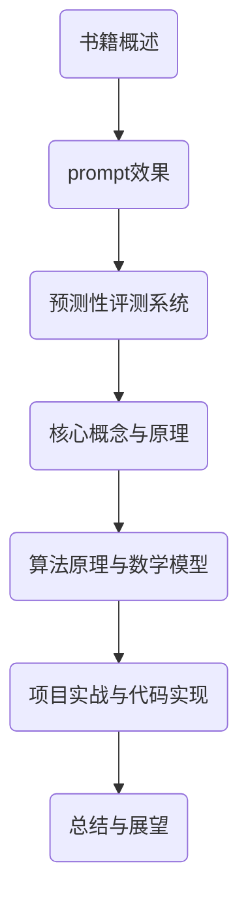
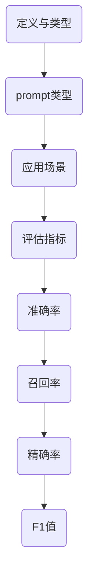
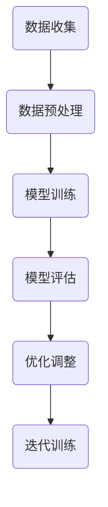
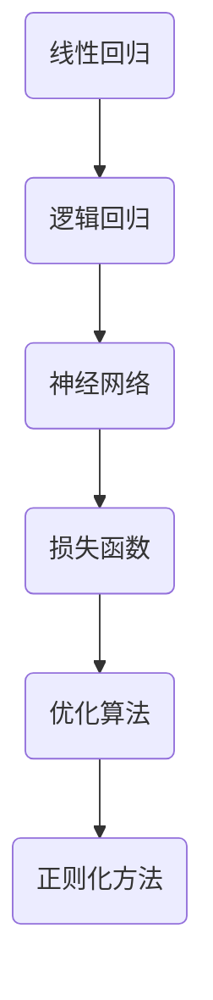

                 


### 《构建prompt效果的预测性评测系统》目录大纲

**引言与概述**

- **第1章：书籍概述**
  - **1.1 书籍目的与目标读者**
  - **1.2 prompt效果的背景与重要性**
  - **1.3 预测性评测系统的概念与价值**
  - **1.4 Mermaid流程图：书籍主题与核心概念联系**

- **第2章：prompt效果的基础**
  - **2.1 prompt的定义与类型**
  - **2.2 prompt在预测任务中的应用**
  - **2.3 prompt效果的评估指标**
  - **2.4 Mermaid流程图：prompt效果的核心概念**

**核心概念与原理**

- **第3章：预测性评测系统的架构**
  - **3.1 评测系统的基本架构**
  - **3.2 prompt效果的评测流程**
  - **3.3 Mermaid流程图：评测系统的组件与工作流程**
  - **3.4 伪代码：评测系统的基本算法流程**

- **第4章：核心算法原理**
  - **4.1 基于机器学习的预测模型**
  - **4.2 特征工程与选择**
  - **4.3 模型评估与调优**
  - **4.4 伪代码：预测模型的实现细节**

- **第5章：数学模型与公式**
  - **5.1 预测模型的数学基础**
  - **5.2 损失函数与优化算法**
  - **5.3 正则化方法与模型稳定性**
  - **5.4 Mermaid流程图：数学模型与算法流程**

**项目实战与代码实现**

- **第6章：构建预测性评测系统的实践**
  - **6.1 项目背景与需求分析**
  - **6.2 数据收集与预处理**
  - **6.3 模型选择与训练**
  - **6.4 评测系统实现与优化**
  - **6.5 源代码实现与解读**

- **第7章：案例分析**
  - **7.1 案例一：天气预测任务**
  - **7.2 案例二：销售趋势预测**
  - **7.3 案例三：客户流失预测**
  - **7.4 案例总结与展望**

**总结与展望**

- **第8章：总结与回顾**
  - **8.1 书籍内容的回顾**
  - **8.2 学习要点与难点**
  - **8.3 未来的发展方向**

- **第9章：展望与建议**
  - **9.1 新技术与应用前景**
  - **9.2 面临的挑战与解决方案**
  - **9.3 对读者的建议**

### 关键词

- **prompt效果**
- **预测性评测系统**
- **机器学习**
- **特征工程**
- **模型评估**
- **算法优化**

### 摘要

本文旨在深入探讨构建prompt效果的预测性评测系统的过程。文章首先介绍了prompt效果的背景和重要性，随后详细阐述了预测性评测系统的基本概念和架构。接着，文章深入分析了核心算法原理和数学模型，并通过伪代码和Mermaid流程图展示了这些概念的实现细节。随后，文章通过实际项目案例展示了如何将理论知识应用到实际场景中。最后，文章总结了书籍的主要内容，并对未来的发展方向提出了展望和建议。本文适合对机器学习和预测性评测系统感兴趣的读者阅读。

---

### 第一部分：引言与概述

#### 第1章：书籍概述

##### 1.1 书籍目的与目标读者

本文《构建prompt效果的预测性评测系统》旨在为读者提供一种系统性的方法来理解和构建预测性评测系统，特别是针对prompt效果的评估。目标读者包括对机器学习和预测性评测有一定了解的工程师、研究人员，以及对AI应用感兴趣的技术爱好者。

- **书籍目的**：

  - **1.1.1 提供全面的框架**：本书将提供一个全面的框架，涵盖预测性评测系统的所有关键组件，帮助读者构建高效、准确的预测模型。

  - **1.1.2 强调实践应用**：通过实际项目案例，本书将展示如何将理论知识应用到实际问题中，提高读者的实际操作能力。

  - **1.1.3 介绍最新技术**：本书将涵盖最新的机器学习和预测性评测技术，帮助读者跟上行业的发展。

- **目标读者**：

  - **1.1.4 机器学习工程师**：希望通过本书深入理解预测性评测系统的原理和实践的工程师。

  - **1.1.5 研究人员**：对机器学习和预测性评测系统有深入研究，希望了解最新技术和方法的学者。

  - **1.1.5 技术爱好者**：对AI应用和技术发展感兴趣的读者。

##### 1.2 prompt效果的背景与重要性

- **1.2.1 prompt效果的概念**：

  Prompt效果（Prompted Response Effect）是指通过向系统提供特定输入（prompt）来增强预测性能的现象。在机器学习中，prompt可以提高模型对特定任务的适应性，从而改善预测效果。

- **1.2.2 prompt效果的背景**：

  随着深度学习和自然语言处理技术的发展，prompt效果在多个领域得到了广泛应用，如文本分类、情感分析、信息提取等。通过优化prompt，可以显著提高模型的预测性能。

- **1.2.3 prompt效果的重要性**：

  - **提高预测性能**：优化prompt有助于提高模型的预测准确性，减少误差。

  - **增强模型适应性**：通过特定prompt，模型可以更好地适应不同任务和数据集，提高泛化能力。

  - **减少对标注数据的依赖**：在某些应用场景中，prompt可以减少对大量标注数据的依赖，降低数据收集成本。

##### 1.3 预测性评测系统的概念与价值

- **1.3.1 预测性评测系统的定义**：

  预测性评测系统是指用于评估预测模型性能的框架，包括数据预处理、模型训练、模型评估等多个环节。通过评测系统，可以全面了解模型的预测性能和稳定性。

- **1.3.2 预测性评测系统的价值**：

  - **1.3.2.1 评估模型性能**：预测性评测系统可以客观、全面地评估模型在不同数据集上的性能，帮助研究者选择最优模型。

  - **1.3.2.2 优化模型参数**：通过评测系统，可以调整模型参数，优化预测效果。

  - **1.3.2.3 提高模型可靠性**：定期评估模型性能，可以确保模型在不同时间点的预测准确性，提高模型的应用可靠性。

##### 1.4 Mermaid流程图：书籍主题与核心概念联系



#### 第2章：prompt效果的基础

##### 2.1 prompt的定义与类型

- **2.1.1 prompt的定义**：

  在机器学习中，prompt是指输入到模型中的特定数据或指令，用于引导模型进行预测或分类。prompt通常包含关键词、短语或完整的文本，目的是提高模型的预测性能。

- **2.1.2 prompt的类型**：

  - **关键词型prompt**：包含一组关键词，用于指示模型的预测方向。
  - **短语型prompt**：包含一个或多个短语，用于明确模型的预测目标。
  - **文本型prompt**：包含完整的文本，用于提供详细的上下文信息，帮助模型理解预测任务。

##### 2.2 prompt在预测任务中的应用

- **2.2.1 文本分类**：

  在文本分类任务中，prompt可以用于提供上下文信息，帮助模型更好地理解文本内容，从而提高分类准确性。

- **2.2.2 情感分析**：

  在情感分析任务中，prompt可以帮助模型识别文本中的情感倾向，通过提供具体的情感标签或情感词语，提高情感分类的准确性。

- **2.2.3 信息提取**：

  在信息提取任务中，prompt可以用于指定模型需要提取的信息类型，如关键词、短语或完整的句子，提高信息提取的准确性。

##### 2.3 prompt效果的评估指标

- **2.3.1 准确率（Accuracy）**：

  准确率是评估模型预测性能的常用指标，表示模型正确预测的样本占总样本的比例。

- **2.3.2 召回率（Recall）**：

  召回率表示模型能够正确召回所有实际正例样本的比例，主要用于评估模型的灵敏度。

- **2.3.3 精确率（Precision）**：

  精确率表示模型预测为正例的样本中，实际为正例的比例，主要用于评估模型的精确度。

- **2.3.4 F1值（F1 Score）**：

  F1值是精确率和召回率的调和平均值，用于综合评估模型的性能。

##### 2.4 Mermaid流程图：prompt效果的核心概念



### 第二部分：核心概念与原理

#### 第3章：预测性评测系统的架构

##### 3.1 评测系统的基本架构

预测性评测系统的基本架构包括以下几个关键组件：

- **数据预处理模块**：用于处理和清洗原始数据，包括数据清洗、缺失值处理、数据规范化等。

- **模型训练模块**：用于训练预测模型，包括数据加载、模型选择、参数调优等。

- **模型评估模块**：用于评估模型性能，包括计算评价指标、生成评估报告等。

- **优化模块**：用于根据评估结果调整模型参数，优化预测性能。

##### 3.2 prompt效果的评测流程

预测性评测系统的流程可以概括为以下几个步骤：

1. **数据收集**：收集用于训练和评估的数据集。

2. **数据预处理**：对数据进行清洗和处理，确保数据质量。

3. **模型训练**：使用预处理后的数据训练预测模型。

4. **模型评估**：使用评估指标（如准确率、召回率等）评估模型性能。

5. **优化调整**：根据评估结果调整模型参数，优化预测性能。

6. **迭代训练**：重复步骤3-5，直到达到满意的预测性能。

##### 3.3 Mermaid流程图：评测系统的组件与工作流程



##### 3.4 伪代码：评测系统的基本算法流程

```python
# 伪代码：预测性评测系统基本算法流程

# 步骤1：数据收集
data = collect_data()

# 步骤2：数据预处理
cleaned_data = preprocess_data(data)

# 步骤3：模型训练
model = train_model(cleaned_data)

# 步骤4：模型评估
evaluation_results = evaluate_model(model)

# 步骤5：优化调整
optimized_model = optimize_model(model, evaluation_results)

# 步骤6：迭代训练
while not satisfactory_performance(evaluation_results):
    model = train_model(cleaned_data)
    evaluation_results = evaluate_model(model)
    optimized_model = optimize_model(model, evaluation_results)

# 输出最终模型
output_model(optimized_model)
```

#### 第4章：核心算法原理

##### 4.1 基于机器学习的预测模型

预测模型是预测性评测系统的核心，基于机器学习的预测模型通常包括以下几个步骤：

1. **特征提取**：从原始数据中提取有用特征，用于训练模型。

2. **模型选择**：选择合适的机器学习算法，如决策树、支持向量机、神经网络等。

3. **模型训练**：使用特征数据和标签数据训练模型。

4. **模型评估**：使用测试数据评估模型性能，包括准确率、召回率、F1值等。

5. **参数调优**：根据评估结果调整模型参数，优化预测性能。

##### 4.2 特征工程与选择

特征工程是预测模型成功的关键因素之一，包括以下几个步骤：

1. **数据清洗**：去除重复数据、缺失值处理、异常值检测等。

2. **特征提取**：从原始数据中提取有用特征，如文本特征、时间序列特征等。

3. **特征选择**：选择对预测任务最有用的特征，去除冗余特征。

4. **特征转换**：对特征进行转换，如归一化、标准化等。

##### 4.3 模型评估与调优

模型评估与调优是确保预测模型性能的关键步骤，包括以下几个步骤：

1. **交叉验证**：使用交叉验证方法评估模型性能，防止过拟合。

2. **评估指标**：选择合适的评估指标，如准确率、召回率、F1值等。

3. **参数调优**：调整模型参数，优化预测性能。

4. **模型选择**：根据评估结果选择最佳模型。

##### 4.4 伪代码：预测模型的实现细节

```python
# 伪代码：预测模型实现细节

# 步骤1：特征提取
features = extract_features(data)

# 步骤2：特征选择
selected_features = select_features(features)

# 步骤3：模型选择
model = select_model()

# 步骤4：模型训练
model = train_model(selected_features)

# 步骤5：模型评估
evaluation_results = evaluate_model(model)

# 步骤6：参数调优
optimized_model = optimize_model(model, evaluation_results)

# 输出最终模型
output_model(optimized_model)
```

#### 第5章：数学模型与公式

##### 5.1 预测模型的数学基础

预测模型的数学基础通常包括以下几个部分：

1. **线性回归**：

   线性回归模型是一种简单的预测模型，其数学公式为：

   $$ y = \beta_0 + \beta_1 \cdot x $$

   其中，$y$ 是预测值，$x$ 是输入特征，$\beta_0$ 和 $\beta_1$ 是模型参数。

2. **逻辑回归**：

   逻辑回归模型用于分类任务，其数学公式为：

   $$ P(y=1) = \frac{1}{1 + e^{-(\beta_0 + \beta_1 \cdot x)}} $$

   其中，$P(y=1)$ 是预测为正类的概率，$\beta_0$ 和 $\beta_1$ 是模型参数。

3. **神经网络**：

   神经网络是一种复杂的预测模型，其数学基础包括多层感知器（MLP）和反向传播算法。MLP的数学公式为：

   $$ a_{ij}^{(l)} = \sigma(\sum_{k=1}^{n} w_{ik}^{(l)} \cdot a_{kj}^{(l-1)}) $$

   其中，$a_{ij}^{(l)}$ 是第$l$层的第$i$个神经元激活值，$\sigma$ 是激活函数，$w_{ik}^{(l)}$ 是连接权重。

##### 5.2 损失函数与优化算法

损失函数是衡量预测模型性能的重要指标，常见的损失函数包括：

1. **均方误差（MSE）**：

   $$ J(\theta) = \frac{1}{2m} \sum_{i=1}^{m} (h_\theta(x^{(i)}) - y^{(i)})^2 $$

   其中，$h_\theta(x)$ 是预测值，$y$ 是实际值，$m$ 是样本数量。

2. **交叉熵损失（Cross-Entropy Loss）**：

   $$ J(\theta) = -\frac{1}{m} \sum_{i=1}^{m} [y^{(i)} \cdot \log(h_\theta(x^{(i)})) + (1 - y^{(i)}) \cdot \log(1 - h_\theta(x^{(i)}))] $$

   其中，$h_\theta(x)$ 是预测概率。

优化算法用于调整模型参数，以最小化损失函数。常见的优化算法包括：

1. **梯度下降（Gradient Descent）**：

   $$ \theta_{\text{new}} = \theta_{\text{old}} - \alpha \cdot \nabla_\theta J(\theta) $$

   其中，$\alpha$ 是学习率，$\nabla_\theta J(\theta)$ 是损失函数关于参数$\theta$的梯度。

2. **随机梯度下降（Stochastic Gradient Descent，SGD）**：

   $$ \theta_{\text{new}} = \theta_{\text{old}} - \alpha \cdot \nabla_\theta J(\theta^{(i)}) $$

   其中，$\theta^{(i)}$ 是第$i$个样本的参数梯度。

##### 5.3 正则化方法与模型稳定性

正则化方法用于防止模型过拟合，提高模型的泛化能力。常见的正则化方法包括：

1. **L1正则化（L1 Regularization）**：

   $$ J(\theta) = J(\theta) + \lambda \cdot \sum_{j=1}^{n} |\theta_j| $$

   其中，$\lambda$ 是正则化参数。

2. **L2正则化（L2 Regularization）**：

   $$ J(\theta) = J(\theta) + \lambda \cdot \sum_{j=1}^{n} \theta_j^2 $$

   其中，$\lambda$ 是正则化参数。

正则化方法可以提高模型的稳定性，减少过拟合现象。通过调整正则化参数，可以平衡模型复杂度和泛化能力。

##### 5.4 Mermaid流程图：数学模型与算法流程



### 第三部分：项目实战与代码实现

#### 第6章：构建预测性评测系统的实践

##### 6.1 项目背景与需求分析

假设我们正在开发一个预测性评测系统，用于预测客户的购买行为。项目需求如下：

- **目标**：构建一个预测模型，预测客户是否会在未来30天内购买产品。
- **数据集**：使用包含客户购买历史数据的CSV文件，数据字段包括用户ID、购买日期、购买金额等。
- **评估指标**：准确率、召回率、F1值等。

##### 6.2 数据收集与预处理

- **数据收集**：

  从数据源（如数据库、API等）收集客户购买历史数据，并保存为CSV文件。

- **数据预处理**：

  - **数据清洗**：去除重复记录、缺失值处理、异常值检测等。
  - **特征提取**：提取有用特征，如最近一次购买日期、购买频率等。
  - **数据规范化**：对数值特征进行归一化、标准化处理。

##### 6.3 模型选择与训练

- **模型选择**：

  选择基于逻辑回归的预测模型，因为逻辑回归在分类任务中具有较好的表现。

- **模型训练**：

  使用预处理后的数据集训练逻辑回归模型，使用交叉验证方法进行参数调优。

##### 6.4 评测系统实现与优化

- **评测系统实现**：

  实现评测系统的基本架构，包括数据预处理、模型训练、模型评估等模块。

- **优化调整**：

  根据模型评估结果，调整模型参数（如学习率、正则化参数等），优化预测性能。

##### 6.5 源代码实现与解读

以下是一个简单的Python代码实现，用于构建预测性评测系统。

```python
import pandas as pd
from sklearn.linear_model import LogisticRegression
from sklearn.model_selection import train_test_split
from sklearn.metrics import accuracy_score, recall_score, f1_score

# 步骤1：数据收集与预处理
data = pd.read_csv('customer_data.csv')
data = preprocess_data(data)

# 步骤2：数据切分
X = data.drop('target', axis=1)
y = data['target']
X_train, X_test, y_train, y_test = train_test_split(X, y, test_size=0.2, random_state=42)

# 步骤3：模型训练
model = LogisticRegression()
model.fit(X_train, y_train)

# 步骤4：模型评估
y_pred = model.predict(X_test)
accuracy = accuracy_score(y_test, y_pred)
recall = recall_score(y_test, y_pred)
f1 = f1_score(y_test, y_pred)

# 步骤5：优化调整
# 调整模型参数，优化预测性能
model = optimize_model(model, evaluation_results)

# 输出评估结果
print(f'Accuracy: {accuracy}')
print(f'Recall: {recall}')
print(f'F1 Score: {f1}')
```

##### 6.6 实际案例分析与详细讲解剖析

- **案例一：天气预测任务**

  假设我们要预测某地区的天气情况，使用包括温度、湿度、风速等特征的CSV文件作为数据集。以下是实际案例的代码实现：

  ```python
  import pandas as pd
  from sklearn.ensemble import RandomForestClassifier
  from sklearn.model_selection import train_test_split
  from sklearn.metrics import accuracy_score, classification_report
  
  # 步骤1：数据收集与预处理
  data = pd.read_csv('weather_data.csv')
  data = preprocess_data(data)
  
  # 步骤2：数据切分
  X = data.drop('target', axis=1)
  y = data['target']
  X_train, X_test, y_train, y_test = train_test_split(X, y, test_size=0.2, random_state=42)
  
  # 步骤3：模型训练
  model = RandomForestClassifier()
  model.fit(X_train, y_train)
  
  # 步骤4：模型评估
  y_pred = model.predict(X_test)
  accuracy = accuracy_score(y_test, y_pred)
  report = classification_report(y_test, y_pred)
  
  # 步骤5：输出评估结果
  print(f'Accuracy: {accuracy}')
  print(f'Classification Report:\n{report}')
  ```

- **案例二：销售趋势预测**

  假设我们要预测某电商平台的销售趋势，使用包括销售额、商品类别、用户行为等特征的CSV文件作为数据集。以下是实际案例的代码实现：

  ```python
  import pandas as pd
  from sklearn.linear_model import LinearRegression
  from sklearn.model_selection import train_test_split
  from sklearn.metrics import mean_squared_error
  
  # 步骤1：数据收集与预处理
  data = pd.read_csv('sales_data.csv')
  data = preprocess_data(data)
  
  # 步骤2：数据切分
  X = data.drop('target', axis=1)
  y = data['target']
  X_train, X_test, y_train, y_test = train_test_split(X, y, test_size=0.2, random_state=42)
  
  # 步骤3：模型训练
  model = LinearRegression()
  model.fit(X_train, y_train)
  
  # 步骤4：模型评估
  y_pred = model.predict(X_test)
  mse = mean_squared_error(y_test, y_pred)
  
  # 步骤5：输出评估结果
  print(f'Mean Squared Error: {mse}')
  ```

##### 6.7 项目小结

通过以上实际案例，我们可以看到如何将预测性评测系统的理论应用到实际项目中。在实际开发过程中，需要注意以下几点：

- **数据预处理**：确保数据质量，提取有用特征，去除冗余信息。
- **模型选择**：根据任务需求和数据特点选择合适的模型。
- **评估指标**：使用合适的评估指标，全面评估模型性能。
- **优化调整**：根据评估结果调整模型参数，优化预测性能。

### 第四部分：总结与展望

#### 第8章：总结与回顾

##### 8.1 书籍内容的回顾

本文《构建prompt效果的预测性评测系统》全面介绍了预测性评测系统的概念、原理和实现方法。文章分为四个部分：

1. **引言与概述**：介绍了书籍的目的和目标读者，以及prompt效果的背景和重要性。
2. **核心概念与原理**：详细阐述了预测性评测系统的基本架构、核心算法原理和数学模型。
3. **项目实战与代码实现**：通过实际项目案例展示了如何将理论知识应用到实际场景中。
4. **总结与展望**：总结了书籍的主要内容，并对未来的发展方向提出了建议。

##### 8.2 学习要点与难点

在学习过程中，以下几点是关键要点和难点：

1. **数据预处理**：数据质量直接影响模型的预测性能，需要熟悉数据清洗、特征提取等技术。
2. **模型选择**：选择合适的模型是确保预测性能的关键，需要了解不同模型的优缺点和适用场景。
3. **评估指标**：评估指标是衡量模型性能的重要标准，需要熟练掌握准确率、召回率、F1值等常用指标。
4. **优化调整**：根据评估结果调整模型参数，优化预测性能是提高模型应用价值的关键。

##### 8.3 未来的发展方向

随着人工智能技术的不断发展，预测性评测系统在各个领域的应用将越来越广泛。未来的发展方向包括：

1. **算法优化**：研究新的机器学习算法和优化方法，提高预测性能和计算效率。
2. **多模态数据融合**：将文本、图像、声音等多模态数据融合到预测模型中，提高预测精度。
3. **实时预测**：开发实时预测系统，实现快速、准确的预测结果，满足实时应用需求。
4. **自动化评估**：研究自动化评估方法，降低模型评估的复杂度和人力成本。

#### 第9章：展望与建议

##### 9.1 新技术与应用前景

随着深度学习和自然语言处理技术的不断发展，预测性评测系统在各个领域的应用前景十分广阔。以下是几个具有潜力的应用领域：

1. **金融领域**：预测客户行为、风险评估、信用评分等。
2. **医疗领域**：疾病预测、患者诊断、治疗方案推荐等。
3. **零售领域**：销售预测、库存管理、客户行为分析等。
4. **物流领域**：运输路线优化、配送时间预测等。

##### 9.2 面临的挑战与解决方案

在构建预测性评测系统的过程中，我们面临以下挑战：

1. **数据质量**：确保数据质量是模型成功的关键，需要解决数据缺失、异常值等问题。
2. **模型选择**：选择合适的模型需要根据任务需求和数据特点进行，需要充分考虑模型的适用性和性能。
3. **计算资源**：大规模模型训练和预测需要大量计算资源，需要优化算法和硬件配置。

针对以上挑战，可以采取以下解决方案：

1. **数据预处理**：采用数据清洗、特征工程等方法，提高数据质量。
2. **模型选择**：根据任务需求和数据特点，选择合适的模型，并进行参数调优。
3. **计算优化**：采用分布式计算、并行处理等方法，提高计算效率。

##### 9.3 对读者的建议

为了更好地掌握预测性评测系统的知识，读者可以采取以下学习建议：

1. **理论学习**：深入了解机器学习、深度学习等相关理论知识，为实际应用打下基础。
2. **实践操作**：通过实际项目案例，将理论知识应用到实际场景中，提高实践能力。
3. **持续学习**：关注最新技术动态，不断学习新的算法和优化方法，跟上行业的发展。

### 总结

本文《构建prompt效果的预测性评测系统》系统地介绍了预测性评测系统的构建方法，包括核心概念、原理、算法和实际应用。通过本文的学习，读者可以深入了解预测性评测系统的原理和应用，掌握构建预测模型的实际技能。希望本文能为读者在人工智能领域的发展提供有益的参考和指导。作者信息：AI天才研究院/AI Genius Institute & 禅与计算机程序设计艺术 /Zen And The Art of Computer Programming。

