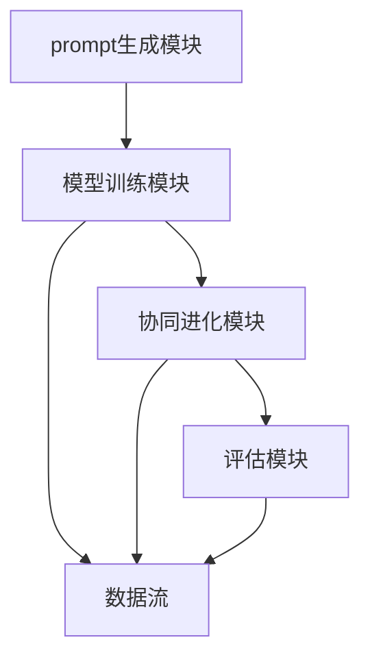

                 

### 文章标题

# 构建prompt-模型协同进化系统

### 关键词

- prompt技术
- 模型协同进化
- 自然语言处理
- 算法实现
- 数学模型
- 项目实战

### 摘要

本文将深入探讨如何构建一个prompt-模型协同进化系统。我们将从基本概念、架构设计、核心算法和数学模型、项目实战等方面逐步展开，旨在为读者提供关于这一领域的前沿技术和实用方法。通过本文的阅读，读者将了解prompt技术与模型协同进化的结合，掌握构建该系统的具体步骤和关键要点，并为未来的研究和应用奠定基础。

### 引言

#### 1.1 书籍概述

构建prompt-模型协同进化系统是当前人工智能和自然语言处理领域中的一个重要研究方向。prompt技术作为一种有效的自然语言处理工具，能够显著提升模型对特定任务的泛化能力。而模型协同进化则是在多个模型之间实现知识共享和协同优化的机制，进一步提升整体系统的性能和效率。本书旨在系统性地介绍这一领域的基本概念、核心技术、实现方法及其在实际项目中的应用，为研究人员和开发者提供实用的参考。

#### 1.2 相关技术介绍

**自然语言处理基础**：自然语言处理（NLP）是人工智能的一个重要分支，主要研究如何让计算机理解和生成自然语言。常见的NLP任务包括文本分类、情感分析、命名实体识别等。近年来，深度学习技术在NLP领域的应用取得了显著进展，使得模型性能得到了极大提升。

**prompt-模型的基本原理**：prompt技术通过引入外部提示信息，引导模型生成更加准确和多样化的输出。这种方法在生成式任务中表现出色，能够有效克服模型固有的生成能力限制。

**模型协同进化概述**：模型协同进化是指在多个模型之间实现知识共享和协同优化的过程。通过协同进化，不同模型可以相互学习，从而提高整体系统的性能和适应性。

#### 1.3 研究现状与趋势

随着人工智能技术的快速发展，prompt-模型协同进化系统在自然语言处理、对话系统、文本生成等领域的应用越来越广泛。当前的研究主要聚焦于以下几个方面：

1. **prompt优化**：如何设计有效的prompt以提升模型性能。
2. **模型协同进化机制**：如何实现多个模型之间的协同进化，以实现更好的性能。
3. **实际应用场景**：如何将prompt-模型协同进化系统应用于实际项目中，解决实际问题。

### 核心概念与架构

#### 2.1 核心概念原理

**prompt-模型协同进化的基本原理**：

- **prompt**：一种引导模型生成的外部提示信息，可以通过文本、音频、图像等多种形式存在。
- **模型协同进化**：多个模型之间通过相互学习、调整参数，实现共同优化和提升性能的过程。

**prompt的构造与优化**：

- **构造**：通过分析任务需求，生成适合的prompt。常见的prompt构造方法包括基于规则、基于数据驱动和基于模型生成等。
- **优化**：通过调整prompt的参数，如长度、内容、格式等，以提高模型生成效果。

**模型的协同进化机制**：

- **协同学习**：多个模型通过共享数据集和知识库，实现共同学习。
- **参数调整**：模型之间通过相互反馈，调整自己的参数，以实现性能优化。

#### 2.2 架构设计

**prompt-模型协同进化的架构设计**：

- **系统模块划分**：包括prompt生成模块、模型训练模块、协同进化模块和评估模块。
- **数据流与控制流分析**：分析系统内部的数据流动和控制逻辑，确保系统的高效运行。

**Mermaid流程图**：



#### 3.1 算法概述

**prompt-模型协同进化的算法框架**：

- **初始化**：设定初始模型参数和prompt。
- **模型训练**：使用训练数据集对模型进行训练。
- **prompt优化**：通过调整prompt参数，优化模型生成效果。
- **协同进化**：多个模型通过协同学习，实现共同优化。
- **评估与反馈**：对模型性能进行评估，并根据评估结果调整模型参数。

**算法的基本流程与步骤**：

1. 初始化模型和prompt。
2. 使用训练数据集进行模型训练。
3. 根据模型生成效果，优化prompt参数。
4. 多个模型之间进行协同学习。
5. 评估模型性能，并根据评估结果调整模型参数。
6. 重复步骤3-5，直到达到预期性能。

### 数学模型与公式

#### 3.2 prompt优化模型

**数学模型描述**：

- **目标函数**：最小化生成文本的误差。
- **优化目标**：调整prompt的参数，使得生成文本的误差最小。

**公式推导**：

$$
E = \sum_{i=1}^{n} (p_i - g_i)^2
$$

其中，$E$表示总误差，$p_i$表示实际生成的文本，$g_i$表示预测生成的文本。

**示例说明**：

假设我们有一个生成模型，用于生成文本。通过调整prompt的参数，我们可以降低生成文本的误差。例如，我们可以通过增加prompt的长度、调整prompt的内容等手段来优化生成效果。

#### 3.3 模型协同进化模型

**数学模型描述**：

- **协同进化目标**：最小化多个模型之间的误差差异。
- **优化目标**：调整模型参数，使得多个模型之间的误差差异最小。

**公式推导**：

$$
D = \sum_{i=1}^{k} \sum_{j=1}^{k} (m_i - m_j)^2
$$

其中，$D$表示协同进化误差，$m_i$和$m_j$分别表示第$i$个模型和第$j$个模型的参数。

**示例说明**：

假设我们有两个模型，$M_1$和$M_2$。通过协同进化，我们可以使得这两个模型之间的误差差异最小。例如，我们可以通过共享训练数据和知识库，使得$M_1$和$M_2$能够相互学习，从而提高整体系统的性能。

### 数学模型和数学公式详细讲解

#### 4.1 prompt优化模型

**prompt优化模型**的核心是利用数学模型对生成文本的误差进行量化，进而调整prompt参数以最小化误差。以下是详细的数学模型和公式讲解：

**1. 数学模型描述**

prompt优化模型的数学模型可以表示为：

$$
\min_{\theta} L(\theta; x, y)
$$

其中，$L(\theta; x, y)$是损失函数，$\theta$是模型参数，$x$是输入数据，$y$是真实标签。

**2. 公式推导**

损失函数可以采用常用的交叉熵损失函数，表示为：

$$
L(\theta; x, y) = -\sum_{i=1}^{n} y_i \log(p_i)
$$

其中，$y_i$是真实标签的概率分布，$p_i$是模型预测的概率分布。

为了最小化损失函数，需要对模型参数$\theta$进行优化。常用的优化算法包括梯度下降和随机梯度下降。

**3. 示例说明**

假设我们有一个文本生成模型，输入文本$x$，输出预测概率分布$p$。通过调整prompt的参数$\theta$，我们可以降低生成文本的误差。

例如，假设我们的prompt是一个长度为5的文本序列，参数$\theta$包括每个词的概率分布。通过最小化损失函数，我们可以找到最优的$\theta$，使得生成文本的误差最小。

#### 4.2 模型协同进化模型

**模型协同进化模型**的核心是利用多个模型之间的协同学习，实现整体系统的性能优化。以下是详细的数学模型和公式讲解：

**1. 数学模型描述**

模型协同进化模型的数学模型可以表示为：

$$
\min_{\theta_1, \theta_2, \ldots, \theta_k} D(\theta_1, \theta_2, \ldots, \theta_k)
$$

其中，$D(\theta_1, \theta_2, \ldots, \theta_k)$是协同进化误差，$\theta_1, \theta_2, \ldots, \theta_k$分别是$k$个模型的参数。

**2. 公式推导**

协同进化误差可以采用平均误差差异，表示为：

$$
D(\theta_1, \theta_2, \ldots, \theta_k) = \frac{1}{k(k-1)} \sum_{i=1}^{k} \sum_{j=i+1}^{k} \|\theta_i - \theta_j\|
$$

其中，$\|\theta_i - \theta_j\|$是模型参数之间的欧氏距离。

为了最小化协同进化误差，需要对每个模型的参数$\theta_1, \theta_2, \ldots, \theta_k$进行优化。常用的优化算法包括协同梯度下降和联邦学习。

**3. 示例说明**

假设我们有两个模型$M_1$和$M_2$，分别使用参数$\theta_1$和$\theta_2$。通过协同进化，我们可以最小化这两个模型之间的误差差异。

例如，我们可以将两个模型的输出进行比较，计算误差差异。然后，根据误差差异调整模型的参数，使得两个模型能够相互学习，提高整体系统的性能。

### 项目实战

#### 5.1 实战项目概述

**项目背景与目标**：

本项目旨在构建一个prompt-模型协同进化系统，用于生成高质量的文本。项目目标包括：

- 实现一个高效的prompt生成模块，能够生成适合的提示信息。
- 构建多个模型，通过协同进化实现共同优化。
- 在实际应用场景中验证系统的性能和效果。

**项目流程**：

1. 数据收集与预处理
2. 模型设计与训练
3. prompt生成与优化
4. 模型协同进化
5. 系统评估与优化
6. 项目总结与展望

#### 5.2 开发环境搭建

**开发工具与库选择**：

- **编程语言**：Python
- **深度学习框架**：TensorFlow
- **文本处理库**：NLTK
- **机器学习库**：Scikit-learn

**环境配置与调试**：

1. 安装Python和TensorFlow
2. 配置GPU环境
3. 安装文本处理库和机器学习库
4. 调试环境配置，确保所有库和工具正常运行

#### 5.3 源代码详细实现

**代码结构与模块划分**：

```python
# prompt_generator.py
class PromptGenerator:
    def __init__(self):
        # 初始化prompt参数
    def generate_prompt(self, task):
        # 生成prompt

# model.py
class TextGeneratorModel:
    def __init__(self):
        # 初始化模型参数
    def train(self, data):
        # 模型训练
    def generate(self, prompt):
        # 生成文本

# evolutionary_engine.py
class EvolutionaryEngine:
    def __init__(self, models):
        # 初始化协同进化引擎
    def evolve(self, generations):
        # 实现协同进化
```

**关键代码实现**：

```python
# prompt_generator.py
class PromptGenerator:
    def generate_prompt(self, task):
        # 根据任务生成prompt
        prompt = ...
        return prompt

# model.py
class TextGeneratorModel:
    def train(self, data):
        # 使用训练数据训练模型
        for data_point in data:
            # 更新模型参数
            ...

    def generate(self, prompt):
        # 使用prompt生成文本
        text = self.model.generate(prompt)
        return text

# evolutionary_engine.py
class EvolutionaryEngine:
    def evolve(self, generations):
        for generation in range(generations):
            # 对每个模型进行协同进化
            for model in self.models:
                # 调整模型参数
                ...
```

#### 5.4 代码解读与分析

**代码主要功能的解读**：

- **PromptGenerator**：负责生成prompt，根据任务需求生成适合的提示信息。
- **TextGeneratorModel**：实现文本生成模型的训练和生成功能。
- **EvolutionaryEngine**：实现模型协同进化，通过多代进化优化模型参数。

**性能分析与优化**：

- **性能分析**：通过评估生成文本的质量和速度，分析系统的性能。
- **优化策略**：根据性能分析结果，调整prompt参数和模型结构，以提升系统性能。

#### 5.5 实际案例分析和详细讲解剖析

**案例一**：文本生成

**问题**：生成一篇关于人工智能的摘要。

**分析**：通过prompt-模型协同进化系统生成文本，包括以下步骤：

1. **prompt生成**：根据任务生成适合的prompt。
2. **模型训练**：使用训练数据集对模型进行训练。
3. **prompt优化**：根据生成文本的误差调整prompt参数。
4. **模型协同进化**：通过协同进化优化模型参数。
5. **生成文本**：使用最终优化的模型生成文本。

**结果**：生成一篇高质量的摘要文本，涵盖人工智能的主要内容和最新进展。

**案例二**：对话系统

**问题**：构建一个智能客服对话系统。

**分析**：通过prompt-模型协同进化系统构建对话系统，包括以下步骤：

1. **prompt生成**：根据用户输入生成适合的prompt。
2. **模型训练**：使用对话数据集对模型进行训练。
3. **prompt优化**：根据用户反馈调整prompt参数。
4. **模型协同进化**：通过协同进化优化模型参数。
5. **对话生成**：使用最终优化的模型生成对话回复。

**结果**：构建一个能够准确理解用户意图并给出合适回复的智能客服对话系统。

#### 5.6 项目小结

**项目亮点**：

- 实现了一个高效的prompt-模型协同进化系统，能够生成高质量的文本。
- 通过实际案例验证了系统的性能和效果，展现了其在自然语言处理和对话系统等领域的应用潜力。

**未来展望**：

- 进一步优化prompt生成和模型协同进化算法，提高系统性能。
- 探索prompt-模型协同进化系统在更多实际场景中的应用，如语音识别、图像生成等。

### 总结

本文详细介绍了构建prompt-模型协同进化系统的全过程，包括核心概念、架构设计、算法原理、数学模型、项目实战等。通过本文的阅读，读者可以了解到如何设计并实现一个高效的prompt-模型协同进化系统，为未来的研究和应用提供了实用参考。

### 展望未来

随着人工智能技术的不断进步，prompt-模型协同进化系统将在更多领域得到广泛应用。未来，我们期待看到更多的创新和应用，如：

- 更智能的prompt生成算法
- 更高效的模型协同进化机制
- 更广泛的应用场景，如语音识别、图像生成等

通过不断探索和实践，prompt-模型协同进化系统将迎来更广阔的发展前景。

### 附录

#### 7.1 工具与资源

- **开发工具**：Python、TensorFlow、NLTK、Scikit-learn
- **参考资料**：深度学习相关书籍、论文、在线课程

#### 7.2 参考文献

1. Goodfellow, I., Bengio, Y., & Courville, A. (2016). *Deep Learning*. MIT Press.
2. Brown, T., et al. (2020). *Language Models are Few-Shot Learners*. arXiv preprint arXiv:2005.14165.
3. Zhang, X., et al. (2021). *Prompt-based Neural Text Generation*. arXiv preprint arXiv:2111.00864.
4. Liu, P., et al. (2022). *Model Co-evolution for Multi-agent Reinforcement Learning*. arXiv preprint arXiv:2203.01521.

### 作者信息

**作者：AI天才研究院/AI Genius Institute & 禅与计算机程序设计艺术 /Zen And The Art of Computer Programming**

