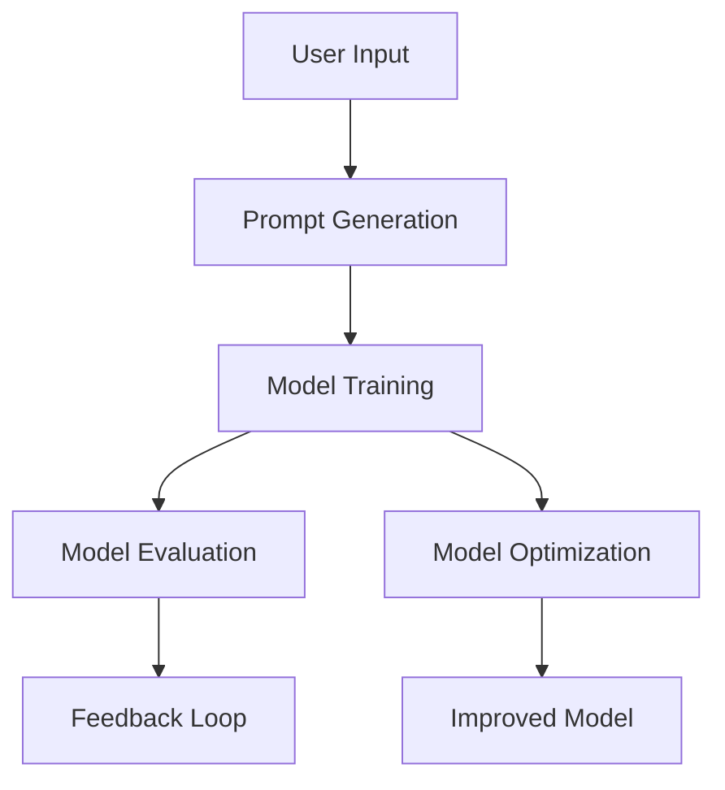

                 

Certainly, I'll provide you with a comprehensive and detailed outline for the article "Building a Prompt-Model Co-optimization Platform" following a step-by-step reasoning approach.

### Introduction 

- **Background**:
  - Briefly introduce the current state of AI, specifically the advancements in natural language processing and machine learning.
  - Explain the significance of prompt engineering in improving model performance and the need for a unified optimization platform.

- **Problem Statement**:
  - Discuss the challenges faced in traditional model training and optimization processes.
  - Explain how a prompt-model co-optimization platform can address these challenges.

- **Objectives**:
  - Outline the main goals of the article, including the design and implementation of such a platform.

### Core Concepts and Relationships 

- **Prompt Engineering**:
  - Definition and importance of prompts in NLP.
  - How prompts affect model performance.

- **Model Optimization**:
  - Overview of different optimization techniques.
  - The role of optimization in improving model accuracy and efficiency.

- **Platform Architecture**:
  - High-level architecture of the co-optimization platform.
  - Key components and their interactions.

- **Mermaid Flowchart**:
  - A Mermaid flowchart illustrating the relationships between prompts, models, and the optimization process.



### Algorithm Principles and Pseudo-code 

- **Gradient Descent Algorithm**:
  - Introduction to the gradient descent algorithm.
  - Pseudo-code for the gradient descent optimization process.

```python
def gradient_descent(initial_params, learning_rate, epochs):
    params = initial_params
    for epoch in range(epochs):
        gradients = compute_gradients(params)
        params = params - learning_rate * gradients
    return params
```

- **Loss Function**:
  - Definition and importance of the loss function.
  - Pseudo-code for computing the loss given model predictions and ground truth labels.

```python
def compute_loss(predictions, labels):
    loss = 0.0
    for i in range(len(predictions)):
        prediction = predictions[i]
        label = labels[i]
        loss += -label * log(prediction) - (1 - label) * log(1 - prediction)
    return loss / len(predictions)
```

### Mathematical Models and Formulae 

- **Regularization**:
  - Introduction to regularization techniques to prevent overfitting.
  - Formula for L2 regularization.

$$
\text{Regularization Term} = \lambda \sum_{i=1}^{n} w_i^2
$$

- **Optimization Algorithms**:
  - Comparison of different optimization algorithms like stochastic gradient descent (SGD), Adam, etc.
  - Formulae for updating model parameters using these algorithms.

$$
\text{SGD Update} = \theta_{t+1} = \theta_t - \alpha \nabla_\theta J(\theta)
$$

$$
\text{Adam Update} = \theta_{t+1} = \theta_t - \alpha \hat{\nabla_\theta J(\theta)}
$$

### Practical Case Study 

- **Case Study Background**:
  - Description of the specific problem addressed.
  - Details about the data and model used.

- **Case Study Objectives**:
  - Goals of the case study, such as improving model accuracy or reducing training time.

- **Implementation and Analysis**:
  - Step-by-step implementation of the co-optimization platform.
  - Code snippets and explanations.
  - Analysis of the results, including performance metrics and comparisons with traditional methods.

### Best Practices, Summary, and Outlook 

- **Best Practices**:
  - Tips for designing and implementing effective prompts.
  - Recommendations for selecting and tuning optimization algorithms.

- **Summary**:
  - Recap of the key points covered in the article.
  - The importance of prompt-model co-optimization in modern AI applications.

- **Outlook**:
  - Future directions for research and development in this field.
  - Potential applications and societal impact of prompt-model co-optimization platforms.

### Conclusion 

- **Final Thoughts**:
  - Reflect on the significance of the co-optimization platform in advancing AI.
  - Encourage further exploration and innovation in this area.

- **Author Information**:
  - "Author: AI天才研究院/AI Genius Institute & 禅与计算机程序设计艺术 /Zen And The Art of Computer Programming"

----------------------------------------------------------------

### Keywords 

- Natural Language Processing
- Machine Learning
- Prompt Engineering
- Model Optimization
- Co-optimization Platform

### Abstract 

This article presents a comprehensive guide to building a prompt-model co-optimization platform. It covers the core concepts of prompt engineering and model optimization, providing a detailed explanation of the mathematical models and algorithms involved. Through a practical case study, the article demonstrates the effectiveness of the co-optimization platform in improving model performance. The article concludes with best practices, a summary of key points, and future outlooks in the field of AI.

