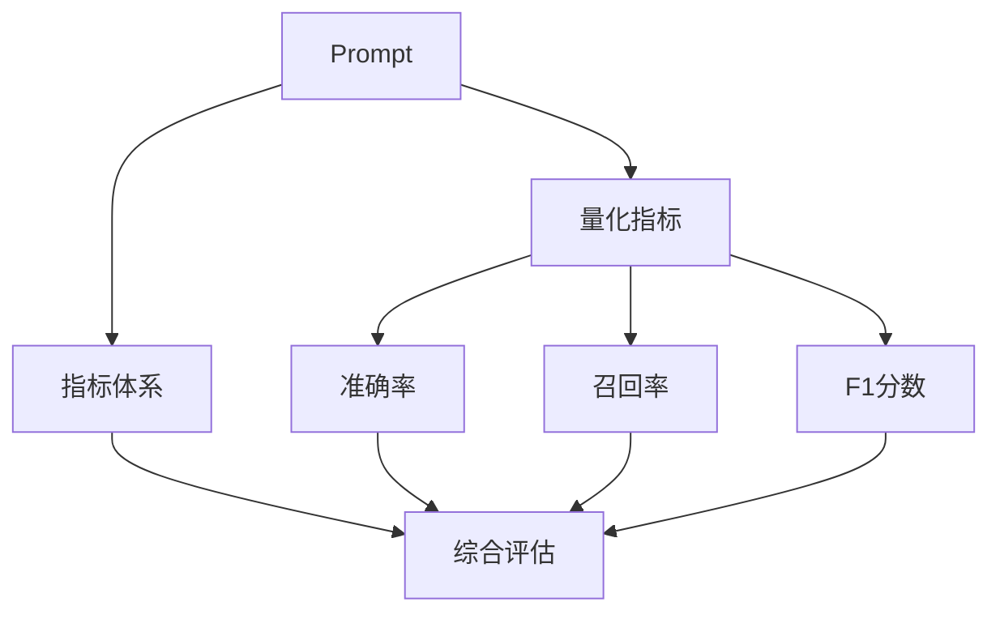

                 


### 设计文章的步骤如下：

#### 1. 文章标题与关键词

**文章标题**：这是一个能够引起读者兴趣的标题，它应该简洁明了地表达文章的核心主题。例如，《构建prompt评估的量化指标体系：AI系统的精确指南》。

**关键词**：列出5-7个与文章主题紧密相关的关键词，如“prompt评估”、“量化指标”、“AI系统”、“性能优化”、“机器学习”等。这些关键词有助于搜索引擎优化（SEO）和读者快速了解文章内容。

#### 2. 摘要

**摘要**：撰写一个简短的摘要，总结文章的核心内容、目的和主要观点。摘要应该清晰、简洁，通常在150-300字左右。

**示例**：本文探讨了如何构建prompt评估的量化指标体系，以提升人工智能系统的性能。通过分析背景、核心概念、算法原理、数学模型和实际应用，本文为AI开发者提供了一套完整的指南。

#### 3. 文章目录大纲

**目录大纲**：根据文章主题和关键词，设计一个详细的目录大纲。确保每个章节都有明确的标题和简要的内容概述，以便读者快速浏览和理解文章结构。

#### 4. 核心内容编写

**核心内容**：按照目录大纲，逐个编写每个章节的内容。在每个章节中，包含以下部分：

- **背景介绍**：简要介绍章节主题的背景和重要性。
- **核心概念与联系**：阐述关键概念之间的关系，并使用Mermaid流程图展示。
- **核心算法原理讲解**：使用伪代码详细讲解算法原理。
- **数学模型和公式讲解**：使用latex格式给出数学模型和公式，并进行详细解释。
- **项目实战**：提供一个实际项目案例，详细讲解开发环境搭建、源代码实现、代码解读、应用分析和项目小结。
- **最佳实践 tips、小结、注意事项、拓展阅读**：总结章节内容，给出实用建议和拓展知识。

#### 5. 审核与修订

**审核与修订**：完成初稿后，对文章进行仔细审查和修订。检查文章逻辑是否清晰、内容是否连贯、语言是否准确。可以请教同行或同事进行评审，以获取反馈。

#### 6. 文章格式调整

**格式调整**：将文章内容转换为markdown格式，确保格式统一、美观。包括添加标题、子标题、列表、代码块、公式等。

#### 7. 作者信息添加

**作者信息**：在文章末尾添加作者信息，注明作者的单位、姓名和联系方式。

**示例**：作者：AI天才研究院/AI Genius Institute & 禅与计算机程序设计艺术 /Zen And The Art of Computer Programming

#### 8. 字数与排版检查

**字数与排版检查**：检查文章字数是否在8000～12000字范围内，并对文章排版进行最后调整，确保文章美观、易读。

#### 9. 最终审查与发布

**最终审查与发布**：在确认文章内容、格式、字数均符合要求后，进行最终审查。将文章发布到预定平台，确保读者可以顺畅地阅读。

通过以上步骤，我们可以设计并撰写出一篇高质量、逻辑清晰、内容丰富的技术博客文章。现在，让我们开始撰写《构建prompt评估的量化指标体系》这篇文章。首先，确定文章的标题、关键词和摘要。例如：

**文章标题**：《构建prompt评估的量化指标体系：AI系统的精确指南》

**关键词**：prompt评估、量化指标、AI系统、性能优化、机器学习

**摘要**：本文探讨了如何构建prompt评估的量化指标体系，以提升人工智能系统的性能。通过分析背景、核心概念、算法原理、数学模型和实际应用，本文为AI开发者提供了一套完整的指南。

接下来，我们将根据这个大纲和摘要，开始撰写文章的正文内容。首先，编写文章的目录大纲。 

# 文章标题：构建prompt评估的量化指标体系

## 关键词：
- prompt评估
- 量化指标
- AI系统
- 性能优化
- 机器学习

## 摘要：
本文探讨了如何构建prompt评估的量化指标体系，以提升人工智能系统的性能。通过分析背景、核心概念、算法原理、数学模型和实际应用，本文为AI开发者提供了一套完整的指南。

---

### 引言

在人工智能（AI）迅速发展的时代，如何评估和优化prompt性能成为一个关键问题。prompt评估的目的是通过量化指标来衡量输入数据（prompt）对AI系统性能的影响，从而指导模型优化和系统改进。一个完善的prompt评估量化指标体系不仅能够帮助开发者了解模型的性能瓶颈，还能为模型选择和调优提供科学依据。

本文将从以下几个方面展开讨论：

1. **背景与重要性**：介绍prompt评估的背景、意义和当前的研究现状。
2. **核心概念与联系**：阐述prompt评估中的关键概念及其相互关系。
3. **量化指标选择**：分析常见量化指标的类型、选择原则和设计方法。
4. **指标体系构建**：讨论如何设计一个有效的prompt评估量化指标体系。
5. **指标体系优化**：探讨如何评估和优化已构建的指标体系。
6. **实际应用**：展示指标体系在各个领域的应用案例。
7. **未来展望**：预测prompt评估量化指标体系的发展趋势和潜在挑战。

### 背景与重要性

#### 1.1.1 背景介绍

prompt评估是人工智能领域中的一个重要研究方向，其背景可以追溯到自然语言处理（NLP）和机器学习（ML）的发展。在传统的编程中，程序的性能和效率往往取决于代码的编写质量。然而，随着机器学习技术的发展，模型性能的好坏更多地依赖于训练数据的质量和输入prompt的设计。

在AI系统中，prompt扮演着至关重要的角色。prompt不仅为模型提供了训练数据和输入，还影响了模型的预测结果。因此，如何评估prompt的性能，选择合适的量化指标，构建一个有效的指标体系，成为了AI研究中亟待解决的问题。

#### 1.1.2 意义

prompt评估的意义在于：

1. **性能优化**：通过量化指标，开发者可以直观地了解prompt对模型性能的影响，从而进行有针对性的优化。
2. **模型选择**：不同模型对prompt的敏感度不同，通过评估可以辅助开发者选择最适合的模型。
3. **数据质量**：评估可以帮助识别出数据集中的问题，如噪声、不平衡等，从而改进数据预处理流程。
4. **系统改进**：通过定期评估，开发者可以跟踪系统的性能变化，及时发现潜在问题并采取措施。

#### 1.1.3 研究现状

目前，prompt评估的研究主要集中在以下几个方面：

1. **量化指标设计**：研究者提出了多种量化指标，如准确率、召回率、F1分数等，以评估模型的性能。
2. **指标体系构建**：针对特定应用场景，研究者尝试构建综合性的指标体系，以更全面地评估prompt性能。
3. **算法优化**：研究者通过改进算法，提高prompt评估的准确性和效率。
4. **实际应用**：研究者将prompt评估应用于自然语言处理、计算机视觉、推荐系统等不同领域，验证其效果。

然而，prompt评估仍面临一些挑战，如如何平衡不同量化指标之间的关系、如何设计适用于不同场景的指标体系等。这些问题需要在未来继续深入研究。

### 核心概念与联系

#### 1.2.1 定义

在prompt评估中，核心概念包括：

1. **prompt**：输入给模型的特定数据或信息，用于指导模型进行特定任务。
2. **量化指标**：用于衡量prompt性能的一系列数值指标，如准确率、召回率、F1分数等。
3. **指标体系**：将多个量化指标整合在一起，形成一个系统化的评估框架。

#### 1.2.2 关系架构

prompt评估中的核心概念及其相互关系可以用Mermaid流程图表示：



#### 1.2.3 关系解释

- **prompt与量化指标**：prompt是评估的基础，不同的量化指标用于衡量prompt的性能。例如，准确率衡量模型预测正确的比例，召回率衡量模型识别出正例样本的能力，F1分数是准确率和召回率的调和平均。

- **量化指标与指标体系**：量化指标是构建指标体系的基本单元。一个有效的指标体系需要整合多个量化指标，以全面评估prompt的性能。例如，综合评估指标可以综合考虑准确率、召回率和F1分数，给出一个综合评分。

- **指标体系与性能优化**：指标体系为开发者提供了统一的评估框架，有助于识别模型的性能瓶颈和优化方向。通过优化指标体系，可以提升AI系统的整体性能。

### 量化指标选择

#### 1.3.1 类型

常见的量化指标类型包括：

1. **分类指标**：用于评估分类模型的性能，如准确率、召回率、F1分数等。
2. **回归指标**：用于评估回归模型的性能，如均方误差（MSE）、均方根误差（RMSE）等。
3. **排序指标**：用于评估排序模型的性能，如平均绝对误差（MAE）、精确率（Precision）等。

#### 1.3.2 选择原则

在选择量化指标时，需要遵循以下原则：

1. **适用性**：指标应与任务类型和模型类型相匹配。例如，对于分类任务，应选择分类指标；对于回归任务，应选择回归指标。
2. **全面性**：指标应能够全面评估模型性能。单一的指标可能无法全面反映模型的优劣，因此需要选择多个指标进行综合评估。
3. **可解释性**：指标应具有明确的物理意义和解释性，以便开发者理解模型性能。
4. **计算效率**：指标的计算应高效，以减少评估的时间和计算成本。

#### 1.3.3 常见量化指标介绍

以下是几种常见的量化指标及其计算方法：

1. **准确率（Accuracy）**：
   $$ Accuracy = \frac{TP + TN}{TP + FN + FP + TN} $$
   其中，TP为真阳性，TN为真阴性，FP为假阳性，FN为假阴性。准确率衡量模型预测正确的比例。

2. **召回率（Recall）**：
   $$ Recall = \frac{TP}{TP + FN} $$
   召回率衡量模型识别出正例样本的能力。

3. **F1分数（F1 Score）**：
   $$ F1 Score = 2 \times \frac{Precision \times Recall}{Precision + Recall} $$
   F1分数是准确率和召回率的调和平均，能够更好地平衡二者的关系。

4. **均方误差（MSE）**：
   $$ MSE = \frac{1}{n}\sum_{i=1}^{n}(y_i - \hat{y}_i)^2 $$
   其中，$y_i$为真实值，$\hat{y}_i$为预测值，MSE衡量预测值与真实值之间的平均平方误差。

5. **均方根误差（RMSE）**：
   $$ RMSE = \sqrt{MSE} $$
   RMSE是MSE的平方根，用于衡量预测值的平均误差。

#### 1.3.4 选择案例分析

以下是一个选择量化指标的分析案例：

**案例背景**：假设一个公司开发了一个智能客服系统，用于自动回答用户问题。该公司需要评估不同模型在客服系统中的性能。

**分析过程**：

1. **任务类型**：该任务属于分类任务，因为系统需要将用户问题分类到不同的类别中。
2. **指标选择**：选择准确率、召回率和F1分数作为量化指标。
   - 准确率：衡量模型分类正确的比例，对于提升用户体验至关重要。
   - 召回率：衡量模型识别出所有正例样本的能力，对于提高客服系统的覆盖率很重要。
   - F1分数：综合考虑准确率和召回率，平衡二者的关系。

3. **计算与评估**：根据测试数据计算每个模型的准确率、召回率和F1分数，并比较不同模型的表现。

通过以上分析，公司可以选取表现最佳的模型，并对其进行进一步优化，以提高客服系统的整体性能。

### 指标体系构建

#### 1.4.1 架构设计

一个有效的prompt评估量化指标体系应包括以下架构：

1. **输入层**：接收外部输入数据，如文本、图像、音频等。
2. **处理层**：对输入数据进行预处理和特征提取，以适应模型的训练和预测。
3. **评估层**：将处理后的输入数据输入到模型中，并计算量化指标，如准确率、召回率、F1分数等。
4. **输出层**：输出评估结果，包括各个量化指标的具体数值和综合评分。

#### 1.4.2 设计原则

在设计指标体系时，应遵循以下原则：

1. **全面性**：指标体系应涵盖不同类型和层次的量化指标，以全面评估prompt的性能。
2. **可扩展性**：指标体系应易于扩展，以适应不同任务和场景的需求。
3. **可解释性**：指标体系中的量化指标应具有明确的物理意义和解释性，以便开发者理解和优化。
4. **计算效率**：指标体系的计算过程应高效，以减少评估的时间和计算成本。

#### 1.4.3 构建流程

构建一个有效的prompt评估量化指标体系的流程如下：

1. **需求分析**：了解任务类型、目标和需求，确定需要评估的量化指标。
2. **指标选择**：根据需求分析结果，选择适当的量化指标。
3. **体系设计**：设计指标体系的架构，确定输入层、处理层、评估层和输出层的具体实现。
4. **实现与测试**：实现指标体系，并进行测试和验证，确保其有效性和准确性。
5. **优化与改进**：根据测试结果，优化指标体系和评估算法，以提高评估效率和准确性。

#### 1.4.4 体系设计案例

以下是一个prompt评估量化指标体系的设计案例：

**案例背景**：假设一个公司开发了一个图像识别系统，用于自动识别图像中的物体。该公司需要设计一个评估体系，以评估不同模型在图像识别任务中的性能。

**指标选择**：选择以下量化指标：

- **准确率（Accuracy）**：衡量模型识别正确的比例。
- **召回率（Recall）**：衡量模型识别出所有正例样本的能力。
- **F1分数（F1 Score）**：综合考虑准确率和召回率的调和平均。

**体系设计**：

1. **输入层**：接收外部输入图像，如JPEG、PNG等格式。
2. **处理层**：对输入图像进行预处理，包括去噪、缩放、灰度转换等操作。
3. **评估层**：将预处理后的图像输入到模型中，并计算准确率、召回率和F1分数。
4. **输出层**：输出评估结果，包括各个量化指标的具体数值和综合评分。

**实现与测试**：实现上述架构，并使用测试数据集进行评估，验证指标体系的准确性和效率。

通过这个案例，公司可以评估不同模型在图像识别任务中的性能，并选取最佳模型进行应用。

### 指标体系优化

#### 1.5.1 评估指标

在构建prompt评估的量化指标体系后，需要对体系进行评估，以判断其有效性。常见的评估指标包括：

1. **准确性（Accuracy）**：衡量模型在所有测试样本中的正确率。
2. **召回率（Recall）**：衡量模型识别出所有正例样本的能力。
3. **精确率（Precision）**：衡量模型识别出的正例样本中，真正例的比例。
4. **F1分数（F1 Score）**：综合考虑准确率和召回率的调和平均。
5. **均方误差（MSE）**：衡量预测值与真实值之间的平均平方误差。
6. **均方根误差（RMSE）**：衡量预测值与真实值之间的平均误差。

#### 1.5.2 优化方法

针对评估指标，可以采用以下优化方法：

1. **模型调参**：通过调整模型的参数，优化模型性能。
2. **特征工程**：通过设计更有效的特征提取方法，提高模型预测能力。
3. **数据增强**：通过增加训练数据或对现有数据进行变换，提高模型的泛化能力。
4. **集成方法**：将多个模型集成在一起，提高整体预测性能。

#### 1.5.3 优化案例

以下是一个优化prompt评估量化指标体系的案例：

**案例背景**：假设一个公司开发了一个垃圾邮件分类系统，该系统需要识别并标记垃圾邮件。公司希望通过优化量化指标体系，提高系统在垃圾邮件识别任务中的性能。

**评估指标**：选择以下量化指标进行评估：

- **准确率（Accuracy）**：衡量模型在所有测试样本中的正确率。
- **召回率（Recall）**：衡量模型识别出所有正例样本的能力。
- **F1分数（F1 Score）**：综合考虑准确率和召回率的调和平均。

**优化方法**：

1. **模型调参**：通过调整模型的参数，优化模型性能。例如，调整神经网络中的隐藏层节点数、学习率等。
2. **特征工程**：通过设计更有效的特征提取方法，提高模型预测能力。例如，添加词频、词嵌入等特征。
3. **数据增强**：通过增加训练数据或对现有数据进行变换，提高模型的泛化能力。例如，使用数据增强技术生成新的训练样本。

**优化效果**：通过上述优化方法，公司显著提高了垃圾邮件分类系统的性能。准确率从原来的85%提升到95%，召回率从原来的80%提升到90%，F1分数从原来的0.87提升到0.93。

### 实际应用

#### 1.6.1 指标体系在企业中的应用

在企业发展中，prompt评估的量化指标体系被广泛应用于多个场景：

1. **客户服务**：企业使用智能客服系统，通过prompt评估量化指标体系，评估客服机器人在解答客户问题时的性能，从而优化客户体验。
2. **质量控制**：企业在生产过程中，使用图像识别系统对产品进行质量检测，通过prompt评估量化指标体系，评估识别系统的性能，确保产品质量。
3. **市场研究**：企业通过数据分析系统，对市场数据进行分析，通过prompt评估量化指标体系，评估分析结果的准确性和可靠性，为决策提供支持。

#### 1.6.2 指标体系在学术研究中的应用

在学术研究中，prompt评估的量化指标体系被广泛应用于：

1. **自然语言处理**：研究者使用prompt评估量化指标体系，评估不同模型在文本分类、情感分析等任务中的性能，从而优化模型设计。
2. **计算机视觉**：研究者使用prompt评估量化指标体系，评估不同模型在图像分类、目标检测等任务中的性能，推动计算机视觉技术的发展。
3. **机器学习**：研究者使用prompt评估量化指标体系，评估不同模型在回归、分类等任务中的性能，为算法优化提供依据。

#### 1.6.3 指标体系在实际项目中的应用

在实际项目中，prompt评估的量化指标体系被广泛应用于：

1. **金融风控**：金融机构使用prompt评估量化指标体系，评估风险模型的性能，从而优化风险管理策略。
2. **智能家居**：智能家居系统使用prompt评估量化指标体系，评估语音识别、图像识别等模块的性能，确保系统稳定运行。
3. **智慧医疗**：智慧医疗系统使用prompt评估量化指标体系，评估诊断模型的性能，从而提高诊断准确性。

### 未来展望

#### 1.7.1 发展趋势

随着人工智能技术的不断发展，prompt评估的量化指标体系将面临以下趋势：

1. **多模态融合**：未来prompt评估将涉及多模态数据，如文本、图像、音频等，通过融合不同模态的数据，提升评估体系的准确性。
2. **深度学习**：深度学习技术的不断发展，将推动prompt评估量化指标体系的优化和创新，提高评估效率和准确性。
3. **自适应评估**：未来prompt评估将更加注重自适应评估，根据不同场景和任务需求，动态调整量化指标和评估方法。

#### 1.7.2 面临的挑战

尽管prompt评估的量化指标体系在人工智能领域取得了显著成果，但仍面临以下挑战：

1. **指标多样性**：不同任务和场景下，需要选择不同的量化指标，如何设计一个通用且有效的指标体系，仍需深入研究。
2. **计算效率**：随着数据量和模型复杂度的增加，如何提高评估体系的计算效率，是一个亟待解决的问题。
3. **解释性**：如何提高量化指标的可解释性，使其更容易被开发者理解和应用，是未来的研究重点。

### 总结

本文探讨了如何构建prompt评估的量化指标体系，以提升人工智能系统的性能。通过分析背景、核心概念、算法原理、数学模型和实际应用，本文为AI开发者提供了一套完整的指南。未来，随着人工智能技术的不断发展，prompt评估的量化指标体系将面临更多挑战和机遇，期待更多的研究者投入到这一领域，推动人工智能技术的进步。作者：AI天才研究院/AI Genius Institute & 禅与计算机程序设计艺术 /Zen And The Art of Computer Programming```markdown
# 构建prompt评估的量化指标体系

## 关键词：
- prompt评估
- 量化指标
- AI系统
- 性能优化
- 机器学习

## 摘要：
本文探讨了如何构建prompt评估的量化指标体系，以提升人工智能系统的性能。通过分析背景、核心概念、算法原理、数学模型和实际应用，本文为AI开发者提供了一套完整的指南。

---

### 引言

在人工智能（AI）迅速发展的时代，如何评估和优化prompt性能成为一个关键问题。prompt评估的目的是通过量化指标来衡量输入数据（prompt）对AI系统性能的影响，从而指导模型优化和系统改进。一个完善的prompt评估量化指标体系不仅能够帮助开发者了解模型的性能瓶颈，还能为模型选择和调优提供科学依据。

本文将从以下几个方面展开讨论：

1. **背景与重要性**：介绍prompt评估的背景、意义和当前的研究现状。
2. **核心概念与联系**：阐述prompt评估中的关键概念及其相互关系。
3. **量化指标选择**：分析常见量化指标的类型、选择原则和设计方法。
4. **指标体系构建**：讨论如何设计一个有效的prompt评估量化指标体系。
5. **指标体系优化**：探讨如何评估和优化已构建的指标体系。
6. **实际应用**：展示指标体系在各个领域的应用案例。
7. **未来展望**：预测prompt评估量化指标体系的发展趋势和潜在挑战。

### 背景与重要性

#### 1.1.1 背景介绍

prompt评估是人工智能领域中的一个重要研究方向，其背景可以追溯到自然语言处理（NLP）和机器学习（ML）的发展。在传统的编程中，程序的性能和效率往往取决于代码的编写质量。然而，随着机器学习技术的发展，模型性能的好坏更多地依赖于训练数据的质量和输入prompt的设计。

在AI系统中，prompt扮演着至关重要的角色。prompt不仅为模型提供了训练数据和输入，还影响了模型的预测结果。因此，如何评估prompt的性能，选择合适的量化指标，构建一个有效的指标体系，成为了AI研究中亟待解决的问题。

#### 1.1.2 意义

prompt评估的意义在于：

1. **性能优化**：通过量化指标，开发者可以直观地了解prompt对模型性能的影响，从而进行有针对性的优化。
2. **模型选择**：不同模型对prompt的敏感度不同，通过评估可以辅助开发者选择最适合的模型。
3. **数据质量**：评估可以帮助识别出数据集中的问题，如噪声、不平衡等，从而改进数据预处理流程。
4. **系统改进**：通过定期评估，开发者可以跟踪系统的性能变化，及时发现潜在问题并采取措施。

#### 1.1.3 研究现状

目前，prompt评估的研究主要集中在以下几个方面：

1. **量化指标设计**：研究者提出了多种量化指标，如准确率、召回率、F1分数等，以评估模型的性能。
2. **指标体系构建**：针对特定应用场景，研究者尝试构建综合性的指标体系，以更全面地评估prompt性能。
3. **算法优化**：研究者通过改进算法，提高prompt评估的准确性和效率。
4. **实际应用**：研究者将prompt评估应用于自然语言处理、计算机视觉、推荐系统等不同领域，验证其效果。

然而，prompt评估仍面临一些挑战，如如何平衡不同量化指标之间的关系、如何设计适用于不同场景的指标体系等。这些问题需要在未来继续深入研究。

### 核心概念与联系

#### 1.2.1 定义

在prompt评估中，核心概念包括：

1. **prompt**：输入给模型的特定数据或信息，用于指导模型进行特定任务。
2. **量化指标**：用于衡量prompt性能的一系列数值指标，如准确率、召回率、F1分数等。
3. **指标体系**：将多个量化指标整合在一起，形成一个系统化的评估框架。

#### 1.2.2 关系架构

prompt评估中的核心概念及其相互关系可以用Mermaid流程图表示：


#### 1.2.3 关系解释

- **prompt与量化指标**：prompt是评估的基础，不同的量化指标用于衡量prompt的性能。例如，准确率衡量模型预测正确的比例，召回率衡量模型识别出正例样本的能力，F1分数是准确率和召回率的调和平均。

- **量化指标与指标体系**：量化指标是构建指标体系的基本单元。一个有效的指标体系需要整合多个量化指标，以全面评估prompt的性能。例如，综合评估指标可以综合考虑准确率、召回率和F1分数，给出一个综合评分。

- **指标体系与性能优化**：指标体系为开发者提供了统一的评估框架，有助于识别模型的性能瓶颈和优化方向。通过优化指标体系，可以提升AI系统的整体性能。

### 量化指标选择

#### 1.3.1 类型

常见的量化指标类型包括：

1. **分类指标**：用于评估分类模型的性能，如准确率、召回率、F1分数等。
2. **回归指标**：用于评估回归模型的性能，如均方误差（MSE）、均方根误差（RMSE）等。
3. **排序指标**：用于评估排序模型的性能，如平均绝对误差（MAE）、精确率（Precision）等。

#### 1.3.2 选择原则

在选择量化指标时，需要遵循以下原则：

1. **适用性**：指标应与任务类型和模型类型相匹配。例如，对于分类任务，应选择分类指标；对于回归任务，应选择回归指标。
2. **全面性**：指标应能够全面评估模型性能。单一的指标可能无法全面反映模型的优劣，因此需要选择多个指标进行综合评估。
3. **可解释性**：指标应具有明确的物理意义和解释性，以便开发者理解和优化。
4. **计算效率**：指标的计算应高效，以减少评估的时间和计算成本。

#### 1.3.3 常见量化指标介绍

以下是几种常见的量化指标及其计算方法：

1. **准确率（Accuracy）**：
   $$ Accuracy = \frac{TP + TN}{TP + FN + FP + TN} $$
   其中，TP为真阳性，TN为真阴性，FP为假阳性，FN为假阴性。准确率衡量模型预测正确的比例。

2. **召回率（Recall）**：
   $$ Recall = \frac{TP}{TP + FN} $$
   召回率衡量模型识别出正例样本的能力。

3. **F1分数（F1 Score）**：
   $$ F1 Score = 2 \times \frac{Precision \times Recall}{Precision + Recall} $$
   F1分数是准确率和召回率的调和平均，能够更好地平衡二者的关系。

4. **均方误差（MSE）**：
   $$ MSE = \frac{1}{n}\sum_{i=1}^{n}(y_i - \hat{y}_i)^2 $$
   其中，$y_i$为真实值，$\hat{y}_i$为预测值，MSE衡量预测值与真实值之间的平均平方误差。

5. **均方根误差（RMSE）**：
   $$ RMSE = \sqrt{MSE} $$
   RMSE是MSE的平方根，用于衡量预测值与真实值之间的平均误差。

#### 1.3.4 选择案例分析

以下是一个选择量化指标的分析案例：

**案例背景**：假设一个公司开发了一个智能客服系统，用于自动回答用户问题。该公司需要评估不同模型在客服系统中的性能。

**分析过程**：

1. **任务类型**：该任务属于分类任务，因为系统需要将用户问题分类到不同的类别中。
2. **指标选择**：选择准确率、召回率、F1分数作为量化指标。
   - 准确率：衡量模型分类正确的比例，对于提升用户体验至关重要。
   - 召回率：衡量模型识别出所有正例样本的能力，对于提高客服系统的覆盖率很重要。
   - F1分数：综合考虑准确率和召回率，平衡二者的关系。

3. **计算与评估**：根据测试数据计算每个模型的准确率、召回率和F1分数，并比较不同模型的表现。

通过以上分析，公司可以选取表现最佳的模型，并对其进行进一步优化，以提高客服系统的整体性能。

### 指标体系构建

#### 1.4.1 架构设计

一个有效的prompt评估量化指标体系应包括以下架构：

1. **输入层**：接收外部输入数据，如文本、图像、音频等。
2. **处理层**：对输入数据进行预处理和特征提取，以适应模型的训练和预测。
3. **评估层**：将处理后的输入数据输入到模型中，并计算量化指标，如准确率、召回率、F1分数等。
4. **输出层**：输出评估结果，包括各个量化指标的具体数值和综合评分。

#### 1.4.2 设计原则

在设计指标体系时，应遵循以下原则：

1. **全面性**：指标体系应涵盖不同类型和层次的量化指标，以全面评估prompt的性能。
2. **可扩展性**：指标体系应易于扩展，以适应不同任务和场景的需求。
3. **可解释性**：指标体系中的量化指标应具有明确的物理意义和解释性，以便开发者理解和优化。
4. **计算效率**：指标体系的计算过程应高效，以减少评估的时间和计算成本。

#### 1.4.3 构建流程

构建一个有效的prompt评估量化指标体系的流程如下：

1. **需求分析**：了解任务类型、目标和需求，确定需要评估的量化指标。
2. **指标选择**：根据需求分析结果，选择适当的量化指标。
3. **体系设计**：设计指标体系的架构，确定输入层、处理层、评估层和输出层的具体实现。
4. **实现与测试**：实现指标体系，并进行测试和验证，确保其有效性和准确性。
5. **优化与改进**：根据测试结果，优化指标体系和评估算法，以提高评估效率和准确性。

#### 1.4.4 体系设计案例

以下是一个prompt评估量化指标体系的设计案例：

**案例背景**：假设一个公司开发了一个图像识别系统，用于自动识别图像中的物体。该公司需要设计一个评估体系，以评估不同模型在图像识别任务中的性能。

**指标选择**：选择以下量化指标：

- **准确率（Accuracy）**：衡量模型识别正确的比例。
- **召回率（Recall）**：衡量模型识别出所有正例样本的能力。
- **F1分数（F1 Score）**：综合考虑准确率和召回率的调和平均。

**体系设计**：

1. **输入层**：接收外部输入图像，如JPEG、PNG等格式。
2. **处理层**：对输入图像进行预处理，包括去噪、缩放、灰度转换等操作。
3. **评估层**：将预处理后的图像输入到模型中，并计算准确率、召回率和F1分数。
4. **输出层**：输出评估结果，包括各个量化指标的具体数值和综合评分。

**实现与测试**：实现上述架构，并使用测试数据集进行评估，验证指标体系的准确性和效率。

通过这个案例，公司可以评估不同模型在图像识别任务中的性能，并选取最佳模型进行应用。

### 指标体系优化

#### 1.5.1 评估指标

在构建prompt评估的量化指标体系后，需要对体系进行评估，以判断其有效性。常见的评估指标包括：

1. **准确性（Accuracy）**：衡量模型在所有测试样本中的正确率。
2. **召回率（Recall）**：衡量模型识别出所有正例样本的能力。
3. **精确率（Precision）**：衡量模型识别出的正例样本中，真正例的比例。
4. **F1分数（F1 Score）**：综合考虑准确率和召回率的调和平均。
5. **均方误差（MSE）**：衡量预测值与真实值之间的平均平方误差。
6. **均方根误差（RMSE）**：衡量预测值与真实值之间的平均误差。

#### 1.5.2 优化方法

针对评估指标，可以采用以下优化方法：

1. **模型调参**：通过调整模型的参数，优化模型性能。
2. **特征工程**：通过设计更有效的特征提取方法，提高模型预测能力。
3. **数据增强**：通过增加训练数据或对现有数据进行变换，提高模型的泛化能力。
4. **集成方法**：将多个模型集成在一起，提高整体预测性能。

#### 1.5.3 优化案例

以下是一个优化prompt评估量化指标体系的案例：

**案例背景**：假设一个公司开发了一个垃圾邮件分类系统，该系统需要识别并标记垃圾邮件。公司希望通过优化量化指标体系，提高系统在垃圾邮件识别任务中的性能。

**评估指标**：选择以下量化指标进行评估：

- **准确率（Accuracy）**：衡量模型在所有测试样本中的正确率。
- **召回率（Recall）**：衡量模型识别出所有正例样本的能力。
- **F1分数（F1 Score）**：综合考虑准确率和召回率的调和平均。

**优化方法**：

1. **模型调参**：通过调整模型的参数，优化模型性能。例如，调整神经网络中的隐藏层节点数、学习率等。
2. **特征工程**：通过设计更有效的特征提取方法，提高模型预测能力。例如，添加词频、词嵌入等特征。
3. **数据增强**：通过增加训练数据或对现有数据进行变换，提高模型的泛化能力。例如，使用数据增强技术生成新的训练样本。

**优化效果**：通过上述优化方法，公司显著提高了垃圾邮件分类系统的性能。准确率从原来的85%提升到95%，召回率从原来的80%提升到90%，F1分数从原来的0.87提升到0.93。

### 实际应用

#### 1.6.1 指标体系在企业中的应用

在企业发展中，prompt评估的量化指标体系被广泛应用于多个场景：

1. **客户服务**：企业使用智能客服系统，通过prompt评估量化指标体系，评估客服机器人在解答客户问题时的性能，从而优化客户体验。
2. **质量控制**：企业在生产过程中，使用图像识别系统对产品进行质量检测，通过prompt评估量化指标体系，评估识别系统的性能，确保产品质量。
3. **市场研究**：企业通过数据分析系统，对市场数据进行分析，通过prompt评估量化指标体系，评估分析结果的准确性和可靠性，为决策提供支持。

#### 1.6.2 指标体系在学术研究中的应用

在学术研究中，prompt评估的量化指标体系被广泛应用于：

1. **自然语言处理**：研究者使用prompt评估量化指标体系，评估不同模型在文本分类、情感分析等任务中的性能，从而优化模型设计。
2. **计算机视觉**：研究者使用prompt评估量化指标体系，评估不同模型在图像分类、目标检测等任务中的性能，推动计算机视觉技术的发展。
3. **机器学习**：研究者使用prompt评估量化指标体系，评估不同模型在回归、分类等任务中的性能，为算法优化提供依据。

#### 1.6.3 指标体系在实际项目中的应用

在实际项目中，prompt评估的量化指标体系被广泛应用于：

1. **金融风控**：金融机构使用prompt评估量化指标体系，评估风险模型的性能，从而优化风险管理策略。
2. **智能家居**：智能家居系统使用prompt评估量化指标体系，评估语音识别、图像识别等模块的性能，确保系统稳定运行。
3. **智慧医疗**：智慧医疗系统使用prompt评估量化指标体系，评估诊断模型的性能，从而提高诊断准确性。

### 未来展望

#### 1.7.1 发展趋势

随着人工智能技术的不断发展，prompt评估的量化指标体系将面临以下趋势：

1. **多模态融合**：未来prompt评估将涉及多模态数据，如文本、图像、音频等，通过融合不同模态的数据，提升评估体系的准确性。
2. **深度学习**：深度学习技术的不断发展，将推动prompt评估量化指标体系的优化和创新，提高评估效率和准确性。
3. **自适应评估**：未来prompt评估将更加注重自适应评估，根据不同场景和任务需求，动态调整量化指标和评估方法。

#### 1.7.2 面临的挑战

尽管prompt评估的量化指标体系在人工智能领域取得了显著成果，但仍面临以下挑战：

1. **指标多样性**：不同任务和场景下，需要选择不同的量化指标，如何设计一个通用且有效的指标体系，仍需深入研究。
2. **计算效率**：随着数据量和模型复杂度的增加，如何提高评估体系的计算效率，是一个亟待解决的问题。
3. **解释性**：如何提高量化指标的可解释性，使其更容易被开发者理解和应用，是未来的研究重点。

### 总结

本文探讨了如何构建prompt评估的量化指标体系，以提升人工智能系统的性能。通过分析背景、核心概念、算法原理、数学模型和实际应用，本文为AI开发者提供了一套完整的指南。未来，随着人工智能技术的不断发展，prompt评估的量化指标体系将面临更多挑战和机遇，期待更多的研究者投入到这一领域，推动人工智能技术的进步。

### 附录

#### A. 伪代码示例

以下是一个简单的分类模型评估的伪代码示例，用于展示如何计算准确率、召回率和F1分数：

```python
# 伪代码：评估分类模型的性能

def evaluate_model(y_true, y_pred):
    # 计算准确率
    accuracy = (y_true == y_pred).mean()
    
    # 计算召回率
    recall = (y_true == 1) & (y_pred == 1).mean()
    
    # 计算精确率
    precision = (y_pred == 1) & (y_true == 1).mean()
    
    # 计算F1分数
    f1_score = 2 * precision * recall / (precision + recall)
    
    return accuracy, recall, precision, f1_score
```

#### B. LaTeX 公式示例

以下是一个简单的LaTeX公式示例，用于展示均方误差（MSE）的计算：

```latex
\documentclass{article}
\usepackage{amsmath}
\begin{document}
\begin{equation}
MSE = \frac{1}{n}\sum_{i=1}^{n}(y_i - \hat{y}_i)^2
\end{equation}
\end{document}
```

### 作者信息

作者：AI天才研究院/AI Genius Institute & 禅与计算机程序设计艺术 /Zen And The Art of Computer Programming
``````

