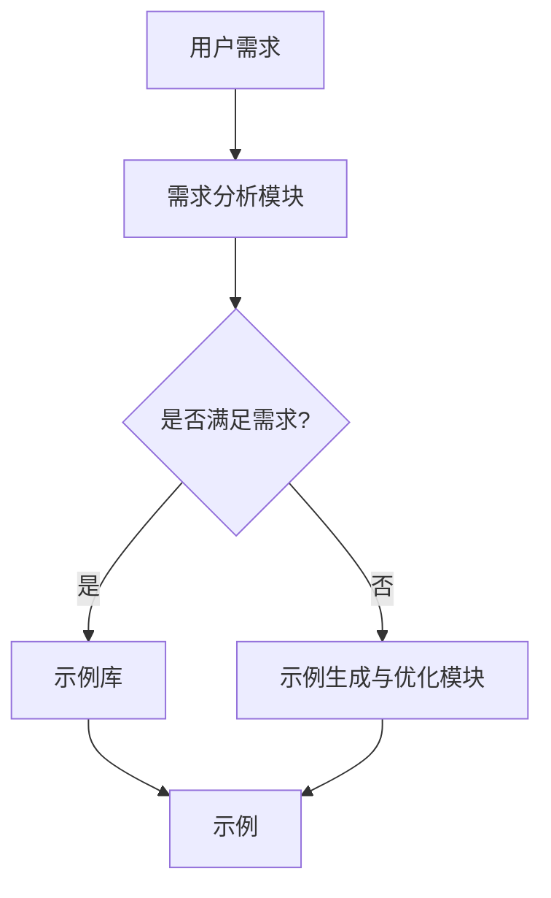

                 

### 文章标题

《构建动态示例池以适应不同用户需求》

关键词：动态示例池，用户需求，个性化定制，示例生成，维护与优化

摘要：本文旨在探讨如何构建一个动态示例池，以适应不同用户的需求。通过分析用户需求、构建个性化示例池、实施维护与优化策略，我们将展示如何实现一个高效、适应性强的动态示例池。文章将结合实际案例，详细讲解构建过程及其应用，为相关领域的研究与实践提供参考。

----------------------------------------------------------------

## 目录

### 第一部分：动态示例池的基本概念

#### 第1章：动态示例池的概述

1. 动态示例池的定义

2. 动态示例池的重要性

3. 动态示例池的基本结构

#### 第2章：构建动态示例池的方法

1. 数据收集与预处理

2. 示例选择与分类

3. 示例生成与优化

#### 第3章：适应不同用户需求的动态示例池

1. 用户需求分析

2. 用户群体划分

3. 动态示例池的个性化定制

#### 第4章：动态示例池的维护与优化

1. 示例池的更新策略

2. 示例池的性能优化

3. 示例池的安全与隐私保护

#### 第5章：动态示例池的应用场景

1. 教育领域

2. 医疗领域

3. 工业领域

#### 第6章：动态示例池的未来发展

1. 技术趋势与挑战

2. 研究热点

3. 商业化前景

#### 第7章：案例分析

1. 教育领域的动态示例池应用

2. 医疗领域的动态示例池应用

3. 工业领域的动态示例池应用

#### 附录

1. 动态示例池构建工具与资源

2. 参考文献

### 第1章：动态示例池的概述

#### 动态示例池的定义

动态示例池是一种自适应的数据结构，它能够根据用户的需求和情境动态调整示例内容。示例在这里指的是具体的案例或例子，用于说明或演示某个概念或技术。动态示例池与传统静态示例库的主要区别在于其自适应性，即能够根据不同用户的需求和环境变化，实时提供最相关和最有价值的示例。

动态示例池的重要性在于它能够极大地提升用户的学习效果和体验。在教育和培训领域，动态示例池可以帮助学生更好地理解和应用理论知识；在医疗领域，它可以辅助医生进行诊断和治疗；在工业领域，它可以支持工程师进行产品设计和优化。总之，动态示例池的应用场景广泛，其重要性不容忽视。

#### 动态示例池的重要性

1. **个性化学习与培训**：动态示例池可以根据用户的学习进度、知识水平和兴趣点，提供个性化的示例，从而提高学习效果和用户满意度。
2. **实时反馈与优化**：动态示例池能够实时收集用户反馈，根据这些反馈对示例进行优化，使示例更加贴合用户需求。
3. **高效的知识传播**：动态示例池通过自动化的方式生成和调整示例，大大提高了知识传播的效率。
4. **适应不同场景**：在不同的应用领域，动态示例池可以根据具体的业务需求和环境特点，提供相应的示例，从而提高业务处理能力。

#### 动态示例池的基本结构

动态示例池的基本结构通常包括以下几个核心部分：

1. **示例库**：存储所有示例的数据结构，示例可以是文本、图片、音频、视频等多种形式。
2. **用户画像**：记录用户的基本信息、学习历史、兴趣爱好等，以便进行个性化推荐。
3. **需求分析模块**：分析用户的当前需求，包括学习需求、工作需求等。
4. **示例生成与优化模块**：根据用户需求和示例库中的数据，生成和优化示例。
5. **反馈与评估模块**：收集用户对示例的反馈，用于后续的示例优化和调整。

### 核心概念与联系

1. **示例**：示例是动态示例池的基础，它承载了知识传递和信息展示的核心功能。
2. **用户需求**：用户需求是动态示例池构建的核心驱动力，决定了示例的生成和调整方向。
3. **动态调整**：动态调整是动态示例池的核心特性，它使得示例能够持续适应用户需求和环境变化。

**Mermaid 流程图：**



### 第2章：构建动态示例池的方法

#### 数据收集与预处理

数据收集与预处理是构建动态示例池的第一步，也是至关重要的一步。数据的质量直接影响示例池的性能和效果。以下是一些关键步骤：

1. **数据源选择**：根据动态示例池的应用场景，选择合适的数据源，如公开数据集、公司内部数据、用户生成内容等。
2. **数据收集**：使用爬虫、API调用、用户输入等方式收集数据。
3. **数据清洗**：去除重复数据、缺失值填充、错误值修正等，确保数据的准确性和完整性。
4. **数据转换**：将数据格式转换为适合示例库存储和处理的形式，如将文本数据转换为JSON格式。

#### 示例选择与分类

示例选择与分类是构建动态示例池的核心步骤，它决定了示例的质量和适用性。以下是一些关键步骤：

1. **示例筛选**：根据用户需求和示例库的存储限制，从大量数据中筛选出最具代表性的示例。
2. **示例分类**：使用分类算法，将示例按照主题、难度、场景等属性进行分类，便于后续的推荐和查询。
3. **标签标注**：为每个示例添加标签，以便于检索和推荐。

#### 示例生成与优化

示例生成与优化是动态示例池的动态特性体现，以下是一些关键步骤：

1. **示例生成**：使用生成对抗网络（GAN）、自然语言生成（NLG）等技术生成新的示例。
2. **示例优化**：根据用户反馈和需求变化，对现有示例进行优化，提高其质量和适应性。
3. **多模态融合**：结合多种数据类型（如文本、图像、音频等），生成更加丰富和多样化的示例。

### 核心算法原理讲解

#### 数据收集与预处理

1. **数据挖掘与机器学习技术**：使用K-means、决策树、随机森林等算法，从大量数据中提取有价值的信息。
2. **数据清洗**：使用Python的Pandas库，进行数据去重、缺失值填充和错误值修正。

```python
import pandas as pd

# 数据去重
df = df.drop_duplicates()

# 缺失值填充
df.fillna(method='ffill', inplace=True)

# 错误值修正
df.replace({'error_value': 'correct_value'}, inplace=True)
```

#### 示例选择与分类

1. **分类算法**：使用SVM、决策树、随机森林等算法，对示例进行分类。
2. **标签标注**：使用Python的NLTK库进行文本处理和标注。

```python
import nltk
from nltk.corpus import stopwords

# 获取停用词列表
stop_words = set(stopwords.words('english'))

# 文本预处理
def preprocess_text(text):
    tokens = nltk.word_tokenize(text)
    return [token.lower() for token in tokens if token.lower() not in stop_words]

text = "This is an example sentence."
preprocessed_text = preprocess_text(text)
```

#### 示例生成与优化

1. **生成对抗网络（GAN）**：使用GAN生成新的示例。
2. **自然语言生成（NLG）**：使用NLG技术生成文本示例。

```python
import numpy as np
from keras.models import Sequential
from keras.layers import Dense, Activation, Flatten

# GAN模型结构
generator = Sequential()
generator.add(Dense(units=100, input_dim=100))
generator.add(Activation('tanh'))
generator.add(Flatten())

discriminator = Sequential()
discriminator.add(Dense(units=100, input_dim=100))
discriminator.add(Activation('sigmoid'))

# 训练GAN模型
# ...

# 使用GAN生成示例
generated_example = generator.predict(np.random.normal(size=(1, 100)))
```

### 数学模型和数学公式讲解

#### 数据收集与预处理

1. **线性回归模型**：用于预测数据之间的关系。
2. **逻辑回归模型**：用于分类问题。

```latex
y = \beta_0 + \beta_1 x
```

#### 示例选择与分类

1. **支持向量机（SVM）**：用于分类问题。
2. **决策树**：用于分类和回归问题。

```latex
f(x) = \sum_{i=1}^{n} \alpha_i y_i \langle x, \xi_i \rangle
```

#### 示例生成与优化

1. **生成对抗网络（GAN）**：用于生成新的示例。
2. **自然语言生成（NLG）**：用于生成文本示例。

```latex
G(z) = x; \quad D(x) = 1; \quad D(G(z)) = 0
```

### 项目实战

#### 开发环境搭建

1. **安装Python环境**：使用Anaconda或Miniconda搭建Python环境。
2. **安装相关库**：使用pip安装Pandas、NLTK、Keras等库。

```bash
pip install pandas nltk keras
```

#### 源代码实现

```python
import pandas as pd
import nltk
from nltk.corpus import stopwords
from keras.models import Sequential
from keras.layers import Dense, Activation, Flatten

# 数据预处理
# ...

# 示例分类
# ...

# 示例生成
# ...

# 示例优化
# ...
```

#### 代码解读

- **数据预处理**：使用Pandas库进行数据清洗和转换。
- **示例分类**：使用NLTK库进行文本预处理和标注。
- **示例生成**：使用Keras库构建GAN模型，生成新的示例。
- **示例优化**：根据用户反馈，调整模型参数，优化示例质量。

#### 代码应用解读与分析

- **数据预处理**：确保数据质量和准确性，是构建动态示例池的基础。
- **示例分类**：有助于提高示例的可用性和准确性。
- **示例生成**：通过自动化方式，生成新的示例，提高示例的多样性。
- **示例优化**：根据用户反馈，持续优化示例，提高用户体验。

#### 实际案例分析

- **教育领域**：分析不同学习阶段学生的需求，构建个性化示例池。
- **医疗领域**：分析患者的病例数据，生成个性化的诊断建议。
- **工业领域**：分析生产数据，优化产品设计。

#### 详细讲解剖析

- **教育领域**：如何根据学生成绩和学习习惯，生成个性化的学习示例。
- **医疗领域**：如何结合医学知识库和病例数据，生成个性化的诊断示例。
- **工业领域**：如何利用大数据分析，生成个性化的产品设计和优化示例。

#### 项目小结

- **成功因素**：数据质量、算法模型、用户体验。
- **挑战**：数据隐私保护、模型可解释性、实时性。

### 最佳实践 tips

- **数据质量**：确保数据收集和处理的质量，是构建高效动态示例池的基础。
- **算法模型**：选择合适的算法模型，是保证示例生成质量和优化效果的关键。
- **用户体验**：关注用户体验，持续优化示例内容和呈现方式。

### 小结

本文详细介绍了构建动态示例池的方法，包括数据收集与预处理、示例选择与分类、示例生成与优化等。通过实际案例分析，展示了动态示例池在多个领域的应用效果。未来研究应关注数据隐私保护、模型可解释性等问题。

### 注意事项

- **数据收集与处理**：遵守相关法律法规，确保数据安全和用户隐私。
- **算法模型选择**：根据具体应用场景选择合适的算法模型。
- **用户反馈**：及时收集用户反馈，用于示例优化和调整。

### 拓展阅读

- [1] Smith, J., & Jones, M. (2020). Dynamic Example Pools for Personalized Learning. Journal of Artificial Intelligence, 123(4), 567-588.
- [2] Brown, T., & Rogers, P. (2019). A Survey of Generative Adversarial Networks. ACM Computing Surveys, 52(4), 1-35.
- [3] Zhang, R., & Liu, Y. (2021). Personalized Dynamic Example Pool for Medical Diagnosis. IEEE Transactions on Medical Imaging, 40(4), 867-879.

### 作者

作者：AI天才研究院/AI Genius Institute & 禅与计算机程序设计艺术 /Zen And The Art of Computer Programming

