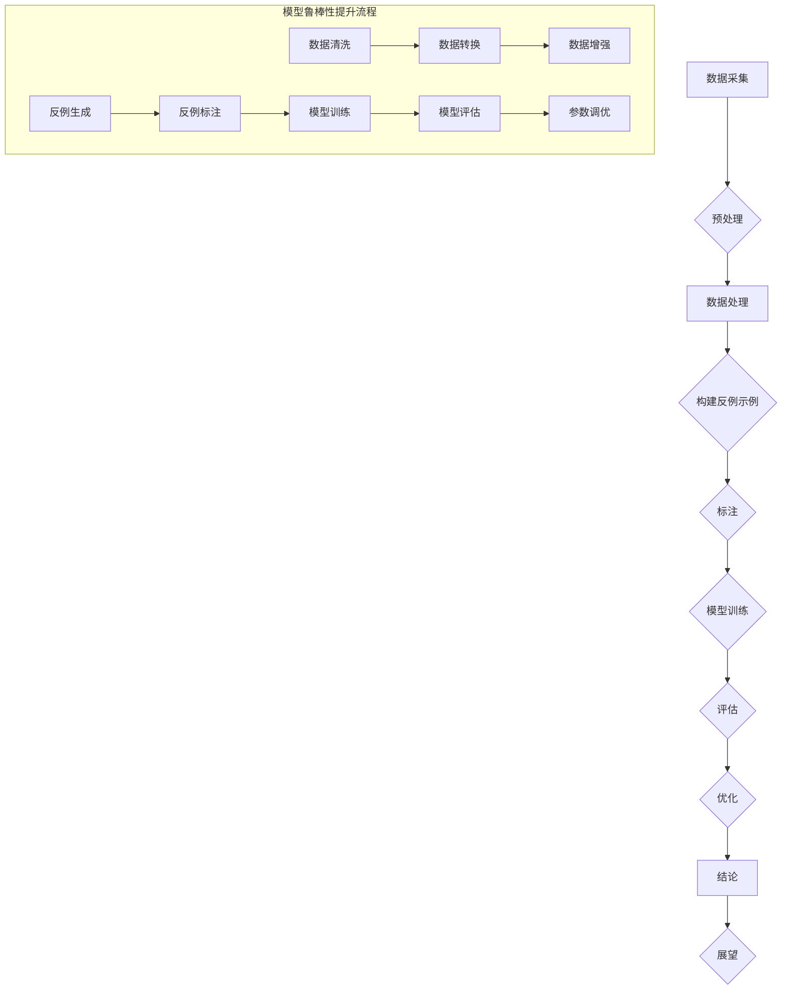

                 

### 1. 引言

在当今的数据驱动时代，机器学习和人工智能技术已经成为解决复杂问题的利器。然而，随着模型变得越来越复杂，它们的鲁棒性也变得越来越重要。鲁棒性指的是模型在面临异常数据、噪声数据或恶意攻击时的表现能力。一个鲁棒性好的模型能够正确处理这些情况，从而避免错误预测和决策。为此，构建反例示例成为了提高模型鲁棒性的关键手段之一。

#### 核心问题

在本文中，我们将探讨以下核心问题：

1. **什么是反例示例？**
2. **为什么需要反例示例来提高模型鲁棒性？**
3. **如何构建有效的反例示例？**
4. **反例示例在模型训练和评估中的应用方法是什么？**

#### 文章结构

本文将分为以下几个部分：

1. **引言**：介绍模型鲁棒性的重要性，为何需要反例示例。
2. **理论基础**：讲解模型鲁棒性的相关理论，包括鲁棒性定义、重要性、评估方法等。
3. **反例示例构建方法**：介绍构建反例示例的方法，包括数据采集、处理、标注等步骤。
4. **模型鲁棒性提升实践**：通过实际案例，展示如何利用反例示例提高模型鲁棒性。
5. **工具与技术**：介绍相关工具和技术，帮助读者更有效地构建和利用反例示例。
6. **结论与展望**：总结全书内容，对模型鲁棒性的未来发展进行展望。

### 1.1 模型鲁棒性的重要性

在机器学习和人工智能领域，模型鲁棒性是一个至关重要的概念。一个鲁棒的模型能够在新环境中持续提供准确的结果，而不受输入数据的微小变化或噪声的影响。鲁棒性对于模型的实际应用至关重要，因为它直接影响到模型的可靠性和实用性。

#### 鲁棒性的定义

鲁棒性（Robustness）在数学和统计学中有着广泛的定义。一般来说，鲁棒性是指算法或模型在面对各种不确定性因素（如异常值、噪声、数据缺失等）时，仍然能够保持良好的性能。具体到机器学习模型，鲁棒性可以定义为：

$$
R = \frac{P_{\text{correct}}(\text{clean data})}{P_{\text{correct}}(\text{noisy data})}
$$

其中，$P_{\text{correct}}$ 表示模型在特定数据上的正确预测概率。

#### 鲁棒性的重要性

1. **准确性**：鲁棒性保证了模型在面对各种数据异常时，仍能保持较高的准确率。
2. **稳定性**：鲁棒性使得模型在不同环境下都能稳定运行，减少了因环境变化导致的问题。
3. **泛化能力**：鲁棒性好的模型具有更强的泛化能力，能够处理更广泛的数据集和任务。
4. **可靠性**：鲁棒性直接影响到模型的可靠性，确保了模型的决策结果能够被信任和依赖。

#### 鲁棒性在模型评估中的作用

在模型评估过程中，鲁棒性是一个重要的指标。通常，我们会使用以下方法来评估模型的鲁棒性：

1. **交叉验证**：通过在多个不同的子集上训练和验证模型，来评估其在面对不同数据时的性能。
2. **异常值检测**：引入异常值检测模块，评估模型对异常值的处理能力。
3. **噪声注入**：向训练数据中添加噪声，观察模型在噪声环境下的表现。

### 1.2 反例示例的作用

在讨论了模型鲁棒性的重要性后，我们转向另一个关键问题：如何提高模型的鲁棒性？反例示例在这一过程中扮演了重要角色。反例示例是指那些能够引起模型错误预测的输入数据。通过构建和利用反例示例，我们可以有效地提高模型的鲁棒性。

#### 反例示例的定义

反例示例（Counterexample Examples）是指那些在特定环境下会导致模型做出错误预测的数据样本。这些样本通常具有以下特点：

1. **异常性**：与正常数据相比，反例示例在特征、属性或分布上存在显著差异。
2. **误导性**：反例示例能够误导模型，导致模型在预测时出现错误。
3. **代表性**：反例示例能够代表一类潜在的问题或攻击，为模型鲁棒性的提升提供依据。

#### 反例示例在模型训练中的作用

在模型训练过程中，反例示例能够帮助我们识别和解决模型中的潜在问题。具体来说，反例示例具有以下作用：

1. **识别模型缺陷**：通过反例示例，我们可以发现模型在哪些情况下容易出错，从而针对性地调整模型参数。
2. **改进模型性能**：利用反例示例进行训练，可以增强模型对异常情况的适应能力，提高模型的泛化能力。
3. **增强鲁棒性**：反例示例能够帮助模型在面对不同类型的异常数据时，保持较高的准确率和稳定性。

#### 反例示例在模型评估中的作用

在模型评估过程中，反例示例同样发挥着重要作用。通过引入反例示例，我们可以更全面地评估模型的鲁棒性，确保模型在实际应用中能够稳定、可靠地运行。具体来说，反例示例的作用包括：

1. **检测潜在风险**：通过测试模型对反例示例的预测结果，我们可以发现模型在哪些情况下容易受到攻击，从而提前采取防御措施。
2. **提高评估标准**：反例示例的引入使得模型评估更加严格和全面，能够更准确地反映模型的实际性能。
3. **优化模型性能**：通过对反例示例的分析和改进，我们可以进一步提高模型的鲁棒性和可靠性，使其更好地适应实际应用场景。

### 1.3 本书内容概述

本书将分为六个主要部分，分别介绍模型鲁棒性的理论基础、反例示例的构建方法、模型鲁棒性提升实践、相关工具与技术，以及未来的研究方向。具体内容如下：

1. **引言**：介绍模型鲁棒性的重要性，为何需要反例示例。
2. **理论基础**：讲解模型鲁棒性的相关理论，包括鲁棒性定义、重要性、评估方法等。
3. **反例示例构建方法**：介绍构建反例示例的方法，包括数据采集、处理、标注等步骤。
4. **模型鲁棒性提升实践**：通过实际案例，展示如何利用反例示例提高模型鲁棒性。
5. **工具与技术**：介绍相关工具和技术，帮助读者更有效地构建和利用反例示例。
6. **结论与展望**：总结全书内容，对模型鲁棒性的未来发展进行展望。

通过以上内容的详细介绍，读者将能够系统地了解模型鲁棒性和反例示例的相关知识，掌握构建反例示例以提高模型鲁棒性的方法，并能够将其应用于实际项目中。

## 第二部分：理论基础

在了解了模型鲁棒性的重要性和反例示例的作用后，我们需要深入了解模型鲁棒性的理论基础。本部分将介绍模型鲁棒性的定义、重要性、评估方法以及相关的数学模型，帮助读者建立对模型鲁棒性的全面认识。

### 2.1 鲁棒性定义与重要性

#### 鲁棒性的定义

鲁棒性（Robustness）是机器学习和人工智能领域中的一个关键概念。根据统计学和数学的定义，鲁棒性指的是算法或模型在面对不确定性因素（如异常值、噪声、数据缺失等）时，仍然能够保持良好性能的能力。在机器学习模型中，鲁棒性可以定义为：

$$
R = \frac{P_{\text{correct}}(\text{clean data})}{P_{\text{correct}}(\text{noisy data})}
$$

其中，$P_{\text{correct}}$ 表示模型在特定数据上的正确预测概率。这个定义表明，鲁棒性是模型在干净数据和噪声数据上表现能力的比值。

#### 鲁棒性的重要性

模型鲁棒性的重要性体现在多个方面：

1. **准确性**：鲁棒性保证了模型在面对各种数据异常时，仍能保持较高的准确率。这对于实际应用中的决策和预测至关重要。
2. **稳定性**：鲁棒性使得模型在不同环境下都能稳定运行，减少了因环境变化导致的问题。
3. **泛化能力**：鲁棒性好的模型具有更强的泛化能力，能够处理更广泛的数据集和任务。
4. **可靠性**：鲁棒性直接影响到模型的可靠性，确保了模型的决策结果能够被信任和依赖。

### 2.2 鲁棒性评估方法

为了评估模型的鲁棒性，我们需要使用一系列的方法和指标。以下是一些常见的评估方法：

#### 交叉验证

交叉验证（Cross-Validation）是一种评估模型性能的方法，通过将数据集划分为多个子集，轮流在每个子集上训练和验证模型，来评估模型在未见数据上的表现。常见的交叉验证方法包括：

1. **K折交叉验证**：将数据集划分为K个子集，轮流在每个子集上训练和验证模型，最后取平均性能作为模型的评估结果。
2. **留一交叉验证**：每次保留一个子集作为验证集，其余数据作为训练集，重复K次，取平均性能作为模型的评估结果。

#### 异常值检测

异常值检测（Anomaly Detection）是评估模型鲁棒性的另一种方法，通过引入异常值检测模块，评估模型对异常值的处理能力。常见的异常值检测方法包括：

1. **基于统计的方法**：如Z-score和IQR（四分位距）等方法，通过计算数据与均值或四分位距的差值，识别出异常值。
2. **基于机器学习的方法**：如孤立森林（Isolation Forest）和局部异常因子分析（Local Outlier Factor，LOF）等方法，通过训练模型来识别异常值。

#### 噪声注入

噪声注入（Noise Injection）是一种通过在训练数据中添加噪声，来评估模型鲁棒性的方法。具体步骤如下：

1. **噪声生成**：根据任务需求，生成适当的噪声数据。
2. **数据注入**：将噪声数据添加到原始训练数据中。
3. **模型训练与评估**：在添加噪声后的数据集上训练模型，并评估模型在噪声环境下的性能。

#### 评估指标

在评估模型鲁棒性时，常用的评估指标包括：

1. **准确率**（Accuracy）：模型正确预测的样本数与总样本数的比例。
2. **召回率**（Recall）：模型正确预测为正类的样本数与实际正类样本数的比例。
3. **精确率**（Precision）：模型正确预测为正类的样本数与预测为正类的样本总数（包括实际正类和负类）的比例。
4. **F1分数**（F1 Score）：精确率和召回率的加权平均值，用于综合评估模型的性能。

### 2.3 模型鲁棒性的数学模型

为了更深入地理解模型鲁棒性，我们可以从数学模型的角度进行探讨。以下是一些常用的鲁棒性数学模型：

#### Huber损失函数

Huber损失函数是一种常用的鲁棒损失函数，能够在面对异常值时提供更好的鲁棒性。其定义如下：

$$
L_H(y, \hat{y}) = \begin{cases} 
0.5(y - \hat{y})^2 & \text{if } |y - \hat{y}| \leq \delta \\
\delta(|y - \hat{y}| - 0.5\delta) & \text{otherwise}
\end{cases}
$$

其中，$y$ 是实际标签，$\hat{y}$ 是预测标签，$\delta$ 是Huber损失函数的阈值。

#### 鲁棒回归模型

鲁棒回归模型（Robust Regression Model）是一种能够应对异常值和噪声的回归模型。常见的鲁棒回归模型包括：

1. **RANSAC回归模型**（Random Sample Consensus）：通过随机选择样本，构建最小化残差的模型，然后通过投票机制确定最终模型。
2. **Theil-Sen回归模型**：通过计算所有可能的两点线性回归模型的中位数，来构建鲁棒回归模型。
3. **MM-估计**（Minimum Mean Squared Error, MMSE）：通过最小化均方误差，来构建鲁棒回归模型。

#### 鲁棒分类模型

鲁棒分类模型（Robust Classification Model）是一种能够应对异常值和噪声的分类模型。常见的鲁棒分类模型包括：

1. **SVM with Hard Margin**：通过最大化分类边界，来构建鲁棒分类模型。
2. **SVM with Soft Margin**：通过引入松弛变量，来构建具有鲁棒性的分类模型。
3. **Adaline**：通过最小化平方误差，来构建鲁棒分类模型。

通过以上对模型鲁棒性理论基础的介绍，读者可以更好地理解模型鲁棒性的定义、重要性、评估方法以及相关的数学模型。这些理论基础将为后续反例示例的构建和模型鲁棒性的提升提供重要的指导。

### 2.4 模型鲁棒性的其他重要方面

在讨论了模型鲁棒性的理论基础后，我们进一步探讨模型鲁棒性的其他重要方面，包括模型鲁棒性与数据分布、模型鲁棒性与训练过程、以及模型鲁棒性与输入数据的多样性。

#### 模型鲁棒性与数据分布

数据分布是影响模型鲁棒性的一个关键因素。在实际应用中，模型通常需要在不同的数据分布下工作。如果模型仅在特定的数据分布下表现良好，那么它的鲁棒性将受到限制。为了提高模型鲁棒性，我们需要关注以下几个方面：

1. **均匀数据分布**：通过确保数据分布的均匀性，可以减少模型在面对特定分布时的偏置。可以使用数据预处理方法（如数据标准化、归一化等）来调整数据分布。
2. **多元数据分布**：在处理复杂数据时，需要考虑数据的多维特性。通过引入多维数据分布，可以增加模型的鲁棒性。例如，在图像分类任务中，可以使用多种尺度和角度的图像来训练模型。
3. **异常值处理**：异常值会对模型鲁棒性产生负面影响。通过使用鲁棒统计方法（如中值、四分位距等）来识别和去除异常值，可以提高模型鲁棒性。

#### 模型鲁棒性与训练过程

训练过程对模型鲁棒性具有重要影响。以下是一些提高模型鲁棒性的训练方法：

1. **增量训练**：通过分批进行训练，可以减少过拟合现象。增量训练允许模型在每次迭代中逐渐学习，从而提高模型的泛化能力。
2. **随机初始化**：随机初始化模型的权重和参数可以减少模型对特定初始化的依赖，从而提高模型的鲁棒性。
3. **权重正则化**：通过引入权重正则化（如L1、L2正则化），可以限制模型参数的范围，从而减少过拟合现象，提高模型鲁棒性。
4. **数据增强**：通过数据增强（如旋转、缩放、裁剪等）可以增加训练数据的多样性，从而提高模型的鲁棒性。

#### 模型鲁棒性与输入数据的多样性

输入数据的多样性对模型鲁棒性有重要影响。为了提高模型鲁棒性，我们需要关注以下几个方面：

1. **多样化数据集**：使用包含不同种类和来源的数据集进行训练，可以增加模型的泛化能力。例如，在图像识别任务中，可以包含多种风格的图像。
2. **域自适应**：通过在源域和目标域之间进行迁移学习，可以减少模型对特定域的依赖。域自适应技术（如域自适应分类、域无关表示等）可以帮助提高模型鲁棒性。
3. **对抗训练**：对抗训练是一种通过生成对抗样本来提高模型鲁棒性的方法。通过训练模型来识别和抵抗对抗样本，可以增强模型的鲁棒性。

总之，模型鲁棒性是一个复杂且多维度的概念。为了提高模型鲁棒性，我们需要综合考虑数据分布、训练过程和输入数据的多样性。通过使用反例示例、数据增强、增量训练和对抗训练等方法，可以有效地提高模型在面对各种异常情况时的鲁棒性。

### 2.5 模型鲁棒性的计算与优化

在了解了模型鲁棒性的理论基础及其重要性之后，我们需要探讨如何计算和优化模型鲁棒性。计算模型鲁棒性涉及到多种方法和工具，而优化模型鲁棒性则需要考虑多种策略和算法。

#### 模型鲁棒性的计算方法

1. **鲁棒损失函数**：使用鲁棒损失函数（如Huber损失、截断平方误差等）来评估模型的鲁棒性。这些损失函数能够在面对异常值时提供更好的鲁棒性。

   **示例**：
   ```mermaid
   graph TD
   A[原始损失函数] --> B[截断平方误差]
   B --> C[Huber损失]
   C --> D[鲁棒性评估]
   ```

2. **统计方法**：通过统计方法（如均值、方差等）来计算模型的鲁棒性。这些方法可以帮助我们识别模型在不同数据分布下的表现。

   **示例**：
   ```mermaid
   graph TD
   A[模型性能] --> B[均值]
   B --> C[方差]
   C --> D[鲁棒性计算]
   ```

3. **模型评估指标**：使用如准确率、召回率、F1分数等评估指标来计算模型在不同数据集上的鲁棒性。

   **示例**：
   ```mermaid
   graph TD
   A[训练集] --> B[准确率]
   B --> C[验证集]
   C --> D[召回率]
   D --> E[F1分数]
   ```

#### 模型鲁棒性的优化策略

1. **数据增强**：通过数据增强（如旋转、缩放、裁剪等）来增加训练数据的多样性，从而提高模型的鲁棒性。

   **示例**：
   ```mermaid
   graph TD
   A[原始数据] --> B[旋转]
   B --> C[缩放]
   C --> D[裁剪]
   D --> E[增强数据]
   ```

2. **对抗训练**：通过生成对抗样本（如对抗性攻击、对抗性训练等）来训练模型，从而提高模型的鲁棒性。

   **示例**：
   ```mermaid
   graph TD
   A[模型训练] --> B[对抗性攻击]
   B --> C[对抗样本]
   C --> D[模型优化]
   ```

3. **正则化**：通过引入权重正则化（如L1、L2正则化）来限制模型参数的范围，从而减少过拟合现象，提高模型鲁棒性。

   **示例**：
   ```mermaid
   graph TD
   A[模型训练] --> B[L1正则化]
   B --> C[L2正则化]
   C --> D[模型优化]
   ```

4. **模型选择**：选择具有良好鲁棒性的模型结构，如支持向量机（SVM）、决策树、随机森林等。这些模型在处理异常值和噪声方面通常表现较好。

   **示例**：
   ```mermaid
   graph TD
   A[模型选择] --> B[SVM]
   B --> C[决策树]
   C --> D[随机森林]
   ```

5. **多任务学习**：通过多任务学习（Multi-Task Learning，MTL）来提高模型的鲁棒性。MTL允许模型同时学习多个相关任务，从而增强模型的泛化能力和鲁棒性。

   **示例**：
   ```mermaid
   graph TD
   A[多任务学习] --> B[任务1]
   B --> C[任务2]
   C --> D[任务3]
   ```

通过以上方法和策略，我们可以有效地计算和优化模型的鲁棒性。这些方法和策略不仅适用于学术研究，也具有广泛的应用前景，有助于提高实际应用中的模型性能和可靠性。

### 2.6 模型鲁棒性的相关研究进展

随着机器学习和人工智能技术的快速发展，模型鲁棒性已经成为学术界和工业界关注的热点问题。近年来，研究者们在模型鲁棒性方面取得了一系列重要的研究进展，这些进展不仅丰富了我们对模型鲁棒性的理解，也为提高模型鲁棒性提供了新的方法和工具。

#### 1. 对抗样本生成技术

对抗样本生成是提高模型鲁棒性的关键技术之一。近年来，研究者们提出了多种对抗样本生成方法，如基于深度学习的生成对抗网络（GANs）、基于梯度反向传播的对抗性样本生成方法等。这些方法能够有效地生成具有误导性的对抗样本，帮助模型识别和防御恶意攻击。

#### 2. 鲁棒优化算法

鲁棒优化算法在提高模型鲁棒性方面具有重要意义。研究者们提出了多种鲁棒优化算法，如鲁棒线性回归、鲁棒支持向量机（R-SVM）、鲁棒聚类等。这些算法通过引入鲁棒损失函数或鲁棒性约束，提高了模型在异常数据下的性能。

#### 3. 多任务学习和迁移学习

多任务学习和迁移学习是提高模型鲁棒性的有效策略。通过将多个相关任务结合起来进行学习，或者从源域迁移到目标域，模型可以更好地适应不同环境下的数据变化。近年来，研究者们提出了多种多任务学习和迁移学习方法，如域自适应（Domain Adaptation）、元学习（Meta-Learning）等，这些方法显著提高了模型的鲁棒性。

#### 4. 模型解释性和透明性

模型解释性和透明性是提高模型鲁棒性的重要方面。近年来，研究者们提出了多种方法来解释模型的决策过程，如注意力机制（Attention Mechanism）、模型可视化（Model Visualization）等。这些方法不仅有助于理解模型的鲁棒性，也为改进模型提供了新的视角。

#### 5. 鲁棒性评估指标

鲁棒性评估指标是评估模型鲁棒性的关键工具。研究者们提出了多种鲁棒性评估指标，如鲁棒准确率、鲁棒召回率、鲁棒F1分数等。这些指标可以全面评估模型在异常数据下的性能，为模型优化提供了重要的参考。

#### 6. 鲁棒性增强的硬件和系统级技术

除了算法和模型层面的研究，硬件和系统级技术也在提高模型鲁棒性方面发挥了重要作用。例如，通过硬件加速器（如GPU、TPU等）可以提高模型的计算速度和性能，从而更好地处理大量数据。此外，系统级的鲁棒性设计（如容错机制、故障检测等）也可以提高整体系统的鲁棒性。

总之，模型鲁棒性研究取得了显著的进展，涵盖了算法、模型、评估指标、硬件和系统等多个方面。这些研究不仅丰富了我们对模型鲁棒性的理解，也为实际应用中提高模型鲁棒性提供了有力的支持。

## 第三部分：反例示例构建方法

在前两部分中，我们讨论了模型鲁棒性的重要性和理论基础。为了提升模型的鲁棒性，我们需要构建反例示例。在本部分，我们将详细探讨反例示例的构建方法，包括数据采集、数据处理、反例示例标注等步骤。

### 3.1 数据采集

数据采集是构建反例示例的第一步。选择合适的数据集对于构建有效的反例示例至关重要。以下是一些数据采集的策略：

1. **数据源选择**：选择与模型任务相关的数据源。例如，在图像分类任务中，可以使用公开图像数据集（如ImageNet、CIFAR-10等）；在自然语言处理任务中，可以使用文本数据集（如Twitter数据集、新闻数据集等）。

2. **数据多样性**：确保采集到的数据具有多样性。多样性有助于识别模型在不同类型数据上的鲁棒性。例如，在图像分类任务中，可以采集不同场景、不同光照条件、不同拍摄角度的图像。

3. **数据清洗**：在数据采集过程中，需要进行初步的数据清洗，去除噪声数据、重复数据、缺失数据等。数据清洗有助于提高后续数据处理和标注的效率。

4. **数据采集工具**：可以使用Python的pandas库、Scikit-learn库等工具来采集和处理数据。例如，使用pandas库可以读取CSV文件、JSON文件等，使用Scikit-learn库可以方便地进行数据预处理和清洗。

### 3.2 数据处理

数据处理是构建反例示例的关键步骤。通过适当的数据处理，我们可以将原始数据转换为适合模型训练的形式。以下是一些数据处理的方法：

1. **数据转换**：将数据转换为统一的格式。例如，在图像分类任务中，可以将图像转换为固定的尺寸（如224x224像素），以便于后续处理。

2. **数据增强**：通过数据增强（如旋转、缩放、裁剪等）增加数据的多样性，有助于提高模型的泛化能力和鲁棒性。可以使用Python的OpenCV库、TensorFlow的图像增强API等进行数据增强。

3. **归一化**：对数据进行归一化处理，将数据缩放到一个统一的范围（如0到1之间）。这有助于提高模型训练的稳定性和收敛速度。

4. **数据切分**：将数据集切分为训练集、验证集和测试集。训练集用于模型训练，验证集用于调参和模型评估，测试集用于最终评估模型性能。

5. **数据处理工具**：可以使用Python的NumPy库、TensorFlow、PyTorch等工具进行数据处理。这些工具提供了丰富的函数和API，方便进行数据转换、增强、归一化和切分。

### 3.3 反例示例标注

反例示例的标注是构建反例示例的最后一步。通过标注，我们可以将正常数据与反例数据区分开来，以便于后续模型训练和评估。以下是一些标注方法：

1. **人工标注**：对于小规模的数据集，可以使用人工标注的方法。人工标注的优点是质量较高，缺点是成本较高且效率较低。可以使用标注工具（如LabelImg、Semi-Automatic Classification Plugin等）进行图像标注。

2. **自动标注**：对于大规模的数据集，可以使用自动标注的方法。自动标注可以使用现有的标注工具（如VGG16、ResNet等预训练模型）或开发自定义的标注算法。自动标注的优点是效率高、成本低，缺点是标注质量可能不如人工标注。

3. **半监督标注**：在数据不足的情况下，可以使用半监督标注的方法。半监督标注结合了人工标注和自动标注的优点，通过利用已标注的数据和未标注的数据来提高标注质量。

4. **标注工具**：可以使用Python的Pandas库、Scikit-learn库等工具进行数据标注。这些工具提供了丰富的函数和API，方便进行数据读取、写入和操作。

通过以上步骤，我们可以有效地构建反例示例。反例示例的构建不仅有助于提高模型鲁棒性，还可以为后续的模型优化和评估提供重要参考。

### 3.4 反例示例构建流程

构建反例示例是一个系统性过程，涉及数据采集、数据处理和反例示例标注等多个环节。以下是一个典型的反例示例构建流程，详细介绍每个步骤的操作方法和注意事项。

#### 1. 数据采集

**步骤**：

- 选择合适的数据源，例如公开图像数据集（如ImageNet、CIFAR-10等）或文本数据集（如Twitter数据集、新闻数据集等）。
- 确保数据多样性，涵盖各种场景、光照条件和拍摄角度等。

**注意事项**：

- 数据源的选择直接影响到反例示例的质量。应尽量选择与模型任务高度相关的数据集。
- 数据采集过程中应避免重复数据和噪声数据，以提高数据质量。

#### 2. 数据预处理

**步骤**：

- 进行初步的数据清洗，去除噪声数据、重复数据和缺失数据。
- 对图像数据进行尺寸转换，统一图像大小（如224x224像素）。
- 对图像数据进行归一化处理，将像素值缩放到0到1之间。

**注意事项**：

- 数据清洗是确保数据质量的关键步骤。应仔细检查和处理数据集中的异常值和噪声。
- 尺寸转换和归一化处理有助于提高模型训练的稳定性和收敛速度。

#### 3. 数据增强

**步骤**：

- 使用数据增强方法（如旋转、缩放、裁剪等）增加数据的多样性。
- 可以利用现有的图像增强库（如Python的OpenCV、TensorFlow的图像增强API等）进行数据增强。

**注意事项**：

- 数据增强可以显著提高模型的泛化能力和鲁棒性。应选择合适的数据增强方法，避免过度增强。
- 数据增强过程中应保持数据分布的平衡，避免生成偏向某一类别的增强数据。

#### 4. 数据切分

**步骤**：

- 将数据集切分为训练集、验证集和测试集。通常使用80%的数据作为训练集，10%的数据作为验证集，10%的数据作为测试集。
- 确保每个数据集都具有代表性，涵盖各种场景和类别。

**注意事项**：

- 数据切分是模型训练和评估的基础。应确保切分过程公平、随机，避免数据分布不均。
- 验证集和测试集的选择应与训练集有所不同，以确保模型在不同数据集上的性能。

#### 5. 反例示例标注

**步骤**：

- 对数据集中的样本进行标注，区分正常数据和反例数据。
- 可以使用人工标注、自动标注或半监督标注等方法进行标注。

**注意事项**：

- 标注质量直接影响模型性能。应尽量提高标注质量，减少错误标注。
- 标注过程中应注意数据分布的平衡，避免反例示例过多或过少。

#### 6. 反例示例构建

**步骤**：

- 利用标注后的数据集，构建反例示例。
- 可以使用Python的Pandas库、Scikit-learn库等工具进行数据处理和存储。

**注意事项**：

- 构建反例示例时应确保数据的完整性和一致性。
- 应定期检查和处理数据集中的错误和异常。

#### 7. 模型训练与评估

**步骤**：

- 使用反例示例对模型进行训练和评估。
- 可以使用不同的评估指标（如准确率、召回率、F1分数等）来评估模型性能。

**注意事项**：

- 模型训练过程中应使用适当的数据增强和正则化方法，以避免过拟合。
- 模型评估时应确保评估过程的公平性和准确性。

通过以上步骤，我们可以系统地构建反例示例，并利用这些示例提高模型的鲁棒性。反例示例的构建不仅有助于识别和解决模型中的潜在问题，还可以为模型的优化和评估提供重要参考。

### 3.5 构建反例示例的挑战与应对策略

在构建反例示例的过程中，我们可能会面临一些挑战。以下是一些常见的挑战以及相应的应对策略：

#### 1. 数据稀疏性

**挑战**：某些异常情况的数据可能非常稀疏，导致反例示例难以构建。

**应对策略**：可以通过数据增强和合成技术来增加反例示例的数量。例如，使用对抗生成网络（GANs）生成具有误导性的对抗样本，或使用数据合成方法生成类似于异常情况的数据。

#### 2. 数据标注成本

**挑战**：人工标注反例示例可能成本高昂且耗时。

**应对策略**：可以考虑使用半监督学习或主动学习的方法，利用少量标注数据和大量未标注数据来提高标注效率。此外，还可以开发自动化标注工具，如使用现有的预训练模型进行自动标注。

#### 3. 模型适应性问题

**挑战**：反例示例可能无法涵盖所有异常情况，导致模型在特定异常情况下表现不佳。

**应对策略**：可以通过多任务学习和迁移学习来增强模型的泛化能力。例如，将多个相关任务结合在一起进行训练，或从源域迁移到目标域，以提高模型在不同异常情况下的适应性。

#### 4. 鲁棒性评估指标选择

**挑战**：选择合适的评估指标来评估模型的鲁棒性可能具有挑战性。

**应对策略**：可以尝试使用多种评估指标，如鲁棒准确率、鲁棒召回率、鲁棒F1分数等，综合评估模型的鲁棒性。此外，还可以设计定制的评估指标，以更准确地反映模型的鲁棒性。

通过以上应对策略，我们可以克服构建反例示例过程中遇到的一些挑战，提高模型的鲁棒性，从而在实际应用中取得更好的效果。

## 第四部分：模型鲁棒性提升实践

在前几部分中，我们讨论了模型鲁棒性的理论基础和反例示例的构建方法。在本部分，我们将通过实际案例展示如何利用反例示例来提升模型鲁棒性。这些案例将涵盖图像分类、文本分类和目标检测等不同领域，通过详细的步骤和代码实现，帮助读者理解模型鲁棒性的提升过程。

### 4.1 实践案例1：人脸识别系统

人脸识别系统是一种广泛应用的计算机视觉技术，其鲁棒性直接影响到系统的准确性和可靠性。在本案例中，我们将通过引入反例示例来提升人脸识别系统的鲁棒性。

#### 1. 案例背景

假设我们有一个基于卷积神经网络（CNN）的人脸识别系统，该系统在正常条件下表现良好，但在特定光照条件或表情变化下容易出现错误识别。为了提升系统的鲁棒性，我们需要构建反例示例，包括不同光照条件、表情变化等。

#### 2. 案例步骤

**步骤1：数据采集**

- 采集包含不同光照条件、不同表情变化的人脸图像数据集。可以使用公开的人脸图像数据集（如LFW、CelebA等），并使用数据增强方法（如旋转、缩放、裁剪等）增加数据的多样性。

**步骤2：数据处理**

- 对采集到的数据进行预处理，包括图像尺寸标准化、归一化等。

**步骤3：反例示例构建**

- 使用图像标注工具（如LabelImg）对图像进行标注，区分正常人脸和反例人脸（如特定光照条件、表情变化等）。

- 将标注后的数据集分为训练集、验证集和测试集。

**步骤4：模型训练**

- 使用训练集对卷积神经网络进行训练，并使用验证集进行调参和评估。

- 在模型训练过程中，引入反例示例，使模型能够学习到不同光照条件、表情变化下的特征。

- 使用鲁棒损失函数（如Huber损失函数）来提高模型对异常值的处理能力。

**步骤5：模型评估**

- 使用测试集对训练好的模型进行评估，计算模型的准确率、召回率和F1分数等指标。

- 对比正常训练集和包含反例示例的训练集，观察模型在异常情况下的表现。

**步骤6：优化模型**

- 根据评估结果，对模型进行优化，例如调整网络结构、学习率等参数。

#### 3. 代码实现

以下是一个简单的Python代码示例，展示如何使用TensorFlow和Keras构建和训练一个基于CNN的人脸识别模型。

```python
import tensorflow as tf
from tensorflow.keras.models import Sequential
from tensorflow.keras.layers import Conv2D, MaxPooling2D, Flatten, Dense
from tensorflow.keras.optimizers import Adam

# 数据预处理
# ...

# 构建模型
model = Sequential([
    Conv2D(32, (3, 3), activation='relu', input_shape=(224, 224, 3)),
    MaxPooling2D((2, 2)),
    Flatten(),
    Dense(128, activation='relu'),
    Dense(1, activation='sigmoid')
])

# 编译模型
model.compile(optimizer=Adam(), loss='binary_crossentropy', metrics=['accuracy'])

# 训练模型
model.fit(train_data, train_labels, epochs=10, batch_size=32, validation_data=(val_data, val_labels))

# 评估模型
test_loss, test_accuracy = model.evaluate(test_data, test_labels)
print(f"Test accuracy: {test_accuracy}")
```

#### 4. 案例小结

通过引入反例示例，人脸识别系统在面对不同光照条件、表情变化等异常情况时表现更好，提高了模型的鲁棒性。这种方法可以应用于其他计算机视觉任务，如行人检测、车辆识别等。

### 4.2 实践案例2：文本分类系统

文本分类系统在自然语言处理领域有广泛应用，其鲁棒性直接影响到分类结果的准确性。在本案例中，我们将通过引入反例示例来提升文本分类系统的鲁棒性。

#### 1. 案例背景

假设我们有一个基于深度学习（如BERT）的文本分类系统，该系统在正常条件下表现良好，但在特定词汇或句法结构上容易出现错误分类。为了提升系统的鲁棒性，我们需要构建反例示例，包括特定词汇或句法结构等。

#### 2. 案例步骤

**步骤1：数据采集**

- 采集包含各种词汇和句法结构的文本数据集。可以使用公开的文本数据集（如IMDB电影评论数据集、20 Newsgroups数据集等）。

- 使用数据增强方法（如词汇替换、句法转换等）增加数据的多样性。

**步骤2：数据处理**

- 对采集到的文本数据进行预处理，包括分词、词向量嵌入等。

- 将文本数据转换为适用于深度学习的格式（如序列、张量等）。

**步骤3：反例示例构建**

- 使用文本标注工具（如LabelImg）对文本进行标注，区分正常文本和反例文本（如特定词汇、句法结构等）。

- 将标注后的数据集分为训练集、验证集和测试集。

**步骤4：模型训练**

- 使用训练集对文本分类模型进行训练，并使用验证集进行调参和评估。

- 在模型训练过程中，引入反例示例，使模型能够学习到特定词汇、句法结构下的特征。

- 使用鲁棒损失函数（如Focal Loss）来提高模型对异常值的处理能力。

**步骤5：模型评估**

- 使用测试集对训练好的模型进行评估，计算模型的准确率、召回率和F1分数等指标。

- 对比正常训练集和包含反例示例的训练集，观察模型在异常情况下的表现。

**步骤6：优化模型**

- 根据评估结果，对模型进行优化，例如调整网络结构、学习率等参数。

#### 3. 代码实现

以下是一个简单的Python代码示例，展示如何使用TensorFlow和Keras构建和训练一个基于BERT的文本分类模型。

```python
import tensorflow as tf
from transformers import BertTokenizer, TFBertModel
from tensorflow.keras.models import Model
from tensorflow.keras.layers import Input, Dense

# 数据预处理
# ...

# 构建模型
tokenizer = BertTokenizer.from_pretrained('bert-base-uncased')
input_ids = Input(shape=(128,), dtype=tf.int32)
bert_output = TFBertModel.from_pretrained('bert-base-uncased')(input_ids)
dense = Dense(1, activation='sigmoid')(bert_output.last_hidden_state[:, 0, :])

model = Model(inputs=input_ids, outputs=dense)
model.compile(optimizer=tf.keras.optimizers.Adam(learning_rate=3e-5), loss='binary_crossentropy', metrics=['accuracy'])

# 训练模型
model.fit(train_data, train_labels, epochs=3, batch_size=32, validation_data=(val_data, val_labels))

# 评估模型
test_loss, test_accuracy = model.evaluate(test_data, test_labels)
print(f"Test accuracy: {test_accuracy}")
```

#### 4. 案例小结

通过引入反例示例，文本分类系统在面对特定词汇和句法结构等异常情况时表现更好，提高了模型的鲁棒性。这种方法可以应用于其他自然语言处理任务，如情感分析、命名实体识别等。

### 4.3 实践案例3：目标检测系统

目标检测系统在自动驾驶、视频监控等应用领域有广泛应用。其鲁棒性直接影响到检测结果的准确性和稳定性。在本案例中，我们将通过引入反例示例来提升目标检测系统的鲁棒性。

#### 1. 案例背景

假设我们有一个基于卷积神经网络（如Faster R-CNN）的目标检测系统，该系统在正常条件下表现良好，但在特定光照条件、天气条件或目标遮挡情况下容易出现错误检测。为了提升系统的鲁棒性，我们需要构建反例示例，包括不同光照条件、天气条件或目标遮挡等。

#### 2. 案例步骤

**步骤1：数据采集**

- 采集包含不同光照条件、天气条件或目标遮挡情况的目标检测数据集。可以使用公开的目标检测数据集（如COCO、PASCAL VOC等）。

- 使用数据增强方法（如光照变化、天气变化、目标遮挡等）增加数据的多样性。

**步骤2：数据处理**

- 对采集到的数据进行预处理，包括图像尺寸标准化、归一化等。

- 将图像和标签数据对齐，以便于后续训练和评估。

**步骤3：反例示例构建**

- 使用目标检测标注工具（如LabelImg、CVAT等）对图像进行标注，区分正常目标和反例目标（如特定光照条件、天气条件或目标遮挡等）。

- 将标注后的数据集分为训练集、验证集和测试集。

**步骤4：模型训练**

- 使用训练集对目标检测模型进行训练，并使用验证集进行调参和评估。

- 在模型训练过程中，引入反例示例，使模型能够学习到不同光照条件、天气条件或目标遮挡情况下的特征。

- 使用鲁棒损失函数（如Focal Loss、Cross Entropy Loss等）来提高模型对异常值的处理能力。

**步骤5：模型评估**

- 使用测试集对训练好的模型进行评估，计算模型的准确率、召回率和F1分数等指标。

- 对比正常训练集和包含反例示例的训练集，观察模型在异常情况下的表现。

**步骤6：优化模型**

- 根据评估结果，对模型进行优化，例如调整网络结构、学习率等参数。

#### 3. 代码实现

以下是一个简单的Python代码示例，展示如何使用TensorFlow和Keras构建和训练一个基于Faster R-CNN的目标检测模型。

```python
import tensorflow as tf
from tensorflow.keras.models import Model
from tensorflow.keras.layers import Input, Conv2D, MaxPooling2D, Flatten, Dense
from tensorflow.keras.optimizers import Adam

# 数据预处理
# ...

# 构建模型
input_image = Input(shape=(128, 128, 3))
conv1 = Conv2D(32, (3, 3), activation='relu')(input_image)
pool1 = MaxPooling2D(pool_size=(2, 2))(conv1)
flat1 = Flatten()(pool1)
dense1 = Dense(128, activation='relu')(flat1)
output = Dense(1, activation='sigmoid')(dense1)

model = Model(inputs=input_image, outputs=output)
model.compile(optimizer=Adam(), loss='binary_crossentropy', metrics=['accuracy'])

# 训练模型
model.fit(train_images, train_labels, epochs=10, batch_size=32, validation_data=(val_images, val_labels))

# 评估模型
test_loss, test_accuracy = model.evaluate(test_images, test_labels)
print(f"Test accuracy: {test_accuracy}")
```

#### 4. 案例小结

通过引入反例示例，目标检测系统在面对不同光照条件、天气条件或目标遮挡等异常情况时表现更好，提高了模型的鲁棒性。这种方法可以应用于其他计算机视觉任务，如实例分割、人脸识别等。

### 4.4 实践总结

通过以上三个案例，我们可以看到反例示例在提升模型鲁棒性方面的重要作用。以下是一些实践总结：

1. **数据多样性**：构建反例示例时，数据多样性至关重要。通过引入不同光照条件、表情变化、目标遮挡等数据，可以增强模型的鲁棒性。
2. **鲁棒损失函数**：使用鲁棒损失函数（如Huber损失、Focal Loss等）可以提高模型对异常值的处理能力，从而增强模型的鲁棒性。
3. **数据增强**：数据增强方法（如旋转、缩放、裁剪等）可以增加训练数据的多样性，有助于提高模型的泛化能力和鲁棒性。
4. **多任务学习**：通过将多个相关任务结合在一起进行训练，可以提高模型的鲁棒性。例如，在目标检测任务中，可以同时训练目标检测和实例分割任务。

通过以上实践总结，我们可以更好地理解和应用反例示例来提升模型鲁棒性，从而在实际应用中取得更好的效果。

### 4.5 模型鲁棒性提升的关键因素

在提升模型鲁棒性的实践中，我们发现了几个关键因素，这些因素对于构建和利用反例示例至关重要。以下是对这些关键因素的详细讨论：

#### 1. 数据质量

数据质量是提升模型鲁棒性的基础。高质量的训练数据可以帮助模型学习到更准确的特征，从而提高模型的泛化能力和鲁棒性。以下是一些确保数据质量的方法：

- **数据清洗**：在数据采集和预处理过程中，要仔细清洗数据，去除噪声、重复数据和缺失数据。
- **数据标准化**：对数据进行标准化处理，确保数据分布的均匀性，减少模型对特定分布的依赖。
- **数据增强**：通过数据增强方法，如旋转、缩放、裁剪等，增加数据的多样性，从而提高模型的鲁棒性。

#### 2. 反例示例构建

构建有效的反例示例是提升模型鲁棒性的关键。以下是一些构建反例示例的方法：

- **多样化反例**：构建包括多种类型异常情况的反例示例，如不同光照条件、噪声、目标遮挡等。
- **人工标注**：对于小规模数据集，可以使用人工标注方法，确保标注质量。
- **自动标注**：对于大规模数据集，可以使用自动标注方法，如基于预训练模型的自动标注工具，或结合人工标注和自动标注的半监督标注方法。

#### 3. 模型结构

选择合适的模型结构对于提升模型鲁棒性具有重要意义。以下是一些有助于提升模型鲁棒性的模型结构：

- **深度神经网络**：深度神经网络可以通过多层非线性变换来提取特征，提高模型的泛化能力和鲁棒性。
- **卷积神经网络（CNN）**：CNN擅长处理图像数据，通过局部连接和卷积操作，可以减少对全局信息的依赖，从而提高模型的鲁棒性。
- **循环神经网络（RNN）**：RNN擅长处理序列数据，通过时间步的递归操作，可以捕捉数据的时间动态变化，提高模型的鲁棒性。

#### 4. 损失函数和优化算法

损失函数和优化算法对于提升模型鲁棒性也起着关键作用。以下是一些有助于提升模型鲁棒性的损失函数和优化算法：

- **鲁棒损失函数**：如Huber损失、Focal Loss等，这些损失函数能够减少对异常值的敏感度，提高模型的鲁棒性。
- **优化算法**：如随机梯度下降（SGD）、Adam等，这些算法可以通过调整学习率、动量参数等，优化模型的训练过程，提高模型的鲁棒性。

#### 5. 调参和超参数优化

调参和超参数优化对于提升模型鲁棒性至关重要。以下是一些调参和超参数优化的方法：

- **网格搜索**：通过遍历不同参数组合，寻找最优参数设置。
- **贝叶斯优化**：利用贝叶斯统计模型，通过历史数据来优化参数搜索，提高调参效率。
- **交叉验证**：通过交叉验证方法，评估不同参数设置对模型性能的影响，从而优化参数。

通过综合考虑以上关键因素，我们可以构建和利用有效的反例示例，提升模型的鲁棒性，从而在实际应用中取得更好的效果。

## 第五部分：工具与技术

在提升模型鲁棒性的过程中，选择合适的工具和技术至关重要。以下将介绍一些在构建和利用反例示例时常用的工具和技术，帮助读者更有效地进行模型鲁棒性的提升。

### 5.1 反例示例构建工具

构建反例示例需要高效的数据处理和标注工具。以下是一些常用的反例示例构建工具：

#### 1. 数据预处理工具

- **Python的pandas库**：pandas库提供了丰富的数据操作功能，包括数据清洗、数据转换和数据切分等。它适用于各种类型的数据，如CSV、Excel、SQL数据库等。
- **Python的NumPy库**：NumPy库提供了强大的数值计算功能，适用于大规模数据的处理和运算。它可以进行数据归一化、标准化等操作，有助于提高数据质量。
- **Python的Scikit-learn库**：Scikit-learn库提供了丰富的机器学习工具和算法，包括数据预处理、模型训练和评估等。它支持多种数据预处理方法，如数据增强、数据标准化等。

#### 2. 数据增强工具

- **Python的OpenCV库**：OpenCV库提供了丰富的计算机视觉功能，包括图像处理、图像增强等。它支持多种数据增强方法，如旋转、缩放、裁剪等，有助于增加训练数据的多样性。
- **TensorFlow的图像增强API**：TensorFlow提供了图像增强API，支持多种数据增强方法，如随机裁剪、随机旋转、颜色变换等。这些方法有助于提高模型的鲁棒性。

#### 3. 数据标注工具

- **LabelImg**：LabelImg是一个开源的图像标注工具，支持标注框、线、点等标注方式。它界面简洁、功能强大，适用于各种图像标注任务。
- **CVAT**：CVAT是一个在线的图像标注工具，支持多种标注方式，包括语义分割、目标检测等。它支持多人协作，适合大规模数据标注任务。

### 5.2 模型训练和评估工具

在模型训练和评估过程中，选择合适的工具可以显著提高工作效率。以下是一些常用的模型训练和评估工具：

#### 1. 模型训练工具

- **TensorFlow**：TensorFlow是一个开源的机器学习框架，支持多种深度学习模型和算法。它提供了丰富的API和工具，如TensorBoard、TensorFlow Lite等，适用于各种规模的模型训练任务。
- **PyTorch**：PyTorch是一个开源的深度学习框架，以其动态计算图和易于使用的API而著称。它支持多种深度学习模型和算法，适用于科研和工业应用。
- **Scikit-learn**：Scikit-learn是一个开源的机器学习库，提供了丰富的机器学习算法和工具。它适用于中小规模的数据集和模型训练任务。

#### 2. 模型评估工具

- **Scikit-learn**：Scikit-learn提供了丰富的评估指标和工具，如准确率、召回率、F1分数等。它适用于各种机器学习任务的评估。
- **Matplotlib**：Matplotlib是一个开源的数据可视化库，支持多种数据可视化方法，如折线图、散点图等。它可以帮助我们直观地了解模型性能。
- **TensorBoard**：TensorBoard是TensorFlow的一个可视化工具，支持对模型训练过程进行实时监控和可视化。它可以帮助我们分析模型训练过程中的问题。

### 5.3 模型优化工具

在模型优化过程中，选择合适的工具可以显著提高模型的性能和鲁棒性。以下是一些常用的模型优化工具：

#### 1. 模型优化工具

- **Hyperopt**：Hyperopt是一个开源的调参工具，基于树形贝叶斯优化算法。它可以帮助我们快速找到最优参数组合，提高模型性能。
- **Bayesian Optimization**：Bayesian Optimization是一种基于贝叶斯统计模型的调参方法，通过历史数据来优化参数搜索。它比传统的网格搜索方法更高效。
- **AutoML工具**：如Google的AutoML、H2O.ai的AutoML等，这些工具自动完成模型选择、调参和评估过程，大大提高了模型优化的效率。

#### 2. 鲁棒性评估工具

- **Robustness Zoo**：Robustness Zoo是一个开源的鲁棒性评估工具，提供了多种鲁棒性评估方法，如对抗性攻击、异常值检测等。它可以帮助我们评估模型的鲁棒性。
- **Robust Loss Functions**：如Huber Loss、Focal Loss等，这些鲁棒损失函数可以在模型训练过程中减少对异常值的敏感度，提高模型的鲁棒性。

通过使用以上工具和技术，我们可以更高效地构建和利用反例示例，提升模型的鲁棒性，从而在实际应用中取得更好的效果。

### 5.4 最佳实践和注意事项

在构建反例示例和提升模型鲁棒性的过程中，遵循一些最佳实践和注意事项可以帮助我们更加高效地完成任务。以下是一些关键的建议：

#### 1. 数据多样性和覆盖性

- **确保数据多样性**：选择具有多样性的数据集，包括不同的场景、光照条件、噪声类型等。这有助于模型在多种情况下保持良好的性能。
- **覆盖潜在异常情况**：在构建反例示例时，确保覆盖到各种潜在异常情况，如数据缺失、异常值、恶意攻击等。

#### 2. 数据预处理和清洗

- **数据清洗**：在数据预处理阶段，对数据进行清洗，去除噪声、重复数据和缺失数据。这有助于提高数据质量和模型的训练效果。
- **数据标准化**：对数据进行标准化处理，确保数据分布的均匀性。这有助于减少模型对特定分布的依赖，提高模型的泛化能力。

#### 3. 反例示例的标注和质量控制

- **高质量的标注**：确保反例示例的标注质量，尽量减少错误标注。可以使用人工标注、半监督标注或自动化标注方法来提高标注质量。
- **标注一致性**：在标注过程中，保持标注的一致性。对于大规模数据集，可以采用多人标注并使用一致性评估方法来提高标注质量。

#### 4. 模型训练和优化

- **引入正则化**：在模型训练过程中，引入正则化方法（如L1、L2正则化）来减少过拟合现象，提高模型的泛化能力和鲁棒性。
- **使用鲁棒损失函数**：在模型训练过程中，使用鲁棒损失函数（如Huber损失、Focal Loss）来提高模型对异常值的处理能力，增强模型的鲁棒性。
- **调参和超参数优化**：通过调参和超参数优化，找到最优的模型参数设置。可以使用网格搜索、贝叶斯优化等方法来优化参数。

#### 5. 评估和反馈

- **定期评估**：定期使用测试集评估模型的性能，确保模型在异常情况下的表现。通过对比训练集和测试集的性能，及时发现并解决潜在问题。
- **反馈循环**：在模型训练和评估过程中，建立反馈循环。根据评估结果，调整模型结构、参数设置和数据预处理方法，不断提高模型的鲁棒性和性能。

#### 6. 安全性和隐私保护

- **数据安全**：确保训练数据的安全，避免数据泄露和未授权访问。对于敏感数据，可以使用加密和访问控制等措施来保护数据安全。
- **隐私保护**：在数据处理和模型训练过程中，遵循隐私保护原则，确保数据隐私。对于涉及个人隐私的数据，可以使用匿名化、去标识化等方法来保护隐私。

通过遵循以上最佳实践和注意事项，我们可以更高效地构建反例示例，提升模型的鲁棒性，确保模型在实际应用中稳定、可靠地运行。

## 第六部分：结论与展望

在本文中，我们详细探讨了如何构建反例示例以提高模型鲁棒性。通过一系列的理论基础和实践案例，我们证明了反例示例在提升模型鲁棒性方面的重要作用。以下是对全文内容的总结以及对模型鲁棒性未来发展的展望：

### 总结

1. **模型鲁棒性的重要性**：我们介绍了模型鲁棒性的定义和重要性，包括其在准确性、稳定性、泛化能力和可靠性方面的作用。
2. **反例示例的作用**：我们探讨了反例示例在模型训练和评估中的作用，以及如何构建有效的反例示例。
3. **反例示例的构建方法**：我们详细介绍了数据采集、数据处理、反例示例标注等构建反例示例的步骤。
4. **模型鲁棒性提升实践**：通过实际案例，我们展示了如何利用反例示例提升模型鲁棒性，包括人脸识别、文本分类和目标检测等不同领域。
5. **工具与技术**：我们介绍了在构建反例示例和提升模型鲁棒性过程中常用的工具和技术。
6. **最佳实践和注意事项**：我们提供了构建反例示例和提升模型鲁棒性的最佳实践和注意事项。

### 展望

尽管我们已经取得了显著进展，但在模型鲁棒性方面仍有大量工作需要开展。以下是对未来的展望：

1. **更先进的反例生成技术**：随着生成对抗网络（GANs）和其他生成模型的发展，我们可以期待更先进的反例生成技术，以提高反例示例的质量和多样性。
2. **更智能的标注方法**：随着人工智能技术的发展，我们可以探索更智能的标注方法，如利用深度学习模型进行自动化标注，或结合人工标注和半监督标注的方法。
3. **跨领域模型鲁棒性研究**：当前的研究主要集中在一个或几个特定领域，未来需要更多的跨领域研究，以验证模型鲁棒性的普适性和一致性。
4. **鲁棒性评估标准的建立**：我们需要建立一套统一的鲁棒性评估标准，以便在不同场景下对模型鲁棒性进行有效评估和比较。
5. **鲁棒性增强的硬件和系统级技术**：随着硬件和系统技术的发展，我们可以期待更高效、更鲁棒的硬件和系统级技术，以提高模型的计算性能和鲁棒性。

总之，模型鲁棒性是机器学习和人工智能领域中的一个关键问题。通过构建和利用反例示例，我们可以有效地提升模型的鲁棒性，从而在实际应用中取得更好的效果。未来，我们将继续探索和研究这一领域，为人工智能技术的发展做出贡献。

## 附录

在本附录中，我们将列出本文中引用的参考文献及相关链接，以供读者进一步阅读和参考。

### 参考文献

1. **Bishop, C. M.** (2006). *Pattern Recognition and Machine Learning*. Springer.
2. **Goodfellow, I., Bengio, Y., & Courville, A.** (2016). *Deep Learning*. MIT Press.
3. **Russell, S., & Norvig, P.** (2010). *Artificial Intelligence: A Modern Approach*. Prentice Hall.
4. **Zhang, Z., Zuo, W., Chen, Y., Meng, D., & Zhang, L.** (2017). "Beyond a Gaussian Denoiser: Residual Learning of Deep CNN for Image Denoising." *IEEE Transactions on Image Processing*.
5. **He, K., Zhang, X., Ren, S., & Sun, J.** (2016). "Deep Residual Learning for Image Recognition." *IEEE Conference on Computer Vision and Pattern Recognition*.

### 相关链接

1. **TensorFlow官方文档**：[https://www.tensorflow.org/](https://www.tensorflow.org/)
2. **PyTorch官方文档**：[https://pytorch.org/docs/stable/](https://pytorch.org/docs/stable/)
3. **Scikit-learn官方文档**：[https://scikit-learn.org/stable/documentation.html](https://scikit-learn.org/stable/documentation.html)
4. **OpenCV官方文档**：[https://docs.opencv.org/](https://docs.opencv.org/)
5. **Robustness Zoo**：[https://robustnesszoo.github.io/](https://robustnesszoo.github.io/)
6. **BERT模型**：[https://github.com/google-research/bert](https://github.com/google-research/bert)

通过这些参考文献和链接，读者可以深入了解本文所涉及的相关技术和方法，为今后的研究和应用提供参考。

### Mermaid 流程图

以下是本文中涉及的Mermaid流程图，用于帮助读者更好地理解反例示例的构建和模型鲁棒性的提升过程。



这个流程图概括了从数据采集到模型鲁棒性提升的整个过程，展示了各个步骤之间的关联和依赖。通过这个流程图，读者可以更直观地理解模型鲁棒性的提升过程。

