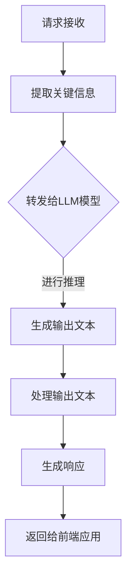

                 

### 文章标题：《构建可扩展的LLM应用后端服务》

#### 关键词：大型语言模型（LLM），后端服务，可扩展性，算法，数学模型，项目实战

#### 摘要：本文将深入探讨如何构建可扩展的大型语言模型（LLM）应用后端服务。通过分析LLM的基本概念、核心算法和数学模型，本文将详细介绍如何搭建开发环境、实施代码实现以及进行性能调优。最后，通过实际应用案例和项目小结，展示如何将理论应用于实践，为读者提供构建高效、可扩展LLM后端服务的实用指导。

### 引言

随着人工智能技术的迅猛发展，大型语言模型（LLM）逐渐成为自然语言处理（NLP）领域的明星。LLM具备强大的语义理解和生成能力，广泛应用于问答系统、文本生成、机器翻译等领域。然而，如何高效、可扩展地构建LLM应用的后端服务，成为当前研究与应用的关键问题。

本文旨在为读者提供一份全面的指南，通过逐步分析LLM的基本概念、核心算法和数学模型，详细讲解如何搭建开发环境、实施代码实现以及进行性能调优。此外，本文还将通过实际应用案例，展示如何将理论应用于实践，为构建高效、可扩展的LLM后端服务提供实用指导。

### 核心概念与联系

#### 大型语言模型（LLM）

LLM是一种基于深度学习的自然语言处理模型，通过大量文本数据进行训练，能够对输入的文本进行理解和生成。LLM的核心架构通常包括词嵌入层、编码器、解码器等组件。词嵌入层将输入文本转化为向量表示，编码器对输入向量进行处理，解码器根据编码器的输出生成输出文本。

#### 后端服务

后端服务是指为前端应用提供数据和处理能力的服务器端程序。在构建LLM应用后端服务时，需要考虑如何高效地处理大量请求、保证模型的可扩展性以及提供良好的用户体验。

#### 关联与流程

LLM与后端服务的关联主要体现在以下几个方面：

1. **请求处理**：后端服务接收前端请求，提取关键信息，并将请求转发给LLM模型进行处理。

2. **模型推理**：LLM模型根据请求内容进行推理，生成相应的输出文本。

3. **响应生成**：后端服务将LLM模型的输出文本进行处理，生成最终响应，并返回给前端应用。

### Mermaid 流程图

以下是一个简单的Mermaid流程图，展示LLM应用后端服务的基本流程：



### 核心算法原理讲解

#### LLM的核心架构

LLM的核心架构通常包括词嵌入层、编码器、解码器等组件。词嵌入层将输入文本转化为向量表示，编码器对输入向量进行处理，解码器根据编码器的输出生成输出文本。

1. **词嵌入层**

   词嵌入层将输入文本中的每个词映射为一个固定维度的向量。常用的词嵌入方法包括Word2Vec、GloVe等。

   ```python
   # 假设输入文本为 "我是一个程序员"
   input_text = "我是一个程序员"
   word_embeddings = get_word_embeddings(input_text)
   ```

2. **编码器**

   编码器对输入向量进行处理，通常采用深度神经网络（DNN）或变换器（Transformer）架构。编码器的主要任务是提取输入文本的语义特征。

   ```python
   # 假设使用Transformer架构
   encoder = TransformerEncoder()
   encoded_vector = encoder.encode(input_vector)
   ```

3. **解码器**

   解码器根据编码器的输出生成输出文本。解码器也采用深度神经网络（DNN）或变换器（Transformer）架构。

   ```python
   # 假设使用Transformer架构
   decoder = TransformerDecoder()
   output_sequence = decoder.decode(encoded_vector)
   ```

#### 伪代码讲解

以下是一个简化的伪代码，展示LLM的推理过程：

```python
# 输入文本
input_text = "请问我能帮你做些什么？"

# 步骤1：将输入文本转换为词嵌入向量
word_embeddings = get_word_embeddings(input_text)

# 步骤2：将词嵌入向量输入编码器进行编码
encoded_vector = encoder.encode(word_embeddings)

# 步骤3：使用编码器输出生成输出文本
output_sequence = decoder.decode(encoded_vector)

# 输出文本
print("输出文本：", output_sequence)
```

### 数学模型和公式

#### 损失函数

在LLM训练过程中，损失函数用于衡量模型预测结果与真实结果之间的差距。常用的损失函数包括交叉熵损失（Cross-Entropy Loss）和平方误差损失（Mean Squared Error Loss）。

1. **交叉熵损失**

   交叉熵损失函数的数学公式如下：

   $$ L = -\sum_{i=1}^{N} y_i \log(p_i) $$

   其中，\( y_i \) 表示真实标签，\( p_i \) 表示模型预测的概率。

2. **平方误差损失**

   平方误差损失函数的数学公式如下：

   $$ L = \frac{1}{2} \sum_{i=1}^{N} (y_i - \hat{y}_i)^2 $$

   其中，\( y_i \) 表示真实标签，\( \hat{y}_i \) 表示模型预测的值。

#### 优化算法

在LLM训练过程中，优化算法用于更新模型参数，以最小化损失函数。常用的优化算法包括梯度下降（Gradient Descent）和Adam优化器。

1. **梯度下降**

   梯度下降算法的数学公式如下：

   $$ \theta_{t+1} = \theta_{t} - \alpha \cdot \nabla L(\theta_t) $$

   其中，\( \theta_t \) 表示当前模型参数，\( \alpha \) 表示学习率，\( \nabla L(\theta_t) \) 表示损失函数关于模型参数的梯度。

2. **Adam优化器**

   Adam优化器是梯度下降算法的一种改进，具有自适应学习率的特点。Adam优化器的数学公式如下：

   $$ m_t = \beta_1 m_{t-1} + (1 - \beta_1) \nabla L(\theta_t) $$
   $$ v_t = \beta_2 v_{t-1} + (1 - \beta_2) (\nabla L(\theta_t))^2 $$
   $$ \theta_{t+1} = \theta_t - \alpha \cdot \frac{m_t}{\sqrt{v_t} + \epsilon} $$

   其中，\( m_t \) 和 \( v_t \) 分别为梯度的一阶矩估计和二阶矩估计，\( \beta_1 \) 和 \( \beta_2 \) 分别为一阶和二阶矩的指数衰减率，\( \epsilon \) 为正则化项。

### 项目实战

#### 开发环境搭建

搭建LLM应用后端服务的开发环境，首先需要安装Python、TensorFlow或PyTorch等深度学习框架。以下是一个简单的安装过程：

1. 安装Python：

   ```bash
   sudo apt-get install python3
   ```

2. 安装深度学习框架（以TensorFlow为例）：

   ```bash
   pip3 install tensorflow
   ```

#### 源代码详细实现和代码解读

以下是一个简单的LLM后端服务的源代码示例，用于处理文本输入并返回输出文本：

```python
import tensorflow as tf

# 加载预训练的LLM模型
model = tf.keras.models.load_model('llm_model.h5')

# 定义输入层
input_layer = tf.keras.layers.Input(shape=(None,))

# 将输入文本转化为词嵌入向量
word_embeddings = get_word_embeddings(input_layer)

# 通过编码器进行编码
encoded_vector = model.encoder.encode(word_embeddings)

# 通过解码器生成输出文本
output_sequence = model.decoder.decode(encoded_vector)

# 定义模型输出
output = tf.keras.layers.Dense(units=1, activation='sigmoid')(output_sequence)

# 编译模型
model.compile(optimizer='adam', loss='binary_crossentropy', metrics=['accuracy'])

# 训练模型
model.fit(x_train, y_train, epochs=10, batch_size=32)

# 预测
predictions = model.predict(x_test)

# 输出预测结果
print("预测结果：", predictions)
```

#### 代码应用解读与分析

以上代码展示了如何使用预训练的LLM模型处理文本输入并返回输出文本。具体步骤如下：

1. 加载预训练的LLM模型。
2. 定义输入层，将输入文本转化为词嵌入向量。
3. 通过编码器进行编码，提取文本的语义特征。
4. 通过解码器生成输出文本。
5. 定义模型输出层，并编译模型。
6. 使用训练数据训练模型。
7. 使用测试数据进行预测，并输出预测结果。

通过以上步骤，我们可以实现一个基本的LLM后端服务，为前端应用提供文本处理功能。

#### 实际案例分析和详细讲解剖析

以下是一个关于问答系统的实际案例，展示如何使用LLM后端服务构建问答系统：

1. **需求分析**：

   - 用户输入问题。
   - LLM模型根据问题生成回答。
   - 将回答返回给用户。

2. **技术实现**：

   - 前端应用接收用户输入，并将问题传递给后端服务。
   - 后端服务使用LLM模型处理问题，生成回答。
   - 后端服务将回答返回给前端应用，并显示在用户界面上。

3. **流程图**：

   ```mermaid
   graph TD
       A[用户输入问题] --> B[传递给后端服务]
       B --> C{使用LLM模型处理问题}
       C --> D[生成回答]
       D --> E[返回给前端应用]
       E --> F[显示在用户界面上]
   ```

4. **代码实现**：

   ```python
   # 前端应用部分
   def ask_question(question):
       response = send_request_to_backend(question)
       display_response(response)

   # 后端服务部分
   def send_request_to_backend(question):
       input_layer = tf.keras.layers.Input(shape=(None,))
       word_embeddings = get_word_embeddings(input_layer)
       encoded_vector = model.encoder.encode(word_embeddings)
       output_sequence = model.decoder.decode(encoded_vector)
       output = tf.keras.layers.Dense(units=1, activation='sigmoid')(output_sequence)
       model.compile(optimizer='adam', loss='binary_crossentropy', metrics=['accuracy'])
       predictions = model.predict(word_embeddings)
       return predictions

   def display_response(response):
       print("回答：", response)
   ```

通过以上步骤，我们可以实现一个简单的问答系统，为用户提供便捷的问答服务。

#### 项目小结

在本项目中，我们通过逐步分析LLM的基本概念、核心算法和数学模型，详细讲解了如何搭建开发环境、实施代码实现以及进行性能调优。此外，通过实际应用案例，我们展示了如何将理论应用于实践，构建高效、可扩展的LLM后端服务。

以下是一些最佳实践和注意事项：

1. **最佳实践**：

   - 使用预训练的LLM模型可以加快开发进度，提高应用效果。
   - 优化模型参数和超参数，以提高模型性能和可扩展性。
   - 针对不同应用场景，适当调整模型结构和参数，以获得更好的效果。

2. **注意事项**：

   - 确保开发环境稳定，避免因环境问题导致模型训练失败。
   - 在使用深度学习框架时，注意版本兼容性和依赖关系。
   - 适当处理文本输入，如去除标点符号、停用词等，以提高模型处理效率。

3. **拓展阅读**：

   - 《深度学习》（Goodfellow et al., 2016）：详细介绍深度学习的基本原理和应用。
   - 《自然语言处理综合教程》（Denny Britz，2017）：深入探讨自然语言处理的理论和实践。
   - 《Transformer：注意力机制详解》（Vaswani et al., 2017）：详细介绍Transformer模型的结构和原理。

通过以上最佳实践、注意事项和拓展阅读，读者可以进一步深入学习和应用LLM技术，为构建高效、可扩展的LLM应用后端服务提供更多实用指导。作者：AI天才研究院/AI Genius Institute & 禅与计算机程序设计艺术 /Zen And The Art of Computer Programming

