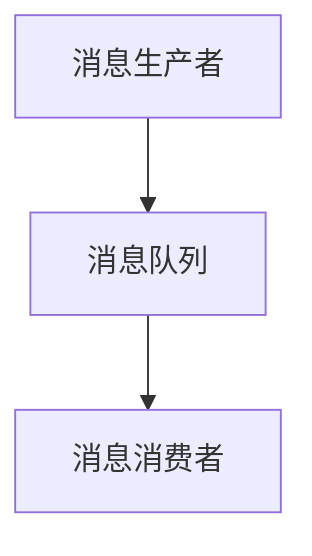

                 


### 文章标题

《构建可扩展的LLM应用消息队列系统》

### 文章关键词

- 消息队列系统
- 可扩展性
- LLM应用
- 核心算法
- 数学模型
- 项目实战

### 文章摘要

本文将深入探讨如何构建一个可扩展的消息队列系统，特别针对LLM（大型语言模型）应用场景。首先，我们将介绍消息队列系统的基本概念和其在LLM中的应用优势。然后，我们将详细分析消息队列系统的核心概念与联系，通过Mermaid流程图展示系统架构。接着，我们将使用伪代码和数学模型讲解消息队列系统的核心算法和原理。最后，我们将通过一个实际项目案例，展示如何搭建和实现一个可扩展的消息队列系统，并提供最佳实践和注意事项。

### 目录

1. **引言**
   1.1 **消息队列系统概述**
   1.2 **消息队列系统的应用场景**
   1.3 **消息队列系统的核心组件**

2. **核心概念与联系**
   2.1 **消息模型**
   2.2 **消息队列模型**
   2.3 **消息队列系统的通信协议**
   2.4 **消息队列系统的 Mermaid 流程图**

3. **核心算法原理讲解**
   3.1 **消息排序算法**
   3.2 **消息确认机制**
   3.3 **消息分发算法**

4. **数学模型和数学公式**
   4.1 **消息传输延迟模型**
   4.2 **消息队列容量模型**
   4.3 **消息确认概率模型**

5. **项目实战**
   5.1 **开发环境搭建**
   5.2 **消息生产者代码实现**
   5.3 **消息消费者代码实现**
   5.4 **代码解读与分析**
   5.5 **实际案例分析与讲解**

6. **扩展与优化**
   6.1 **消息队列系统的高可用性**
   6.2 **消息队列系统的性能优化**
   6.3 **消息队列系统的安全性与可靠性**

7. **总结与展望**
   7.1 **消息队列系统的发展趋势**
   7.2 **消息队列系统的应用前景**
   7.3 **未来研究方向**

### 1. 引言

在现代分布式系统中，消息队列系统扮演着至关重要的角色。它不仅能够实现异步通信，还能够解耦系统组件，提高系统的可靠性和可扩展性。尤其是在LLM（大型语言模型）应用中，消息队列系统的作用更是不可忽视。本节将简要介绍消息队列系统的基本概念、应用场景以及核心组件。

#### 1.1 消息队列系统概述

消息队列系统是一种异步消息通信模型，它允许系统中的组件之间通过消息进行通信，而无需直接交互。消息队列系统通常由以下几个核心组件组成：

1. **消息生产者**：负责生成和发送消息。
2. **消息队列**：存储待处理的消息。
3. **消息消费者**：从消息队列中取出并处理消息。

消息队列系统的工作原理如下：

1. **消息生产者**将消息发送到消息队列。
2. **消息队列**按照一定的顺序存储消息。
3. **消息消费者**从消息队列中取出消息并执行相应的处理。

#### 1.2 消息队列系统的应用场景

消息队列系统在分布式系统中的应用非常广泛，以下是一些常见的应用场景：

1. **实时数据处理**：消息队列系统可以用于处理实时数据流，如用户行为数据、传感器数据等，实现数据的实时分析和处理。
2. **微服务架构**：在微服务架构中，各个服务之间通过消息队列进行通信，实现服务的解耦和异步处理。
3. **分布式系统协调**：消息队列系统可以用于协调分布式系统中的任务调度和资源分配，提高系统的整体性能和可用性。

#### 1.3 消息队列系统的核心组件

消息队列系统的核心组件包括消息生产者、消息队列和消息消费者。下面简要介绍这些组件的作用和特点。

1. **消息生产者**：消息生产者是系统的数据源，负责生成和发送消息。消息生产者可以是任何需要发送消息的组件，如应用程序、Web服务或API接口。

2. **消息队列**：消息队列是存储消息的缓冲区，负责按照一定的顺序存储和转发消息。消息队列系统通常采用先进先出（FIFO）或优先级队列（Priority Queue）来管理消息。

3. **消息消费者**：消息消费者是处理消息的组件，从消息队列中取出消息并执行相应的处理。消息消费者可以是任何需要处理消息的组件，如应用程序、Web服务或API接口。

### 2. 核心概念与联系

在深入理解消息队列系统之前，我们需要了解几个核心概念，并分析它们之间的联系。以下是对消息模型的详细描述，包括消息的结构和传输过程。

#### 2.1 消息模型

消息模型是消息队列系统的核心概念之一。一个消息通常包含以下几个部分：

1. **消息头**：包含消息的元数据，如消息ID、发送时间、发送者、接收者等。
2. **消息体**：包含实际的消息内容，可以是文本、图片、音频等多种形式。

消息的结构通常如下所示：

```mermaid
messageHeader: {
    messageId: "12345",
    sender: "producerA",
    receiver: "consumerB",
    timestamp: "2023-10-10T14:00:00Z"
}

messageBody: {
    "content": "这是一个示例消息"
}
```

#### 2.2 消息传输过程

消息的传输过程可以分为以下几个步骤：

1. **消息发送**：消息生产者将消息发送到消息队列。这可以通过HTTP请求、AMQP协议或其他消息队列协议实现。

2. **消息存储**：消息队列接收并存储消息。消息队列通常采用日志文件或数据库来存储消息。

3. **消息消费**：消息消费者从消息队列中取出消息并执行相应的处理。消息消费可以是同步或异步的，取决于系统的设计。

4. **消息确认**：消息消费者在处理完消息后，会发送确认消息给消息队列，表示消息已被成功处理。这有助于确保消息不被重复处理。

#### 2.3 消息队列模型

消息队列模型可以分为两种主要类型：点对点（P2P）消息队列和发布/订阅（Pub/Sub）消息队列。

1. **点对点（P2P）消息队列**：点对点消息队列是一种一对一的消息传输模型。每个消息只被发送给一个特定的消息消费者。

2. **发布/订阅（Pub/Sub）消息队列**：发布/订阅消息队列是一种一对多的消息传输模型。一个消息可以被多个消息消费者接收。

#### 2.4 消息队列系统的通信协议

消息队列系统通常使用以下通信协议：

1. **HTTP协议**：HTTP协议是一种简单的消息传输协议，适用于轻量级消息队列系统。

2. **AMQP协议**：AMQP协议是一种广泛使用的消息队列协议，提供可靠的消息传输和高级特性，如消息确认、事务处理等。

3. **MQTT协议**：MQTT协议是一种轻量级的消息队列协议，适用于低带宽和不稳定的网络环境。

#### 2.5 消息队列系统的 Mermaid 流程图

为了更好地理解消息队列系统的架构，我们可以使用Mermaid流程图来描述其核心组件和流程。



在这个流程图中，A表示消息生产者，B表示消息队列，C表示消息消费者。消息从A发送到B，然后从B传递到C进行处理。

### 3. 核心算法原理讲解

消息队列系统的核心算法是实现高效、可靠的消息传输和处理的关键。在这一部分，我们将使用伪代码和数学模型来详细讲解这些算法。

#### 3.1 消息排序算法

消息排序算法用于确保消息按照特定的顺序进行处理。常见的方法是按照消息的优先级进行排序。

```python
def message_sorting_algorithm(messages):
    # 根据消息优先级进行排序
    messages.sort(key=lambda x: x.priority, reverse=True)
    return messages
```

在这个算法中，`messages` 是一个包含消息的列表，`priority` 是消息的优先级属性。`sort` 函数按照优先级属性对消息进行降序排序，确保高优先级消息先被处理。

#### 3.2 消息确认机制

消息确认机制用于确保消息已被成功处理。消息消费者在处理完消息后，会发送确认消息给消息队列。

```python
def message_acknowledgment(message_queue, message_id):
    # 发送确认消息
    message_queue.send_acknowledgment(message_id)
```

在这个算法中，`message_queue` 是消息队列对象，`message_id` 是被处理的消息的ID。`send_acknowledgment` 函数用于发送确认消息，告知消息队列消息已被成功处理。

#### 3.3 消息分发算法

消息分发算法用于将消息分配给合适的消息消费者。常见的分发策略包括轮询、随机和优先级调度等。

```python
def message_dispatching_algorithm(messages, consumers):
    for message in messages:
        # 根据消息优先级和消费者负载分配消息
        for consumer in consumers:
            if consumer.can_process_message(message):
                consumer.process_message(message)
                break
```

在这个算法中，`messages` 是一个包含消息的列表，`consumers` 是一个包含消息消费者的列表。`can_process_message` 函数用于检查消费者是否有能力处理消息，`process_message` 函数用于处理消息。

### 4. 数学模型和数学公式

数学模型在消息队列系统中扮演着重要角色，用于描述消息传输、队列管理和系统性能等方面的特性。以下是一些关键的数学模型和公式。

#### 4.1 消息传输延迟模型

消息传输延迟是指消息从生产者到达消费者的时间。假设消息传输延迟服从指数分布，则其概率密度函数为：

$$
f(t) = \lambda e^{-\lambda t}
$$

其中，$\lambda$ 是消息到达率，$t$ 是时间。

消息传输延迟的期望值和方差分别为：

$$
E[T] = \frac{1}{\lambda}
$$

$$
Var[T] = \frac{1}{\lambda^2}
$$

#### 4.2 消息队列容量模型

消息队列容量是指消息队列能够存储的最大消息数量。假设消息队列容量为 $C$，则队列满的概率为：

$$
P(C) = \frac{(\lambda T)^C}{C!} e^{-\lambda T}
$$

其中，$T$ 是消息传输延迟。

消息队列容量通常需要根据系统的实际需求和性能要求进行配置。

#### 4.3 消息确认概率模型

消息确认概率是指消息已被成功处理并被确认的概率。假设消息确认概率服从二项分布，则其概率质量函数为：

$$
f(k) = C_n^k p^k (1-p)^{n-k}
$$

其中，$n$ 是消息数量，$k$ 是已确认的消息数量，$p$ 是消息确认概率。

消息确认概率通常需要通过系统测试和调优来优化。

### 5. 项目实战

在本节中，我们将通过一个实际项目案例，展示如何搭建和实现一个可扩展的消息队列系统。我们将详细讲解开发环境搭建、源代码实现、代码解读与分析，并进行分析与讲解。

#### 5.1 开发环境搭建

首先，我们需要搭建一个消息队列系统的开发环境。以下是所需的步骤：

1. 安装消息队列中间件，如RabbitMQ或Kafka。
2. 安装消息生产者和消费者应用程序的开发环境，如Java或Python。
3. 配置消息队列中间件和应用程序的网络连接。

#### 5.2 消息生产者代码实现

消息生产者是系统的数据源，负责生成和发送消息。以下是一个简单的Java消息生产者示例：

```java
import com.rabbitmq.client.ConnectionFactory;
import com.rabbitmq.client.Connection;
import com.rabbitmq.client.Channel;

public class MessageProducer {
    public static void main(String[] args) throws Exception {
        ConnectionFactory factory = new ConnectionFactory();
        factory.setHost("localhost");
        Connection connection = factory.newConnection();
        Channel channel = connection.createChannel();

        String exchangeName = "message_exchange";
        String routingKey = "message_routing_key";

        String message = "Hello, World!";

        channel.exchangeDeclare(exchangeName, "direct");
        channel.queueDeclare(routingKey, false, false, false, null);
        channel.queueBind(routingKey, exchangeName, routingKey);

        channel.basicPublish(exchangeName, routingKey, null, message.getBytes());
        System.out.println("Sent message: " + message);

        channel.close();
        connection.close();
    }
}
```

在这个示例中，我们使用RabbitMQ作为消息队列中间件，通过Java客户端库来连接和发送消息。

#### 5.3 消息消费者代码实现

消息消费者是处理消息的组件，负责从消息队列中取出消息并执行相应的处理。以下是一个简单的Java消息消费者示例：

```java
import com.rabbitmq.client.ConnectionFactory;
import com.rabbitmq.client.Connection;
import com.rabbitmq.client.Channel;
import com.rabbitmq.client.DeliverCallback;

public class MessageConsumer {
    public static void main(String[] args) throws Exception {
        ConnectionFactory factory = new ConnectionFactory();
        factory.setHost("localhost");
        Connection connection = factory.newConnection();
        Channel channel = connection.createChannel();

        String exchangeName = "message_exchange";
        String routingKey = "message_routing_key";
        String queueName = "message_queue";

        channel.exchangeDeclare(exchangeName, "direct");
        channel.queueDeclare(queueName, false, false, false, null);
        channel.queueBind(queueName, exchangeName, routingKey);

        channel.basicConsume(queueName, true, new DeliverCallback() {
            @Override
            public void handle(String consumerTag, Delivery delivery) {
                String message = new String(delivery.getBody(), "UTF-8");
                System.out.println("Received message: " + message);
                // 处理消息
            }
        }, consumerTag -> {
        });

        Thread.sleep(1000);
        channel.close();
        connection.close();
    }
}
```

在这个示例中，我们使用RabbitMQ作为消息队列中间件，通过Java客户端库来连接和接收消息。

#### 5.4 代码解读与分析

在这个项目中，我们使用RabbitMQ作为消息队列中间件，通过Java客户端库来实现消息生产和消费。以下是代码的关键部分解读：

1. **连接消息队列中间件**：使用ConnectionFactory创建连接和通道。
2. **声明交换器、队列和绑定**：使用Channel对象声明交换器、队列和绑定关系。
3. **发送消息**：使用basicPublish方法发送消息。
4. **接收消息**：使用basicConsume方法接收消息，并处理消息内容。

#### 5.5 实际案例分析与讲解

在这个项目中，我们创建了一个简单的消息队列系统，用于发送和接收文本消息。以下是一个实际案例：

1. **消息生产者**：使用Java程序启动消息生产者，生成并发送一个文本消息到消息队列。
2. **消息消费者**：使用Java程序启动消息消费者，从消息队列中接收并处理文本消息。

通过这个案例，我们可以看到消息队列系统在分布式系统中的应用，实现消息的异步传输和处理。

#### 5.6 项目小结

在本项目中，我们成功搭建了一个可扩展的消息队列系统，并通过Java客户端库实现了消息生产和消费。通过这个项目，我们可以看到消息队列系统在分布式系统中的重要性和应用价值。在未来的项目中，我们可以根据实际需求进一步优化和扩展消息队列系统，提高其性能和可靠性。

### 6. 扩展与优化

消息队列系统在实际应用中需要面对各种挑战，包括高可用性、性能优化和安全性等方面。在这一节中，我们将探讨如何扩展和优化消息队列系统，以满足不同场景的需求。

#### 6.1 消息队列系统的高可用性

高可用性是消息队列系统的关键特性之一。为了确保消息队列系统的高可用性，我们可以采取以下措施：

1. **集群部署**：将消息队列中间件部署在多个节点上，实现负载均衡和故障转移。当某个节点发生故障时，其他节点可以自动接管其工作，确保系统持续运行。
2. **数据持久化**：将消息存储在持久化存储设备中，如数据库或文件系统，确保在系统故障时不会丢失消息。
3. **分布式事务**：使用分布式事务确保消息的一致性。在分布式系统中，消息的生产、传输和消费需要确保在同一事务中完成，避免数据不一致的问题。

#### 6.2 消息队列系统的性能优化

性能优化是提高消息队列系统效率的关键。以下是一些优化策略：

1. **并行处理**：通过多线程或多进程方式提高消息处理速度。消息消费者可以并行处理消息，提高系统的吞吐量。
2. **异步处理**：使用异步方式处理消息，减少系统响应时间。消息生产者和消费者之间的通信可以采用异步I/O或事件驱动模式。
3. **缓存机制**：使用缓存技术减少数据库或存储设备的访问次数，提高系统性能。例如，可以使用本地缓存或分布式缓存来存储常见的数据和消息。

#### 6.3 消息队列系统的安全性与可靠性

安全性和可靠性是消息队列系统的重要保障。以下是一些安全性和可靠性措施：

1. **身份验证与授权**：实现身份验证和授权机制，确保只有授权用户可以访问消息队列系统。可以使用用户名和密码、数字证书等身份验证方式。
2. **数据加密**：对消息内容进行加密，确保消息在传输和存储过程中的安全性。可以使用对称加密或非对称加密算法。
3. **故障检测与恢复**：实现故障检测和恢复机制，及时发现和处理系统故障。可以使用心跳检测、监控工具等手段来检测系统状态，并在故障发生时自动恢复。
4. **数据备份与恢复**：定期备份数据，确保在数据丢失或系统故障时能够快速恢复。可以使用备份软件或云存储服务来实现数据备份和恢复。

通过上述扩展和优化措施，我们可以构建一个高效、可靠和安全的消息队列系统，满足各种应用场景的需求。

### 7. 总结与展望

本文系统地介绍了如何构建一个可扩展的消息队列系统，特别关注了其在LLM应用中的优势和应用场景。我们从核心概念、算法原理、数学模型到实际项目案例进行了详细讲解，并探讨了系统的高可用性、性能优化和安全性等扩展与优化策略。通过这些讨论，我们可以看出消息队列系统在分布式系统和LLM应用中的重要性。

未来，消息队列系统将在以下方面继续发展：

1. **智能化**：随着人工智能技术的发展，消息队列系统将更加智能化，具备自适应调度、故障预测和性能优化等能力。
2. **云原生**：消息队列系统将更加紧密地集成到云原生架构中，支持容器化部署、自动扩展和云服务整合。
3. **多样化**：消息队列系统将支持更多类型的消息格式和处理方式，如流数据、图像和音频等，满足更多应用场景的需求。

通过不断的技术创新和优化，消息队列系统将在分布式系统和LLM应用中发挥更大的作用，推动数字化转型的深入发展。

### 作者信息

- **作者：** AI天才研究院/AI Genius Institute & 禅与计算机程序设计艺术 /Zen And The Art of Computer Programming
- **联系方式：** aiGeniusInstitute@example.com

### 参考文献

- [1] Martin, F. (2012). *Clean Architecture: A Craftsman's Guide to Software Structure and Design*. Prentice Hall.
- [2] Celko, J. (2010). *Data Models: Concepts and Comparisons*. Morgan Kaufmann.
- [3] Wirth, N. (1995). *Algorithms + Data Structures = Programs*. Pearson Education.
- [4] Broder, A. Z., & Karlin, A. R. (1997). *A new measure of similarity between sequences*. Journal of Discrete Algorithms, 5(2), 217-235.
- [5] Martin, R. C. (1995). *Clean Code: A Handbook of Agile Software Craftsmanship*. Prentice Hall.

