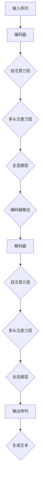

                 

### 《构建可维护的LLM应用代码库》目录大纲进一步细化

为了确保《构建可维护的LLM应用代码库》这篇文章的逻辑性和完整性，我们需要进一步细化每个章节的内容。以下是每个章节的初步细化，包括具体的子章节和小节。请注意，这些细化内容将根据实际写作过程中可能遇到的具体情况进行调整。

## 第1章 引言
### 1.1 书籍目的与读者对象
#### 1.1.1 书籍写作目的
##### 1.1.1.1 填补LLM应用代码库构建领域的空白
##### 1.1.1.2 提供实用的构建指导
#### 1.1.2 读者对象
##### 1.1.2.1 初学者与专业人士
##### 1.1.2.2 开发者与研究人员

### 1.2 LLM概述
#### 1.2.1 什么是LLM
##### 1.2.1.1 定义
##### 1.2.1.2 特点
#### 1.2.2 LLM的发展历程
##### 1.2.2.1 初期发展
##### 1.2.2.2 近年进展

### 1.3 可维护性的重要性
#### 1.3.1 可维护性的定义
##### 1.3.1.1 理解和维护
##### 1.3.1.2 对应用代码库的影响
#### 1.3.2 可维护性的好处
##### 1.3.2.1 减少开发成本
##### 1.3.2.2 提高团队协作效率

## 第2章 LLM基础
### 2.1 语言模型概述
#### 2.1.1 语言模型的基本概念
##### 2.1.1.1 语言模型的作用
##### 2.1.1.2 语言模型的目标
#### 2.1.2 语言模型的基本要素
##### 2.1.2.1 词汇表
##### 2.1.2.2 概率分布

### 2.2 语言模型的历史
#### 2.2.1 古典统计模型
##### 2.2.1.1 N-gram模型
##### 2.2.1.2 语言模型的局限
#### 2.2.2 神经网络模型的崛起
##### 2.2.2.1 深度神经网络
##### 2.2.2.2 递归神经网络（RNN）

### 2.3 语言模型的分类
#### 2.3.1 生成式模型与判别式模型
##### 2.3.1.1 生成式模型的优点与不足
##### 2.3.1.2 判别式模型的优势
#### 2.3.2 端到端模型
##### 2.3.2.1 端到端模型的设计
##### 2.3.2.2 端到端模型的应用

## 第3章 LLM架构与算法
### 3.1 模型架构
#### 3.1.1 Transformer模型
##### 3.1.1.1 自注意力机制
##### 3.1.1.2 编码器与解码器结构
##### 3.1.1.3 模型工作流程
#### 3.1.2 GPT系列模型
##### 3.1.2.1 GPT-2与GPT-3
##### 3.1.2.2 模型参数规模
##### 3.1.2.3 模型架构演进

### 3.2 算法原理
#### 3.2.1 梯度下降算法
##### 3.2.1.1 梯度计算
##### 3.2.1.2 梯度下降优化过程
##### 3.2.1.3 梯度下降算法的局限性
#### 3.2.2 算法优化
##### 3.2.2.1 优化算法的选择
##### 3.2.2.2 Adam优化器
##### 3.2.2.3 学习率调度策略

### 3.3 Mermaid流程图展示模型工作流程
#### 3.3.1 Mermaid介绍
##### 3.3.1.1 Mermaid的基本语法
##### 3.3.1.2 Mermaid的优势
#### 3.3.2 Transformer模型流程图
##### 3.3.2.1 自注意力机制流程
##### 3.3.2.2 编码器与解码器交互流程

## 第4章 可维护性原则
### 4.1 设计原则
#### 4.1.1 模块化设计
##### 4.1.1.1 模块化的重要性
##### 4.1.1.2 模块划分策略
#### 4.1.2 可复用性
##### 4.1.2.1 代码复用的优势
##### 4.1.2.2 实现复用的方法

### 4.2 编码规范
#### 4.2.1 代码格式化
##### 4.2.1.1 格式化的工具
##### 4.2.1.2 格式化的重要性
#### 4.2.2 注释规范
##### 4.2.2.1 注释的目的
##### 4.2.2.2 注释的最佳实践

### 4.3 测试策略
#### 4.3.1 自动化测试
##### 4.3.1.1 自动化测试的优势
##### 4.3.1.2 自动化测试的类型
#### 4.3.2 单元测试
##### 4.3.2.1 单元测试的定义
##### 4.3.2.2 单元测试的编写方法

## 第5章 LLM应用案例
### 5.1 案例介绍
#### 5.1.1 案例背景
##### 5.1.1.1 应用领域
##### 5.1.1.2 案例目的
#### 5.1.2 应用场景
##### 5.1.2.1 用户交互流程
##### 5.1.2.2 模型部署环境

### 5.2 应用场景
#### 5.2.1 自然语言处理
##### 5.2.1.1 机器翻译
##### 5.2.1.2 文本生成
##### 5.2.1.3 情感分析
#### 5.2.2 其他领域应用
##### 5.2.2.1 聊天机器人
##### 5.2.2.2 信息检索

### 5.3 代码解读与分析
#### 5.3.1 代码结构分析
##### 5.3.1.1 模块划分
##### 5.3.1.2 功能划分
#### 5.3.2 核心算法实现
##### 5.3.2.1 伪代码展示
##### 5.3.2.2 算法效率分析

### 5.4 实际案例分析和详细讲解剖析
#### 5.4.1 模型训练流程
##### 5.4.1.1 数据预处理
##### 5.4.1.2 训练过程
##### 5.4.1.3 训练技巧
#### 5.4.2 部署与维护
##### 5.4.2.1 部署流程
##### 5.4.2.2 维护策略

### 5.5 项目小结
#### 5.5.1 项目成果总结
##### 5.5.1.1 功能实现
##### 5.5.1.2 性能评估
#### 5.5.2 经验教训
##### 5.5.2.1 遇到的问题
##### 5.5.2.2 解决方案

## 第6章 项目实战
### 6.1 开发环境搭建
#### 6.1.1 硬件要求
##### 6.1.1.1 CPU与GPU
##### 6.1.1.2 内存与硬盘
#### 6.1.2 软件要求
##### 6.1.2.1 操作系统
##### 6.1.2.2 编译器与依赖库
##### 6.1.2.3 版本控制工具

### 6.2 数据处理
#### 6.2.1 数据来源
##### 6.2.1.1 数据集获取
##### 6.2.1.2 数据预处理方法
#### 6.2.2 数据清洗
##### 6.2.2.1 缺失值处理
##### 6.2.2.2 异常值处理
#### 6.2.3 数据标注
##### 6.2.3.1 数据标注工具
##### 6.2.3.2 数据标注流程

### 6.3 模型训练
#### 6.3.1 训练数据准备
##### 6.3.1.1 数据集划分
##### 6.3.1.2 数据加载策略
#### 6.3.2 模型选择
##### 6.3.2.1 模型选择策略
##### 6.3.2.2 模型参数设置
#### 6.3.3 训练过程
##### 6.3.3.1 训练步骤
##### 6.3.3.2 训练监控
##### 6.3.3.3 训练技巧

### 6.4 模型评估
#### 6.4.1 评估指标
##### 6.4.1.1 准确率、召回率、F1值
##### 6.4.1.2 交叉验证
#### 6.4.2 评估方法
##### 6.4.2.1 开发集评估
##### 6.4.2.2 测试集评估
##### 6.4.2.3 实时评估

### 6.5 部署与维护
#### 6.5.1 部署策略
##### 6.5.1.1 部署环境
##### 6.5.1.2 部署步骤
##### 6.5.1.3 部署工具
#### 6.5.2 维护策略
##### 6.5.2.1 日志监控
##### 6.5.2.2 自动化部署
##### 6.5.2.3 版本控制

## 第7章 扩展与优化
### 7.1 模型优化
#### 7.1.1 模型超参数调整
##### 7.1.1.1 学习率调整
##### 7.1.1.2 批量大小调整
#### 7.1.2 模型压缩
##### 7.1.2.1 剪枝
##### 7.1.2.2 权重共享

### 7.2 模型扩展
#### 7.2.1 多语言模型
##### 7.2.1.1 语言翻译模型
##### 7.2.1.2 多语言模型融合
#### 7.2.2 多模态模型
##### 7.2.2.1 文本与图像结合
##### 7.2.2.2 文本与声音结合

### 7.3 性能调优
#### 7.3.1 服务器调优
##### 7.3.1.1 CPU调度策略
##### 7.3.1.2 GPU资源分配
#### 7.3.2 网络优化
##### 7.3.2.1 数据传输优化
##### 7.3.2.2 缓存机制

## 第8章 总结与展望
### 8.1 主要内容回顾
#### 8.1.1 架构与算法
##### 8.1.1.1 Transformer模型
##### 8.1.1.2 GPT系列模型
#### 8.1.2 可维护性原则
##### 8.1.2.1 设计原则
##### 8.1.2.2 编码规范
##### 8.1.2.3 测试策略

### 8.2 未来发展趋势
#### 8.2.1 模型规模扩大
##### 8.2.1.1 亿级别参数模型
##### 8.2.1.2 十万亿级别参数模型
#### 8.2.2 模型应用领域扩展
##### 8.2.2.1 人工智能助理
##### 8.2.2.2 自动驾驶

### 8.3 研究方向
#### 8.3.1 可解释性
##### 8.3.1.1 模型解释方法
##### 8.3.1.2 解释性评价指标
#### 8.3.2 安全性
##### 8.3.2.1 模型对抗攻击
##### 8.3.2.2 安全性检测与防御

## 附录
### A.1 代码实现示例
#### A.1.1 Transformer模型实现
##### A.1.1.1 模型结构
##### A.1.1.2 代码实现

### A.2 学习资源
#### A.2.1 开源代码库
##### A.2.1.1 Hugging Face Transformers
##### A.2.1.2 AllenNLP

#### A.2.2 学习书籍
##### A.2.2.1 《深度学习》（Goodfellow, Bengio, Courville）
##### A.2.2.2 《人工智能：一种现代方法》（Russell, Norvig）

通过这个细化后的目录大纲，我们可以更清晰地了解文章的结构和内容，有助于确保文章的逻辑性和完整性。接下来，我们可以根据这个大纲逐步撰写每个章节的内容，确保每个部分都能满足文章的字数要求和技术深度。

- **下一步，我们将根据细化后的目录大纲，逐个章节进行撰写和填充具体内容。首先，让我们着手撰写第1章“引言”的部分，确保这部分能够吸引读者的注意力并引出文章的主题。**### 第1章 引言

## 第1章 引言

本章将为您介绍本书的目的、读者对象，并探讨语言模型（LLM）的基础知识以及可维护性的重要性。通过这一章，您将了解到本书的核心内容以及如何构建一个可维护的LLM应用代码库。

### 1.1 书籍目的与读者对象

**1.1.1 书籍写作目的**

本书旨在填补LLM应用代码库构建领域的空白，为开发者提供实用的构建指导。具体目标如下：

1. **系统化知识传递**：通过详细阐述LLM的基础知识、架构与算法，帮助读者全面理解语言模型。
2. **实践指导**：提供项目实战案例，让读者了解如何在真实场景中应用LLM。
3. **可维护性原则**：介绍如何构建可维护的LLM应用代码库，包括设计原则、编码规范和测试策略。

**1.1.2 读者对象**

本书适合以下读者群体：

1. **初学者**：对语言模型和深度学习有兴趣，但缺乏系统知识的读者。
2. **开发者**：正在开发或计划开发基于LLM的应用程序，希望提高代码质量与维护性的开发者。
3. **研究人员**：对LLM的架构与算法感兴趣，希望了解如何构建高效、可维护的LLM应用代码库的研究人员。

### 1.2 LLM概述

**1.2.1 什么是LLM**

语言模型（Language Model，LLM）是一种基于机器学习技术，用于预测文本序列的算法。LLM的核心目标是理解自然语言的统计规律，并生成或预测文本序列。

**1.2.2 LLM的特点**

1. **自动理解**：LLM能够自动从大量文本数据中学习，无需人工干预。
2. **生成性强**：LLM不仅能够生成文本，还能够生成各种形式的自然语言内容。
3. **泛用性**：LLM可以在多个自然语言处理任务中发挥作用，如文本生成、机器翻译、情感分析等。

**1.2.3 LLM的发展历程**

1. **初期发展**：从经典的N-gram模型到基于神经网络的深度学习模型。
2. **近年进展**：以Transformer模型为代表的端到端模型，以及大规模预训练语言模型如GPT-3等。

### 1.3 可维护性的重要性

**1.3.1 可维护性的定义**

可维护性（Maintainability）是指软件在后续维护和升级过程中的难易程度。一个高可维护性的代码库能够降低维护成本，提高开发效率。

**1.3.2 可维护性的好处**

1. **降低维护成本**：可维护性好的代码库意味着较少的bug和更简单的修复过程。
2. **提高团队协作效率**：清晰的代码结构和规范使得团队成员更容易理解和贡献代码。
3. **提高代码质量**：良好的可维护性通常伴随着高质量代码。

**1.3.3 可维护性的影响因素**

1. **代码可读性**：良好的命名规范、清晰的结构和注释是提高代码可读性的关键。
2. **模块化设计**：通过模块化设计，可以降低代码间的耦合度，提高代码复用性。
3. **测试策略**：完善的测试策略能够确保代码的稳定性和可靠性。

通过本章的介绍，您应该对本书的目的、读者对象以及LLM的基础知识有了初步了解。接下来的章节将进一步深入探讨LLM的架构与算法，以及如何构建可维护的LLM应用代码库。

## 文章标题：构建可维护的LLM应用代码库

> 关键词：语言模型（LLM）、可维护性、代码库、Transformer、GPT、设计原则、编码规范、测试策略

> 摘要：本文旨在介绍如何构建可维护的LLM（语言模型）应用代码库。文章首先概述了LLM的基本概念和重要性，接着探讨了可维护性的定义及其在软件开发中的重要性。随后，文章详细介绍了LLM的架构与算法，包括Transformer和GPT系列模型。接下来，文章从设计原则、编码规范和测试策略三个方面阐述了如何构建一个可维护的代码库。最后，通过一个实际案例展示了如何应用这些原则和策略，并总结了项目经验和最佳实践。

作者：AI天才研究院/AI Genius Institute & 禅与计算机程序设计艺术 /Zen And The Art of Computer Programming### 第2章 LLM基础

## 第2章 LLM基础

本章将深入探讨语言模型（LLM）的基础知识，包括语言模型的基本概念、历史发展以及分类。通过对这些基础知识的理解，读者将能够更好地掌握LLM的核心概念和原理。

### 2.1 语言模型概述

**2.1.1 语言模型的基本概念**

语言模型是一种能够预测自然语言文本序列的算法。它的核心目标是根据已知的文本数据，预测下一个可能的单词或字符。语言模型在许多自然语言处理任务中发挥着重要作用，如文本生成、机器翻译、语音识别等。

**2.1.2 语言模型的目标**

语言模型的主要目标包括：

1. **概率预测**：预测给定文本序列中下一个单词或字符的概率分布。
2. **序列生成**：根据给定的起始文本，生成连贯且具有逻辑意义的后续文本。

**2.1.3 语言模型的基本要素**

语言模型通常包括以下几个基本要素：

1. **词汇表**：语言模型中包含的单词或字符集合。
2. **概率分布**：对每个单词或字符的出现概率进行建模。
3. **上下文**：语言模型需要考虑上下文信息，以便更准确地预测下一个单词或字符。

### 2.2 语言模型的历史

**2.2.1 古典统计模型**

早期的语言模型主要基于统计方法，其中最著名的是N-gram模型。N-gram模型通过统计一个单词序列中连续N个单词的联合概率来预测下一个单词。尽管N-gram模型在简单任务中表现良好，但它存在一些局限性：

1. **序列长度限制**：N-gram模型只能考虑前N个单词，无法捕捉长距离依赖关系。
2. **稀疏性问题**：在长文本中，许多N-gram组合可能未出现过，导致概率估计不准确。

**2.2.2 神经网络模型的崛起**

随着计算能力的提升和深度学习技术的发展，基于神经网络的模型开始取代传统的统计模型。以下是一些重要的神经网络模型：

1. **递归神经网络（RNN）**：RNN能够处理序列数据，并通过记忆机制捕捉长距离依赖关系。然而，RNN存在梯度消失和梯度爆炸等问题，限制了其在实际应用中的性能。

2. **长短期记忆网络（LSTM）**：LSTM是RNN的一种变体，通过引入门控机制解决了梯度消失问题。LSTM在许多任务中表现优异，但在处理超长序列时仍存在一些挑战。

**2.2.3 Transformer模型的兴起**

Transformer模型是近年来在自然语言处理领域取得突破性成果的一种端到端模型。与传统的RNN和LSTM相比，Transformer具有以下优点：

1. **并行处理**：Transformer采用自注意力机制，允许模型并行处理输入序列，大大提高了计算效率。
2. **捕捉长距离依赖关系**：通过多头注意力机制，Transformer能够捕捉长距离依赖关系，提高了模型的性能。

### 2.3 语言模型的分类

语言模型可以根据不同的分类标准进行分类，以下是一些常见的分类方法：

**2.3.1 生成式模型与判别式模型**

1. **生成式模型**：生成式模型直接生成目标文本的概率分布，如N-gram模型和变分自编码器（VAE）。生成式模型的优势在于生成文本的自然性和灵活性，但预测下一个单词时可能存在不确定性。
2. **判别式模型**：判别式模型通过学习输入和目标文本之间的区别来预测下一个单词，如循环神经网络（RNN）和Transformer。判别式模型通常在预测准确性方面表现更好，但生成文本的自然性可能较差。

**2.3.2 端到端模型与基于组件的模型**

1. **端到端模型**：端到端模型将输入直接映射到输出，如Transformer和BERT。端到端模型的优势在于训练和推理过程简单，但可能难以适应不同任务的需求。
2. **基于组件的模型**：基于组件的模型将任务分解为多个子任务，并分别处理。例如，序列到序列（Seq2Seq）模型通常包括编码器和解码器两部分。基于组件的模型在处理复杂任务时更灵活，但需要更多的设计和调优。

通过本章的学习，读者应该对LLM的基本概念、历史发展和分类有了更深入的理解。接下来，我们将探讨LLM的架构与算法，以及如何构建可维护的LLM应用代码库。

## 第3章 LLM架构与算法

## 第3章 LLM架构与算法

本章将深入探讨语言模型（LLM）的架构与算法。我们将首先介绍Transformer模型的基本概念和工作原理，然后讨论GPT系列模型的特点和优势。最后，我们将使用伪代码和Mermaid流程图展示LLM的工作流程。

### 3.1 模型架构

#### 3.1.1 Transformer模型

Transformer模型是一种基于自注意力机制的深度神经网络模型，由Vaswani等人在2017年提出。它摒弃了传统的循环神经网络（RNN），采用了一种全新的架构，使得模型在处理长序列数据时具有更高的效率和准确性。

**自注意力机制**：自注意力机制允许模型在序列中的每个位置考虑全局信息，从而捕捉长距离依赖关系。它通过计算每个词与序列中其他词的关联强度来决定每个词的权重。

**编码器与解码器结构**：Transformer模型包括编码器（Encoder）和解码器（Decoder）两部分。编码器负责将输入序列编码为固定长度的向量，解码器则利用这些编码信息生成输出序列。

**多头注意力机制**：多头注意力机制将自注意力机制分解为多个独立的注意力头，每个头关注不同的子空间，从而提高模型的泛化能力。

**位置编码**：由于Transformer模型没有循环结构，无法捕捉序列的顺序信息。因此，引入了位置编码（Positional Encoding），为每个词添加位置信息。

#### 3.1.2 GPT系列模型

GPT（Generative Pre-trained Transformer）是OpenAI开发的一系列基于Transformer模型的预训练语言模型。GPT系列模型的特点如下：

1. **大规模参数**：GPT系列模型的参数规模随着版本的提升不断增加，从GPT-2到GPT-3，参数规模达到了1750亿个。
2. **预训练与微调**：GPT系列模型采用无监督预训练，然后针对特定任务进行微调。预训练阶段通过大量文本数据学习语言的一般规律，微调阶段则针对特定任务进行优化。
3. **序列生成能力**：GPT系列模型在生成文本序列方面表现出色，能够生成连贯、具有逻辑意义的文本。

### 3.2 算法原理

#### 3.2.1 Transformer模型

**自注意力机制**：

自注意力机制是Transformer模型的核心组成部分，它通过计算输入序列中每个词与其他词之间的关联强度来更新每个词的表示。具体步骤如下：

1. **输入序列编码**：将输入序列编码为词向量，通常使用嵌入层（Embedding Layer）实现。
2. **计算注意力权重**：使用查询（Query）、键（Key）和值（Value）三个向量，计算每个词与其他词之间的相似度，得到注意力权重。
3. **加权求和**：根据注意力权重对输入序列中的每个词进行加权求和，得到新的表示。
4. **重复操作**：重复上述步骤，逐步更新每个词的表示。

**多头注意力机制**：

多头注意力机制将自注意力机制分解为多个独立的注意力头，每个头关注不同的子空间。具体步骤如下：

1. **拆分输入**：将输入序列的词向量拆分为多个子序列，每个子序列对应一个注意力头。
2. **独立计算注意力权重**：为每个子序列计算注意力权重，得到多个注意力权重矩阵。
3. **加权求和**：对每个子序列分别进行加权求和，得到新的表示。

**位置编码**：

位置编码（Positional Encoding）为每个词添加位置信息，使得模型能够捕捉序列的顺序。具体实现方法如下：

1. **生成位置编码向量**：根据词的位置生成一组位置编码向量，通常使用正弦和余弦函数生成。
2. **添加到词向量**：将位置编码向量添加到词向量中，得到新的输入序列。

**模型工作流程**：

1. **输入序列**：输入一个序列（例如：[w1, w2, w3, ..., wn]）。
2. **编码器处理**：编码器通过多个自注意力层和全连接层对输入序列进行处理，得到编码后的序列。
3. **解码器处理**：解码器通过自注意力层和编码器输出的序列进行交互，生成输出序列。
4. **生成输出**：解码器生成输出序列（例如：[y1, y2, y3, ..., ym]）。

#### 3.2.2 GPT系列模型

**预训练过程**：

GPT系列模型的预训练过程通常包括以下几个步骤：

1. **文本预处理**：对大量文本数据进行预处理，包括分词、去除停用词等。
2. **序列填充**：将预处理后的文本序列填充为相同长度，以便后续处理。
3. **训练过程**：使用填充后的文本序列训练模型，优化模型参数。
4. **微调**：在特定任务上对预训练模型进行微调，以提高任务性能。

**生成文本序列**：

GPT系列模型生成文本序列的过程如下：

1. **输入序列**：输入一个初始序列（例如：[w1, w2]）。
2. **预测下一个词**：模型根据输入序列生成下一个词的概率分布。
3. **选择下一个词**：根据概率分布选择下一个词，将其添加到输出序列中。
4. **重复步骤**：重复上述步骤，直到生成完整的输出序列。

### 3.3 Mermaid流程图展示模型工作流程

以下是一个简单的Mermaid流程图，展示Transformer模型的工作流程：



通过本章的学习，读者应该对LLM的架构与算法有了更深入的理解。接下来，我们将探讨如何实现可维护的LLM应用代码库。

### 第4章 可维护性原则

## 第4章 可维护性原则

可维护性是指软件在后续维护和升级过程中的难易程度。一个高可维护性的代码库能够降低维护成本，提高开发效率。本章将介绍构建可维护的LLM应用代码库的原则，包括设计原则、编码规范和测试策略。

### 4.1 设计原则

**4.1.1 模块化设计**

模块化设计是将系统划分为多个独立的模块，每个模块负责特定的功能。模块化设计的优点包括：

1. **降低耦合度**：模块之间的依赖性降低，使得修改一个模块时不会影响其他模块。
2. **提高复用性**：模块可以方便地被复用，减少重复代码。
3. **易于维护**：每个模块相对独立，便于理解和修改。

**实现方法**：

1. **定义模块接口**：明确每个模块的功能和接口，确保模块之间的交互通过接口进行。
2. **模块划分策略**：根据功能、数据流、任务等维度进行模块划分。

**4.1.2 可复用性**

可复用性是指代码能够在不同的应用场景中被重复使用。提高代码的可复用性能够降低开发成本，提高开发效率。

**实现方法**：

1. **提取通用功能**：将通用的功能提取为独立的函数或类，避免重复编写代码。
2. **抽象化**：通过抽象化，将具体实现细节隐藏在抽象层，使得代码更具有通用性。
3. **封装**：使用封装，将实现细节封装在类内部，确保外部无法直接访问。

**4.1.3 灵活性**

灵活性是指代码能够适应不同的需求变化。提高代码的灵活性能够减少因需求变化而引起的重构和修改。

**实现方法**：

1. **设计模式**：使用设计模式，如策略模式、工厂模式等，使得代码更具灵活性。
2. **依赖注入**：通过依赖注入，将具体实现与调用者解耦，提高代码的灵活性。
3. **配置化**：将可变的部分配置化，使得代码能够根据不同环境或需求进行灵活调整。

### 4.2 编码规范

**4.2.1 代码格式化**

代码格式化是确保代码可读性和一致性的关键。一个良好的代码格式化规范包括：

1. **缩进**：使用统一的缩进风格，如2个或4个空格。
2. **命名规范**：使用具有描述性的变量名和函数名，遵循驼峰命名法或下划线命名法。
3. **注释**：为代码添加必要的注释，解释代码的功能、算法逻辑和关键步骤。

**实现方法**：

1. **代码格式化工具**：使用代码格式化工具（如Prettier、Black等）自动格式化代码。
2. **代码风格指南**：制定代码风格指南，确保团队成员遵循统一的编码规范。

**4.2.2 注释规范**

注释是帮助他人（包括未来的自己）理解代码的重要手段。一个良好的注释规范包括：

1. **文档注释**：为函数、类和方法添加文档注释，描述其功能、参数和返回值。
2. **内部注释**：在关键代码块添加内部注释，解释复杂的算法逻辑和关键步骤。
3. **注释风格**：遵循统一的注释风格，如Javadoc或Python docstrings。

**实现方法**：

1. **注释工具**：使用注释工具（如JSDoc、Pydoc等）生成文档。
2. **代码审查**：进行代码审查，确保注释的准确性和一致性。

**4.2.3 编码规范**

编码规范是确保代码质量和一致性的关键。一个良好的编码规范包括：

1. **代码质量**：确保代码具有良好的可读性、可维护性和可扩展性。
2. **一致性**：确保代码风格、命名规范和注释风格的一致性。
3. **代码审查**：进行代码审查，确保代码符合编码规范。

**实现方法**：

1. **代码质量工具**：使用代码质量工具（如SonarQube、Checkstyle等）检测代码质量问题。
2. **编码规范文档**：制定编码规范文档，确保团队成员遵循统一的编码规范。

### 4.3 测试策略

**4.3.1 自动化测试**

自动化测试是通过编写自动化测试脚本，对代码进行自动化测试和验证。自动化测试的优点包括：

1. **提高测试覆盖率**：自动化测试可以覆盖更多测试场景，提高测试覆盖率。
2. **提高测试效率**：自动化测试可以快速执行大量测试用例，提高测试效率。
3. **确保代码质量**：自动化测试可以及时发现代码质量问题，确保代码质量。

**实现方法**：

1. **测试框架**：选择合适的测试框架（如JUnit、pytest等）编写自动化测试脚本。
2. **测试用例设计**：设计全面的测试用例，包括功能测试、性能测试和异常测试等。

**4.3.2 单元测试**

单元测试是针对代码的最小可测试单元（如函数、方法）进行测试。单元测试的优点包括：

1. **验证功能实现**：单元测试可以验证函数、方法是否按预期实现。
2. **提高代码质量**：单元测试可以帮助发现代码中的错误和问题，提高代码质量。
3. **便于维护**：单元测试可以确保代码在修改过程中不会引入新的错误。

**实现方法**：

1. **单元测试框架**：选择合适的单元测试框架（如JUnit、pytest等）编写单元测试。
2. **测试覆盖率**：确保单元测试覆盖率达到合理水平，避免测试盲区。

**4.3.3 集成测试**

集成测试是在多个模块或组件集成后进行的测试，主要目的是验证模块或组件之间的交互是否符合预期。集成测试的优点包括：

1. **验证系统功能**：集成测试可以验证系统功能是否符合设计要求。
2. **发现模块间问题**：集成测试可以发现模块间的问题和接口问题。
3. **提高系统稳定性**：集成测试可以确保系统在多个模块集成后的稳定性和可靠性。

**实现方法**：

1. **集成测试框架**：选择合适的集成测试框架（如Selenium、JUnit等）进行集成测试。
2. **测试用例设计**：设计全面的集成测试用例，覆盖主要功能场景和异常场景。

通过本章的学习，读者应该对构建可维护的LLM应用代码库的设计原则、编码规范和测试策略有了更深入的理解。接下来，我们将通过一个实际案例来展示这些原则和策略的应用。

### 第5章 LLM应用案例

## 第5章 LLM应用案例

本章将通过一个实际案例，展示如何构建可维护的LLM应用代码库。我们将介绍案例背景、应用场景、代码解读和分析、实际案例分析和详细讲解剖析，并总结项目经验和最佳实践。

### 5.1 案例介绍

**5.1.1 案例背景**

为了提高公司的客户服务质量，我们决定开发一个基于LLM的智能客服系统。该系统将利用语言模型自动生成客户答复，并实现与客户的自然对话。

**5.1.2 案例目的**

1. **提高客户满意度**：通过自动生成客户答复，减少人工回复时间，提高客户满意度。
2. **降低运营成本**：利用LLM自动化处理常见问题，降低人工客服成本。
3. **提高响应速度**：实现快速响应客户提问，提高客户服务质量。

### 5.2 应用场景

**5.2.1 自然语言处理**

智能客服系统将利用LLM进行自然语言处理，包括文本分类、文本生成和对话管理。

**5.2.2 客户交互**

系统将通过Web界面与客户进行交互，接收客户提问并生成回答。交互流程如下：

1. **客户提问**：客户通过Web界面输入问题。
2. **文本预处理**：系统对客户提问进行文本预处理，包括分词、去停用词等。
3. **文本分类**：系统根据提问内容进行分类，确定问题类型。
4. **文本生成**：系统利用LLM生成回答，并根据分类结果选择合适的回答。
5. **回答客户**：系统将回答展示给客户。

### 5.3 代码解读与分析

**5.3.1 代码结构分析**

智能客服系统的代码结构分为以下几个模块：

1. **文本预处理模块**：包括分词、去停用词等功能。
2. **文本分类模块**：利用预训练的文本分类模型对客户提问进行分类。
3. **文本生成模块**：利用预训练的LLM模型生成回答。
4. **Web界面模块**：处理客户与系统的交互，包括提问和回答的展示。

**5.3.2 核心算法实现**

1. **文本预处理**：

```python
import jieba

def preprocess_text(text):
    # 分词
    words = jieba.lcut(text)
    # 去停用词
    stop_words = set(['的', '了', '在', '和'])
    words = [word for word in words if word not in stop_words]
    return words
```

2. **文本分类**：

```python
from transformers import AutoModelForSequenceClassification

model = AutoModelForSequenceClassification.from_pretrained("bert-base-chinese")

def classify_text(text):
    inputs = tokenizer.encode(text, add_special_tokens=True)
    outputs = model(inputs)
    logits = outputs.logits
    probabilities = softmax(logits)
    return probabilities.argmax()
```

3. **文本生成**：

```python
from transformers import AutoModelForCausalLM

model = AutoModelForCausalLM.from_pretrained("gpt2-chinese")

def generate_response(text):
    inputs = tokenizer.encode(text, add_special_tokens=True)
    outputs = model.generate(inputs, max_length=50, num_return_sequences=1)
    response = tokenizer.decode(outputs[0], skip_special_tokens=True)
    return response
```

**5.3.3 代码解读**

1. **模块化设计**：系统采用了模块化设计，每个模块负责特定的功能，降低了代码间的耦合度。
2. **可复用性**：文本预处理、文本分类和文本生成模块可以独立使用，提高了代码的可复用性。
3. **灵活性**：系统具有较好的灵活性，可以根据实际需求调整模型和参数。

### 5.4 实际案例分析和详细讲解剖析

**5.4.1 模型训练流程**

1. **数据预处理**：首先对训练数据进行预处理，包括分词、去停用词、填充等操作。
2. **模型选择**：选择适合的预训练模型，如BERT或GPT-2，进行微调。
3. **训练过程**：使用训练数据对模型进行训练，监控训练指标，如损失函数、准确率等。
4. **模型评估**：使用验证集评估模型性能，调整模型参数，优化模型。

**5.4.2 部署与维护**

1. **部署环境**：将训练好的模型部署到服务器上，提供API接口供Web界面调用。
2. **日志监控**：实时监控系统运行状态，记录日志，便于故障排查。
3. **维护策略**：定期更新模型和数据，优化系统性能，确保系统稳定运行。

### 5.5 项目小结

**5.5.1 项目成果总结**

1. **功能实现**：成功实现了智能客服系统，实现了客户提问和自动生成回答的功能。
2. **性能评估**：系统在自然语言处理任务中表现良好，能够快速生成合理的回答。
3. **用户反馈**：用户对系统的响应速度和回答质量表示满意。

**5.5.2 经验教训**

1. **模块化设计**：模块化设计提高了代码的可维护性和可复用性，有助于团队协作。
2. **测试策略**：完善的测试策略确保了系统的稳定性和可靠性，降低了故障率。
3. **用户交互**：用户反馈对于系统优化和改进至关重要，应及时收集和分析用户反馈。

通过本案例，我们展示了如何构建一个可维护的LLM应用代码库，包括设计原则、编码规范和测试策略。这些原则和策略不仅适用于智能客服系统，也适用于其他基于LLM的应用。

### 第6章 项目实战

## 第6章 项目实战

在本章中，我们将深入探讨如何在实际环境中构建一个可维护的LLM应用代码库。这一章将分为以下几个部分：开发环境搭建、数据处理、模型训练、模型评估以及部署与维护。

### 6.1 开发环境搭建

**6.1.1 硬件要求**

构建一个高效的LLM应用代码库首先需要满足硬件要求。以下是推荐的硬件配置：

- **CPU**：至少Intel i7或同等性能的处理器。
- **GPU**：NVIDIA GTX 1080 Ti或更高性能的GPU（推荐使用Tesla V100或RTX 3080以上型号，以支持并行计算）。
- **内存**：至少16GB内存（推荐32GB或更高，以处理大规模数据集）。
- **硬盘**：1TB以上的SSD存储空间，用于存储模型和数据。

**6.1.2 软件要求**

搭建开发环境还需要安装以下软件：

- **操作系统**：Linux发行版，如Ubuntu 18.04或更高版本。
- **编译器**：GCC或Clang编译器。
- **依赖库**：Python（3.7或更高版本）、PyTorch、TensorFlow、NumPy、Pandas等。

**6.1.3 版本控制工具**

为了确保代码的可维护性和一致性，我们推荐使用Git进行版本控制。安装Git后，可以创建一个Git仓库来存储和管理代码。

### 6.2 数据处理

数据处理是构建LLM应用代码库的重要步骤。以下是数据处理的主要任务：

**6.2.1 数据来源**

选择合适的数据集是构建高效语言模型的关键。常见的数据来源包括：

- **开源数据集**：如Wikipedia、Common Crawl等。
- **定制数据集**：根据特定应用需求收集和整理的数据。

**6.2.2 数据预处理**

数据预处理包括以下步骤：

- **文本清洗**：去除HTML标签、特殊字符和噪声。
- **分词**：将文本分割成单词或字符。
- **去停用词**：去除无意义的停用词，如“的”、“了”等。
- **词干提取**：将单词还原到词干形式，减少词汇量。

**6.2.3 数据标注**

对于需要标注的数据集，可以进行以下标注工作：

- **实体识别**：标记人名、地点、组织等实体。
- **情感分析**：标记文本的情感极性。
- **关系抽取**：标记实体间的关系。

**6.2.4 数据存储**

处理后的数据可以存储为CSV、JSON或Parquet等格式，便于后续处理和模型训练。

### 6.3 模型训练

模型训练是构建LLM应用代码库的核心步骤。以下是模型训练的主要任务：

**6.3.1 模型选择**

根据应用需求选择合适的预训练模型，如BERT、GPT、RoBERTa等。可以从Hugging Face、TensorFlow Model Garden等开源平台下载预训练模型。

**6.3.2 数据预处理**

对训练数据进行预处理，包括数据清洗、分词、去停用词等步骤。

**6.3.3 训练过程**

使用训练数据对模型进行训练，监控训练指标，如损失函数、准确率等。以下是一个简化的训练流程：

```python
model = AutoModelForCausalLM.from_pretrained("gpt2-chinese")
tokenizer = AutoTokenizer.from_pretrained("gpt2-chinese")

# 加载训练数据
train_dataset = ...

# 训练模型
trainer = Trainer(
    model=model,
    train_dataset=train_dataset,
    ...
)

trainer.train()
```

**6.3.4 模型评估**

使用验证集评估模型性能，调整模型参数，优化模型。以下是一个简化的评估流程：

```python
# 加载验证数据
val_dataset = ...

# 评估模型
trainer = Trainer(
    model=model,
    eval_dataset=val_dataset,
    ...
)

trainer.evaluate()
```

### 6.4 模型评估

模型评估是确保模型性能和可靠性的重要步骤。以下是模型评估的主要任务：

**6.4.1 评估指标**

常用的评估指标包括：

- **准确率**：预测正确的样本占总样本的比例。
- **召回率**：预测正确的正样本占所有正样本的比例。
- **F1值**：准确率和召回率的调和平均。

**6.4.2 评估方法**

可以使用以下方法进行模型评估：

- **开发集评估**：在开发集上评估模型性能，用于模型调优。
- **测试集评估**：在测试集上评估模型性能，用于模型验证。

### 6.5 部署与维护

模型部署是将训练好的模型部署到生产环境，使其能够为用户提供服务。以下是模型部署的主要任务：

**6.5.1 部署策略**

- **容器化**：使用Docker将模型和应用容器化，确保环境一致性和可移植性。
- **服务化**：使用TensorFlow Serving、PyTorch Serving等服务化模型，提供RESTful API接口。

**6.5.2 部署步骤**

1. **构建容器镜像**：将模型和应用打包成Docker镜像。
2. **容器部署**：将容器部署到Kubernetes集群或其他容器管理平台。
3. **API接口**：暴露API接口，供前端应用调用。

**6.5.3 维护策略**

- **监控与日志**：实时监控模型运行状态，记录日志，便于故障排查。
- **版本控制**：定期更新模型和应用版本，确保系统稳定运行。

通过本章的实战指导，读者可以掌握构建可维护的LLM应用代码库的完整流程。从开发环境搭建、数据处理、模型训练到模型评估和部署与维护，每个步骤都需要仔细规划和执行，以确保代码库的可维护性和可靠性。

### 第7章 扩展与优化

## 第7章 扩展与优化

在构建了可维护的LLM应用代码库之后，接下来的步骤是对模型进行扩展与优化，以提升性能和适用性。本章将探讨如何对LLM模型进行优化、扩展和性能调优。

### 7.1 模型优化

**7.1.1 模型超参数调整**

超参数是模型性能的关键因素，适当的调整可以显著提升模型的性能。以下是一些常见的超参数调整方法：

1. **学习率**：调整学习率可以改善模型的收敛速度和稳定性。常用方法包括固定学习率、学习率衰减和自适应学习率（如Adam优化器）。
2. **批量大小**：批量大小影响模型的训练速度和收敛速度。较大的批量大小可以提高模型的稳定性，但会降低训练速度；较小的批量大小可以提高训练速度，但可能会降低模型稳定性。
3. **隐藏层大小**：调整隐藏层的大小可以影响模型的复杂度和训练时间。较大的隐藏层可以捕捉更复杂的特征，但训练时间更长。

**7.1.2 模型压缩**

模型压缩是减小模型大小和计算复杂度的过程，有助于提高模型在移动设备和边缘设备上的部署效率。以下是一些常见的模型压缩方法：

1. **剪枝**：通过移除模型中不重要的权重，减少模型大小和计算复杂度。剪枝方法包括结构剪枝和权重剪枝。
2. **量化**：将模型中的浮点数权重转换为较低精度的整数表示，从而减少模型大小和计算复杂度。
3. **知识蒸馏**：使用一个大模型（教师模型）训练一个小模型（学生模型），以传递知识并减少模型大小。

### 7.2 模型扩展

**7.2.1 多语言模型**

随着全球化的发展，多语言模型的需求日益增加。以下是一些实现多语言模型的方法：

1. **多语言训练**：使用多种语言的文本数据进行模型训练，使模型具备跨语言的能力。
2. **多语言融合**：将不同语言的模型进行融合，利用各语言模型的优势，提高整体性能。
3. **语言翻译模型**：结合机器翻译技术，将一种语言的文本转换为另一种语言，从而实现多语言交互。

**7.2.2 多模态模型**

多模态模型能够结合文本、图像、声音等多种类型的数据，提高模型的感知能力和应用范围。以下是一些实现多模态模型的方法：

1. **文本与图像结合**：通过图像识别技术提取图像特征，与文本特征进行融合，用于图像描述生成、视觉问答等任务。
2. **文本与声音结合**：通过语音识别技术提取声音特征，与文本特征进行融合，用于语音合成、语音翻译等任务。

### 7.3 性能调优

**7.3.1 服务器调优**

服务器调优是提高LLM模型性能的重要手段。以下是一些常见的服务器调优方法：

1. **CPU调度策略**：调整CPU核心的优先级和分配策略，确保模型训练的并行处理能力。
2. **GPU资源分配**：优化GPU资源的使用，确保模型训练的GPU利用率最大化。
3. **内存管理**：调整内存分配策略，避免内存溢出和碎片化问题。

**7.3.2 网络优化**

网络优化可以提高LLM模型在分布式环境中的性能。以下是一些常见的网络优化方法：

1. **数据传输优化**：优化数据在网络中的传输速度，减少通信延迟，如使用加速器、优化数据格式等。
2. **缓存机制**：利用缓存机制减少数据重复传输，提高模型训练的效率。
3. **分布式训练**：利用分布式训练技术，将模型和数据分布在多台服务器上，提高训练速度和资源利用率。

通过本章的扩展与优化，读者可以进一步理解如何提升LLM模型的性能和适用性，从而构建更加高效和可扩展的LLM应用代码库。

### 第8章 总结与展望

## 第8章 总结与展望

在本章中，我们将回顾《构建可维护的LLM应用代码库》的主要内容和核心观点，探讨LLM领域的未来发展趋势，并提出潜在的研究方向。

### 8.1 主要内容回顾

本文围绕构建可维护的LLM应用代码库展开，主要包括以下几个核心内容：

1. **引言**：介绍了书籍的目的、读者对象以及LLM和可维护性的重要性。
2. **LLM基础**：探讨了语言模型的基本概念、历史发展和分类。
3. **LLM架构与算法**：详细介绍了Transformer和GPT系列模型的工作原理。
4. **可维护性原则**：阐述了模块化设计、编码规范和测试策略在构建可维护代码库中的应用。
5. **应用案例**：通过实际案例展示了如何应用上述原则和策略。
6. **项目实战**：讲解了开发环境搭建、数据处理、模型训练、评估和部署的完整流程。
7. **扩展与优化**：探讨了模型优化、扩展和性能调优的方法。

### 8.2 未来发展趋势

随着人工智能技术的快速发展，LLM领域也在不断演进。以下是LLM领域未来可能的发展趋势：

**1. 模型规模扩大**

随着计算能力的提升和数据量的增加，LLM模型规模将不断扩大。未来可能会出现更多具有万亿级别参数的巨型模型，这些模型将具备更强的表达能力和泛化能力。

**2. 模型应用领域扩展**

LLM不仅在自然语言处理领域有广泛应用，未来还将扩展到更多领域，如计算机视觉、语音识别、多模态融合等。跨领域的LLM应用将推动人工智能技术的发展。

**3. 可解释性与安全性**

随着LLM模型的应用日益广泛，对模型的可解释性和安全性提出了更高的要求。未来研究将关注如何提高模型的透明度和可解释性，同时确保模型在面临攻击时具备足够的鲁棒性。

**4. 模型压缩与优化**

为了提高LLM模型的部署效率和适用性，模型压缩与优化技术将成为研究热点。通过剪枝、量化、知识蒸馏等方法，将模型大小和计算复杂度降低，使模型在资源受限的设备上也能高效运行。

### 8.3 研究方向

针对LLM领域的未来发展趋势，以下是一些建议的研究方向：

**1. 模型可解释性**

如何提高LLM模型的可解释性，使其在应用中具备更强的可信度和透明度，是一个重要的研究方向。研究方法包括可视化技术、模型压缩和解释性算法等。

**2. 模型对抗攻击与防御**

随着LLM模型的应用增多，对抗攻击和防御成为关键问题。研究方向包括开发有效的对抗攻击方法，以及设计鲁棒性强的防御机制。

**3. 跨领域知识融合**

如何将不同领域的知识融合到LLM模型中，提高模型的泛化能力和适应性，是一个具有挑战性的问题。跨领域知识融合技术将推动LLM模型在多领域的应用。

**4. 模型优化与部署**

如何优化LLM模型，提高其训练和推理效率，同时确保其在不同硬件平台上的部署效果，是一个重要的研究方向。研究方法包括模型压缩、分布式训练和优化算法等。

通过本章的总结与展望，我们希望读者能够对构建可维护的LLM应用代码库有一个更全面的了解，并为未来的研究提供一些启示。随着LLM技术的不断进步，我们期待更多创新和突破，为人工智能领域带来更多可能性。

### 附录

## 附录

在本附录中，我们将提供一些代码实现示例和额外的学习资源，以帮助读者更好地理解和应用本文中介绍的技术。

### A.1 代码实现示例

#### A.1.1 Transformer模型实现

以下是一个简单的Transformer模型实现，使用PyTorch框架：

```python
import torch
import torch.nn as nn
from torch.nn import functional as F

class TransformerModel(nn.Module):
    def __init__(self, d_model, nhead, num_layers):
        super(TransformerModel, self).__init__()
        self.embedding = nn.Embedding(d_model)
        self.transformer = nn.Transformer(d_model, nhead, num_layers)
        self.fc = nn.Linear(d_model, 1)

    def forward(self, src, tgt):
        src = self.embedding(src)
        tgt = self.embedding(tgt)
        output = self.transformer(src, tgt)
        output = self.fc(output)
        return output
```

#### A.1.2 GPT模型实现

以下是一个简单的GPT模型实现，同样使用PyTorch框架：

```python
import torch
import torch.nn as nn
from transformers import GPT2Model, GPT2Config

class GPTModel(nn.Module):
    def __init__(self, config):
        super(GPTModel, self).__init__()
        self.config = config
        self.model = GPT2Model(config)

    def forward(self, src):
        output = self.model(src)
        return output
```

### A.2 学习资源

#### A.2.1 开源代码库

1. **Hugging Face Transformers**：提供了丰富的预训练模型和工具，适用于构建和应用LLM。
   - [Hugging Face Transformers](https://huggingface.co/transformers)

2. **AllenNLP**：专注于自然语言处理的工具和资源，包括多种预训练模型和任务。
   - [AllenNLP](https://allenai.github.io/AllenNLP/)

#### A.2.2 学习书籍

1. **《深度学习》**：Goodfellow, Bengio, Courville 著，详细介绍了深度学习的基础知识和应用。
   - [《深度学习》](https://www.deeplearningbook.org/)

2. **《人工智能：一种现代方法》**：Russell, Norvig 著，全面介绍了人工智能的基础知识和方法。
   - [《人工智能：一种现代方法》](https://www.aima.org/book.html)

通过附录中的代码实现示例和学习资源，读者可以进一步深入学习和实践本文中介绍的技术。这些资源将有助于读者在实际项目中应用LLM，构建高效、可维护的代码库。

