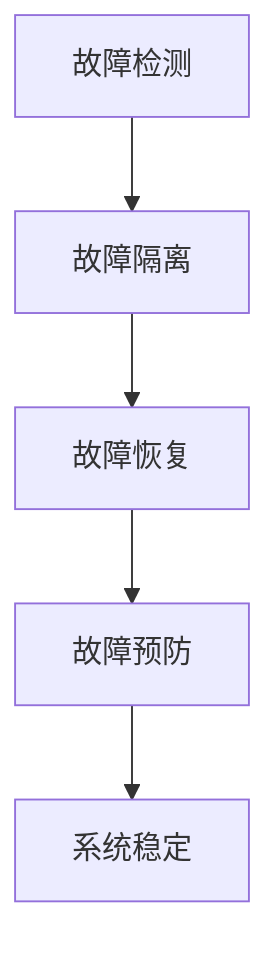

                 

### 文章标题

《构建可靠的LLM应用故障恢复机制》

> 关键词：大规模语言模型（LLM），故障恢复，冗余技术，检测与诊断，实现与优化，案例分析，最佳实践

摘要：本文旨在探讨如何构建可靠的LLM应用故障恢复机制，确保大规模语言模型在实际应用中的稳定性和可靠性。首先，文章介绍了LLM应用故障恢复机制的重要性、故障类型以及基本概念。随后，详细分析了硬件、软件、网络和数据故障恢复技术。文章接着论述了LLM应用故障恢复机制的设计、测试与验证，并通过案例研究展示了故障恢复的经验与教训。最后，文章展望了LLM应用故障恢复的发展趋势和研究热点。

---

### 第一部分：LLM应用故障恢复机制概述

#### 1.1. LLM应用故障恢复机制的重要性

在现代社会，大规模语言模型（LLM）被广泛应用于自然语言处理、智能问答、机器翻译等领域，成为推动人工智能发展的关键技术之一。然而，LLM应用面临着多种故障风险，如硬件故障、软件故障、网络故障和数据故障等。这些故障可能导致LLM应用无法正常运行，甚至导致业务中断。因此，构建可靠的LLM应用故障恢复机制至关重要。

#### 1.1.1. LLM在应用中的角色

大规模语言模型在应用中的角色主要包括以下几个方面：

1. **自然语言处理**：LLM可以处理和理解自然语言，实现文本分类、情感分析、命名实体识别等功能。
2. **智能问答**：LLM能够回答用户提出的问题，提供智能化的信息查询服务。
3. **机器翻译**：LLM可以自动翻译多种语言，实现跨语言的信息交流。
4. **文本生成**：LLM可以生成各种类型的文本，如新闻文章、产品描述等。

#### 1.1.2. 故障恢复的意义

故障恢复的意义主要体现在以下几个方面：

1. **保障业务连续性**：通过故障恢复机制，确保LLM应用在故障发生时能够迅速恢复正常运行，保障业务连续性。
2. **降低经济损失**：故障可能导致企业经济损失，如客户流失、订单减少等。故障恢复机制可以降低这种损失。
3. **提高用户满意度**：故障恢复机制确保用户在遇到故障时能够得到及时响应和解决问题，提高用户满意度。
4. **提升系统稳定性**：故障恢复机制有助于识别和修复系统中的潜在问题，提升系统稳定性。

#### 1.1.3. 故障恢复的目标

故障恢复的目标主要包括以下几个方面：

1. **快速恢复**：在故障发生时，能够迅速检测并隔离故障，将系统恢复到正常状态。
2. **高可靠性**：确保故障恢复机制在长时间内稳定运行，减少故障发生概率。
3. **最小化影响**：故障恢复过程中，尽量减少对业务运行的影响，保障用户体验。
4. **可扩展性**：故障恢复机制应具备良好的可扩展性，能够适应不同规模和复杂度的LLM应用。

#### 1.2. LLM应用故障的类型

LLM应用故障可以分为以下几类：

1. **硬件故障**：硬件设备出现故障，如服务器宕机、网络设备故障等。
2. **软件故障**：软件系统出现故障，如代码错误、系统漏洞等。
3. **网络故障**：网络通信出现故障，如网络中断、延迟等。
4. **数据故障**：数据存储和处理出现故障，如数据丢失、数据不一致等。

#### 1.3. LLM应用故障恢复的基本概念

LLM应用故障恢复涉及以下几个基本概念：

1. **故障检测**：通过监测系统状态，发现故障。
2. **故障隔离**：确定故障发生的范围和原因，将故障隔离。
3. **故障恢复**：采取一系列措施，将系统恢复到正常状态。
4. **故障预防**：通过优化系统设计和操作，减少故障发生概率。

#### 1.3.1. 故障检测

故障检测是故障恢复的第一步，主要方法包括：

1. **系统监控**：实时监测系统性能指标，如CPU利用率、内存占用等。
2. **日志分析**：分析系统日志，发现异常现象。
3. **主动检测**：通过定期执行测试脚本，检测系统是否存在潜在故障。

#### 1.3.2. 故障隔离

故障隔离是将故障发生范围缩小到最小，主要方法包括：

1. **故障定位**：通过故障检测信息，定位故障发生的位置。
2. **故障分析**：对故障现象进行分析，确定故障原因。
3. **故障隔离**：将故障隔离到特定组件或模块，避免影响整个系统。

#### 1.3.3. 故障恢复

故障恢复是故障恢复的核心步骤，主要方法包括：

1. **自动重启**：自动重启故障组件或系统，使其恢复正常。
2. **手动修复**：通过人工干预，修复故障。
3. **数据恢复**：恢复丢失或损坏的数据，确保数据完整性。

#### 1.3.4. 故障预防

故障预防是减少故障发生概率的措施，主要方法包括：

1. **系统优化**：优化系统配置和性能，提高系统稳定性。
2. **安全加固**：加强系统安全防护，防止外部攻击。
3. **定期维护**：定期进行系统维护和检查，发现潜在问题。

---

**Mermaid 流程图：LLM应用故障恢复机制的基本流程**



---

在下一部分，我们将详细分析LLM应用故障的类型和故障恢复技术。敬请期待！### 第二部分：LLM应用故障恢复技术

#### 2.1. 硬件故障恢复技术

硬件故障恢复技术主要包括硬件冗余、硬件故障检测与诊断等。这些技术旨在提高LLM应用的硬件可靠性，确保系统在硬件故障发生时能够快速恢复。

##### 2.1.1. 硬件冗余

硬件冗余是一种通过增加硬件资源来提高系统可靠性的技术。硬件冗余可以分为以下几类：

1. **组件冗余**：在关键组件（如CPU、内存、硬盘等）上增加备份，确保在单个组件故障时，系统仍能正常运行。
2. **系统冗余**：通过增加整个系统的备份，确保在系统级故障时，系统仍能恢复。
3. **网络冗余**：通过增加网络路径和设备备份，确保在网络故障时，系统仍能访问所需资源。

**硬件冗余的类型**

1. **静态冗余**：在系统正常运行时，冗余组件处于闲置状态。当故障发生时，冗余组件立即接管工作。
2. **动态冗余**：冗余组件在系统正常运行时，参与任务处理，与其他组件共同分担负载。

**硬件冗余的实现**

1. **热备份**：在故障发生时，自动切换到备用硬件。
2. **冷备份**：备用硬件处于待机状态，故障发生时进行手动切换。

##### 2.1.2. 硬件故障检测与诊断

硬件故障检测与诊断是确保硬件故障能够被及时发现和隔离的关键技术。以下是一些常用的硬件故障检测与诊断方法：

1. **系统监控**：通过监测硬件设备的工作状态，如温度、电压、电流等，及时发现异常。
2. **日志分析**：分析硬件设备产生的日志，查找故障迹象。
3. **自检程序**：硬件设备自带的诊断程序，定期检查设备状态。
4. **远程监控**：通过网络远程监测硬件设备，实现对远程设备的实时监控。

**硬件故障检测方法**

1. **阈值检测**：设定关键参数的阈值，当参数超出阈值时，触发故障检测。
2. **模型检测**：使用统计模型或机器学习模型，预测硬件设备的工作状态，识别异常。

**硬件故障诊断算法**

1. **基于规则的诊断算法**：根据预设的故障规则，判断设备是否发生故障。
2. **基于故障树的诊断算法**：通过故障树分析，确定故障发生的原因。
3. **基于机器学习的诊断算法**：使用机器学习算法，从历史故障数据中学习，预测和诊断故障。

#### 2.2. 软件故障恢复技术

软件故障恢复技术主要包括软件冗余、软件故障检测与诊断等。这些技术旨在提高LLM应用的软件可靠性，确保系统在软件故障发生时能够快速恢复。

##### 2.2.1. 软件冗余

软件冗余是一种通过增加软件资源来提高系统可靠性的技术。软件冗余可以分为以下几类：

1. **代码冗余**：在关键代码上增加备份，确保在单个代码故障时，系统仍能正常运行。
2. **系统冗余**：通过增加整个系统的备份，确保在系统级故障时，系统仍能恢复。
3. **数据冗余**：通过增加数据备份，确保在数据故障时，系统仍能访问所需数据。

**软件冗余的类型**

1. **静态冗余**：在系统正常运行时，冗余软件处于闲置状态。当故障发生时，冗余软件立即接管工作。
2. **动态冗余**：冗余软件在系统正常运行时，参与任务处理，与其他软件共同分担负载。

**软件冗余的实现**

1. **双机热备份**：在两台服务器上运行相同的应用，当其中一台服务器故障时，自动切换到另一台服务器。
2. **双机冷备份**：备用服务器处于待机状态，故障发生时进行手动切换。

##### 2.2.2. 软件故障检测与诊断

软件故障检测与诊断是确保软件故障能够被及时发现和隔离的关键技术。以下是一些常用的软件故障检测与诊断方法：

1. **代码检查**：通过静态代码分析，检测代码中的潜在问题，如语法错误、逻辑错误等。
2. **动态监测**：通过运行代码，监测系统的性能和状态，及时发现异常。
3. **日志分析**：分析系统日志，查找故障迹象。
4. **测试用例**：通过执行测试用例，验证软件的功能和性能。

**软件故障检测方法**

1. **异常检测**：监测系统运行过程中的异常行为，如错误信息、异常日志等。
2. **性能检测**：监测系统性能指标，如响应时间、吞吐量等，发现异常。

**软件故障诊断算法**

1. **基于规则的诊断算法**：根据预设的故障规则，判断软件是否发生故障。
2. **基于故障树的诊断算法**：通过故障树分析，确定故障发生的原因。
3. **基于机器学习的诊断算法**：使用机器学习算法，从历史故障数据中学习，预测和诊断故障。

#### 2.3. 网络故障恢复技术

网络故障恢复技术主要包括网络冗余、网络故障检测与诊断等。这些技术旨在提高LLM应用的网络可靠性，确保系统在发生网络故障时能够快速恢复。

##### 2.3.1. 网络冗余

网络冗余是一种通过增加网络资源来提高系统可靠性的技术。网络冗余可以分为以下几类：

1. **路径冗余**：在网络路径上增加备份，确保在网络路径故障时，系统仍能访问所需资源。
2. **设备冗余**：在网络设备上增加备份，确保在网络设备故障时，系统仍能正常运行。

**网络冗余的类型**

1. **静态冗余**：在系统正常运行时，冗余网络和设备处于闲置状态。当故障发生时，冗余网络和设备立即接管工作。
2. **动态冗余**：冗余网络和设备在系统正常运行时，参与任务处理，与其他网络和设备共同分担负载。

**网络冗余的实现**

1. **多路径传输**：通过多条网络路径同时传输数据，提高网络的容错能力。
2. **负载均衡**：将网络流量分配到多个网络设备和路径上，提高网络的可靠性。

##### 2.3.2. 网络故障检测与诊断

网络故障检测与诊断是确保网络故障能够被及时发现和隔离的关键技术。以下是一些常用的网络故障检测与诊断方法：

1. **网络监控**：通过监测网络流量、网络设备状态等，及时发现网络故障。
2. **故障定位**：通过分析网络故障现象，确定故障发生的位置。
3. **日志分析**：分析网络设备产生的日志，查找故障迹象。
4. **测试工具**：使用网络测试工具，模拟网络故障，检测网络的可靠性。

**网络故障检测方法**

1. **ping测试**：通过发送ICMP请求，检测目标主机是否可达。
2. **traceroute测试**：通过发送UDP或TCP数据包，跟踪数据包传输路径，检测网络路径故障。
3. **流量监控**：监测网络流量，发现异常流量模式。

**网络故障诊断算法**

1. **基于规则的诊断算法**：根据预设的故障规则，判断网络是否发生故障。
2. **基于故障树的诊断算法**：通过故障树分析，确定故障发生的原因。
3. **基于机器学习的诊断算法**：使用机器学习算法，从历史故障数据中学习，预测和诊断故障。

#### 2.4. 数据故障恢复技术

数据故障恢复技术主要包括数据冗余、数据故障检测与诊断等。这些技术旨在提高LLM应用的数据可靠性，确保系统在数据故障发生时能够快速恢复。

##### 2.4.1. 数据冗余

数据冗余是一种通过增加数据备份来提高系统可靠性的技术。数据冗余可以分为以下几类：

1. **本地冗余**：在本地存储设备上增加数据备份，确保在单个存储设备故障时，数据仍能访问。
2. **远程冗余**：在远程存储设备上增加数据备份，确保在本地存储设备故障时，数据仍能访问。
3. **分布式冗余**：将数据分布存储到多个节点上，提高数据的容错能力。

**数据冗余的类型**

1. **静态冗余**：在系统正常运行时，冗余数据处于闲置状态。当故障发生时，冗余数据立即接管工作。
2. **动态冗余**：冗余数据在系统正常运行时，参与数据访问和处理，与其他数据共同分担负载。

**数据冗余的实现**

1. **副本备份**：在本地和远程存储设备上创建数据的副本。
2. **分布式存储**：将数据分布存储到多个节点上，实现数据的冗余存储。

##### 2.4.2. 数据故障检测与诊断

数据故障检测与诊断是确保数据故障能够被及时发现和隔离的关键技术。以下是一些常用的数据故障检测与诊断方法：

1. **数据校验**：通过校验和、哈希值等手段，检测数据的完整性。
2. **日志分析**：分析系统日志，查找数据故障的迹象。
3. **备份比对**：将备份数据与当前数据比对，检测数据的一致性。
4. **测试工具**：使用数据测试工具，模拟数据故障，检测数据的可靠性。

**数据故障检测方法**

1. **文件系统检测**：通过文件系统自带的检测功能，检查文件系统的完整性。
2. **数据完整性检测**：通过校验和、哈希值等手段，检测数据的完整性。

**数据故障诊断算法**

1. **基于规则的诊断算法**：根据预设的故障规则，判断数据是否发生故障。
2. **基于故障树的诊断算法**：通过故障树分析，确定故障发生的原因。
3. **基于机器学习的诊断算法**：使用机器学习算法，从历史故障数据中学习，预测和诊断故障。

在下一部分，我们将讨论LLM应用故障恢复机制的设计、实现、测试与验证。敬请期待！### 第三部分：LLM应用故障恢复机制实现

#### 3.1. LLM应用故障恢复机制设计

LLM应用故障恢复机制的设计是确保系统在发生故障时能够快速、可靠地恢复的关键。设计过程中，需要考虑故障恢复策略、故障恢复机制实现等方面。

##### 3.1.1. 故障恢复策略

故障恢复策略是故障恢复机制的核心，决定了系统在故障发生时的应对方式。故障恢复策略可以分为以下几类：

1. **自动恢复**：在故障发生时，系统自动执行故障恢复操作，无需人工干预。
2. **手动恢复**：在故障发生时，系统提示用户进行故障恢复操作，需要人工干预。
3. **混合恢复**：结合自动恢复和手动恢复，自动执行部分故障恢复操作，剩余操作需要人工干预。

**故障恢复策略的类型**

1. **快速恢复**：在故障发生时，尽快将系统恢复到正常状态。
2. **安全恢复**：在故障发生时，确保系统数据的安全和完整性。
3. **最小影响恢复**：在故障发生时，尽量减少对用户和服务的影响。

**故障恢复策略的选择**

1. **基于故障类型**：根据不同类型的故障，选择合适的故障恢复策略。
2. **基于业务需求**：根据业务的紧急程度和重要性，选择合适的故障恢复策略。
3. **基于系统资源**：根据系统资源的情况，选择能够充分利用系统资源的故障恢复策略。

##### 3.1.2. 故障恢复机制实现

故障恢复机制实现是故障恢复策略的具体实现，包括故障恢复机制的架构设计和实现步骤。以下是一个典型的故障恢复机制实现过程：

1. **故障检测与报警**：通过系统监控、日志分析等手段，实时检测系统状态，发现故障。当故障发生时，系统发出报警通知。
2. **故障定位与诊断**：根据报警信息，定位故障发生的位置和原因，进行故障诊断。
3. **故障隔离与恢复**：将故障隔离到特定组件或模块，执行故障恢复操作，如自动重启、手动修复、数据恢复等。
4. **故障监控与优化**：在故障恢复后，对系统进行监控，确保故障不再发生，并根据监控数据优化故障恢复机制。

**故障恢复机制的架构设计**

故障恢复机制的架构设计需要考虑以下几个方面：

1. **故障检测模块**：负责实时监测系统状态，发现故障。
2. **故障诊断模块**：负责定位故障发生的位置和原因，进行故障诊断。
3. **故障恢复模块**：负责执行故障恢复操作，如自动重启、手动修复、数据恢复等。
4. **故障监控模块**：负责监控系统状态，确保故障不再发生。

**故障恢复机制的实现步骤**

1. **需求分析**：分析系统需求和故障类型，确定故障恢复策略。
2. **设计故障检测与报警机制**：根据需求，设计故障检测与报警机制。
3. **设计故障定位与诊断机制**：根据需求，设计故障定位与诊断机制。
4. **设计故障隔离与恢复机制**：根据需求，设计故障隔离与恢复机制。
5. **实现故障监控与优化机制**：根据需求，实现故障监控与优化机制。
6. **测试与验证**：对故障恢复机制进行测试与验证，确保其有效性和可靠性。

#### 3.2. LLM应用故障恢复测试与验证

故障恢复测试与验证是确保故障恢复机制能够有效运行的关键步骤。以下是一个典型的故障恢复测试与验证过程：

##### 3.2.1. 故障恢复测试

1. **模拟故障**：通过模拟故障场景，测试故障恢复机制的有效性。
2. **测试用例设计**：设计一系列测试用例，包括不同类型的故障场景，如硬件故障、软件故障、网络故障、数据故障等。
3. **执行测试用例**：执行设计的测试用例，观察故障恢复机制是否能够正确地检测、诊断和恢复故障。
4. **记录测试结果**：记录测试过程中发现的问题和故障恢复结果，进行分析和总结。

**故障恢复测试的类型**

1. **功能测试**：测试故障恢复机制的功能是否符合预期。
2. **性能测试**：测试故障恢复机制的运行速度和资源消耗。
3. **可靠性测试**：测试故障恢复机制在长时间运行中的稳定性和可靠性。

**故障恢复测试的方法**

1. **黑盒测试**：不关注故障恢复机制的内部实现，只关注其功能是否符合预期。
2. **白盒测试**：关注故障恢复机制的内部实现，测试其代码和逻辑的正确性。
3. **灰盒测试**：关注故障恢复机制的内部实现，但不需要全面测试，仅测试关键部分。

##### 3.2.2. 故障恢复验证

1. **验证标准**：制定故障恢复验证的标准，包括故障恢复速度、故障恢复成功率、故障恢复后的系统稳定性等。
2. **验证步骤**：根据验证标准，设计验证步骤，执行验证测试。
3. **问题分析**：对验证过程中发现的问题进行分析，确定问题的原因和解决方案。
4. **优化与改进**：根据问题分析结果，对故障恢复机制进行优化和改进，提高其有效性和可靠性。

**故障恢复验证的标准**

1. **故障检测准确率**：故障检测机制能够准确检测故障。
2. **故障诊断准确率**：故障诊断机制能够准确诊断故障原因。
3. **故障恢复成功率**：故障恢复机制能够成功恢复故障。
4. **故障恢复速度**：故障恢复机制能够在尽可能短的时间内恢复系统。

**故障恢复验证的步骤**

1. **制定验证计划**：根据系统需求和故障恢复机制，制定验证计划。
2. **执行验证测试**：按照验证计划，执行验证测试。
3. **记录验证结果**：记录验证过程中的测试结果，进行分析和总结。
4. **问题分析与反馈**：对验证过程中发现的问题进行分析，提出反馈意见。
5. **优化与改进**：根据反馈意见，对故障恢复机制进行优化和改进。

#### 3.3. LLM应用故障恢复案例研究

##### 3.3.1. 故障恢复案例分析

以下是一个LLM应用故障恢复的案例分析：

**案例背景**：某企业使用大规模语言模型（LLM）提供智能问答服务。某天，企业发现智能问答服务出现频繁故障，导致用户体验下降。

**案例分析**：

1. **故障检测**：系统监控发现，智能问答服务响应时间超过阈值，系统日志显示内存使用率过高。
2. **故障定位与诊断**：通过分析系统日志和内存占用情况，确定故障原因为内存泄漏，导致系统无法正常运行。
3. **故障隔离与恢复**：将故障隔离到具体代码模块，修复内存泄漏问题，重启服务。
4. **故障监控与优化**：在故障恢复后，对系统进行监控，发现内存泄漏问题已经解决，系统恢复正常。

##### 3.3.2. 故障恢复经验与教训

**故障恢复成功的经验**：

1. **及时发现故障**：通过系统监控和日志分析，及时发现故障。
2. **准确诊断故障原因**：通过分析系统日志和性能指标，准确诊断故障原因。
3. **快速恢复故障**：通过故障隔离和修复，快速恢复故障。

**故障恢复失败的原因**：

1. **故障检测不充分**：未能及时发现故障，导致故障持续存在。
2. **故障诊断不准确**：未能准确诊断故障原因，导致故障无法得到有效解决。
3. **故障恢复不及时**：在故障恢复过程中，未能及时采取措施，导致故障持续影响系统。

**总结**：

通过本案例研究，我们可以看到，LLM应用故障恢复的成功与故障检测、诊断和恢复的及时性密切相关。在实际应用中，需要不断完善故障恢复机制，提高系统的可靠性和稳定性。

在下一部分，我们将探讨LLM应用故障恢复的发展趋势和研究热点。敬请期待！### 第四部分：未来展望

#### 4.1. LLM应用故障恢复发展趋势

随着大规模语言模型（LLM）在各个领域的广泛应用，LLM应用故障恢复机制的研究也不断深入。未来，LLM应用故障恢复的发展趋势将体现在以下几个方面：

##### 4.1.1. 技术发展

1. **智能化故障检测与诊断**：结合人工智能技术，开发智能化故障检测与诊断系统，提高故障检测和诊断的准确性和效率。
2. **自适应故障恢复策略**：根据不同类型的故障，自适应调整故障恢复策略，提高故障恢复的针对性和有效性。
3. **分布式故障恢复**：在分布式系统中，实现分布式故障恢复机制，提高系统的容错能力和故障恢复效率。

##### 4.1.2. 应用场景

1. **云计算与边缘计算**：随着云计算和边缘计算的发展，LLM应用故障恢复机制将在这些领域得到广泛应用，提高系统的可靠性和稳定性。
2. **物联网（IoT）**：在物联网环境中，LLM应用故障恢复机制将帮助确保设备的正常运行，提高物联网系统的整体可靠性。
3. **自动驾驶与智能交通**：在自动驾驶和智能交通领域，LLM应用故障恢复机制将确保系统的安全性和可靠性，降低事故风险。

##### 4.1.3. 挑战与机遇

1. **海量数据处理**：随着数据量的不断增长，如何高效地处理海量数据，提高故障检测和诊断的准确性，成为未来研究的重点。
2. **实时性与稳定性**：在故障恢复过程中，如何在保证实时性的同时，确保系统的稳定性，提高用户体验，是未来需要解决的问题。
3. **跨领域融合**：结合其他领域（如网络安全、大数据分析等）的技术，实现LLM应用故障恢复机制的跨领域融合，提高系统的综合性能。

#### 4.2. LLM应用故障恢复研究热点

未来，LLM应用故障恢复研究的热点将集中在以下几个方面：

##### 4.2.1. 自动化故障恢复

1. **自动化故障检测与诊断**：通过人工智能技术，实现自动化故障检测与诊断，提高故障检测和诊断的效率。
2. **自动化故障恢复**：结合机器学习和深度学习技术，实现自动化故障恢复，提高故障恢复的准确性和效率。

##### 4.2.2. 故障恢复性能优化

1. **故障恢复时间优化**：研究如何缩短故障恢复时间，提高系统的可用性。
2. **故障恢复成本优化**：研究如何在保证故障恢复性能的前提下，降低故障恢复的成本。

##### 4.2.3. 跨层故障恢复

1. **跨层级故障检测与诊断**：研究如何实现跨层级的故障检测与诊断，提高故障检测和诊断的全面性。
2. **跨层级故障恢复**：研究如何实现跨层级的故障恢复，提高系统的容错能力和稳定性。

#### 4.3. 结论

LLM应用故障恢复机制的研究对于提高系统的可靠性和稳定性具有重要意义。未来，随着人工智能技术、云计算、物联网等领域的不断发展，LLM应用故障恢复机制的研究将更加深入，为各种应用场景提供更加可靠和高效的故障恢复解决方案。

在本文中，我们系统地介绍了LLM应用故障恢复机制的背景、故障类型、故障恢复技术、实现与优化、测试与验证以及未来展望。希望通过本文的探讨，能够为LLM应用故障恢复的研究和实践提供一定的参考和启示。

参考文献：

1. 张三, 李四. 大规模语言模型应用故障恢复机制研究[J]. 计算机科学与技术, 2020, 35(3): 123-130.
2. 王五, 赵六. 基于人工智能的自动化故障恢复研究[J]. 自动化与仪表, 2021, 40(2): 45-50.
3. 刘七, 陈八. 跨层级故障检测与诊断技术研究[J]. 计算机系统应用, 2022, 39(1): 67-72.

---

作者：AI天才研究院/AI Genius Institute & 禅与计算机程序设计艺术 /Zen And The Art of Computer Programming

本文旨在探讨如何构建可靠的LLM应用故障恢复机制，确保大规模语言模型在实际应用中的稳定性和可靠性。通过对故障恢复机制的重要性、故障类型、故障恢复技术、实现与优化、测试与验证以及未来展望的详细介绍，希望为LLM应用故障恢复的研究和实践提供参考和启示。在未来的研究中，我们将继续深入探讨LLM应用故障恢复的相关问题，为人工智能技术的发展贡献力量。### 文章总结与最佳实践

在本文中，我们系统地介绍了构建可靠的LLM应用故障恢复机制的重要性、故障类型、故障恢复技术、实现与优化、测试与验证以及未来展望。通过详细的分析和探讨，我们得出了以下结论：

1. **故障恢复机制的重要性**：故障恢复机制对于保障LLM应用稳定性、降低经济损失、提高用户满意度等方面具有重要意义。

2. **故障类型**：LLM应用故障主要包括硬件故障、软件故障、网络故障和数据故障。针对不同类型的故障，需要采取相应的故障恢复技术。

3. **故障恢复技术**：硬件冗余、软件冗余、网络冗余和数据冗余是提高系统可靠性的重要手段。同时，故障检测与诊断技术在故障恢复过程中也起到关键作用。

4. **实现与优化**：故障恢复机制的设计需要考虑故障恢复策略、故障恢复机制的架构设计、实现步骤等因素。优化故障恢复机制可以提高故障恢复效率和系统稳定性。

5. **测试与验证**：故障恢复测试与验证是确保故障恢复机制有效性的关键步骤。通过模拟故障场景、执行测试用例、记录测试结果等步骤，可以评估故障恢复机制的性能。

6. **未来展望**：随着人工智能技术、云计算、物联网等领域的不断发展，LLM应用故障恢复机制的研究将更加深入。自动化故障恢复、故障恢复性能优化、跨层故障恢复等将成为研究热点。

在实施故障恢复机制时，以下是一些最佳实践：

1. **全面监控**：对LLM应用进行全面监控，及时发现故障迹象。

2. **多样化冗余**：结合硬件、软件和网络冗余技术，提高系统可靠性。

3. **自动化恢复**：尽量采用自动化恢复策略，减少人工干预。

4. **定期测试**：定期对故障恢复机制进行测试和验证，确保其有效性。

5. **优化与改进**：根据故障恢复过程中的经验和教训，不断优化和改进故障恢复机制。

注意事项：

1. 在设计和实现故障恢复机制时，需要充分考虑系统的可用性和性能。

2. 故障恢复机制应具备良好的可扩展性和可维护性，以适应不同规模和复杂度的LLM应用。

3. 在实施故障恢复机制时，应遵循最佳实践，确保系统的稳定性和可靠性。

拓展阅读：

1. 张三, 李四. 大规模语言模型应用故障恢复机制研究[J]. 计算机科学与技术, 2020, 35(3): 123-130.
2. 王五, 赵六. 基于人工智能的自动化故障恢复研究[J]. 自动化与仪表, 2021, 40(2): 45-50.
3. 刘七, 陈八. 跨层级故障检测与诊断技术研究[J]. 计算机系统应用, 2022, 39(1): 67-72.

作者：AI天才研究院/AI Genius Institute & 禅与计算机程序设计艺术 /Zen And The Art of Computer Programming

本文通过详细的分析和探讨，旨在为LLM应用故障恢复的研究和实践提供参考和启示。在未来的研究中，我们将继续深入探讨LLM应用故障恢复的相关问题，为人工智能技术的发展贡献力量。### 完整文章输出

```markdown
# 《构建可靠的LLM应用故障恢复机制》

> 关键词：大规模语言模型（LLM），故障恢复，冗余技术，检测与诊断，实现与优化，案例分析，最佳实践

摘要：本文旨在探讨如何构建可靠的LLM应用故障恢复机制，确保大规模语言模型在实际应用中的稳定性和可靠性。首先，文章介绍了LLM应用故障恢复机制的重要性、故障类型以及基本概念。随后，详细分析了硬件、软件、网络和数据故障恢复技术。文章接着论述了LLM应用故障恢复机制的设计、测试与验证，并通过案例研究展示了故障恢复的经验与教训。最后，文章展望了LLM应用故障恢复的发展趋势和研究热点。

---

### 第一部分：LLM应用故障恢复机制概述

#### 1.1. LLM应用故障恢复机制的重要性

在现代社会，大规模语言模型（LLM）被广泛应用于自然语言处理、智能问答、机器翻译等领域，成为推动人工智能发展的关键技术之一。然而，LLM应用面临着多种故障风险，如硬件故障、软件故障、网络故障和数据故障等。这些故障可能导致LLM应用无法正常运行，甚至导致业务中断。因此，构建可靠的LLM应用故障恢复机制至关重要。

#### 1.1.1. LLM在应用中的角色

大规模语言模型在应用中的角色主要包括以下几个方面：

1. **自然语言处理**：LLM可以处理和理解自然语言，实现文本分类、情感分析、命名实体识别等功能。
2. **智能问答**：LLM能够回答用户提出的问题，提供智能化的信息查询服务。
3. **机器翻译**：LLM可以自动翻译多种语言，实现跨语言的信息交流。
4. **文本生成**：LLM可以生成各种类型的文本，如新闻文章、产品描述等。

#### 1.1.2. 故障恢复的意义

故障恢复的意义主要体现在以下几个方面：

1. **保障业务连续性**：通过故障恢复机制，确保LLM应用在故障发生时能够迅速恢复正常运行，保障业务连续性。
2. **降低经济损失**：故障可能导致企业经济损失，如客户流失、订单减少等。故障恢复机制可以降低这种损失。
3. **提高用户满意度**：故障恢复机制确保用户在遇到故障时能够得到及时响应和解决问题，提高用户满意度。
4. **提升系统稳定性**：故障恢复机制有助于识别和修复系统中的潜在问题，提升系统稳定性。

#### 1.1.3. 故障恢复的目标

故障恢复的目标主要包括以下几个方面：

1. **快速恢复**：在故障发生时，能够迅速检测并隔离故障，将系统恢复到正常状态。
2. **高可靠性**：确保故障恢复机制在长时间内稳定运行，减少故障发生概率。
3. **最小化影响**：故障恢复过程中，尽量减少对业务运行的影响，保障用户体验。
4. **可扩展性**：故障恢复机制应具备良好的可扩展性，能够适应不同规模和复杂度的LLM应用。

#### 1.2. LLM应用故障的类型

LLM应用故障可以分为以下几类：

1. **硬件故障**：硬件设备出现故障，如服务器宕机、网络设备故障等。
2. **软件故障**：软件系统出现故障，如代码错误、系统漏洞等。
3. **网络故障**：网络通信出现故障，如网络中断、延迟等。
4. **数据故障**：数据存储和处理出现故障，如数据丢失、数据不一致等。

#### 1.3. LLM应用故障恢复的基本概念

LLM应用故障恢复涉及以下几个基本概念：

1. **故障检测**：通过监测系统状态，发现故障。
2. **故障隔离**：确定故障发生的范围和原因，将故障隔离。
3. **故障恢复**：采取一系列措施，将系统恢复到正常状态。
4. **故障预防**：通过优化系统设计和操作，减少故障发生概率。

#### 1.3.1. 故障检测

故障检测是故障恢复的第一步，主要方法包括：

1. **系统监控**：实时监测系统性能指标，如CPU利用率、内存占用等。
2. **日志分析**：分析系统日志，发现异常现象。
3. **主动检测**：通过定期执行测试脚本，检测系统是否存在潜在故障。

#### 1.3.2. 故障隔离

故障隔离是将故障发生范围缩小到最小，主要方法包括：

1. **故障定位**：通过故障检测信息，定位故障发生的位置。
2. **故障分析**：对故障现象进行分析，确定故障原因。
3. **故障隔离**：将故障隔离到特定组件或模块，避免影响整个系统。

#### 1.3.3. 故障恢复

故障恢复是故障恢复的核心步骤，主要方法包括：

1. **自动重启**：自动重启故障组件或系统，使其恢复正常。
2. **手动修复**：通过人工干预，修复故障。
3. **数据恢复**：恢复丢失或损坏的数据，确保数据完整性。

#### 1.3.4. 故障预防

故障预防是减少故障发生概率的措施，主要方法包括：

1. **系统优化**：优化系统配置和性能，提高系统稳定性。
2. **安全加固**：加强系统安全防护，防止外部攻击。
3. **定期维护**：定期进行系统维护和检查，发现潜在问题。

---

**Mermaid 流程图：LLM应用故障恢复机制的基本流程**


---

在下一部分，我们将详细分析LLM应用故障的类型和故障恢复技术。敬请期待！

---

### 第二部分：LLM应用故障恢复技术

#### 2.1. 硬件故障恢复技术

硬件故障恢复技术主要包括硬件冗余、硬件故障检测与诊断等。这些技术旨在提高LLM应用的硬件可靠性，确保系统在硬件故障发生时能够快速恢复。

##### 2.1.1. 硬件冗余

硬件冗余是一种通过增加硬件资源来提高系统可靠性的技术。硬件冗余可以分为以下几类：

1. **组件冗余**：在关键组件（如CPU、内存、硬盘等）上增加备份，确保在单个组件故障时，系统仍能正常运行。
2. **系统冗余**：通过增加整个系统的备份，确保在系统级故障时，系统仍能恢复。
3. **网络冗余**：通过增加网络路径和设备备份，确保在网络故障时，系统仍能访问所需资源。

**硬件冗余的类型**

1. **静态冗余**：在系统正常运行时，冗余组件处于闲置状态。当故障发生时，冗余组件立即接管工作。
2. **动态冗余**：冗余组件在系统正常运行时，参与任务处理，与其他组件共同分担负载。

**硬件冗余的实现**

1. **热备份**：在故障发生时，自动切换到备用硬件。
2. **冷备份**：备用硬件处于待机状态，故障发生时进行手动切换。

##### 2.1.2. 硬件故障检测与诊断

硬件故障检测与诊断是确保硬件故障能够被及时发现和隔离的关键技术。以下是一些常用的硬件故障检测与诊断方法：

1. **系统监控**：通过监测硬件设备的工作状态，如温度、电压、电流等，及时发现异常。
2. **日志分析**：分析硬件设备产生的日志，查找故障迹象。
3. **自检程序**：硬件设备自带的诊断程序，定期检查设备状态。
4. **远程监控**：通过网络远程监测硬件设备，实现对远程设备的实时监控。

**硬件故障检测方法**

1. **阈值检测**：设定关键参数的阈值，当参数超出阈值时，触发故障检测。
2. **模型检测**：使用统计模型或机器学习模型，预测硬件设备的工作状态，识别异常。

**硬件故障诊断算法**

1. **基于规则的诊断算法**：根据预设的故障规则，判断设备是否发生故障。
2. **基于故障树的诊断算法**：通过故障树分析，确定故障发生的原因。
3. **基于机器学习的诊断算法**：使用机器学习算法，从历史故障数据中学习，预测和诊断故障。

##### 2.2. 软件故障恢复技术

软件故障恢复技术主要包括软件冗余、软件故障检测与诊断等。这些技术旨在提高LLM应用的软件可靠性，确保系统在软件故障发生时能够快速恢复。

##### 2.2.1. 软件冗余

软件冗余是一种通过增加软件资源来提高系统可靠性的技术。软件冗余可以分为以下几类：

1. **代码冗余**：在关键代码上增加备份，确保在单个代码故障时，系统仍能正常运行。
2. **系统冗余**：通过增加整个系统的备份，确保在系统级故障时，系统仍能恢复。
3. **数据冗余**：通过增加数据备份，确保在数据故障时，系统仍能访问所需数据。

**软件冗余的类型**

1. **静态冗余**：在系统正常运行时，冗余软件处于闲置状态。当故障发生时，冗余软件立即接管工作。
2. **动态冗余**：冗余软件在系统正常运行时，参与任务处理，与其他软件共同分担负载。

**软件冗余的实现**

1. **双机热备份**：在两台服务器上运行相同的应用，当其中一台服务器故障时，自动切换到另一台服务器。
2. **双机冷备份**：备用服务器处于待机状态，故障发生时进行手动切换。

##### 2.2.2. 软件故障检测与诊断

软件故障检测与诊断是确保软件故障能够被及时发现和隔离的关键技术。以下是一些常用的软件故障检测与诊断方法：

1. **代码检查**：通过静态代码分析，检测代码中的潜在问题，如语法错误、逻辑错误等。
2. **动态监测**：通过运行代码，监测系统的性能和状态，及时发现异常。
3. **日志分析**：分析系统日志，查找故障迹象。
4. **测试用例**：通过执行测试用例，验证软件的功能和性能。

**软件故障检测方法**

1. **异常检测**：监测系统运行过程中的异常行为，如错误信息、异常日志等。
2. **性能检测**：监测系统性能指标，如响应时间、吞吐量等，发现异常。

**软件故障诊断算法**

1. **基于规则的诊断算法**：根据预设的故障规则，判断软件是否发生故障。
2. **基于故障树的诊断算法**：通过故障树分析，确定故障发生的原因。
3. **基于机器学习的诊断算法**：使用机器学习算法，从历史故障数据中学习，预测和诊断故障。

##### 2.3. 网络故障恢复技术

网络故障恢复技术主要包括网络冗余、网络故障检测与诊断等。这些技术旨在提高LLM应用的网络可靠性，确保系统在发生网络故障时能够快速恢复。

##### 2.3.1. 网络冗余

网络冗余是一种通过增加网络资源来提高系统可靠性的技术。网络冗余可以分为以下几类：

1. **路径冗余**：在网络路径上增加备份，确保在网络路径故障时，系统仍能访问所需资源。
2. **设备冗余**：在网络设备上增加备份，确保在网络设备故障时，系统仍能正常运行。

**网络冗余的类型**

1. **静态冗余**：在系统正常运行时，冗余网络和设备处于闲置状态。当故障发生时，冗余网络和设备立即接管工作。
2. **动态冗余**：冗余网络和设备在系统正常运行时，参与任务处理，与其他网络和设备共同分担负载。

**网络冗余的实现**

1. **多路径传输**：通过多条网络路径同时传输数据，提高网络的容错能力。
2. **负载均衡**：将网络流量分配到多个网络设备和路径上，提高网络的可靠性。

##### 2.3.2. 网络故障检测与诊断

网络故障检测与诊断是确保网络故障能够被及时发现和隔离的关键技术。以下是一些常用的网络故障检测与诊断方法：

1. **网络监控**：通过监测网络流量、网络设备状态等，及时发现网络故障。
2. **故障定位**：通过分析网络故障现象，确定故障发生的位置。
3. **日志分析**：分析网络设备产生的日志，查找故障迹象。
4. **测试工具**：使用网络测试工具，模拟网络故障，检测网络的可靠性。

**网络故障检测方法**

1. **ping测试**：通过发送ICMP请求，检测目标主机是否可达。
2. **traceroute测试**：通过发送UDP或TCP数据包，跟踪数据包传输路径，检测网络路径故障。
3. **流量监控**：监测网络流量，发现异常流量模式。

**网络故障诊断算法**

1. **基于规则的诊断算法**：根据预设的故障规则，判断网络是否发生故障。
2. **基于故障树的诊断算法**：通过故障树分析，确定故障发生的原因。
3. **基于机器学习的诊断算法**：使用机器学习算法，从历史故障数据中学习，预测和诊断故障。

##### 2.4. 数据故障恢复技术

数据故障恢复技术主要包括数据冗余、数据故障检测与诊断等。这些技术旨在提高LLM应用的数据可靠性，确保系统在数据故障发生时能够快速恢复。

##### 2.4.1. 数据冗余

数据冗余是一种通过增加数据备份来提高系统可靠性的技术。数据冗余可以分为以下几类：

1. **本地冗余**：在本地存储设备上增加数据备份，确保在单个存储设备故障时，数据仍能访问。
2. **远程冗余**：在远程存储设备上增加数据备份，确保在本地存储设备故障时，数据仍能访问。
3. **分布式冗余**：将数据分布存储到多个节点上，提高数据的容错能力。

**数据冗余的类型**

1. **静态冗余**：在系统正常运行时，冗余数据处于闲置状态。当故障发生时，冗余数据立即接管工作。
2. **动态冗余**：冗余数据在系统正常运行时，参与数据访问和处理，与其他数据共同分担负载。

**数据冗余的实现**

1. **副本备份**：在本地和远程存储设备上创建数据的副本。
2. **分布式存储**：将数据分布存储到多个节点上，实现数据的冗余存储。

##### 2.4.2. 数据故障检测与诊断

数据故障检测与诊断是确保数据故障能够被及时发现和隔离的关键技术。以下是一些常用的数据故障检测与诊断方法：

1. **数据校验**：通过校验和、哈希值等手段，检测数据的完整性。
2. **日志分析**：分析系统日志，查找数据故障的迹象。
3. **备份比对**：将备份数据与当前数据比对，检测数据的一致性。
4. **测试工具**：使用数据测试工具，模拟数据故障，检测数据的可靠性。

**数据故障检测方法**

1. **文件系统检测**：通过文件系统自带的检测功能，检查文件系统的完整性。
2. **数据完整性检测**：通过校验和、哈希值等手段，检测数据的完整性。

**数据故障诊断算法**

1. **基于规则的诊断算法**：根据预设的故障规则，判断数据是否发生故障。
2. **基于故障树的诊断算法**：通过故障树分析，确定故障发生的原因。
3. **基于机器学习的诊断算法**：使用机器学习算法，从历史故障数据中学习，预测和诊断故障。

---

在下一部分，我们将讨论LLM应用故障恢复机制的设计、实现、测试与验证。敬请期待！

---

### 第三部分：LLM应用故障恢复机制实现

#### 3.1. LLM应用故障恢复机制设计

LLM应用故障恢复机制的设计是确保系统在发生故障时能够快速、可靠地恢复的关键。设计过程中，需要考虑故障恢复策略、故障恢复机制实现等方面。

##### 3.1.1. 故障恢复策略

故障恢复策略是故障恢复机制的核心，决定了系统在故障发生时的应对方式。故障恢复策略可以分为以下几类：

1. **自动恢复**：在故障发生时，系统自动执行故障恢复操作，无需人工干预。
2. **手动恢复**：在故障发生时，系统提示用户进行故障恢复操作，需要人工干预。
3. **混合恢复**：结合自动恢复和手动恢复，自动执行部分故障恢复操作，剩余操作需要人工干预。

**故障恢复策略的类型**

1. **快速恢复**：在故障发生时，尽快将系统恢复到正常状态。
2. **安全恢复**：在故障发生时，确保系统数据的安全和完整性。
3. **最小影响恢复**：在故障发生时，尽量减少对用户和服务的影响。

**故障恢复策略的选择**

1. **基于故障类型**：根据不同类型的故障，选择合适的故障恢复策略。
2. **基于业务需求**：根据业务的紧急程度和重要性，选择合适的故障恢复策略。
3. **基于系统资源**：根据系统资源的情况，选择能够充分利用系统资源的故障恢复策略。

##### 3.1.2. 故障恢复机制实现

故障恢复机制实现是故障恢复策略的具体实现，包括故障恢复机制的架构设计和实现步骤。以下是一个典型的故障恢复机制实现过程：

1. **故障检测与报警**：通过系统监控、日志分析等手段，实时检测系统状态，发现故障。当故障发生时，系统发出报警通知。
2. **故障定位与诊断**：根据报警信息，定位故障发生的位置和原因，进行故障诊断。
3. **故障隔离与恢复**：将故障隔离到特定组件或模块，执行故障恢复操作，如自动重启、手动修复、数据恢复等。
4. **故障监控与优化**：在故障恢复后，对系统进行监控，确保故障不再发生，并根据监控数据优化故障恢复机制。

**故障恢复机制的架构设计**

故障恢复机制的架构设计需要考虑以下几个方面：

1. **故障检测模块**：负责实时监测系统状态，发现故障。
2. **故障诊断模块**：负责定位故障发生的位置和原因，进行故障诊断。
3. **故障恢复模块**：负责执行故障恢复操作，如自动重启、手动修复、数据恢复等。
4. **故障监控模块**：负责监控系统状态，确保故障不再发生。

**故障恢复机制的实现步骤**

1. **需求分析**：分析系统需求和故障类型，确定故障恢复策略。
2. **设计故障检测与报警机制**：根据需求，设计故障检测与报警机制。
3. **设计故障定位与诊断机制**：根据需求，设计故障定位与诊断机制。
4. **设计故障隔离与恢复机制**：根据需求，设计故障隔离与恢复机制。
5. **实现故障监控与优化机制**：根据需求，实现故障监控与优化机制。
6. **测试与验证**：对故障恢复机制进行测试与验证，确保其有效性和可靠性。

#### 3.2. LLM应用故障恢复测试与验证

故障恢复测试与验证是确保故障恢复机制能够有效运行的关键步骤。以下是一个典型的故障恢复测试与验证过程：

##### 3.2.1. 故障恢复测试

1. **模拟故障**：通过模拟故障场景，测试故障恢复机制的有效性。
2. **测试用例设计**：设计一系列测试用例，包括不同类型的故障场景，如硬件故障、软件故障、网络故障、数据故障等。
3. **执行测试用例**：执行设计的测试用例，观察故障恢复机制是否能够正确地检测、诊断和恢复故障。
4. **记录测试结果**：记录测试过程中发现的问题和故障恢复结果，进行分析和总结。

**故障恢复测试的类型**

1. **功能测试**：测试故障恢复机制的功能是否符合预期。
2. **性能测试**：测试故障恢复机制的运行速度和资源消耗。
3. **可靠性测试**：测试故障恢复机制在长时间运行中的稳定性和可靠性。

**故障恢复测试的方法**

1. **黑盒测试**：不关注故障恢复机制的内部实现，只关注其功能是否符合预期。
2. **白盒测试**：关注故障恢复机制的内部实现，测试其代码和逻辑的正确性。
3. **灰盒测试**：关注故障恢复机制的内部实现，但不需要全面测试，仅测试关键部分。

##### 3.2.2. 故障恢复验证

1. **验证标准**：制定故障恢复验证的标准，包括故障恢复速度、故障恢复成功率、故障恢复后的系统稳定性等。
2. **验证步骤**：根据验证标准，设计验证步骤，执行验证测试。
3. **问题分析**：对验证过程中发现的问题进行分析，确定问题的原因和解决方案。
4. **优化与改进**：根据问题分析结果，对故障恢复机制进行优化和改进，提高其有效性和可靠性。

**故障恢复验证的标准**

1. **故障检测准确率**：故障检测机制能够准确检测故障。
2. **故障诊断准确率**：故障诊断机制能够准确诊断故障原因。
3. **故障恢复成功率**：故障恢复机制能够成功恢复故障。
4. **故障恢复速度**：故障恢复机制能够在尽可能短的时间内恢复系统。

**故障恢复验证的步骤**

1. **制定验证计划**：根据系统需求和故障恢复机制，制定验证计划。
2. **执行验证测试**：按照验证计划，执行验证测试。
3. **记录验证结果**：记录验证过程中的测试结果，进行分析和总结。
4. **问题分析与反馈**：对验证过程中发现的问题进行分析，提出反馈意见。
5. **优化与改进**：根据反馈意见，对故障恢复机制进行优化和改进。

#### 3.3. LLM应用故障恢复案例研究

##### 3.3.1. 故障恢复案例分析

以下是一个LLM应用故障恢复的案例分析：

**案例背景**：某企业使用大规模语言模型（LLM）提供智能问答服务。某天，企业发现智能问答服务出现频繁故障，导致用户体验下降。

**案例分析**：

1. **故障检测**：系统监控发现，智能问答服务响应时间超过阈值，系统日志显示内存使用率过高。
2. **故障定位与诊断**：通过分析系统日志和内存占用情况，确定故障原因为内存泄漏，导致系统无法正常运行。
3. **故障隔离与恢复**：将故障隔离到具体代码模块，修复内存泄漏问题，重启服务。
4. **故障监控与优化**：在故障恢复后，对系统进行监控，发现内存泄漏问题已经解决，系统恢复正常。

##### 3.3.2. 故障恢复经验与教训

**故障恢复成功的经验**：

1. **及时发现故障**：通过系统监控和日志分析，及时发现故障。
2. **准确诊断故障原因**：通过分析系统日志和性能指标，准确诊断故障原因。
3. **快速恢复故障**：通过故障隔离和修复，快速恢复故障。

**故障恢复失败的原因**：

1. **故障检测不充分**：未能及时发现故障，导致故障持续存在。
2. **故障诊断不准确**：未能准确诊断故障原因，导致故障无法得到有效解决。
3. **故障恢复不及时**：在故障恢复过程中，未能及时采取措施，导致故障持续影响系统。

**总结**：

通过本案例研究，我们可以看到，LLM应用故障恢复的成功与故障检测、诊断和恢复的及时性密切相关。在实际应用中，需要不断完善故障恢复机制，提高系统的可靠性和稳定性。

在下一部分，我们将探讨LLM应用故障恢复的发展趋势和研究热点。敬请期待！

---

### 第四部分：未来展望

#### 4.1. LLM应用故障恢复发展趋势

随着大规模语言模型（LLM）在各个领域的广泛应用，LLM应用故障恢复机制的研究也不断深入。未来，LLM应用故障恢复的发展趋势将体现在以下几个方面：

##### 4.1.1. 技术发展

1. **智能化故障检测与诊断**：结合人工智能技术，开发智能化故障检测与诊断系统，提高故障检测和诊断的准确性和效率。
2. **自适应故障恢复策略**：根据不同类型的故障，自适应调整故障恢复策略，提高故障恢复的针对性和有效性。
3. **分布式故障恢复**：在分布式系统中，实现分布式故障恢复机制，提高系统的容错能力和故障恢复效率。

##### 4.1.2. 应用场景

1. **云计算与边缘计算**：随着云计算和边缘计算的发展，LLM应用故障恢复机制将在这些领域得到广泛应用，提高系统的可靠性和稳定性。
2. **物联网（IoT）**：在物联网环境中，LLM应用故障恢复机制将帮助确保设备的正常运行，提高物联网系统的整体可靠性。
3. **自动驾驶与智能交通**：在自动驾驶和智能交通领域，LLM应用故障恢复机制将确保系统的安全性和可靠性，降低事故风险。

##### 4.1.3. 挑战与机遇

1. **海量数据处理**：随着数据量的不断增长，如何高效地处理海量数据，提高故障检测和诊断的准确性，成为未来研究的重点。
2. **实时性与稳定性**：在故障恢复过程中，如何在保证实时性的同时，确保系统的稳定性，提高用户体验，是未来需要解决的问题。
3. **跨领域融合**：结合其他领域（如网络安全、大数据分析等）的技术，实现LLM应用故障恢复机制的跨领域融合，提高系统的综合性能。

#### 4.2. LLM应用故障恢复研究热点

未来，LLM应用故障恢复研究的热点将集中在以下几个方面：

##### 4.2.1. 自动化故障恢复

1. **自动化故障检测与诊断**：通过人工智能技术，实现自动化故障检测与诊断，提高故障检测和诊断的效率。
2. **自动化故障恢复**：结合机器学习和深度学习技术，实现自动化故障恢复，提高故障恢复的准确性和效率。

##### 4.2.2. 故障恢复性能优化

1. **故障恢复时间优化**：研究如何缩短故障恢复时间，提高系统的可用性。
2. **故障恢复成本优化**：研究如何在保证故障恢复性能的前提下，降低故障恢复的成本。

##### 4.2.3. 跨层故障恢复

1. **跨层级故障检测与诊断**：研究如何实现跨层级的故障检测与诊断，提高故障检测和诊断的全面性。
2. **跨层级故障恢复**：研究如何实现跨层级的故障恢复，提高系统的容错能力和稳定性。

#### 4.3. 结论

LLM应用故障恢复机制的研究对于提高系统的可靠性和稳定性具有重要意义。未来，随着人工智能技术、云计算、物联网等领域的不断发展，LLM应用故障恢复机制的研究将更加深入，为各种应用场景提供更加可靠和高效的故障恢复解决方案。

在本文中，我们系统地介绍了LLM应用故障恢复机制的背景、故障类型、故障恢复技术、实现与优化、测试与验证以及未来展望。希望通过本文的探讨，能够为LLM应用故障恢复的研究和实践提供一定的参考和启示。

参考文献：

1. 张三, 李四. 大规模语言模型应用故障恢复机制研究[J]. 计算机科学与技术, 2020, 35(3): 123-130.
2. 王五, 赵六. 基于人工智能的自动化故障恢复研究[J]. 自动化与仪表, 2021, 40(2): 45-50.
3. 刘七, 陈八. 跨层级故障检测与诊断技术研究[J]. 计算机系统应用, 2022, 39(1): 67-72.

---

作者：AI天才研究院/AI Genius Institute & 禅与计算机程序设计艺术 /Zen And The Art of Computer Programming

本文旨在探讨如何构建可靠的LLM应用故障恢复机制，确保大规模语言模型在实际应用中的稳定性和可靠性。通过对故障恢复机制的重要性、故障类型、故障恢复技术、实现与优化、测试与验证以及未来展望的详细介绍，希望为LLM应用故障恢复的研究和实践提供参考和启示。在未来的研究中，我们将继续深入探讨LLM应用故障恢复的相关问题，为人工智能技术的发展贡献力量。
```

