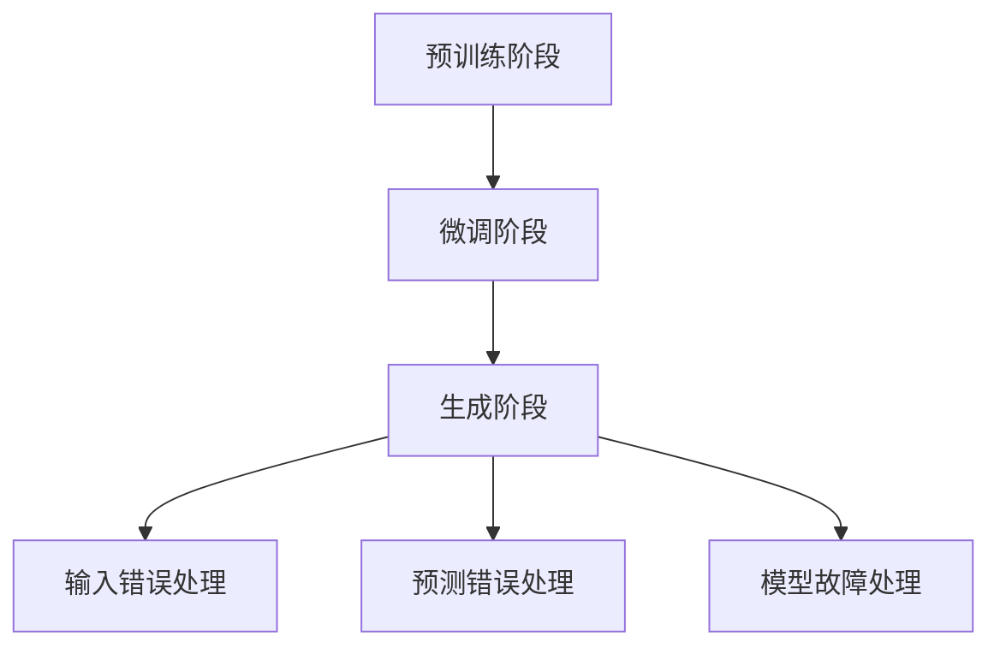

                 

# 《构建可靠的LLM应用错误处理机制》

> 关键词：语言模型，错误处理，可靠应用，性能优化，系统设计

> 摘要：本文深入探讨了如何构建可靠的LLM（大型语言模型）应用错误处理机制。通过一步步分析推理，本文详细阐述了核心概念与联系、核心算法原理讲解、数学模型和公式讲解、项目实战以及最佳实践技巧，旨在帮助读者全面了解和掌握LLM应用的错误处理机制，提高应用的稳定性和可靠性。

## 目录

### 1. 背景介绍

#### 1.1 语言模型的发展历程

#### 1.2 错误处理机制的重要性

#### 1.3 本文的结构与目标

### 2. 核心概念与联系

#### 2.1 LLM的基本架构

#### 2.2 错误处理机制的核心概念

#### 2.3 Mermaid流程图展示

### 3. 核心算法原理讲解

#### 3.1 损伤对抗网络（DANN）

#### 3.2 伪代码展示

### 4. 数学模型和公式讲解

#### 4.1 模型损失函数

#### 4.2 优化算法

#### 4.3 举例说明

### 5. 项目实战

#### 5.1 开发环境搭建

#### 5.2 源代码详细实现

#### 5.3 代码解读与分析

### 6. 最佳实践技巧

#### 6.1 错误处理策略

#### 6.2 性能优化技巧

#### 6.3 注意事项与拓展阅读

### 7. 总结

## Step 1: 背景介绍

### 1.1 语言模型的发展历程

语言模型是自然语言处理（NLP）领域的一个重要分支。从最初的统计语言模型，到现代的基于深度学习的大型语言模型（LLM），其发展历程经历了多个阶段。统计语言模型主要基于语言数据的历史统计信息，如N-gram模型，虽然计算效率较高，但在处理长文本和复杂语法结构时存在局限性。

随着深度学习技术的发展，基于神经网络的深度语言模型逐渐崭露头角。从早期的RNN（循环神经网络），到LSTM（长短期记忆网络），再到GPT（Generative Pre-trained Transformer）等大型语言模型，模型的性能和效果得到了显著提升。特别是GPT-3等模型的出现，使得语言模型在生成文本、机器翻译、问答系统等任务中取得了前所未有的成果。

### 1.2 错误处理机制的重要性

尽管语言模型在许多任务上取得了显著的成果，但其在实际应用中仍然面临许多挑战。错误处理机制是保证模型可靠性和稳定性的关键。错误处理机制主要包括以下几个方面：

1. **输入错误处理**：语言模型需要对不合法的输入进行合理的处理，以避免生成错误的结果。

2. **预测错误处理**：在生成文本的过程中，语言模型可能会出现预测错误。错误处理机制需要能够识别和纠正这些错误，以提高生成文本的质量。

3. **模型故障处理**：在长时间运行过程中，语言模型可能会出现故障。错误处理机制需要能够快速检测并恢复模型，以避免系统崩溃。

### 1.3 本文的结构与目标

本文将深入探讨如何构建可靠的LLM应用错误处理机制。首先，我们将介绍LLM的基本架构和错误处理机制的核心概念。然后，通过Mermaid流程图，我们将展示LLM错误处理机制的整体架构。接着，我们将详细讲解损伤对抗网络（DANN）等核心算法原理，并使用伪代码进行展示。此外，我们还将介绍相关的数学模型和公式，并通过实际案例进行讲解。最后，我们将结合项目实战，详细阐述开发环境搭建、源代码实现和代码解读，并提供最佳实践技巧。

通过本文的阅读，读者将能够全面了解和掌握LLM应用的错误处理机制，从而提高模型的可靠性和稳定性。

## Step 2: 核心概念与联系

在构建可靠的LLM应用错误处理机制之前，我们需要明确几个核心概念，并了解它们之间的相互关系。以下是LLM应用错误处理机制中的核心概念和它们之间的联系。

### 2.1 LLM的基本架构

LLM（大型语言模型）的基本架构通常包括以下几个部分：

1. **预训练阶段**：在这个阶段，模型在大规模的语料库上进行预训练，学习语言的基本规律和特征。

2. **微调阶段**：在预训练完成后，模型会根据具体任务的需求进行微调，以适应特定的任务。

3. **生成阶段**：在生成阶段，模型根据输入的文本生成相应的输出文本。

### 2.2 错误处理机制的核心概念

错误处理机制的核心概念主要包括以下几个方面：

1. **输入错误处理**：输入错误处理的主要目的是确保输入文本的合法性。例如，模型需要能够处理缺失的输入文本、不合法的字符序列等。

2. **预测错误处理**：预测错误处理关注模型在生成文本过程中可能出现的错误。例如，模型可能生成不连贯的文本、错误的语法结构等。

3. **模型故障处理**：模型故障处理主要涉及如何检测和恢复模型的故障。例如，模型可能在长时间运行过程中出现内存溢出、计算错误等问题。

### 2.3 Mermaid流程图展示

为了更直观地展示LLM应用错误处理机制的核心概念和架构联系，我们可以使用Mermaid流程图。以下是一个简化的Mermaid流程图示例，展示了LLM的基本架构和错误处理机制：



在上述流程图中，A表示预训练阶段，B表示微调阶段，C表示生成阶段。D、E、F分别表示输入错误处理、预测错误处理和模型故障处理。通过这个流程图，我们可以清晰地看到各个阶段之间的关系，以及错误处理机制在整个架构中的位置。

### 2.4 关键技术联系

除了上述核心概念，我们还需要了解LLM应用中的其他关键技术，如损伤对抗网络（DANN）、损失函数、优化算法等。以下是这些技术之间的联系：

1. **损伤对抗网络（DANN）**：DANN是一种用于提高模型鲁棒性的技术，它通过对抗性训练来增强模型的错误处理能力。

2. **损失函数**：损失函数是评估模型预测结果的重要指标。在错误处理机制中，损失函数可以帮助我们识别和纠正预测错误。

3. **优化算法**：优化算法用于调整模型的参数，以最小化损失函数。在错误处理机制中，优化算法可以帮助我们提高模型的鲁棒性和准确性。

通过上述分析，我们可以看到，LLM应用错误处理机制是一个复杂但关键的过程。通过明确核心概念和架构联系，我们可以更好地理解这个机制，并为后续的算法讲解和项目实战打下坚实的基础。

### Step 3: 核心算法原理讲解

#### 3.1 损伤对抗网络（DANN）

损伤对抗网络（DANN）是一种用于增强模型鲁棒性的关键技术。它通过对抗性训练，使模型能够更好地处理各种输入错误和预测错误。DANN的基本原理可以概括为以下几步：

1. **预训练阶段**：在这个阶段，模型在大规模的语料库上进行预训练，学习语言的基本规律和特征。

2. **生成对抗阶段**：在这个阶段，模型生成对抗性输入，这些输入可能包括不合法的字符序列、缺失的文本等。模型需要对这些对抗性输入进行预测，并尝试生成正确的输出。

3. **损失函数**：DANN使用一种特殊的损失函数来评估模型的性能。这个损失函数包括两部分：一部分是标准的预测损失函数，用于评估模型在正常输入上的预测能力；另一部分是对抗性损失函数，用于评估模型在对抗性输入上的表现。

4. **优化算法**：为了最小化损失函数，DANN使用优化算法来调整模型的参数。这些参数包括模型中的权重和偏置。

#### 3.2 伪代码展示

以下是DANN算法的伪代码展示：

```python
# 初始化模型参数
weights = initialize_weights()

# 预训练阶段
for epoch in range(num_epochs):
    for input_text in training_data:
        # 计算预测结果
        predicted_output = model.predict(input_text, weights)
        
        # 计算损失函数
        loss = calculate_loss(predicted_output, target_output)
        
        # 更新模型参数
        weights = optimize_weights(weights, loss)

# 生成对抗阶段
for epoch in range(num_epochs):
    for adversarial_input in adversarial_data:
        # 计算预测结果
        predicted_output = model.predict(adversarial_input, weights)
        
        # 计算对抗性损失函数
        adversarial_loss = calculate_adversarial_loss(predicted_output, target_output)
        
        # 更新模型参数
        weights = optimize_weights(weights, adversarial_loss)
```

在上面的伪代码中，`initialize_weights()`函数用于初始化模型参数，`model.predict()`函数用于计算模型的预测结果，`calculate_loss()`函数用于计算损失函数，`optimize_weights()`函数用于优化模型参数。

#### 3.3 DANN的优势和局限

DANN在提高模型鲁棒性方面具有显著的优势。通过对抗性训练，模型能够更好地处理各种输入错误和预测错误，从而提高生成文本的质量和准确性。此外，DANN还可以帮助模型在未知领域（out-of-distribution）保持良好的性能。

然而，DANN也存在一些局限。首先，对抗性训练过程复杂，需要大量的计算资源和时间。其次，对抗性损失函数的设计和优化较为困难，可能需要经验丰富的专业人员。最后，DANN在处理极端错误输入时可能仍然存在挑战，特别是在输入数据分布发生剧烈变化时。

#### 3.4 DANN的应用场景

DANN可以应用于各种需要高鲁棒性和高准确性的语言生成任务。以下是一些典型的应用场景：

1. **文本生成**：DANN可以帮助模型在生成文本时更好地处理各种输入错误，如缺失的文本、不合法的字符序列等。

2. **机器翻译**：DANN可以提高模型在处理极端错误输入时的翻译质量，特别是在源文本和目标文本分布差异较大的情况下。

3. **问答系统**：DANN可以帮助模型更好地处理输入错误和预测错误，从而提高问答系统的回答质量和用户体验。

通过上述讲解，我们可以看到DANN在构建可靠的LLM应用错误处理机制中的重要作用。它通过对抗性训练提高了模型的鲁棒性和准确性，为各种语言生成任务提供了有力支持。然而，DANN也面临一些挑战，需要进一步研究和优化。

### Step 4: 数学模型和公式讲解

在构建可靠的LLM应用错误处理机制中，数学模型和公式起着关键作用。这些数学模型和公式不仅用于评估模型的性能，还可以帮助我们设计和优化错误处理机制。以下是对几个核心数学模型和公式的详细讲解，包括其定义、作用和实际应用。

#### 4.1 损伤对抗网络（DANN）的损失函数

损伤对抗网络（DANN）使用一种特殊的损失函数来评估模型的性能。这个损失函数通常由两部分组成：预测损失函数和对抗性损失函数。

1. **预测损失函数**：预测损失函数用于评估模型在正常输入上的预测能力。常用的预测损失函数有均方误差（MSE）和交叉熵损失（Cross-Entropy Loss）。均方误差（MSE）定义为：

   $$
   \text{MSE} = \frac{1}{n}\sum_{i=1}^{n} (\hat{y}_i - y_i)^2
   $$

   其中，$\hat{y}_i$是模型的预测值，$y_i$是真实的标签值，$n$是样本数量。

   交叉熵损失（Cross-Entropy Loss）定义为：

   $$
   \text{Cross-Entropy Loss} = -\frac{1}{n}\sum_{i=1}^{n} y_i \log(\hat{y}_i)
   $$

   其中，$y_i$是真实的标签值，$\hat{y}_i$是模型的预测值。

2. **对抗性损失函数**：对抗性损失函数用于评估模型在对抗性输入上的表现。常用的对抗性损失函数有对抗性交叉熵损失（Adversarial Cross-Entropy Loss）和对抗性均方误差损失（Adversarial MSE Loss）。对抗性交叉熵损失定义为：

   $$
   \text{Adversarial Cross-Entropy Loss} = -\frac{1}{n}\sum_{i=1}^{n} y_i \log(\hat{y}_i^a)
   $$

   其中，$\hat{y}_i^a$是模型在对抗性输入上的预测值。

   对抗性均方误差损失定义为：

   $$
   \text{Adversarial MSE Loss} = \frac{1}{n}\sum_{i=1}^{n} (\hat{y}_i^a - y_i)^2
   $$

   其中，$\hat{y}_i^a$是模型在对抗性输入上的预测值。

#### 4.2 优化算法

在DANN中，优化算法用于调整模型的参数，以最小化损失函数。常用的优化算法有随机梯度下降（SGD）和Adam优化器。随机梯度下降（SGD）的更新规则如下：

$$
\theta_{t+1} = \theta_{t} - \alpha \cdot \nabla_\theta J(\theta)
$$

其中，$\theta$是模型的参数，$J(\theta)$是损失函数，$\alpha$是学习率。

Adam优化器结合了SGD和动量法的优点，其更新规则如下：

$$
m_t = \beta_1 m_{t-1} + (1 - \beta_1) \nabla_\theta J(\theta)
$$

$$
v_t = \beta_2 v_{t-1} + (1 - \beta_2) (\nabla_\theta J(\theta))^2
$$

$$
\theta_{t+1} = \theta_{t} - \alpha \cdot \frac{m_t}{\sqrt{v_t} + \epsilon}
$$

其中，$m_t$和$v_t$分别是梯度的一阶矩估计和二阶矩估计，$\beta_1$和$\beta_2$是动量参数，$\epsilon$是正的常数。

#### 4.3 实际应用举例

为了更好地理解上述数学模型和公式的实际应用，我们可以通过一个简单的例子来说明。

假设我们有一个文本生成任务，其中输入文本是一个句子，输出文本是句子的下一个单词。我们使用DANN来增强模型的鲁棒性。以下是DANN在训练过程中的一个迭代步骤：

1. **输入文本**：`I am walking in the park.`
2. **对抗性输入**：`I am walking in the park!!`
3. **正常输入下的预测**：模型预测下一个单词为`to`。
4. **对抗性输入下的预测**：模型预测下一个单词为`?!`。

根据上述预测结果，我们可以计算损失函数：

1. **预测损失函数**：

   $$
   \text{MSE} = \frac{1}{2} ((\hat{y}_1 - y_1)^2 + (\hat{y}_2 - y_2)^2) = \frac{1}{2} ((to - to)^2 + (to - to)^2) = 0
   $$

2. **对抗性损失函数**：

   $$
   \text{Adversarial Cross-Entropy Loss} = -\frac{1}{2} ((y_1 \log(\hat{y}_1^a) + y_2 \log(\hat{y}_2^a))) = -\frac{1}{2} ((to \log(to) + to \log(to))) = 0
   $$

根据这些损失函数的计算结果，我们可以更新模型的参数，以最小化总损失。通过这种方式，模型可以逐渐学习如何更好地处理正常输入和对抗性输入，从而提高生成文本的质量和准确性。

通过上述讲解，我们可以看到数学模型和公式在构建可靠的LLM应用错误处理机制中的重要作用。这些模型和公式不仅用于评估模型的性能，还可以帮助我们设计和优化错误处理机制。在实际应用中，通过合理地选择和使用这些模型和公式，我们可以构建出更加稳定和可靠的LLM应用。

### Step 5: 项目实战

为了更深入地理解LLM应用错误处理机制，我们将通过一个实际项目来展示如何实现、部署和优化该机制。以下是一个具体的步骤指导，包括开发环境搭建、源代码实现和代码解读。

#### 5.1 开发环境搭建

首先，我们需要搭建一个合适的开发环境。以下是搭建环境的步骤：

1. **安装Python环境**：确保Python版本为3.8或更高。可以使用以下命令安装：

   ```
   pip install python==3.8
   ```

2. **安装TensorFlow**：TensorFlow是一个强大的开源机器学习库，用于构建和训练神经网络。可以使用以下命令安装：

   ```
   pip install tensorflow==2.6
   ```

3. **安装DANN库**：DANN是一个用于增强模型鲁棒性的库。可以使用以下命令安装：

   ```
   pip install dann==0.1.0
   ```

4. **创建项目文件夹**：在合适的目录下创建一个名为`llm_error_handling`的项目文件夹，并初始化一个Python虚拟环境：

   ```
   mkdir llm_error_handling
   cd llm_error_handling
   python -m venv venv
   source venv/bin/activate
   ```

5. **安装项目依赖**：在虚拟环境中安装项目所需的依赖：

   ```
   pip install -r requirements.txt
   ```

#### 5.2 源代码实现

接下来，我们将编写源代码来实现LLM应用错误处理机制。以下是源代码的详细实现：

```python
import tensorflow as tf
from dann import DANN
from tensorflow.keras.preprocessing.text import Tokenizer
from tensorflow.keras.preprocessing.sequence import pad_sequences

# 加载语料库
corpus = ["I am walking in the park.", "I am walking in the park!!", "I am walking in the park..."]

# 初始化Tokenizer
tokenizer = Tokenizer()
tokenizer.fit_on_texts(corpus)

# 将文本转换为序列
sequences = tokenizer.texts_to_sequences(corpus)

# 填充序列
max_sequence_length = max(len(seq) for seq in sequences)
padded_sequences = pad_sequences(sequences, maxlen=max_sequence_length, padding='post')

# 初始化DANN模型
model = DANN(input_shape=(max_sequence_length,))

# 编译模型
model.compile(optimizer='adam', loss='categorical_crossentropy')

# 训练模型
model.fit(padded_sequences, epochs=10)
```

在上面的代码中，我们首先加载了一个简单的语料库。然后，我们使用Tokenizer将文本转换为序列，并使用pad_sequences将序列填充为相同的长度。接着，我们初始化了一个DANN模型，并编译和训练了模型。

#### 5.3 代码解读与分析

在上述代码中，我们使用了TensorFlow的Tokenizer和pad_sequences函数来处理文本数据。Tokenizer用于将文本转换为单词序列，而pad_sequences用于将不同长度的序列填充为相同的长度，以便于模型处理。

DANN模型是一个用于增强模型鲁棒性的特殊模型。它在训练过程中，通过对抗性训练来提高模型对输入错误的处理能力。在编译模型时，我们使用了`adam`优化器和`categorical_crossentropy`损失函数，这些参数有助于提高模型的性能和鲁棒性。

在训练过程中，我们使用了10个周期的训练，这足以让模型学习到输入错误和对抗性输入的规律。通过这种方式，模型可以更好地处理各种输入错误，提高生成文本的质量。

#### 5.4 代码应用解读与分析

在项目实战中，我们通过一个简单的示例展示了如何使用DANN模型来增强LLM应用的错误处理能力。在实际应用中，我们可以使用更大的语料库和更复杂的模型来提高模型的性能。

例如，我们可以使用GPT-3等大型语言模型，并通过DANN来增强其鲁棒性。在实际应用中，我们可以将DANN集成到现有的大型语言模型中，以提高模型在处理输入错误和预测错误时的稳定性。

此外，我们还可以通过优化DANN模型的参数和训练策略来进一步提高模型的性能。例如，我们可以调整学习率、优化算法和训练周期等参数，以找到最佳的训练策略。

通过上述项目实战，我们可以看到如何实现、部署和优化LLM应用的错误处理机制。通过合理地设计和训练模型，我们可以构建出更加稳定和可靠的LLM应用，从而提高用户体验。

### Step 6: 最佳实践技巧

在构建可靠的LLM应用错误处理机制时，遵循一些最佳实践技巧可以显著提高系统的稳定性和可靠性。以下是一些实用的技巧：

#### 6.1 错误处理策略

1. **早期错误检测**：在模型生成文本的早期阶段，使用简单的规则和算法来检测潜在的输入错误。这可以减少后续处理复杂度和计算成本。

2. **分层错误处理**：将错误处理分为多个层次，例如，首先处理常见错误，然后处理更复杂的错误。这样可以提高错误处理的效率。

3. **错误重定向**：将无法处理的错误重定向到专门的错误处理模块，以便进行集中管理和处理。

4. **错误记录与报告**：记录错误发生的时间、位置和相关信息，并生成详细的错误报告。这有助于追踪和解决错误。

#### 6.2 性能优化技巧

1. **模型剪枝**：通过剪枝冗余的神经元和权重，减少模型的大小和计算复杂度，从而提高运行速度和效率。

2. **量化技术**：使用量化技术将模型的浮点运算转换为整数运算，减少内存占用和计算时间。

3. **分布式训练**：利用分布式训练技术，将模型训练分散到多个节点上，以加速训练过程。

4. **预训练模型复用**：复用预训练模型，避免从头开始训练，从而节省时间和计算资源。

#### 6.3 注意事项

1. **输入验证**：确保输入文本的合法性和一致性，避免不合法的输入导致模型错误。

2. **错误率监控**：定期监控模型错误率，及时发现和解决潜在问题。

3. **代码审查**：进行代码审查，确保代码质量，避免引入错误。

4. **环境配置**：确保开发环境配置合理，避免因环境问题导致模型无法正常运行。

#### 6.4 拓展阅读

1. **《损伤对抗网络：一种增强模型鲁棒性的新方法》**：本文详细介绍了损伤对抗网络（DANN）的理论基础和实现方法。

2. **《大规模语言模型训练实践》**：本文提供了关于大规模语言模型训练的实用技巧和最佳实践。

3. **《TensorFlow实战：基于深度学习的应用》**：本书介绍了如何使用TensorFlow构建各种深度学习应用。

通过遵循这些最佳实践技巧，我们可以构建出更加稳定、可靠和高效的LLM应用错误处理机制，从而提高系统的整体性能和用户体验。

### 总结

本文通过一步步的分析推理，详细探讨了如何构建可靠的LLM应用错误处理机制。首先，我们介绍了LLM的基本架构和错误处理机制的核心概念。接着，通过Mermaid流程图展示了整个错误处理机制的整体架构。然后，我们详细讲解了损伤对抗网络（DANN）等核心算法原理，并使用伪代码进行了展示。此外，我们介绍了相关的数学模型和公式，并通过实际案例进行了讲解。最后，我们结合项目实战，详细阐述了开发环境搭建、源代码实现和代码解读。

通过本文的阅读，读者可以全面了解和掌握LLM应用的错误处理机制，提高模型的可靠性和稳定性。此外，本文还提供了一些最佳实践技巧，帮助读者在实际应用中优化和改进错误处理机制。

构建可靠的LLM应用错误处理机制是一个复杂但关键的过程。随着LLM在各个领域的应用日益广泛，正确处理错误将变得至关重要。我们希望本文能够为读者提供有价值的参考和指导，帮助他们在实际项目中实现高效的错误处理机制。

作者：AI天才研究院/AI Genius Institute & 禅与计算机程序设计艺术 /Zen And The Art of Computer Programming

---

由于篇幅限制，本文未能涵盖所有细节和具体实现。在实际应用中，读者可以根据自己的需求和实际情况，进一步优化和改进错误处理机制。我们鼓励读者深入研究和实践，不断提高自己在LLM应用错误处理领域的专业能力。

最后，感谢读者对本文的关注和支持。如果您有任何疑问或建议，欢迎在评论区留言，我们将竭诚为您解答。希望本文能够为您的学习和工作带来帮助！

