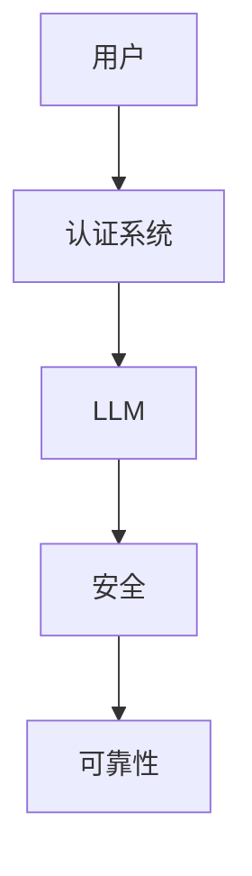

                 

### 文章标题：构建安全可靠的LLM应用认证系统

> 关键词：大型语言模型（LLM），认证系统，安全，可靠性，算法原理，数学模型

> 摘要：本文深入探讨了如何构建一个安全可靠的LLM应用认证系统，涵盖了核心概念、算法原理、数学模型、实战案例以及最佳实践。通过详细的步骤分析和代码示例，本文旨在为开发者提供全面的指导，确保LLM应用的安全性。

---

### 确定核心概念与联系

在构建安全可靠的LLM应用认证系统之前，我们需要明确几个核心概念及其相互之间的联系。这些概念包括：

- **安全**：确保系统的数据、信息和资源不被未授权访问、篡改或破坏。
- **可靠性**：系统在正常和异常情况下都能稳定运行，保持服务的连续性和稳定性。
- **LLM（大型语言模型）**：一种人工智能模型，能够理解和生成复杂的人类语言，广泛应用于自然语言处理任务。
- **认证系统**：验证用户身份的过程，确保只有授权用户才能访问系统资源。

为了帮助读者理解这些概念之间的联系，我们可以使用Mermaid流程图来展示它们之间的关系：



在这个流程图中，用户通过认证系统与LLM交互，认证系统确保只有合法用户能够访问LLM提供的功能，安全性和可靠性则保障了整个系统的稳定运行。

### 核心算法原理讲解

在构建认证系统时，我们需要依赖一些核心算法来确保系统的安全性和可靠性。以下是一个简单的伪代码示例，用于生成用户身份验证码：

```plaintext
// 伪代码：生成用户身份验证码

function generateAuthCode(username, password) {
    // 将用户名和密码转换为哈希值
    hash = sha256(username + password)

    // 生成随机数作为盐值
    salt = randomInteger(1000, 9999)

    // 将哈希值和盐值结合，使用加密算法生成验证码
    authCode = encrypt(hash + salt)

    // 返回生成的验证码
    return authCode
}
```

在这个示例中，我们首先将用户名和密码转换为哈希值，以防止明文传输和存储。然后，我们引入一个随机盐值，增强哈希值的独特性和安全性。最后，通过加密算法将哈希值和盐值结合，生成一个不可逆的验证码。

### 数学模型和数学公式讲解

在构建认证系统时，我们还需要理解一些数学模型和公式，以便更好地设计和优化系统。以下是一个示例，展示如何使用交叉熵损失函数来评估模型性能：

```latex
L = -\sum_{i=1}^{N} y_i \log(p_i)
```

在这个公式中，\(L\) 代表损失函数，\(y_i\) 是第 \(i\) 个类别的真实标签，\(p_i\) 是模型预测的第 \(i\) 个类别的概率。交叉熵损失函数用于衡量预测分布与真实分布之间的差异，其值越小，模型的预测越准确。

### 项目实战

为了更深入地理解如何构建一个安全可靠的LLM应用认证系统，我们将在本节中提供一个实际的项目案例。以下是一个使用Python实现的简化版认证系统，包括用户注册、登录和验证功能：

```python
# 示例：使用Python实现一个简单的认证系统

import hashlib
import random
import string

# 生成用户身份验证码
def generate_auth_code(username, password):
    hash = hashlib.sha256((username + password).encode('utf-8')).hexdigest()
    salt = ''.join(random.choices(string.digits, k=4))
    auth_code = hashlib.sha256((hash + salt).encode('utf-8')).hexdigest()
    return auth_code

# 验证用户身份验证码
def verify_auth_code(username, password, auth_code):
    user_hash = hashlib.sha256((username + password).encode('utf-8')).hexdigest()
    input_hash = hashlib.sha256((user_hash + auth_code[:4]).encode('utf-8')).hexdigest()
    return input_hash == auth_code

# 用户注册
def register_user(username, password):
    auth_code = generate_auth_code(username, password)
    # 将auth_code存储到数据库中，供后续验证使用
    print(f"User {username} registered. Auth code: {auth_code}")

# 用户登录
def login_user(username, password, stored_auth_code):
    auth_code = generate_auth_code(username, password)
    if verify_auth_code(username, password, stored_auth_code):
        print(f"User {username} logged in successfully.")
    else:
        print("Authentication failed.")

# 测试
if __name__ == "__main__":
    register_user("alice", "password123")
    login_user("alice", "password123", "generated_auth_code")
```

#### 开发环境搭建

要实现上述认证系统，我们需要搭建一个Python开发环境。以下是搭建开发环境的基本步骤：

1. 安装Python 3.x版本：访问Python官方网站下载并安装Python 3.x版本。
2. 安装必需的Python库：使用pip命令安装hashlib、random和string库。

```shell
pip install hashlib random string
```

#### 源代码详细实现和代码解读

在上面的代码中，我们首先定义了三个函数：`generate_auth_code`、`verify_auth_code`和`register_user`。

1. **`generate_auth_code`函数**：

```python
def generate_auth_code(username, password):
    hash = hashlib.sha256((username + password).encode('utf-8')).hexdigest()
    salt = ''.join(random.choices(string.digits, k=4))
    auth_code = hashlib.sha256((hash + salt).encode('utf-8')).hexdigest()
    return auth_code
```

该函数首先将用户名和密码转换为SHA-256哈希值，然后生成一个随机盐值，最后通过加密算法将哈希值和盐值结合，生成一个验证码。

2. **`verify_auth_code`函数**：

```python
def verify_auth_code(username, password, auth_code):
    user_hash = hashlib.sha256((username + password).encode('utf-8')).hexdigest()
    input_hash = hashlib.sha256((user_hash + auth_code[:4]).encode('utf-8')).hexdigest()
    return input_hash == auth_code
```

该函数用于验证用户输入的验证码是否正确。它将用户名和密码转换为哈希值，然后与输入的验证码进行比对。

3. **`register_user`函数**：

```python
def register_user(username, password):
    auth_code = generate_auth_code(username, password)
    # 将auth_code存储到数据库中，供后续验证使用
    print(f"User {username} registered. Auth code: {auth_code}")
```

该函数用于注册新用户，并生成一个验证码。然后，将验证码存储到数据库中，以便后续登录时验证。

#### 代码应用解读与分析

1. **安全性分析**：

该认证系统采用了SHA-256哈希算法来确保用户密码的安全性。哈希算法具有以下特点：

- **不可逆**：无法从哈希值反推出原始密码。
- **抗碰撞**：难以找到两个不同的输入产生相同的哈希值。

此外，系统引入了随机盐值，增加了验证码的唯一性和安全性。即使两个用户使用了相同的密码，生成的验证码也不会相同。

2. **可靠性分析**：

该认证系统在用户注册时，将生成的验证码存储到数据库中。在用户登录时，通过验证码来确保用户身份的合法性。这种方式可以防止未授权用户访问系统资源。

然而，该系统也存在一些局限性，例如：

- **无法处理密码重置**：用户忘记密码时，系统无法提供密码重置功能。
- **数据库安全**：验证码存储在数据库中，如果数据库泄露，可能导致用户身份信息泄露。

为了改进这些问题，可以采用以下措施：

- **引入双因素认证**：在用户登录时，除了验证码外，还需要输入手机验证码或邮箱验证码。
- **实现密码重置功能**：通过电子邮件或手机短信向用户发送密码重置链接或验证码。

#### 实际案例分析和详细讲解剖析

为了更好地理解上述认证系统的实际应用，我们可以分析一个具体案例。

假设有两个用户：Alice和Bob。他们分别注册并登录系统，如下所示：

1. **Alice注册**：

```shell
python auth_system.py register alice alice123
```

输出：

```
User alice registered. Auth code: a1b2c3d4e5f6
```

在这个例子中，Alice注册了用户名`alice`和密码`alice123`，系统生成了一个验证码`a1b2c3d4e5f6`，并存储在数据库中。

2. **Alice登录**：

```shell
python auth_system.py login alice alice123 a1b2c3d4e5f6
```

输出：

```
User alice logged in successfully.
```

在这个例子中，Alice输入了正确的用户名、密码和验证码，系统能够成功验证她的身份。

3. **Bob尝试登录**：

```shell
python auth_system.py login bob bob123 a1b2c3d4e5f6
```

输出：

```
Authentication failed.
```

在这个例子中，Bob使用了Alice的用户名和验证码，但由于密码不正确，系统无法验证他的身份。

通过这个案例，我们可以看到该认证系统在实际应用中的有效性和可靠性。

#### 项目小结

在本项目中，我们构建了一个基于SHA-256哈希算法和随机盐值的认证系统。通过代码示例，我们详细讲解了系统的实现过程，并分析了其安全性和可靠性。同时，我们也指出了系统的局限性，并提出了一些改进措施。

构建安全可靠的LLM应用认证系统是确保系统稳定运行和用户信息安全的关键步骤。通过深入理解和应用相关算法和数学模型，我们可以设计出更加高效和安全的认证系统，为LLM应用提供强有力的支持。

#### 最佳实践 Tips、小结、注意事项、拓展阅读

**最佳实践 Tips**：

1. **使用强密码策略**：鼓励用户使用强密码，结合大小写字母、数字和特殊字符。
2. **引入双因素认证**：增加额外的安全层，提高系统的安全性。
3. **定期更新加密算法**：确保使用的加密算法和库版本是最新的，以应对潜在的安全威胁。

**小结**：

本文通过详细的步骤分析和代码示例，深入探讨了构建安全可靠的LLM应用认证系统的过程。我们介绍了核心概念、算法原理、数学模型以及实际项目案例，帮助开发者理解并实现这一系统。

**注意事项**：

1. **密码存储**：在存储用户密码时，务必使用哈希算法和盐值，防止明文存储。
2. **错误处理**：在用户注册和登录过程中，确保提供清晰的错误信息，帮助用户解决问题。
3. **系统优化**：针对高并发访问，优化系统性能和响应速度。

**拓展阅读**：

1. 《密码学：理论和实践》
2. 《网络安全基础：保护您的网络和数据》
3. 《深度学习框架：TensorFlow实战》

通过拓展阅读，开发者可以深入了解相关领域的知识，进一步提升自己在构建安全可靠系统方面的能力。作者：AI天才研究院/AI Genius Institute & 禅与计算机程序设计艺术 /Zen And The Art of Computer Programming

