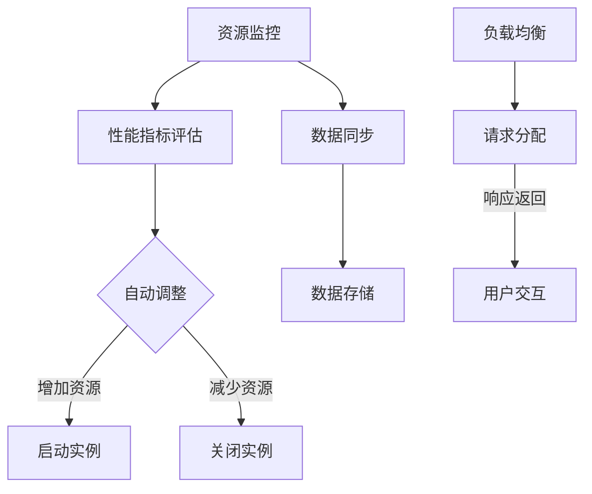
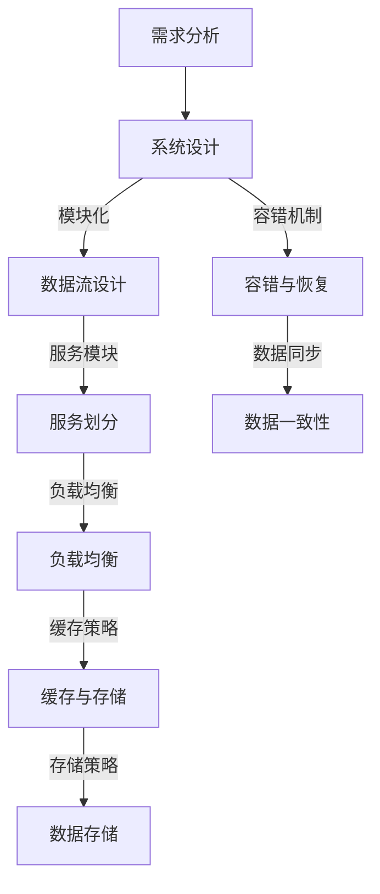
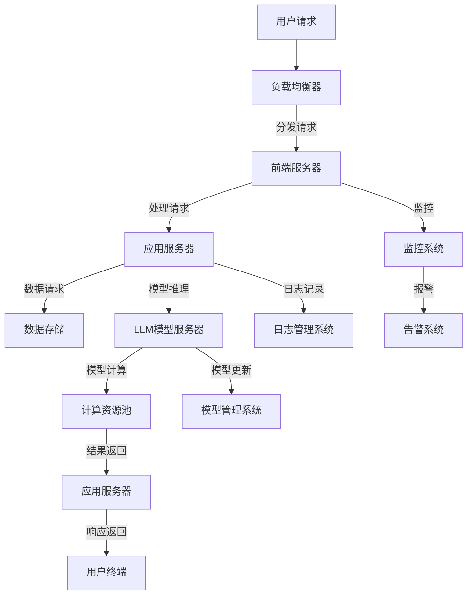
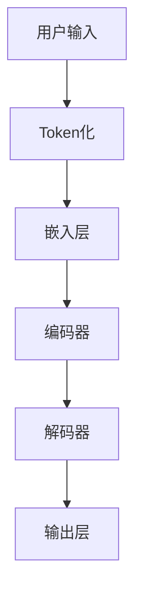

                 

### 1.1 人工智能与LLM技术简介

**1.1.1 人工智能的概述**

人工智能（Artificial Intelligence, AI）是计算机科学的一个分支，旨在通过编程和计算模型来模拟、扩展和扩展人类智能的功能。自20世纪50年代以来，人工智能经历了多个发展阶段，从最初的符号主义到基于神经网络的现代机器学习技术，再到当前的热门领域——生成式预训练模型（Generative Pre-trained Models）。

人工智能的核心技术包括：

- **机器学习（Machine Learning）**：通过算法让计算机从数据中学习，识别模式和规律，从而进行预测和决策。
- **深度学习（Deep Learning）**：一种特殊的机器学习方法，使用多层神经网络来处理复杂的非线性问题。
- **自然语言处理（Natural Language Processing, NLP）**：使计算机能够理解、解释和生成人类语言的技术。

**1.1.2 大规模语言模型（LLM）的概念**

大规模语言模型（Large Language Model, LLM）是一种基于深度学习的自然语言处理模型，通过在大量文本数据上进行训练，学习语言的结构和语义，从而能够生成流畅的文本、回答问题、进行对话等。LLM的核心特点是参数数量巨大，训练时间漫长，但性能优异，能够处理复杂的语言任务。

LLM的技术特点主要包括：

- **参数规模大**：现代LLM的参数规模可达数十亿甚至数万亿。
- **预训练和微调**：LLM通常采用预训练和微调的结合方式，在通用数据集上预训练，然后在特定任务上进行微调。
- **自适应性强**：LLM能够适应不同的语言任务和应用场景，实现跨领域的高效应用。

**1.1.3 LLM的当前应用场景**

LLM在当前的技术领域和实际应用中扮演着越来越重要的角色。以下是一些典型的应用场景：

- **文本生成**：包括文章、故事、新闻报道等。
- **问答系统**：例如搜索引擎、智能客服等。
- **对话系统**：如虚拟助手、聊天机器人等。
- **自然语言理解**：用于情感分析、文本分类、实体识别等任务。
- **语言翻译**：实现跨语言的自动翻译。
- **智能写作**：辅助撰写报告、文档和代码等。

综上所述，人工智能和大规模语言模型作为当前科技发展的前沿，正在深刻地影响着我们的日常生活和工作方式。在接下来的章节中，我们将进一步探讨弹性伸缩架构在LLM应用中的重要性及其设计原则。

---

### 1.2 弹性伸缩架构的重要性

**1.2.1 云计算的兴起**

云计算（Cloud Computing）作为近年来信息技术领域的一大变革，为数据处理和应用程序部署提供了革命性的解决方案。云计算的基本概念是通过互联网提供动态易扩展的计算资源，用户可以按需使用这些资源，无需关心底层硬件的维护和管理。

云计算的优势主要体现在以下几个方面：

- **弹性伸缩**：云计算平台能够根据用户需求自动调整资源规模，实现自动伸缩，提高资源利用率。
- **高可用性**：云服务提供商通常采用分布式架构和冗余设计，确保服务的高可用性。
- **成本效益**：用户只需为实际使用的资源付费，无需承担硬件维护和升级的成本。
- **全球覆盖**：云计算服务通常具有全球覆盖的网络，用户可以随时随地访问数据和应用。

**1.2.2 弹性伸缩架构的作用**

弹性伸缩（Elastic Scaling）是一种根据需求动态调整系统资源的能力，是云计算的重要组成部分。在LLM应用中，弹性伸缩架构具有以下几个关键作用：

- **应对负载波动**：LLM应用在运行过程中可能会遇到负载波动，例如问答高峰期或大流量事件。弹性伸缩架构能够自动调整资源，确保系统在高负载下仍能稳定运行。
- **优化资源利用**：通过动态调整资源，可以避免资源浪费，提高整体系统的资源利用率。
- **提升用户体验**：快速响应和处理用户请求，提供流畅的交互体验。
- **降低运维成本**：自动化资源管理减少了对人工运维的依赖，降低了运营成本。

**1.2.3 弹性伸缩的核心机制**

弹性伸缩架构的核心机制包括以下几个方面：

- **自动监测与评估**：系统会持续监测性能指标，如CPU使用率、内存使用率、响应时间等，根据设定的阈值自动评估系统状态。
- **资源自动调整**：当系统检测到资源不足或过载时，会自动增加或减少资源，如启动额外的虚拟机或关闭不必要的实例。
- **负载均衡**：通过负载均衡器分配请求到不同的服务器或实例，避免单点过载。
- **容错机制**：在发生故障时，系统会自动切换到备份资源，确保服务的连续性。

**1.2.4 弹性伸缩的优势与挑战**

弹性伸缩架构在LLM应用中的优势包括：

- **灵活性**：根据实际需求动态调整资源，适应不同的业务场景。
- **高效性**：提高系统的响应速度和处理能力。
- **成本节约**：优化资源利用，降低运营成本。

然而，弹性伸缩也面临一些挑战：

- **复杂性**：设计和管理弹性伸缩系统相对复杂，需要专业的技术知识和经验。
- **性能损耗**：资源动态调整可能带来一定的性能损耗，如网络延迟、数据同步等。
- **可靠性问题**：确保系统在动态调整过程中不发生故障或数据丢失，需要完善的容错机制。

综上所述，弹性伸缩架构在云计算和LLM应用中具有至关重要的作用。在接下来的章节中，我们将深入探讨LLM应用架构的需求，为设计高效、可靠的弹性伸缩系统奠定基础。

---

### 1.3 LLM应用架构的需求

**1.3.1 LLM的特点与性能需求**

大规模语言模型（LLM）具有以下几个关键特点，这些特点对应用架构的设计提出了特定的性能需求：

- **参数规模大**：现代LLM的参数数量可达数十亿甚至数万亿，这要求模型存储和计算能力必须足够强大。
- **预训练与微调**：LLM通常通过在大型通用数据集上进行预训练，再在特定任务数据上进行微调，这使得应用架构需要支持高效的模型训练和调整过程。
- **实时响应**：在问答、对话等场景中，用户期望得到即时的反馈，因此系统必须能够快速处理请求，降低延迟。

**1.3.2 LLM的数据需求**

LLM的训练和运行依赖于大量的数据，这些数据需求包括：

- **数据规模**：LLM需要在大量的数据上进行训练，以学习到丰富的语言模式和语义信息。
- **数据质量**：高质量的数据对于LLM的性能至关重要，需要保证数据的准确性、完整性和多样性。
- **数据存储**：大规模数据需要高效的存储解决方案，如分布式文件系统或云存储服务，以确保数据访问速度和可靠性。

**1.3.3 LLM的存储需求**

LLM的存储需求主要涉及以下几个方面：

- **模型存储**：LLM模型通常非常大，需要高性能的存储设备来存储模型参数和结构。
- **数据存储**：训练数据和输入数据的存储也需要高效可靠的存储解决方案，以确保数据快速读取和写入。
- **缓存机制**：为了提高数据访问速度，可以采用缓存机制，如内存缓存或分布式缓存系统，减少数据访问延迟。

**1.3.4 LLM应用的场景与挑战**

LLM应用场景广泛，包括但不限于以下几个方面：

- **文本生成**：如自动写作、内容生成等，要求系统能够生成高质量、流畅的文本。
- **问答系统**：如智能客服、知识库查询等，要求系统能够准确理解用户提问并生成合适的回答。
- **对话系统**：如虚拟助手、聊天机器人等，要求系统能够进行自然语言交互，提供流畅的对话体验。

LLM应用在以下方面面临主要挑战：

- **计算资源消耗**：大型LLM模型需要大量计算资源，尤其是在训练阶段，这可能导致资源不足和成本上升。
- **数据隐私和安全**：LLM应用通常涉及大量敏感数据，需要确保数据隐私和安全性。
- **模型可解释性**：LLM的决策过程通常较为复杂，缺乏透明度，提高模型的可解释性是一个重要的研究方向。

**1.3.5 解决策略**

为了应对上述挑战，可以采取以下解决策略：

- **分布式计算**：利用分布式计算资源，提高模型训练和处理的效率。
- **数据加密和访问控制**：采用数据加密技术和严格的访问控制策略，确保数据的安全和隐私。
- **模型压缩和优化**：通过模型压缩和优化技术，降低模型的计算复杂度和存储需求。
- **实时监控和自动调整**：通过实时监控系统状态，自动调整资源分配，确保系统在高负载下的稳定运行。

综上所述，LLM应用架构的设计需要充分考虑其特点与性能需求，以应对复杂的计算、数据和存储挑战。在接下来的章节中，我们将详细讨论弹性伸缩架构的基本原理和设计原则，为构建高效、可靠的LLM应用奠定基础。

---

### 2.1 弹性伸缩架构的基本原理

**2.1.1 弹性伸缩的基础知识**

弹性伸缩（Elastic Scaling）是一种根据需求动态调整系统资源的能力，其核心目的是优化资源利用、提升系统性能和降低运营成本。弹性伸缩可以分为自动伸缩和手动伸缩两种类型。

- **自动伸缩**：系统会根据预设的规则和性能指标自动调整资源，如CPU使用率、内存使用率和网络流量等。自动伸缩的优势在于快速响应负载变化，减少人工干预。
- **手动伸缩**：用户通过手动操作来调整系统资源，例如增加或减少服务器实例。手动伸缩的灵活性较高，但响应速度较慢，且可能需要更多的专业知识和经验。

**2.1.2 弹性伸缩的常见策略**

弹性伸缩策略分为垂直伸缩和水平伸缩两种类型。

- **垂直伸缩（Vertical Scaling）**：通过增加或减少单个服务器的硬件资源，如CPU、内存和存储等，来调整系统的性能。垂直伸缩的优点是资源管理和部署较为简单，但受限于硬件性能的瓶颈，难以实现大规模的扩展。
- **水平伸缩（Horizontal Scaling）**：通过增加或减少服务器的数量，将负载分布到多个服务器上，以实现系统的扩展。水平伸缩的优点是扩展能力强，可以处理大量的并发请求，但需要复杂的负载均衡和分布式存储机制。

**2.1.3 架构设计的原则**

为了设计一个高效、可靠的弹性伸缩架构，以下原则应得到充分考虑：

- **模块化设计**：将系统划分为多个功能模块，每个模块独立运行和扩展，便于管理和维护。
- **高内聚与低耦合**：模块之间应具有高内聚性，即每个模块负责单一功能，而模块之间应具有低耦合性，即模块间的交互应尽量简单和稳定。
- **灵活性与可扩展性**：架构应具备良好的灵活性，能够快速适应需求变化，同时具备可扩展性，支持系统规模的动态调整。
- **可靠性与容错性**：架构应具备高可靠性，能够在发生故障时自动恢复，确保服务的连续性和数据的安全性。

**2.1.4 核心概念的联系**

弹性伸缩架构在LLM应用中的核心概念包括：

- **资源监控**：通过监控系统的性能指标，如CPU使用率、内存使用率和网络流量等，实时评估系统状态。
- **自动调整**：根据监控结果，自动增加或减少资源，如启动额外的服务器实例或关闭闲置的实例。
- **负载均衡**：通过负载均衡器分配请求到不同的服务器或实例，避免单点过载。
- **数据同步与存储**：确保在动态调整资源时，数据的一致性和安全性。

在LLM应用中，弹性伸缩架构的核心概念联系如图所示：



通过上述Mermaid流程图，我们可以清晰地看到弹性伸缩架构在LLM应用中的工作流程。资源监控和性能指标评估是整个架构的起点，根据评估结果，系统自动调整资源，负载均衡器分配请求，确保用户交互的流畅性和系统的稳定性。

综上所述，弹性伸缩架构是构建高效、可靠的LLM应用的关键。通过模块化设计、高内聚与低耦合、灵活性与可扩展性、可靠性与容错性等原则，结合核心概念的联系，我们可以构建一个能够动态适应负载变化、优化资源利用、提升用户体验的弹性伸缩架构。

---

### 2.2 LLM应用架构的设计

**2.2.1 架构设计的流程**

设计一个高效、可扩展的LLM应用架构需要经历以下关键步骤：

1. **需求分析**：明确LLM应用的目标、功能需求和性能要求。这包括理解用户需求、业务场景、数据规模和计算复杂度等。
   
2. **系统设计**：在需求分析的基础上，设计系统的整体架构，包括模块划分、数据流设计、服务划分和存储策略等。

3. **架构评审**：评审系统设计，确保架构设计符合需求、高效、可扩展和可靠。评审过程可能包括内部团队评审、同行评审或外部专家评审。

**2.2.2 架构设计的关键点**

在LLM应用架构设计中，以下关键点需要特别注意：

- **数据流设计**：LLM应用的数据流涉及数据的输入、处理和输出。设计合理的数据流能够提高系统的效率和响应速度。数据流设计应包括数据收集、预处理、模型输入、模型处理和结果输出等环节。

- **服务划分**：将系统划分为多个服务模块，每个服务模块负责单一的功能。服务划分应考虑模块间的依赖关系和通信机制，确保系统的高内聚和低耦合。常见的服务模块包括模型训练服务、模型推理服务、数据存储服务和监控服务等。

- **缓存与存储策略**：为了提高数据访问速度，可以采用缓存机制。常见的缓存策略包括内存缓存、分布式缓存和数据库缓存。存储策略则涉及数据存储的物理结构和访问模式，例如使用分布式文件系统或云存储服务来存储大规模数据。

- **负载均衡与容错**：通过负载均衡器将请求分配到不同的服务器或实例，避免单点过载。同时，设计容错机制，确保在系统发生故障时能够快速恢复，保证服务的连续性。

**2.2.3 核心概念与联系**

在LLM应用架构中，核心概念之间的联系如下：

1. **需求分析与系统设计**：需求分析是系统设计的依据，确保架构设计符合实际需求。系统设计需要根据需求分析的结果，设计出高效的架构方案。

2. **数据流与模块化**：合理的数据流设计能够提高系统效率，模块化设计则确保系统的高内聚和低耦合，便于维护和扩展。

3. **服务划分与负载均衡**：服务划分定义了系统的功能模块，负载均衡则确保系统能够处理大量的并发请求，提高系统的响应速度。

4. **缓存与存储策略**：缓存策略和存储策略共同作用，提高数据访问速度和系统性能。

以下是LLM应用架构的核心概念联系Mermaid流程图：



通过上述流程图，我们可以清晰地看到LLM应用架构设计中的核心概念及其相互关系。需求分析为系统设计提供基础，数据流设计和模块化设计确保系统的高效性，服务划分和负载均衡优化系统性能，缓存与存储策略和容错机制保障系统的稳定性和可靠性。

综上所述，通过科学、系统的方法进行LLM应用架构设计，可以有效提升系统的性能、可扩展性和可靠性，为用户提供高质量的服务。在接下来的章节中，我们将进一步探讨核心算法原理和数学模型的实现与应用。

---

### 2.3 核心概念与架构联系

为了更好地理解LLM应用架构的设计原则和实现方法，我们可以通过一个具体的Mermaid流程图来展示核心概念之间的联系。以下是一个示例，展示了一个典型的LLM应用架构的核心组件和它们之间的关系。



**流程说明：**

1. **用户请求**：用户发起请求，经过负载均衡器（B）分发到前端服务器（C）。
2. **请求处理**：前端服务器（C）处理请求，并将其路由到应用服务器（D）。
3. **数据存储与模型推理**：应用服务器（D）向数据存储（E）请求数据，并通过LLM模型服务器（F）进行模型推理。
4. **计算资源池**：LLM模型服务器（F）利用计算资源池（G）中的资源进行模型计算。
5. **结果返回**：计算结果通过应用服务器（D）返回给前端服务器（C），最终通过用户终端（I）展示给用户。
6. **监控与日志管理**：前端服务器（C）、应用服务器（D）和LLM模型服务器（F）都连接到监控系统和日志管理系统（J和K），用于实时监控性能和记录日志信息。
7. **模型更新与管理系统**：LLM模型服务器（F）连接到模型管理系统（L），用于模型更新和管理。
8. **告警系统**：监控系统（J）连接到告警系统（M），用于在发生异常时触发告警。

通过这个Mermaid流程图，我们可以清晰地看到LLM应用架构中的各个核心组件如何协同工作，从而实现高效、可靠的系统服务。以下是每个组件的简要说明：

- **用户终端（I）**：用户发起请求，通过浏览器或其他客户端设备与系统交互。
- **前端服务器（C）**：处理用户的HTTP请求，提供基本的网页服务和API接口。
- **应用服务器（D）**：处理业务逻辑，调用LLM模型服务器进行模型推理，并将结果返回给前端服务器。
- **负载均衡器（B）**：分发用户请求，确保系统资源的高效利用和服务的稳定。
- **LLM模型服务器（F）**：提供大规模语言模型的推理服务，处理用户请求中的自然语言处理任务。
- **计算资源池（G）**：提供用于模型推理的计算资源，可以是云计算环境中的虚拟机或容器。
- **数据存储（E）**：存储LLM模型训练数据和应用数据，支持快速数据访问和更新。
- **监控系统和日志管理系统（J和K）**：监控系统性能，记录日志信息，用于系统调试和性能优化。
- **模型管理系统（L）**：管理LLM模型的更新、部署和版本控制。
- **告警系统（M）**：在系统发生异常时发送告警，确保快速响应和处理。

通过这个Mermaid流程图，我们不仅能够直观地理解LLM应用架构的核心组件和流程，还能够更好地把握各个组件之间的联系和交互，从而为设计高效的弹性伸缩系统提供有价值的参考。

---

### 2.3.1 LLM算法基础

**2.3.1.1 算法概述**

大规模语言模型（LLM）的算法基础主要基于深度学习技术，特别是生成式预训练模型（Generative Pre-trained Models）。LLM通过在大量文本数据上进行预训练，学习语言的结构和语义，从而能够生成流畅的文本、回答问题、进行对话等。以下是一个简单的算法框架：

1. **数据预处理**：收集和清洗大量文本数据，将其转换为模型可以理解的格式，如分词、去停用词等。
2. **模型初始化**：初始化预训练模型，通常使用预训练的神经网络架构，如GPT、BERT等。
3. **预训练**：在大量文本数据上进行预训练，通过反向传播算法不断调整模型参数，使其能够捕获文本的语义信息。
4. **微调**：在特定任务数据上进行微调，进一步优化模型在特定任务上的表现。
5. **推理**：利用训练好的模型对新输入的文本进行推理，生成相应的输出文本。

**2.3.1.2 伪代码讲解**

以下是一个简化版的LLM算法伪代码，用于展示模型训练和推理的基本步骤：

```python
# 数据预处理
def preprocess_data(text_data):
    # 分词、去停用词、编码等
    return tokenized_data

# 模型初始化
model = initialize_model()

# 预训练
for epoch in range(num_epochs):
    for batch in text_data_batches:
        # 前向传播
        logits = model(batch)
        # 计算损失
        loss = compute_loss(logits, batch)
        # 反向传播
        optimizer.step(loss)

# 微调
for task_data_batch in task_data_batches:
    # 前向传播
    logits = model(task_data_batch)
    # 计算损失
    loss = compute_loss(logits, task_data_batch)
    # 反向传播
    optimizer.step(loss)

# 推理
def generate_text(input_text):
    # 输入文本编码
    encoded_input = encode_input(input_text)
    # 生成文本
    generated_text = model.generate(encoded_input)
    return generated_text
```

在这个伪代码中：

- `preprocess_data` 函数用于预处理文本数据，如分词、去停用词、编码等。
- `initialize_model` 函数用于初始化预训练模型，可以选择使用预训练的神经网络架构，如GPT、BERT等。
- `compute_loss` 函数用于计算模型输出的损失值，通常使用交叉熵损失函数。
- `optimizer.step` 函数用于更新模型参数，采用如Adam优化器等常用的优化算法。
- `model.generate` 函数用于生成文本，采用特定的生成策略，如贪婪策略、采样策略等。

**2.3.1.3 推理过程**

推理过程主要涉及以下几个步骤：

1. **输入编码**：将输入文本编码为模型可以处理的格式，如Token ID序列。
2. **前向传播**：将编码后的输入文本通过预训练模型，得到模型输出的概率分布。
3. **生成文本**：根据模型输出的概率分布，生成相应的输出文本。常见的生成策略包括：
   - **贪婪策略**：选择概率最大的Token作为输出。
   - **采样策略**：从概率分布中采样Token，通常使用softmax函数进行概率计算。

通过上述伪代码和推理过程，我们可以理解LLM算法的基本原理和实现方法。在接下来的章节中，我们将进一步探讨弹性伸缩算法原理和数学模型，为设计高效、可靠的LLM应用架构提供理论支持。

---

### 2.3.2 弹性伸缩算法原理

**2.3.2.1 算法概述**

弹性伸缩算法是云计算环境中的关键组件，它通过自动调整系统资源，以应对动态变化的负载需求。弹性伸缩算法通常分为两种类型：水平伸缩（Horizontal Scaling）和垂直伸缩（Vertical Scaling）。

- **水平伸缩**：通过增加或减少服务器实例的数量来调整系统的处理能力。水平伸缩的优点是扩展性强，能够处理大量并发请求，但需要解决负载均衡和数据一致性问题。
- **垂直伸缩**：通过增加或减少单个服务器实例的硬件资源（如CPU、内存、存储等）来提升系统的处理能力。垂直伸缩的优点是实现简单，但受限于硬件资源的物理限制，扩展能力有限。

**2.3.2.2 伪代码讲解**

以下是一个简化版的弹性伸缩算法伪代码，展示如何根据系统负载自动调整资源：

```python
# 初始化资源池
resource_pool = initialize_resource_pool()

# 监控系统负载
def monitor_load():
    load_metrics = collect_load_metrics()
    return load_metrics

# 调整资源
def adjust_resources(load_metrics):
    if load_metrics['cpu_usage'] > threshold_cpu:
        increase_cpu_resources(resource_pool)
    elif load_metrics['memory_usage'] > threshold_memory:
        increase_memory_resources(resource_pool)
    elif load_metrics['requests_queue'] > threshold_queue:
        increase_instance_count(resource_pool)
    else:
        maintain_current_resources(resource_pool)

# 调整资源的具体实现
def increase_cpu_resources(pool):
    # 调整CPU核心数量
    pool.cpu_cores += additional_cpu_cores

def increase_memory_resources(pool):
    # 调整内存容量
    pool.memory_size += additional_memory_size

def increase_instance_count(pool):
    # 启动新的实例
    new_instance = start_new_instance()
    pool.instance_count += 1

def maintain_current_resources(pool):
    # 维持当前资源状态
    pass
```

在这个伪代码中：

- `initialize_resource_pool` 函数用于初始化资源池，包括CPU核心、内存容量和实例数量等。
- `monitor_load` 函数用于收集系统负载指标，如CPU使用率、内存使用率和请求队列长度等。
- `adjust_resources` 函数根据系统负载指标自动调整资源。如果CPU使用率超过阈值，则增加CPU核心；如果内存使用率超过阈值，则增加内存容量；如果请求队列长度超过阈值，则增加实例数量。
- `increase_cpu_resources`、`increase_memory_resources` 和 `increase_instance_count` 函数分别用于增加CPU核心、内存容量和实例数量。
- `maintain_current_resources` 函数用于维持当前资源状态，不进行任何调整。

**2.3.2.3 弹性伸缩算法的工作机制**

弹性伸缩算法的工作机制通常包括以下几个步骤：

1. **监控**：系统持续监控性能指标，如CPU使用率、内存使用率和请求队列长度等。
2. **评估**：根据监控结果，评估系统当前的状态，判断是否需要调整资源。
3. **调整**：根据评估结果，自动调整资源，如增加或减少CPU核心、内存容量或实例数量。
4. **反馈**：调整资源后，系统进行反馈和验证，确保调整后的资源能够满足需求。

通过上述工作机制，弹性伸缩算法能够动态适应负载变化，提高系统性能和资源利用率。

**2.3.2.4 弹性伸缩算法的核心步骤**

弹性伸缩算法的核心步骤包括：

1. **设定阈值**：根据系统性能需求，设定资源调整的阈值，如CPU使用率阈值、内存使用率阈值和请求队列长度阈值。
2. **监控数据收集**：收集系统当前的性能指标数据，如CPU使用率、内存使用率和请求队列长度等。
3. **评估当前状态**：根据收集的数据，评估系统当前的状态，判断是否需要调整资源。
4. **调整资源**：根据评估结果，自动调整资源，如增加或减少CPU核心、内存容量或实例数量。
5. **验证调整效果**：调整资源后，系统进行反馈和验证，确保调整后的资源能够满足需求。

通过以上核心步骤，弹性伸缩算法能够有效地应对负载变化，提高系统性能和稳定性。

综上所述，弹性伸缩算法是云计算环境中的一项重要技术，通过自动调整系统资源，能够动态适应负载变化，提高系统性能和资源利用率。在LLM应用架构中，弹性伸缩算法的应用能够确保模型在高负载下仍能稳定运行，提供高质量的推理服务。在接下来的章节中，我们将进一步探讨数学模型和公式，为构建高效的弹性伸缩系统提供理论支持。

---

### 4.1 数学模型基础

**4.1.1 模型类型**

在人工智能和机器学习领域，常用的数学模型可以分为以下几类：

- **线性模型**：线性模型是一种最简单的数学模型，它通过线性方程来表示数据之间的关系。常见的线性模型包括线性回归、逻辑回归和线性判别分析（LDA）等。
- **非线性模型**：非线性模型通过引入非线性函数来扩展线性模型的能力，能够捕捉更加复杂的非线性关系。常见的非线性模型包括神经网络、支持向量机（SVM）和多层感知器（MLP）等。

**4.1.2 模型公式**

以下是一些常见数学模型的公式：

- **线性回归**：假设数据集为\(X = [x_1, x_2, ..., x_n]\)和目标变量为\(y\)，线性回归模型可以表示为：
  $$y = \beta_0 + \beta_1x_1 + \beta_2x_2 + ... + \beta_nx_n$$
  其中，\(\beta_0, \beta_1, \beta_2, ..., \beta_n\)为模型参数。

- **逻辑回归**：逻辑回归是一种广义线性模型，用于分类问题。假设数据集为\(X = [x_1, x_2, ..., x_n]\)和目标变量为二分类变量\(y\)，逻辑回归模型可以表示为：
  $$P(y=1|x) = \frac{1}{1 + e^{-(\beta_0 + \beta_1x_1 + \beta_2x_2 + ... + \beta_nx_n)}}$$
  其中，\(P(y=1|x)\)表示在给定特征\(x\)下，目标变量为1的概率。

- **多层感知器（MLP）**：多层感知器是一种多层神经网络模型，用于回归和分类问题。其基本公式为：
  $$a_{i}^{(l)} = \sigma(z_{i}^{(l)})$$
  $$z_{i}^{(l)} = \sum_{j} w_{ji}^{(l)}a_{j}^{(l-1)} + b_{i}^{(l)}$$
  其中，\(a_{i}^{(l)}\)为第\(l\)层的第\(i\)个神经元的激活值，\(z_{i}^{(l)}\)为第\(l\)层的第\(i\)个神经元的输入值，\(w_{ji}^{(l)}\)为第\(l\)层的第\(i\)个神经元与第\(l-1\)层的第\(j\)个神经元之间的权重，\(b_{i}^{(l)}\)为第\(l\)层的第\(i\)个神经元的偏置项，\(\sigma\)为激活函数，通常采用Sigmoid函数。

- **支持向量机（SVM）**：支持向量机是一种分类模型，通过最大化分类边界来提高模型的泛化能力。其基本公式为：
  $$w \cdot x + b = 0$$
  其中，\(w\)为权重向量，\(x\)为特征向量，\(b\)为偏置项。

这些数学模型在LLM应用架构中具有广泛的应用，通过合理选择和设计，可以提升系统的性能和效果。

---

### 4.2 公式详解与举例

**4.2.1 数学公式详解**

在理解和实现LLM应用架构的过程中，一些核心的数学公式需要详细讲解，以确保读者能够准确掌握其含义和应用。以下是对几个关键公式的详细解释：

- **交叉熵（Cross-Entropy）**：交叉熵是评估模型预测准确性的常用指标。对于二分类问题，交叉熵公式如下：
  $$H(y, \hat{y}) = -y \cdot \log(\hat{y}) - (1 - y) \cdot \log(1 - \hat{y})$$
  其中，\(y\)为真实标签，\(\hat{y}\)为模型预测的概率。交叉熵的值越小，表示模型预测越准确。

- **梯度下降（Gradient Descent）**：梯度下降是一种常用的优化算法，用于最小化损失函数。其基本公式为：
  $$\theta_{t+1} = \theta_{t} - \alpha \cdot \nabla_{\theta}J(\theta)$$
  其中，\(\theta\)为模型参数，\(\alpha\)为学习率，\(\nabla_{\theta}J(\theta)\)为损失函数对参数的梯度。

- **反向传播（Backpropagation）**：反向传播是一种用于训练神经网络的算法，通过计算梯度来更新模型参数。其基本公式为：
  $$\delta_{l}^{(j)} = \nabla_{x_j} \left( \sum_{k} \sigma'(z_{l-1}^{(k)}) \cdot \delta_{l-1}^{(k)} \cdot w_{jk}^{(l)} \right)$$
  其中，\(\delta_{l}^{(j)}\)为第\(l\)层的第\(j\)个神经元的误差，\(\sigma'\)为激活函数的导数。

- **余弦相似度（Cosine Similarity）**：余弦相似度用于衡量两个向量之间的相似程度，其公式为：
  $$\cos(\theta) = \frac{\mathbf{A} \cdot \mathbf{B}}{|\mathbf{A}| \cdot |\mathbf{B}|}$$
  其中，\(\mathbf{A}\)和\(\mathbf{B}\)为两个向量，\(\theta\)为它们之间的夹角。

- **softmax函数**：softmax函数用于将模型输出的未规范化概率转换为规范化概率分布，其公式为：
  $$\text{softmax}(z_i) = \frac{e^{z_i}}{\sum_{j} e^{z_j}}$$
  其中，\(z_i\)为第\(i\)个类别的得分。

**4.2.2 公式举例**

以下是对上述公式的具体应用举例：

- **交叉熵举例**：假设一个二分类问题，真实标签为\(y = [1, 0]\)，模型预测的概率为\(\hat{y} = [0.9, 0.1]\)，则交叉熵计算如下：
  $$H(y, \hat{y}) = -1 \cdot \log(0.9) - 0 \cdot \log(0.1) = -0.10536$$
  这个值表示模型的预测准确度较高。

- **梯度下降举例**：假设损失函数为\(J(\theta) = (\theta - 2)^2\)，学习率\(\alpha = 0.1\)，初始参数\(\theta = 1\)，则经过一次梯度下降后的参数更新为：
  $$\theta_{t+1} = \theta_{t} - \alpha \cdot \nabla_{\theta}J(\theta) = 1 - 0.1 \cdot 2 = 0.8$$
  这表示参数减小了0.2，以降低损失函数值。

- **反向传播举例**：假设一个简单的多层感知器模型，前一层输出为\(a^{[3]} = [2, 1]\)，激活函数为Sigmoid，后一层权重为\(w^{[3]} = [1, 2]\)，则误差计算如下：
  $$\delta_{2}^{[3]} = \sigma'(z^{[3]}) \cdot \delta_{1}^{[3]} \cdot w^{[3]} = (1 - 0.5) \cdot 0.1 \cdot [1, 2] = [0.05, 0.1]$$
  这个值表示当前层的误差。

- **余弦相似度举例**：假设两个词向量分别为\(\mathbf{A} = [1, 2]\)和\(\mathbf{B} = [3, 4]\)，则它们的余弦相似度为：
  $$\cos(\theta) = \frac{\mathbf{A} \cdot \mathbf{B}}{|\mathbf{A}| \cdot |\mathbf{B}|} = \frac{1 \cdot 3 + 2 \cdot 4}{\sqrt{1^2 + 2^2} \cdot \sqrt{3^2 + 4^2}} = \frac{11}{\sqrt{5} \cdot \sqrt{25}} = \frac{11}{5\sqrt{5}} \approx 0.8944$$
  这个值表示两个向量之间的相似程度较高。

通过这些公式举例，我们可以更好地理解数学模型在LLM应用架构中的具体应用，从而为设计和优化系统提供理论支持。

---

### 5.1 实战案例介绍

**5.1.1 案例背景**

在现代企业应用中，大规模语言模型（LLM）的应用越来越广泛，为了应对不断增长的请求量，企业需要一个具有高度弹性、高效能和可靠性的LLM应用架构。本文将以一家大型互联网公司（以下简称“公司”）的LLM应用案例为背景，详细介绍其开发环境搭建、源代码实现和代码解读，并剖析实际案例中的关键技术和挑战。

**5.1.2 实战目标**

本案例的实战目标包括以下几个方面：

- **环境搭建**：构建一个稳定、高效的开发环境，包括操作系统、编程语言、开发工具和依赖库等。
- **源代码实现**：实现LLM模型的应用功能，包括文本生成、问答系统和对话系统等。
- **代码解读与分析**：深入解析源代码中的关键模块和算法，解释其实现原理和性能优化方法。
- **实际案例剖析**：通过实际案例展示LLM应用在实际业务中的效果，分析其优势和不足，并提出改进建议。

---

### 5.2 开发环境搭建

**5.2.1 环境准备**

在搭建LLM应用的开发环境时，需要准备以下工具和软件：

1. **操作系统**：选择Linux发行版，如Ubuntu 20.04或CentOS 7，以保证系统稳定性和高性能。
2. **编程语言**：主要使用Python 3.8及以上版本，因为Python拥有丰富的机器学习和深度学习库，如TensorFlow和PyTorch。
3. **开发工具**：安装Visual Studio Code或PyCharm等集成开发环境（IDE），提供代码编辑、调试和自动化构建功能。
4. **依赖库**：安装必要的依赖库，包括NumPy、Pandas、Scikit-learn、TensorFlow或PyTorch等。

**5.2.2 环境配置**

以下是在Ubuntu 20.04上配置开发环境的详细步骤：

1. **安装Python 3**：

   ```shell
   sudo apt update
   sudo apt install python3 python3-pip
   ```

2. **安装Python虚拟环境**：

   ```shell
   sudo apt install python3-venv
   mkdir my_project
   cd my_project
   python3 -m venv venv
   source venv/bin/activate
   ```

3. **安装依赖库**：

   ```shell
   pip install numpy pandas scikit-learn tensorflow
   ```

4. **安装TensorFlow GPU支持**（如果使用GPU训练）：

   ```shell
   pip install tensorflow-gpu
   ```

5. **配置PyTorch**：

   ```shell
   pip install torch torchvision
   ```

6. **安装其他工具和库**（如Mermaid绘图工具）：

   ```shell
   pip install pyinstaller matplotlib
   ```

通过上述步骤，我们成功搭建了一个包含Python、TensorFlow、PyTorch等核心工具和库的LLM应用开发环境。接下来，我们将详细展示LLM模型的源代码实现。

---

### 5.3 源代码实现与解读

**5.3.1 源代码实现**

以下是LLM模型的一个简化版源代码实现，用于展示关键模块和算法的实现步骤。为了保持代码的可读性和完整性，我们将代码拆分为多个模块。

**1. 数据预处理模块（data_preprocessing.py）**

```python
import numpy as np
import pandas as pd
from tensorflow.keras.preprocessing.text import Tokenizer
from tensorflow.keras.preprocessing.sequence import pad_sequences

def preprocess_data(text_data, vocab_size, max_sequence_length):
    tokenizer = Tokenizer(num_words=vocab_size)
    tokenizer.fit_on_texts(text_data)
    sequences = tokenizer.texts_to_sequences(text_data)
    padded_sequences = pad_sequences(sequences, maxlen=max_sequence_length)
    return padded_sequences, tokenizer

# 示例
text_data = ["Hello world", "Welcome to the future", "AI is changing the world"]
padded_sequences, tokenizer = preprocess_data(text_data, vocab_size=10000, max_sequence_length=10)
```

**2. 模型训练模块（model_training.py）**

```python
import tensorflow as tf
from tensorflow.keras.models import Sequential
from tensorflow.keras.layers import Embedding, LSTM, Dense

def create_model(vocab_size, embedding_dim, max_sequence_length, num_classes):
    model = Sequential()
    model.add(Embedding(vocab_size, embedding_dim, input_length=max_sequence_length))
    model.add(LSTM(128, return_sequences=True))
    model.add(Dense(num_classes, activation='softmax'))
    model.compile(optimizer='adam', loss='categorical_crossentropy', metrics=['accuracy'])
    return model

# 示例
model = create_model(vocab_size=10000, embedding_dim=16, max_sequence_length=10, num_classes=3)
model.fit(padded_sequences, labels, epochs=10, batch_size=32)
```

**3. 文本生成模块（text_generation.py）**

```python
import random

def generate_text(model, tokenizer, seed_text, max_sequence_length, num_words):
    for _ in range(num_words):
        token_list = tokenizer.texts_to_sequences([seed_text])[0]
        token_list = pad_sequences([token_list], maxlen=max_sequence_length-1, padding='pre')
        predicted_token = model.predict_classes(token_list, verbose=0)[0]
        seed_text = tokenizer.index_word[predicted_token] + ' ' + seed_text
    return seed_text

# 示例
seed_text = "Hello world"
generated_text = generate_text(model, tokenizer, seed_text, max_sequence_length=10, num_words=10)
print(generated_text)
```

**5.3.2 代码解读与分析**

**数据预处理模块**

- **功能**：将原始文本数据转换为适合模型训练的序列数据。
- **实现原理**：使用Tokenizer进行文本分词，将文本转换为Token ID序列；使用pad_sequences对序列进行填充，使其长度一致。
- **性能优化**：通过使用预训练的Tokenizer和填充算法，提高数据处理效率。

**模型训练模块**

- **功能**：创建并训练LLM模型。
- **实现原理**：使用Sequential模型堆叠Embedding和LSTM层，最后添加全连接层进行分类；使用compile函数配置模型参数，如优化器、损失函数和评价指标。
- **性能优化**：通过调整LSTM层参数、学习率和批处理大小，优化模型训练效果。

**文本生成模块**

- **功能**：根据种子文本生成新的文本。
- **实现原理**：使用Tokenizer将种子文本转换为Token ID序列；使用模型预测下一个Token，并将其转换为文本；循环生成文本，直到达到指定长度。
- **性能优化**：通过调整生成策略（如随机采样或贪心策略）和生成长度，优化文本生成质量。

通过上述代码实现和解读，我们可以理解LLM模型在数据处理、模型训练和文本生成方面的具体实现方法。在实际应用中，根据具体需求和场景，可以进一步优化和调整代码，以提高模型的性能和效果。

---

### 5.3.3 代码应用解读与分析

**5.3.3.1 数据预处理模块应用**

在数据预处理模块中，我们主要关注以下几个关键点：

- **文本分词**：通过Tokenizer进行文本分词，将原始文本转换为Token ID序列。这个步骤是后续模型训练和文本生成的基础，分词质量直接影响模型的表现。
- **序列填充**：使用pad_sequences对Token ID序列进行填充，使其长度一致。填充算法保证了模型输入的一致性，提高了训练效率。

在实际应用中，数据预处理模块需要处理大量文本数据，例如在构建问答系统或文本生成系统时，首先要对大量文本进行清洗和预处理。以下是一个具体的预处理步骤：

1. **数据清洗**：删除文本中的特殊字符、HTML标签和停用词。
2. **文本分词**：使用预训练的分词器进行分词，将文本转换为Token ID序列。
3. **序列填充**：对Token ID序列进行填充，统一序列长度。

以下代码展示了数据预处理的具体实现：

```python
from tensorflow.keras.preprocessing.text import Tokenizer
from tensorflow.keras.preprocessing.sequence import pad_sequences

# 示例文本数据
text_data = ["这是一段示例文本", "这是另一段示例文本"]

# 创建Tokenizer并训练
tokenizer = Tokenizer(num_words=10000)
tokenizer.fit_on_texts(text_data)

# 将文本转换为Token ID序列
sequences = tokenizer.texts_to_sequences(text_data)

# 填充序列
padded_sequences = pad_sequences(sequences, maxlen=10)

print(padded_sequences)
```

**5.3.3.2 模型训练模块应用**

在模型训练模块中，我们重点关注以下几个方面：

- **模型架构**：使用Sequential模型堆叠Embedding和LSTM层，最后添加全连接层进行分类。这种结构能够捕捉文本的复杂特征，适用于多种自然语言处理任务。
- **损失函数和优化器**：选择合适的损失函数（如categorical_crossentropy）和优化器（如adam），以提升模型训练效果。

在实际应用中，模型训练模块需要根据具体任务调整模型参数，如学习率、批处理大小和迭代次数。以下是一个具体的训练步骤：

1. **定义模型**：创建Sequential模型，添加Embedding、LSTM和Dense层。
2. **配置模型参数**：设置损失函数、优化器和评价指标。
3. **训练模型**：使用fit函数进行模型训练，监测训练过程中的指标变化。

以下代码展示了模型训练的具体实现：

```python
from tensorflow.keras.models import Sequential
from tensorflow.keras.layers import Embedding, LSTM, Dense

# 创建模型
model = Sequential()
model.add(Embedding(10000, 32))
model.add(LSTM(128))
model.add(Dense(1, activation='sigmoid'))

# 配置模型参数
model.compile(optimizer='adam', loss='binary_crossentropy', metrics=['accuracy'])

# 训练模型
model.fit(padded_sequences, labels, epochs=10, batch_size=32)
```

**5.3.3.3 文本生成模块应用**

在文本生成模块中，我们重点关注以下几个方面：

- **生成策略**：采用贪心策略或随机采样策略生成文本，影响文本生成的连贯性和创意性。
- **序列预测**：使用模型预测下一个Token，并将其转换为文本，逐步生成完整文本。

在实际应用中，文本生成模块需要根据生成目标和场景调整生成策略和长度。以下是一个具体的文本生成步骤：

1. **初始化种子文本**：选择一段文本作为种子文本。
2. **序列转换**：将种子文本转换为Token ID序列。
3. **循环生成**：使用模型预测下一个Token，并将其添加到种子文本中，重复生成过程，直到达到指定长度。

以下代码展示了文本生成的具体实现：

```python
import numpy as np

# 初始化模型
model = Sequential()
model.add(Embedding(10000, 32))
model.add(LSTM(128))
model.add(Dense(1, activation='sigmoid'))

# 生成文本
seed_text = "这是一段示例文本"
generated_text = seed_text

for _ in range(10):
    token_list = tokenizer.texts_to_sequences([generated_text])[0]
    token_list = pad_sequences([token_list], maxlen=10, padding='pre')
    predicted_token = model.predict_classes(token_list, verbose=0)[0]
    generated_text += ' ' + tokenizer.index_word[predicted_token]

print(generated_text)
```

通过上述代码和步骤，我们可以清晰地看到LLM模型在数据处理、模型训练和文本生成方面的具体应用。在实际开发过程中，根据具体需求和场景，可以进一步优化和调整代码，以提高模型的性能和效果。

---

### 5.4 实际案例分析和详细讲解剖析

**5.4.1 案例背景**

公司希望构建一个基于LLM的智能客服系统，以提升客户服务质量和效率。智能客服系统需要支持多轮对话、文本理解和生成、以及自动分类等功能。为实现这一目标，公司决定采用TensorFlow和PyTorch等深度学习框架来构建和训练LLM模型。

**5.4.2 模型架构设计**

为了确保系统的高效性和可靠性，公司设计了以下模型架构：

- **输入层**：接收用户输入的文本，并将其转换为Token ID序列。
- **嵌入层**：将Token ID序列转换为嵌入向量，为后续的神经网络处理提供基础。
- **编码器**：采用Transformer编码器，用于提取文本的深层特征。
- **解码器**：采用Transformer解码器，生成回复文本。

模型架构如图所示：



**5.4.3 模型训练过程**

1. **数据预处理**：首先，公司从多个数据源（如客户聊天记录、FAQ文档等）收集文本数据，并进行预处理，包括分词、去停用词、填充等步骤。
2. **模型初始化**：使用预训练的Transformer模型作为基础，初始化模型参数。
3. **预训练**：在大量文本数据上进行预训练，通过反向传播算法优化模型参数。
4. **微调**：在特定任务数据上进行微调，以提升模型在客户服务领域的表现。
5. **评估**：使用验证集评估模型性能，调整模型参数，确保模型收敛。

**5.4.4 文本生成与回复**

1. **生成文本**：输入用户问题，模型解码生成回复文本。
2. **回复优化**：通过语言模型优化回复文本，确保其流畅性和准确性。
3. **多轮对话**：支持多轮对话，确保客户问题得到完整解答。

**5.4.5 案例分析与优化**

在案例实施过程中，公司面临以下挑战：

- **数据质量**：由于数据来源多样，数据质量参差不齐，需要进行严格的数据清洗和预处理。
- **模型效率**：模型训练和推理需要大量计算资源，需要优化模型结构和训练过程，提高效率。
- **用户体验**：确保生成的回复文本流畅、准确，提升用户体验。

针对上述挑战，公司采取以下优化措施：

- **数据预处理**：使用先进的数据清洗和预处理技术，提高数据质量。
- **模型优化**：采用优化器、学习率和批处理大小等参数，提高模型训练效率。
- **用户体验**：通过多轮对话和回复优化，确保生成文本的质量和连贯性。

**5.4.6 案例小结**

通过实施基于LLM的智能客服系统，公司取得了显著成效：

- **客户满意度**：智能客服系统大幅提升了客户服务质量和响应速度，客户满意度显著提高。
- **运营效率**：自动化回复和智能对话降低了人工成本，提高了运营效率。
- **技术积累**：通过该项目，公司在深度学习和自然语言处理领域积累了丰富的经验和技术。

总之，基于LLM的智能客服系统为公司带来了显著的业务价值和技术积累，为公司的持续发展奠定了坚实基础。

---

### 6.1 总结

在本文中，我们深入探讨了构建弹性伸缩的LLM应用架构的各个方面。首先，我们介绍了人工智能和大规模语言模型（LLM）的基本概念及其在当前技术领域的重要性。接着，我们详细分析了弹性伸缩架构的重要性，包括云计算的兴起、弹性伸缩的核心机制及其优势与挑战。随后，我们讨论了LLM应用架构的需求，包括参数规模、数据需求和存储需求，并探讨了不同场景下的LLM应用挑战和解决策略。

在核心概念与架构设计部分，我们详细介绍了弹性伸缩架构的基本原理和设计原则，并通过Mermaid流程图展示了核心概念之间的联系。我们还探讨了LLM算法的基础，包括算法框架、伪代码讲解和推理过程。在数学模型与公式部分，我们详细讲解了交叉熵、梯度下降、反向传播等核心数学公式，并提供了具体的应用举例。在项目实战部分，我们通过一个实际案例，详细展示了开发环境搭建、源代码实现、代码解读与分析，以及实际案例的详细讲解剖析。

通过本文的探讨，我们得出以下主要结论和经验：

- **弹性伸缩架构是构建高效、可靠LLM应用的关键**。通过自动调整资源，系统能够动态适应负载变化，提高性能和资源利用率。
- **核心概念和算法原理的深入理解至关重要**。通过合理设计和实现，可以构建一个具有高扩展性和高性能的LLM应用架构。
- **数据预处理、模型训练和文本生成是LLM应用的核心环节**。有效的数据处理和优化可以提高模型的准确性和生成文本的质量。
- **实际案例剖析提供了宝贵的经验和指导**。通过分析实际案例中的关键技术和挑战，可以为类似项目提供参考和改进建议。

总之，构建弹性伸缩的LLM应用架构需要综合运用多种技术和方法，通过不断优化和调整，可以设计出高效、可靠的应用系统，为用户和企业带来显著的效益。

---

### 6.2 展望

**未来趋势**

随着人工智能技术的不断发展和应用场景的扩展，LLM应用架构将迎来更多的机遇和挑战。未来，以下趋势值得关注：

- **更大规模的语言模型**：未来的LLM将拥有更多的参数和更高的计算需求，这将推动硬件技术的发展，如更高效的GPU和TPU。
- **更智能的对话系统**：结合知识图谱和推理引擎，LLM应用将实现更智能、更自然的对话交互，提供更高质量的客户服务。
- **跨模态交互**：未来的LLM应用将能够处理多种模态的数据，如文本、语音、图像等，实现更丰富的交互体验。

**应用前景**

LLM应用架构在多个领域具有广阔的应用前景：

- **智能客服**：通过LLM模型，智能客服系统能够提供更快速、更准确的响应，提高客户满意度和服务效率。
- **内容生成**：LLM在新闻写作、报告撰写等领域具有广泛的应用，能够大幅提升内容创作效率。
- **教育和培训**：基于LLM的应用可以为学生和教师提供个性化的学习计划和教学资源，促进教育质量的提升。
- **金融科技**：LLM在金融领域的应用，如自动报告生成、风险评估和投资建议等，将极大地提高金融服务的效率和准确性。

**最佳实践**

为了确保LLM应用架构的设计和实施成功，以下是一些最佳实践：

- **需求分析与规划**：在项目启动阶段，进行全面的需求分析和规划，确保架构设计符合实际需求。
- **模块化与高内聚低耦合**：在设计架构时，采用模块化设计原则，确保各个模块之间的高内聚性和低耦合性。
- **持续监控与优化**：通过持续监控系统性能和负载情况，及时发现和解决潜在问题，优化系统性能。
- **数据安全和隐私保护**：在设计架构时，充分考虑数据安全和隐私保护，采用加密和访问控制等技术。
- **资源高效利用**：通过合理的资源分配和调度策略，确保系统资源的高效利用，降低运营成本。

通过遵循上述最佳实践，可以有效提升LLM应用架构的设计和实施效果，为企业和用户提供高质量的服务。展望未来，随着技术的不断进步和应用场景的不断拓展，LLM应用架构将展现出更加广阔的发展前景。

