                 

```

```markdown
# 《构建敏捷迭代的LLM工程技术架构》

> 关键词：LLM，敏捷迭代，工程技术架构，自然语言处理，深度学习，模型优化

> 摘要：本文深入探讨了如何构建敏捷迭代的LLM工程技术架构。首先介绍了LLM的基本概念和重要性，随后讲解了自然语言处理的基础知识。接着，文章详细阐述了敏捷迭代方法论及其在LLM工程中的应用，包括数据管理、模型性能优化和团队协作等关键活动。最后，通过具体案例分析，展示了敏捷迭代方法在LLM工程实践中的成功应用。

----------------------------------------------------------------

## 第一部分：引入与概述

### 第1章：LLM及其重要性

#### 1.1 LLM的定义与价值

**背景介绍**：大型语言模型（LLM）是自然语言处理（NLP）领域的一项重要技术，它能够对自然语言文本进行理解和生成。

**核心概念与联系**：
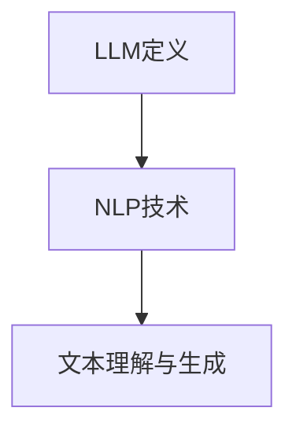

**核心算法原理讲解**：
```python
# 伪代码：LLM的基本原理
def LLM(input_text):
    # 输入文本编码
    encoded_text = encode(input_text)
    # 文本序列生成
    output_sequence = generate_sequence(encoded_text)
    return decode(output_sequence)
```

**数学模型和数学公式**：
$$
\text{LLM}(\text{input\_text}) = \text{softmax}(\text{W}[\text{input\_text}])
$$
其中，\( \text{W} \) 是权重矩阵，\( \text{softmax} \) 函数用于将输出概率分布。

**项目实战**：举例说明LLM在机器翻译中的应用。

#### 1.2 LLM的发展历程

**核心概念与联系**：
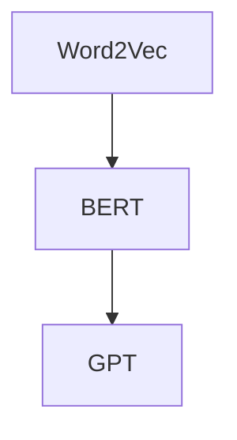

**核心算法原理讲解**：
```python
# 伪代码：LLM关键算法的演变
def LLM_old(input_text):
    # 基于Word2Vec的文本编码
    encoded_text = word2vec(input_text)
    # 文本序列生成
    output_sequence = generate_sequence(encoded_text)
    return decode(output_sequence)

def LLM_new(input_text):
    # 基于Transformer的文本编码
    encoded_text = transformer(input_text)
    # 文本序列生成
    output_sequence = generate_sequence(encoded_text)
    return decode(output_sequence)
```

#### 1.3 LLM的应用场景

**核心概念与联系**：
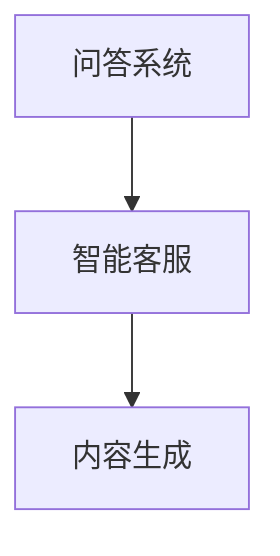

**项目实战**：分析某企业使用LLM构建智能客服系统的实例。

### 第2章：敏捷迭代方法论

#### 2.1 敏捷迭代的起源与原则

**核心概念与联系**：
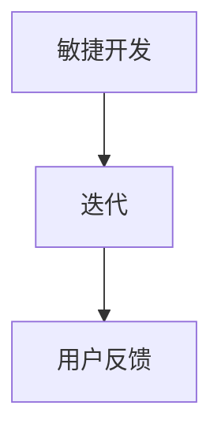

**核心算法原理讲解**：
```python
# 伪代码：敏捷迭代的基本步骤
def agile_development(task):
    # 初始化任务
    initialize_task(task)
    # 迭代任务
    for iteration in range(num_iterations):
        # 执行迭代
        execute_iteration(task, iteration)
        # 获取用户反馈
        feedback = get_user_feedback(task)
        # 更新任务
        update_task(task, feedback)
    return task
```

**数学模型和数学公式**：
$$
\text{AgileDevelopment}(\text{task}) = \text{Iterate}(\text{task}, \text{num\_iterations}, \text{get\_user\_feedback}, \text{update\_task})
$$`

**项目实战**：探讨敏捷迭代在软件开发中的应用。

#### 2.2 敏捷迭代的实践流程

**核心概念与联系**：
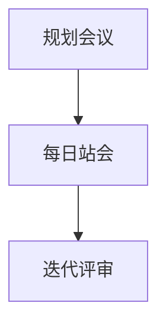

**核心算法原理讲解**：
```python
# 伪代码：敏捷迭代的实践流程
def agile_practice(task):
    # 规划会议
    plan_meeting(task)
    # 每日站会
    daily站立会议(task)
    # 迭代评审
    reviewIteration(task)
    return task
```

**项目实战**：介绍敏捷迭代在LLM工程中的应用。

#### 2.3 敏捷迭代与LLM工程的结合

**核心概念与联系**：
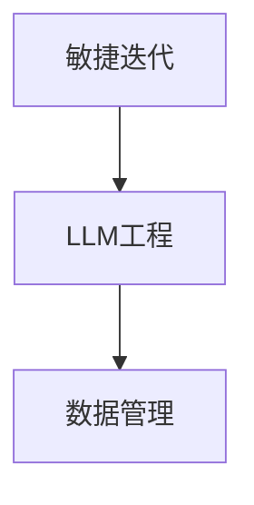

**核心算法原理讲解**：
```python
# 伪代码：敏捷迭代与LLM工程的结合
def agile_in_LLM(task):
    # 使用敏捷迭代方法管理LLM工程
    agile_practice(LLM_engineering(task))
    return LLM_engineering
```

**项目实战**：分析敏捷迭代在LLM工程中的具体实施。

## 第二部分：LLM基础知识

### 第3章：自然语言处理基础

#### 3.1 NLP的核心任务

**核心概念与联系**：
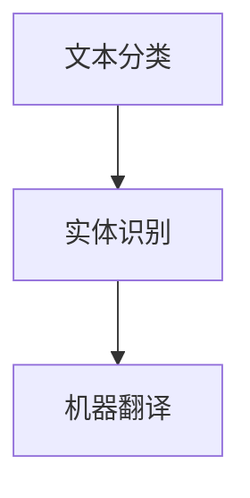

**核心算法原理讲解**：
```python
# 伪代码：NLP的核心任务
def NLP_task(text):
    # 文本分类
    classification = classify_text(text)
    # 实体识别
    entities = identify_entities(text)
    # 机器翻译
    translation = translate_text(text)
    return classification, entities, translation
```

**数学模型和数学公式**：
$$
P(\text{classification}|\text{text}) = \text{softmax}(\text{W}[\text{text}])
$$`

**项目实战**：举例说明NLP任务在文本分析中的应用。

#### 3.2 语言模型的基本原理

**核心概念与联系**：
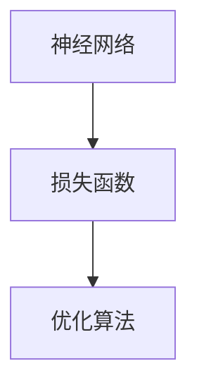

**核心算法原理讲解**：
```python
# 伪代码：语言模型的基本原理
def language_model(text):
    # 初始化神经网络
    neural_network = initialize_network()
    # 训练模型
    loss_function = train_model(neural_network, text)
    # 优化模型
    optimizer = optimize_model(neural_network, loss_function)
    return neural_network
```

**数学模型和数学公式**：
$$
\text{Loss} = \sum_{i} (\text{y}_i - \text{y}_\hat{i})^2
$$`

**项目实战**：分析语言模型在文本生成中的应用。

#### 3.3 词向量表示与语义分析

**核心概念与联系**：
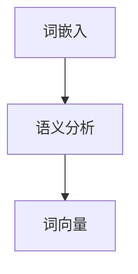

**核心算法原理讲解**：
```python
# 伪代码：词向量表示与语义分析
def word_embedding(word):
    # 初始化词向量
    embedding = initialize_embedding(word)
    # 计算词向量
    vector = calculate_vector(embedding)
    return vector

def semantic_analysis(words):
    # 初始化语义分析模型
    model = initialize_model()
    # 分析词向量
    analysis = analyze_vector(model, words)
    return analysis
```

**数学模型和数学公式**：
$$
\text{Word\_Vector} = \text{ Embedding}(word)
$$`

**项目实战**：探讨词向量在语义分析中的应用。

### 第4章：大型语言模型（LLM）架构

#### 4.1 LLM的结构与原理

**核心概念与联系**：
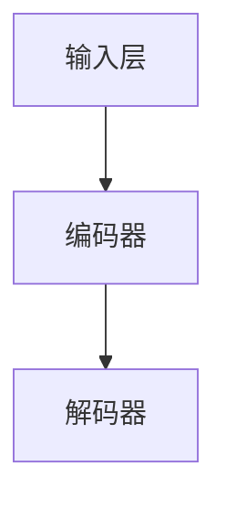

**核心算法原理讲解**：
```python
# 伪代码：LLM的结构与原理
class LanguageModel:
    def __init__(self):
        # 初始化输入层、编码器和解码器
        self.input_layer = initialize_input_layer()
        self.encoder = initialize_encoder()
        self.decoder = initialize_decoder()

    def forward(self, input_text):
        # 前向传播
        encoded_text = self.encoder(input_text)
        output_sequence = self.decoder(encoded_text)
        return decode(output_sequence)
```

**数学模型和数学公式**：
$$
\text{Output} = \text{Decoder}(\text{Encoder}(\text{Input}))
$$`

**项目实战**：分析LLM在文本生成中的性能。

#### 4.2 训练数据与数据预处理

**核心概念与联系**：
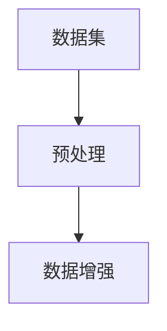

**核心算法原理讲解**：
```python
# 伪代码：训练数据与数据预处理
def preprocess_data(data):
    # 数据清洗
    cleaned_data = clean_data(data)
    # 数据增强
    augmented_data = augment_data(cleaned_data)
    return augmented_data
```

**数学模型和数学公式**：
$$
\text{Preprocessed\_Data} = \text{augment}(\text{clean}(\text{Data}))
$$`

**项目实战**：探讨如何提升LLM模型的训练效果。

#### 4.3 模型训练与优化

**核心概念与联系**：
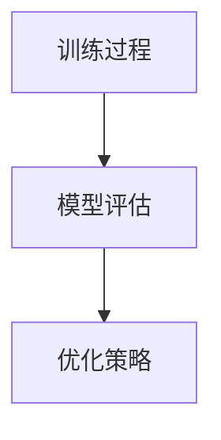

**核心算法原理讲解**：
```python
# 伪代码：模型训练与优化
def train_and_optimize(model, data):
    # 训练模型
    for epoch in range(num_epochs):
        # 训练迭代
        for batch in data:
            model.train(batch)
        # 评估模型
        evaluate_model(model)
    # 优化模型
    optimized_model = optimize_model(model)
    return optimized_model
```

**数学模型和数学公式**：
$$
\text{Model} = \text{train}(\text{data}, \text{num\_epochs})
$$`

**项目实战**：分析如何优化LLM模型以提升性能。

## 第三部分：敏捷迭代与工程实践

### 第5章：敏捷开发流程在LLM工程中的应用

#### 5.1 敏捷开发流程概述

**核心概念与联系**：
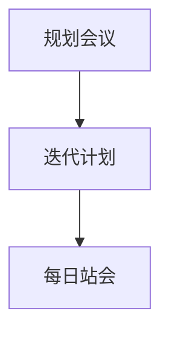

**核心算法原理讲解**：
```python
# 伪代码：敏捷开发流程
def agile_workflow(task):
    # 规划会议
    plan_meeting(task)
    # 迭代计划
    plan_iterations(task)
    # 每日站会
    daily_meetings(task)
    return task
```

**项目实战**：探讨敏捷开发在LLM工程中的应用。

#### 5.2 敏捷开发与LLM工程融合

**核心概念与联系**：
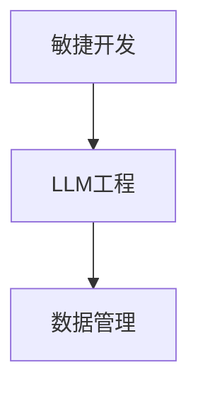

**核心算法原理讲解**：
```python
# 伪代码：敏捷开发与LLM工程的融合
def integrate_agile_in_LLM(task):
    # 应用敏捷开发流程
    agile_workflow(task)
    # 管理数据
    manage_data(task)
    return task
```

**项目实战**：分析敏捷开发在LLM工程中的具体实施。

#### 5.3 敏捷开发中的关键活动

**核心概念与联系**：
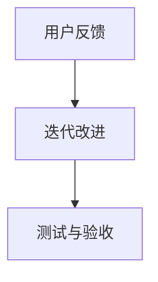

**核心算法原理讲解**：
```python
# 伪代码：敏捷开发中的关键活动
def key_activities(task):
    # 获取用户反馈
    feedback = get_user_feedback(task)
    # 迭代改进
    improve_iterations(task, feedback)
    # 测试与验收
    test_and_accept(task)
    return task
```

**项目实战**：探讨敏捷开发在项目执行中的关键活动。

### 第6章：迭代开发中的技术挑战与解决方案

#### 6.1 数据管理

**核心概念与联系**：
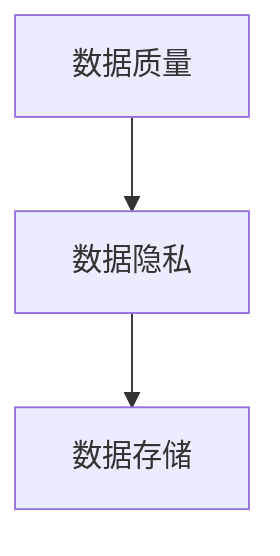

**核心算法原理讲解**：
```python
# 伪代码：数据管理
def manage_data(data):
    # 数据清洗
    cleaned_data = clean_data(data)
    # 数据加密
    encrypted_data = encrypt_data(cleaned_data)
    # 数据存储
    store_data(encrypted_data)
    return stored_data
```

**项目实战**：探讨数据管理在LLM工程中的重要性。

#### 6.2 模型性能优化

**核心概念与联系**：
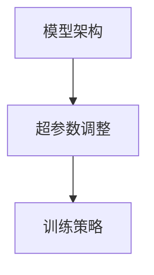

**核心算法原理讲解**：
```python
# 伪代码：模型性能优化
def optimize_performance(model):
    # 调整模型架构
    updated_model = adjust_architecture(model)
    # 超参数调整
    tuned_hyperparameters = tune_hyperparameters(updated_model)
    # 训练策略调整
    optimized_strategy = adjust_training_strategy(tuned_hyperparameters)
    return optimized_model
```

**项目实战**：分析如何优化LLM模型性能。

#### 6.3 团队协作与沟通

**核心概念与联系**：
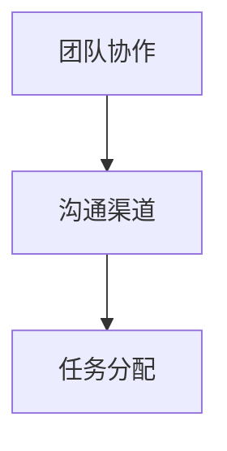

**核心算法原理讲解**：
```python
# 伪代码：团队协作与沟通
def team_collaboration(task):
    # 分配任务
    assign_tasks(team_members, task)
    # 建立沟通渠道
    set_up_communication_channels(team_members)
    # 定期会议
    schedule_meetings(team_members)
    return task
```

**项目实战**：探讨团队协作在LLM工程中的关键作用。

## 第四部分：案例分析

### 第7章：LLM工程技术架构的案例分析

#### 7.1 案例一：某企业客服系统的构建

**核心概念与联系**：
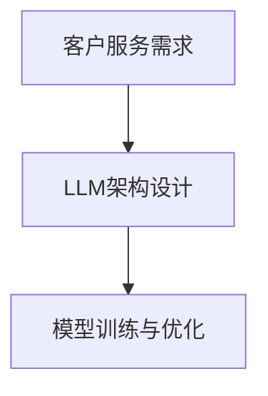

**项目实战**：详细讲解某企业如何构建基于LLM的客服系统。

#### 7.2 案例二：某在线教育平台的智能问答系统

**核心概念与联系**：
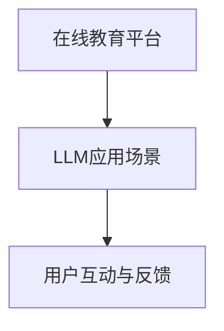

**项目实战**：分析在线教育平台如何使用LLM实现智能问答。

#### 7.3 案例三：某智能助理系统的设计与实现

**核心概念与联系**：
```mermaid
graph TD
A[智能助理需求] --> B[LLM技术应用]
B --> C[系统性能优化]
```

**项目实战**：探讨智能助理系统中的LLM技术实现与优化。

## 附录

**附录A：与书相关的资源**

- **在线课程**：相关主题的在线课程链接。
- **工具与库**：常用的LLM工具和库的介绍与使用方法。
- **论文与书籍**：推荐的相关论文和书籍。

**附录B：代码示例**

- **代码仓库**：本书中提到的代码示例的GitHub仓库链接。

**附录C：最佳实践 tips**

- **项目规划**：项目规划的最佳实践。
- **模型优化**：模型优化的技巧。
- **团队协作**：团队协作的注意事项。

**作者信息**

作者：AI天才研究院/AI Genius Institute & 禅与计算机程序设计艺术 /Zen And The Art of Computer Programming```

