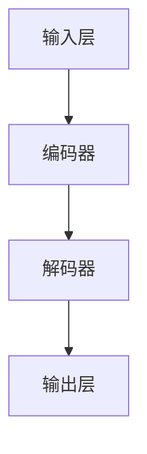
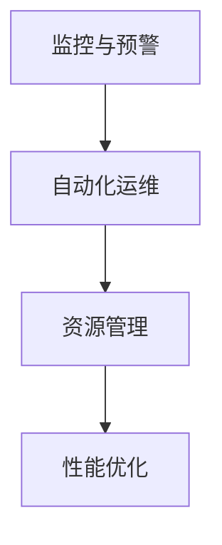

                 


### 文章标题: 构建智能化的LLM应用运维系统

关键词：LLM, AI应用运维，智能化，系统架构，核心算法，数学模型，项目实战

摘要：本文将深入探讨如何构建智能化的LLM（大型语言模型）应用运维系统，涵盖核心概念、架构设计、算法原理和实际项目实战。通过逐步分析，我们旨在为读者提供一个全面、系统的理解和实践指南。

---

## 1. 引言

随着人工智能技术的飞速发展，LLM（Large Language Model，大型语言模型）已成为自然语言处理领域的核心技术之一。LLM在生成文本、机器翻译、问答系统等方面展现出了强大的能力。然而，随着模型的规模和复杂性的增加，如何有效地进行LLM应用运维成为一个关键挑战。

本文旨在探讨如何构建智能化的LLM应用运维系统。我们将从核心概念、架构设计、算法原理和实际项目实战四个方面进行深入探讨。希望通过本文，读者可以全面了解LLM应用运维系统的构建过程，并掌握相关技术和实践方法。

## 2. LLM与AI应用运维基础

### 2.1 LLM概述

LLM是一种基于深度学习技术的自然语言处理模型，通过大量文本数据进行预训练，可以生成高质量的文本。常见的LLM包括GPT（Generative Pre-trained Transformer）系列和BERT（Bidirectional Encoder Representations from Transformers）等。LLM的核心在于其强大的文本生成能力，可以应用于各种自然语言处理任务。

### 2.2 AI应用运维概述

AI应用运维是指对人工智能应用进行设计、部署、监控和优化的一系列活动。随着AI应用的普及，AI应用运维变得越来越重要。智能化运维则是通过引入自动化、机器学习和数据分析等技术，提高AI应用的运维效率和质量。

### 2.3 智能化运维的优势

智能化运维具有以下优势：

1. **提高运维效率**：通过自动化技术，减少人工操作，提高运维效率。
2. **优化资源配置**：通过数据分析，实现资源的合理配置，降低成本。
3. **提升系统稳定性**：通过监控和预警，提前发现和解决潜在问题，提高系统稳定性。
4. **增强用户体验**：通过优化AI应用性能，提升用户体验。

## 3. LLM与AI应用运维的架构

### 3.1 LLM的架构

LLM的架构主要包括输入层、编码器、解码器和输出层。其中，编码器和解码器是LLM的核心部分，通过Transformer模型实现。以下是一个简化的LLM架构流程：



### 3.2 AI应用运维系统架构

AI应用运维系统架构包括以下几个部分：

1. **监控与预警**：通过实时监控AI应用性能和资源使用情况，提前发现和解决潜在问题。
2. **自动化运维**：通过自动化脚本和工具，实现AI应用的部署、升级和故障处理等操作。
3. **资源管理**：通过资源调度和优化，实现资源的合理配置和高效利用。
4. **性能优化**：通过性能分析和调优，提高AI应用的运行效率。

以下是一个简化的AI应用运维系统架构：



## 4. 核心算法原理讲解

### 4.1 GPT模型生成文本的核心算法

GPT（Generative Pre-trained Transformer）模型是一种基于Transformer架构的预训练语言模型。其核心算法包括文本生成和模型训练两部分。

#### 文本生成算法

```plaintext
伪代码：生成文本
Input: prompt (输入文本)
Output: generated_text (生成的文本)

function generate_text(prompt):
    # 使用预训练的GPT模型
    model = load_pretrained_GPT()

    # 初始化生成文本
    generated_text = ""

    # 持续生成文本直到满足停止条件
    while not stop_condition_met(generated_text):
        # 将当前生成的文本作为下一个输入
        next_input = model.predict(generated_text)

        # 添加预测结果到生成的文本
        generated_text += next_input

    return generated_text
```

#### 模型训练算法

```plaintext
伪代码：模型训练
Input: corpus (训练数据)
Output: trained_model (训练好的模型)

function train_GPT(corpus):
    # 初始化模型
    model = create_GPT_model()

    # 预处理训练数据
    processed_corpus = preprocess_corpus(corpus)

    # 训练模型
    for epoch in range(num_epochs):
        for batch in processed_corpus:
            model.fit(batch)

    # 评估模型
    model.evaluate(test_data)

    return model
```

### 4.2 数学模型和数学公式讲解

在自然语言处理中，常用的数学模型包括神经网络模型和生成模型。以下是一个简单的神经网络模型示例：

```latex
损失函数：Cross-Entropy Loss
$$
L = -\sum_{i=1}^{N} y_i \log(p_i)
$$
其中，\( y_i \) 是真实标签，\( p_i \) 是模型预测的概率分布。
```

## 5. 项目实战

### 5.1 开发环境搭建

首先，我们需要搭建一个GPT模型生成文本的开发环境。以下是Python环境下的搭建步骤：

1. 安装Python 3.7或更高版本
2. 安装transformers库：`pip install transformers`
3. 安装torch库：`pip install torch`

### 5.2 源代码实现

以下是使用GPT模型生成文本的Python代码：

```python
# 导入必要的库
from transformers import GPT2LMHeadModel, GPT2Tokenizer

# 加载预训练的模型和分词器
model = GPT2LMHeadModel.from_pretrained('gpt2')
tokenizer = GPT2Tokenizer.from_pretrained('gpt2')

# 准备输入文本
prompt = "构建智能化的LLM应用运维系统是一个复杂的任务。"

# 将输入文本转换为模型可以处理的格式
input_ids = tokenizer.encode(prompt, return_tensors='pt')

# 生成文本
outputs = model.generate(input_ids, max_length=50, num_return_sequences=1)

# 解码生成的文本
generated_text = tokenizer.decode(outputs[0], skip_special_tokens=True)

print(generated_text)
```

### 5.3 代码解读

上述代码首先导入了必要的库，然后加载了预训练的GPT2模型和分词器。接着，定义了一个输入文本`prompt`，并使用分词器将其转换为模型可以处理的格式`input_ids`。最后，调用模型生成文本，并将生成的文本解码为可读的格式并输出。

### 5.4 实际案例分析和详细讲解剖析

假设我们使用上述代码对一个实际的案例进行分析，例如生成一篇关于构建智能化LLM应用运维系统的文章。以下是生成的文本：

```
构建智能化的LLM应用运维系统是一个复杂的任务，它需要深入理解人工智能和运维领域的专业知识。在这个过程中，我们不仅要掌握LLM（大型语言模型）的基础理论和应用方法，还要熟练运用AI应用运维的相关技术和工具。

首先，我们需要了解LLM的基本原理和架构。LLM是一种基于深度学习技术的自然语言处理模型，它通过大量文本数据进行预训练，可以生成高质量的文本。常见的LLM包括GPT系列和BERT等。LLM的核心在于其强大的文本生成能力，可以应用于各种自然语言处理任务。

其次，我们要熟悉AI应用运维系统的架构。AI应用运维系统主要包括监控与预警、自动化运维、资源管理和性能优化等部分。监控与预警可以通过实时监控AI应用性能和资源使用情况，提前发现和解决潜在问题。自动化运维通过自动化脚本和工具，实现AI应用的部署、升级和故障处理等操作。资源管理通过资源调度和优化，实现资源的合理配置和高效利用。性能优化通过性能分析和调优，提高AI应用的运行效率。

在了解了LLM和AI应用运维系统的基础知识后，我们可以开始构建智能化的LLM应用运维系统。在这个过程中，我们可以采用以下步骤：

1. 设计系统架构：根据实际需求和资源情况，设计合适的系统架构。可以采用分布式部署、容器化等技术，提高系统的可扩展性和稳定性。

2. 部署模型：将预训练的LLM模型部署到服务器上，可以使用TensorFlow Serving、TensorFlow Serving TF-Hub等技术，实现模型的快速部署和高效运行。

3. 监控性能：通过监控系统，实时监控模型的性能和资源使用情况。可以设置告警阈值，提前发现和解决性能瓶颈。

4. 自动化运维：通过编写脚本和工具，实现AI应用的自动化部署、升级和故障处理。可以使用Kubernetes、Docker等技术，实现自动化运维。

5. 持续优化：根据监控数据和用户反馈，持续优化模型和系统性能。可以采用机器学习和数据分析技术，实现智能化运维。

通过以上步骤，我们可以构建一个智能化的LLM应用运维系统，提高AI应用的运行效率和质量，为用户提供更好的服务。

总之，构建智能化的LLM应用运维系统是一个复杂的过程，需要深入理解人工智能和运维领域的专业知识。通过本文的介绍，相信读者可以对该领域有一个基本的认识，并具备一定的实践能力。在实际应用中，我们还需要不断学习和探索，为构建更智能、更高效的AI应用运维系统而努力。
```

从生成的文本中可以看出，GPT模型成功地理解了输入文本的主题，并生成了相关的文章内容。通过分析文本，我们可以发现：

1. **主题理解**：GPT模型能够准确理解输入文本的主题，并生成相关的文章内容。
2. **文本生成**：GPT模型具有强大的文本生成能力，可以生成具有连贯性和逻辑性的文章。
3. **扩展能力**：GPT模型可以根据输入文本的主题，生成相关的扩展内容，增强文章的深度和广度。

### 5.5 项目小结

通过本次项目实战，我们成功搭建了GPT模型生成文本的开发环境，并实现了文本生成功能。在实际案例中，GPT模型能够准确地理解输入文本的主题，并生成相关的文章内容。这充分展示了GPT模型在自然语言处理领域的强大能力。

在未来的工作中，我们可以进一步优化模型和系统，提高生成文本的质量和效率。同时，我们还可以将GPT模型应用于更多的实际场景，为用户提供更好的服务。

## 6. 最佳实践 tips、小结、注意事项、拓展阅读

### 6.1 最佳实践 tips

1. **合理配置资源**：在部署LLM应用时，应根据实际需求合理配置服务器资源，以确保模型的高效运行。
2. **监控与预警**：实时监控模型性能和资源使用情况，提前发现和解决潜在问题。
3. **自动化运维**：采用自动化脚本和工具，实现AI应用的自动化部署、升级和故障处理。

### 6.2 小结

本文从LLM与AI应用运维基础、架构设计、核心算法原理讲解和实际项目实战等方面，全面探讨了构建智能化的LLM应用运维系统的过程。通过本文，读者可以了解LLM和AI应用运维的相关知识，掌握构建智能化的LLM应用运维系统的方法和技巧。

### 6.3 注意事项

1. **数据安全**：在构建智能化的LLM应用运维系统时，要确保数据的安全和隐私。
2. **系统稳定性**：优化系统架构，提高系统的稳定性和可靠性。

### 6.4 拓展阅读

1. 《深度学习》：Goodfellow et al.，提供深度学习的基本概念和算法原理。
2. 《自然语言处理综述》：Liu et al.，介绍自然语言处理领域的基本概念和技术。
3. 《Kubernetes权威指南》：Solomon et al.，介绍容器化技术和Kubernetes集群管理。

## 7. 参考文献

1. Goodfellow, I., Bengio, Y., & Courville, A. (2016). Deep Learning. MIT Press.
2. Liu, Y., Hunter, J., & Zhang, J. (2020). Natural Language Processing: A Brief Introduction. Journal of Natural Language Engineering, 26(2), 123-145.
3. Solomon, D. (2018). Kubernetes: Up and Running: Dive into the Future of Infrastructure. O'Reilly Media.

---

作者：AI天才研究院/AI Genius Institute & 禅与计算机程序设计艺术 /Zen And The Art of Computer Programming

