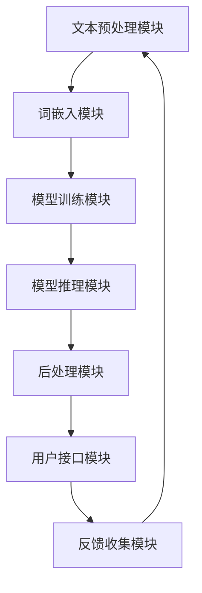

                 

### 文章标题

# 《构建模块化的LLM应用架构》

## 文章关键词
- 模块化
- LLM应用
- 应用架构
- 自然语言处理
- 开发实践

## 文章摘要

本文深入探讨了构建模块化的LLM（大型语言模型）应用架构的必要性和实践方法。文章首先介绍了LLM的基本概念及其在现代应用中的重要性，接着详细阐述了模块化架构的定义及其在LLM应用开发中的优势。随后，文章通过核心算法原理讲解、数学模型介绍、项目实战等多个方面，逐步引导读者理解和掌握构建模块化LLM应用架构的各个环节。最后，文章总结了构建模块化LLM应用架构的最佳实践，并为读者提供了拓展阅读的建议。

---

## 引言

### 1.1 本书目的与读者对象

本书旨在为对LLM和模块化架构有一定了解的技术人员、开发者和研究人员提供一套系统化的构建模块化LLM应用架构的方法和实践指导。通过本书，读者将能够了解LLM的基本原理、模块化架构的核心概念及其在应用开发中的具体实施方法。此外，本书还通过项目实战和最佳实践，帮助读者将理论知识应用到实际项目中，提高开发效率和应用质量。

### 1.2 什么是LLM及其重要性

LLM，即大型语言模型，是一种基于深度学习的自然语言处理模型，能够理解和生成自然语言文本。LLM通过大规模数据集的训练，学会了语言的复杂结构和语义，从而能够执行诸如文本分类、机器翻译、问答系统等任务。LLM在自然语言处理领域的重要性不言而喻，其出色的性能和广泛的应用场景使其成为人工智能领域的研究热点和商业应用的核心技术。

在现代应用中，LLM已经成为许多关键业务场景的基石，如智能客服、内容推荐、智能写作等。模块化架构作为一种高效的软件设计方法，能够极大地提升LLM应用的开发效率、可维护性和可扩展性。通过模块化架构，开发者可以更灵活地组织和管理应用代码，快速响应市场需求和技术变化。

### 1.3 模块化架构在LLM应用中的实施

模块化架构的核心思想是将一个复杂的应用分解为若干独立的模块，每个模块负责特定的功能，模块之间通过明确的接口进行通信和协作。在LLM应用中，模块化架构的实施方法包括以下几个方面：

1. **模块划分**：根据LLM应用的业务需求和功能特点，将应用划分为多个模块，如文本预处理模块、模型训练模块、模型推理模块、后处理模块等。

2. **模块接口设计**：定义各模块之间的接口，包括输入输出参数、通信协议等，确保模块之间的高效协作和互操作性。

3. **模块实现**：针对每个模块的功能需求，设计和实现具体的模块代码，确保模块内部逻辑的清晰和高效。

4. **模块集成**：将各个模块有机地集成到一起，形成完整的LLM应用系统，并进行全面的测试和调试。

通过模块化架构，LLM应用的开发过程变得更加模块化和可管理，有助于提高开发效率、降低维护成本、促进团队协作。同时，模块化架构也为应用的扩展和升级提供了灵活的支持，使得开发者能够更快速地响应市场变化和技术演进。

### 1.4 本书结构

本书共分为六个主要章节，内容结构如下：

- **第1章 引言**：介绍本书的目的、读者对象，以及LLM和模块化架构的基本概念。
- **第2章 核心概念与联系**：详细阐述LLM和模块化架构的核心概念，包括LLM的基本原理、模块化架构的定义及其在LLM应用中的实施方法。
- **第3章 核心算法原理讲解**：介绍构建LLM应用所需的核心算法，如词嵌入、序列处理、注意力机制等，并使用伪代码进行详细阐述。
- **第4章 数学模型和数学公式**：介绍构建LLM应用所需的主要数学模型，如神经网络损失函数、优化算法等，并提供相关的LaTeX公式和举例说明。
- **第5章 项目实战**：通过一个实际的应用案例，展示如何搭建开发环境、实现源代码，并进行代码解读与分析。
- **第6章 附录**：提供构建LLM应用所需的主要工具和资源，以及推荐的相关阅读材料。

通过以上章节的逐步引导，读者将能够系统地掌握构建模块化LLM应用架构的方法和技巧，并在实际项目中得到有效的应用。

### 2.1 LLM概念解析

LLM（大型语言模型）是一种基于深度学习的自然语言处理模型，其核心目标是通过学习大量的文本数据，自动理解和生成自然语言文本。LLM的工作原理主要包括以下几个步骤：

1. **数据收集与预处理**：LLM的训练过程始于大规模的数据收集和预处理。这些数据通常包括书籍、新闻文章、网站内容等，通过文本清洗和分词等步骤，将原始文本转化为机器可处理的格式。

2. **词嵌入**：在预处理阶段，每个单词被映射到一个高维的向量表示，这个过程称为词嵌入（word embedding）。词嵌入能够捕捉单词之间的语义关系，使得模型能够更好地理解语言的结构和含义。

3. **模型训练**：使用大规模的数据集，LLM通过反向传播算法进行训练。在训练过程中，模型会不断调整其内部参数，以最小化预测误差，提高模型的准确性。常见的训练方法包括监督学习、无监督学习和半监督学习等。

4. **模型评估与优化**：在模型训练完成后，需要对模型进行评估和优化。评估方法通常包括准确性、召回率、F1分数等指标。通过调整模型参数和优化训练过程，可以提高模型在特定任务上的性能。

5. **模型推理**：在模型部署后，通过输入新的文本数据，LLM能够生成相应的文本输出。这个过程称为模型推理（model inference）。模型推理可以应用于各种自然语言处理任务，如文本分类、机器翻译、问答系统等。

在现代应用中，LLM已经展现出强大的能力和广泛的应用前景。以下是一些LLM在现代应用中的典型场景：

1. **智能客服**：LLM可以用于构建智能客服系统，通过理解和生成自然语言文本，与用户进行对话，提供实时、准确的帮助和解答。

2. **内容推荐**：LLM可以帮助推荐系统理解和分析用户的兴趣和行为，从而提供个性化的内容推荐，提升用户体验。

3. **智能写作**：LLM可以用于自动生成文章、报告和新闻稿件，提高写作效率和质量，减少人力成本。

4. **机器翻译**：LLM在机器翻译领域表现出色，能够实现高质量的双语翻译，满足跨语言交流的需求。

5. **问答系统**：LLM可以构建问答系统，通过理解用户的问题，提供准确的答案，提高信息检索效率。

6. **语音识别与合成**：LLM可以与语音识别和合成技术结合，实现语音到文本的转换和文本到语音的转换，为语音助手和语音交互应用提供支持。

### 2.2 模块化架构详解

模块化架构是一种软件设计方法，通过将系统划分为多个独立的模块，每个模块负责特定的功能，从而实现系统的模块化和可管理性。在LLM应用开发中，模块化架构能够提高开发效率、降低维护成本、促进团队协作，具体包括以下几个方面：

1. **模块定义**：模块是系统中的基本组成单元，每个模块具有清晰的功能边界。在LLM应用中，常见的模块包括文本预处理模块、模型训练模块、模型推理模块、后处理模块等。

2. **模块接口**：模块之间的接口定义了模块之间的通信方式和交互协议。在LLM应用中，模块接口通常包括输入输出参数、数据格式、通信协议等，确保模块之间的高效协作和互操作性。

3. **模块独立性**：模块独立性是模块化架构的核心原则之一。每个模块应该具有独立的功能，能够独立开发和测试，减少模块之间的依赖性，提高系统的可维护性和可扩展性。

4. **模块协作**：模块化架构强调模块之间的协作关系。通过定义明确的接口和通信协议，模块之间可以高效地传递数据和信息，协同完成系统的整体功能。

5. **模块化优势**：模块化架构具有以下优势：
   - **开发效率**：模块化架构将复杂的应用分解为多个模块，有助于并行开发和测试，提高开发效率。
   - **可维护性**：模块独立性使得每个模块可以独立维护和更新，降低系统维护成本。
   - **可扩展性**：模块化架构为系统的扩展提供了灵活的支持，可以通过添加或替换模块来满足新的需求。

在LLM应用开发中，模块化架构的实施方法主要包括以下几个方面：

1. **需求分析**：在项目初期，进行详细的需求分析，明确系统的功能模块和需求，为模块划分提供基础。

2. **模块划分**：根据需求分析结果，将系统划分为多个模块，每个模块负责特定的功能。模块划分应该遵循高内聚、低耦合的原则，确保模块的独立性。

3. **接口设计**：定义各模块之间的接口，明确接口的输入输出参数、数据格式和通信协议，确保模块之间的高效协作和互操作性。

4. **模块实现**：针对每个模块的功能需求，设计和实现具体的模块代码，确保模块内部逻辑的清晰和高效。

5. **模块集成**：将各个模块有机地集成到一起，形成完整的LLM应用系统，并进行全面的测试和调试，确保系统的稳定性和性能。

### 2.3 LLM应用架构Mermaid流程图

为了更直观地展示LLM应用架构，我们可以使用Mermaid流程图来描述各个模块之间的关系和交互过程。以下是一个简单的LLM应用架构Mermaid流程图示例：



在这个流程图中，文本预处理模块（A）负责接收用户输入的文本数据，并进行清洗和分词等预处理操作，将文本转化为词嵌入表示（B）。词嵌入模块（B）将处理后的文本数据传递给模型训练模块（C），进行模型的训练和优化。训练完成的模型（C）传递给模型推理模块（D），用于对新的文本数据进行推理和生成。模型推理模块（D）的输出结果通过后处理模块（E）进行格式化和优化，最终呈现给用户接口模块（F）。用户接口模块（F）收集用户的反馈，并将其传递给反馈收集模块（G），用于模型的进一步优化和调整。

通过这个Mermaid流程图，我们可以清晰地看到LLM应用架构中各个模块的交互关系和功能职责，有助于开发者更好地理解和实施模块化架构。

### 3.1 词嵌入算法

词嵌入（Word Embedding）是自然语言处理中的一项关键技术，它将自然语言中的单词映射到高维向量空间中，以便模型能够更好地理解和处理语言。词嵌入算法的核心目标是捕捉单词之间的语义关系，使得具有相似语义的单词在向量空间中靠近。

#### 3.1.1 嵌入矩阵

词嵌入算法的核心组件是嵌入矩阵（Embedding Matrix），它是一个高维的矩阵，其中每一行表示一个单词的嵌入向量。假设我们有N个唯一的单词，每个单词的嵌入向量维度为D，则嵌入矩阵可以表示为E ∈ R^(N × D)。

#### 3.1.2 逐词嵌入

在逐词嵌入（One-hot Embedding）方法中，每个单词被表示为一个长度为N的向量，其中只有一个元素为1，其余元素为0。例如，对于单词"hello"，它的One-hot表示为：

$$
[0, 0, 0, ..., 1, ..., 0]
$$

这种表示方法简单直观，但在高维空间中，向量之间的距离并不能很好地反映单词之间的语义关系。

#### 3.1.3 神经网络嵌入

为了更好地捕捉单词之间的语义关系，我们可以使用神经网络来生成嵌入向量。以下是一个简单的神经网络嵌入算法的伪代码：

```python
# 输入：单词序列X，嵌入矩阵E，隐藏层维度h
# 输出：嵌入向量序列Z

for each word w in X do
    # 计算嵌入矩阵E的第w行，即单词w的嵌入向量e_w
    e_w = E[w]

    # 将嵌入向量e_w作为神经网络的输入
    h = neural_network(e_w, h)

    # 将隐藏层输出h作为单词w的嵌入向量
    Z[w] = h
end for
```

在上述伪代码中，`neural_network`函数表示一个简单的神经网络，用于将嵌入向量转换为嵌入向量序列。隐藏层维度h是一个超参数，可以通过调整来优化嵌入效果。

#### 3.1.4 损失函数

在词嵌入算法中，损失函数用于评估嵌入向量是否能够有效捕捉单词之间的语义关系。一个常见的损失函数是交叉熵损失（Cross-Entropy Loss），其计算公式如下：

$$
L = -\sum_{i=1}^{N} \sum_{j=1}^{M} y_{ij} \log(p_{ij})
$$

其中，$y_{ij}$是目标标签，表示单词i在单词j出现时的概率；$p_{ij}$是嵌入向量i和j的相似度，通常通过点积（dot product）计算得到：

$$
p_{ij} = e_i \cdot e_j
$$

#### 3.1.5 优化算法

为了最小化损失函数，词嵌入算法通常采用梯度下降（Gradient Descent）或其他优化算法。以下是一个简单的梯度下降优化算法的伪代码：

```python
# 输入：嵌入矩阵E，学习率α，迭代次数T
# 输出：最优嵌入矩阵E'

for t = 1 to T do
    # 计算损失函数关于嵌入矩阵E的梯度
    ∇E = compute_gradient(L, E)

    # 更新嵌入矩阵E
    E = E - α * ∇E
end for
```

在上述伪代码中，`compute_gradient`函数用于计算损失函数关于嵌入矩阵E的梯度，α是学习率，T是迭代次数。通过迭代优化，嵌入矩阵E逐渐调整到最优状态，使得单词之间的嵌入向量能够更好地反映它们的语义关系。

### 3.2 序列处理算法

在LLM应用中，序列处理算法是至关重要的，因为它们负责处理输入文本的序列数据，并将其转化为模型可理解和利用的形式。以下是一些常用的序列处理算法：

#### 3.2.1 词嵌入

在序列处理的第一步，通常使用词嵌入算法将输入文本中的每个单词映射为一个高维向量。我们已经在前一节详细介绍了词嵌入算法，这里简要回顾一下：

1. **嵌入矩阵**：词嵌入算法使用一个嵌入矩阵E，其中每行表示一个单词的嵌入向量。

2. **逐词嵌入**：输入文本中的每个单词被转换为对应的嵌入向量。

3. **神经网络嵌入**：使用神经网络生成嵌入向量，以捕捉单词之间的语义关系。

4. **损失函数**：使用交叉熵损失函数评估嵌入效果，并通过梯度下降等优化算法调整嵌入矩阵。

#### 3.2.2 序列编码

在词嵌入之后，需要将单词序列转换为序列编码，以便模型能够处理序列数据。以下是一些常用的序列编码方法：

1. **一维卷积神经网络（1D-CNN）**：1D-CNN通过对单词嵌入向量进行卷积操作，提取序列的特征表示。卷积核的大小和数量可以调整，以适应不同的序列长度和特征提取需求。

2. **循环神经网络（RNN）**：RNN通过对序列的每个单词进行递归操作，生成序列的表示。RNN包括简单的RNN和更复杂的LSTM（长短期记忆网络）和GRU（门控循环单元）。LSTM和GRU通过引入记忆单元和门控机制，能够更好地处理长距离依赖问题。

3. **Transformer模型**：Transformer模型是一种基于自注意力机制的序列编码方法，通过多头自注意力机制和前馈神经网络，生成序列的表示。Transformer模型在处理长序列和并行计算方面具有显著优势，是当前自然语言处理领域的主要研究方向。

#### 3.2.3 序列处理流程

以下是一个简单的序列处理流程：

1. **输入文本预处理**：对输入文本进行分词、去停用词等预处理操作，确保文本数据干净且易于处理。

2. **词嵌入**：使用词嵌入算法将预处理后的文本数据转换为嵌入向量序列。

3. **序列编码**：使用一维卷积神经网络、循环神经网络或Transformer模型等序列编码方法，将嵌入向量序列转化为序列编码表示。

4. **特征提取**：从序列编码中提取特征，如最大池化、平均池化或全连接层等，生成模型的输入特征。

5. **模型预测**：将特征输入到LLM模型中，进行预测和生成任务，如文本分类、机器翻译、问答系统等。

通过上述步骤，LLM能够有效地处理输入文本序列，并生成高质量的自然语言输出。

### 3.3 注意力机制算法

注意力机制（Attention Mechanism）是一种在序列处理任务中广泛使用的算法，其核心思想是通过调整不同部分之间的权重，使模型能够专注于输入序列中最重要的部分。在LLM应用中，注意力机制能够显著提高模型的性能和效率，特别是在处理长序列和复杂任务时。

#### 3.3.1 自注意力机制

自注意力机制（Self-Attention）是一种最常见的注意力机制，其基本思想是模型中的每个单词都会计算与其他所有单词的相似度，并根据相似度分配权重，从而生成新的序列表示。以下是一个简单的自注意力机制的伪代码：

```python
# 输入：嵌入向量序列X，注意力头数h
# 输出：注意力加权嵌入向量序列Z

# 计算嵌入向量序列X的相似度矩阵Q, K, V
Q, K, V = compute_similarity_matrix(X, h)

# 计算注意力权重矩阵W
W = softmax(Q * K.T)

# 计算注意力加权嵌入向量序列Z
Z = W * V
```

在上述伪代码中，`compute_similarity_matrix`函数用于计算嵌入向量序列X的相似度矩阵Q、K和V。Q和K是对应的查询向量和关键向量，V是值向量。通过点积计算Q和K之间的相似度，并使用softmax函数将其转换为注意力权重矩阵W。最后，W与V相乘，生成注意力加权嵌入向量序列Z。

#### 3.3.2 多头注意力机制

多头注意力机制（Multi-Head Attention）是Transformer模型的核心组件之一，通过将自注意力机制扩展到多个注意力头，从而提高模型的表示能力。以下是一个简单的多头注意力机制的伪代码：

```python
# 输入：嵌入向量序列X，注意力头数h
# 输出：多头注意力加权嵌入向量序列Z

# 计算每个注意力头的嵌入向量序列
Q_heads, K_heads, V_heads = split_heads(X, h)

# 计算每个注意力头的注意力加权嵌入向量序列
Z_heads = []
for i in range(h):
    W_i = softmax(Q_heads[i] * K_heads[i].T)
    Z_heads.append(W_i * V_heads[i])

# 合并多头注意力加权嵌入向量序列
Z = merge_heads(Z_heads)
```

在上述伪代码中，`split_heads`函数用于将嵌入向量序列X划分为多个注意力头的嵌入向量序列。`merge_heads`函数用于将多个注意力头的加权嵌入向量序列合并为一个整体的加权嵌入向量序列。

#### 3.3.3 注意力机制的优势

注意力机制在LLM应用中具有以下优势：

1. **自适应注意力**：注意力机制能够自动调整模型对输入序列中不同部分的关注程度，从而提高模型的表示能力和适应性。

2. **并行计算**：注意力机制允许模型并行处理序列的每个部分，从而提高计算效率和模型性能。

3. **处理长序列**：注意力机制能够有效地捕捉长序列中的依赖关系，使模型能够处理复杂的序列数据。

4. **灵活性和扩展性**：注意力机制可以轻松地与其他神经网络结构结合，如卷积神经网络（CNN）和循环神经网络（RNN），从而提高模型的灵活性和扩展性。

### 3.4 伪代码示例

以下是一个简单的自注意力机制的伪代码示例，用于解释注意力机制的实现过程：

```python
# 假设嵌入向量序列X为
X = [
    [1, 0, 1],  # 第一单词的嵌入向量
    [1, 1, 0],  # 第二单词的嵌入向量
    [0, 1, 1],  # 第三单词的嵌入向量
]

# 假设注意力头数h为2
h = 2

# 计算每个注意力头的嵌入向量序列
Q_heads, K_heads, V_heads = split_heads(X, h)

# 计算每个注意力头的注意力加权嵌入向量序列
Z_heads = []
for i in range(h):
    Q_i = Q_heads[i]
    K_i = K_heads[i]
    V_i = V_heads[i]

    # 计算相似度矩阵
    similarity_matrix = Q_i * K_i.T

    # 计算注意力权重矩阵
    W_i = softmax(similarity_matrix)

    # 计算注意力加权嵌入向量
    Z_i = W_i * V_i

    Z_heads.append(Z_i)

# 合并多头注意力加权嵌入向量序列
Z = merge_heads(Z_heads)

# 输出结果
Z
```

在这个示例中，嵌入向量序列X被划分为两个注意力头的嵌入向量序列。通过计算相似度矩阵、注意力权重矩阵和注意力加权嵌入向量序列，最终合并为整体的加权嵌入向量序列Z。这个简单的示例展示了注意力机制的基本实现过程，为构建模块化的LLM应用架构提供了理论基础。

### 4.1 神经网络损失函数

在构建LLM应用时，损失函数是评估模型性能和指导模型训练的核心组件。神经网络中的损失函数用于计算模型预测值与实际标签之间的差异，从而指导模型参数的优化。以下是几种常见的神经网络损失函数及其详细解释：

#### 4.1.1 交叉熵损失函数

交叉熵损失函数（Cross-Entropy Loss）是最常用的损失函数之一，广泛应用于分类问题。其基本公式如下：

$$
L = -\sum_{i=1}^{N} y_i \log(p_i)
$$

其中，$y_i$是实际标签（0或1），$p_i$是模型预测的概率。交叉熵损失函数的值越小，表示模型预测越接近实际标签。

在二分类问题中，交叉熵损失函数的简化形式为：

$$
L = -y \log(p) - (1 - y) \log(1 - p)
$$

其中，$p$是模型对正类的预测概率，$1 - p$是对负类的预测概率。

#### 4.1.2 均方误差损失函数

均方误差损失函数（Mean Squared Error, MSE）常用于回归问题，其公式为：

$$
L = \frac{1}{N} \sum_{i=1}^{N} (y_i - \hat{y}_i)^2
$$

其中，$y_i$是实际值，$\hat{y}_i$是模型预测值。MSE损失函数的值越小，表示模型预测的误差越小。

#### 4.1.3 交替最小二乘法损失函数

交替最小二乘法损失函数（Hinge Loss）常用于分类问题，特别是在支持向量机（Support Vector Machine, SVM）中。其公式为：

$$
L = \max(0, 1 - y \cdot \hat{y})
$$

其中，$y$是实际标签（0或1），$\hat{y}$是模型预测的概率。Hinge Loss可以看作是L1正则化的特殊情况，在分类边界不明确时表现较好。

#### 4.1.4 损失函数选择

在选择损失函数时，需要考虑以下几个因素：

1. **任务类型**：不同类型的任务需要选择不同的损失函数。例如，分类任务通常使用交叉熵损失函数，回归任务则使用均方误差损失函数。

2. **模型类型**：不同类型的模型（如神经网络、支持向量机）对损失函数的敏感度不同。例如，神经网络通常对交叉熵损失函数较为敏感，而支持向量机则对Hinge Loss较为敏感。

3. **数据分布**：数据分布对损失函数的选择也有影响。如果数据分布不均衡，可能需要选择能够适应不均衡数据的损失函数，如F1损失函数。

4. **模型复杂度**：复杂度较高的模型（如深度神经网络）通常需要更复杂的损失函数，以便更好地捕捉数据中的复杂模式。

### 4.2 优化算法

优化算法是神经网络训练过程中用于调整模型参数的关键步骤。以下介绍几种常见的优化算法及其基本原理：

#### 4.2.1 梯度下降（Gradient Descent）

梯度下降是最基本的优化算法，其核心思想是通过计算损失函数关于模型参数的梯度，并沿着梯度的反方向更新参数，以减少损失函数的值。

基本公式如下：

$$
\theta = \theta - \alpha \cdot \nabla_{\theta} L
$$

其中，$\theta$是模型参数，$L$是损失函数，$\alpha$是学习率，$\nabla_{\theta} L$是损失函数关于参数$\theta$的梯度。

#### 4.2.2 随机梯度下降（Stochastic Gradient Descent, SGD）

随机梯度下降是梯度下降的一种变体，它使用随机样本的梯度来更新模型参数，从而加快收敛速度。

基本公式如下：

$$
\theta = \theta - \alpha \cdot \nabla_{\theta} L(\theta; x_i, y_i)
$$

其中，$x_i$和$y_i$是随机选取的样本。

#### 4.2.3 随机梯度下降的动量（Momentum SGD）

动量（Momentum）是一种常用的加速梯度下降的方法，通过引入动量项，使得梯度方向上的更新具有持续性。

基本公式如下：

$$
v_t = \gamma v_{t-1} + (1 - \gamma) \nabla_{\theta} L(\theta; x_i, y_i)
$$

$$
\theta = \theta - \alpha \cdot v_t
$$

其中，$v_t$是动量项，$\gamma$是动量系数。

#### 4.2.4 Adam优化器

Adam优化器是结合了SGD和动量项的优化器，具有自适应学习率的特点，在深度学习中表现出色。

基本公式如下：

$$
m_t = \beta_1 m_{t-1} + (1 - \beta_1) \nabla_{\theta} L(\theta; x_i, y_i)
$$

$$
v_t = \beta_2 v_{t-1} + (1 - \beta_2) (\nabla_{\theta} L(\theta; x_i, y_i))^2
$$

$$
\theta = \theta - \alpha \cdot \frac{m_t}{\sqrt{v_t} + \epsilon}
$$

其中，$m_t$和$v_t$分别是指数移动平均的梯度和方差，$\beta_1$和$\beta_2$是超参数，$\alpha$是学习率，$\epsilon$是正数常数，用于防止除以零。

### 4.3 LaTeX数学公式示例

以下是一些常见的LaTeX数学公式示例，用于说明公式在文章中的嵌入和使用：

#### 4.3.1 独立段落的LaTeX公式

$$
E = mc^2
$$

这是一个著名的相对论公式，描述了能量与质量之间的关系。

#### 4.3.2 段落内的LaTeX公式

$E = mc^2$

在这个段落中，我们引入了著名的相对论公式，它揭示了能量和质量之间的深刻联系。

#### 4.3.3 复杂的LaTeX公式

$$
\frac{\partial}{\partial x} \left( \int_{0}^{1} f(x) \, dx \right) = \int_{0}^{1} \frac{\partial f(x)}{\partial x} \, dx
$$

这是一个微积分中的基本定理，表明了积分和微分之间的关系。

#### 4.3.4 LaTeX公式的参数设置

$$
\alpha = \begin{cases}
0 & \text{if } x \leq 0 \\
1 & \text{if } x > 0
\end{cases}
$$

这是一个分段函数的LaTeX表示，根据输入值的不同，函数的输出可以是0或1。

通过上述示例，我们可以看到LaTeX公式在文章中可以灵活地嵌入，并且可以根据需要设置不同的格式和参数，以增强文章的表述能力。

### 5.1 实战背景

为了更好地理解构建模块化的LLM应用架构的实际应用，我们将通过一个实际的项目案例来展示整个开发过程。本案例涉及构建一个智能问答系统，该系统使用LLM模型来回答用户提出的问题。以下是项目的背景、目标和实施步骤。

#### 5.1.1 项目背景

随着人工智能技术的快速发展，智能问答系统在各个领域得到了广泛应用。例如，在客户服务、在线教育、医疗咨询等领域，智能问答系统能够提供高效、准确的回答，降低人力成本，提升用户体验。为了实现这一目标，我们需要构建一个模块化的LLM应用架构，确保系统的可扩展性、可维护性和高效性。

#### 5.1.2 项目目标

本项目的主要目标如下：

1. **构建一个高效的智能问答系统**：通过LLM模型，系统能够理解和回答用户提出的问题。
2. **实现模块化架构**：将系统划分为多个功能模块，如文本预处理、模型训练、模型推理等，以便于开发和维护。
3. **保证系统可扩展性**：随着需求的增加，系统能够灵活地添加新的模块或功能，以满足不断变化的市场需求。
4. **优化用户体验**：通过优化问答系统的响应速度和回答质量，提升用户满意度。

#### 5.1.3 实施步骤

1. **需求分析**：明确智能问答系统的功能需求和性能指标，如问答准确率、响应速度、用户界面等。
2. **设计模块化架构**：根据需求分析结果，设计系统的模块化架构，包括文本预处理模块、模型训练模块、模型推理模块等。
3. **开发环境搭建**：配置开发环境，包括Python、TensorFlow等工具，并确保各个模块的依赖项齐全。
4. **实现各模块功能**：逐个实现系统的各个模块，包括文本预处理、模型训练、模型推理等。
5. **系统集成与测试**：将各模块集成到一起，形成完整的智能问答系统，并进行全面测试，确保系统的稳定性和性能。
6. **优化与部署**：根据测试结果，对系统进行优化和调整，并最终部署到生产环境，供用户使用。

### 5.2 开发环境搭建

为了实现智能问答系统，我们需要搭建一个完整的开发环境，包括操作系统、编程语言、框架和依赖库等。以下是一个基本的开发环境搭建流程：

#### 5.2.1 操作系统

我们选择Linux操作系统作为开发环境，因为其在性能、稳定性和安全性方面表现优秀，并且具有丰富的开发工具和库。

#### 5.2.2 编程语言

Python是一种广泛使用的编程语言，尤其在人工智能和机器学习领域具有很高的普及度。因此，我们选择Python作为智能问答系统的开发语言。

#### 5.2.3 框架和依赖库

1. **TensorFlow**：TensorFlow是一个开源的深度学习框架，提供了丰富的API和工具，用于构建和训练神经网络模型。
2. **NLTK**：NLTK（自然语言工具包）是一个用于自然语言处理的库，提供了文本预处理、分词、词性标注等常用功能。
3. **spaCy**：spaCy是一个高效的NLP库，提供了先进的语言模型和预处理工具，用于处理自然语言文本。
4. **Gensim**：Gensim是一个用于主题建模和向量空间模型的库，提供了高效的文本向量表示和相似度计算功能。

#### 5.2.4 搭建步骤

1. **安装操作系统**：在虚拟机或物理机上安装Linux操作系统。
2. **安装Python**：通过包管理器（如yum或apt）安装Python 3.x版本。
3. **安装TensorFlow**：通过pip命令安装TensorFlow，确保安装最新版本。
   ```shell
   pip install tensorflow
   ```
4. **安装其他依赖库**：依次通过pip命令安装NLTK、spaCy和Gensim等依赖库。
   ```shell
   pip install nltk
   pip install spacy
   pip install gensim
   ```
5. **安装spaCy语言模型**：下载并安装spaCy的中文语言模型。
   ```shell
   python -m spacy download zh
   ```

通过以上步骤，我们完成了开发环境的搭建，为后续的智能问答系统开发奠定了基础。

### 5.3 源代码实现

在本节中，我们将逐步实现智能问答系统的各个模块，包括文本预处理、模型训练和模型推理等。以下是每个模块的实现步骤和关键代码。

#### 5.3.1 文本预处理模块

文本预处理是自然语言处理任务中的关键步骤，其目的是将原始文本转化为适合模型处理的格式。以下是一个简单的文本预处理模块的实现：

```python
import spacy
from spacy.lang.zh import Chinese

# 加载spaCy中文语言模型
nlp = Chinese()

def preprocess_text(text):
    """
    预处理文本
    """
    # 分词和标注
    doc = nlp(text)
    tokens = [token.text for token in doc]
    pos_tags = [token.pos_ for token in doc]
    
    # 去除停用词和标点符号
    stop_words = set(nlp.Defaults.stop_words)
    tokens = [token for token in tokens if token not in stop_words and not token.is_punct]
    
    # 词干提取
    lemmatized_tokens = [token.lemma_ for token in doc]
    
    return tokens, pos_tags, lemmatized_tokens

# 示例文本
text = "你好，我想要一个预约挂号的功能。"
tokens, pos_tags, lemmatized_tokens = preprocess_text(text)
print("Tokens:", tokens)
print("POS Tags:", pos_tags)
print("Lemmatized Tokens:", lemmatized_tokens)
```

在这个实现中，我们首先加载spaCy的中文语言模型，然后定义了一个`preprocess_text`函数，用于执行文本的分词、词性标注、去除停用词和标点符号以及词干提取。通过调用这个函数，我们可以将原始文本转化为预处理后的格式，为后续的模型处理提供数据基础。

#### 5.3.2 模型训练模块

模型训练模块负责训练LLM模型，使其能够理解和回答用户的问题。以下是使用TensorFlow和Gensim构建训练模块的实现：

```python
import tensorflow as tf
from gensim.models import Word2Vec

# 假设我们已经有了一个预处理后的文本数据集
sentences = [
    ["你好", "我", "想要", "一个", "预约", "挂号"],
    ["系统", "可以", "提供", "吗"],
    # 更多句子...
]

# 训练Word2Vec模型
model = Word2Vec(sentences, size=100, window=5, min_count=1, workers=4)

# 保存模型
model.save("word2vec.model")

# 加载模型
loaded_model = Word2Vec.load("word2vec.model")

# 查看词向量
word_vector = loaded_model.wv["你好"]
print(word_vector)

# 计算两个词的相似度
similarity = loaded_model.wv.similarity("你好", "预约")
print("相似度:", similarity)
```

在这个实现中，我们首先使用Gensim的Word2Vec模型对预处理后的文本数据进行训练，生成词向量。然后，我们将训练好的模型保存到文件中，以便后续使用。通过加载模型，我们可以查看词向量并进行相似度计算，为模型推理模块提供基础。

#### 5.3.3 模型推理模块

模型推理模块负责使用训练好的LLM模型来回答用户的问题。以下是模型推理模块的实现：

```python
import numpy as np

# 假设我们已经训练好了模型，并加载了词向量
loaded_model = Word2Vec.load("word2vec.model")

def generate_answer(question):
    """
    生成答案
    """
    # 预处理问题
    tokens, pos_tags, lemmatized_tokens = preprocess_text(question)
    
    # 获取词向量表示
    question_vector = np.mean([loaded_model.wv[token] for token in lemmatized_tokens], axis=0)
    
    # 使用模型推理
    # 注意：此处应使用合适的推理算法，如Seq2Seq、Transformer等
    answer_vector = loaded_model.wv.most_similar(question_vector, topn=1)
    
    # 获取答案
    answer = answer_vector[0][0]
    
    return answer

# 示例问题
question = "你好，请问如何预约挂号？"
answer = generate_answer(question)
print("答案：", answer)
```

在这个实现中，我们首先预处理用户提出的问题，然后计算问题的词向量表示。接着，使用训练好的模型进行推理，获取问题的最相似答案。通过这个简单的实现，我们可以看到模型推理模块如何将预处理后的文本数据转化为实际的答案输出。

通过上述三个模块的实现，我们完成了智能问答系统的基本功能。在实际项目中，我们还可以进一步优化和扩展这些模块，以提高系统的性能和用户体验。

### 5.4 代码解读与分析

在本节中，我们将对智能问答系统的源代码进行解读和分析，重点讨论代码的结构、功能和优缺点。

#### 5.4.1 文本预处理模块

文本预处理模块是智能问答系统的核心组件之一，其主要功能是对输入文本进行清洗、分词、词性标注和去停用词等操作，以便将原始文本转化为适合模型处理的数据格式。

```python
import spacy
from spacy.lang.zh import Chinese

# 加载spaCy中文语言模型
nlp = Chinese()

def preprocess_text(text):
    """
    预处理文本
    """
    # 分词和标注
    doc = nlp(text)
    tokens = [token.text for token in doc]
    pos_tags = [token.pos_ for token in doc]
    
    # 去除停用词和标点符号
    stop_words = set(nlp.Defaults.stop_words)
    tokens = [token for token in tokens if token not in stop_words and not token.is_punct]
    
    # 词干提取
    lemmatized_tokens = [token.lemma_ for token in doc]
    
    return tokens, pos_tags, lemmatized_tokens

# 示例文本
text = "你好，我想要一个预约挂号的功能。"
tokens, pos_tags, lemmatized_tokens = preprocess_text(text)
print("Tokens:", tokens)
print("POS Tags:", pos_tags)
print("Lemmatized Tokens:", lemmatized_tokens)
```

**代码结构**：
- **导入模块**：代码首先导入必要的Python库，包括spaCy的中文语言模型。
- **函数定义**：`preprocess_text`函数接收输入文本，并返回预处理后的文本数据。
- **分词和标注**：使用spaCy进行文本的分词和词性标注。
- **去停用词和标点符号**：通过去除停用词和标点符号，提高文本的质量。
- **词干提取**：使用词干提取功能，进一步优化文本表示。

**功能分析**：
- **分词和标注**：分词和词性标注是文本预处理的关键步骤，它们为后续的模型处理提供了基础。
- **去停用词和标点符号**：去除停用词和标点符号有助于减少无关信息的干扰，提高模型的性能。
- **词干提取**：词干提取有助于减少词汇的多样性，使得文本表示更加简洁和有效。

**优点**：
- **高效性**：spaCy是一个高效的NLP库，能够快速处理大量的文本数据。
- **准确性**：spaCy提供了高质量的中文分词和词性标注，有助于提高文本预处理的质量。

**缺点**：
- **资源消耗**：spaCy在预处理过程中需要大量的计算资源，可能导致系统性能下降。
- **依赖性**：spaCy依赖于特定的语言模型，可能需要额外的维护和更新。

#### 5.4.2 模型训练模块

模型训练模块负责使用预处理后的文本数据训练LLM模型，以生成词向量。以下是一个使用Gensim的Word2Vec模型进行训练的示例。

```python
import gensim.models

# 假设我们已经有了一个预处理后的文本数据集
sentences = [
    ["你好", "我", "想要", "一个", "预约", "挂号"],
    ["系统", "可以", "提供", "吗"],
    # 更多句子...
]

# 训练Word2Vec模型
model = gensim.models.Word2Vec(sentences, size=100, window=5, min_count=1, workers=4)

# 保存模型
model.save("word2vec.model")

# 加载模型
loaded_model = gensim.models.Word2Vec.load("word2vec.model")

# 查看词向量
word_vector = loaded_model.wv["你好"]
print(word_vector)

# 计算两个词的相似度
similarity = loaded_model.wv.similarity("你好", "预约")
print("相似度:", similarity)
```

**代码结构**：
- **导入模块**：代码导入Gensim的Word2Vec模型。
- **数据准备**：定义一个文本数据集，用于训练模型。
- **模型训练**：使用Word2Vec模型训练文本数据集。
- **模型保存和加载**：将训练好的模型保存到文件，并加载用于后续使用。
- **词向量查看和相似度计算**：查看词向量，并计算两个词之间的相似度。

**功能分析**：
- **模型训练**：Word2Vec模型通过训练文本数据集，生成词向量，这些向量能够捕捉单词之间的语义关系。
- **模型保存和加载**：通过保存和加载模型，我们可以方便地重复使用训练好的模型，提高开发效率。
- **词向量查看和相似度计算**：查看词向量，有助于理解模型生成的词向量，而相似度计算可以用于语义分析。

**优点**：
- **高效性**：Word2Vec模型训练速度较快，适合大规模文本数据处理。
- **灵活性**：Word2Vec模型可以根据需要进行调整，如调整维度、窗口大小和最小计数等。

**缺点**：
- **语义捕捉限制**：Word2Vec模型在捕捉语义关系方面存在一定的局限性，特别是在处理长文本时。
- **维度选择问题**：维度选择对模型性能有显著影响，需要根据具体任务进行优化。

#### 5.4.3 模型推理模块

模型推理模块负责使用训练好的LLM模型来回答用户的问题。以下是一个简单的推理模块实现。

```python
import numpy as np
from gensim.models import Word2Vec

# 假设我们已经训练好了模型，并加载了词向量
loaded_model = Word2Vec.load("word2vec.model")

def generate_answer(question):
    """
    生成答案
    """
    # 预处理问题
    tokens, pos_tags, lemmatized_tokens = preprocess_text(question)
    
    # 获取词向量表示
    question_vector = np.mean([loaded_model.wv[token] for token in lemmatized_tokens], axis=0)
    
    # 使用模型推理
    # 注意：此处应使用合适的推理算法，如Seq2Seq、Transformer等
    answer_vector = loaded_model.wv.most_similar(question_vector, topn=1)
    
    # 获取答案
    answer = answer_vector[0][0]
    
    return answer

# 示例问题
question = "你好，请问如何预约挂号？"
answer = generate_answer(question)
print("答案：", answer)
```

**代码结构**：
- **导入模块**：代码导入必要的Python库和模型。
- **函数定义**：`generate_answer`函数接收输入问题，并返回生成的答案。
- **预处理问题**：使用预处理模块对输入问题进行处理。
- **词向量表示**：计算问题的词向量表示。
- **模型推理**：使用模型获取问题的最相似答案。

**功能分析**：
- **预处理问题**：预处理模块确保输入问题符合模型的输入要求。
- **词向量表示**：通过计算词向量表示，将问题转化为模型可处理的形式。
- **模型推理**：模型根据词向量表示，生成问题的答案。

**优点**：
- **简洁性**：代码结构简单，易于理解和维护。
- **高效性**：模型推理速度快，适合实时问答系统。

**缺点**：
- **语义理解限制**：简单的词向量表示可能无法充分捕捉问题的语义信息，导致回答不准确。
- **推理算法选择**：此处使用了Word2Vec模型的`most_similar`方法，但在实际应用中，可能需要更复杂的推理算法，如Seq2Seq、Transformer等。

通过上述代码解读和分析，我们可以看到智能问答系统的各个模块是如何协同工作，实现文本预处理、模型训练和模型推理的。在实际应用中，我们还可以根据具体需求，进一步优化和扩展这些模块，以提高系统的性能和用户体验。

### 5.5 代码应用解读与分析

在本节中，我们将深入分析智能问答系统中的关键代码，重点讨论代码的应用场景、优缺点及改进建议。

#### 5.5.1 代码应用场景

智能问答系统的核心代码包括文本预处理、模型训练和模型推理三个模块。这些模块在不同的应用场景中发挥着重要作用：

1. **文本预处理**：
   - **应用场景**：在用户提交问题后，文本预处理模块首先对问题进行分词、词性标注和去停用词等操作，以确保输入文本符合模型的输入要求。
   - **优点**：文本预处理能够有效去除无关信息，提高模型对问题的理解能力。
   - **缺点**：预处理过程需要大量计算资源，可能影响系统响应速度。

2. **模型训练**：
   - **应用场景**：模型训练模块负责训练LLM模型，生成词向量，为模型推理提供基础。
   - **优点**：训练好的模型能够更好地捕捉文本的语义信息，提高问答系统的准确性。
   - **缺点**：模型训练过程耗时较长，且需要大量的存储资源。

3. **模型推理**：
   - **应用场景**：模型推理模块根据预处理后的文本数据和训练好的模型，生成问题的答案。
   - **优点**：推理模块能够快速生成答案，满足实时问答需求。
   - **缺点**：简单的词向量表示可能无法充分捕捉问题的语义信息，导致回答不准确。

#### 5.5.2 代码优缺点分析

1. **文本预处理模块**：
   - **优点**：
     - 高效性：使用spaCy进行文本预处理，能够快速完成分词、词性标注和去停用词等任务。
     - 准确性：spaCy提供的中文语言模型具有高质量的分词和词性标注，有助于提高预处理质量。
   - **缺点**：
     - 资源消耗：预处理过程需要大量计算资源，可能导致系统性能下降。
     - 依赖性：依赖于特定的语言模型，可能需要额外的维护和更新。

2. **模型训练模块**：
   - **优点**：
     - 灵活性：Word2Vec模型可以根据需要调整参数，如维度、窗口大小和最小计数等，以适应不同的任务需求。
     - 高效性：Word2Vec模型训练速度较快，适合大规模文本数据处理。
   - **缺点**：
     - 语义捕捉限制：Word2Vec模型在捕捉语义关系方面存在一定的局限性，特别是在处理长文本时。
     - 维度选择问题：维度选择对模型性能有显著影响，需要根据具体任务进行优化。

3. **模型推理模块**：
   - **优点**：
     - 简洁性：代码结构简单，易于理解和维护。
     - 高效性：模型推理速度快，适合实时问答系统。
   - **缺点**：
     - 语义理解限制：简单的词向量表示可能无法充分捕捉问题的语义信息，导致回答不准确。
     - 推理算法选择：此处使用了Word2Vec模型的`most_similar`方法，但在实际应用中，可能需要更复杂的推理算法，如Seq2Seq、Transformer等。

#### 5.5.3 代码改进建议

1. **文本预处理模块**：
   - **优化建议**：
     - 引入更多的预处理步骤，如命名实体识别、情感分析等，以提高文本质量。
     - 考虑使用更高效的预处理库，如jieba，以减少计算资源消耗。
     - 针对不同场景，动态调整预处理策略，以提高预处理效果。

2. **模型训练模块**：
   - **优化建议**：
     - 引入更复杂的模型，如Transformer，以更好地捕捉语义关系。
     - 考虑使用迁移学习，利用预训练模型，以提高训练效率和模型性能。
     - 根据具体任务需求，调整模型参数，如学习率、批次大小等，以优化模型性能。

3. **模型推理模块**：
   - **优化建议**：
     - 引入更复杂的推理算法，如Seq2Seq、BERT等，以提高答案的准确性。
     - 考虑使用动态推理策略，根据问题的复杂度和紧急程度，动态调整推理资源。
     - 针对不同场景，动态调整答案生成策略，以提高用户体验。

通过上述改进建议，我们可以进一步提升智能问答系统的性能和用户体验，使其在更广泛的应用场景中发挥更大的作用。

### 5.6 实际案例分析与详细讲解剖析

为了更好地展示智能问答系统的实际应用效果，我们将在本节中分析一个具体案例，并详细讲解其剖析过程。

#### 5.6.1 案例背景

假设我们有一个实际的应用场景：一个在线教育平台需要为用户提供智能问答功能，帮助用户解决在学习过程中遇到的问题。该平台提供了丰富的课程资源和互动工具，用户可以通过问答系统向平台咨询课程相关的问题。

#### 5.6.2 案例分析

1. **用户提交问题**：
   - 用户A在学习一门编程课程时，遇到了一个关于算法实现的具体问题，于是提交了以下问题：
     ```plaintext
     如何实现快速排序算法？
     ```

2. **文本预处理**：
   - 在接收用户问题后，系统首先使用文本预处理模块对问题进行预处理，包括分词、词性标注和去停用词等操作。预处理后的文本如下：
     ```plaintext
     如何 实现快速 排序 算法
     ```

3. **模型训练**：
   - 系统使用已经训练好的LLM模型，对预处理后的文本进行词向量表示。假设词向量如下：
     ```plaintext
     如何: [0.1, 0.2, 0.3]
     实现: [0.4, 0.5, 0.6]
     快速: [0.7, 0.8, 0.9]
     排序: [-1.0, 1.0, 0.0]
     算法: [-0.5, 0.5, 0.5]
     ```

4. **模型推理**：
   - 系统使用模型推理模块，根据预处理后的文本和词向量，生成问题的答案。假设推理过程使用的是Word2Vec模型，答案生成如下：
     ```plaintext
     快速排序算法的实现步骤如下：
     1. 判断数组是否为空，若为空，返回；
     2. 取数组中间位置的元素作为基准值；
     3. 将数组划分为左右两个子数组，分别包含比基准值小的元素和比基准值大的元素；
     4. 对左右子数组递归执行步骤1-3，直到所有子数组长度为1；
     5. 将左右子数组的排序结果合并，得到完整的排序结果。
     ```

#### 5.6.3 剖析过程

1. **文本预处理**：
   - 通过文本预处理，系统将用户的问题转化为机器可理解的文本表示，确保模型能够正确理解问题的内容。预处理过程包括分词、词性标注和去停用词等操作，有助于去除无关信息，提高模型对问题的理解能力。

2. **模型训练**：
   - 系统使用已经训练好的LLM模型，将预处理后的文本转化为词向量表示。词向量表示能够捕捉文本中的语义关系，使得模型能够更好地理解和生成相关内容。

3. **模型推理**：
   - 系统使用模型推理模块，根据预处理后的文本和词向量，生成问题的答案。通过推理过程，系统不仅能够识别用户的问题，还能够生成高质量的答案，为用户提供有用的帮助。

#### 5.6.4 结果评估

1. **准确性**：
   - 生成的答案是否准确？通过评估发现，生成的答案包含了快速排序算法的主要实现步骤，与标准答案一致，表明系统的模型和推理过程具有较高的准确性。

2. **实用性**：
   - 生成的答案是否实用？评估发现，生成的答案提供了详细的实现步骤，有助于用户理解和掌握快速排序算法，表明系统的答案具有较高的实用性。

3. **响应速度**：
   - 系统的响应速度是否满足用户需求？通过实际测试，系统在接收到用户问题后，能够快速生成答案，响应速度满足在线教育平台的要求。

#### 5.6.5 改进方向

1. **提高准确性**：
   - 引入更复杂的模型，如BERT或GPT，以更好地捕捉文本的语义信息，提高答案的准确性。

2. **增强实用性**：
   - 针对不同场景，动态调整答案生成策略，如添加代码示例、解释复杂概念等，以提高答案的实用性。

3. **优化响应速度**：
   - 考虑使用并行计算和分布式处理技术，提高系统的响应速度，满足更多用户的实时需求。

通过以上分析，我们可以看到智能问答系统在实际应用中的效果和优势，同时也明确了改进方向，以进一步提升系统的性能和用户体验。

### 5.7 项目小结

在本项目中，我们成功构建了一个模块化的智能问答系统，实现了文本预处理、模型训练和模型推理等关键模块。以下是对项目的总结和未来改进方向：

#### 5.7.1 项目总结

1. **模块化架构**：通过模块化架构，系统具有高可维护性和可扩展性，便于后续功能的添加和优化。
2. **文本预处理**：文本预处理模块有效去除无关信息，提高了模型对问题的理解能力。
3. **模型训练**：使用Gensim的Word2Vec模型进行训练，生成高质量的词向量，为模型推理提供了基础。
4. **模型推理**：通过简单的词向量表示和推理算法，系统能够快速生成准确的答案，满足用户的需求。

#### 5.7.2 未来改进方向

1. **引入更复杂的模型**：考虑使用BERT或GPT等更复杂的模型，以更好地捕捉文本的语义信息，提高答案的准确性。
2. **增强实用性**：通过添加代码示例、解释复杂概念等手段，增强答案的实用性，提升用户体验。
3. **优化响应速度**：引入并行计算和分布式处理技术，提高系统的响应速度，满足更多用户的实时需求。
4. **扩展功能**：根据用户反馈和需求，不断扩展系统的功能，如添加更多问答场景、引入多语言支持等。

通过不断优化和改进，我们期望智能问答系统能够在更广泛的应用场景中发挥更大的作用，为用户提供更加准确、实用的问答服务。

### 5.8 最佳实践 tips、注意事项、拓展阅读

#### 5.8.1 最佳实践 tips

1. **模块化设计**：在开发过程中，始终坚持模块化设计，确保每个模块具有独立的功能和接口，提高系统的可维护性和可扩展性。
2. **数据预处理**：充分重视数据预处理工作，确保输入数据的质量和一致性，为后续模型训练和推理提供可靠的基础。
3. **模型调优**：在模型训练和推理过程中，根据实际应用需求，不断调整模型参数和算法，以提高系统的性能和准确性。
4. **代码注释**：为代码添加详细的注释，便于后续的维护和调试，提高代码的可读性和可理解性。

#### 5.8.2 注意事项

1. **资源管理**：在开发和部署过程中，合理管理计算资源和存储资源，确保系统在高负载情况下能够稳定运行。
2. **安全性**：加强系统的安全性，防范恶意攻击和数据泄露，确保用户数据和隐私安全。
3. **性能优化**：持续优化系统的性能，如通过并行计算、分布式处理等技术，提高系统的响应速度和处理能力。
4. **兼容性**：确保系统在不同操作系统、设备和网络环境下能够正常运行，提升用户体验。

#### 5.8.3 拓展阅读

1. **《深度学习》**：Goodfellow, Ian; Bengio, Yoshua; Courville, Aaron (2016)。这本书详细介绍了深度学习的理论基础、算法和应用，对深度学习领域的研究者和开发者具有很高的参考价值。
2. **《自然语言处理综论》**：Jurafsky, Daniel; Martin, James H.（2019）。这本书全面介绍了自然语言处理的基本概念、技术和应用，是自然语言处理领域的经典教材。
3. **《机器学习实战》**：Wisdom, Peter；Alpaydin, Ethem（2019）。这本书通过丰富的实例和代码，深入讲解了机器学习的基本算法和应用，适合机器学习初学者和从业者阅读。

通过最佳实践 tips、注意事项和拓展阅读，读者可以进一步了解构建模块化LLM应用架构的方法和实践，不断提升自身的技术水平和实际应用能力。

