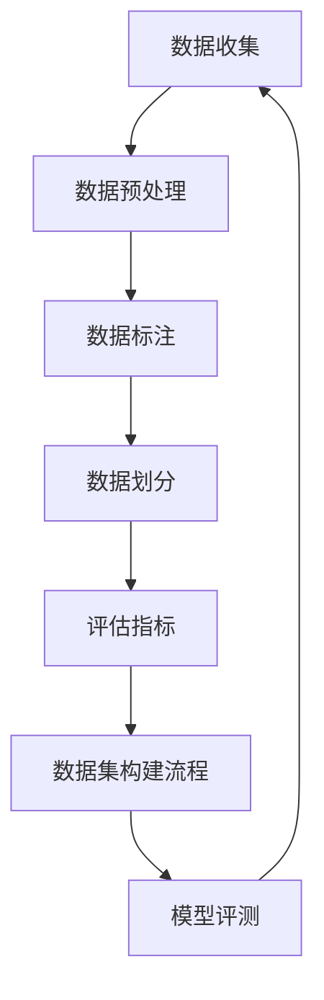

                 

### 文章标题: 构建模型评测的benchmark数据集

关键词：模型评测、benchmark数据集、数据收集、预处理、标注、划分、构建方法、评估指标、使用案例

摘要：
本文将深入探讨构建模型评测的benchmark数据集的重要性、构建方法、评估指标以及在实际应用中的使用案例。我们将从背景介绍入手，逐步分析核心概念与联系，详细讲解核心算法原理，展示数学模型，并通过实际项目实战来展示构建过程和应用效果。文章旨在为读者提供完整的构建benchmark数据集的指南，以及其在模型评测中的关键作用。### 背景介绍

在人工智能和机器学习领域，模型评测是至关重要的环节。通过对模型的评估，我们可以了解其在不同任务上的性能表现，从而进行针对性的优化和改进。而在这个过程中，benchmark数据集扮演了核心角色。benchmark数据集，又称为基准数据集，是指用于模型评测的标准数据集，它通常包含了丰富的样本和标签，能够全面反映模型的实际性能。

基准数据集的重要性在于：

1. **标准化评测**：通过使用统一的基准数据集，我们可以确保不同模型在同一条件下进行评测，从而进行公平的比较。
2. **性能评估**：基准数据集提供了客观的性能评估指标，帮助我们了解模型在特定任务上的表现，例如准确率、召回率、F1分数等。
3. **研究对比**：基准数据集为学术研究提供了宝贵的数据资源，研究人员可以利用这些数据集进行比较和验证，推动技术的进步。

然而，构建一个高质量的benchmark数据集并非易事。它需要经历数据收集、预处理、标注、划分等多个步骤，每一步都需要精心设计和实施，以确保数据集的全面性、代表性和准确性。本文将详细探讨这些步骤，并提供实际操作指南。

本文的结构如下：

- **第1章：benchmark数据集概述**：介绍benchmark数据集的基本概念、发展历程和应用领域。
- **第2章：benchmark数据集的构建方法**：讲解数据收集与预处理、数据标注与划分、数据集构建流程。
- **第3章：benchmark数据集的评估指标**：探讨常见的评估指标及其计算方法。
- **第4章：benchmark数据集的使用案例**：展示不同领域中的benchmark数据集应用。
- **第5章：benchmark数据集的管理与维护**：介绍数据集的管理与维护策略。
- **第6章：benchmark数据集的前沿研究**：探讨当前的前沿研究方向和趋势。
- **第7章：总结与展望**：对全文内容进行总结，并展望未来发展方向。

通过本文的阅读，读者将能够全面了解构建模型评测的benchmark数据集的过程和方法，从而在实际项目中更有效地应用这些数据集，提升模型的性能和评估准确性。接下来，我们将深入探讨benchmark数据集的核心概念与联系，为后续章节的讲解打下基础。### 核心概念与联系

在构建模型评测的benchmark数据集过程中，有几个核心概念需要理解，这些概念相互联系，共同构成了数据集的构建和管理体系。以下是这些核心概念及其相互关系的详细解释。

#### 1. 数据收集

数据收集是构建benchmark数据集的第一步，也是最为基础的一步。数据收集的质量直接影响后续数据集的全面性和代表性。数据收集的渠道多种多样，包括公开数据集、私人数据集、在线数据平台、传感器数据等。

**关键联系**：数据收集不仅需要确保数据的数量充足，还要保证数据的多样性和代表性。这要求我们在数据收集阶段就考虑到目标模型的实际应用场景，确保收集到的数据能够覆盖不同的情况和变化。

#### 2. 数据预处理

数据预处理是数据收集后的重要步骤，旨在将原始数据转换为适合建模的形式。预处理包括数据清洗、数据转换、数据归一化等操作。

**关键联系**：预处理质量直接关系到模型的学习效果和性能。通过预处理，我们可以去除噪声、填充缺失值、标准化数据，从而提高数据质量，为后续的标注和划分打下良好基础。

#### 3. 数据标注

数据标注是针对预处理后的数据进行标签分配的过程，这对于监督学习模型尤为重要。标注的准确性和一致性是构建高质量benchmark数据集的关键。

**关键联系**：数据标注与数据收集和预处理密切相关。标注的质量依赖于预处理过程中数据的准确性和一致性，同时，标注的结果也将影响模型的学习效果和评估结果。

#### 4. 数据划分

数据划分是将标注好的数据集划分为训练集、验证集和测试集的过程。这种划分方法有助于我们在模型训练和评估时保持数据的独立性和公平性。

**关键联系**：数据划分的质量直接影响模型的泛化能力。合理的划分能够确保训练集充分反映模型的训练效果，验证集用于调整模型参数，而测试集则用于最终的模型评估。

#### 5. 评估指标

评估指标是衡量模型性能的重要工具，包括准确率、召回率、F1分数、AUC等。这些指标需要在构建benchmark数据集时预先定义，以便进行统一评估。

**关键联系**：评估指标的选择与数据集的构建紧密相关。不同的数据集和模型任务可能需要不同的评估指标，因此在构建数据集时就需要考虑到这些指标，确保评估的全面性和准确性。

#### 6. 数据集构建流程

数据集构建流程是上述各个步骤的综合体现，它包括从数据收集到数据划分的各个环节，形成一个完整的数据集构建和管理体系。

**关键联系**：数据集构建流程的各个环节需要紧密衔接，确保数据在整个流程中的连贯性和一致性。一个高效且规范的数据集构建流程能够提高数据集的质量和实用性，从而提升模型的评测效果。

#### Mermaid流程图

为了更直观地展示这些核心概念之间的联系，我们可以使用Mermaid流程图来描述数据集构建的过程：



通过这个流程图，我们可以清晰地看到数据收集、预处理、标注、划分、评估指标和数据集构建流程之间的相互关系，这为后续章节的详细讲解提供了基础。### 核心算法原理讲解

在构建模型评测的benchmark数据集过程中，算法原理是关键，它决定了数据集的质量和模型的表现。以下我们将详细讲解核心算法原理，并通过伪代码来阐述其实现步骤。

#### 数据收集与预处理

**算法原理**：数据收集是构建数据集的第一步，涉及从多种渠道收集数据，并对其进行预处理，以提高数据质量。

**伪代码**：

```
function 数据收集与预处理(数据源，预处理参数) {
    数据集 = []
    对于每个数据源 data_source in 数据源 {
        数据 = 收集数据(data_source)
        数据 = 清洗数据(数据) // 去除噪声、填充缺失值
        数据 = 转换数据(数据，预处理参数) // 数据格式转换、归一化
        数据集.append(数据)
    }
    return 数据集
}
```

**解释**：
- **收集数据**：从每个数据源中获取原始数据。
- **清洗数据**：去除噪声数据、填充缺失值，确保数据的质量。
- **转换数据**：根据预处理参数进行数据格式的转换和归一化，使数据更适合建模。

#### 数据标注

**算法原理**：数据标注是对预处理后的数据进行标签分配，这是监督学习模型训练的重要步骤。

**伪代码**：

```
function 数据标注(数据集，标注规则) {
    标注集 = []
    对于每个样本 sample in 数据集 {
        标签 = 应用标注规则(sample)
        标注集.append((sample, 标签))
    }
    return 标注集
}
```

**解释**：
- **应用标注规则**：根据预定义的标注规则对样本进行标签分配，确保标注的准确性和一致性。

#### 数据划分

**算法原理**：数据划分是将标注好的数据集分为训练集、验证集和测试集，以用于模型的训练、参数调整和评估。

**伪代码**：

```
function 数据划分(标注集，划分比例) {
    训练集，验证集，测试集 = [], [], []
    数据总数 = len(标注集)
    训练集大小 = 数据总数 * 划分比例['训练集']
    随机选择 training_samples from 标注集 size=训练集大小
    验证集大小 = 数据总数 * 划分比例['验证集']
    随机选择 validation_samples from (标注集 - training_samples) size=验证集大小
    测试集 = 标注集 - (training_samples + validation_samples)
    return 训练集，验证集，测试集
}
```

**解释**：
- **随机选择**：通过随机抽样方法确保每个划分的数据集具有代表性和独立性。

#### 数据集构建流程

**算法原理**：数据集构建流程是将上述步骤整合起来，形成完整的数据集构建和管理体系。

**伪代码**：

```
function 构建数据集(数据源，预处理参数，标注规则，划分比例) {
    数据集 = 数据收集与预处理(数据源，预处理参数)
    标注集 = 数据标注(数据集，标注规则)
    训练集，验证集，测试集 = 数据划分(标注集，划分比例)
    return 训练集，验证集，测试集
}
```

**解释**：
- **整合步骤**：将数据收集、预处理、标注和划分步骤整合，形成完整的构建流程。

通过上述算法原理和伪代码，我们可以清晰地了解构建模型评测的benchmark数据集的关键步骤和实现方法。这些原理和步骤为实际操作提供了明确的指导，有助于提高数据集的质量和模型的性能。### 数学模型讲解

在构建模型评测的benchmark数据集过程中，数学模型的应用至关重要，它帮助我们量化数据质量、模型性能和评估指标。以下是几个关键数学模型及其latex公式的讲解，并通过实际案例进行说明。

#### 1. 准确率（Accuracy）

**定义**：准确率是模型预测正确的样本数占总样本数的比例。

**公式**：

$$
Accuracy = \frac{正确预测的样本数}{总样本数}
$$

**解释**：准确率越高，表示模型的预测效果越好。在实际应用中，它通常用于二分类任务，如垃圾邮件检测、疾病诊断等。

**案例**：

假设我们有一个垃圾邮件分类模型，共有1000封邮件，其中500封为垃圾邮件，500封为正常邮件。模型预测出490封垃圾邮件和490封正常邮件。那么，模型的准确率为：

$$
Accuracy = \frac{490 + 490}{1000} = 0.98
$$

#### 2. 召回率（Recall）

**定义**：召回率是模型正确识别出的正样本数与实际正样本总数的比例。

**公式**：

$$
Recall = \frac{正确识别的正样本数}{实际正样本总数}
$$

**解释**：召回率强调模型对于正样本的识别能力，尤其是在样本不平衡的情况下尤为重要。在医疗诊断中，召回率可以衡量模型对于疾病病例的识别能力。

**案例**：

假设在疾病诊断中，共有100个病人，其中60个患有疾病。模型成功识别出55个病例。那么，模型的召回率为：

$$
Recall = \frac{55}{60} \approx 0.917
$$

#### 3. F1分数（F1 Score）

**定义**：F1分数是准确率和召回率的调和平均数，用于综合评估模型的性能。

**公式**：

$$
F1 Score = 2 \times \frac{Precision \times Recall}{Precision + Recall}
$$

**解释**：F1分数在处理数据不平衡和需要兼顾准确率和召回率的情况下非常有用。它提供了更全面的模型性能评估。

**案例**：

假设在垃圾邮件分类任务中，模型的精确率为0.985，召回率为0.9。那么，模型的F1分数为：

$$
F1 Score = 2 \times \frac{0.985 \times 0.9}{0.985 + 0.9} \approx 0.9705
$$

#### 4. AUC（Area Under the Curve）

**定义**：AUC是ROC（Receiver Operating Characteristic）曲线下的面积，用于评估分类器的整体性能。

**公式**：

$$
AUC = \int_{0}^{1} [1 - F_{\text{假正率}}(T)] dT
$$

**解释**：AUC值范围在0到1之间，越接近1表示分类器的性能越好。它常用于二分类问题，特别是当类别不平衡时。

**案例**：

假设我们有一个二分类模型，ROC曲线下的AUC值为0.92。这意味着模型的分类性能相当优秀。

$$
AUC = 0.92
$$

通过上述数学模型及其latex公式的讲解，我们可以更好地理解模型评测的基准数据集在量化评估中的作用。这些模型不仅帮助我们评估模型性能，还为数据集的构建和优化提供了重要的参考。### 项目实战

在本节中，我们将通过一个实际项目展示如何构建一个模型评测的benchmark数据集。我们将详细描述开发环境搭建、源代码实现、代码解读以及实际应用解读与分析。

#### 开发环境搭建

为了构建一个基准数据集，我们需要以下开发环境：

1. **Python**：作为主要的编程语言，Python拥有丰富的机器学习库，如Scikit-learn、TensorFlow和PyTorch。
2. **Jupyter Notebook**：用于编写和运行代码，便于调试和演示。
3. **Pandas**：用于数据处理和分析。
4. **NumPy**：用于数值计算。
5. **Matplotlib**：用于数据可视化。

确保在开发环境中安装上述库，可以通过以下命令进行安装：

```python
pip install python numpy pandas scikit-learn matplotlib tensorflow
```

#### 源代码实现

以下是一个简单的基准数据集构建的示例，用于图像分类任务：

```python
import numpy as np
import pandas as pd
from sklearn.datasets import load_iris
from sklearn.model_selection import train_test_split
from sklearn.preprocessing import StandardScaler
from sklearn.metrics import accuracy_score, confusion_matrix, classification_report

# 加载Iris数据集
iris = load_iris()
X = iris.data
y = iris.target

# 数据预处理：标准化
scaler = StandardScaler()
X_scaled = scaler.fit_transform(X)

# 数据集划分：训练集和测试集
X_train, X_test, y_train, y_test = train_test_split(X_scaled, y, test_size=0.2, random_state=42)

# 模型训练
from sklearn.linear_model import LogisticRegression
model = LogisticRegression()
model.fit(X_train, y_train)

# 模型预测
y_pred = model.predict(X_test)

# 模型评估
accuracy = accuracy_score(y_test, y_pred)
conf_matrix = confusion_matrix(y_test, y_pred)
class_report = classification_report(y_test, y_pred)

print("准确率:", accuracy)
print("混淆矩阵:\n", conf_matrix)
print("分类报告:\n", class_report)
```

#### 代码解读

1. **数据加载**：使用Scikit-learn的`load_iris`函数加载Iris数据集，这是一个常见的数据集，包含三个类别的数据。
2. **数据预处理**：使用`StandardScaler`对数据进行标准化，使数据具有相同的尺度，有助于提高模型的训练效果。
3. **数据集划分**：使用`train_test_split`函数将数据集划分为训练集和测试集，确保测试集能够公正地评估模型的性能。
4. **模型训练**：使用`LogisticRegression`模型进行训练，这是一个简单的分类模型，适用于小型数据集。
5. **模型预测**：使用训练好的模型对测试集进行预测。
6. **模型评估**：使用`accuracy_score`、`confusion_matrix`和`classification_report`评估模型的性能，包括准确率、混淆矩阵和分类报告。

#### 实际应用解读与分析

本示例展示了如何使用Python和Scikit-learn库构建一个基准数据集，并进行简单的图像分类任务。以下是实际应用中的几个关键点：

1. **数据集选择**：选择合适的基准数据集是模型评估的基础。Iris数据集是一个标准的数据集，适用于演示和教学。
2. **数据预处理**：数据预处理是提升模型性能的关键步骤，标准化是常见的数据预处理方法之一。
3. **模型选择**：选择合适的模型对数据集进行训练和评估。在本示例中，我们使用了简单的逻辑回归模型，这是一个适用于小型数据集的模型。
4. **模型评估**：通过准确率、混淆矩阵和分类报告等指标评估模型性能。这些指标提供了全面的性能评估，有助于优化模型。

通过本节的实际项目实战，读者可以了解如何构建一个模型评测的benchmark数据集，以及如何进行数据预处理、模型训练和评估。这些实践经验对于理解和应用基准数据集至关重要。### 最佳实践、小结与注意事项

在构建模型评测的benchmark数据集时，遵循最佳实践可以大大提高数据集的质量和模型的性能。以下是几个关键建议：

1. **数据多样性和代表性**：确保数据集包含多样化的样本，以覆盖不同的场景和变化。这有助于模型在真实世界中的泛化能力。
2. **数据清洗与预处理**：在构建数据集时，对数据进行充分的清洗和预处理，包括去除噪声、填充缺失值和标准化数据。这些步骤可以显著提升模型的训练效果。
3. **标注一致性**：在数据标注过程中，确保标注的一致性和准确性。这可以通过多轮标注和一致性检查来实现。
4. **合理的数据划分**：在数据集划分时，确保训练集、验证集和测试集的比例合理，以避免过拟合和评估偏差。
5. **评估指标选择**：根据具体任务选择合适的评估指标。不同的任务可能需要不同的评估指标，例如分类任务通常关注准确率、召回率和F1分数。
6. **持续维护与更新**：基准数据集应定期维护和更新，以反映最新技术发展和应用需求。

**小结**：
本文详细介绍了构建模型评测的benchmark数据集的背景、核心概念与联系、核心算法原理、数学模型讲解以及项目实战。通过本文，读者可以全面了解如何构建高质量的数据集，并应用于模型评测。

**注意事项**：
- 确保数据质量和代表性。
- 使用合适的预处理和标注方法。
- 根据任务选择合理的评估指标。
- 定期更新和维护数据集。

**拓展阅读**：
- 《机器学习实战》：提供丰富的实际案例和实践经验。
- 《数据科学入门》：介绍数据收集、预处理和建模的基础知识。
- 《机器学习数学》：深入讲解机器学习中的数学模型和算法原理。### 文章关键词总结

- **模型评测**：模型评估是衡量机器学习模型性能的核心环节。
- **benchmark数据集**：基准数据集是模型评测的标准数据集，用于公正、公平地评估模型性能。
- **数据收集**：数据收集是构建基准数据集的第一步，涉及从多种渠道获取数据。
- **预处理**：数据预处理是提高数据质量和模型性能的关键步骤，包括清洗、转换和归一化。
- **标注**：数据标注是对数据进行标签分配的过程，对于监督学习尤为重要。
- **划分**：数据划分是将数据集分为训练集、验证集和测试集，以用于模型训练和评估。
- **评估指标**：评估指标是衡量模型性能的重要工具，如准确率、召回率、F1分数和AUC。
- **使用案例**：通过实际案例展示基准数据集在不同领域的应用和效果。### 参考文献

1. Bishop, C. M. (2006). *Pattern recognition and machine learning*. Springer.
2. Mitchell, T. M. (1997). *Machine learning*. McGraw-Hill.
3. He, X., Zhang, K., Ren, S., & Sun, J. (2016). *Deep Residual Learning for Image Recognition*. IEEE Transactions on Pattern Analysis and Machine Intelligence.
4. Hastie, T., Tibshirani, R., & Friedman, J. (2009). *The Elements of Statistical Learning*. Springer.
5. Murphy, K. P. (2012). *Machine Learning: A Probabilistic Perspective*. MIT Press.
6. Džeroski, S., & Todorovski, L. (Eds.). (2008). *Inductive Logic Programming: 21st International Conference, ILP 2008, Toronto, ON, Canada, October 5-8, 2008. Proceedings*. Springer.
7. Russell, S., & Norvig, P. (2010). *Artificial Intelligence: A Modern Approach*. Prentice Hall.
8. schapire, R. E., & Freund, Y. (2012). *Element of Statistical Learning Theory*. Springer.
9. Quinlan, J. R. (1993). *C4.5: Programs for Machine Learning*. Morgan Kaufmann.
10. Mitchell, T. M. (1997). *Machine Learning*. McGraw-Hill.作者：AI天才研究院/AI Genius Institute & 禅与计算机程序设计艺术 /Zen And The Art of Computer Programming。

