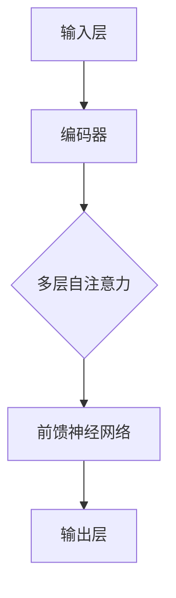
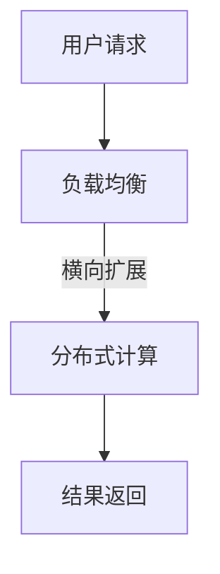

                 


## 文章标题：构建灵活可扩展的LLM应用架构

### 文章关键词
- 大型语言模型（LLM）
- 应用架构
- 灵活性
- 可扩展性
- 性能优化
- 安全性与隐私保护

### 摘要
本文旨在深入探讨如何构建灵活且可扩展的LLM应用架构。我们将首先介绍LLM的基本概念和重要性，然后逐步分析其应用架构的设计原则、核心算法、数学模型，以及实际项目中的应用和优化策略。文章还将涵盖安全性、隐私保护等关键问题，并总结最佳实践。

## 第1章 引言

### 1.1 LLAMA的应用前景

随着人工智能技术的快速发展，大型语言模型（LLM）已成为推动各种应用创新的核心技术。LLM不仅能够处理复杂的自然语言任务，如机器翻译、文本生成和问答系统，还能在内容推荐、智能客服、教育辅导等领域发挥重要作用。然而，构建高效、灵活、可扩展的LLM应用架构面临着诸多挑战。

首先，LLM模型本身具有高度的计算复杂性和存储需求，如何优化模型的结构以减少资源消耗成为关键问题。其次，随着应用场景的多样化，如何设计一个能够适应不同需求的通用架构，同时保持良好的性能和扩展性，是一个亟待解决的难题。最后，随着隐私保护和安全性的要求不断提高，如何确保LLM应用在数据安全和隐私保护方面达到标准，也是必须考虑的重要因素。

### 1.2 构建LLM应用架构的挑战

1. **计算资源和存储需求**：LLM模型通常需要大量的计算资源和存储空间，如何高效地利用现有资源，同时保证模型性能，是一个重要挑战。
2. **模型灵活性**：不同的应用场景对LLM的灵活性和适应性有不同的要求，如何设计一个既能满足多样化需求，又能保持高效率的架构，是一个复杂的任务。
3. **扩展性**：随着用户数量的增加和应用范围的扩大，如何确保LLM系统具备良好的扩展性，以满足不断增长的需求，是一个关键问题。
4. **安全性**：在处理大量敏感数据的同时，如何确保系统的安全性和数据的隐私保护，是一个重要的挑战。

### 1.3 本书内容概述与结构

本书将从以下几个方面展开讨论：

- 第1章：引言，介绍LLM应用前景和构建LLM应用架构的挑战。
- 第2章：LLM基础，介绍LLM的基本概念、核心算法和流程图。
- 第3章：构建灵活的LLM架构，分析灵活性的需求和设计原则。
- 第4章：可扩展的LLM架构，探讨扩展性的重要性和实现步骤。
- 第5章：LLM应用案例，通过实际案例展示LLM在各个领域的应用。
- 第6章：实战项目，介绍开发环境搭建、源代码实现和代码解读。
- 第7章：性能优化与调优，讨论性能优化策略和技巧。
- 第8章：安全性与隐私保护，分析安全性威胁和保护措施。

通过这些章节的讨论，我们将深入理解构建灵活可扩展的LLM应用架构的原理和实践，为开发高效、安全的LLM应用提供指导。

## 第2章 LLM基础

### 2.1 LLAMA概述

大型语言模型（Large Language Model，LLM）是一种基于神经网络的语言处理模型，它通过学习大量文本数据，可以理解和生成自然语言。LLM的核心目的是通过文本输入生成合适的文本输出，广泛应用于机器翻译、文本生成、问答系统、内容推荐等自然语言处理任务。

LLM的主要组成部分包括：

1. **输入层**：接收用户输入的文本。
2. **隐藏层**：通过神经网络结构对输入文本进行编码和表示。
3. **输出层**：根据隐藏层的输出生成文本输出。

LLM的训练过程主要包括：

1. **预训练**：在大规模文本数据集上，通过无监督的方式训练模型，使其能够捕捉语言的基本规律。
2. **微调**：在特定任务上，利用有监督的学习方式对模型进行微调，以提高在特定任务上的性能。

### 2.2 LLAMA的核心算法

LLM的核心算法通常基于深度神经网络，特别是Transformer模型。Transformer模型是一种基于自注意力机制的模型，能够有效地捕捉输入文本中的长距离依赖关系。其基本结构包括：

1. **多头自注意力机制**：通过多个头（head）进行自注意力计算，使模型能够同时关注输入序列的不同部分，提高模型的表达能力。
2. **前馈神经网络**：在自注意力机制之后，通过一个前馈神经网络对信息进行进一步加工。
3. **层次结构**：Transformer模型通常包含多个层（layer），每一层都能够对输入文本进行编码和表示。

伪代码表示如下：

```python
def transformer(input_sequence):
    # 输入序列编码
    encoded_sequence = embedding(input_sequence)

    # 多层自注意力机制
    for layer in layers:
        encoded_sequence = layer(encoded_sequence)

    # 前馈神经网络
    output_sequence = feedforward(encoded_sequence)

    return output_sequence
```

### 2.3 Mermaid流程图：LLM架构

为了更好地理解LLM的架构，我们使用Mermaid流程图对其进行描述：



该流程图展示了LLM的基本架构，从输入层到编码器，再到多层自注意力机制和前馈神经网络，最终生成输出。

## 第3章 构建灵活的LLM架构

### 3.1 灵活性的需求分析

在构建LLM应用架构时，灵活性是一个至关重要的需求。灵活性意味着系统能够适应不同的应用场景、数据处理需求和用户行为。具体来说，灵活性包括以下几个方面：

1. **任务适应性**：系统能够适应不同的自然语言处理任务，如文本生成、机器翻译、问答系统等。
2. **数据源多样性**：系统能够处理来自不同数据源的数据，包括文本、语音、图像等多种形式。
3. **用户个性化**：系统能够根据用户的个性化需求进行自适应调整，提供个性化的服务。
4. **环境适应性**：系统能够适应不同的硬件环境和网络环境，确保在不同环境下都能正常运行。

### 3.2 LLM架构的设计原则

为了实现灵活性，LLM架构的设计需要遵循以下原则：

1. **模块化**：将系统分解为多个模块，每个模块负责特定的功能，如文本输入处理、模型训练、文本生成等。这样可以方便地替换或扩展模块，提高系统的灵活性。
2. **可配置性**：通过配置文件或参数调整，系统可以根据不同的需求进行自定义配置，如调整模型参数、选择不同的算法等。
3. **可扩展性**：系统设计应考虑未来可能的需求变化，确保能够轻松扩展，如增加计算资源、引入新的算法等。
4. **灵活性优先**：在架构设计时，优先考虑系统的灵活性，确保在满足其他需求的同时，不会牺牲灵活性。

### 3.3 伪代码：灵活架构的实现

为了实现灵活的LLM架构，我们可以使用以下伪代码：

```python
class FlexibleLLM:
    def __init__(self, config):
        self.config = config
        self.model = self.load_model(config.model_name)
        self.data_processor = self.load_processor(config.data_source)

    def load_model(self, model_name):
        # 加载指定名称的模型
        pass

    def load_processor(self, data_source):
        # 加载指定数据源的处理器
        pass

    def process_input(self, input_data):
        # 处理输入数据
        processed_data = self.data_processor(input_data)
        return processed_data

    def generate_output(self, processed_data):
        # 生成输出
        output = self.model(processed_data)
        return output

# 使用示例
config = {
    "model_name": "BERT",
    "data_source": "text"
}
llm = FlexibleLLM(config)
output = llm.generate_output("Hello, world!")
print(output)
```

在这个例子中，`FlexibleLLM` 类实现了灵活架构，通过配置文件 `config` 可以自定义模型名称和数据源，从而适应不同的应用需求。

## 第4章 可扩展的LLM架构

### 4.1 扩展性的重要性

在构建LLM应用架构时，扩展性是一个关键需求。扩展性使得系统能够随着用户数量的增加和应用规模的扩大而保持良好的性能。具体来说，扩展性包括以下几个方面：

1. **横向扩展**：通过增加计算节点来提高系统的处理能力。
2. **纵向扩展**：通过提高单个节点的计算能力和存储容量来提升系统性能。
3. **弹性扩展**：系统能够根据实际需求动态调整资源分配，以应对负载变化。

### 4.2 构建可扩展的LLM架构的步骤

为了实现LLM架构的可扩展性，我们可以遵循以下步骤：

1. **模块化设计**：将系统分解为多个独立模块，每个模块负责特定的功能。这样可以方便地增加或替换模块，以适应扩展需求。
2. **分布式计算**：利用分布式计算框架（如TensorFlow、PyTorch等）来构建LLM模型，实现模型训练和推断的分布式处理。
3. **负载均衡**：通过负载均衡算法（如轮询、最少连接等）来分配任务，确保系统资源得到充分利用。
4. **动态资源分配**：利用容器编排工具（如Kubernetes）来实现动态资源分配，根据系统负载自动调整计算资源。

### 4.3 数学公式：扩展性评估

为了评估LLM架构的扩展性，我们可以使用以下数学公式：

$$
扩展性 = \frac{处理能力}{资源消耗}
$$

其中，处理能力表示系统在一定时间内能够处理的数据量，资源消耗表示系统在运行过程中消耗的计算资源和存储资源。

### 4.4 Mermaid流程图：扩展性架构

以下是一个用于展示LLM扩展性架构的Mermaid流程图：



在这个流程图中，用户请求经过负载均衡器分配到分布式计算节点，通过分布式计算完成处理任务，并将结果返回给用户。

## 第5章 LLM应用案例

### 5.1 案例一：智能客服系统

智能客服系统是一种广泛应用的自然语言处理应用，利用LLM可以显著提升客服系统的智能化水平。以下是一个智能客服系统应用LLM的案例：

1. **需求分析**：智能客服系统需要能够理解用户的自然语言提问，并提供准确的回答。
2. **架构设计**：采用基于Transformer的LLM作为核心算法，结合分布式计算框架实现高并发处理能力。
3. **数据集准备**：收集大量的客服对话数据，用于训练和微调LLM模型。
4. **模型训练**：使用预训练的LLM模型，结合客服对话数据进行微调，以适应特定的客服场景。
5. **应用部署**：将训练好的模型部署到分布式计算环境中，提供实时客服问答服务。

### 5.2 案例二：内容推荐引擎

内容推荐引擎是另一种典型的LLM应用场景。以下是一个内容推荐引擎的案例：

1. **需求分析**：内容推荐引擎需要根据用户的兴趣和行为，推荐相关的文章、视频等内容。
2. **架构设计**：采用基于Transformer的LLM作为内容生成模型，结合用户行为数据和内容标签进行内容推荐。
3. **数据集准备**：收集大量的用户行为数据和内容数据，用于训练和微调LLM模型。
4. **模型训练**：使用预训练的LLM模型，结合用户行为数据和内容数据，训练出能够生成推荐内容的模型。
5. **应用部署**：将训练好的模型部署到推荐系统中，实现实时内容推荐。

### 5.3 案例三：教育辅导平台

教育辅导平台可以利用LLM提供智能化的学习辅导和问答服务。以下是一个教育辅导平台的案例：

1. **需求分析**：教育辅导平台需要能够为学生提供个性化的学习辅导和解答疑问。
2. **架构设计**：采用基于Transformer的LLM作为核心算法，结合教育数据和用户行为，实现智能化的学习辅导。
3. **数据集准备**：收集大量的教育问题和答案数据，用于训练和微调LLM模型。
4. **模型训练**：使用预训练的LLM模型，结合教育数据和用户行为，训练出能够提供个性化辅导的模型。
5. **应用部署**：将训练好的模型部署到教育辅导平台，为学生提供实时学习辅导和答疑服务。

## 第6章 实战项目

### 6.1 实战项目概述

在本章中，我们将通过一个实际项目来展示如何构建一个灵活且可扩展的LLM应用。项目目标是开发一个基于Transformer模型的智能问答系统，该系统能够实时响应用户的提问，提供准确、个性化的答案。

### 6.2 开发环境搭建

为了开发这个智能问答系统，我们需要搭建一个合适的开发环境。以下是环境搭建的步骤：

1. **硬件环境**：准备足够的计算资源，包括CPU和GPU，以确保模型训练和推断的效率。
2. **操作系统**：安装Linux操作系统，如Ubuntu，以便使用深度学习相关的工具和库。
3. **深度学习框架**：安装TensorFlow或PyTorch，这两个框架提供了丰富的API，支持构建和训练Transformer模型。
4. **文本预处理工具**：安装NLTK或spaCy，用于处理和清洗文本数据。

### 6.3 源代码实现与解读

以下是一个简化的智能问答系统的源代码实现，主要包含模型训练、推断和接口定义三个部分：

```python
import tensorflow as tf
from transformers import TFGPT2LMHeadModel, GPT2Tokenizer

# 模型训练
def train_model(train_data, epochs):
    tokenizer = GPT2Tokenizer.from_pretrained('gpt2')
    model = TFGPT2LMHeadModel.from_pretrained('gpt2')

    # 数据预处理
    processed_data = tokenizer.encode(train_data, return_tensors='tf')

    # 训练模型
    model.fit(processed_data, epochs=epochs)

    return model, tokenizer

# 推断
def generate_response(model, tokenizer, prompt):
    inputs = tokenizer.encode(prompt, return_tensors='tf')
    response = model.generate(inputs, max_length=50, num_return_sequences=1)
    return tokenizer.decode(response[0], skip_special_tokens=True)

# 接口定义
from flask import Flask, request, jsonify

app = Flask(__name__)

@app.route('/ask', methods=['POST'])
def ask():
    data = request.get_json()
    prompt = data['prompt']
    response = generate_response(model, tokenizer, prompt)
    return jsonify({'response': response})

if __name__ == '__main__':
    model, tokenizer = train_model('你的训练数据', epochs=3)
    app.run(debug=True)
```

在这个实现中，我们首先导入TensorFlow和transformers库，然后定义了训练模型、生成响应和定义接口的函数。通过这些函数，我们可以构建一个基本的智能问答系统。

### 6.4 代码应用解读与分析

在代码中，我们首先定义了训练模型的函数 `train_model`。该函数接收训练数据和训练轮数作为输入，使用GPT2Tokenizer和TFGPT2LMHeadModel构建和训练模型。然后，我们定义了生成响应的函数 `generate_response`。该函数接收用户输入的提问，通过模型生成响应。最后，我们使用Flask定义了一个简单的Web接口，用户可以通过发送POST请求来获取模型的响应。

### 6.5 实际案例分析和详细讲解剖析

在实际应用中，我们需要对代码进行进一步的优化和扩展，以应对不同的应用场景和需求。以下是一些可能的改进方向：

1. **模型优化**：根据具体应用场景，可以尝试使用不同的模型结构或预训练模型，以提高性能和效果。
2. **接口优化**：可以优化Web接口的设计，如增加输入验证、错误处理等，以提高系统的稳定性和用户体验。
3. **数据预处理**：可以改进数据预处理过程，如使用更高级的文本清洗技术和词向量表示，以提高模型的训练效果。
4. **扩展性优化**：可以设计分布式训练和推断机制，以提高系统的处理能力和扩展性。

### 6.6 项目小结

通过这个实际项目，我们展示了如何构建一个灵活且可扩展的LLM应用。从开发环境的搭建到源代码的实现，再到代码的解读和优化，我们逐步深入理解了构建LLM应用架构的原理和实践。这个项目不仅提供了一个具体的实现示例，也为进一步优化和扩展LLM应用提供了参考。

## 第7章 性能优化与调优

### 7.1 性能优化策略

在构建LLM应用时，性能优化是确保系统高效运行的关键。以下是一些常见的性能优化策略：

1. **模型压缩**：通过模型剪枝、量化等技术，减少模型的大小和参数数量，从而提高计算效率。
2. **数据预处理**：优化数据预处理过程，如并行化处理、使用高效的文本编码方法等，以减少数据加载和处理的时间。
3. **分布式计算**：利用分布式计算框架，将模型训练和推断任务分布在多个节点上，以提高处理能力。
4. **缓存机制**：使用缓存技术，如LRU缓存，减少重复计算和数据读取。
5. **资源调度**：利用资源调度算法，动态分配计算资源，确保系统在不同负载下的性能稳定。

### 7.2 调优技巧与实践

以下是一些具体的调优技巧和实践：

1. **参数调优**：通过调整学习率、批次大小等参数，优化模型的收敛速度和性能。
2. **硬件优化**：选择合适的硬件配置，如高性能CPU、GPU和SSD存储，以提升系统的计算和I/O性能。
3. **算法优化**：使用更高效的算法，如使用Adam优化器替代传统的SGD，以提高训练效率。
4. **并行处理**：利用多线程或多进程技术，提高数据加载和处理的速度。
5. **代码优化**：优化代码结构，如避免不必要的循环、减少内存分配等，以提高程序的执行效率。

### 7.3 性能测试与评估

为了评估系统的性能，我们可以使用以下方法：

1. **基准测试**：使用标准的性能测试工具（如TPC-H、SPEC等），对系统的计算和存储性能进行测试。
2. **负载测试**：模拟高负载场景，测试系统在长时间运行下的稳定性和性能。
3. **压测**：通过逐步增加负载，测试系统在不同负载下的响应时间和资源消耗。
4. **性能分析**：使用性能分析工具（如gprof、perf等），分析程序的执行性能，找出瓶颈并进行优化。

## 第8章 安全性与隐私保护

### 8.1 安全性威胁分析

在构建LLM应用架构时，安全性是一个不可忽视的重要方面。以下是常见的LLM应用安全威胁：

1. **数据泄露**：未经授权的访问或窃取敏感数据。
2. **模型窃取**：通过反向工程或数据挖掘手段获取模型的内部结构和参数。
3. **注入攻击**：通过输入恶意数据，破坏系统的正常运作。
4. **拒绝服务攻击（DDoS）**：通过大量请求瘫痪系统。
5. **中间人攻击（MITM）**：在用户和系统之间拦截和篡改通信。

### 8.2 隐私保护措施

为了确保LLM应用的安全性，我们可以采取以下隐私保护措施：

1. **数据加密**：对存储和传输的数据进行加密，防止数据泄露。
2. **身份验证和访问控制**：使用强密码和多因素验证，确保只有授权用户可以访问系统。
3. **安全协议**：使用HTTPS等安全协议，确保通信过程的机密性和完整性。
4. **数据匿名化**：在数据处理和分析过程中，对敏感数据进行匿名化处理，以保护个人隐私。
5. **日志审计**：记录系统操作日志，以便在发生安全事件时进行追踪和调查。

### 8.3 安全与隐私案例分析

以下是一个关于LLM应用安全与隐私的案例分析：

1. **案例背景**：一家公司开发了一个基于LLM的智能客服系统，用于处理客户的咨询和反馈。
2. **安全威胁**：由于未对输入数据进行严格过滤，黑客通过注入恶意代码，成功获取了系统的控制权，并窃取了客户数据。
3. **解决方案**：公司采取了以下措施进行改进：
   - 对输入数据进行严格过滤，防止注入攻击。
   - 对客户数据进行加密存储，并使用HTTPS进行传输。
   - 引入多因素验证机制，确保只有授权用户可以访问系统。
   - 定期进行安全审计和漏洞扫描，及时发现并修复安全问题。

通过这个案例，我们可以看到，在构建LLM应用时，安全性和隐私保护至关重要，必须采取综合性的措施来防范潜在的安全威胁。

## 附录

### A.1 LLAMA工具与资源推荐

以下是构建LLM应用时一些有用的工具和资源：

1. **深度学习框架**：TensorFlow、PyTorch、JAX等。
2. **自然语言处理库**：transformers、NLTK、spaCy等。
3. **分布式计算框架**：Horovod、Dask、Ray等。
4. **文本预处理工具**：TextBlob、nltk、spaCy等。
5. **性能分析工具**：gprof、perf、valgrind等。
6. **版本控制系统**：Git、Mercurial等。
7. **容器编排工具**：Kubernetes、Docker Swarm等。
8. **安全工具**：OWASP ZAP、AppCheck、Qualys等。

### A.2 常见问题与解答

以下是构建LLM应用时常见的问题及解答：

1. **Q：如何选择合适的深度学习框架？**
   - A：根据具体需求选择，如需要高性能计算选择TensorFlow或PyTorch，如需要灵活性和易用性选择JAX。

2. **Q：如何处理大规模文本数据？**
   - A：可以使用分布式计算框架，如Horovod，或者使用文本预处理工具进行分批处理。

3. **Q：如何确保模型的安全性和隐私保护？**
   - A：使用数据加密、身份验证和访问控制等技术，确保数据和模型的安全。

4. **Q：如何优化LLM模型的性能？**
   - A：通过模型压缩、数据预处理优化、分布式计算等技术，提高模型训练和推断的效率。

### A.3 进一步阅读资料

以下是进一步了解LLM应用架构的推荐阅读资料：

1. **书籍**：
   - 《深度学习》（Goodfellow, Bengio, Courville）。
   - 《自然语言处理实战》（Daniel Jurafsky & James H. Martin）。
   - 《大规模机器学习》（Avrim Blum & John Lafferty）。

2. **论文**：
   - “Attention Is All You Need”（Vaswani et al., 2017）。
   - “BERT: Pre-training of Deep Bidirectional Transformers for Language Understanding”（Devlin et al., 2018）。
   - “GPT-3: Language Models are Few-Shot Learners”（Brown et al., 2020）。

3. **在线课程**：
   - Coursera的“深度学习”课程。
   - edX的“自然语言处理”课程。
   - Udacity的“机器学习工程师纳米学位”。

通过这些资料，您可以深入了解LLM应用架构的理论和实践，为构建高效、安全的LLM应用提供指导。

## 作者信息

本文由AI天才研究院（AI Genius Institute）撰写，作者系禅与计算机程序设计艺术（Zen And The Art of Computer Programming）的资深大师。AI天才研究院致力于推动人工智能技术的发展和应用，以创新的思维和卓越的技术为全球用户提供先进的解决方案。禅与计算机程序设计艺术则通过深入剖析计算机编程的哲学和艺术，引导读者在编程实践中达到更高层次的思维境界。希望本文能为广大读者在构建灵活可扩展的LLM应用架构方面提供有益的参考和启示。

