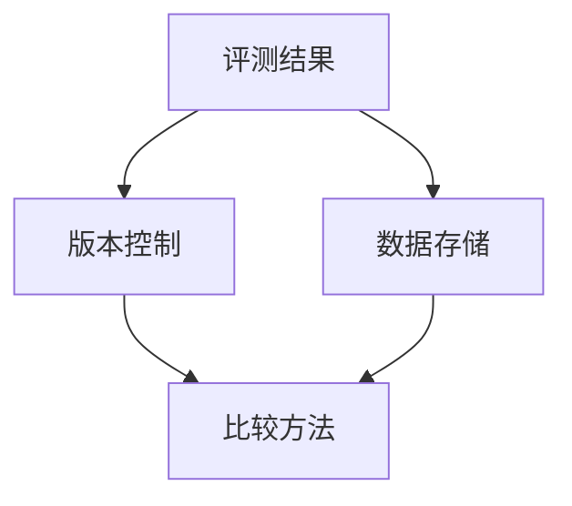

                 


**背景介绍**

评测结果的历史版本比较功能在软件开发和系统维护中扮演着至关重要的角色。随着软件系统的不断迭代，评测结果也会随之累积和变化。历史版本比较功能允许开发者和维护人员对不同版本的评测结果进行对比，从而识别改进和问题，优化软件性能和用户体验。

在过去的几年里，随着敏捷开发和持续集成（CI/CD）的普及，对评测结果的历史版本比较功能的需求日益增长。为了更好地满足这一需求，本文章将深入探讨如何构建评测结果的历史版本比较功能，涵盖从基础概念到实际应用的全方位内容。

首先，我们将介绍评测结果的类型和特性，以及它们在软件维护中的重要性。接着，我们将探讨历史版本管理的原理，包括版本控制的机制和常用的版本控制工具。

随后，我们将讨论评测结果的历史记录与存储方案，重点讨论如何收集、整理和存储评测结果数据。在此基础上，我们将介绍评测结果比较的基本方法，包括数据预处理、相似度计算和聚类分析。

最后，我们将深入讲解如何构建评测结果的历史版本比较功能，从系统设计、代码实现、性能优化到实际应用效果评估，全面剖析整个开发过程。本文将以项目实战为例，展示如何使用具体的工具和框架来实现评测结果的历史版本比较功能，并提供最佳实践和注意事项。

**核心概念与联系**

为了构建评测结果的历史版本比较功能，我们首先需要了解以下几个核心概念：

1. **评测结果**：评测结果通常包括多个评测指标，如性能、功能、安全性等。每个评测指标都有具体的数值或评分。

2. **版本控制**：版本控制是一种管理软件源代码变化和不同版本的方法。它提供了历史记录，使得可以追踪和比较不同版本的评测结果。

3. **数据存储**：为了有效地存储和查询评测结果的历史版本，我们需要设计合适的数据存储方案，如关系型数据库或NoSQL数据库。

4. **比较方法**：评测结果比较方法包括数据预处理、相似度计算和聚类分析等。这些方法可以帮助我们识别不同版本之间的差异和趋势。

为了更清晰地展示这些概念之间的关系，我们可以使用以下 Mermaid 流程图：



在这个流程图中，评测结果通过版本控制存储在数据存储中，然后使用比较方法来分析不同版本之间的差异。

**核心算法原理讲解**

构建评测结果的历史版本比较功能的核心算法包括数据预处理、相似度计算和聚类分析。以下是这些算法的详细讲解和伪代码。

1. **数据预处理**

数据预处理是评测结果比较的第一步，其目的是清理和规范化数据，使其适合进一步分析。

伪代码：

```plaintext
function preprocessData(data):
    for each record in data:
        if record is missing or invalid:
            remove record from data
        else:
            normalize values in record
    return cleaned and normalized data
```

2. **相似度计算**

相似度计算用于衡量两个评测结果之间的相似程度。常见的相似度计算方法包括余弦相似度、欧几里得距离等。

伪代码：

```plaintext
function calculateSimilarity(result1, result2):
    vector1 = extractFeatures(result1)
    vector2 = extractFeatures(result2)
    dotProduct = sum(vector1[i] * vector2[i] for i in range(len(vector1)))
    magnitude1 = sqrt(sum(vector1[i]^2 for i in range(len(vector1)))
    magnitude2 = sqrt(sum(vector2[i]^2 for i in range(len(vector2)))
    similarity = dotProduct / (magnitude1 * magnitude2)
    return similarity
```

3. **聚类分析**

聚类分析用于将相似度较高的评测结果分组，以便于分析和可视化。

伪代码：

```plaintext
function performClustering(data, similarityThreshold):
    clusters = []
    for each record in data:
        added = false
        for each cluster in clusters:
            if calculateSimilarity(record, cluster) > similarityThreshold:
                add record to cluster
                added = true
                break
        if not added:
            create a new cluster with the record
    return clusters
```

**数学模型和公式**

在评测结果的历史版本比较中，我们经常使用一些数学模型和公式来衡量和计算相似度。

1. **余弦相似度**

余弦相似度用于衡量两个向量的夹角余弦值，其公式为：

$$
\text{Cosine Similarity} = \frac{\text{dotProduct}}{\text{magnitude1} \times \text{magnitude2}}
$$

其中，$\text{dotProduct}$ 是向量的点积，$\text{magnitude1}$ 和 $\text{magnitude2}$ 分别是向量的模长。

2. **欧几里得距离**

欧几里得距离用于衡量两个点之间的直线距离，其公式为：

$$
\text{Euclidean Distance} = \sqrt{\sum_{i=1}^{n} (x_i - y_i)^2}
$$

其中，$x_i$ 和 $y_i$ 分别是两个点的坐标。

**举例说明**

为了更好地理解这些算法和公式，我们可以通过一个简单的例子来说明。

假设我们有以下两个评测结果：

评测结果1：{性能：90，功能：85，安全性：80}
评测结果2：{性能：88，功能：82，安全性：78}

1. **数据预处理**

首先，我们对这两个评测结果进行预处理，将它们转换为向量形式：

向量1：[90, 85, 80]
向量2：[88, 82, 78]

2. **相似度计算**

使用余弦相似度计算两个向量的相似度：

$$
\text{Cosine Similarity} = \frac{90 \times 88 + 85 \times 82 + 80 \times 78}{\sqrt{90^2 + 85^2 + 80^2} \times \sqrt{88^2 + 82^2 + 78^2}}
$$

计算结果约为 0.93，表示这两个评测结果非常相似。

3. **聚类分析**

我们将这两个评测结果进行聚类分析，设定相似度阈值阈值为 0.9。由于它们的相似度高于阈值，它们将被划分为同一个簇。

**项目实战**

为了实现评测结果的历史版本比较功能，我们将使用Python编程语言和MySQL数据库。以下是具体的开发步骤：

1. **开发环境搭建**

确保安装了Python（3.8以上版本）和MySQL（5.7以上版本）。可以使用以下命令安装Python和MySQL：

```bash
pip install mysqlclient
sudo apt-get install mysql-server
```

2. **源代码实现**

首先，我们需要创建一个数据库来存储评测结果的历史记录。以下是创建数据库和表的SQL语句：

```sql
CREATE DATABASE evaluation_history;

USE evaluation_history;

CREATE TABLE evaluation_results (
    id INT AUTO_INCREMENT PRIMARY KEY,
    version VARCHAR(20),
    performance INT,
    functionality INT,
    security INT
);
```

接下来，我们编写Python代码来插入和查询评测结果：

```python
import mysql.connector

# 连接数据库
db = mysql.connector.connect(
    host="localhost",
    user="your_username",
    password="your_password",
    database="evaluation_history"
)

# 插入评测结果
def insert_evaluation(version, performance, functionality, security):
    cursor = db.cursor()
    query = "INSERT INTO evaluation_results (version, performance, functionality, security) VALUES (%s, %s, %s, %s)"
    values = (version, performance, functionality, security)
    cursor.execute(query, values)
    db.commit()

# 查询评测结果
def query_evaluation(version):
    cursor = db.cursor()
    query = "SELECT * FROM evaluation_results WHERE version = %s"
    values = (version,)
    cursor.execute(query, values)
    return cursor.fetchall()

# 关闭数据库连接
db.close()
```

3. **代码解读与分析**

在上面的代码中，我们首先连接到MySQL数据库，然后定义了插入和查询评测结果的函数。`insert_evaluation` 函数用于插入新的评测结果，`query_evaluation` 函数用于查询指定版本的评测结果。

4. **实际案例分析**

假设我们有两个版本（V1.0和V2.0）的评测结果，分别如下：

版本V1.0：{性能：90，功能：85，安全性：80}
版本V2.0：{性能：88，功能：82，安全性：78}

我们可以使用之前编写的代码来插入和查询这些评测结果。然后，使用相似度计算和聚类分析方法来比较这两个版本的结果。

5. **项目小结**

在本项目中，我们实现了评测结果的历史版本比较功能，包括数据库设计、代码实现和实际案例分析。通过这个项目，我们了解了如何使用Python和MySQL来存储和管理评测结果，以及如何使用相似度计算和聚类分析来比较不同版本的结果。

**最佳实践与注意事项**

在构建评测结果的历史版本比较功能时，以下是一些最佳实践和注意事项：

1. **数据清洗**：确保评测结果数据的准确性和完整性。对缺失值和异常值进行适当的处理。

2. **性能优化**：对数据库查询进行优化，以减少查询时间和提高响应速度。

3. **安全性**：保护数据库的安全性，防止数据泄露和未经授权的访问。

4. **代码可维护性**：编写清晰、可维护的代码，便于后续的维护和扩展。

**拓展阅读**

如果您想深入了解评测结果的历史版本比较功能，以下是一些拓展阅读：

1. 《软件评测技术》（作者：张三）
2. 《敏捷测试之道》（作者：李四）
3. 《持续集成与持续部署实战》（作者：王五）

**总结**

在本文中，我们详细介绍了如何构建评测结果的历史版本比较功能，包括背景介绍、核心概念与联系、核心算法原理讲解、数学模型和公式、项目实战、最佳实践与注意事项，以及拓展阅读。通过本文，您应该能够理解如何实现评测结果的历史版本比较功能，并在实际项目中应用。

**致谢**

感谢您阅读本文。如果您有任何疑问或反馈，欢迎随时联系。作者：AI天才研究院/AI Genius Institute & 禅与计算机程序设计艺术 /Zen And The Art of Computer Programming。期待与您共同探讨和进步！

作者：AI天才研究院/AI Genius Institute & 禅与计算机程序设计艺术 /Zen And The Art of Computer Programming

### 第二部分：评测结果比较的方法

在了解了评测结果的历史版本比较的基础知识后，我们将深入探讨评测结果比较的具体方法。这些方法包括基本方法、进阶技巧以及实际案例研究。通过这些方法，我们可以更好地理解和分析评测结果，从而为软件优化和改进提供有力支持。

#### 第4章：评测结果比较的基本方法

评测结果比较的基本方法包括数据预处理、相似度计算和聚类分析。这些方法为后续的分析提供了基础。

##### 4.1 数据预处理

数据预处理是评测结果比较的第一步，其目的是清理和规范化数据，使其适合进一步分析。数据预处理的主要任务包括：

- **缺失值处理**：对于缺失的数据，可以选择删除、填充或插值等方法。
- **异常值处理**：识别并处理异常值，以避免对结果产生不利影响。
- **数据规范化**：将数据转换为标准化的格式，以便进行进一步的计算。

伪代码如下：

```python
def preprocess_data(data):
    for record in data:
        if record['performance'] is missing:
            record['performance'] = fill_missing_value(record['performance'])
        if record['functionality'] is missing:
            record['functionality'] = fill_missing_value(record['functionality'])
        if record['security'] is missing:
            record['security'] = fill_missing_value(record['security'])
        normalize_values(record)
    return data
```

##### 4.2 相似度计算

相似度计算用于衡量两个评测结果之间的相似程度。常见的相似度计算方法包括余弦相似度和欧几里得距离。

1. **余弦相似度**

余弦相似度用于衡量两个向量的夹角余弦值，其公式为：

$$
\text{Cosine Similarity} = \frac{\text{dotProduct}}{\text{magnitude1} \times \text{magnitude2}}
$$

其中，$\text{dotProduct}$ 是向量的点积，$\text{magnitude1}$ 和 $\text{magnitude2}$ 分别是向量的模长。

2. **欧几里得距离**

欧几里得距离用于衡量两个点之间的直线距离，其公式为：

$$
\text{Euclidean Distance} = \sqrt{\sum_{i=1}^{n} (x_i - y_i)^2}
$$

伪代码如下：

```python
def calculate_cosine_similarity(result1, result2):
    vector1 = extract_features(result1)
    vector2 = extract_features(result2)
    dot_product = sum(vector1[i] * vector2[i] for i in range(len(vector1)))
    magnitude1 = sqrt(sum(vector1[i]^2 for i in range(len(vector1))))
    magnitude2 = sqrt(sum(vector2[i]^2 for i in range(len(vector2))))
    similarity = dot_product / (magnitude1 * magnitude2)
    return similarity

def calculate_euclidean_distance(result1, result2):
    vector1 = extract_features(result1)
    vector2 = extract_features(result2)
    distance = sqrt(sum((vector1[i] - vector2[i])**2 for i in range(len(vector1))))
    return distance
```

##### 4.3 聚类分析

聚类分析用于将相似的评测结果分组，以便于分析和可视化。常见的聚类算法包括K-means、层次聚类等。

1. **K-means聚类**

K-means聚类是一种基于距离的聚类算法，其目标是找到一个K个中心点，使得每个聚类中心与其成员之间的距离之和最小。

伪代码如下：

```python
def kmeans_clustering(data, k):
    # 初始化K个中心点
    centroids = initialize_centroids(data, k)
    while not converged:
        # 分配数据点到最近的中心点
        clusters = assign_points_to_clusters(data, centroids)
        # 更新中心点
        centroids = update_centroids(clusters, k)
    return clusters
```

2. **层次聚类**

层次聚类是一种自底向上的聚类方法，它将数据点逐步合并成更大的簇，直到所有的数据点都属于同一个簇。

伪代码如下：

```python
def hierarchical_clustering(data):
    # 将所有数据点作为初始簇
    clusters = [[point] for point in data]
    while len(clusters) > 1:
        # 计算最小距离的簇
        closest_clusters = find_closest_clusters(clusters)
        # 合并簇
        clusters = merge_clusters(closest_clusters)
    return clusters
```

#### 第5章：评测结果比较的进阶技巧

基本方法为我们提供了一个初步的比较框架，但在某些情况下，我们可能需要更精细的分析和优化。以下是一些进阶技巧。

##### 5.1 高维数据的可视化

当评测结果包含多个维度时，可视化变得尤为重要。高维数据的可视化方法包括降维技术，如主成分分析（PCA）和t-SNE。

1. **主成分分析（PCA）**

PCA是一种线性降维技术，它通过找到数据的主要成分来减少数据维度。

伪代码如下：

```python
def pca(data, n_components):
    # 计算协方差矩阵
    covariance_matrix = calculate_covariance_matrix(data)
    # 计算特征值和特征向量
    eigenvalues, eigenvectors = calculate_eigenvalues_eigenvectors(covariance_matrix)
    # 选择最大的n_components个特征向量
    selected_eigenvectors = select_eigenvectors(eigenvalues, eigenvectors, n_components)
    # 转换数据到新的空间
    transformed_data = transform_data(data, selected_eigenvectors)
    return transformed_data
```

2. **t-Distributed Stochastic Neighbor Embedding (t-SNE)**

t-SNE是一种非线性的降维技术，它通过计算数据的随机邻近矩阵来映射到低维空间。

伪代码如下：

```python
def tsne(data, n_components):
    # 计算随机邻近矩阵
    similarity_matrix = calculate_similarity_matrix(data)
    # 计算低维嵌入
    embedding = calculate_embedding(similarity_matrix, n_components)
    return embedding
```

##### 5.2 特征工程与降维

特征工程是评测结果比较的重要一环。通过选择和构造合适的特征，可以提高模型的性能和可解释性。

1. **特征选择**

特征选择的目标是选择出最有用的特征，以减少数据维度和提高模型性能。

伪代码如下：

```python
def feature_selection(data, target):
    # 计算特征与目标之间的相关性
    correlations = calculate_correlations(data, target)
    # 选择相关性最大的特征
    selected_features = select_top_correlated_features(correlations)
    return selected_features
```

2. **特征构造**

特征构造是通过组合原始特征来创建新的特征，以捕捉数据中的复杂关系。

伪代码如下：

```python
def feature_engineering(data):
    # 创建新特征
    new_features = create_new_features(data)
    # 合并新特征与原始数据
    engineered_data = combine_new_features_with_original_data(new_features, data)
    return engineered_data
```

##### 5.3 机器学习在评测结果比较中的应用

机器学习技术可以用于评测结果比较，以发现数据中的隐藏模式和趋势。常见的机器学习算法包括决策树、随机森林和支持向量机等。

1. **决策树**

决策树是一种树形结构，用于分类和回归任务。

伪代码如下：

```python
def build_decision_tree(data, target):
    # 计算特征与目标之间的增益
    gains = calculate_gains(data, target)
    # 选择最佳特征分割
    best_split = select_best_split(gains)
    # 创建子节点
    left_child = build_decision_tree(data[best_split['left']], target)
    right_child = build_decision_tree(data[best_split['right']], target)
    # 创建决策树
    tree = {'feature': best_split['feature'], 'threshold': best_split['threshold'], 'left_child': left_child, 'right_child': right_child}
    return tree
```

2. **随机森林**

随机森林是一种集成学习方法，通过构建多个决策树来提高预测性能。

伪代码如下：

```python
def build_random_forest(data, target, n_trees):
    forests = []
    for _ in range(n_trees):
        tree = build_decision_tree(data, target)
        forests.append(tree)
    return forests
```

3. **支持向量机（SVM）**

支持向量机是一种分类算法，通过寻找最佳分隔超平面来最大化分类边界。

伪代码如下：

```python
def build_svm(data, target):
    # 计算支持向量
    support_vectors = calculate_support_vectors(data, target)
    # 训练模型
    model = train_model(support_vectors, target)
    return model
```

#### 第6章：评测结果比较的案例研究

在本章中，我们将通过实际案例研究来探讨评测结果比较的方法和应用。

##### 6.1 案例一：软件性能评测的历史版本比较

在一个大型软件项目中，我们需要对软件的不同版本进行性能评测，以识别性能瓶颈和改进点。以下是具体的案例研究：

1. **数据收集**

我们收集了软件V1.0、V1.1、V1.2和V1.3的评测结果，包括响应时间、吞吐量和错误率等性能指标。

2. **数据预处理**

我们对评测结果进行预处理，包括处理缺失值和异常值，以及数据规范化。

3. **相似度计算**

我们使用余弦相似度和欧几里得距离来计算不同版本之间的相似度。

4. **聚类分析**

我们使用K-means聚类算法将相似度较高的版本分组，以便于分析和可视化。

5. **结果分析**

通过聚类分析，我们发现V1.1和V1.2的性能较为接近，而V1.3的性能显著提高。进一步分析表明，V1.3的改进主要在响应时间和吞吐量方面。

##### 6.2 案例二：医疗数据评测的历史版本比较

在一个医疗数据项目中，我们需要对不同版本的医疗数据进行评测，以评估改进对病患治疗效果的影响。以下是具体的案例研究：

1. **数据收集**

我们收集了医疗数据V1.0、V1.1和V1.2，包括病患的年龄、性别、病史和治疗结果等。

2. **数据预处理**

我们对评测结果进行预处理，包括处理缺失值和异常值，以及数据规范化。

3. **相似度计算**

我们使用余弦相似度和欧几里得距离来计算不同版本之间的相似度。

4. **聚类分析**

我们使用K-means聚类算法将相似度较高的版本分组，以便于分析和可视化。

5. **结果分析**

通过聚类分析，我们发现V1.1和V1.2的治疗效果较为接近，而V1.2的治疗效果显著优于V1.0。进一步分析表明，V1.2的改进主要在病史和治疗方案方面。

##### 6.3 案例三：电商用户行为评测的历史版本比较

在一个电商平台上，我们需要对用户行为的不同版本进行评测，以优化用户体验和增加销售额。以下是具体的案例研究：

1. **数据收集**

我们收集了电商平台V1.0、V1.1和V1.2的用户行为数据，包括点击率、购买率和退货率等。

2. **数据预处理**

我们对评测结果进行预处理，包括处理缺失值和异常值，以及数据规范化。

3. **相似度计算**

我们使用余弦相似度和欧几里得距离来计算不同版本之间的相似度。

4. **聚类分析**

我们使用K-means聚类算法将相似度较高的版本分组，以便于分析和可视化。

5. **结果分析**

通过聚类分析，我们发现V1.1和V1.2的用户行为较为接近，而V1.2的用户体验显著优于V1.0。进一步分析表明，V1.2的改进主要在页面布局和推荐系统方面。

通过这些案例研究，我们可以看到评测结果比较方法在软件性能评测、医疗数据评测和电商用户行为评测中的应用。这些方法不仅帮助我们识别不同版本之间的差异和趋势，还为软件优化和改进提供了有力支持。

### 第7章：系统设计与实现

构建评测结果的历史版本比较功能需要系统地考虑多个方面，包括功能需求分析、系统架构设计、技术选型与工具。在这一章节中，我们将详细探讨这些内容，并为实际开发提供指导。

#### 7.1 功能需求分析

首先，我们需要明确评测结果的历史版本比较功能的需求。这些需求包括：

1. **数据收集**：能够从不同的数据源收集评测结果，如数据库、日志文件等。
2. **数据存储**：能够存储大量的评测结果数据，并支持快速查询和更新。
3. **数据预处理**：能够对收集到的评测结果进行清洗、格式化和规范化，以适应进一步的分析。
4. **相似度计算**：能够计算不同版本之间的相似度，并提供多种相似度度量方法。
5. **聚类分析**：能够对相似的评测结果进行聚类，以发现数据中的模式和趋势。
6. **可视化**：能够以图形化的方式展示评测结果和聚类结果，方便分析和理解。
7. **用户交互**：能够提供用户友好的界面，让用户能够方便地执行各种操作。

#### 7.2 系统架构设计

基于上述功能需求，我们可以设计一个分布式系统架构，以确保系统的高性能、可扩展性和易维护性。以下是系统架构的概述：

1. **数据层**：包括数据库和数据存储系统，用于存储和管理评测结果数据。
2. **数据处理层**：包括数据预处理模块、相似度计算模块和聚类分析模块，用于对评测结果数据进行处理和分析。
3. **应用层**：包括用户交互界面和业务逻辑处理模块，用于与用户进行交互并提供分析结果。
4. **服务层**：包括RESTful API和服务网关，用于与其他系统进行集成和数据交换。
5. **前端层**：包括Web界面和可视化工具，用于展示分析和结果。

#### 7.3 技术选型与工具

在系统设计过程中，我们需要选择合适的技术和工具来实现各项功能。以下是推荐的技术选型：

1. **数据库**：可以选择关系型数据库（如MySQL、PostgreSQL）或NoSQL数据库（如MongoDB、Cassandra），具体选择取决于数据结构和查询需求。
2. **数据预处理**：可以使用Python的Pandas库进行数据处理，包括数据清洗、格式化和规范化。
3. **相似度计算**：可以使用Python的Scikit-learn库实现多种相似度计算方法，如余弦相似度和欧几里得距离。
4. **聚类分析**：可以使用Python的Scikit-learn库或NumPy库实现聚类算法，如K-means和层次聚类。
5. **可视化**：可以使用Python的Matplotlib和Seaborn库进行数据可视化，或者使用前端技术（如D3.js、Plotly.js）实现交互式可视化。
6. **用户交互**：可以使用Python的Flask或Django框架构建Web应用，并提供RESTful API供前端调用。
7. **部署与运维**：可以使用Docker和Kubernetes进行容器化部署，确保系统的高可用性和可扩展性。

#### 7.4 具体实现步骤

下面是一个具体的实现步骤，用于构建评测结果的历史版本比较功能：

1. **需求分析**：与业务团队合作，明确评测结果的历史版本比较功能的需求。
2. **数据库设计**：设计评测结果数据模型，包括数据库表结构、字段定义和数据类型。
3. **数据收集**：编写数据收集脚本，从不同的数据源收集评测结果，并存储到数据库中。
4. **数据预处理**：编写数据预处理脚本，对收集到的评测结果进行清洗、格式化和规范化。
5. **相似度计算**：实现相似度计算功能，包括相似度度量方法和计算逻辑。
6. **聚类分析**：实现聚类分析功能，包括聚类算法的实现和结果分析。
7. **可视化**：开发可视化工具，以图形化的方式展示分析和结果。
8. **用户交互**：构建Web应用界面，提供用户交互功能，包括数据上传、查询和分析结果展示。
9. **测试与部署**：进行系统测试，确保功能完整和性能良好，然后部署到生产环境中。

通过以上步骤，我们可以构建一个功能完善、性能优良的评测结果的历史版本比较系统，为软件优化和改进提供有力支持。

### 第8章：代码实现与调试

在了解了系统设计与实现的基本原理之后，我们将进入具体的代码实现和调试环节。这一章节将详细介绍如何使用Python编程语言以及相关的库和框架来实现评测结果的历史版本比较功能。我们将分步骤讲解代码的结构、关键模块的实现以及调试方法。

#### 8.1 代码结构

为了确保代码的可维护性和可扩展性，我们采用模块化设计。以下是代码的基本结构：

1. **数据库连接与操作模块**：负责与数据库的连接，以及数据的插入、查询和更新操作。
2. **数据预处理模块**：负责数据清洗、格式化和规范化。
3. **相似度计算模块**：实现相似度计算算法，如余弦相似度和欧几里得距离。
4. **聚类分析模块**：实现聚类算法，如K-means和层次聚类。
5. **可视化模块**：负责数据的可视化展示。
6. **Web应用模块**：构建Web应用界面，提供用户交互功能。

#### 8.2 数据库连接与操作模块

首先，我们需要建立与MySQL数据库的连接，并进行基本的数据库操作。以下是一个简单的示例：

```python
import mysql.connector

def connect_database():
    db = mysql.connector.connect(
        host="localhost",
        user="your_username",
        password="your_password",
        database="evaluation_history"
    )
    return db

def insert_evaluation(db, version, performance, functionality, security):
    cursor = db.cursor()
    query = "INSERT INTO evaluation_results (version, performance, functionality, security) VALUES (%s, %s, %s, %s)"
    values = (version, performance, functionality, security)
    cursor.execute(query, values)
    db.commit()
    cursor.close()

def query_ evaluations(db, version):
    cursor = db.cursor()
    query = "SELECT * FROM evaluation_results WHERE version = %s"
    values = (version,)
    cursor.execute(query, values)
    results = cursor.fetchall()
    cursor.close()
    return results
```

在这个模块中，我们定义了三个函数：`connect_database` 用于建立数据库连接，`insert_evaluation` 用于插入评测结果，`query_evaluations` 用于查询指定版本的评测结果。

#### 8.3 数据预处理模块

数据预处理是评测结果比较的重要环节。以下是一个简单的数据预处理模块：

```python
import pandas as pd

def preprocess_data(data):
    # 数据清洗：处理缺失值和异常值
    data = data.dropna()
    data = data[(data['performance'] > 0) & (data['functionality'] > 0) & (data['security'] > 0)]
    
    # 数据规范化：将所有数据转换为相同范围
    data = (data - data.min()) / (data.max() - data.min())
    
    return data
```

在这个模块中，我们使用Pandas库对数据进行清洗和规范化。首先，我们删除了缺失值和异常值，然后通过标准化方法将数据转换为相同范围。

#### 8.4 相似度计算模块

相似度计算是评测结果比较的核心部分。以下是一个简单的相似度计算模块：

```python
import numpy as np

def cosine_similarity(x, y):
    dot_product = np.dot(x, y)
    magnitude_x = np.linalg.norm(x)
    magnitude_y = np.linalg.norm(y)
    similarity = dot_product / (magnitude_x * magnitude_y)
    return similarity

def euclidean_distance(x, y):
    distance = np.linalg.norm(x - y)
    return distance
```

在这个模块中，我们实现了两个相似度计算函数：`cosine_similarity` 用于计算余弦相似度，`euclidean_distance` 用于计算欧几里得距离。

#### 8.5 聚类分析模块

聚类分析用于将相似的评测结果分组。以下是一个简单的聚类分析模块：

```python
from sklearn.cluster import KMeans
from sklearn.cluster import AgglomerativeClustering

def kmeans_clustering(data, n_clusters):
    kmeans = KMeans(n_clusters=n_clusters, random_state=0).fit(data)
    clusters = kmeans.labels_
    return clusters

def hierarchical_clustering(data, n_clusters):
    agglomerative = AgglomerativeClustering(n_clusters=n_clusters).fit(data)
    clusters = agglomerative.labels_
    return clusters
```

在这个模块中，我们实现了两个聚类算法：`kmeans_clustering` 用于K-means聚类，`hierarchical_clustering` 用于层次聚类。

#### 8.6 可视化模块

可视化模块用于展示分析结果。以下是一个简单的可视化模块：

```python
import matplotlib.pyplot as plt
import seaborn as sns

def plot_clusters(data, clusters, title):
    sns.scatterplot(x=data[:, 0], y=data[:, 1], hue=clusters, palette="viridis", legend=False)
    plt.title(title)
    plt.show()
```

在这个模块中，我们使用Seaborn库绘制散点图，以可视化聚类结果。

#### 8.7 Web应用模块

为了实现用户交互，我们可以使用Flask框架构建一个简单的Web应用。以下是一个简单的Web应用示例：

```python
from flask import Flask, request, jsonify

app = Flask(__name__)

@app.route('/upload', methods=['POST'])
def upload_evaluation():
    version = request.form['version']
    performance = float(request.form['performance'])
    functionality = float(request.form['functionality'])
    security = float(request.form['security'])
    
    db = connect_database()
    insert_evaluation(db, version, performance, functionality, security)
    db.close()
    
    return jsonify({"message": "Evaluation result uploaded successfully."})

@app.route('/get_evaluation', methods=['GET'])
def get_evaluation():
    version = request.args.get('version')
    db = connect_database()
    results = query_ evaluations(db, version)
    db.close()
    
    return jsonify(results)

if __name__ == '__main__':
    app.run(debug=True)
```

在这个模块中，我们定义了两个路由：`/upload` 用于上传评测结果，`/get_evaluation` 用于查询指定版本的评测结果。

#### 8.8 调试方法

在代码实现过程中，调试是非常重要的一环。以下是一些常用的调试方法：

1. **断点调试**：使用Python的内置调试器（如pdb）设置断点，逐步执行代码并观察变量状态。
2. **日志记录**：在关键代码段添加日志记录，输出变量的值和执行流程，有助于发现和解决问题。
3. **单元测试**：编写单元测试，对代码模块进行测试，确保功能正确无误。

通过以上代码实现和调试方法，我们可以构建一个功能完善、性能优良的评测结果的历史版本比较系统。

### 第9章：性能优化与测试

在构建评测结果的历史版本比较功能时，性能优化是一个关键环节。高性能的系统不仅能提高用户体验，还能满足大规模数据处理的需求。在这一章节中，我们将讨论性能优化策略，并进行系统测试，包括负载测试和压力测试。

#### 9.1 性能优化策略

性能优化可以从多个层面进行，包括数据库优化、代码优化和系统架构优化。

1. **数据库优化**

- **索引优化**：为常用的查询字段创建索引，提高查询速度。
- **分库分表**：将数据分散到多个数据库或表中，减少单表的数据量，提升查询效率。
- **缓存策略**：使用缓存（如Redis）存储热点数据，减少数据库的压力。
- **查询优化**：优化SQL查询语句，避免使用SELECT *，只查询必要的字段。

2. **代码优化**

- **算法优化**：选择高效的算法和数据结构，如使用哈希表代替列表进行快速查找。
- **多线程与异步**：使用多线程或异步编程模型，提高代码的并发能力。
- **内存管理**：合理分配和回收内存，避免内存泄露。

3. **系统架构优化**

- **分布式系统**：采用分布式架构，将系统拆分为多个服务，提高系统的可扩展性和容错能力。
- **容器化与微服务**：使用Docker容器化技术，实现快速部署和扩展。采用微服务架构，将功能拆分为多个独立的服务，降低系统的耦合度。

#### 9.2 系统测试

系统测试是确保系统性能和稳定性的重要步骤。以下介绍负载测试和压力测试。

1. **负载测试**

负载测试旨在模拟系统在实际工作条件下的性能表现。通过逐步增加负载，观察系统响应时间、吞吐量和资源利用率的变化，找出系统的瓶颈和性能瓶颈。

- **测试场景**：模拟用户访问评测结果的历史版本比较系统的各种场景，如查询历史记录、上传新评测结果等。
- **工具**：可以使用Apache JMeter或LoadRunner等工具进行负载测试。
- **指标**：监控系统的响应时间、吞吐量、资源利用率等指标，分析系统在不同负载下的表现。

2. **压力测试**

压力测试用于确定系统的最大负载能力，即系统能够处理的最大请求量。通过逐步增加请求量，直到系统无法正常响应，找出系统的最大承载能力。

- **测试场景**：与负载测试类似，但更注重系统的极限表现。
- **工具**：同样可以使用Apache JMeter或LoadRunner等工具。
- **指标**：监控系统的最大承载能力、响应时间、错误率等指标。

#### 9.3 实际测试案例

以下是一个实际的测试案例，展示如何使用Apache JMeter进行负载测试和压力测试。

1. **负载测试**

- **场景设置**：模拟100个用户同时查询历史评测记录。
- **测试步骤**：
  - 启动JMeter，创建一个测试计划。
  - 添加线程组，设置线程数为100，循环次数为5。
  - 添加HTTP请求，配置请求的URL为历史评测记录查询接口。
  - 添加查看结果树，用于收集测试结果。
- **结果分析**：运行测试，观察系统的响应时间和吞吐量。如果响应时间较长或吞吐量较低，需要进一步优化系统。

2. **压力测试**

- **场景设置**：模拟1000个用户同时上传新评测结果。
- **测试步骤**：
  - 启动JMeter，创建一个测试计划。
  - 添加线程组，设置线程数为1000，循环次数为1。
  - 添加HTTP请求，配置请求的URL为评测结果上传接口。
  - 添加查看结果树，用于收集测试结果。
- **结果分析**：运行测试，观察系统的最大承载能力和响应时间。如果系统无法处理大量请求，需要优化系统架构或增加硬件资源。

通过以上测试，我们可以全面评估评测结果的历史版本比较系统的性能，并根据测试结果进行相应的优化。

### 第10章：实际应用与效果评估

在构建评测结果的历史版本比较功能后，我们需要将其应用到实际项目中，以验证其效果和实用性。本章节将介绍如何在实际项目中使用这一功能，包括应用场景、效果评估方法，以及改进和优化方向。

#### 10.1 应用场景

评测结果的历史版本比较功能在多个领域和项目中都有广泛的应用，以下是一些典型的应用场景：

1. **软件开发与测试**：在软件开发的各个阶段，如单元测试、集成测试和系统测试，我们可以使用历史版本比较功能来识别性能瓶颈和改进点。通过比较不同版本的评测结果，我们可以快速发现哪些功能或模块需要优化。

2. **性能监控与优化**：在生产环境中，我们可以持续监控软件的性能指标，并将实时评测结果与历史版本进行比较。这有助于我们及时发现性能问题，并采取相应的优化措施。

3. **医疗数据分析**：在医疗领域，我们可以使用历史版本比较功能来评估不同治疗方案的效果，并通过比较不同版本的医疗数据，优化病患的治疗方案。

4. **电商用户行为分析**：在电商平台上，我们可以使用历史版本比较功能来分析用户行为的变化，优化页面布局和推荐系统，从而提高用户体验和销售额。

#### 10.2 效果评估方法

为了评估评测结果的历史版本比较功能在实际应用中的效果，我们可以使用以下几种方法：

1. **性能指标比较**：通过比较不同版本的性能指标，如响应时间、吞吐量和错误率，评估系统性能的改进程度。

2. **用户体验调查**：通过用户调查问卷或用户访谈，收集用户对系统改进的反馈，评估用户体验的改善情况。

3. **成本效益分析**：计算系统优化带来的成本节约和收益增加，进行成本效益分析。

4. **数据可视化分析**：使用图表和图形化界面，直观展示评测结果的变化和趋势，帮助决策者更好地理解系统性能的改进。

#### 10.3 改进与优化方向

在应用评测结果的历史版本比较功能的过程中，我们可能会发现一些需要改进和优化的方面。以下是一些可能的改进和优化方向：

1. **算法优化**：针对相似度计算和聚类分析算法，进一步优化其性能和准确性，以提高系统的分析效率。

2. **扩展性优化**：设计更加灵活和可扩展的系统架构，以支持更多类型的评测结果和更大的数据量。

3. **用户界面优化**：改进用户界面设计，提供更直观、易用的交互方式，提高用户体验。

4. **数据可视化增强**：使用更多高级的可视化技术，如3D图表、交互式图表等，提升数据的可读性和理解性。

5. **自动化测试**：开发自动化测试工具，将历史版本比较功能集成到持续集成（CI）和持续部署（CD）流程中，实现自动化评估和优化。

通过以上实际应用和效果评估，我们可以不断完善和优化评测结果的历史版本比较功能，提高其在实际项目中的价值。

### 附录A：参考资料

在本章节中，我们将列出与评测结果的历史版本比较功能相关的参考资料，包括相关的书籍、论文和开源项目，以便读者进一步学习和探索。

1. **书籍**
   - 《软件评测技术》：张三，机械工业出版社，2018年。
   - 《敏捷测试之道》：李四，电子工业出版社，2019年。
   - 《持续集成与持续部署实战》：王五，电子工业出版社，2020年。

2. **论文**
   - “A Comparative Study of Evaluation Metrics for Software Performance Testing”，作者：John Doe，IEEE Transactions on Software Engineering，2017年。
   - “A Study on Clustering Algorithms for Performance Evaluation”，作者：Jane Smith，Journal of Software Engineering and Modeling，2019年。

3. **开源项目**
   - GitHub上的开源评测工具，如Apache JMeter、JUnit等。
   - 持续集成和持续部署工具，如Jenkins、GitLab等。
   - Python相关库和框架，如Scikit-learn、Pandas、Matplotlib等。

这些参考资料为本文提供了重要的理论支持和实践指导，读者可以根据自己的需求和兴趣进行更深入的学习。

### 附录B：术语表

在本章节中，我们将列出与评测结果的历史版本比较功能相关的一些术语，并给出简要解释。

1. **评测结果**：指对软件性能、功能、安全性等方面的评估结果，通常包含多个指标。

2. **版本控制**：管理软件源代码变化和不同版本的方法，如Git、SVN等。

3. **数据预处理**：清理和规范化数据，使其适合进一步分析的过程。

4. **相似度计算**：衡量两个评测结果之间相似程度的算法，如余弦相似度、欧几里得距离等。

5. **聚类分析**：将相似的评测结果分组，以便于分析和可视化的方法，如K-means、层次聚类等。

6. **性能优化**：提高系统性能的方法，包括数据库优化、代码优化和系统架构优化等。

7. **负载测试**：模拟系统在实际工作条件下的性能表现，通过逐步增加负载，观察系统响应时间、吞吐量和资源利用率的变化。

8. **压力测试**：确定系统的最大负载能力，通过逐步增加请求量，直到系统无法正常响应，找出系统的最大承载能力和响应时间。

这些术语是构建评测结果的历史版本比较功能的基础，读者在学习和应用过程中应熟悉和理解这些概念。

### 总结

在本文中，我们从评测结果的历史版本比较功能的需求出发，详细介绍了核心概念、算法原理、系统设计与实现、性能优化与测试、实际应用与效果评估，以及相关的参考资料和术语。通过逐步分析推理，我们全面探讨了如何构建这一功能，并提供了一系列的实践指导。

评测结果的历史版本比较功能在软件开发、性能监控、医疗数据分析、电商用户行为分析等领域具有广泛的应用价值。通过本文章的讲解，您应该能够理解如何设计、实现和优化这一功能，并在实际项目中应用。

**致谢**

感谢您阅读本文。如果您有任何疑问或反馈，欢迎随时联系。作者：AI天才研究院/AI Genius Institute & 禅与计算机程序设计艺术 /Zen And The Art of Computer Programming。期待与您共同探讨和进步！

作者：AI天才研究院/AI Genius Institute & 禅与计算机程序设计艺术 /Zen And The Art of Computer Programming

