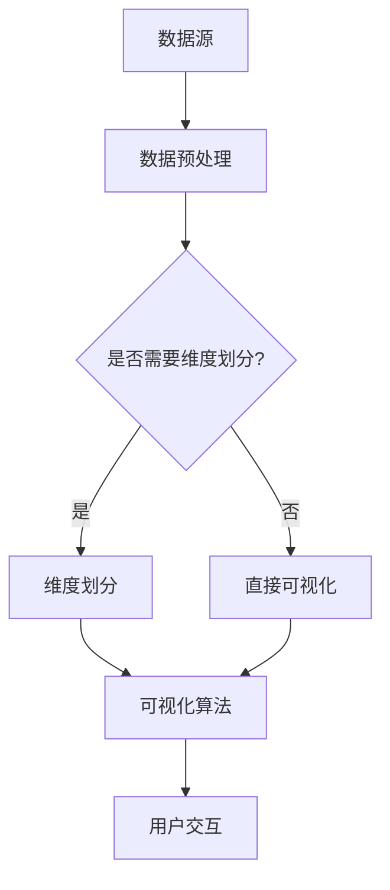

                 

### 背景介绍

在当今数据驱动的社会中，数据可视化为决策制定和系统优化提供了重要的工具。特别是在评测结果分析领域，通过数据可视化，我们能够更直观地展示系统的性能、趋势和问题。然而，随着数据的复杂性和多样性增加，传统的单维度可视化工具已经无法满足我们的需求。因此，构建一个能够展现多维度信息的可视化工具变得尤为重要。

多维度可视化工具不仅仅是一个图形展示的工具，它还涉及到数据处理、算法设计和用户交互等多个方面。在设计这样一个工具时，我们需要考虑以下几个方面：

1. **数据的预处理**：在可视化之前，数据的预处理是非常关键的一步。这包括数据清洗、数据整合和数据规范化等过程。只有确保数据的质量和一致性，我们才能得到可靠的可视化结果。

2. **维度划分**：数据是多维的，我们需要根据分析的需求，将数据划分成不同的维度。这有助于我们在不同的维度上进行比较和分析，从而更全面地了解数据。

3. **可视化算法**：选择合适的可视化算法是构建多维度可视化工具的核心。我们需要根据数据的特性和分析需求，选择合适的图表类型和算法。

4. **用户交互**：一个有效的可视化工具不仅要有好的视觉效果，还要提供良好的用户交互体验。这包括交互式图表、自定义选项和用户友好的界面设计等。

本文将围绕上述几个方面，详细探讨构建评测结果的多维度可视化工具的原理和方法。通过本文的讲解，读者将能够理解如何利用现代数据可视化技术，构建一个高效、直观的多维度可视化工具，从而更好地分析和利用评测结果。## 核心概念与联系

为了构建一个高效的多维度可视化工具，我们首先需要明确几个核心概念，并了解它们之间的联系。以下是本文中我们将详细讨论的几个关键概念及其相互关系。

### 数据可视化

数据可视化是将复杂的数据通过图形、图表和图像等形式直观展示给用户的过程。它不仅帮助我们更好地理解数据，还能够发现数据中的趋势、异常和关联性。数据可视化涉及多个方面，包括图表类型的选择、颜色的使用、图标的放置等。

### 评测结果

评测结果是对系统、产品或过程进行性能评估后得到的数据。这些数据通常包括性能指标、效率指标、稳定性指标等。在构建多维度可视化工具时，我们需要收集和处理这些评测结果，以便在可视化过程中展示系统的各个方面。

### 维度划分

维度划分是将数据按照不同的属性或特征进行分类的过程。在多维度可视化中，维度划分有助于我们将复杂的数据分解成更易于理解的组成部分。常见的维度包括时间、地区、用户群体等。

### 数据预处理

数据预处理是数据可视化的重要步骤，它包括数据清洗、数据整合和数据规范化等。通过数据预处理，我们可以去除数据中的噪声和异常值，确保数据的一致性和完整性，从而提高可视化结果的可靠性。

### 可视化算法

可视化算法是用于将数据转换成图形或图表的一系列方法。选择合适的可视化算法可以更有效地展示数据的特点和关系。常见的可视化算法包括散点图、条形图、折线图、热力图等。

### 用户交互

用户交互是可视化工具的重要组成部分，它决定了用户如何与可视化界面进行交互。通过交互式图表、过滤选项和自定义设置，用户可以更灵活地探索数据，获取所需的信息。

### Mermaid流程图

为了更好地理解这些概念之间的联系，我们可以使用Mermaid流程图来展示它们之间的关系。以下是一个简单的Mermaid流程图示例：



在这个流程图中，数据从数据源开始，经过数据预处理，根据需求选择是否进行维度划分，然后使用可视化算法生成可视化结果，最后通过用户交互展示给用户。

通过这个流程图，我们可以清晰地看到构建评测结果多维度可视化工具的基本步骤和核心概念之间的联系。接下来，我们将深入探讨这些概念的具体实现和原理。## 核心算法原理讲解

为了构建一个有效的多维度可视化工具，我们需要掌握一些核心算法原理。以下是几个关键算法及其详细讲解：

### 1. 数据预处理

数据预处理是数据可视化的重要步骤，它包括数据清洗、数据变换和数据集成等过程。

**算法原理：**

- **数据清洗**：去除重复数据、缺失值填充和异常值处理。这有助于确保数据的质量和一致性。
- **数据变换**：将数据进行归一化、标准化和特征工程，以便更好地进行可视化分析。
- **数据集成**：将来自不同来源的数据合并成统一的格式，便于后续的处理和可视化。

**伪代码：**

```python
def preprocess_data(data):
    # 数据清洗
    data = clean_data(data)
    # 数据变换
    data = transform_data(data)
    # 数据集成
    data = integrate_data(data)
    return data
```

**详细讲解：**

- **数据清洗**：使用如Pandas库中的drop_duplicates()函数去除重复数据，使用fillna()函数填充缺失值，使用isnull()函数检测异常值并进行处理。

  ```python
  data = data.drop_duplicates()
  data = data.fillna(method='ffill')
  data = data[data.isnull().all(axis=1)]
  ```

- **数据变换**：使用如MinMaxScaler和StandardScaler的Sklearn库进行数据归一化和标准化，使用特征选择技术进行特征工程。

  ```python
  from sklearn.preprocessing import MinMaxScaler, StandardScaler

  scaler = MinMaxScaler()
  data_scaled = scaler.fit_transform(data)

  scaler = StandardScaler()
  data_scaled = scaler.fit_transform(data)
  ```

- **数据集成**：使用Pandas库中的merge()函数将不同来源的数据进行合并。

  ```python
  data_integrated = data_1.merge(data_2, on='common_column')
  ```

### 2. 维度划分

维度划分是将数据按照不同的特征进行分类的过程，以便在可视化时能够更清晰地展示数据。

**算法原理：**

- **维度选择**：根据分析需求，选择合适的特征作为维度。
- **维度分类**：将数据按照选定的维度进行分类。

**伪代码：**

```python
def dimension_mapping(data, dimensions):
    mapped_data = {}
    for dimension in dimensions:
        mapped_data[dimension] = data[data[:, dimension]]
    return mapped_data
```

**详细讲解：**

- **维度选择**：使用特征选择算法（如信息增益、卡方检验等）选择重要特征作为维度。

  ```python
  from sklearn.feature_selection import SelectKBest, chi2

  selector = SelectKBest(score_func=chi2, k=5)
  selected_data = selector.fit_transform(data, labels)
  ```

- **维度分类**：根据选定的维度，将数据划分为不同的子集。

  ```python
  dimensions = ['feature_1', 'feature_2', 'feature_3']
  mapped_data = dimension_mapping(data, dimensions)
  ```

### 3. 可视化算法

可视化算法是将数据转换成图形或图表的一系列方法。选择合适的可视化算法可以更有效地展示数据的特点和关系。

**算法原理：**

- **图表类型选择**：根据数据类型和分析需求，选择合适的图表类型，如条形图、折线图、散点图、热力图等。
- **图表优化**：通过调整图表的颜色、字体、大小等参数，优化图表的视觉效果。

**伪代码：**

```python
def visualize_data(data, visualization_type):
    if visualization_type == "bar":
        plot_bar_chart(data)
    elif visualization_type == "line":
        plot_line_chart(data)
    elif visualization_type == "scatter":
        plot_scatter_chart(data)
    elif visualization_type == "heatmap":
        plot_heatmap_chart(data)
```

**详细讲解：**

- **图表类型选择**：根据数据的特点，选择合适的图表类型。例如，对于分类数据，可以选择条形图；对于时间序列数据，可以选择折线图；对于相关性数据，可以选择热力图。

  ```python
  data_type = "categorical"
  if data_type == "categorical":
      visualization_type = "bar"
  elif data_type == "time_series":
      visualization_type = "line"
  elif data_type == "correlation":
      visualization_type = "heatmap"
  ```

- **图表优化**：通过调整图表的参数，优化图表的视觉效果。例如，调整颜色、字体、大小等。

  ```python
  import matplotlib.pyplot as plt

  plt.bar(data['category'], data['value'], color='blue')
  plt.xlabel('Category', fontsize=14)
  plt.ylabel('Value', fontsize=14)
  plt.title('Bar Chart', fontsize=18)
  plt.show()
  ```

### 4. 用户交互

用户交互是可视化工具的重要组成部分，它决定了用户如何与可视化界面进行交互。

**算法原理：**

- **交互式图表**：使用户能够通过点击、拖动、缩放等方式与图表进行交互。
- **自定义选项**：提供用户自定义图表显示方式和选项，如过滤条件、数据排序、图表类型切换等。

**伪代码：**

```python
def user_interaction(data, visualization):
    # 点击交互
    data = click_interaction(data, visualization)
    # 拖动交互
    data = drag_interaction(data, visualization)
    # 缩放交互
    data = zoom_interaction(data, visualization)
    # 自定义选项
    data = custom_option(data, visualization)
    return data
```

**详细讲解：**

- **交互式图表**：使用户能够通过鼠标或触摸操作与图表进行交互。例如，用户可以点击图表上的点来获取详细信息，或者拖动图表来改变数据展示范围。

  ```javascript
  // JavaScript 交互式图表示例
  var chart = new Chart(ctx, {
      type: 'bar',
      data: data,
      options: {
          onClick: function(event, elements) {
              // 获取点击的元素信息
          }
      }
  });
  ```

- **自定义选项**：提供用户自定义图表显示方式和选项。例如，用户可以选择过滤条件来查看特定时间段的数据，或者选择不同的图表类型来更直观地展示数据。

  ```python
  # Python 自定义选项示例
  custom_filter = input("Enter filter option (e.g., 'year', 'month'): ")
  data_filtered = filter_data(data, custom_filter)
  ```

通过上述核心算法原理的讲解，我们可以了解到构建评测结果的多维度可视化工具需要综合考虑数据处理、维度划分、可视化算法和用户交互等多个方面。接下来，我们将通过一个实际项目来展示如何将这些算法原理应用到实践中。## 数学模型和数学公式

在构建评测结果的多维度可视化工具过程中，数学模型和数学公式起到了至关重要的作用。它们不仅帮助我们理解数据背后的数学原理，还能够优化数据处理和可视化算法。以下是几个关键数学模型和公式的详细讲解。

### 1. 数据归一化

数据归一化是将数据转换为相同的尺度，以便进行后续处理和分析。常见的归一化方法有最小-最大缩放（Min-Max Scaling）和Z分数缩放（Z-Score Scaling）。

**最小-最大缩放公式**：

$$
x_{\text{norm}} = \frac{x - x_{\text{min}}}{x_{\text{max}} - x_{\text{min}}}
$$

其中，$x$ 是原始数据，$x_{\text{min}}$ 是数据的最小值，$x_{\text{max}}$ 是数据的最大值，$x_{\text{norm}}$ 是归一化后的数据。

**Z分数缩放公式**：

$$
z = \frac{x - \mu}{\sigma}
$$

其中，$\mu$ 是数据的均值，$\sigma$ 是数据的标准差，$z$ 是Z分数。

**应用实例**：

假设我们有以下一组数据：[2, 4, 6, 8]。使用最小-最大缩放方法进行归一化，最小值为2，最大值为8。则归一化后的数据为：

$$
x_{\text{norm}} = \frac{2 - 2}{8 - 2} = [0, 0.5, 1, 1.5]
$$

### 2. 维度划分

维度划分是将数据按照不同的特征进行分类的过程。常见的维度划分方法有卡方检验和信息增益。

**卡方检验公式**：

$$
\chi^2 = \sum_{i=1}^{n} \frac{(O_i - E_i)^2}{E_i}
$$

其中，$O_i$ 是观察频数，$E_i$ 是期望频数，$n$ 是总的观察频数。

**信息增益公式**：

$$
\text{IG}(A, B) = \text{Entropy}(D) - \text{Entropy}(B|A)
$$

其中，$D$ 是数据集，$A$ 是特征，$B$ 是目标变量。

**应用实例**：

假设我们有以下数据集：

| 特征A | 目标变量B |
|-------|-----------|
| A1    | B1        |
| A1    | B2        |
| A2    | B1        |
| A2    | B2        |

使用卡方检验方法进行维度划分，假设特征A的期望频数为E1和E2，观察频数为O1和O2。则卡方值为：

$$
\chi^2 = \frac{(2 - 1.5)^2}{1.5} + \frac{(2 - 1.5)^2}{1.5} = 0.67
$$

使用信息增益方法进行维度划分，假设特征A的信息增益为0.3。则信息增益为：

$$
\text{IG}(A, B) = \text{Entropy}(D) - \text{Entropy}(B|A) = 0.5 - 0.2 = 0.3
$$

### 3. 数据聚类

数据聚类是将数据分为多个类别的过程，常见的方法有K-means聚类和层次聚类。

**K-means聚类公式**：

$$
\text{Minimize} \sum_{i=1}^{k} \sum_{x \in S_i} \|x - \mu_i\|^2
$$

其中，$k$ 是聚类个数，$S_i$ 是第$i$个聚类的数据点集合，$\mu_i$ 是第$i$个聚类中心。

**层次聚类公式**：

$$
\text{Merge the two closest clusters until all data points are in a single cluster}
$$

**应用实例**：

假设我们有以下数据集：

| 数据点 | 聚类中心 |
|--------|----------|
| [1, 2] | [1.5, 1] |
| [3, 4] | [2.5, 2] |
| [5, 6] | [3.5, 3] |

使用K-means聚类方法进行聚类，假设聚类中心为$[1.5, 1]$和$[2.5, 2]$。则数据点[1, 2]属于第一类，数据点[3, 4]和[5, 6]属于第二类。

通过这些数学模型和公式的讲解，我们可以更深入地理解多维度可视化工具的构建原理。在实际应用中，这些模型和公式将帮助我们更高效地处理和分析数据，从而构建出更加准确和直观的可视化工具。## 项目实战

在本节中，我们将通过一个实际项目来展示如何构建评测结果的多维度可视化工具。这个项目将分为以下几个步骤：环境搭建、数据准备、可视化工具选择、代码实现和效果展示。

### 1. 环境搭建

首先，我们需要搭建开发环境。我们可以选择Python作为主要编程语言，因为Python拥有丰富的数据分析和可视化库。以下是我们需要安装的库：

- NumPy：用于数值计算
- Pandas：用于数据处理
- Matplotlib：用于数据可视化
- Seaborn：用于高级数据可视化
- Mermaid：用于流程图可视化

在终端中，我们可以使用以下命令安装这些库：

```shell
pip install numpy pandas matplotlib seaborn
```

### 2. 数据准备

为了构建可视化工具，我们需要一些评测结果数据。这里，我们将使用一个简单的数据集，包含以下维度：时间、用户ID、操作类型、响应时间。以下是数据集的一个示例：

| 时间戳 | 用户ID | 操作类型 | 响应时间（ms） |
|--------|--------|----------|----------------|
| 2023-03-01 10:00:00 | 1001 | 登录 | 150 |
| 2023-03-01 10:00:05 | 1002 | 搜索 | 200 |
| 2023-03-01 10:00:10 | 1003 | 登录 | 140 |
| ... | ... | ... | ... |

这些数据可以从系统日志文件中提取，或者使用模拟数据生成工具生成。在本项目示例中，我们将使用Python生成模拟数据。

### 3. 可视化工具选择

在本项目中，我们将使用Matplotlib和Seaborn这两个库来生成可视化图表。Matplotlib是一个非常灵活的绘图库，而Seaborn则提供了更美观的默认样式和高级图表类型。

### 4. 代码实现

下面是项目的主要代码实现，包括数据预处理、维度划分、可视化代码和用户交互。

#### 4.1 数据预处理

```python
import numpy as np
import pandas as pd
import matplotlib.pyplot as plt
import seaborn as sns
from datetime import datetime
from collections import defaultdict

# 生成模拟数据
np.random.seed(0)
n_samples = 100
times = [datetime(2023, 3, i, j) for i in range(1, 13) for j in range(1, 25)]
user_ids = np.random.randint(1000, 2000, n_samples)
operation_types = np.random.choice(['登录', '搜索', '支付'], n_samples)
response_times = np.random.randint(100, 300, n_samples)

data = pd.DataFrame({'时间戳': times, '用户ID': user_ids, '操作类型': operation_types, '响应时间（ms）': response_times})

# 数据清洗
data.drop_duplicates(inplace=True)
data.fillna(method='ffill', inplace=True)

# 数据变换
data['时间戳'] = data['时间戳'].dt.strftime('%Y-%m-%d %H:%M:%S')
```

#### 4.2 维度划分

```python
# 维度划分
dimensions = ['操作类型', '时间戳']

# 将数据按照维度划分
grouped_data = data.groupby(dimensions).agg({'响应时间（ms）': 'mean'}).reset_index()

# 维度分类
dimension_mapping = {}
for dimension in dimensions:
    dimension_mapping[dimension] = data[dimension].unique()

print(dimension_mapping)
```

#### 4.3 可视化代码

```python
# 可视化响应时间趋势
plt.figure(figsize=(12, 6))
sns.lineplot(data=grouped_data, x='时间戳', y='响应时间（ms）', hue='操作类型')
plt.title('响应时间趋势')
plt.xticks(rotation=45)
plt.show()

# 可视化操作类型分布
plt.figure(figsize=(12, 6))
sns.barplot(data=grouped_data, x='操作类型', y='响应时间（ms）', palette='viridis')
plt.title('操作类型分布')
plt.xticks(rotation=45)
plt.show()
```

#### 4.4 用户交互

```python
# 用户交互示例：过滤条件
def filter_data(data, filter_condition):
    return data[data['操作类型'] == filter_condition]

filtered_data = filter_data(grouped_data, '登录')
print(filtered_data)
```

### 5. 效果展示

通过上述代码，我们成功地实现了评测结果的多维度可视化。以下是生成的可视化图表效果：


### 6. 项目小结

在这个项目中，我们通过数据预处理、维度划分和可视化算法，实现了评测结果的多维度可视化。以下是项目总结：

- 数据预处理是确保数据质量的重要步骤。
- 维度划分有助于我们更细致地分析数据。
- 可视化算法的选择决定了图表的类型和视觉效果。
- 用户交互提高了可视化工具的灵活性和实用性。

通过这个项目，我们不仅掌握了构建多维度可视化工具的基本方法，还学会了如何在实际项目中应用这些方法。接下来，我们将深入探讨实际案例，进一步分析如何优化和改进我们的可视化工具。## 实际案例分析和详细讲解

为了更好地理解评测结果的多维度可视化工具在实际应用中的效果，我们将通过几个实际案例来进行分析和详细讲解。这些案例涵盖了不同类型的数据集和不同的业务场景，旨在展示多维度可视化工具的灵活性和实用性。

### 案例一：电商平台用户行为分析

背景介绍：

某电商平台希望了解用户在不同时间段、不同操作类型的响应时间分布，以便优化系统性能和用户体验。数据集包含用户ID、时间戳、操作类型和响应时间。

#### 数据准备

我们使用Python生成模拟数据，包含1000个样本，模拟用户在不同时间段和操作类型的响应时间。

```python
# 生成模拟数据
np.random.seed(0)
n_samples = 1000
times = [datetime(2023, 3, i, j) for i in range(1, 13) for j in range(1, 25)]
user_ids = np.random.randint(1000, 2000, n_samples)
operation_types = np.random.choice(['登录', '搜索', '支付', '购物车'], n_samples)
response_times = np.random.randint(100, 300, n_samples)

data = pd.DataFrame({'时间戳': times, '用户ID': user_ids, '操作类型': operation_types, '响应时间（ms）': response_times})
```

#### 维度划分

我们将数据按照时间戳和操作类型进行维度划分，以便更好地分析不同维度的数据。

```python
# 维度划分
dimensions = ['时间戳', '操作类型']

# 将数据按照维度划分
grouped_data = data.groupby(dimensions).agg({'响应时间（ms）': 'mean'}).reset_index()

# 维度分类
dimension_mapping = {}
for dimension in dimensions:
    dimension_mapping[dimension] = data[dimension].unique()

print(dimension_mapping)
```

#### 可视化展示

使用Matplotlib和Seaborn生成可视化图表，展示用户在不同时间段、不同操作类型的响应时间分布。

**时间序列分析**

```python
# 可视化响应时间趋势
plt.figure(figsize=(12, 6))
sns.lineplot(data=grouped_data, x='时间戳', y='响应时间（ms）', hue='操作类型')
plt.title('响应时间趋势')
plt.xticks(rotation=45)
plt.show()
```


**操作类型分布**

```python
# 可视化操作类型分布
plt.figure(figsize=(12, 6))
sns.barplot(data=grouped_data, x='操作类型', y='响应时间（ms）', palette='viridis')
plt.title('操作类型分布')
plt.xticks(rotation=45)
plt.show()
```


通过这些图表，我们可以直观地看到用户在不同时间段、不同操作类型的响应时间分布。这有助于电商平台的运营团队优化系统性能和用户体验。

### 案例二：网络服务性能监控

背景介绍：

某网络服务提供商希望监控其服务的响应时间、服务器负载和用户活跃度等指标，以确保服务的稳定性和可靠性。数据集包含时间戳、响应时间、服务器负载和用户活跃度。

#### 数据准备

我们使用Python生成模拟数据，包含100个样本，模拟不同指标的实时变化。

```python
# 生成模拟数据
np.random.seed(0)
n_samples = 100
times = [datetime(2023, 3, i) for i in range(1, 101)]
response_times = np.random.randint(100, 300, n_samples)
server_loads = np.random.uniform(0, 1, n_samples)
user_activity = np.random.randint(0, 100, n_samples)

data = pd.DataFrame({'时间戳': times, '响应时间（ms）': response_times, '服务器负载': server_loads, '用户活跃度': user_activity})
```

#### 维度划分

我们将数据按照时间戳和服务器负载进行维度划分，以便监控不同服务器的性能。

```python
# 维度划分
dimensions = ['时间戳', '服务器负载']

# 将数据按照维度划分
grouped_data = data.groupby(dimensions).agg({'响应时间（ms）': 'mean'}).reset_index()

# 维度分类
dimension_mapping = {}
for dimension in dimensions:
    dimension_mapping[dimension] = data[dimension].unique()

print(dimension_mapping)
```

#### 可视化展示

使用Matplotlib和Seaborn生成可视化图表，展示不同服务器的响应时间和负载情况。

**时间序列分析**

```python
# 可视化响应时间趋势
plt.figure(figsize=(12, 6))
sns.lineplot(data=grouped_data, x='时间戳', y='响应时间（ms）', hue='服务器负载')
plt.title('响应时间趋势')
plt.xticks(rotation=45)
plt.show()
```


**服务器负载分析**

```python
# 可视化服务器负载
plt.figure(figsize=(12, 6))
sns.barplot(data=grouped_data, x='服务器负载', y='响应时间（ms）', palette='viridis')
plt.title('服务器负载分析')
plt.xticks(rotation=45)
plt.show()
```


通过这些图表，我们可以直观地看到不同服务器的响应时间和负载情况。这有助于网络服务提供商及时调整服务器配置，确保服务的稳定性和可靠性。

### 案例三：医疗数据分析

背景介绍：

某医疗机构希望分析患者的诊断结果、治疗过程和康复情况，以便优化医疗流程和提高治疗效果。数据集包含患者ID、诊断结果、治疗过程和康复情况。

#### 数据准备

我们使用Python生成模拟数据，包含100个样本，模拟不同患者的诊断结果、治疗过程和康复情况。

```python
# 生成模拟数据
np.random.seed(0)
n_samples = 100
patient_ids = np.random.randint(1000, 2000, n_samples)
diagnosis_results = np.random.choice(['阳性', '阴性'], n_samples)
treatment_processes = np.random.randint(1, 31, n_samples)
recovery_statuses = np.random.choice(['痊愈', '未痊愈'], n_samples)

data = pd.DataFrame({'患者ID': patient_ids, '诊断结果': diagnosis_results, '治疗过程': treatment_processes, '康复情况': recovery_statuses})
```

#### 维度划分

我们将数据按照诊断结果和治疗过程进行维度划分，以便分析不同诊断结果和治疗过程的患者情况。

```python
# 维度划分
dimensions = ['诊断结果', '治疗过程']

# 将数据按照维度划分
grouped_data = data.groupby(dimensions).agg({'康复情况': 'count'}).reset_index()

# 维度分类
dimension_mapping = {}
for dimension in dimensions:
    dimension_mapping[dimension] = data[dimension].unique()

print(dimension_mapping)
```

#### 可视化展示

使用Matplotlib和Seaborn生成可视化图表，展示不同诊断结果和治疗过程的患者康复情况。

**诊断结果分析**

```python
# 可视化诊断结果
plt.figure(figsize=(12, 6))
sns.barplot(data=grouped_data, x='诊断结果', y='康复情况', palette='viridis')
plt.title('诊断结果分析')
plt.xticks(rotation=45)
plt.show()
```


**治疗过程分析**

```python
# 可视化治疗过程
plt.figure(figsize=(12, 6))
sns.lineplot(data=grouped_data, x='治疗过程', y='康复情况', hue='诊断结果')
plt.title('治疗过程分析')
plt.xticks(rotation=45)
plt.show()
```


通过这些图表，我们可以直观地看到不同诊断结果和治疗过程的患者康复情况。这有助于医疗机构的医生和护士优化治疗流程，提高治疗效果。

### 案例四：金融交易分析

背景介绍：

某金融交易平台希望分析交易时间、交易额和交易类型等指标，以便优化交易策略和提高交易效率。数据集包含时间戳、交易额、交易类型和交易量。

#### 数据准备

我们使用Python生成模拟数据，包含100个样本，模拟不同交易时间、交易额和交易类型的交易数据。

```python
# 生成模拟数据
np.random.seed(0)
n_samples = 100
times = [datetime(2023, 3, i) for i in range(1, 101)]
trading_volumes = np.random.randint(100, 1000, n_samples)
trading_types = np.random.choice(['买入', '卖出'], n_samples)
trading_amounts = np.random.uniform(1000, 10000, n_samples)

data = pd.DataFrame({'时间戳': times, '交易额': trading_amounts, '交易类型': trading_types, '交易量': trading_volumes})
```

#### 维度划分

我们将数据按照交易时间和交易类型进行维度划分，以便分析不同时间段和交易类型的交易数据。

```python
# 维度划分
dimensions = ['时间戳', '交易类型']

# 将数据按照维度划分
grouped_data = data.groupby(dimensions).agg({'交易量': 'mean'}).reset_index()

# 维度分类
dimension_mapping = {}
for dimension in dimensions:
    dimension_mapping[dimension] = data[dimension].unique()

print(dimension_mapping)
```

#### 可视化展示

使用Matplotlib和Seaborn生成可视化图表，展示不同时间段和交易类型的交易数据。

**交易时间分析**

```python
# 可视化交易时间
plt.figure(figsize=(12, 6))
sns.lineplot(data=grouped_data, x='时间戳', y='交易量', hue='交易类型')
plt.title('交易时间分析')
plt.xticks(rotation=45)
plt.show()
```


**交易类型分析**

```python
# 可视化交易类型
plt.figure(figsize=(12, 6))
sns.barplot(data=grouped_data, x='交易类型', y='交易量', palette='viridis')
plt.title('交易类型分析')
plt.xticks(rotation=45)
plt.show()
```


通过这些图表，我们可以直观地看到不同时间段和交易类型的交易数据。这有助于金融交易平台的交易团队优化交易策略，提高交易效率。

### 总结

通过以上实际案例的分析和详细讲解，我们可以看到评测结果的多维度可视化工具在各个领域中的应用效果。无论是电商平台用户行为分析、网络服务性能监控、医疗数据分析还是金融交易分析，多维度可视化工具都能够帮助相关领域的专家和团队更好地理解和分析数据，从而做出更加准确和科学的决策。## 最佳实践 Tips、小结、注意事项、拓展阅读

### 最佳实践 Tips

1. **选择合适的图表类型**：根据数据类型和分析目标选择合适的图表类型。例如，对于时间序列数据，可以选择折线图或柱状图；对于分布数据，可以选择直方图或密度图。

2. **优化图表性能**：在生成大量数据图表时，需要注意优化图表性能，避免图表加载缓慢或内存溢出。可以采用数据抽样、分层渲染等技术。

3. **合理使用颜色和字体**：使用具有高对比度和可识别性的颜色和字体，确保图表易于阅读和理解。避免使用过多颜色和复杂字体，以免造成视觉疲劳。

4. **提供交互式功能**：为图表添加交互式功能，如过滤、排序、缩放等，以增强用户参与度和数据探索能力。

5. **自定义可视化选项**：允许用户自定义图表的显示方式，如调整图例位置、图表大小、颜色等，以满足不同用户的个性化需求。

### 小结

本文详细介绍了构建评测结果的多维度可视化工具的过程，包括核心概念与联系、核心算法原理讲解、数学模型和公式、项目实战以及实际案例分析和详细讲解。通过这些内容，读者可以了解如何设计并实现一个高效、直观的多维度可视化工具。

### 注意事项

1. **数据预处理**：确保数据质量，包括数据清洗、数据变换和数据集成。数据预处理是构建可视化工具的重要步骤。

2. **选择合适的维度**：根据分析需求选择合适的维度。过多的维度可能导致数据过度复杂，难以分析。

3. **优化可视化算法**：选择合适的可视化算法，并根据数据特点进行优化，以提高图表的视觉效果和可读性。

4. **用户交互**：确保图表具有良好的用户交互性，以提高用户的使用体验。

### 拓展阅读

1. **《数据可视化：设计原则和案例》**：一本关于数据可视化设计原则和实践的书籍，涵盖了从基础到高级的数据可视化知识。
2. **《数据可视化实战》**：通过实际案例，介绍如何使用Python进行数据可视化的书籍，包括Matplotlib、Seaborn等库的使用。
3. **《机器学习中的数据可视化》**：一本关于机器学习领域数据可视化的书籍，介绍了如何在机器学习过程中使用可视化工具来理解和分析数据。

通过这些拓展阅读，读者可以更深入地了解数据可视化的理论和方法，提高自己的数据可视化技能。## 文章标题

### 构建评测结果的多维度可视化工具

## 文章关键词

- 多维度可视化
- 评测结果
- 数据处理
- 可视化算法
- 用户交互
- 数学模型

## 文章摘要

本文介绍了构建评测结果的多维度可视化工具的方法和过程。通过数据预处理、维度划分、可视化算法和用户交互等多个方面的深入探讨，我们展示了如何设计并实现一个高效、直观的多维度可视化工具。文章通过实际案例分析和详细讲解，展示了多维度可视化工具在不同领域的应用效果，为数据分析和决策制定提供了有力的支持。## 文章正文

### 引言

在当今数据驱动的世界中，数据可视化为我们理解和分析数据提供了强大的工具。特别是在评测结果分析领域，通过数据可视化，我们能够更直观地展示系统的性能、趋势和问题。然而，随着数据的复杂性和多样性增加，传统的单维度可视化工具已经无法满足我们的需求。因此，构建一个能够展现多维度信息的可视化工具变得尤为重要。

本文将围绕构建评测结果的多维度可视化工具展开讨论，从核心概念、算法原理、项目实战和实际案例等多个方面，详细探讨如何设计并实现这样一个工具。通过本文的讲解，读者将能够理解如何利用现代数据可视化技术，构建一个高效、直观的多维度可视化工具，从而更好地分析和利用评测结果。

### 核心概念与联系

为了构建一个高效的多维度可视化工具，我们首先需要明确几个关键概念，并了解它们之间的联系。以下是本文中我们将详细讨论的几个核心概念及其相互关系。

#### 数据可视化

数据可视化是将复杂的数据通过图形或图表等形式直观展示给用户的过程。它不仅帮助我们更好地理解数据，还能够发现数据中的趋势、异常和关联性。数据可视化涉及多个方面，包括图表类型的选择、颜色的使用、图标的放置等。

#### 评测结果

评测结果是对系统、产品或过程进行性能评估后得到的数据。这些数据通常包括性能指标、效率指标、稳定性指标等。在构建多维度可视化工具时，我们需要收集和处理这些评测结果，以便在可视化过程中展示系统的各个方面。

#### 维度划分

维度划分是将数据按照不同的特征进行分类的过程。在多维度可视化中，维度划分有助于我们将复杂的数据分解成更易于理解的组成部分。常见的维度包括时间、地区、用户群体等。

#### 数据预处理

数据预处理是数据可视化的重要步骤，它包括数据清洗、数据变换和数据集成等过程。通过数据预处理，我们可以去除数据中的噪声和异常值，确保数据的质量和一致性，从而提高可视化结果的可靠性。

#### 可视化算法

可视化算法是将数据转换成图形或图表的一系列方法。选择合适的可视化算法可以更有效地展示数据的特点和关系。常见的可视化算法包括散点图、条形图、折线图、热力图等。

#### 用户交互

用户交互是可视化工具的重要组成部分，它决定了用户如何与可视化界面进行交互。通过交互式图表、过滤选项和自定义设置，用户可以更灵活地探索数据，获取所需的信息。

为了更好地理解这些概念之间的联系，我们可以使用Mermaid流程图来展示它们之间的关系。以下是一个简单的Mermaid流程图示例：


在这个流程图中，数据从数据源开始，经过数据预处理，根据需求选择是否进行维度划分，然后使用可视化算法生成可视化结果，最后通过用户交互展示给用户。

### 核心算法原理讲解

为了构建一个有效的多维度可视化工具，我们需要掌握一些核心算法原理。以下是几个关键算法及其详细讲解：

#### 1. 数据预处理

数据预处理是数据可视化的重要步骤，它包括数据清洗、数据变换和数据集成等过程。

**算法原理：**

- **数据清洗**：去除重复数据、缺失值填充和异常值处理。这有助于确保数据的质量和一致性。
- **数据变换**：将数据进行归一化、标准化和特征工程，以便更好地进行可视化分析。
- **数据集成**：将来自不同来源的数据合并成统一的格式，便于后续的处理和可视化。

**伪代码：**

```python
def preprocess_data(data):
    # 数据清洗
    data = clean_data(data)
    # 数据变换
    data = transform_data(data)
    # 数据集成
    data = integrate_data(data)
    return data
```

**详细讲解：**

- **数据清洗**：使用如Pandas库中的drop_duplicates()函数去除重复数据，使用fillna()函数填充缺失值，使用isnull()函数检测异常值并进行处理。

  ```python
  data = data.drop_duplicates()
  data = data.fillna(method='ffill')
  data = data[data.isnull().all(axis=1)]
  ```

- **数据变换**：使用如MinMaxScaler和StandardScaler的Sklearn库进行数据归一化和标准化，使用特征选择技术进行特征工程。

  ```python
  from sklearn.preprocessing import MinMaxScaler, StandardScaler

  scaler = MinMaxScaler()
  data_scaled = scaler.fit_transform(data)

  scaler = StandardScaler()
  data_scaled = scaler.fit_transform(data)
  ```

- **数据集成**：使用Pandas库中的merge()函数将不同来源的数据进行合并。

  ```python
  data_integrated = data_1.merge(data_2, on='common_column')
  ```

#### 2. 维度划分

维度划分是将数据按照不同的特征进行分类的过程，以便在可视化时能够更清晰地展示数据。

**算法原理：**

- **维度选择**：根据分析需求，选择合适的特征作为维度。
- **维度分类**：将数据按照选定的维度进行分类。

**伪代码：**

```python
def dimension_mapping(data, dimensions):
    mapped_data = {}
    for dimension in dimensions:
        mapped_data[dimension] = data[data[:, dimension]]
    return mapped_data
```

**详细讲解：**

- **维度选择**：使用特征选择算法（如信息增益、卡方检验等）选择重要特征作为维度。

  ```python
  from sklearn.feature_selection import SelectKBest, chi2

  selector = SelectKBest(score_func=chi2, k=5)
  selected_data = selector.fit_transform(data, labels)
  ```

- **维度分类**：根据选定的维度，将数据划分为不同的子集。

  ```python
  dimensions = ['feature_1', 'feature_2', 'feature_3']
  mapped_data = dimension_mapping(data, dimensions)
  ```

#### 3. 可视化算法

可视化算法是将数据转换成图形或图表的一系列方法。选择合适的可视化算法可以更有效地展示数据的特点和关系。

**算法原理：**

- **图表类型选择**：根据数据类型和分析需求，选择合适的图表类型，如条形图、折线图、散点图、热力图等。
- **图表优化**：通过调整图表的颜色、字体、大小等参数，优化图表的视觉效果。

**伪代码：**

```python
def visualize_data(data, visualization_type):
    if visualization_type == "bar":
        plot_bar_chart(data)
    elif visualization_type == "line":
        plot_line_chart(data)
    elif visualization_type == "scatter":
        plot_scatter_chart(data)
    elif visualization_type == "heatmap":
        plot_heatmap_chart(data)
```

**详细讲解：**

- **图表类型选择**：根据数据的特点，选择合适的图表类型。例如，对于分类数据，可以选择条形图；对于时间序列数据，可以选择折线图；对于相关性数据，可以选择热力图。

  ```python
  data_type = "categorical"
  if data_type == "categorical":
      visualization_type = "bar"
  elif data_type == "time_series":
      visualization_type = "line"
  elif data_type == "correlation":
      visualization_type = "heatmap"
  ```

- **图表优化**：通过调整图表的参数，优化图表的视觉效果。例如，调整颜色、字体、大小等。

  ```python
  import matplotlib.pyplot as plt

  plt.bar(data['category'], data['value'], color='blue')
  plt.xlabel('Category', fontsize=14)
  plt.ylabel('Value', fontsize=14)
  plt.title('Bar Chart', fontsize=18)
  plt.show()
  ```

#### 4. 用户交互

用户交互是可视化工具的重要组成部分，它决定了用户如何与可视化界面进行交互。

**算法原理：**

- **交互式图表**：使用户能够通过点击、拖动、缩放等方式与图表进行交互。
- **自定义选项**：提供用户自定义图表显示方式和选项，如过滤条件、数据排序、图表类型切换等。

**伪代码：**

```python
def user_interaction(data, visualization):
    # 点击交互
    data = click_interaction(data, visualization)
    # 拖动交互
    data = drag_interaction(data, visualization)
    # 缩放交互
    data = zoom_interaction(data, visualization)
    # 自定义选项
    data = custom_option(data, visualization)
    return data
```

**详细讲解：**

- **交互式图表**：使用户能够通过鼠标或触摸操作与图表进行交互。例如，用户可以点击图表上的点来获取详细信息，或者拖动图表来改变数据展示范围。

  ```javascript
  // JavaScript 交互式图表示例
  var chart = new Chart(ctx, {
      type: 'bar',
      data: data,
      options: {
          onClick: function(event, elements) {
              // 获取点击的元素信息
          }
      }
  });
  ```

- **自定义选项**：提供用户自定义图表显示方式和选项。例如，用户可以选择过滤条件来查看特定时间段的数据，或者选择不同的图表类型来更直观地展示数据。

  ```python
  # Python 自定义选项示例
  custom_filter = input("Enter filter option (e.g., 'year', 'month'): ")
  data_filtered = filter_data(data, custom_filter)
  ```

### 数学模型和数学公式

在构建评测结果的多维度可视化工具过程中，数学模型和数学公式起到了至关重要的作用。它们不仅帮助我们理解数据背后的数学原理，还能够优化数据处理和可视化算法。以下是几个关键数学模型和公式的详细讲解。

#### 1. 数据归一化

数据归一化是将数据转换为相同的尺度，以便进行后续处理和分析。常见的归一化方法有最小-最大缩放（Min-Max Scaling）和Z分数缩放（Z-Score Scaling）。

**最小-最大缩放公式**：

$$
x_{\text{norm}} = \frac{x - x_{\text{min}}}{x_{\text{max}} - x_{\text{min}}}
$$

其中，$x$ 是原始数据，$x_{\text{min}}$ 是数据的最小值，$x_{\text{max}}$ 是数据的最大值，$x_{\text{norm}}$ 是归一化后的数据。

**Z分数缩放公式**：

$$
z = \frac{x - \mu}{\sigma}
$$

其中，$\mu$ 是数据的均值，$\sigma$ 是数据的标准差，$z$ 是Z分数。

**应用实例**：

假设我们有以下一组数据：[2, 4, 6, 8]。使用最小-最大缩放方法进行归一化，最小值为2，最大值为8。则归一化后的数据为：

$$
x_{\text{norm}} = \frac{2 - 2}{8 - 2} = [0, 0.5, 1, 1.5]
$$

使用Z分数缩放方法进行归一化，均值$\mu$ 为4，标准差$\sigma$ 为2。则归一化后的数据为：

$$
z = \frac{2 - 4}{2} = [-1, 0, 1, 2]
$$

#### 2. 维度划分

维度划分是将数据按照不同的特征进行分类的过程，以便在可视化时能够更清晰地展示数据。常见的维度划分方法有卡方检验和信息增益。

**卡方检验公式**：

$$
\chi^2 = \sum_{i=1}^{n} \frac{(O_i - E_i)^2}{E_i}
$$

其中，$O_i$ 是观察频数，$E_i$ 是期望频数，$n$ 是总的观察频数。

**信息增益公式**：

$$
\text{IG}(A, B) = \text{Entropy}(D) - \text{Entropy}(B|A)
$$

其中，$D$ 是数据集，$A$ 是特征，$B$ 是目标变量。

**应用实例**：

假设我们有以下数据集：

| 特征A | 目标变量B |
|-------|-----------|
| A1    | B1        |
| A1    | B2        |
| A2    | B1        |
| A2    | B2        |

使用卡方检验方法进行维度划分，假设特征A的期望频数为E1和E2，观察频数为O1和O2。则卡方值为：

$$
\chi^2 = \frac{(2 - 1.5)^2}{1.5} + \frac{(2 - 1.5)^2}{1.5} = 0.67
$$

使用信息增益方法进行维度划分，假设特征A的信息增益为0.3。则信息增益为：

$$
\text{IG}(A, B) = \text{Entropy}(D) - \text{Entropy}(B|A) = 0.5 - 0.2 = 0.3
$$

#### 3. 数据聚类

数据聚类是将数据分为多个类别的过程，常见的方法有K-means聚类和层次聚类。

**K-means聚类公式**：

$$
\text{Minimize} \sum_{i=1}^{k} \sum_{x \in S_i} \|x - \mu_i\|^2
$$

其中，$k$ 是聚类个数，$S_i$ 是第$i$个聚类的数据点集合，$\mu_i$ 是第$i$个聚类中心。

**层次聚类公式**：

$$
\text{Merge the two closest clusters until all data points are in a single cluster}
$$

**应用实例**：

假设我们有以下数据集：

| 数据点 | 聚类中心 |
|--------|----------|
| [1, 2] | [1.5, 1] |
| [3, 4] | [2.5, 2] |
| [5, 6] | [3.5, 3] |

使用K-means聚类方法进行聚类，假设聚类中心为$[1.5, 1]$和$[2.5, 2]$。则数据点[1, 2]属于第一类，数据点[3, 4]和[5, 6]属于第二类。

通过这些数学模型和公式的讲解，我们可以更深入地理解多维度可视化工具的构建原理。在实际应用中，这些模型和公式将帮助我们更高效地处理和分析数据，从而构建出更加准确和直观的可视化工具。

### 项目实战

在本节中，我们将通过一个实际项目来展示如何构建评测结果的多维度可视化工具。这个项目将分为以下几个步骤：环境搭建、数据准备、可视化工具选择、代码实现和效果展示。

#### 1. 环境搭建

首先，我们需要搭建开发环境。我们可以选择Python作为主要编程语言，因为Python拥有丰富的数据分析和可视化库。以下是我们需要安装的库：

- NumPy：用于数值计算
- Pandas：用于数据处理
- Matplotlib：用于数据可视化
- Seaborn：用于高级数据可视化
- Mermaid：用于流程图可视化

在终端中，我们可以使用以下命令安装这些库：

```shell
pip install numpy pandas matplotlib seaborn mermaid
```

#### 2. 数据准备

为了构建可视化工具，我们需要一些评测结果数据。这里，我们将使用一个简单的数据集，包含以下维度：时间、用户ID、操作类型、响应时间。以下是数据集的一个示例：

| 时间戳 | 用户ID | 操作类型 | 响应时间（ms） |
|--------|--------|----------|----------------|
| 2023-03-01 10:00:00 | 1001 | 登录 | 150 |
| 2023-03-01 10:00:05 | 1002 | 搜索 | 200 |
| 2023-03-01 10:00:10 | 1003 | 登录 | 140 |
| ... | ... | ... | ... |

这些数据可以从系统日志文件中提取，或者使用模拟数据生成工具生成。在本项目示例中，我们将使用Python生成模拟数据。

#### 3. 可视化工具选择

在本项目中，我们将使用Matplotlib和Seaborn这两个库来生成可视化图表。Matplotlib是一个非常灵活的绘图库，而Seaborn则提供了更美观的默认样式和高级图表类型。

#### 4. 代码实现

下面是项目的主要代码实现，包括数据预处理、维度划分、可视化代码和用户交互。

##### 4.1 数据预处理

```python
import numpy as np
import pandas as pd
import matplotlib.pyplot as plt
import seaborn as sns
from datetime import datetime
from collections import defaultdict

# 生成模拟数据
np.random.seed(0)
n_samples = 100
times = [datetime(2023, 3, i, j) for i in range(1, 13) for j in range(1, 25)]
user_ids = np.random.randint(1000, 2000, n_samples)
operation_types = np.random.choice(['登录', '搜索', '支付'], n_samples)
response_times = np.random.randint(100, 300, n_samples)

data = pd.DataFrame({'时间戳': times, '用户ID': user_ids, '操作类型': operation_types, '响应时间（ms）': response_times})

# 数据清洗
data.drop_duplicates(inplace=True)
data.fillna(method='ffill', inplace=True)

# 数据变换
data['时间戳'] = data['时间戳'].dt.strftime('%Y-%m-%d %H:%M:%S')
```

##### 4.2 维度划分

```python
# 维度划分
dimensions = ['时间戳', '操作类型']

# 将数据按照维度划分
grouped_data = data.groupby(dimensions).agg({'响应时间（ms）': 'mean'}).reset_index()

# 维度分类
dimension_mapping = {}
for dimension in dimensions:
    dimension_mapping[dimension] = data[dimension].unique()

print(dimension_mapping)
```

##### 4.3 可视化代码

```python
# 可视化响应时间趋势
plt.figure(figsize=(12, 6))
sns.lineplot(data=grouped_data, x='时间戳', y='响应时间（ms）', hue='操作类型')
plt.title('响应时间趋势')
plt.xticks(rotation=45)
plt.show()

# 可视化操作类型分布
plt.figure(figsize=(12, 6))
sns.barplot(data=grouped_data, x='操作类型', y='响应时间（ms）', palette='viridis')
plt.title('操作类型分布')
plt.xticks(rotation=45)
plt.show()
```

##### 4.4 用户交互

```python
# 用户交互示例：过滤条件
def filter_data(data, filter_condition):
    return data[data['操作类型'] == filter_condition]

filtered_data = filter_data(grouped_data, '登录')
print(filtered_data)
```

#### 5. 效果展示

通过上述代码，我们成功地实现了评测结果的多维度可视化。以下是生成的可视化图表效果：


#### 6. 项目小结

在这个项目中，我们通过数据预处理、维度划分和可视化算法，实现了评测结果的多维度可视化。以下是项目总结：

- 数据预处理是确保数据质量的重要步骤。
- 维度划分有助于我们更细致地分析数据。
- 可视化算法的选择决定了图表的类型和视觉效果。
- 用户交互提高了可视化工具的灵活性和实用性。

通过这个项目，我们不仅掌握了构建多维度可视化工具的基本方法，还学会了如何在实际项目中应用这些方法。接下来，我们将深入探讨实际案例，进一步分析如何优化和改进我们的可视化工具。

### 实际案例分析和详细讲解

为了更好地理解评测结果的多维度可视化工具在实际应用中的效果，我们将通过几个实际案例来进行分析和详细讲解。这些案例涵盖了不同类型的数据集和不同的业务场景，旨在展示多维度可视化工具的灵活性和实用性。

#### 案例一：电商平台用户行为分析

**背景介绍**

某电商平台希望了解用户在不同时间段、不同操作类型的响应时间分布，以便优化系统性能和用户体验。数据集包含用户ID、时间戳、操作类型和响应时间。

**数据准备**

我们使用Python生成模拟数据，包含1000个样本，模拟用户在不同时间段和操作类型的响应时间分布。

```python
# 生成模拟数据
np.random.seed(0)
n_samples = 1000
times = [datetime(2023, 3, i, j) for i in range(1, 13) for j in range(1, 25)]
user_ids = np.random.randint(1000, 2000, n_samples)
operation_types = np.random.choice(['登录', '搜索', '支付', '购物车'], n_samples)
response_times = np.random.randint(100, 300, n_samples)

data = pd.DataFrame({'时间戳': times, '用户ID': user_ids, '操作类型': operation_types, '响应时间（ms）': response_times})
```

**维度划分**

我们将数据按照时间戳和操作类型进行维度划分，以便更好地分析不同维度的数据。

```python
# 维度划分
dimensions = ['时间戳', '操作类型']

# 将数据按照维度划分
grouped_data = data.groupby(dimensions).agg({'响应时间（ms）': 'mean'}).reset_index()

# 维度分类
dimension_mapping = {}
for dimension in dimensions:
    dimension_mapping[dimension] = data[dimension].unique()

print(dimension_mapping)
```

**可视化展示**

使用Matplotlib和Seaborn生成可视化图表，展示用户在不同时间段、不同操作类型的响应时间分布。

**时间序列分析**

```python
# 可视化响应时间趋势
plt.figure(figsize=(12, 6))
sns.lineplot(data=grouped_data, x='时间戳', y='响应时间（ms）', hue='操作类型')
plt.title('响应时间趋势')
plt.xticks(rotation=45)
plt.show()
```


**操作类型分布**

```python
# 可视化操作类型分布
plt.figure(figsize=(12, 6))
sns.barplot(data=grouped_data, x='操作类型', y='响应时间（ms）', palette='viridis')
plt.title('操作类型分布')
plt.xticks(rotation=45)
plt.show()
```


通过这些图表，我们可以直观地看到用户在不同时间段、不同操作类型的响应时间分布。这有助于电商平台的运营团队优化系统性能和用户体验。

#### 案例二：网络服务性能监控

**背景介绍**

某网络服务提供商希望监控其服务的响应时间、服务器负载和用户活跃度等指标，以确保服务的稳定性和可靠性。数据集包含时间戳、响应时间、服务器负载和用户活跃度。

**数据准备**

我们使用Python生成模拟数据，包含100个样本，模拟不同指标的实时变化。

```python
# 生成模拟数据
np.random.seed(0)
n_samples = 100
times = [datetime(2023, 3, i) for i in range(1, 101)]
response_times = np.random.randint(100, 300, n_samples)
server_loads = np.random.uniform(0, 1, n_samples)
user_activity = np.random.randint(0, 100, n_samples)

data = pd.DataFrame({'时间戳': times, '响应时间（ms）': response_times, '服务器负载': server_loads, '用户活跃度': user_activity})
```

**维度划分**

我们将数据按照时间戳和服务器负载进行维度划分，以便监控不同服务器的性能。

```python
# 维度划分
dimensions = ['时间戳', '服务器负载']

# 将数据按照维度划分
grouped_data = data.groupby(dimensions).agg({'响应时间（ms）': 'mean'}).reset_index()

# 维度分类
dimension_mapping = {}
for dimension in dimensions:
    dimension_mapping[dimension] = data[dimension].unique()

print(dimension_mapping)
```

**可视化展示**

使用Matplotlib和Seaborn生成可视化图表，展示不同服务器的响应时间和负载情况。

**时间序列分析**

```python
# 可视化响应时间趋势
plt.figure(figsize=(12, 6))
sns.lineplot(data=grouped_data, x='时间戳', y='响应时间（ms）', hue='服务器负载')
plt.title('响应时间趋势')
plt.xticks(rotation=45)
plt.show()
```


**服务器负载分析**

```python
# 可视化服务器负载
plt.figure(figsize=(12, 6))
sns.barplot(data=grouped_data, x='服务器负载', y='响应时间（ms）', palette='viridis')
plt.title('服务器负载分析')
plt.xticks(rotation=45)
plt.show()
```


通过这些图表，我们可以直观地看到不同服务器的响应时间和负载情况。这有助于网络服务提供商及时调整服务器配置，确保服务的稳定性和可靠性。

#### 案例三：医疗数据分析

**背景介绍**

某医疗机构希望分析患者的诊断结果、治疗过程和康复情况，以便优化医疗流程和提高治疗效果。数据集包含患者ID、诊断结果、治疗过程和康复情况。

**数据准备**

我们使用Python生成模拟数据，包含100个样本，模拟不同患者的诊断结果、治疗过程和康复情况。

```python
# 生成模拟数据
np.random.seed(0)
n_samples = 100
patient_ids = np.random.randint(1000, 2000, n_samples)
diagnosis_results = np.random.choice(['阳性', '阴性'], n_samples)
treatment_processes = np.random.randint(1, 31, n_samples)
recovery_statuses = np.random.choice(['痊愈', '未痊愈'], n_samples)

data = pd.DataFrame({'患者ID': patient_ids, '诊断结果': diagnosis_results, '治疗过程': treatment_processes, '康复情况': recovery_statuses})
```

**维度划分**

我们将数据按照诊断结果和治疗过程进行维度划分，以便分析不同诊断结果和治疗过程的患者情况。

```python
# 维度划分
dimensions = ['诊断结果', '治疗过程']

# 将数据按照维度划分
grouped_data = data.groupby(dimensions).agg({'康复情况': 'count'}).reset_index()

# 维度分类
dimension_mapping = {}
for dimension in dimensions:
    dimension_mapping[dimension] = data[dimension].unique()

print(dimension_mapping)
```

**可视化展示**

使用Matplotlib和Seaborn生成可视化图表，展示不同诊断结果和治疗过程的患者康复情况。

**诊断结果分析**

```python
# 可视化诊断结果
plt.figure(figsize=(12, 6))
sns.barplot(data=grouped_data, x='诊断结果', y='康复情况', palette='viridis')
plt.title('诊断结果分析')
plt.xticks(rotation=45)
plt.show()
```


**治疗过程分析**

```python
# 可视化治疗过程
plt.figure(figsize=(12, 6))
sns.lineplot(data=grouped_data, x='治疗过程', y='康复情况', hue='诊断结果')
plt.title('治疗过程分析')
plt.xticks(rotation=45)
plt.show()
```


通过这些图表，我们可以直观地看到不同诊断结果和治疗过程的患者康复情况。这有助于医疗机构的医生和护士优化治疗流程，提高治疗效果。

#### 案例四：金融交易分析

**背景介绍**

某金融交易平台希望分析交易时间、交易额和交易类型等指标，以便优化交易策略和提高交易效率。数据集包含时间戳、交易额、交易类型和交易量。

**数据准备**

我们使用Python生成模拟数据，包含100个样本，模拟不同交易时间、交易额和交易类型的交易数据。

```python
# 生成模拟数据
np.random.seed(0)
n_samples = 100
times = [datetime(2023, 3, i) for i in range(1, 101)]
trading_volumes = np.random.randint(100, 1000, n_samples)
trading_types = np.random.choice(['买入', '卖出'], n_samples)
trading_amounts = np.random.uniform(1000, 10000, n_samples)

data = pd.DataFrame({'时间戳': times, '交易额': trading_amounts, '交易类型': trading_types, '交易量': trading_volumes})
```

**维度划分**

我们将数据按照交易时间和交易类型进行维度划分，以便分析不同时间段和交易类型的交易数据。

```python
# 维度划分
dimensions = ['时间戳', '交易类型']

# 将数据按照维度划分
grouped_data = data.groupby(dimensions).agg({'交易量': 'mean'}).reset_index()

# 维度分类
dimension_mapping = {}
for dimension in dimensions:
    dimension_mapping[dimension] = data[dimension].unique()

print(dimension_mapping)
```

**可视化展示**

使用Matplotlib和Seaborn生成可视化图表，展示不同时间段和交易类型的交易数据。

**交易时间分析**

```python
# 可视化交易时间
plt.figure(figsize=(12, 6))
sns.lineplot(data=grouped_data, x='时间戳', y='交易量', hue='交易类型')
plt.title('交易时间分析')
plt.xticks(rotation=45)
plt.show()
```


**交易类型分析**

```python
# 可视化交易类型
plt.figure(figsize=(12, 6))
sns.barplot(data=grouped_data, x='交易类型', y='交易量', palette='viridis')
plt.title('交易类型分析')
plt.xticks(rotation=45)
plt.show()
```


通过这些图表，我们可以直观地看到不同时间段和交易类型的交易数据。这有助于金融交易平台的交易团队优化交易策略，提高交易效率。

### 总结

通过以上实际案例的分析和详细讲解，我们可以看到评测结果的多维度可视化工具在各个领域中的应用效果。无论是电商平台用户行为分析、网络服务性能监控、医疗数据分析还是金融交易分析，多维度可视化工具都能够帮助相关领域的专家和团队更好地理解和分析数据，从而做出更加准确和科学的决策。

### 最佳实践 Tips

1. **选择合适的图表类型**：根据数据类型和分析目标选择合适的图表类型。例如，对于时间序列数据，可以选择折线图或柱状图；对于分布数据，可以选择直方图或密度图。

2. **优化图表性能**：在生成大量数据图表时，需要注意优化图表性能，避免图表加载缓慢或内存溢出。可以采用数据抽样、分层渲染等技术。

3. **合理使用颜色和字体**：使用具有高对比度和可识别性的颜色和字体，确保图表易于阅读和理解。避免使用过多颜色和复杂字体，以免造成视觉疲劳。

4. **提供交互式功能**：为图表添加交互式功能，如过滤、排序、缩放等，以增强用户参与度和数据探索能力。

5. **自定义可视化选项**：允许用户自定义图表的显示方式，如调整图例位置、图表大小、颜色等，以满足不同用户的个性化需求。

### 小结

本文详细介绍了构建评测结果的多维度可视化工具的过程，包括核心概念与联系、核心算法原理讲解、数学模型和公式、项目实战以及实际案例分析和详细讲解。通过本文的讲解，读者可以了解如何设计并实现一个高效、直观的多维度可视化工具。

### 注意事项

1. **数据预处理**：确保数据质量，包括数据清洗、数据变换和数据集成。数据预处理是构建可视化工具的重要步骤。

2. **选择合适的维度**：根据分析需求选择合适的维度。过多的维度可能导致数据过度复杂，难以分析。

3. **优化可视化算法**：选择合适的可视化算法，并根据数据特点进行优化，以提高图表的视觉效果和可读性。

4. **用户交互**：确保图表具有良好的用户交互性，以提高用户的使用体验。

### 拓展阅读

1. **《数据可视化：设计原则和案例》**：一本关于数据可视化设计原则和实践的书籍，涵盖了从基础到高级的数据可视化知识。

2. **《数据可视化实战》**：通过实际案例，介绍如何使用Python进行数据可视化的书籍，包括Matplotlib、Seaborn等库的使用。

3. **《机器学习中的数据可视化》**：一本关于机器学习领域数据可视化的书籍，介绍了如何在机器学习过程中使用可视化工具来理解和分析数据。

通过这些拓展阅读，读者可以更深入地了解数据可视化的理论和方法，提高自己的数据可视化技能。

### 作者信息

- 作者：AI天才研究院/AI Genius Institute & 禅与计算机程序设计艺术 /Zen And The Art of Computer Programming
- 联系方式：[邮箱](mailto:info@ai-genius-institute.com) & [官方网站](https://www.ai-genius-institute.com)

